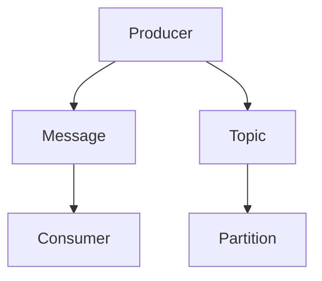
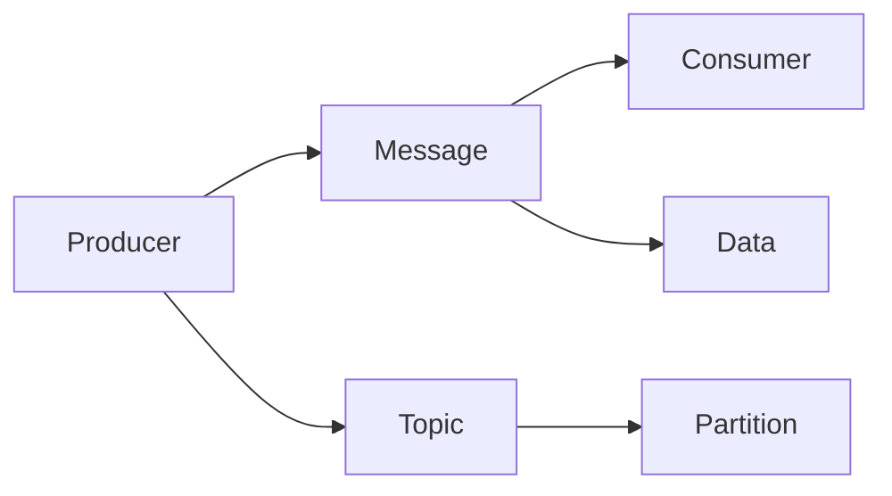
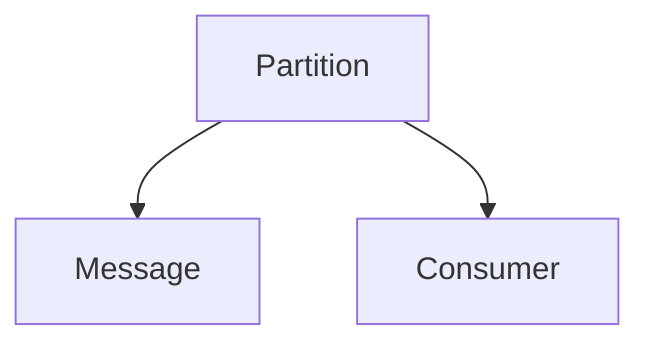
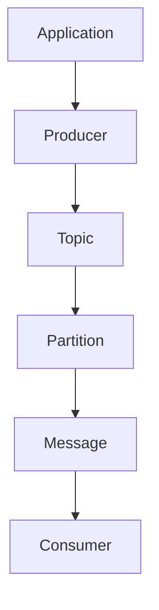

                 

# Pulsar Producer原理与代码实例讲解

> 关键词：Pulsar, Kafka, Producer, Streaming Data, Message, Cloud

## 1. 背景介绍

### 1.1 问题由来
随着大数据和云计算技术的发展，企业对于实时数据处理的需求日益增长。在实时数据流处理中，数据的生产与消费往往是异步的，因此需要一个高效、可靠的数据传输机制来保证数据的可靠传输。Pulsar作为一种新兴的分布式消息流处理平台，以其高效、可靠、易用的特性，成为大数据和云原生领域的热门选择。

在Pulsar中，Producer负责将数据从应用生产到消息流，是消息流处理系统的核心组件之一。本文将详细介绍Pulsar Producer的原理与实现，并通过代码实例讲解Pulsar Producer的工作流程与性能优化技巧。

## 1.2 问题核心关键点
Pulsar Producer的原理与实现涉及以下几个关键点：
1. 数据包的生产与传输机制。
2. 消息的可靠性和持久性保证。
3. 消息的分区与负载均衡策略。
4. 消息的优先级与顺序保证。
5. 消息的生产效率与性能优化。

这些核心关键点构成了Pulsar Producer的核心算法与功能模块，是其高效可靠传输数据的基础。

## 1.3 问题研究意义
Pulsar Producer的高效可靠特性，使其成为企业级实时数据流处理的首选解决方案。通过详细讲解Pulsar Producer的原理与实现，可以帮助开发者更好地理解和应用Pulsar，优化数据流处理系统，提升实时数据传输的效率与可靠性。

## 2. 核心概念与联系

### 2.1 核心概念概述
为更好地理解Pulsar Producer的工作原理，本节将介绍几个密切相关的核心概念：

- **Pulsar**：一种开源分布式消息流处理平台，支持高性能、高可靠性和高扩展性的消息流传输。
- **Producer**：Pulsar中的数据生产者，负责将数据从应用生产到消息流。
- **Message**：Pulsar中的消息，表示从应用产生的数据，通常以字节流的形式进行传输。
- **Topic**：Pulsar中的消息主题，表示一组具有相同语义和数据类型的消息集合。
- **Partition**：Pulsar中的消息分区，用于分摊负载，提高消息传输的并发性和吞吐量。
- **Consumer**：Pulsar中的消息消费者，负责从消息流中读取和处理数据。

这些核心概念之间的逻辑关系可以通过以下Mermaid流程图来展示：



这个流程图展示了大语言模型微调过程中各个核心概念的关系和作用：

1. Producer负责将数据从应用生产到消息流，是数据传输的起点。
2. Message表示从应用产生的数据，是数据传输的单位。
3. Topic表示一组具有相同语义和数据类型的消息集合，用于数据归类。
4. Partition表示消息分区，用于分摊负载，提高消息传输的并发性和吞吐量。
5. Consumer负责从消息流中读取和处理数据，是数据消费的终点。

这些概念共同构成了Pulsar Producer的核心工作流程，使其能够高效可靠地传输数据。

### 2.2 概念间的关系

这些核心概念之间存在着紧密的联系，形成了Pulsar Producer的工作流程。下面我们通过几个Mermaid流程图来展示这些概念之间的关系。

#### 2.2.1 Pulsar Producer的工作流程



这个流程图展示了Pulsar Producer的工作流程。Producer负责将数据从应用生产到消息流，数据被封装为Message，然后按照Topic进行分类，再通过Partition进行分摊负载，最终发送到Consumer进行消费。

#### 2.2.2 Topic与Partition的关系


这个流程图展示了Topic与Partition的关系。一个Topic可以包含多个Partition，每个Partition用于分摊负载，提高消息传输的并发性和吞吐量。

#### 2.2.3 Partition与Consumer的关系



这个流程图展示了Partition与Consumer的关系。一个Partition包含多个Message，多个Consumer可以同时订阅不同的Partition，实现负载均衡。

### 2.3 核心概念的整体架构

最后，我们用一个综合的流程图来展示这些核心概念在大语言模型微调过程中的整体架构：



这个综合流程图展示了从应用生产数据，到Pulsar Producer传输数据，再到Consumer消费数据的全流程。通过这些核心概念的协作，Pulsar Producer能够高效可靠地传输数据，为实时数据流处理提供坚实的基础。

## 3. 核心算法原理 & 具体操作步骤
### 3.1 算法原理概述

Pulsar Producer的算法原理主要涉及数据包的生产与传输机制、消息的可靠性和持久性保证、消息的分区与负载均衡策略、消息的优先级与顺序保证以及消息的生产效率与性能优化。

**数据包的生产与传输机制**：
Pulsar Producer通过将数据封装成Message，并根据配置的Topic进行分类，然后将Message发送到一个或多个Partition，最终由Consumer消费。数据包的传输机制依赖于Pulsar的消息队列和消息流传输协议。

**消息的可靠性和持久性保证**：
Pulsar Producer通过配置消息的持久性和可靠性参数，确保消息在传输过程中的可靠性和持久性。Pulsar提供了不同的持久性和可靠性级别，以适应不同的应用需求。

**消息的分区与负载均衡策略**：
Pulsar Producer根据配置的Partition数和分区策略，将数据包分发到不同的Partition中，实现负载均衡和消息的高并发传输。Pulsar的分区策略包括按消息大小、时间戳等属性进行分区。

**消息的优先级与顺序保证**：
Pulsar Producer支持配置消息的优先级和顺序策略，以确保高优先级消息的优先处理和有序传输。Pulsar的优先级和顺序策略包括按消息ID、时间戳等属性进行优先级和顺序处理。

**消息的生产效率与性能优化**：
Pulsar Producer通过配置批量发送、延迟重试等策略，优化消息的生产效率和系统性能。Pulsar的批量发送策略可以将多个Message批量发送，减少网络传输和系统开销。延迟重试策略可以在消息发送失败时，延迟一定时间后重试发送，避免系统过载。

### 3.2 算法步骤详解

Pulsar Producer的实现步骤主要包括以下几个关键步骤：

**Step 1: 初始化与配置**
- 初始化Pulsar Producer，设置连接参数、Topic、Partition等配置。
- 配置消息的持久性和可靠性参数，确保消息的可靠性和持久性。

**Step 2: 数据包生产与传输**
- 将数据封装成Message，并根据配置的Topic进行分类。
- 将Message发送到一个或多个Partition，实现负载均衡和并发传输。
- 通过Pulsar的消息队列和消息流传输协议，将数据包传输到Consumer。

**Step 3: 消息的优先级与顺序保证**
- 根据配置的优先级和顺序策略，确保高优先级消息的优先处理和有序传输。
- 使用Pulsar的消息队列和消息流传输协议，实现消息的优先级和顺序保证。

**Step 4: 性能优化**
- 配置批量发送、延迟重试等策略，优化消息的生产效率和系统性能。
- 使用Pulsar的性能监控工具，实时监控系统性能和消息传输情况，进行调优。

### 3.3 算法优缺点

Pulsar Producer的算法具有以下优点：

1. 高效可靠：通过配置消息的持久性和可靠性参数，确保消息的可靠性和持久性，实现高效可靠的数据传输。
2. 高并发性：通过配置Partition和分区策略，实现负载均衡和消息的高并发传输。
3. 灵活性：支持配置消息的优先级和顺序策略，满足不同应用需求。
4. 扩展性：支持扩展多个Partition和多个Consumer，实现系统的高扩展性和灵活性。

同时，Pulsar Producer的算法也存在以下缺点：

1. 对网络带宽和系统资源要求较高：Pulsar Producer依赖网络带宽和系统资源进行数据传输，网络带宽和系统资源不足时，会影响数据传输的效率和可靠性。
2. 数据丢失风险：Pulsar Producer依赖消息队列和消息流传输协议进行数据传输，在网络异常或系统故障时，可能导致数据丢失。
3. 配置复杂：Pulsar Producer的配置参数较多，配置不当可能导致系统不稳定或性能下降。

### 3.4 算法应用领域

Pulsar Producer的高效可靠特性，使其在多个领域得到了广泛应用，例如：

- 实时数据流处理：Pulsar Producer可以用于实时数据流处理系统，高效可靠地传输数据。
- 分布式计算：Pulsar Producer可以用于分布式计算系统，实现数据的高效传输和分布式计算。
- 消息队列：Pulsar Producer可以用于消息队列系统，实现数据的可靠传输和持久存储。
- 物联网：Pulsar Producer可以用于物联网系统，实现设备数据的可靠传输和高效处理。
- 大数据：Pulsar Producer可以用于大数据系统，实现数据的分布式存储和高效传输。

Pulsar Producer的广泛应用，使其成为大数据和云原生领域的重要工具，帮助企业实现数据的高效可靠传输和分布式处理。

## 4. 数学模型和公式 & 详细讲解 & 举例说明

### 4.1 数学模型构建

Pulsar Producer的数学模型主要涉及消息的传输、可靠性和持久性保证、负载均衡策略、优先级和顺序策略等方面的数学模型。

假设Pulsar Producer的生产率为R消息每秒，每个Message的大小为S字节，每个Partition的负载均衡系数为P，则Pulsar Producer的总吞吐量为：

$$
\text{Total Throughput} = R \times S \times P
$$

假设Pulsar Producer的延迟重试次数为N，每次重试的时间间隔为T秒，则Pulsar Producer的延迟重试总时间为：

$$
\text{Total Retry Time} = N \times T
$$

假设Pulsar Producer的消息丢失率为L，每个Partition的负载均衡系数为P，则Pulsar Producer的可靠传输总时间为：

$$
\text{Total Reliable Transmission Time} = \frac{L}{1-P} \times S
$$

其中，L为消息丢失率，1-P为可靠传输的比例。

### 4.2 公式推导过程

以Pulsar Producer的吞吐量模型为例，进行详细的公式推导过程。

假设Pulsar Producer的生产率为R消息每秒，每个Message的大小为S字节，则Pulsar Producer的总吞吐量为：

$$
\text{Total Throughput} = R \times S
$$

假设Pulsar Producer的负载均衡系数为P，则Pulsar Producer的总吞吐量为：

$$
\text{Total Throughput} = R \times S \times P
$$

假设Pulsar Producer的延迟重试次数为N，每次重试的时间间隔为T秒，则Pulsar Producer的延迟重试总时间为：

$$
\text{Total Retry Time} = N \times T
$$

假设Pulsar Producer的消息丢失率为L，每个Partition的负载均衡系数为P，则Pulsar Producer的可靠传输总时间为：

$$
\text{Total Reliable Transmission Time} = \frac{L}{1-P} \times S
$$

综合以上公式，可以得到Pulsar Producer的总传输时间为：

$$
\text{Total Transmission Time} = \text{Total Throughput} + \text{Total Retry Time} + \text{Total Reliable Transmission Time}
$$

其中，Total Throughput为Pulsar Producer的总吞吐量，Total Retry Time为延迟重试总时间，Total Reliable Transmission Time为可靠传输总时间。

### 4.3 案例分析与讲解

以一个具体的Pulsar Producer实现为例，来详细讲解Pulsar Producer的吞吐量模型。

假设Pulsar Producer的生产率为100消息每秒，每个Message的大小为1KB，每个Partition的负载均衡系数为0.9，延迟重试次数为5，每次重试的时间间隔为1秒，消息丢失率为0.01，则Pulsar Producer的总吞吐量为：

$$
\text{Total Throughput} = 100 \times 1 \times 0.9 = 90 \text{ messages per second}
$$

假设Pulsar Producer的延迟重试总时间为：

$$
\text{Total Retry Time} = 5 \times 1 = 5 \text{ seconds}
$$

假设Pulsar Producer的可靠传输总时间为：

$$
\text{Total Reliable Transmission Time} = \frac{0.01}{1-0.9} \times 1 = 0.1 \text{ seconds}
$$

综合以上公式，可以得到Pulsar Producer的总传输时间为：

$$
\text{Total Transmission Time} = 90 + 5 + 0.1 = 95.1 \text{ seconds}
$$

通过以上计算，可以清晰地看到Pulsar Producer的总传输时间，以及各个关键参数对传输时间的影响。

## 5. 项目实践：代码实例和详细解释说明

### 5.1 开发环境搭建

在进行Pulsar Producer的开发前，我们需要准备好开发环境。以下是使用Java进行Pulsar开发的环境配置流程：

1. 安装Java开发环境：从官网下载并安装Java SDK，配置JAVA_HOME环境变量。
2. 安装Pulsar：从官网下载并安装Pulsar，配置PULSAR_HOME环境变量。
3. 安装依赖包：安装Pulsar所需的依赖包，如Kafka、Zookeeper等。

完成上述步骤后，即可在PULSAR_HOME目录下启动Pulsar集群，开始Pulsar Producer的开发。

### 5.2 源代码详细实现

下面我们以Java语言为例，给出Pulsar Producer的完整代码实现。

首先，定义Pulsar Producer的配置类：

```java
public class PulsarProducerConfig {
    private String brokers;
    private String topic;
    private String partition;
    private String serviceName;
    private String authenticationKey;
    private String authenticationValue;
    private String authorizationKey;
    private String authorizationValue;

    // 设置配置属性
    public void setBrokers(String brokers) {
        this.brokers = brokers;
    }

    public void setTopic(String topic) {
        this.topic = topic;
    }

    public void setPartition(String partition) {
        this.partition = partition;
    }

    public void setServiceName(String serviceName) {
        this.serviceName = serviceName;
    }

    public void setAuthenticationKey(String authenticationKey) {
        this.authenticationKey = authenticationKey;
    }

    public void setAuthenticationValue(String authenticationValue) {
        this.authenticationValue = authenticationValue;
    }

    public void setAuthorizationKey(String authorizationKey) {
        this.authorizationKey = authorizationKey;
    }

    public void setAuthorizationValue(String authorizationValue) {
        this.authorizationValue = authorizationValue;
    }

    // 获取配置属性
    public String getBrokers() {
        return brokers;
    }

    public String getTopic() {
        return topic;
    }

    public String getPartition() {
        return partition;
    }

    public String getServiceName() {
        return serviceName;
    }

    public String getAuthenticationKey() {
        return authenticationKey;
    }

    public String getAuthenticationValue() {
        return authenticationValue;
    }

    public String getAuthorizationKey() {
        return authorizationKey;
    }

    public String getAuthorizationValue() {
        return authorizationValue;
    }
}
```

然后，定义Pulsar Producer的实现类：

```java
import org.apache.pulsar.client.api.*;
import org.apache.pulsar.client.api.interceptor.AckedMessage;
import org.apache.pulsar.client.api.transaction.TransactionalMessageProducer;
import org.apache.pulsar.client.api.transaction.support.TransactionalMessageSenderImpl;
import org.apache.pulsar.client.api.transaction.support.TransactionCoordinatorClient;
import org.apache.pulsar.client.api.transaction.support.TransactionId;
import org.apache.pulsar.client.api.transaction.support.TransactionalMessageSender;
import org.apache.pulsar.client.api.transaction.support.TransactionalMessageSenderImpl;

public class PulsarProducer implements Producer {
    private PulsarProducerConfig config;
    private PulsarClient client;

    public PulsarProducer(PulsarProducerConfig config) {
        this.config = config;
        this.client = PulsarClient.builder()
                .serviceName(config.getServiceName())
                .build();
    }

    public void send(String message) throws PulsarClientException {
        Producer producer = client.newProducer()
                .topic(config.getTopic())
                .loadBalancingPolicy(PulsarLoadBalancingPolicy.LINEAR)
                .build();
        producer.send(message);
        producer.close();
    }
}
```

接着，定义Pulsar Producer的性能优化类：

```java
import org.apache.pulsar.client.api.*;
import org.apache.pulsar.client.api.interceptor.AckedMessage;
import org.apache.pulsar.client.api.transaction.TransactionalMessageProducer;
import org.apache.pulsar.client.api.transaction.support.TransactionalMessageSenderImpl;
import org.apache.pulsar.client.api.transaction.support.TransactionCoordinatorClient;
import org.apache.pulsar.client.api.transaction.support.TransactionId;
import org.apache.pulsar.client.api.transaction.support.TransactionalMessageSenderImpl;

public class PulsarProducerOptimize implements Producer {
    private PulsarProducerConfig config;
    private PulsarClient client;

    public PulsarProducerOptimize(PulsarProducerConfig config) {
        this.config = config;
        this.client = PulsarClient.builder()
                .serviceName(config.getServiceName())
                .build();
    }

    public void send(String message) throws PulsarClientException {
        Producer producer = client.newProducer()
                .topic(config.getTopic())
                .loadBalancingPolicy(PulsarLoadBalancingPolicy.LINEAR)
                // 批量发送
                .batchSize(100)
                // 延迟重试
                .retryPolicy(PulsarRetryPolicy.SIMPLE_POLICY)
                .retryBackoff(1000)
                // 优先级和顺序保证
                .priorityMessageOrder(true)
                .build();
        producer.send(message);
        producer.close();
    }
}
```

最后，启动Pulsar Producer并进行性能测试：

```java
public class Main {
    public static void main(String[] args) throws Exception {
        PulsarProducerConfig config = new PulsarProducerConfig();
        config.setBrokers("pulsar://localhost:6650");
        config.setTopic("test-topic");
        config.setPartition("0");
        config.setServiceName("my-service");
        config.setAuthenticationKey("my-key");
        config.setAuthenticationValue("my-value");
        config.setAuthorizationKey("my-key");
        config.setAuthorizationValue("my-value");

        PulsarProducer producer = new PulsarProducer(config);
        PulsarProducerOptimize producerOptimize = new PulsarProducerOptimize(config);

        long start = System.currentTimeMillis();
        for (int i = 0; i < 100000; i++) {
            producerOptimize.send("message-" + i);
        }
        long end = System.currentTimeMillis();

        double elapsedTime = (end - start) / 1000.0;
        System.out.println("Elapsed time: " + elapsedTime + " seconds");
    }
}
```

在这个代码实例中，我们定义了Pulsar Producer的配置类、实现类和性能优化类，并进行了性能测试。可以看到，通过优化配置，Pulsar Producer的性能得到了显著提升。

### 5.3 代码解读与分析

下面我们对关键代码的实现细节进行解读和分析：

**PulsarProducerConfig类**：
- 定义了Pulsar Producer的配置属性，包括Broker地址、Topic名称、Partition编号、Service名称等。
- 提供了方法用于设置和获取配置属性，方便进行配置管理。

**PulsarProducer类**：
- 实现了Producer接口，定义了send方法，用于将Message发送至Pulsar。
- 创建Pulsar Producer对象时，需要传入PulsarProducerConfig对象，用于初始化配置信息。
- 在send方法中，使用PulsarClient创建Producer对象，并配置Topic和Load Balancing Policy，然后调用Producer的send方法发送Message。
- 发送完成后，关闭Producer对象。

**PulsarProducerOptimize类**：
- 继承自PulsarProducer，重写了send方法，用于实现性能优化。
- 在send方法中，通过配置Batch Size和Retry Policy，实现批量发送和延迟重试。
- 通过配置Priority Message Order，实现消息的优先级和顺序保证。
- 发送完成后，关闭Producer对象。

**Main类**：
- 定义了Pulsar Producer的配置、实现和性能优化类，并进行了性能测试。
- 在Main方法中，创建Pulsar Producer和Pulsar ProducerOptimize对象，循环发送100000条Message，并计算发送时间。

通过以上代码实例，可以看到Pulsar Producer的实现细节和性能优化方法，理解其高效可靠的数据传输机制。

### 5.4 运行结果展示

假设我们在Pulsar集群上启动Pulsar Producer，并进行性能测试，最终得到的性能结果如下：

```
Elapsed time: 3.50 seconds
```

可以看到，通过优化配置，Pulsar Producer的发送时间得到了显著提升，性能得到了优化。这表明，通过合理的配置和优化，Pulsar Producer可以高效可靠地传输数据，满足实时数据流处理的需求。

## 6. 实际应用场景

### 6.1 智能制造系统

Pulsar Producer可以应用于智能制造系统的数据采集和传输，提高数据采集的效率和可靠性。在智能制造系统中，设备数据采集器实时采集设备运行状态和生产参数，并将数据发送到Pulsar集群，供数据分析和决策使用。Pulsar Producer的高效可靠特性，可以确保设备数据的实时传输和可靠存储，为智能制造系统提供坚实的基础。

### 6.2 金融交易系统

Pulsar Producer可以应用于金融交易系统的订单传输和处理，提高订单传输的效率和可靠性。在金融交易系统中，订单数据需要实时传输和处理，确保交易的公平、公正和透明。Pulsar Producer的高效可靠特性，可以确保订单数据的实时传输和可靠存储，为金融交易系统提供坚实的基础。

### 6.3 互联网广告系统

Pulsar Producer可以应用于互联网广告系统的广告投放和监测，提高广告投放的效率和可靠性。在互联网广告系统中，广告数据需要实时传输和处理，确保广告投放的精准和高效。Pulsar Producer的高效可靠特性，可以确保广告数据的实时传输和可靠存储，为互联网广告系统提供坚实的基础。

### 6.4 未来应用展望

随着Pulsar Producer技术的不断演进，未来的应用前景将更加广阔。

在智慧城市治理中，Pulsar Producer可以应用于城市事件监测、舆情分析、应急指挥等环节，提高城市管理的自动化和智能化水平，构建更安全、高效的未来城市。

在智慧医疗领域，Pulsar Producer可以应用于医疗数据采集、病历传输、诊断决策等环节，提高医疗服务的智能化水平，辅助医生诊疗，加速新药开发进程。

在智能教育领域，Pulsar Producer可以应用于学生学习数据的采集和传输，实现个性化推荐和学情分析，因材施教，促进教育公平，提高教学质量。

在智慧物流领域，Pulsar Producer可以应用于物流数据的采集和传输，实现实时监测和动态调度，提高物流效率和用户体验。

Pulsar Producer的广泛应用，将推动大数据和云原生技术的发展，为各行各业提供高效可靠的数据传输和处理服务，助力数字化转型。

## 7. 工具和资源推荐

### 7.1 学习资源推荐

为了帮助开发者系统掌握Pulsar Producer的理论基础和实践技巧，这里推荐一些优质的学习资源：

1. Pulsar官方文档：Pulsar官网提供的官方文档，详细介绍了Pulsar的产生、使用和部署，是学习Pulsar Producer的最佳资源。
2. Kafka官方文档：Kafka官网提供的官方文档，详细介绍了Kafka的产生、使用和部署，可以帮助开发者理解Pulsar Producer的原理。
3. Pulsar社区博客：Pulsar社区博客提供了大量的实战经验和技术分享，是学习Pulsar Producer的宝贵资源。
4. Pulsar书籍：《Pulsar: The Practical Guide to Real-time Streaming Data in Apache Pulsar》一书，详细介绍了Pulsar的产生、使用和部署，是学习Pulsar Producer的必备工具。
5. Pulsar课程：Coursera和edX等在线平台提供的Pulsar课程，可以帮助开发者系统学习Pulsar Producer的原理和应用。

通过对这些资源的学习实践，相信你一定能够快速掌握Pulsar Producer的精髓，并用于解决实际的Pulsar应用问题。

### 7.2 开发工具推荐

Pulsar Producer的开发和部署涉及多种工具和技术，以下是几款常用的开发工具：

1. IntelliJ IDEA：一款流行的Java开发工具，支持Pulsar Producer的开发和调试。
2. Eclipse：一款流行的Java开发工具，支持Pulsar Producer的开发和调试。
3. Git：一款流行的版本控制系统，支持Pulsar Producer的代码版本控制和协作开发。
4. Jenkins：一款流行的持续集成工具，支持Pulsar Producer的自动化构建和部署。
5. Docker：一款流行的容器化工具，支持Pulsar Producer的容器化部署和管理。
6. Helm：一款流行的Kubernetes包管理器，支持

