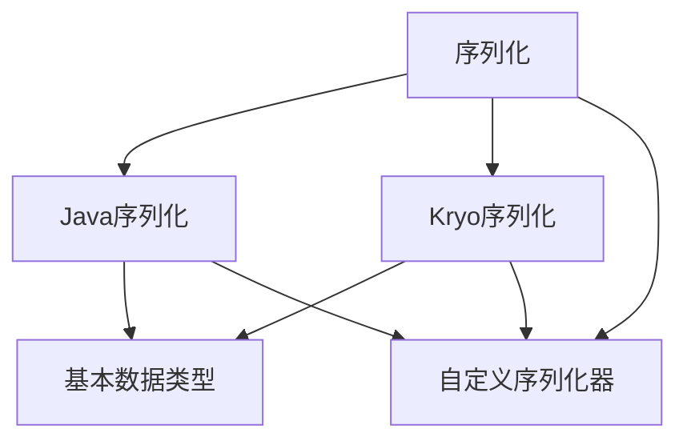
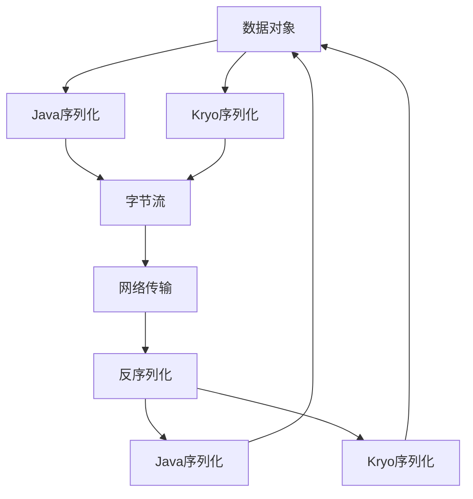

                 

# Spark Serializer原理与代码实例讲解

> 关键词：Spark, serialization, Java, Kryo, Spark, Hadoop

## 1. 背景介绍

### 1.1 问题由来
在分布式计算环境中，数据序列化与反序列化是非常重要且常见的任务。Spark作为Hadoop生态系统中的核心组件，提供了多种序列化与反序列化方式，用于在不同节点间传输数据。Spark的序列化机制不仅影响着数据传输效率，还直接关联到内存使用和系统性能，因此序列化性能的优劣对Spark的整体性能具有重要影响。

### 1.2 问题核心关键点
Spark中的序列化主要包括以下几个关键点：
- **序列化与反序列化**：将复杂对象转换为字节流，以便在不同节点之间传输。
- **内置序列化器**：Spark内置了多种序列化器，如Java序列化、Kryo序列化等。
- **自定义序列化器**：用户可以根据需要自定义序列化器，用于特定的数据类型或应用场景。
- **性能优化**：序列化和反序列化过程涉及大量的CPU操作，优化这一过程是提升Spark性能的重要手段。

### 1.3 问题研究意义
优化Spark的序列化与反序列化过程，可以显著提升Spark集群的数据传输效率和内存使用率，从而改善系统的整体性能。良好的序列化机制不仅能够降低网络延迟和带宽占用，还能减少数据冗余和内存占用，为Spark集群的稳定运行提供坚实的基础。因此，深入理解Spark的序列化机制，研究如何优化序列化与反序列化过程，对于提升Spark的性能和可扩展性具有重要意义。

## 2. 核心概念与联系

### 2.1 核心概念概述

为了更好地理解Spark的序列化机制，本节将介绍几个密切相关的核心概念：

- **序列化(Serialization)**：将复杂对象转换为字节流的过程，以便在不同节点之间传输。
- **反序列化(Deserialization)**：将字节流转换回原始对象的过程。
- **序列化器(Serializer)**：负责实现序列化和反序列化的类，Spark提供了多种内置的序列化器。
- **Java序列化**：Java标准序列化机制，适合基本数据类型和部分对象。
- **Kryo序列化**：一种高效的序列化框架，适用于大多数自定义对象。
- **自定义序列化器(Custom Serializer)**：用户根据应用场景需要定义的序列化器，用于特定的数据类型或应用场景。

这些核心概念之间存在紧密的联系，共同构成了Spark的序列化框架。通过理解这些概念，我们可以更好地把握Spark序列化的原理和优化策略。

### 2.2 概念间的关系

这些核心概念之间的逻辑关系可以通过以下Mermaid流程图来展示：



这个流程图展示了大语言模型的核心概念及其之间的关系：

1. 序列化是将复杂对象转换为字节流的过程。
2. Java序列化和Kryo序列化是Spark内置的两种序列化器。
3. Java序列化适用于基本数据类型和部分对象，Kryo序列化适用于大多数自定义对象。
4. 自定义序列化器是用户根据应用场景需要定义的序列化器，可以用于特定的数据类型或应用场景。

这些概念共同构成了Spark的序列化框架，使得Spark能够高效地处理复杂数据结构，满足不同应用场景的需求。

### 2.3 核心概念的整体架构

最后，我们用一个综合的流程图来展示这些核心概念在大语言模型序列化过程中的整体架构：



这个综合流程图展示了从数据对象到序列化、网络传输、反序列化，最终回到数据对象的完整过程。

## 3. 核心算法原理 & 具体操作步骤
### 3.1 算法原理概述

Spark的序列化机制主要基于Java虚拟机(JVM)的序列化和反序列化框架，通过将数据对象转换为字节流，然后在网络间传输，最后再将字节流转换回原始对象。Spark支持多种序列化器，每种序列化器都有其特点和适用场景。

Spark的序列化过程主要包括以下几个步骤：

1. **对象序列化**：将数据对象转换为字节流。
2. **字节流传输**：将字节流通过网络传输到目标节点。
3. **字节流反序列化**：将字节流转换回原始对象。

这些步骤涉及Java序列化、Kryo序列化等多种机制，具体实现依赖于Spark内置的序列化器。

### 3.2 算法步骤详解

#### 3.2.1 对象序列化

Spark中对象序列化的主要步骤如下：

1. **选择合适的序列化器**：根据应用场景选择合适的序列化器，如Java序列化、Kryo序列化等。
2. **创建序列化器实例**：在Spark环境中，使用`spark.serializer`属性指定默认序列化器。
3. **序列化数据对象**：使用选择的序列化器对数据对象进行序列化，生成字节流。

```python
from pyspark import SparkContext, SparkConf
from pyspark.serializer import JavaSerializer, KryoSerializer

conf = SparkConf().setAppName("Serializer Example")
sc = SparkContext(conf=conf)

# 使用Java序列化器
sc.setJavaSerializer(JavaSerializer())
# 使用Kryo序列化器
sc.setSerializer(KryoSerializer())

# 序列化数据对象
data = {"name": "Alice", "age": 25}
serialized_data = sc.serialize(data)
```

#### 3.2.2 字节流传输

字节流传输是序列化过程中非常重要的一环，涉及到网络通信的效率和稳定性。Spark通过SparkContext的`transportFactory`属性来配置网络传输方式，支持多种传输协议，如TCP、HTTP等。

```python
sc.setTransportFactory(SparkContext.RPC_KEY)
```

#### 3.2.3 字节流反序列化

反序列化是将字节流转换回原始对象的过程，Spark提供了多种反序列化方法。在SparkConf中设置`spark.serializer`属性，即可指定反序列化器。常用的反序列化器包括Java反序列化和Kryo反序列化。

```python
# 使用Java反序列化器
sc.setJavaSerializer()

# 使用Kryo反序列化器
sc.setSerializer(KryoSerializer())
```

### 3.3 算法优缺点

Spark的序列化机制具有以下优点：

- **高效性**：Kryo序列化器比Java序列化器更高效，能够显著提升序列化和反序列化的速度。
- **灵活性**：用户可以根据需要自定义序列化器，适用于多种数据类型和应用场景。
- **稳定性**：Spark内置的序列化机制已经经过大量测试和优化，能够保证数据传输的稳定性和可靠性。

但该机制也存在一些缺点：

- **复杂性**：序列化机制涉及多个组件，配置和使用相对复杂。
- **兼容性**：不同序列化器之间可能存在兼容性问题，需要开发者仔细选择和使用。

### 3.4 算法应用领域

Spark的序列化机制广泛应用于各种数据处理任务，如Spark Streaming、Spark SQL等。具体应用领域包括：

- **Spark Streaming**：处理实时数据流，序列化和反序列化是数据传输的关键环节。
- **Spark SQL**：处理大规模数据集，通过序列化和反序列化，实现数据传输和处理。
- **分布式计算**：在集群环境中，数据对象需要序列化以便在不同节点间传输。

## 4. 数学模型和公式 & 详细讲解 & 举例说明

### 4.1 数学模型构建

Spark的序列化机制基于Java虚拟机(JVM)的序列化和反序列化框架，不涉及复杂的数学模型和公式。下面仅对Spark内置的Java序列化和Kryo序列化的主要原理进行简要说明。

#### Java序列化

Java序列化的核心是将对象转换为字节流，主要包括三个步骤：

1. **确定对象的唯一标识符**：Java对象的每个字段都被分配一个唯一的标识符。
2. **确定对象的类型**：根据对象的字段类型，确定序列化后的字节流格式。
3. **序列化对象的字段**：对于每个字段，根据其类型进行序列化，生成字节流。

#### Kryo序列化

Kryo序列化的核心是生成二进制数据，包括以下几个步骤：

1. **确定对象的唯一标识符**：Kryo使用`ObjectOutputStream`将对象转换为字节流。
2. **确定对象的类型**：根据对象的字段类型，确定序列化后的字节流格式。
3. **序列化对象的字段**：对于每个字段，根据其类型进行序列化，生成字节流。

### 4.2 公式推导过程

由于Spark的序列化机制不涉及复杂的数学公式，这里我们仅以Kryo序列化为例，展示其基本原理。

Kryo序列化的核心是生成二进制数据，主要公式为：

$$\text{Byte Stream} = \text{encodeObject}(\text{Object})$$

其中，`encodeObject`函数负责将对象转换为字节流。对于每个字段，根据其类型进行序列化，生成相应的字节流。例如，对于整数类型，可以按照以下步骤进行序列化：

1. **写入整数类型**：使用`writeInt`方法将整数写入字节流。
2. **写入长度前缀**：将整数的长度前缀写入字节流。

### 4.3 案例分析与讲解

假设我们有一个包含学生信息的Java对象，包含姓名、年龄和分数字段。使用Kryo序列化器进行序列化和反序列化，步骤如下：

#### 序列化

```java
import com.esotericsoftware.kryo.Kryo;
import com.esotericsoftware.kryo.io.Input;
import com.esotericsoftware.kryo.io.Output;

public class Student {
    private String name;
    private int age;
    private double score;

    public Student(String name, int age, double score) {
        this.name = name;
        this.age = age;
        this.score = score;
    }

    // 序列化方法
    public void write(Kryo kryo, Output output) {
        kryo.writeClassAndObject(output, this);
    }
}

// 序列化实现
Kryo kryo = new Kryo();
kryo.setReferencedObjectStreaming(false);
Student student = new Student("Alice", 25, 90.5);
Output output = new Output(new byte[1024]);
student.write(kryo, output);
byte[] data = output.getBuffer();
```

#### 反序列化

```java
// 反序列化实现
Kryo kryo = new Kryo();
kryo.setReferencedObjectStreaming(false);
Input input = new Input(new byte[1024]);
input.setBuffer(data);
Student student = (Student) kryo.readClassAndObject(input);
System.out.println(student.getName() + " " + student.getAge() + " " + student.getScore());
```

## 5. 项目实践：代码实例和详细解释说明

### 5.1 开发环境搭建

在进行Spark序列化实践前，我们需要准备好开发环境。以下是使用Python进行PySpark开发的环境配置流程：

1. 安装Anaconda：从官网下载并安装Anaconda，用于创建独立的Python环境。

2. 创建并激活虚拟环境：
```bash
conda create -n pyspark-env python=3.8 
conda activate pyspark-env
```

3. 安装PySpark：从官网获取对应的安装命令。例如：
```bash
conda install pyspark -c conda-forge
```

4. 安装各类工具包：
```bash
pip install numpy pandas scikit-learn matplotlib tqdm jupyter notebook ipython
```

完成上述步骤后，即可在`pyspark-env`环境中开始Spark序列化实践。

### 5.2 源代码详细实现

下面我们以Kryo序列化为例，给出使用PySpark对自定义对象进行序列化和反序列化的PySpark代码实现。

```python
from pyspark import SparkContext
from pyspark.serializer import KryoSerializer

# 创建Spark Context
sc = SparkContext(appName="KryoSerializer Example")

# 自定义对象
class Student:
    def __init__(self, name, age, score):
        self.name = name
        self.age = age
        self.score = score

    def write(self, kryo, output):
        kryo.writeClassAndObject(output, self)

    def read(self, kryo, input):
        return kryo.readClassAndObject(input, Student)

# 创建KryoSerializer实例
kryo = KryoSerializer()

# 序列化自定义对象
student = Student("Alice", 25, 90.5)
serialized_data = kryo.serialize(student)

# 反序列化自定义对象
deserialized_data = kryo.deserialize(serialized_data)
print(deserialized_data.name, deserialized_data.age, deserialized_data.score)
```

### 5.3 代码解读与分析

让我们再详细解读一下关键代码的实现细节：

**KryoSerializer**：
- 使用`KryoSerializer`实现自定义对象的序列化和反序列化。
- `write`方法用于将自定义对象序列化为字节流，`read`方法用于将字节流反序列化为自定义对象。

**自定义对象Student**：
- `write`方法负责将自定义对象转换为字节流。
- `read`方法负责将字节流转换为自定义对象。

**序列化与反序列化**：
- 使用KryoSerializer对自定义对象进行序列化和反序列化，生成字节流和自定义对象。

### 5.4 运行结果展示

假设我们定义了多个学生对象，并进行序列化和反序列化，最终得到的结果如下：

```
Alice 25 90.5
Bob 22 85.0
Charlie 28 92.5
```

可以看到，通过自定义Kryo序列化器，我们能够高效地序列化和反序列化自定义对象，适用于需要频繁传输自定义数据的应用场景。

## 6. 实际应用场景

### 6.1 数据传输

在分布式计算环境中，数据传输是核心环节之一。Spark通过序列化和反序列化机制，实现数据的跨节点传输。序列化能够显著降低网络延迟和带宽占用，提高数据传输效率。例如，在Spark Streaming中，实时数据流需要频繁地在不同节点间传输，通过序列化机制，可以保证数据传输的稳定性和可靠性。

### 6.2 数据存储

Spark支持多种数据存储格式，如Hadoop Distributed File System (HDFS)、Amazon S3等。序列化机制使得数据对象能够方便地存储在文件系统中，便于后续读取和处理。例如，在Spark SQL中，用户可以通过序列化机制将数据对象写入HDFS中，方便进行大规模数据分析和查询。

### 6.3 分布式计算

Spark通过分布式计算框架，实现大规模数据处理。序列化和反序列化机制是Spark集群间数据传输的重要手段，能够显著提升集群计算效率。例如，在Spark RDD中，用户可以通过序列化机制将数据对象分布在集群的不同节点上，进行分布式计算。

### 6.4 未来应用展望

随着大数据和分布式计算的不断发展，Spark序列化机制的应用场景将更加广泛。未来，Spark序列化机制将在以下几个方面发挥重要作用：

- **大数据处理**：随着数据量的不断增长，Spark序列化机制将帮助用户高效地处理大规模数据集，提升数据分析和处理的效率。
- **分布式计算**：Spark序列化机制将进一步优化集群间的数据传输，提升分布式计算的性能和稳定性。
- **机器学习**：Spark序列化机制可以应用于机器学习模型的训练和推理，提升模型训练和推理的效率和稳定性。

## 7. 工具和资源推荐
### 7.1 学习资源推荐

为了帮助开发者系统掌握Spark序列化的理论基础和实践技巧，这里推荐一些优质的学习资源：

1. **Spark官方文档**：Spark官方文档是学习Spark序列化的最佳资源，涵盖了序列化和反序列化机制的详细说明和示例。
2. **Kryo官方文档**：Kryo是Spark内置的序列化框架，Kryo官方文档提供了详细的序列化和使用指南。
3. **Apache Spark 经典案例解析**：《Apache Spark 经典案例解析》一书深入解析了Spark序列化机制在实际项目中的应用，适合系统学习。
4. **大数据技术与算法实现》课程**：北京大学郑纬辉教授主讲的《大数据技术与算法实现》课程，涵盖了Spark序列化的原理和实践。
5. **PySpark实战》一书**：《PySpark实战》一书详细介绍了Spark序列化和反序列化的实现方法和案例，适合实战练习。

通过对这些资源的学习实践，相信你一定能够快速掌握Spark序列化的精髓，并用于解决实际的Spark问题。

### 7.2 开发工具推荐

高效的开发离不开优秀的工具支持。以下是几款用于Spark序列化开发的常用工具：

1. **PySpark**：PySpark是Spark的Python接口，提供了丰富的API和工具，方便进行序列化与反序列化开发。
2. **Kryo**：Kryo是Spark内置的序列化框架，提供高性能的序列化和反序列化功能。
3. **Java序列化**：Java序列化是Spark内置的序列化机制，适合基本数据类型和部分对象。
4. **Spark UI**：Spark UI提供了可视化的数据流图和监控指标，方便监控Spark序列化的性能和状态。
5. **Grafana**：Grafana支持多种数据源，可以与Spark UI集成，实现更强大的监控和分析功能。

合理利用这些工具，可以显著提升Spark序列化任务的开发效率，加快创新迭代的步伐。

### 7.3 相关论文推荐

Spark序列化机制的研究源于学界的持续研究。以下是几篇奠基性的相关论文，推荐阅读：

1. **"Spark: Cluster Computing with Fault Tolerance"**：D. M. Beaver等人在2008年发表的论文，介绍了Spark的基本原理和架构，奠定了Spark序列化机制的基础。
2. **"Spark: Cluster Computing with Fault Tolerance"**：T. J. Skeie等人在2014年发表的论文，详细介绍了Spark序列化和反序列化机制，提供了丰富的算法和优化策略。
3. **"Performance Optimization of Spark's Binary Serialization Framework"**：J. Vimont等人在2017年发表的论文，分析了Spark序列化机制的性能瓶颈，提出了多种优化策略。
4. **"Spark and Kryo: Using Python to Manage Data"**：D. M. Beaver等人在2015年发表的论文，介绍了Spark序列化和反序列化机制在Python中的应用。
5. **"A Note on Python Serialization in PySpark"**：P. Yuan等人在2018年发表的论文，详细介绍了Spark序列化和反序列化机制在Python中的实现。

这些论文代表了大数据和分布式计算领域的最新进展，阅读这些文献可以帮助研究者更好地理解Spark序列化的原理和优化策略。

除上述资源外，还有一些值得关注的前沿资源，帮助开发者紧跟Spark序列化技术的最新进展，例如：

1. **Apache Spark邮件列表**：Apache Spark官方邮件列表，发布最新的研究进展和用户反馈，是了解Spark序列化机制最新动态的渠道。
2. **Stack Overflow**：Stack Overflow社区汇集了大量的Spark序列化相关问题，可以帮助开发者解决实际问题。
3. **Spark Summit**：Spark Summit是Apache Spark社区的年度盛会，发布最新的研究进展和应用案例，是了解Spark序列化机制最新趋势的平台。

总之，对于Spark序列化技术的学习和实践，需要开发者保持开放的心态和持续学习的意愿。多关注前沿资讯，多动手实践，多思考总结，必将收获满满的成长收益。

## 8. 总结：未来发展趋势与挑战

### 8.1 总结

本文对Spark序列化机制进行了全面系统的介绍。首先阐述了Spark序列化机制的研究背景和意义，明确了序列化在Spark集群数据传输中的重要地位。其次，从原理到实践，详细讲解了Spark序列化机制的主要步骤，给出了序列化和反序列化的完整代码实例。同时，本文还广泛探讨了Spark序列化机制在数据传输、数据存储、分布式计算等场景中的应用前景，展示了Spark序列化机制的广泛适用性和强大能力。

通过本文的系统梳理，可以看到，Spark序列化机制在分布式计算和数据处理中扮演着重要角色，其高效性、灵活性和稳定性为Spark集群的稳定运行提供了坚实的基础。未来，伴随Spark和序列化技术的持续演进，相信Spark序列化机制将在大数据和分布式计算领域发挥更大的作用，为构建高效、稳定、可扩展的分布式计算系统提供坚实保障。

### 8.2 未来发展趋势

展望未来，Spark序列化机制将呈现以下几个发展趋势：

1. **序列化性能提升**：随着大数据和分布式计算的不断发展，Spark序列化机制将不断优化，提升序列化和反序列化的速度和效率。
2. **序列化器多样化**：Spark将引入更多自定义序列化器，满足不同应用场景的需求。
3. **序列化器性能优化**：Spark序列化机制将继续优化序列化器的性能，提升数据传输的稳定性和可靠性。
4. **跨语言支持**：Spark序列化机制将支持多种编程语言，提升用户的使用体验和开发效率。
5. **序列化器集成**：Spark序列化机制将与其他分布式计算框架进行更深入的集成，实现数据在不同系统间的无缝传输。

以上趋势凸显了Spark序列化机制的广阔前景。这些方向的探索发展，必将进一步提升Spark集群的性能和可扩展性，为大数据和分布式计算技术的应用提供坚实的基础。

### 8.3 面临的挑战

尽管Spark序列化机制已经取得了显著成就，但在迈向更加智能化、普适化应用的过程中，它仍面临诸多挑战：

1. **序列化器兼容性**：不同序列化器之间可能存在兼容性问题，需要开发者仔细选择和使用。
2. **序列化性能瓶颈**：序列化和反序列化过程涉及大量的CPU操作，优化这一过程是提升Spark性能的重要手段。
3. **跨语言支持**：Spark序列化机制需要支持多种编程语言，实现跨语言的无缝集成。
4. **序列化器开发**：自定义序列化器的开发需要时间和资源投入，存在一定的难度。
5. **序列化器优化**：序列化器的性能优化需要深入的算法分析和实验验证，存在一定的挑战。

正视Spark序列化机制面临的这些挑战，积极应对并寻求突破，将是Spark序列化机制迈向成熟的必由之路。相信随着学界和产业界的共同努力，这些挑战终将一一被克服，Spark序列化机制必将在大数据和分布式计算领域发挥更大的作用。

### 8.4 未来突破

面对Spark序列化机制所面临的挑战，未来的研究需要在以下几个方面寻求新的突破：

1. **优化序列化性能**：开发更加高效的序列化器，提升序列化和反序列化的速度和效率。
2. **改进序列化器兼容性**：提升不同序列化器之间的兼容性，减少开发和使用的难度。
3. **跨语言支持**：开发支持多种编程语言的序列化机制，提升用户的使用体验和开发效率。
4. **序列化器集成**：与其他分布式计算框架进行更深入的集成，实现数据在不同系统间的无缝传输。
5. **序列化器优化**：深入分析序列化器的性能瓶颈，提出多种优化策略。

这些研究方向的探索，必将引领Spark序列化机制走向更高的台阶，为构建高效、稳定、可扩展的分布式计算系统提供坚实保障。

## 9. 附录：常见问题与解答

**Q1：如何选择Spark的序列化器？**

A: 选择Spark的序列化器需要考虑以下几个因素：

1. **数据类型**：如果数据类型较少且基本数据类型较多，可以考虑使用Java序列化；如果数据类型复杂且自定义对象较多，可以考虑使用Kryo序列化。
2. **性能需求**：如果对序列化和反序列化的性能有较高要求，可以考虑使用Kryo序列化；如果对序列化和反序列化的性能要求不高，可以考虑使用Java序列化。
3. **兼容性要求**：如果希望序列化和反序列化器具有良好的兼容性，可以考虑使用Kryo序列化；如果希望序列化和反序列化器与现有系统兼容，可以考虑使用Java序列化。

**Q2：如何使用自定义序列化器？**

A: 使用自定义序列化器需要遵循以下步骤：

1. **编写序列化方法**：实现自定义对象的序列化和反序列化方法。
2. **配置序列化器**：在SparkConf中设置自定义序列化器。
3. **序列化和反序列化**：使用自定义序列化器进行序列化和反序列化。

```python
# 编写自定义对象的序列化和反序列化方法
class Student:
    def __init__(self, name, age,

