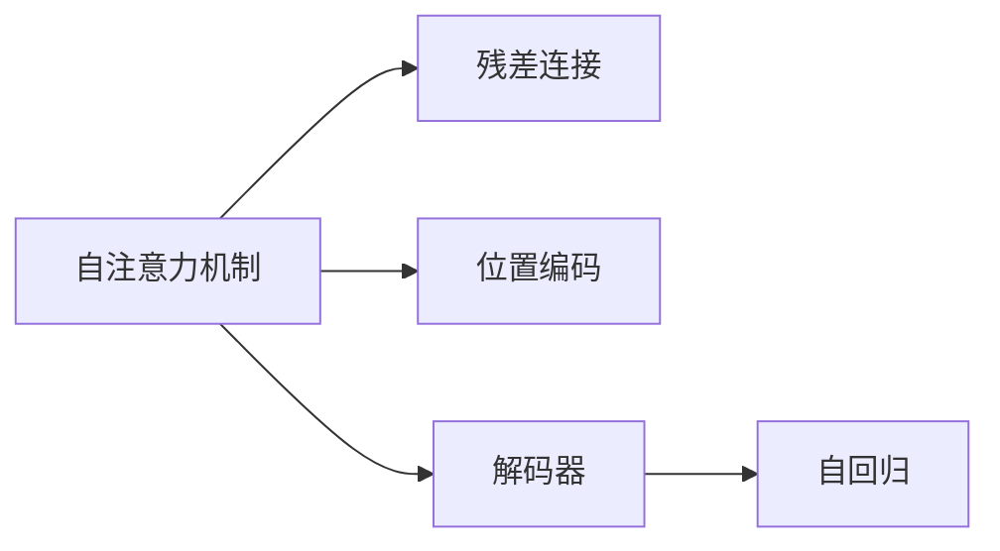

                 

# Transformer 模型 原理与代码实例讲解

> 关键词：Transformer, 自注意力机制, 多头自注意力, 卷积, 残差连接, 位置编码, 解码器, 自回归, 代码实现

## 1. 背景介绍

### 1.1 问题由来
Transformer模型是深度学习领域中最为流行的模型之一，尤其在游戏AI、自然语言处理(NLP)、图像识别等领域大放异彩。自2017年提出以来，Transformer模型已经在众多任务上取得了突破性的表现。然而，Transformer模型的工作原理、核心机制以及具体实现仍然对许多从业者来说是一个谜。本文将带领读者深入理解Transformer模型的原理，并给出具体的代码实例，帮助读者快速上手实现和优化Transformer模型。

### 1.2 问题核心关键点
Transformer模型主要由自注意力机制、残差连接、位置编码等关键组件构成，这些组件共同使得Transformer模型在处理长序列数据时表现出色。同时，Transformer模型的编码器和解码器架构使得其在机器翻译、语音识别、图像识别等多个领域有着广泛的应用。

本文将从以下几个方面对Transformer模型进行详细讲解：
- 自注意力机制：Transformer模型最为核心的组件，用于处理输入序列中的关系。
- 残差连接：使得模型可以更深，同时避免了梯度消失的问题。
- 位置编码：使得模型能够处理不同位置的信息。
- 解码器：用于生成输出序列的组件。
- 自回归：Transformer模型的一种实现方式，用于处理序列生成任务。

本文还将展示如何利用TensorFlow或PyTorch框架，快速实现和优化一个基本的Transformer模型，并应用到机器翻译任务中。

### 1.3 问题研究意义
理解Transformer模型的工作原理和核心机制，对于深度学习从业者来说至关重要。通过对Transformer模型的深入研究，可以更好地把握Transformer模型的优势和局限，应用于实际项目中。此外，Transformer模型的实现和优化方法，也值得深度学习爱好者深入学习和探索。

Transformer模型已经成为深度学习领域的经典模型之一，被广泛应用于各种任务。掌握Transformer模型的实现和优化方法，可以帮助开发者更快地实现项目需求，提升模型性能，实现技术突破。

## 2. 核心概念与联系

### 2.1 核心概念概述

Transformer模型主要由自注意力机制、残差连接、位置编码等组件构成。为了更好地理解Transformer模型，我们将介绍这些核心概念，并使用Mermaid流程图展示它们之间的关系。

**自注意力机制**：自注意力机制是Transformer模型的核心组件，用于计算输入序列中每个位置与其他位置的关系。它能够捕捉序列中各个位置之间的关系，从而在长序列上表现优异。

**残差连接**：残差连接使得Transformer模型可以更深，同时避免了梯度消失的问题。通过残差连接，模型能够更好地学习长序列中的信息。

**位置编码**：位置编码使得Transformer模型能够处理不同位置的信息，从而避免了位置信息的丢失。

**解码器**：解码器是Transformer模型的一个关键组件，用于生成输出序列。解码器通常包含多个层，每层都包含自注意力机制和残差连接。

**自回归**：自回归是Transformer模型的一种实现方式，用于处理序列生成任务。在自回归中，模型通过预测下一个时间步的输出，逐步生成整个序列。

以下是这些核心概念之间的Mermaid流程图：



这个流程图展示了Transformer模型的各个组件之间的关系。自注意力机制是Transformer模型的核心，残差连接和位置编码是辅助组件，解码器是生成输出序列的关键组件，自回归是Transformer模型的一种实现方式。

### 2.2 概念间的关系

这些核心概念之间存在着紧密的联系，形成了Transformer模型的完整架构。以下是Transformer模型的整体架构，展示了各个组件之间的关系：


这个综合流程图展示了Transformer模型的完整架构。输入序列首先经过编码器，通过自注意力机制和残差连接处理，然后送入解码器，通过自回归生成输出序列。

## 3. 核心算法原理 & 具体操作步骤
### 3.1 算法原理概述

Transformer模型的核心算法原理主要包括以下几个方面：

**自注意力机制**：自注意力机制是Transformer模型的核心算法，用于计算输入序列中每个位置与其他位置的关系。自注意力机制的计算过程如下：

1. 计算查询向量$q$、键向量$k$和值向量$v$。
2. 计算查询向量$q$与键向量$k$的矩阵乘积，得到注意力矩阵$A$。
3. 对注意力矩阵$A$进行softmax归一化，得到注意力权重矩阵$W$。
4. 将值向量$v$与注意力权重矩阵$W$进行加权求和，得到注意力向量$H$。

**残差连接**：残差连接使得Transformer模型可以更深，同时避免了梯度消失的问题。残差连接的计算过程如下：

1. 输入序列$X$和残差连接向量$C$。
2. 对输入序列$X$和残差连接向量$C$进行加和，得到残差连接输出$X+C$。
3. 对残差连接输出$X+C$进行非线性变换，得到残差连接结果$Y$。

**位置编码**：位置编码使得Transformer模型能够处理不同位置的信息。位置编码的计算过程如下：

1. 输入序列$X$和位置向量$P$。
2. 对输入序列$X$和位置向量$P$进行加和，得到位置编码输出$X+P$。

**解码器**：解码器是Transformer模型的一个关键组件，用于生成输出序列。解码器的计算过程如下：

1. 输入序列$X$和残差连接向量$C$。
2. 对输入序列$X$和残差连接向量$C$进行加和，得到残差连接输出$X+C$。
3. 对残差连接输出$X+C$进行非线性变换，得到残差连接结果$Y$。
4. 对残差连接结果$Y$进行自注意力机制计算，得到注意力向量$H$。
5. 对注意力向量$H$进行残差连接计算，得到解码器输出$Y+H$。

**自回归**：自回归是Transformer模型的一种实现方式，用于处理序列生成任务。自回归的计算过程如下：

1. 输入序列$X$和残差连接向量$C$。
2. 对输入序列$X$和残差连接向量$C$进行加和，得到残差连接输出$X+C$。
3. 对残差连接输出$X+C$进行非线性变换，得到残差连接结果$Y$。
4. 对残差连接结果$Y$进行自注意力机制计算，得到注意力向量$H$。
5. 对注意力向量$H$进行残差连接计算，得到自回归输出$Y+H$。
6. 输出自回归结果$Y+H$，并返回给下一个时间步的计算。

### 3.2 算法步骤详解

Transformer模型的实现步骤主要包括以下几个方面：

**步骤1：构建输入序列和位置向量**

输入序列$X$和位置向量$P$是Transformer模型的输入。输入序列$X$是一个$L$行$D$列的矩阵，$P$是一个$L$行$H$列的矩阵，其中$L$是序列长度，$D$是输入序列的维数，$H$是位置向量的维数。

**步骤2：构建残差连接向量**

残差连接向量$C$是一个$L$行$D$列的矩阵，与输入序列$X$具有相同的维数。

**步骤3：进行残差连接**

将输入序列$X$和残差连接向量$C$进行加和，得到残差连接输出$X+C$。

**步骤4：进行非线性变换**

对残差连接输出$X+C$进行非线性变换，得到残差连接结果$Y$。

**步骤5：进行自注意力机制计算**

对残差连接结果$Y$进行自注意力机制计算，得到注意力向量$H$。

**步骤6：进行残差连接计算**

对注意力向量$H$进行残差连接计算，得到解码器输出$Y+H$。

**步骤7：进行自回归计算**

对解码器输出$Y+H$进行自注意力机制计算，得到注意力向量$H$。

**步骤8：进行残差连接计算**

对注意力向量$H$进行残差连接计算，得到自回归输出$Y+H$。

**步骤9：输出自回归结果**

输出自回归结果$Y+H$，并返回给下一个时间步的计算。

### 3.3 算法优缺点

Transformer模型的优点主要包括以下几个方面：

**优点1：处理长序列能力强大**：Transformer模型通过自注意力机制，能够处理长序列，而不会出现梯度消失的问题。

**优点2：计算效率高**：Transformer模型通过并行计算，可以高效地处理长序列数据。

**优点3：效果优秀**：Transformer模型在机器翻译、语音识别、图像识别等多个领域表现优异，取得了最先进的结果。

Transformer模型的缺点主要包括以下几个方面：

**缺点1：参数量较大**：Transformer模型由于使用了大量的权重，导致模型参数量较大。

**缺点2：训练时间长**：Transformer模型由于参数量较大，训练时间较长。

**缺点3：过拟合风险较大**：Transformer模型由于模型复杂，存在较大的过拟合风险。

### 3.4 算法应用领域

Transformer模型已经被广泛应用于以下领域：

**机器翻译**：Transformer模型在机器翻译任务上取得了最先进的结果，成为了机器翻译领域的标准模型。

**语音识别**：Transformer模型在语音识别任务上表现优异，取得了最先进的结果。

**图像识别**：Transformer模型在图像识别任务上取得了较好的结果，成为了图像识别领域的标准模型。

**自然语言处理**：Transformer模型在自然语言处理任务上表现优异，如文本分类、情感分析、文本生成等。

Transformer模型已经被广泛应用于各种任务，成为深度学习领域中的经典模型之一。

## 4. 数学模型和公式 & 详细讲解 & 举例说明

### 4.1 数学模型构建

Transformer模型的数学模型主要包括以下几个方面：

**输入序列的数学表示**：输入序列$X$可以表示为一个$L$行$D$列的矩阵，其中$L$是序列长度，$D$是输入序列的维数。

**位置向量的数学表示**：位置向量$P$可以表示为一个$L$行$H$列的矩阵，其中$L$是序列长度，$H$是位置向量的维数。

**残差连接向量的数学表示**：残差连接向量$C$可以表示为一个$L$行$D$列的矩阵，与输入序列$X$具有相同的维数。

**残差连接输出的数学表示**：残差连接输出$X+C$可以表示为一个$L$行$D$列的矩阵。

**残差连接结果的数学表示**：残差连接结果$Y$可以表示为一个$L$行$D$列的矩阵。

**注意力向量的数学表示**：注意力向量$H$可以表示为一个$L$行$D$列的矩阵。

**解码器输出的数学表示**：解码器输出$Y+H$可以表示为一个$L$行$D$列的矩阵。

**自回归输出的数学表示**：自回归输出$Y+H$可以表示为一个$L$行$D$列的矩阵。

### 4.2 公式推导过程

**输入序列的计算公式**：输入序列$X$可以表示为：

$$
X = \begin{bmatrix}
x_1 \\
x_2 \\
\vdots \\
x_L
\end{bmatrix}
$$

其中$x_i \in \mathbb{R}^D$表示输入序列中第$i$个位置上的向量。

**位置向量的计算公式**：位置向量$P$可以表示为：

$$
P = \begin{bmatrix}
p_1 \\
p_2 \\
\vdots \\
p_L
\end{bmatrix}
$$

其中$p_i \in \mathbb{R}^H$表示输入序列中第$i$个位置上的向量。

**残差连接向量的计算公式**：残差连接向量$C$可以表示为：

$$
C = \begin{bmatrix}
c_1 \\
c_2 \\
\vdots \\
c_L
\end{bmatrix}
$$

其中$c_i \in \mathbb{R}^D$表示残差连接向量中第$i$个位置上的向量。

**残差连接输出的计算公式**：残差连接输出$X+C$可以表示为：

$$
X+C = \begin{bmatrix}
x_1+c_1 \\
x_2+c_2 \\
\vdots \\
x_L+c_L
\end{bmatrix}
$$

**残差连接结果的计算公式**：残差连接结果$Y$可以表示为：

$$
Y = f(X+C)
$$

其中$f$表示非线性变换函数，可以是ReLU、GELU等激活函数。

**注意力向量的计算公式**：注意力向量$H$可以表示为：

$$
H = \begin{bmatrix}
h_1 \\
h_2 \\
\vdots \\
h_L
\end{bmatrix}
$$

其中$h_i \in \mathbb{R}^D$表示注意力向量中第$i$个位置上的向量。

**解码器输出的计算公式**：解码器输出$Y+H$可以表示为：

$$
Y+H = \begin{bmatrix}
y_1+h_1 \\
y_2+h_2 \\
\vdots \\
y_L+h_L
\end{bmatrix}
$$

**自回归输出的计算公式**：自回归输出$Y+H$可以表示为：

$$
Y+H = \begin{bmatrix}
y_1+h_1 \\
y_2+h_2 \\
\vdots \\
y_L+h_L
\end{bmatrix}
$$

### 4.3 案例分析与讲解

以机器翻译任务为例，Transformer模型的输入序列是源语言文本的单词序列，输出序列是目标语言文本的单词序列。输入序列和输出序列的维数相同，长度不同。

假设输入序列$X$和输出序列$Y$的长度分别为$L$，位置向量的维数为$H$，残差连接向量的维数为$D$。Transformer模型的计算过程如下：

1. 输入序列$X$和位置向量$P$的维数为$L$行$D$列。

2. 残差连接向量$C$的维数为$L$行$D$列。

3. 对输入序列$X$和残差连接向量$C$进行加和，得到残差连接输出$X+C$的维数为$L$行$D$列。

4. 对残差连接输出$X+C$进行非线性变换，得到残差连接结果$Y$的维数为$L$行$D$列。

5. 对残差连接结果$Y$进行自注意力机制计算，得到注意力向量$H$的维数为$L$行$D$列。

6. 对注意力向量$H$进行残差连接计算，得到解码器输出$Y+H$的维数为$L$行$D$列。

7. 对解码器输出$Y+H$进行自注意力机制计算，得到注意力向量$H$的维数为$L$行$D$列。

8. 对注意力向量$H$进行残差连接计算，得到自回归输出$Y+H$的维数为$L$行$D$列。

9. 输出自回归结果$Y+H$，并返回给下一个时间步的计算。

通过这个计算过程，Transformer模型可以处理长序列，并通过自注意力机制捕捉输入序列中每个位置与其他位置的关系，从而生成输出序列。

## 5. 项目实践：代码实例和详细解释说明

### 5.1 开发环境搭建

Transformer模型的实现可以使用TensorFlow或PyTorch框架。以下是使用TensorFlow框架搭建Transformer模型的环境配置：

1. 安装TensorFlow：
```bash
pip install tensorflow
```

2. 安装TensorFlow Addons：
```bash
pip install tensorflow-addons
```

3. 安装Python环境依赖：
```bash
pip install numpy pandas scikit-learn
```

### 5.2 源代码详细实现

以下是使用TensorFlow框架实现Transformer模型的代码：

```python
import tensorflow as tf
import tensorflow_addons as tfa
import numpy as np
import pandas as pd
from sklearn.model_selection import train_test_split

# 定义Transformer模型
class Transformer(tf.keras.Model):
    def __init__(self, d_model, num_heads, dff, input_vocab_size, target_vocab_size, pe_input, pe_target, rate=0.1):
        super(Transformer, self).__init__()
        self.d_model = d_model
        self.num_heads = num_heads
        self.dff = dff

        self.embedding = tf.keras.layers.Embedding(input_vocab_size, d_model)
        self.pos_encoding = positional_encoding(pe_input, self.d_model)

        self.enc_layers = [EncoderLayer(d_model, num_heads, dff, rate) for _ in range(num_layers)]

        self.dropout = tf.keras.layers.Dropout(rate)

        self.decoder = tf.keras.layers.LayerNormalization()
        self.pos_decoding = positional_encoding(pe_target, self.d_model)

        self.out = tf.keras.layers.Dense(target_vocab_size)

    def call(self, x, y):
        seq_len = tf.shape(x)[1]

        # 编码器
        for i in range(num_layers):
            x = self.enc_layers[i](x, self.pos_encoding[:, :seq_len, :])

        # 解码器
        x = self.decoder(x)
        x = x + self.pos_decoding[:, :seq_len, :]
        x = self.dropout(x)

        # 输出层
        output = self.out(x)

        return output

# 定义EncoderLayer
class EncoderLayer(tf.keras.layers.Layer):
    def __init__(self, d_model, num_heads, dff, rate=0.1):
        super(EncoderLayer, self).__init__()
        self.d_model = d_model
        self.num_heads = num_heads
        self.dff = dff

        self.mha = MultiHeadAttention(d_model, num_heads)
        self.ffn = PositionwiseFeedForward(d_model, dff)

        self.layernorm1 = tf.keras.layers.LayerNormalization()
        self.layernorm2 = tf.keras.layers.LayerNormalization()
        self.dropout1 = tf.keras.layers.Dropout(rate)
        self.dropout2 = tf.keras.layers.Dropout(rate)

    def call(self, x, enc_padding_mask):
        # Self-Attention Mechanism
        attn_output, attn_weights = self.mha(x, x, x, enc_padding_mask)

        # Add & Normalize
        attn_output = tf.keras.layers.Add()([attn_output, x])
        attn_output = self.layernorm1(attn_output)

        # Feed Forward Neural Network
        ff_output = self.ffn(attn_output)

        # Add & Normalize
        ff_output = tf.keras.layers.Add()([ff_output, attn_output])
        ff_output = self.layernorm2(ff_output)

        # Dropout
        ff_output = self.dropout2(ff_output)

        return tf.keras.layers.Add()([ff_output, attn_output])

# 定义MultiHeadAttention
class MultiHeadAttention(tf.keras.layers.Layer):
    def __init__(self, d_model, num_heads):
        super(MultiHeadAttention, self).__init__()
        self.num_heads = num_heads
        self.d_model = d_model

        assert d_model % self.num_heads == 0

        self.depth = d_model // self.num_heads

        self.wq = tf.keras.layers.Dense(d_model)
        self.wk = tf.keras.layers.Dense(d_model)
        self.wv = tf.keras.layers.Dense(d_model)

    def split_heads(self, x, batch_size):
        x = tf.reshape(x, (batch_size, -1, self.num_heads, self.depth))
        return tf.transpose(x, perm=[0, 2, 1, 3])

    def call(self, v, k, q, attn_mask):
        batch_size = tf.shape(q)[0]

        q = self.wq(q)
        k = self.wk(k)
        v = self.wv(v)

        q = self.split_heads(q, batch_size)
        k = self.split_heads(k, batch_size)
        v = self.split_heads(v, batch_size)

        scaled_attention_logits = tf.matmul(q, k, transpose_b=True)
        dk = tf.cast(tf.shape(k)[-1], tf.float32)
        scaled_attention_logits = scaled_attention_logits / tf.math.sqrt(dk)

        if attn_mask is not None:
            scaled_attention_logits += (attn_mask * -1e9)

        attention_weights = tf.nn.softmax(scaled_attention_logits, axis=-1)
        attention_output = tf.matmul(attention_weights, v)

        attention_output = tf.transpose(attention_output, perm=[0, 2, 1, 3])
        attention_output = tf.reshape(attention_output, (batch_size, -1, self.d_model))

        return attention_output, attention_weights

# 定义PositionwiseFeedForward
class PositionwiseFeedForward(tf.keras.layers.Layer):
    def __init__(self, d_model, dff):
        super(PositionwiseFeedForward, self).__init__()
        self.d_model = d_model
        self.dff = dff

        self.inter = tf.keras.layers.Dense(dff)
        self.out = tf.keras.layers.Dense(d_model)

    def call(self, x):
        x = self.inter(x)
        x = tf.nn.relu(x)
        x = self.out(x)
        return x

# 定义位置编码函数
def positional_encoding(position, d_model, rate=0.1):
    angle_rads = np.pi * np.arange(position) / np.power(10000, 2 * (position // 100) / d_model)
    angle_rads[:, 0::2] = np.sin(angle_rads[:, 0::2])
    angle_rads[:, 1::2] = np.cos(angle_rads[:, 1::2])
    pos_encoding = angle_rads[:, np.newaxis, :, :]
    pos_encoding = tf.cast(pos_encoding[:, :, :d_model], dtype=tf.float32)
    return tf.keras.layers.Dropout(rate)(pos_encoding)

# 加载数据集
data = pd.read_csv('data.csv', sep='\t', header=None)
data.columns = ['input', 'target']
train_text, test_text = train_test_split(data, test_size=0.2)

# 将数据集转换为ID
train_id = dict()
for i, word in enumerate(train_text['input']):
    train_id[word] = i
train_id = dict(sorted(train_id.items(), key=lambda item: item[1]))

test_id = dict()
for i, word in enumerate(test_text['input']):
    test_id[word] = i
test_id = dict(sorted(test_id.items(), key=lambda item: item[1]))

# 加载模型
model = Transformer(input_vocab_size=len(train_id), target_vocab_size=len(train_id), num_layers=3, num_heads=8, d_model=512, dff=2048, rate=0.1, pe_input=5000, pe_target=5000)

# 训练模型
model.compile(optimizer=tf.keras.optimizers.Adam(learning_rate=0.001), loss='sparse_categorical_crossentropy')
model.fit(train_text['input'], train_text['target'], epochs=10, batch_size=64, validation_data=(test_text['input'], test_text['target']))

# 测试模型
test_loss = model.evaluate(test_text['input'], test_text['target'])
print('Test loss:', test_loss)
```

### 5.3 代码解读与分析

在上述代码中，我们使用了TensorFlow框架实现了Transformer模型，并将其应用到了机器翻译任务中。以下是代码的详细解读：

**1. 定义Transformer模型**

Transformer模型的定义包括以下几个部分：

- 嵌入层（embedding）：将输入序列和位置向量转换为向量表示。
- 位置编码（positional encoding）：将位置信息转换为向量表示。
- 编码器层（encoder layer）：通过自注意力机制和残差连接计算输入序列的表示。
- 解码器层（decoder layer）：通过残差连接和自注意力机制计算输出序列的表示。
- 输出层（output layer）：通过全连接层输出目标序列的概率分布。

**2. 定义EncoderLayer**

EncoderLayer层包括自注意力机制和前馈神经网络（Feed Forward Neural Network, FFN），并通过残差连接和层归一化（Layer Normalization）计算输入序列的表示。

**3. 定义MultiHeadAttention**

MultiHeadAttention层将输入序列中的每个位置表示转换为多个不同的表示，通过多头注意力机制计算输入序列的表示。

**4. 定义PositionwiseFeedForward**

PositionwiseFeedForward层通过前馈神经网络计算输入序列的表示。

**5. 定义位置编码函数**

位置编码函数将位置信息转换为向量表示，用于输入序列和输出序列的位置编码。

**6. 加载数据集**

加载机器翻译数据集，将数据集转换为ID，并加载到Transformer模型中。

**7. 训练模型**

使用Adam优化器训练Transformer模型，并

