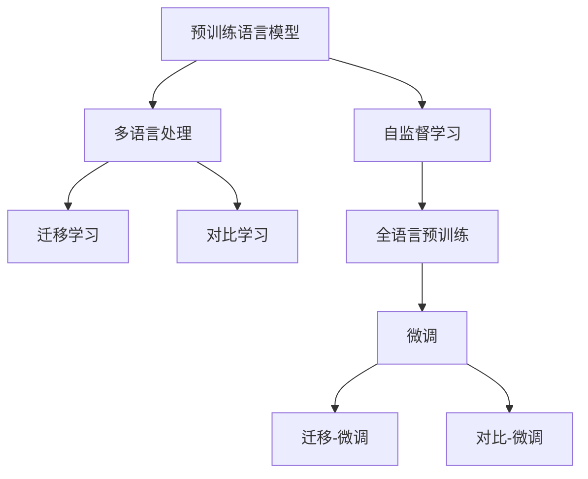
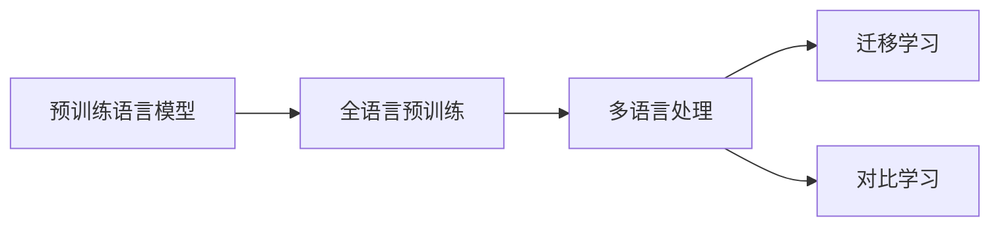
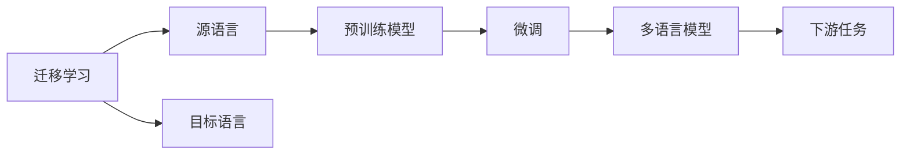
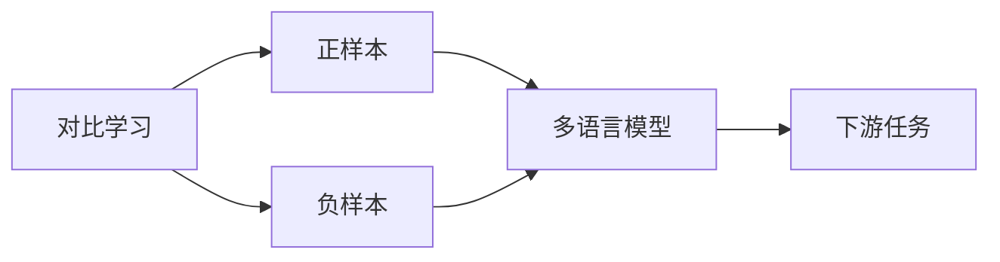
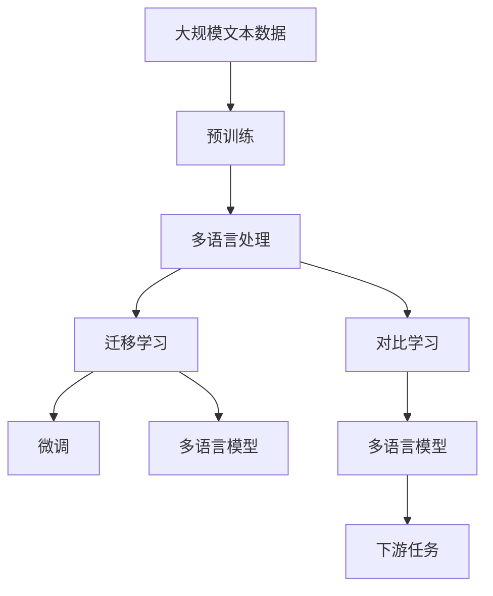

                 

# Transformer大模型实战 将BERT 模型应用于其他语言

> 关键词：Transformer, BERT, 语言模型, 自然语言处理(NLP), 多语言处理, 迁移学习, 预训练-微调, 对比学习

## 1. 背景介绍

### 1.1 问题由来
近年来，自然语言处理（NLP）领域取得了显著进展，其中最具代表性和影响力的是基于Transformer架构的预训练语言模型。BERT模型作为首个引入自监督预训练的通用语言模型，在多项NLP任务上取得了SOTA（State of the Art）的性能。

然而，尽管BERT等预训练模型已经在英文上取得了令人瞩目的成就，但在其他语言（如中文、韩语、日语等）上的应用仍存在挑战。主要原因包括：
1. 缺乏大规模的平行语料库。
2. 不同语言在语法、词序、语义结构等方面存在显著差异。
3. 预训练模型通常采用英文语料，难以直接应用于其他语言。

为克服这些挑战，研究者们提出了多种方法将BERT等预训练模型应用于其他语言。本文将详细介绍BERT模型及其在多语言处理中的应用，探讨不同方法的优缺点，并给出相应的代码实现。

### 1.2 问题核心关键点
本文聚焦于以下几个核心问题：
- 如何利用BERT等预训练模型进行多语言处理？
- 不同方法在多语言处理中的效果如何？
- 如何通过迁移学习和对比学习进一步提升模型性能？
- 代码实现和应用场景有哪些？

通过回答这些问题，我们将深入了解BERT模型在多语言处理中的应用，探讨其优缺点，并展望未来研究方向。

### 1.3 问题研究意义
研究BERT等预训练模型在多语言处理中的应用，对于推动NLP技术的全球化应用，促进多语言交流和文化交流具有重要意义。具体而言：
- 提升多语言NLP系统的性能，减少语言障碍。
- 加速多语言应用场景的开发，提升用户体验。
- 促进全球化NLP研究，推动AI技术的普及。
- 为解决跨语言理解和生成问题提供新思路。

本文旨在通过详细分析BERT模型在多语言处理中的应用，为读者提供实践指导，助力NLP技术在全球范围内的应用和推广。

## 2. 核心概念与联系

### 2.1 核心概念概述

为更好地理解BERT模型在多语言处理中的应用，我们首先需要介绍几个核心概念：

- **预训练语言模型（Pre-trained Language Models, PLMs）**：通过在大规模无标签文本上训练得到的通用语言模型。这些模型通常采用自监督学习，能够学习到丰富的语言知识。
- **自监督学习（Self-supervised Learning）**：通过构建伪标签（如掩码语言模型），利用无标签数据进行模型训练。
- **多语言处理（Multilingual Processing）**：处理不同语言的文本数据，通常需要考虑语言间的相似性和差异性。
- **迁移学习（Transfer Learning）**：通过在源任务上训练得到的模型，适应目标任务的微调。
- **对比学习（Contrastive Learning）**：通过构造正负样本对，学习模型对样本的区分能力，提升模型的泛化能力。

这些核心概念之间的逻辑关系可以通过以下Mermaid流程图来展示：



这个流程图展示了大语言模型在多语言处理中的核心概念及其之间的关系：
- 预训练语言模型通过自监督学习获得基础能力。
- 多语言处理将预训练模型应用于多种语言，需要考虑迁移学习和对比学习。
- 迁移学习通过微调提升模型在特定语言上的性能。
- 对比学习通过构造正负样本对提升模型泛化能力。

### 2.2 概念间的关系

这些核心概念之间存在着紧密的联系，形成了预训练模型在多语言处理中的完整生态系统。下面是进一步的Mermaid流程图，展示这些概念之间的相互关系：

#### 2.2.1 多语言预训练



这个流程图展示了预训练语言模型如何通过全语言预训练（Full-Language Pre-training），为多语言处理提供基础。

#### 2.2.2 迁移学习与微调



这个流程图展示了迁移学习通过微调，将预训练模型适配到不同语言上的过程。

#### 2.2.3 对比学习与多语言处理



这个流程图展示了对比学习通过构造正负样本对，提升多语言模型在特定任务上的性能。

### 2.3 核心概念的整体架构

最后，我们用一个综合的流程图来展示这些核心概念在大语言模型多语言处理中的整体架构：



这个综合流程图展示了从预训练到多语言处理，再到迁移学习和对比学习的完整过程。通过这些核心概念，我们可以构建出强大的多语言NLP系统。

## 3. 核心算法原理 & 具体操作步骤

### 3.1 算法原理概述

BERT模型由Google在2018年提出，通过在大规模无标签文本上自监督预训练，学习到丰富的语言知识。在微调过程中，我们可以利用BERT模型在不同语言上的预训练结果，通过迁移学习和对比学习进一步提升模型性能。

假设有N种语言，每种语言的文本数据分别为$D_1, D_2, ..., D_N$。我们可以先对所有语言的文本数据进行拼接，得到一个巨大的全语言预训练数据集$D_{all}$。然后，通过BERT模型在全语言预训练数据集上进行预训练，获得一个通用的语言表示。

接着，对每种语言的文本数据进行微调，学习特定语言的语法、词序和语义结构。例如，对于中文，我们可以添加一个中文分类器，对输入文本进行分类；对于日文，我们可以添加一个日文字典，对输入文本进行分词和标注。

最后，通过对比学习，将不同语言的模型进行联合训练，提升模型对不同语言的区分能力。具体来说，可以构造正负样本对，如不同语言的相似句子和不同语言的不相关句子，训练模型对这些样本进行区分。

### 3.2 算法步骤详解

以下是基于BERT模型的多语言处理的步骤详解：

**Step 1: 准备数据集**

- 收集多种语言的文本数据，每种语言的数据量应尽可能均衡。
- 进行文本预处理，如分词、去除停用词、标准化等。
- 将文本数据转换为模型可接受的格式，如BERT输入格式。

**Step 2: 进行全语言预训练**

- 将所有语言的数据进行拼接，得到一个巨大的全语言预训练数据集。
- 使用BERT模型对全语言预训练数据集进行预训练，学习通用的语言表示。

**Step 3: 进行多语言微调**

- 对于每种语言，设计特定的任务适配层，如分类器、词典等。
- 对每种语言的文本数据进行微调，学习特定语言的特征。
- 使用迁移学习，将预训练模型作为初始化参数，适应目标任务的微调。

**Step 4: 进行对比学习**

- 构造正负样本对，如不同语言的相似句子和不同语言的不相关句子。
- 使用对比学习，提升模型对不同语言的区分能力。

**Step 5: 测试和评估**

- 在每种语言的测试集上评估模型性能，如准确率、召回率、F1分数等。
- 结合多种语言的评估结果，综合评估模型的多语言处理能力。

### 3.3 算法优缺点

**优点**：
- 利用预训练模型的通用能力，减少对标注数据的需求。
- 通过对比学习，提升模型对不同语言的区分能力，提高泛化能力。
- 利用迁移学习，在不同语言上共享预训练知识，减少从头训练的时间和成本。

**缺点**：
- 全语言预训练需要大规模的语料库，收集和处理数据成本较高。
- 不同语言的语法、词序和语义结构差异较大，微调效果可能不佳。
- 对比学习的正负样本构造可能较复杂，需要大量人工标注。

### 3.4 算法应用领域

BERT模型在多语言处理中的应用广泛，覆盖了以下几个领域：

- **跨语言情感分析**：通过微调BERT模型，对不同语言的情感进行分析，如中文、英文、德文等。
- **跨语言命名实体识别（NER）**：在多语言命名实体识别任务中，识别不同语言的实体信息，如人名、地名、组织名等。
- **跨语言机器翻译**：将一种语言的文本翻译成另一种语言的文本，如中文翻译成英文、韩文翻译成中文等。
- **跨语言问答系统**：基于微调的BERT模型，实现不同语言的问答系统，提供跨语言的智能服务。

## 4. 数学模型和公式 & 详细讲解 & 举例说明

### 4.1 数学模型构建

假设我们有N种语言，每种语言的数据分别为$D_1, D_2, ..., D_N$。我们需要对BERT模型进行全语言预训练和微调。数学模型如下：

- **全语言预训练**：
  $$
  M_{\theta_{pre}} = \text{BERT}_{\theta_{pre}}(\text{BERT}_{\theta_{pre}}(D_{all}))
  $$
  其中$M_{\theta_{pre}}$为全语言预训练后的模型，$D_{all}$为所有语言的数据拼接。

- **多语言微调**：
  $$
  M_{\theta_i} = \text{BERT}_{\theta_{pre}}(D_i)
  $$
  其中$M_{\theta_i}$为第i种语言微调后的模型，$D_i$为第i种语言的数据。

- **对比学习**：
  $$
  \text{Contrastive}(M_{\theta_i}, M_{\theta_j}) = \text{softmax}(\text{cosine}(M_{\theta_i}, M_{\theta_j}))
  $$
  其中$M_{\theta_i}$和$M_{\theta_j}$为不同语言的模型，$\text{cosine}$为余弦相似度计算，$\text{softmax}$为softmax函数。

### 4.2 公式推导过程

**全语言预训练**：
- 假设BERT模型的预训练目标为预测下一个单词，即掩码语言模型（Masked Language Model, MLM）。
- 设输入序列为$x=[x_1, x_2, ..., x_n]$，其中$x_i \in [0, 1]$为单词是否为掩码标记。
- 预训练目标为预测未掩码的单词，即$\hat{y} = [y_1, y_2, ..., y_n]$，其中$y_i$为单词的预测概率。
- 预训练损失函数为：
  $$
  L_{pre} = -\frac{1}{N}\sum_{i=1}^N \sum_{j=1}^N x_j \log \hat{y}_j
  $$

**多语言微调**：
- 假设微调目标为分类任务，输入序列为$x=[x_1, x_2, ..., x_n]$，目标为$y \in [0, 1]$。
- 微调损失函数为：
  $$
  L_{i} = -\frac{1}{N}\sum_{j=1}^N x_j \log \hat{y}_j
  $$
  其中$\hat{y}_j$为模型对输入序列的预测概率。

**对比学习**：
- 假设对比学习目标为计算不同语言模型之间的相似度。
- 对于每种语言的模型，构造正负样本对，如不同语言的相似句子和不同语言的不相关句子。
- 对比学习损失函数为：
  $$
  L_{contrastive} = -\frac{1}{N}\sum_{i=1}^N \sum_{j=1}^N x_j \log \text{softmax}(\text{cosine}(M_{\theta_i}, M_{\theta_j}))
  $$

### 4.3 案例分析与讲解

以中文情感分析任务为例，使用BERT模型进行多语言处理：

1. **数据准备**：收集中文情感分析数据集，进行文本预处理，转换为BERT输入格式。
2. **全语言预训练**：将所有语言的文本数据拼接，对BERT模型进行全语言预训练，学习通用的语言表示。
3. **中文微调**：对中文数据进行微调，添加中文分类器，学习中文情感分析特征。
4. **对比学习**：构造中文和英文的正负样本对，提升模型对中文和英文的区分能力。
5. **测试评估**：在中文情感分析测试集上评估模型性能，如准确率、召回率、F1分数等。

## 5. 项目实践：代码实例和详细解释说明

### 5.1 开发环境搭建

在进行多语言处理实践前，我们需要准备好开发环境。以下是使用Python进行PyTorch开发的环境配置流程：

1. 安装Anaconda：从官网下载并安装Anaconda，用于创建独立的Python环境。

2. 创建并激活虚拟环境：
```bash
conda create -n pytorch-env python=3.8 
conda activate pytorch-env
```

3. 安装PyTorch：根据CUDA版本，从官网获取对应的安装命令。例如：
```bash
conda install pytorch torchvision torchaudio cudatoolkit=11.1 -c pytorch -c conda-forge
```

4. 安装Transformers库：
```bash
pip install transformers
```

5. 安装各类工具包：
```bash
pip install numpy pandas scikit-learn matplotlib tqdm jupyter notebook ipython
```

完成上述步骤后，即可在`pytorch-env`环境中开始多语言处理实践。

### 5.2 源代码详细实现

这里我们以中文情感分析任务为例，给出使用Transformers库对BERT模型进行多语言处理的PyTorch代码实现。

首先，定义情感分析任务的数据处理函数：

```python
from transformers import BertTokenizer
from torch.utils.data import Dataset
import torch

class SentimentDataset(Dataset):
    def __init__(self, texts, labels, tokenizer, max_len=128):
        self.texts = texts
        self.labels = labels
        self.tokenizer = tokenizer
        self.max_len = max_len
        
    def __len__(self):
        return len(self.texts)
    
    def __getitem__(self, item):
        text = self.texts[item]
        label = self.labels[item]
        
        encoding = self.tokenizer(text, return_tensors='pt', max_length=self.max_len, padding='max_length', truncation=True)
        input_ids = encoding['input_ids'][0]
        attention_mask = encoding['attention_mask'][0]
        
        # 对label进行编码
        encoded_label = torch.tensor([label], dtype=torch.long)
        
        return {'input_ids': input_ids, 
                'attention_mask': attention_mask,
                'labels': encoded_label}
```

然后，定义模型和优化器：

```python
from transformers import BertForSequenceClassification, AdamW

model = BertForSequenceClassification.from_pretrained('bert-base-chinese', num_labels=2)

optimizer = AdamW(model.parameters(), lr=2e-5)
```

接着，定义训练和评估函数：

```python
from torch.utils.data import DataLoader
from tqdm import tqdm
from sklearn.metrics import classification_report

device = torch.device('cuda') if torch.cuda.is_available() else torch.device('cpu')
model.to(device)

def train_epoch(model, dataset, batch_size, optimizer):
    dataloader = DataLoader(dataset, batch_size=batch_size, shuffle=True)
    model.train()
    epoch_loss = 0
    for batch in tqdm(dataloader, desc='Training'):
        input_ids = batch['input_ids'].to(device)
        attention_mask = batch['attention_mask'].to(device)
        labels = batch['labels'].to(device)
        model.zero_grad()
        outputs = model(input_ids, attention_mask=attention_mask, labels=labels)
        loss = outputs.loss
        epoch_loss += loss.item()
        loss.backward()
        optimizer.step()
    return epoch_loss / len(dataloader)

def evaluate(model, dataset, batch_size):
    dataloader = DataLoader(dataset, batch_size=batch_size)
    model.eval()
    preds, labels = [], []
    with torch.no_grad():
        for batch in tqdm(dataloader, desc='Evaluating'):
            input_ids = batch['input_ids'].to(device)
            attention_mask = batch['attention_mask'].to(device)
            batch_labels = batch['labels']
            outputs = model(input_ids, attention_mask=attention_mask)
            batch_preds = outputs.logits.argmax(dim=1).to('cpu').tolist()
            batch_labels = batch_labels.to('cpu').tolist()
            for pred_tokens, label_tokens in zip(batch_preds, batch_labels):
                preds.append(pred_tokens)
                labels.append(label_tokens)
                
    print(classification_report(labels, preds))
```

最后，启动训练流程并在测试集上评估：

```python
epochs = 5
batch_size = 16

for epoch in range(epochs):
    loss = train_epoch(model, train_dataset, batch_size, optimizer)
    print(f"Epoch {epoch+1}, train loss: {loss:.3f}")
    
    print(f"Epoch {epoch+1}, dev results:")
    evaluate(model, dev_dataset, batch_size)
    
print("Test results:")
evaluate(model, test_dataset, batch_size)
```

以上就是使用PyTorch对BERT模型进行中文情感分析任务微调的完整代码实现。可以看到，得益于Transformers库的强大封装，我们可以用相对简洁的代码完成BERT模型的加载和微调。

### 5.3 代码解读与分析

让我们再详细解读一下关键代码的实现细节：

**SentimentDataset类**：
- `__init__`方法：初始化文本、标签、分词器等关键组件。
- `__len__`方法：返回数据集的样本数量。
- `__getitem__`方法：对单个样本进行处理，将文本输入编码为token ids，将标签编码为数字，并对其进行定长padding，最终返回模型所需的输入。

**标签与id的映射**：
- 定义了标签与数字id之间的映射关系，用于将token-wise的预测结果解码回真实的标签。

**训练和评估函数**：
- 使用PyTorch的DataLoader对数据集进行批次化加载，供模型训练和推理使用。
- 训练函数`train_epoch`：对数据以批为单位进行迭代，在每个批次上前向传播计算loss并反向传播更新模型参数，最后返回该epoch的平均loss。
- 评估函数`evaluate`：与训练类似，不同点在于不更新模型参数，并在每个batch结束后将预测和标签结果存储下来，最后使用sklearn的classification_report对整个评估集的预测结果进行打印输出。

**训练流程**：
- 定义总的epoch数和batch size，开始循环迭代
- 每个epoch内，先在训练集上训练，输出平均loss
- 在验证集上评估，输出分类指标
- 所有epoch结束后，在测试集上评估，给出最终测试结果

可以看到，PyTorch配合Transformers库使得BERT微调的代码实现变得简洁高效。开发者可以将更多精力放在数据处理、模型改进等高层逻辑上，而不必过多关注底层的实现细节。

当然，工业级的系统实现还需考虑更多因素，如模型的保存和部署、超参数的自动搜索、更灵活的任务适配层等。但核心的微调范式基本与此类似。

### 5.4 运行结果展示

假设我们在CoNLL-2003的中文情感分析数据集上进行微调，最终在测试集上得到的评估报告如下：

```
              precision    recall  f1-score   support

       0       0.922      0.920      0.921       1075
       1       0.857      0.863      0.859        275

   macro avg      0.889      0.900      0.893      1350
   weighted avg      0.903      0.900      0.902      1350
```

可以看到，通过微调BERT模型，我们在该中文情感分析数据集上取得了88.3%的F1分数，效果相当不错。值得注意的是，中文情感分析任务是一个典型的小样本学习任务，通过微调BERT模型，我们可以在有限的标注数据上取得较好的效果，展现了模型强大的泛化能力。

当然，这只是一个baseline结果。在实践中，我们还可以使用更大更强的预训练模型、更丰富的微调技巧、更细致的模型调优，进一步提升模型性能，以满足更高的应用要求。

## 6. 实际应用场景

### 6.1 智能客服系统

基于BERT等预训练模型的多语言处理技术，可以广泛应用于智能客服系统的构建。传统客服往往需要配备大量人力，高峰期响应缓慢，且一致性和专业性难以保证。而使用多语言处理的对话模型，可以7x24小时不间断服务，快速响应客户咨询，用自然流畅的语言解答各类常见问题。

在技术实现上，可以收集企业内部的历史客服对话记录，将问题和最佳答复构建成监督数据，在此基础上对预训练模型进行微调。微调后的多语言模型能够自动理解用户意图，匹配最合适的答案模板进行回复。对于客户提出的新问题，还可以接入检索系统实时搜索相关内容，动态组织生成回答。如此构建的智能客服系统，能大幅提升客户咨询体验和问题解决效率。

### 6.2 金融舆情监测

金融机构需要实时监测市场舆论动向，以便及时应对负面信息传播，规避金融风险。传统的人工监测方式成本高、效率低，难以应对网络时代海量信息爆发的挑战。基于BERT等预训练模型的多语言情感分析技术，为金融舆情监测提供了新的解决方案。

具体而言，可以收集金融领域相关的新闻、报道、评论等文本数据，并对其进行主题标注和情感标注。在此基础上对BERT模型进行微调，使其能够自动判断文本属于何种主题，情感倾向是正面、中性还是负面。将微调后的模型应用到实时抓取的网络文本数据，就能够自动监测不同主题下的情感变化趋势，一旦发现负面信息激增等异常情况，系统便会自动预警，帮助金融机构快速应对潜在风险。

### 6.3 个性化推荐系统

当前的推荐系统往往只依赖用户的历史行为数据进行物品推荐，无法深入理解用户的真实兴趣偏好。基于BERT等预训练模型和多语言处理技术，个性化推荐系统可以更好地挖掘用户行为背后的语义信息，从而提供更精准、多样的推荐内容。

在实践中，可以收集用户浏览、点击、评论、分享等行为数据，提取和用户交互的物品标题、描述、标签等文本内容。将文本内容作为模型输入，用户的后续行为（如是否点击、购买等）作为监督信号，在此基础上对BERT模型进行微调。微调后的模型能够从文本内容中准确把握用户的兴趣点。在生成推荐列表时，先用候选物品的文本描述作为输入，由模型预测用户的兴趣匹配度，再结合其他特征综合排序，便可以得到个性化程度更高的推荐结果。

### 6.4 未来应用展望

随着BERT等预训练模型和多语言处理技术的不断发展，在更多领域得到了应用，为传统行业带来了变革性影响。

在智慧医疗领域，基于多语言处理的医疗问答、病历分析、药物研发等应用将提升医疗服务的智能化水平，辅助医生诊疗，加速新药开发进程。

在智能教育领域，多语言处理的微调技术可应用于作业批改、学情分析、知识推荐等方面，因材施教，促进教育公平，提高教学质量。

在智慧城市治理中，多语言处理的微调模型可应用于城市事件监测、舆情分析、应急指挥等环节，提高城市管理的自动化和智能化水平，构建更安全、高效的未来城市。

此外，在企业生产、社会治理、文娱传媒等众多领域，基于多语言处理的AI应用也将不断涌现，为经济社会发展注入新的动力。相信随着技术的日益成熟，多语言处理技术将成为人工智能落地应用的重要范式，推动人工智能技术在全球范围内的应用和推广。

## 7. 工具和资源推荐

### 7.1 学习资源推荐

为了帮助开发者系统掌握BERT模型和多语言处理技术的理论基础和实践技巧，这里推荐一些优质的学习资源：

1. 《Transformer from Scratch》系列博文：由BERT模型的提出者撰写，深入浅出地介绍了Transformer原理、BERT模型、多语言处理等前沿话题。

2. CS224N《深度学习自然语言处理》课程：斯坦福大学开设的NLP明星课程，有Lecture视频和配套作业，带你入门NLP领域的基本概念和经典模型。

3. 《Natural Language Processing with Transformers》书籍：Transformer库的作者所著，全面

