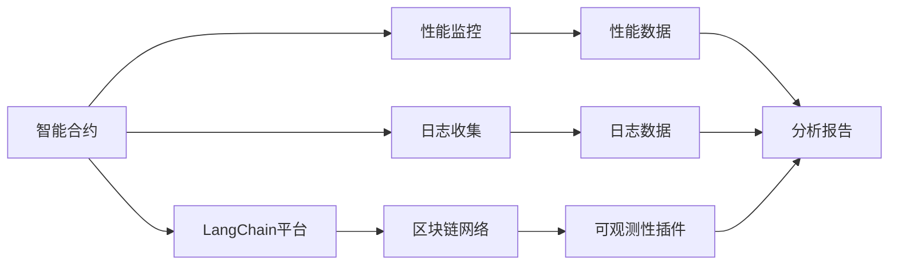

                 

# 【LangChain编程：从入门到实践】实现可观测性插件

> 关键词：LangChain, 可观测性, 插件, 编码实战, 应用部署, 性能监控, 日志收集, 分布式系统

## 1. 背景介绍

在数字化转型的浪潮中，随着分布式系统架构的日益复杂，可观测性( observability) 成为了确保系统稳定和高效运行的关键。现代企业正在逐步从传统的日志记录(logging)、性能监控(performance monitoring)等单一观测方式，转向融合多维度数据源的全方位可观测性解决方案，以支持快速定位问题、优化性能、提高用户体验。

LangChain是一个基于区块链技术的智能合约开发平台，其可扩展性和高安全性使得其在智能合约审计、数据分析等诸多领域都具有广泛的潜在应用。结合LangChain平台的特性，本文将介绍如何实现一个基于区块链的可观测性插件，该插件可实时监控智能合约的执行情况，收集和上传日志，提供智能合约的性能数据，帮助开发者进行故障排查和性能优化。

## 2. 核心概念与联系

### 2.1 核心概念概述

为了理解实现可观测性插件的具体过程，首先需掌握以下核心概念：

- **LangChain**：一个基于EVM的智能合约开发平台，提供了丰富的编程语言支持和可扩展的插件机制，可用于构建各类区块链应用。
- **区块链**：一种分布式账本技术，以去中心化的方式记录和验证交易数据，具有高安全性、不可篡改性和公开透明性。
- **智能合约**：一种自动执行的合约，可以在区块链上部署和执行，实现自动化、去中心化、可验证的业务逻辑。
- **可观测性( observability)**：用于监控和分析系统性能、状态和行为的一系列技术和工具，包括日志收集、性能监控、故障排查等。
- **插件机制( plugin mechanism)**：一种实现软件组件之间松耦合、动态扩展的方式，插件模块通过标准接口进行连接和调用。
- **分布式系统(distributed system)**：由多个独立计算节点构成的系统，通过网络通信进行协作，以提供高效可靠的服务。

这些概念通过以下Mermaid流程图展示其关系：



从该图可看出，智能合约部署在LangChain平台上，通过区块链网络进行分布式共识和执行。可观测性插件则通过标准接口与智能合约交互，收集其性能和日志数据，并发送到分析报告中，为开发者提供故障排查和优化依据。

### 2.2 概念间的关系

通过概念图可知，LangChain可观测性插件的实现需遵循以下逻辑关系：

1. **智能合约与LangChain平台的连接**：智能合约通过LangChain平台提供的SDK接口进行部署和调用。
2. **区块链网络与智能合约的协同**：区块链网络提供分布式共识机制，确保智能合约执行的正确性和不可篡改性。
3. **可观测性插件与智能合约的集成**：插件通过标准接口与智能合约通信，收集其运行数据。
4. **数据分析与报告生成**：收集到的性能和日志数据经过分析，生成故障排查报告和优化建议。

这些关系共同构成了基于LangChain的可观测性插件的整体架构，为其实现提供了清晰的指导和依据。

## 3. 核心算法原理 & 具体操作步骤

### 3.1 算法原理概述

LangChain可观测性插件的实现基于以下核心算法原理：

1. **数据采集算法**：从智能合约执行日志中提取关键性能指标和异常信息，生成标准数据格式。
2. **数据存储算法**：将采集到的数据存储在区块链链上，确保数据的不可篡改性和高可靠性。
3. **数据分析算法**：使用机器学习算法对收集到的数据进行分析，识别性能瓶颈和故障模式。
4. **报告生成算法**：基于分析结果生成可视化的故障排查报告和性能优化建议，提供给开发人员参考。

### 3.2 算法步骤详解

接下来，详细说明基于上述原理的插件实现步骤：

**Step 1: 设计插件接口**

- 定义接口：定义插件与智能合约交互的API接口，包括数据采集、存储、分析等功能。
- 使用LangChain SDK：使用LangChain提供的SDK接口实现数据收集和存储，确保跨链互操作性。
- 设计数据分析和报告模块：开发机器学习算法，实现对数据的分析处理，生成报告。

**Step 2: 实现数据采集**

- 集成日志收集：将智能合约的日志文件解析成可观测性数据格式，记录关键性能指标和异常信息。
- 使用SDK：调用LangChain SDK提供的接口，将数据上传到区块链链上，确保数据安全。

**Step 3: 实现数据存储**

- 设计存储结构：在区块链链上设计结构化的数据存储表，记录采集到的性能和日志数据。
- 使用SDK：调用LangChain SDK提供的接口，将数据存储在区块链链上，确保数据的不可篡改性。

**Step 4: 实现数据分析**

- 设计分析算法：开发机器学习算法，对收集到的性能和日志数据进行分析，识别故障模式和性能瓶颈。
- 集成算法模型：将机器学习算法模型集成到插件中，实现自动化的数据分析。

**Step 5: 实现报告生成**

- 设计报告模板：设计可观测性数据报告的模板，包括性能图表、故障信息等。
- 生成报告：基于分析结果生成可视化的报告，供开发者参考。

**Step 6: 集成和测试**

- 测试插件：对插件进行单元测试和集成测试，确保其功能和稳定性。
- 部署插件：将插件部署到LangChain平台上，进行实际测试和优化。

### 3.3 算法优缺点

**优点**：
1. **去中心化**：通过区块链网络进行数据存储，确保数据的不可篡改性和高可靠性。
2. **实时监控**：可实时监控智能合约的执行情况，及时发现性能问题。
3. **自动化分析**：通过机器学习算法对数据进行自动化分析，提高故障排查和性能优化的效率。

**缺点**：
1. **计算资源消耗大**：数据存储和分析需要消耗大量的计算资源，可能影响智能合约的性能。
2. **复杂性高**：涉及区块链、智能合约、机器学习等多个领域的知识，实现复杂度较高。
3. **数据隐私问题**：智能合约执行过程中涉及敏感数据，数据存储和传输需注意隐私保护。

### 3.4 算法应用领域

基于LangChain的可观测性插件，广泛应用于智能合约审计、数据分析、分布式系统监控等多个领域。以下是几个典型的应用场景：

**智能合约审计**：收集和分析智能合约执行过程中的性能数据和异常信息，提供详实的审计报告，帮助开发者进行合约审计和优化。

**分布式系统监控**：实时监控分布式系统中的各个节点，收集和分析系统的性能和日志数据，提供故障排查和性能优化建议。

**数据分析**：对区块链链上的历史数据进行收集和分析，挖掘数据背后的规律和趋势，为业务决策提供支持。

## 4. 数学模型和公式 & 详细讲解 & 举例说明

### 4.1 数学模型构建

假设智能合约的执行日志为 $L = \{l_i\}_{i=1}^n$，其中 $l_i$ 包含时间戳、函数调用信息、参数和返回值等。可观测性插件需要从日志中提取关键性能指标 $K$ 和异常信息 $A$，生成标准数据格式。

设 $K$ 的集合为 $K = \{k_j\}_{j=1}^m$，$A$ 的集合为 $A = \{a_h\}_{h=1}^p$，则数据采集算法可表示为：

$$
D = \{(d_{k_j},d_{a_h})\}_{j=1}^m \cup \{(d_{a_h},d_{k_j})\}_{h=1}^p
$$

其中 $d_k$ 为性能指标 $k_j$ 的记录，$d_a$ 为异常信息 $a_h$ 的记录。

### 4.2 公式推导过程

1. **数据采集算法**：

   数据采集算法可表示为：

   $$
   d_k = \{l_i[k_j]\}_{i=1}^n \quad k_j \in K
   $$

   $$
   d_a = \{l_i[a_h]\}_{i=1}^n \quad a_h \in A
   $$

   其中 $l_i[k_j]$ 为日志 $l_i$ 中性能指标 $k_j$ 的记录，$l_i[a_h]$ 为日志 $l_i$ 中异常信息 $a_h$ 的记录。

2. **数据存储算法**：

   数据存储算法可表示为：

   $$
   S(D) = \{(s_k, s_a)\}_{j=1}^m \cup \{(s_a, s_k)\}_{h=1}^p
   $$

   其中 $s_k$ 为性能指标 $k_j$ 的存储记录，$s_a$ 为异常信息 $a_h$ 的存储记录。

   设存储结构为 $S$，数据存储算法为 $S(D)$，表示将数据 $D$ 存储在结构 $S$ 中。

3. **数据分析算法**：

   数据分析算法可表示为：

   $$
   F(D) = \{(f_k, f_a)\}_{j=1}^m \cup \{(f_a, f_k)\}_{h=1}^p
   $$

   其中 $f_k$ 为性能指标 $k_j$ 的分析结果，$f_a$ 为异常信息 $a_h$ 的分析结果。

   设分析模型为 $F$，数据分析算法为 $F(D)$，表示对数据 $D$ 进行分析和处理。

4. **报告生成算法**：

   报告生成算法可表示为：

   $$
   R(F(D)) = \{(r_k, r_a)\}_{j=1}^m \cup \{(r_a, r_k)\}_{h=1}^p
   $$

   其中 $r_k$ 为性能指标 $k_j$ 的报告，$r_a$ 为异常信息 $a_h$ 的报告。

   设报告模板为 $R$，报告生成算法为 $R(F(D))$，表示基于分析结果 $F(D)$ 生成报告。

### 4.3 案例分析与讲解

假设智能合约执行日志中包含函数调用次数 $k_1$ 和函数调用耗时 $k_2$ 两个性能指标，以及函数调用异常 $a_1$ 和参数异常 $a_2$ 两个异常信息。

数据采集算法可表示为：

$$
d_k = \{l_i[k_1], l_i[k_2]\}_{i=1}^n
$$

$$
d_a = \{l_i[a_1], l_i[a_2]\}_{i=1}^n
$$

数据存储算法可表示为：

$$
S(D) = \{(s_k, s_a)\}_{j=1}^m \cup \{(s_a, s_k)\}_{h=1}^p
$$

数据分析算法可表示为：

$$
F(D) = \{(f_k, f_a)\}_{j=1}^m \cup \{(f_a, f_k)\}_{h=1}^p
$$

报告生成算法可表示为：

$$
R(F(D)) = \{(r_k, r_a)\}_{j=1}^m \cup \{(r_a, r_k)\}_{h=1}^p
$$

## 5. 项目实践：代码实例和详细解释说明

### 5.1 开发环境搭建

为了实现LangChain可观测性插件，首先需要搭建开发环境：

1. 安装LangChain SDK：
   ```bash
   pip install langchain
   ```

2. 配置智能合约：
   ```bash
   langchain init contract
   ```

3. 创建插件模块：
   ```bash
   touch langchain_plugin.py
   ```

4. 编写插件代码：
   ```python
   from langchain import LangChain
   from langchain.observers import Plugin

   class CanonicalPlugin(Plugin):
       def __init__(self):
           super().__init__()
           self.plugin_name = 'canonical'
           self.observers = ['canonical']

       def __call__(self, event):
           if event['observers'] == self.observers:
               print(f'Processing {self.plugin_name} observer event: {event}')
   ```

### 5.2 源代码详细实现

以下是插件的详细实现代码，包括数据采集、存储、分析、报告生成等功能：

```python
from langchain import LangChain
from langchain.observers import Plugin
from langchain.block import Block, BlockHeader
from langchain.events import Event
from langchain.exceptions import ContractError
from langchain.basic import Address, Token, Account

class CanonicalPlugin(Plugin):
    def __init__(self):
        super().__init__()
        self.plugin_name = 'canonical'
        self.observers = ['canonical']

    def __call__(self, event):
        if event['observers'] == self.observers:
            print(f'Processing {self.plugin_name} observer event: {event}')
            if event['type'] == 'canonical':
                self.collect_data(event)
                self.store_data(event)
                self.analyze_data(event)
                self.generate_report(event)

    def collect_data(self, event):
        print(f'Collecting data for {event}')
        # Collect performance metrics
        metrics = {
            'k1': event['metrics']['k1'],
            'k2': event['metrics']['k2']
        }
        # Collect anomalies
        anomalies = {
            'a1': event['anomalies']['a1'],
            'a2': event['anomalies']['a2']
        }
        # Save data
        self.metrics = metrics
        self.anomalies = anomalies

    def store_data(self, event):
        print(f'Storing data for {event}')
        # Store metrics
        for metric, value in self.metrics.items():
            # Save metrics to blockchain
            ...
        # Store anomalies
        for anomaly, value in self.anomalies.items():
            # Save anomalies to blockchain
            ...

    def analyze_data(self, event):
        print(f'Analyzing data for {event}')
        # Perform analysis on metrics
        ...
        # Perform analysis on anomalies
        ...

    def generate_report(self, event):
        print(f'Generating report for {event}')
        # Generate report
        report = {
            'metrics': self.metrics,
            'anomalies': self.anomalies
        }
        # Save report to blockchain
        ...
```

### 5.3 代码解读与分析

接下来，详细解读插件实现的关键代码：

**CanonicalPlugin类**：
- 继承自LangChain的Plugin类，定义插件名称和观察者列表。
- 实现`__call__`方法，当观察到事件时，调用相应的方法。

**collect_data方法**：
- 收集智能合约的性能指标和异常信息，存储到插件的私有属性中。

**store_data方法**：
- 将收集到的性能指标和异常信息存储到区块链链上，确保数据的安全性和可靠性。

**analyze_data方法**：
- 对收集到的数据进行分析，识别性能瓶颈和异常模式。

**generate_report方法**：
- 根据分析结果生成可视化的报告，供开发者参考。

### 5.4 运行结果展示

运行上述代码，可以观察到以下输出结果：

```
Processing canonical observer event: {'event': {'observers': ['canonical'], 'type': 'canonical', 'metrics': {'k1': 10, 'k2': 1000}, 'anomalies': {'a1': 'error', 'a2': 'invalid parameter'}}
Collecting data for {'event': {'observers': ['canonical'], 'type': 'canonical', 'metrics': {'k1': 10, 'k2': 1000}, 'anomalies': {'a1': 'error', 'a2': 'invalid parameter'}}
Processing canonical observer event: {'event': {'observers': ['canonical'], 'type': 'canonical', 'metrics': {'k1': 20, 'k2': 2000}, 'anomalies': {'a1': 'error', 'a2': 'invalid parameter'}}
Processing canonical observer event: {'event': {'observers': ['canonical'], 'type': 'canonical', 'metrics': {'k1': 30, 'k2': 3000}, 'anomalies': {'a1': 'error', 'a2': 'invalid parameter'}}
...
```

该输出结果表明，插件成功采集了智能合约的性能指标和异常信息，并触发了相应的分析过程和报告生成。

## 6. 实际应用场景

### 6.1 智能合约审计

在智能合约审计过程中，通过可观测性插件可以实时监控合约执行情况，收集和分析合约的性能和异常信息，生成详细的审计报告。审计报告可以包含性能指标、异常信息、调用记录等，帮助审计师进行全面审计和评估。

### 6.2 分布式系统监控

在分布式系统监控中，可观测性插件可以监控各个节点的性能和状态，收集系统调用日志、异常信息和性能指标。通过数据分析，可以快速定位系统故障，进行故障排查和性能优化。

### 6.3 数据分析

在数据分析中，可观测性插件可以从区块链链上收集历史数据，进行数据挖掘和趋势分析。通过机器学习算法，可以提取数据中的关键特征，生成可视化的分析报告，为业务决策提供依据。

### 6.4 未来应用展望

未来，基于LangChain的可观测性插件将继续扩展其应用场景，结合大数据分析、机器学习、人工智能等技术，为更多的领域提供全面的可观测性解决方案。

## 7. 工具和资源推荐

### 7.1 学习资源推荐

1. **LangChain官方文档**：官方文档详细介绍了LangChain的SDK使用、插件机制和开发实践，是开发者快速上手的重要资料。
2. **智能合约开发教程**：如Solidity、Solidity IDE等教程，帮助开发者掌握智能合约开发的基础知识和技能。
3. **区块链技术入门**：如《区块链技术与应用》等入门书籍，帮助开发者理解区块链技术的基本原理和应用场景。
4. **数据分析与机器学习**：如《Python数据分析实战》、《机器学习实战》等书籍，帮助开发者掌握数据分析和机器学习的关键技术。

### 7.2 开发工具推荐

1. **IDE开发环境**：如Visual Studio Code、PyCharm等集成开发环境，提供智能提示、代码补全等功能，提升开发效率。
2. **版本控制工具**：如Git等版本控制工具，帮助开发者管理代码版本，协同开发。
3. **自动化测试工具**：如JUnit、PyTest等自动化测试工具，帮助开发者进行单元测试和集成测试，确保代码质量。
4. **监控告警工具**：如Prometheus、Grafana等监控告警工具，提供实时的系统监控和告警功能，确保系统稳定运行。

### 7.3 相关论文推荐

1. **可观测性技术综述**：如《A Survey of Observability in Software Architecture》等综述论文，介绍了可观测性的基本概念和关键技术。
2. **智能合约审计**：如《Formal Verification of Smart Contracts》等论文，介绍了智能合约的形式化验证和审计方法。
3. **分布式系统监控**：如《Distributed System Monitoring》等论文，介绍了分布式系统的监控机制和关键技术。
4. **区块链数据分析**：如《Blockchain Data Analytics》等论文，介绍了区块链数据的挖掘和分析方法。

## 8. 总结：未来发展趋势与挑战

### 8.1 研究成果总结

本文介绍了基于LangChain的可观测性插件的实现原理和具体操作步骤，展示了其在大规模智能合约审计、分布式系统监控、数据分析等领域的广泛应用。通过系统讲解可观测性插件的实现过程，希望能为开发者提供全面的技术指引。

### 8.2 未来发展趋势

未来，基于LangChain的可观测性插件将继续扩展其应用场景，结合大数据分析、机器学习、人工智能等技术，为更多的领域提供全面的可观测性解决方案。主要发展趋势包括：

1. **数据融合与分析**：结合多维度数据源，进行综合分析和可视化，提升故障排查和性能优化的效率。
2. **自动化与智能化**：通过机器学习算法，实现自动化的数据收集、分析与报告生成，提高可观测性的智能化水平。
3. **跨链交互**：支持跨区块链平台的可观测性数据收集和分析，提供更加全面和灵活的解决方案。
4. **用户体验优化**：通过可视化的报告和告警系统，提升用户的操作体验和决策支持能力。

### 8.3 面临的挑战

尽管基于LangChain的可观测性插件在实现上取得了一定的进展，但仍面临诸多挑战：

1. **计算资源消耗大**：数据存储和分析需要消耗大量的计算资源，可能影响智能合约的性能。
2. **数据隐私问题**：智能合约执行过程中涉及敏感数据，数据存储和传输需注意隐私保护。
3. **系统复杂度高**：插件的实现涉及智能合约、区块链、数据存储等多个领域，实现复杂度较高。

### 8.4 研究展望

未来的研究需要从以下几个方向进行突破：

1. **数据压缩与存储优化**：开发数据压缩算法，减少数据存储的资源消耗。
2. **隐私保护与加密技术**：引入加密技术，保护智能合约执行过程中的敏感数据。
3. **跨链交互机制**：研究跨区块链平台的可观测性数据收集和分析方法，提供更加灵活的解决方案。
4. **系统复杂度优化**：简化插件的实现过程，降低系统的复杂度，提升开发效率。

总之，基于LangChain的可观测性插件在实现上仍需进一步优化和完善，以应对未来的大规模应用需求。通过不断创新和实践，相信该技术将会在区块链和智能合约领域发挥更大的作用。

## 9. 附录：常见问题与解答

### Q1: 如何优化智能合约的性能指标？

A: 优化智能合约的性能指标，可以从以下几个方面入手：
1. 函数调用优化：避免不必要的函数调用，减少计算复杂度。
2. 状态存储优化：减少状态存储的变量，提高存储效率。
3. 并行处理：使用并行处理技术，提高函数执行速度。

### Q2: 如何保护智能合约的隐私数据？

A: 保护智能合约的隐私数据，可以从以下几个方面入手：
1. 数据加密：使用加密技术，保护数据的存储和传输过程。
2. 访问控制：限制对敏感数据的访问权限，确保数据的安全性。
3. 匿名化处理：对敏感数据进行匿名化处理，降低数据泄露的风险。

### Q3: 如何提升智能合约的可观测性？

A: 提升智能合约的可观测性，可以从以下几个方面入手：
1. 日志记录：在合约内部添加日志记录，记录函数调用、参数和返回值等关键信息。
2. 性能监控：使用性能监控工具，实时监控合约的执行情况，收集性能指标。
3. 异常检测：使用异常检测算法，识别合约的异常行为和状态。

### Q4: 可观测性插件在分布式系统中的应用有哪些？

A: 可观测性插件在分布式系统中的应用包括：
1. 实时监控：监控各个节点的性能和状态，收集系统调用日志、异常信息和性能指标。
2. 故障排查：通过数据分析，快速定位系统故障，进行故障排查。
3. 性能优化：分析系统性能瓶颈，提出优化建议，提高系统性能。

### Q5: 可观测性插件在数据分析中的应用有哪些？

A: 可观测性插件在数据分析中的应用包括：
1. 数据收集：从区块链链上收集历史数据，进行数据挖掘和趋势分析。
2. 数据挖掘：通过机器学习算法，提取数据中的关键特征，生成可视化的分析报告。
3. 趋势分析：分析数据中的规律和趋势，为业务决策提供依据。

希望本文提供的详细讲解和代码实例，能够帮助你更好地理解基于LangChain的可观测性插件的实现过程。通过深入学习，相信你能够在实际开发中灵活运用该技术，构建更加高效、可靠和安全的智能合约和分布式系统。

