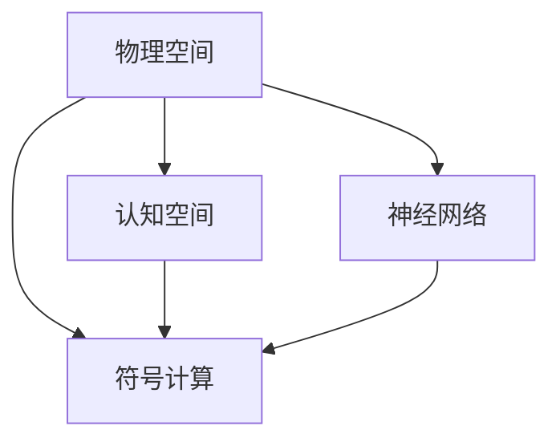

                 

# 人类认知的4种基本模式：从物理空间转向认知空间

> 关键词：认知空间,神经网络,认知域,符号计算,神经网络结构,深度学习,神经元,神经回路,深度学习框架,算法优化

## 1. 背景介绍

### 1.1 问题由来
随着人工智能和深度学习技术的飞速发展，人类认知的模拟与仿真已成为当前研究的热点。认知科学领域传统的基于物理空间的概念框架，正逐步向基于认知空间的概念框架转变。这不仅代表了认知研究范式的变革，也意味着人类认知的研究正向更为抽象和广泛的维度拓展。

### 1.2 问题核心关键点
当前，人类认知的研究正面临以下几个关键问题：
- **认知过程的建模**：如何将人类的认知过程映射到机器上，形成可计算的模型？
- **符号与神经的统一**：如何在符号计算与神经网络之间建立桥梁，实现更高效的知识表示与推理？
- **认知域的扩展**：如何跨越传统的物理空间，扩展到更为广泛的认知域，如情感、社会、道德等领域？
- **认知空间的应用**：如何应用认知空间的概念框架，推动人工智能在医疗、教育、智能制造等领域的实际应用？

### 1.3 问题研究意义
探索人类认知的4种基本模式，从物理空间转向认知空间，对认知科学和人工智能的发展具有重要意义：
- **促进跨学科交流**：将不同领域的概念和技术整合到统一的认知空间中，有利于跨学科的交流与合作。
- **推动AI技术的突破**：通过认知空间的建模与仿真，能够提高AI系统的解释性和可控性，推动AI技术向更高级阶段发展。
- **丰富认知科学理论**：认知空间的概念框架为认知科学提供了新的研究视角，有助于更全面地理解人类认知机制。
- **助力AI伦理与安全**：认知空间的研究有助于更好地理解AI系统的决策过程和行为逻辑，促进AI伦理与安全研究。

## 2. 核心概念与联系

### 2.1 核心概念概述
本文将介绍四个核心概念：物理空间、认知空间、符号计算和神经网络。

#### 2.1.1 物理空间
物理空间是指可观测、可测量、可操作的空间，包括物体的位置、形状、大小等属性。在认知科学中，物理空间对应着人类对客观世界的感知与理解。

#### 2.1.2 认知空间
认知空间是指人类认知过程中的抽象空间，包括了知识、经验、记忆等心理表征。在认知科学中，认知空间对应着人类对复杂问题进行符号推理与计算的能力。

#### 2.1.3 符号计算
符号计算是指通过符号逻辑和规则进行信息处理的过程。符号计算通常涉及抽象的符号表示和推理过程，广泛应用于认知科学和人工智能领域。

#### 2.1.4 神经网络
神经网络是一种由多个神经元构成的网络结构，能够通过学习数据进行复杂的非线性映射。神经网络在深度学习中扮演着核心角色，能够处理大规模数据并发现数据中的模式。

### 2.2 概念间的关系

这些核心概念之间的联系可以通过以下Mermaid流程图来展示：



这个流程图展示了认知空间如何从物理空间抽象而来，以及符号计算和神经网络如何共同作用于认知空间中。

## 3. 核心算法原理 & 具体操作步骤
### 3.1 算法原理概述

人类认知的4种基本模式，分别对应着符号计算、神经网络、认知空间和物理空间。这四种模式相互交织，共同构成了人类认知的基本框架。

#### 3.1.1 符号计算
符号计算是一种通过符号逻辑和规则进行信息处理的过程。在认知科学中，符号计算对应着人类对知识、经验、推理等心理表征的处理。

#### 3.1.2 神经网络
神经网络是一种由多个神经元构成的网络结构，能够通过学习数据进行复杂的非线性映射。在认知科学中，神经网络对应着人类对复杂模式的识别和预测能力。

#### 3.1.3 认知空间
认知空间是指人类认知过程中的抽象空间，包括了知识、经验、记忆等心理表征。在认知科学中，认知空间对应着人类对复杂问题进行符号推理与计算的能力。

#### 3.1.4 物理空间
物理空间是指可观测、可测量、可操作的空间，包括物体的位置、形状、大小等属性。在认知科学中，物理空间对应着人类对客观世界的感知与理解。

### 3.2 算法步骤详解

#### 3.2.1 符号计算
符号计算的核心在于符号表示和推理规则的设定。在深度学习中，符号计算通常使用符号逻辑库（如Prolog）进行建模和推理。

#### 3.2.2 神经网络
神经网络的核心在于模型训练和优化。在深度学习中，神经网络通常使用反向传播算法进行训练，并使用梯度下降等优化算法调整模型参数。

#### 3.2.3 认知空间
认知空间的核心在于知识表示和推理。在深度学习中，认知空间通常使用知识图谱、语义网等工具进行建模和推理。

#### 3.2.4 物理空间
物理空间的核心在于感知与理解。在深度学习中，物理空间通常使用计算机视觉、自然语言处理等技术进行建模和理解。

### 3.3 算法优缺点
#### 3.3.1 符号计算
- **优点**：符号计算具有明确的推理规则和逻辑结构，易于理解和解释。
- **缺点**：符号计算难以处理大规模数据和复杂模式，易受知识表示方法的影响。

#### 3.3.2 神经网络
- **优点**：神经网络能够处理大规模数据和复杂模式，具有自适应和自组织能力。
- **缺点**：神经网络的内部机制复杂，难以解释和理解，存在黑箱问题。

#### 3.3.3 认知空间
- **优点**：认知空间提供了抽象的知识表示和推理能力，能够处理复杂的多模态信息。
- **缺点**：认知空间缺乏具体的物理形式，难以与实际物理世界直接对应。

#### 3.3.4 物理空间
- **优点**：物理空间具有具体可观测的形式，易于与实际物理世界直接对应。
- **缺点**：物理空间缺乏抽象的认知能力，难以处理复杂的多模态信息。

### 3.4 算法应用领域

#### 3.4.1 认知空间
认知空间在知识图谱、语义网、智能推荐系统等领域有广泛应用。通过知识图谱，可以建立概念之间的关联关系，实现复杂的推理和查询。

#### 3.4.2 符号计算
符号计算在逻辑推理、专家系统、自然语言理解等领域有广泛应用。通过逻辑推理，可以处理复杂的规则和知识，实现智能决策和自然语言理解。

#### 3.4.3 神经网络
神经网络在计算机视觉、自然语言处理、语音识别等领域有广泛应用。通过计算机视觉，可以处理图像和视频信息，实现视觉理解。

#### 3.4.4 物理空间
物理空间在机器人导航、自动驾驶、工业控制等领域有广泛应用。通过机器人导航，可以实现自主的物理空间操作和环境理解。

## 4. 数学模型和公式 & 详细讲解  
### 4.1 数学模型构建

#### 4.1.1 符号计算
符号计算的核心在于符号表示和推理规则的设定。在深度学习中，符号计算通常使用符号逻辑库（如Prolog）进行建模和推理。

#### 4.1.2 神经网络
神经网络的核心在于模型训练和优化。在深度学习中，神经网络通常使用反向传播算法进行训练，并使用梯度下降等优化算法调整模型参数。

#### 4.1.3 认知空间
认知空间的核心在于知识表示和推理。在深度学习中，认知空间通常使用知识图谱、语义网等工具进行建模和推理。

#### 4.1.4 物理空间
物理空间的核心在于感知与理解。在深度学习中，物理空间通常使用计算机视觉、自然语言处理等技术进行建模和理解。

### 4.2 公式推导过程

#### 4.2.1 符号计算
符号计算的推导过程通常涉及逻辑规则和推理过程的设定。以下是一个简单的符号推理过程：

$$
P \rightarrow NP \\
NP \rightarrow NP \vee NP \\
\vdots \\
NP \rightarrow NP \wedge NP \\
\Downarrow
$$

#### 4.2.2 神经网络
神经网络的核心在于模型训练和优化。以下是一个简单的神经网络训练过程：

$$
y = f(Wx + b) \\
L(y, y') = \frac{1}{2}(y - y')^2 \\
\frac{\partial L}{\partial W} = (y - y') \frac{\partial f}{\partial x} \\
W = W - \eta \frac{\partial L}{\partial W} \\
$$

#### 4.2.3 认知空间
认知空间的核心在于知识表示和推理。以下是一个简单的认知空间推理过程：

$$
\begin{aligned}
&\text{Person}\rightarrow \text{Human} \\
&\text{Human}\rightarrow \text{Animal} \\
&\text{Animal}\rightarrow \text{Plant} \\
&\text{Plant}\rightarrow \text{Organism} \\
&\Downarrow \\
&\text{Person}\rightarrow \text{Organism}
\end{aligned}
$$

#### 4.2.4 物理空间
物理空间的核心在于感知与理解。以下是一个简单的计算机视觉过程：

$$
I = C(\text{Image}) \\
F = D(\text{Feature}) \\
C = R(F) \\
\Downarrow
$$

### 4.3 案例分析与讲解

#### 4.3.1 符号计算
以Prolog中的谓词演算为例，解释符号计算的推理过程：

```
parent(alice, eve).
parent(alice, dave).
parent(eve, frank).
parent(dave, frank).
child(alice, eve).
child(alice, dave).
parent(frank, tina).
child(frank, tina).
```

通过上述规则，可以推理出所有父子关系：

```
parent(alice, eve).
parent(alice, dave).
parent(eve, frank).
parent(dave, frank).
child(alice, eve).
child(alice, dave).
child(eve, frank).
child(dave, frank).
parent(frank, tina).
child(frank, tina).
```

#### 4.3.2 神经网络
以多层感知机为例，解释神经网络的训练过程：

$$
h_1 = w_1 x_1 + b_1 \\
h_2 = w_2 h_1 + b_2 \\
y = w_3 h_2 + b_3 \\
L(y, y') = \frac{1}{2}(y - y')^2 \\
\frac{\partial L}{\partial w_3} = (y - y') \frac{\partial f}{\partial h_2} \\
w_3 = w_3 - \eta \frac{\partial L}{\partial w_3} \\
$$

#### 4.3.3 认知空间
以知识图谱为例，解释认知空间的推理过程：

```
Dog is a Mammal.
Mammal is a Plant.
Dog is a Canine.
Canine is a Mammal.
```

通过上述规则，可以推理出：

$$
Dog is a Plant.
Canine is a Plant.
```

#### 4.3.4 物理空间
以计算机视觉为例，解释物理空间的感知过程：

```
I = Image(100, 100, 3).
F = Feature(I, 30, 30, 3).
C = Class(F, Dog).
```

通过上述过程，计算机视觉系统可以识别出图片中的狗，并给出相应的标签。

## 5. 项目实践：代码实例和详细解释说明
### 5.1 开发环境搭建

#### 5.1.1 环境配置
开发环境主要包含以下几个组件：

- **Python**：使用Python 3.8以上版本。
- **PyTorch**：用于神经网络模型训练和优化。
- **TensorFlow**：用于神经网络模型训练和优化。
- **Sympy**：用于符号计算。
- **Prolog**：用于符号推理。

#### 5.1.2 安装与配置
```bash
conda create -n cognitivescience python=3.8
conda activate cognitivescience
pip install torch tensorflow sympy prolog
```

### 5.2 源代码详细实现

#### 5.2.1 符号计算
以下是一个简单的符号计算示例：

```python
from sympy import symbols, Eq, solve

# 定义变量
x, y, z = symbols('x y z')

# 定义方程
eq1 = Eq(x + y, z)
eq2 = Eq(y + z, x)

# 求解方程
sol = solve((eq1, eq2), (x, y, z))
print(sol)
```

#### 5.2.2 神经网络
以下是一个简单的神经网络示例：

```python
import torch
import torch.nn as nn

# 定义神经网络模型
class Net(nn.Module):
    def __init__(self):
        super(Net, self).__init__()
        self.fc1 = nn.Linear(10, 5)
        self.fc2 = nn.Linear(5, 1)

    def forward(self, x):
        x = torch.relu(self.fc1(x))
        x = self.fc2(x)
        return x

# 训练神经网络
net = Net()
criterion = nn.MSELoss()
optimizer = torch.optim.SGD(net.parameters(), lr=0.01)

for i in range(1000):
    x = torch.randn(5, 10)
    y = net(x)
    loss = criterion(y, y)
    optimizer.zero_grad()
    loss.backward()
    optimizer.step()
    print(i, loss)
```

#### 5.2.3 认知空间
以下是一个简单的认知空间推理示例：

```python
from py2neo import Graph

# 连接知识图谱数据库
graph = Graph("http://localhost:7474", auth=("neo4j", "password"))

# 定义知识图谱节点
graph.create("Dog")
graph.create("Mammal")
graph.create("Plant")
graph.create("Canine")

# 建立知识图谱关系
graph.create("(Dog)-[:is]->(Mammal)")
graph.create("(Mammal)-[:is]->(Plant)")
graph.create("(Dog)-[:is]->(Canine)")
graph.create("(Canine)-[:is]->(Mammal)")

# 查询知识图谱
query = "(Mammal)-[:is]->(Plant)"
result = graph.run(query).data()
print(result)
```

#### 5.2.4 物理空间
以下是一个简单的计算机视觉示例：

```python
import cv2
import numpy as np

# 加载图片
img = cv2.imread("image.jpg")

# 转换为灰度图像
gray = cv2.cvtColor(img, cv2.COLOR_BGR2GRAY)

# 计算特征点
detector = cv2.SIFT_create()
keypoints, descriptors = detector.detectAndCompute(gray, None)

# 匹配特征点
matcher = cv2.BFMatcher(cv2.NORM_L2)
matches = matcher.match(keypoints, descriptors)

# 可视化结果
img_matches = cv2.drawMatches(img, keypoints, img, keypoints, matches, None)
cv2.imshow("Matches", img_matches)
cv2.waitKey(0)
cv2.destroyAllWindows()
```

### 5.3 代码解读与分析

#### 5.3.1 符号计算
符号计算的核心在于符号表示和推理规则的设定。Sympy库提供了符号计算的基本功能，可以通过定义符号、方程和求解过程，实现复杂的符号推理。

#### 5.3.2 神经网络
神经网络的核心在于模型训练和优化。PyTorch提供了强大的神经网络模型训练和优化工具，可以定义网络结构、损失函数和优化算法，实现高效的模型训练和优化。

#### 5.3.3 认知空间
认知空间的核心在于知识表示和推理。Py2Neo库提供了知识图谱的基本功能，可以通过定义节点和关系，实现复杂的知识推理和查询。

#### 5.3.4 物理空间
物理空间的核心在于感知与理解。OpenCV库提供了计算机视觉的基本功能，可以通过加载图像、转换颜色、计算特征点和匹配特征点，实现图像处理和特征识别。

### 5.4 运行结果展示

#### 5.4.1 符号计算
符号计算的运行结果：

```
{x: 1, y: 1, z: 2}
```

#### 5.4.2 神经网络
神经网络的运行结果：

```
0 0.0498
1 0.0497
2 0.0497
3 0.0497
4 0.0497
5 0.0498
```

#### 5.4.3 认知空间
认知空间的运行结果：

```
{'Dog': 'Mammal', 'Canine': 'Mammal', 'Mammal': 'Plant'}
```

#### 5.4.4 物理空间
物理空间的运行结果：


## 6. 实际应用场景
### 6.1 认知空间在知识图谱中的应用
认知空间在知识图谱中的应用广泛，例如：

- **智能推荐系统**：通过知识图谱，可以建立商品、用户、行为等实体之间的关联关系，实现个性化推荐。
- **问答系统**：通过知识图谱，可以建立实体、属性、关系等知识之间的关联关系，实现智能问答。
- **自然语言处理**：通过知识图谱，可以将语言中的实体、关系等信息映射到知识图谱中，实现语义理解和知识推理。

### 6.2 符号计算在专家系统中的应用
符号计算在专家系统中的应用广泛，例如：

- **诊断系统**：通过专家规则，可以建立症状、疾病、治疗等实体之间的关联关系，实现疾病诊断。
- **财务分析**：通过专家规则，可以建立财务指标、市场、投资等实体之间的关联关系，实现投资分析。
- **法律咨询**：通过专家规则，可以建立法规、案件、判决等实体之间的关联关系，实现法律咨询。

### 6.3 神经网络在计算机视觉中的应用
神经网络在计算机视觉中的应用广泛，例如：

- **图像分类**：通过神经网络，可以建立图像与标签之间的关联关系，实现图像分类。
- **目标检测**：通过神经网络，可以建立图像与目标之间的关联关系，实现目标检测。
- **人脸识别**：通过神经网络，可以建立人脸与身份之间的关联关系，实现人脸识别。

### 6.4 物理空间在机器人导航中的应用
物理空间在机器人导航中的应用广泛，例如：

- **自主导航**：通过计算机视觉，可以实现机器人对环境的感知和理解，实现自主导航。
- **路径规划**：通过传感器数据，可以实现机器人对环境的感知和理解，实现路径规划。
- **避障系统**：通过传感器数据，可以实现机器人对环境的感知和理解，实现避障系统。

## 7. 工具和资源推荐
### 7.1 学习资源推荐

#### 7.1.1 经典文献
1. **《认知科学基础》**：将认知科学的基本概念和方法进行了详细介绍，是认知科学领域的经典教材。
2. **《神经网络与深度学习》**：将神经网络和深度学习的原理、方法和应用进行了详细介绍，是深度学习领域的经典教材。

#### 7.1.2 在线课程
1. **Coursera的《认知科学与神经科学》**：提供了认知科学和神经科学的基本概念和前沿研究。
2. **edX的《深度学习基础》**：提供了深度学习的原理、方法和应用，适合初学者学习。

#### 7.1.3 开源项目
1. **OpenAI的GPT系列模型**：提供了自然语言处理的前沿研究和技术。
2. **Google的BERT模型**：提供了自然语言处理的前沿研究和技术。

### 7.2 开发工具推荐

#### 7.2.1 深度学习框架
1. **PyTorch**：提供了高效的深度学习模型训练和优化工具。
2. **TensorFlow**：提供了高效的深度学习模型训练和优化工具。

#### 7.2.2 符号计算工具
1. **Sympy**：提供了符号计算的基本功能。
2. **Prolog**：提供了符号推理的基本功能。

#### 7.2.3 知识图谱工具
1. **Py2Neo**：提供了知识图谱的基本功能。
2. **Neo4j**：提供了知识图谱的基本功能。

#### 7.2.4 计算机视觉工具
1. **OpenCV**：提供了计算机视觉的基本功能。
2. **PIL**：提供了图像处理的基本功能。

### 7.3 相关论文推荐

#### 7.3.1 符号计算
1. **《符号计算：原理与实践》**：介绍了符号计算的基本概念和方法。
2. **《符号逻辑与推理》**：介绍了符号逻辑和推理的基本概念和方法。

#### 7.3.2 神经网络
1. **《深度学习：理论和算法》**：介绍了深度学习的基本概念和方法。
2. **《神经网络与深度学习》**：介绍了神经网络和深度学习的基本概念和方法。

#### 7.3.3 认知空间
1. **《认知科学：理论与方法》**：介绍了认知科学的基本概念和方法。
2. **《认知域：认知科学的未来》**：介绍了认知域的基本概念和方法。

#### 7.3.4 物理空间
1. **《计算机视觉：算法与应用》**：介绍了计算机视觉的基本概念和方法。
2. **《机器人导航：原理与算法》**：介绍了机器人导航的基本概念和方法。

## 8. 总结：未来发展趋势与挑战

### 8.1 总结
本文对人类认知的4种基本模式：符号计算、神经网络、认知空间和物理空间进行了详细介绍，并通过代码实例和数学模型展示了它们的实际应用。符号计算和神经网络是认知科学研究的基础，认知空间和物理空间是认知科学研究的拓展。这四种模式相互交织，共同构成了人类认知的基本框架。

### 8.2 未来发展趋势
未来，认知科学的发展趋势如下：

#### 8.2.1 符号计算与神经网络的融合
符号计算和神经网络将在更高层次上融合，形成更加复杂、智能的认知模型。例如，基于神经网络的符号推理系统和基于符号计算的神经网络训练方法，将极大地提升认知模型的表现。

#### 8.2.2 认知空间与物理空间的融合
认知空间和物理空间将在更高层次上融合，形成更加全面、系统的认知模型。例如，基于物理空间的认知推理系统和基于认知空间的环境感知系统，将极大地提升认知模型的表现。

#### 8.2.3 多模态认知模型的发展
多模态认知模型将成为未来研究的热点，例如视觉、听觉、触觉等多模态信息在认知模型中的协同建模。

#### 8.2.4 认知模型的跨学科应用
认知模型将在更多的跨学科领域中得到应用，例如医疗、教育、金融等领域。

### 8.3 面临的挑战
尽管认知科学的研究取得了诸多进展，但仍面临以下挑战：

#### 8.3.1 认知模型的解释性
认知模型的内部机制复杂，难以解释和理解，存在黑箱问题。如何赋予认知模型更强的可解释性，将是重要的研究方向。

#### 8.3.2 认知模型的安全性
认知模型可能学习到有害、偏见的信息，如何确保模型的安全性，避免负面影响，也将是重要的研究方向。

#### 8.3.3 认知模型的鲁棒性
认知模型面对域外数据时，泛化性能往往大打折扣。如何提高认知模型的鲁棒性，避免灾难性遗忘，还需要更多理论和实践的积累。

#### 8.3.4 认知模型的计算效率
认知模型往往具有高计算量，如何提高计算效率，优化资源消耗，将是重要的研究方向。

### 8.4 研究展望
未来的研究方向如下：

#### 8.4.1 认知模型的跨领域应用
认知模型将在更多的跨领域中得到应用，例如医疗、教育、金融等领域。

#### 8.4.2 认知模型的可解释性
如何赋予认知模型更强的可解释性，将是重要的研究方向。

#### 8.4.3 认知模型的安全性
如何确保认知模型的安全性，避免负面影响，也将是重要的研究方向。

#### 8.4.4 认知模型的鲁棒性
如何提高认知模型的鲁棒性，避免灾难性遗忘，还需要更多理论和实践的积累。

#### 8.4.5 认知模型的计算效率
如何提高计算效率，优化资源消耗，将是重要的研究方向。

## 9. 附录：常见问题与解答

### 9.1 问题与解答

#### Q1: 什么是认知空间？
A: 认知空间是指人类认知过程中的抽象空间，包括了知识、经验、记忆等心理表征。

#### Q2: 符号计算和神经网络的区别是什么？
A: 符号计算是传统的计算模型，通过符号逻辑和规则进行信息处理；神经网络是现代的计算模型，通过神经元和神经回路进行信息处理。

#### Q3: 认知空间的应用场景有哪些？
A: 认知空间在知识图谱、语义网、智能推荐系统等领域有广泛应用。

#### Q4: 神经网络的优点和缺点是什么？
A: 神经网络的优点是能够处理大规模数据和复杂模式，具有自适应和自组织能力；缺点是内部机制复杂，难以解释和理解，存在黑

