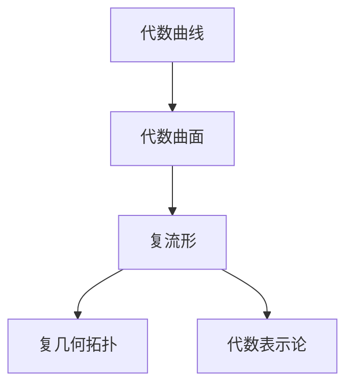
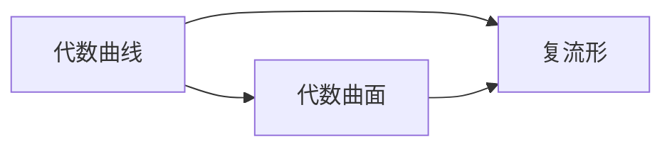
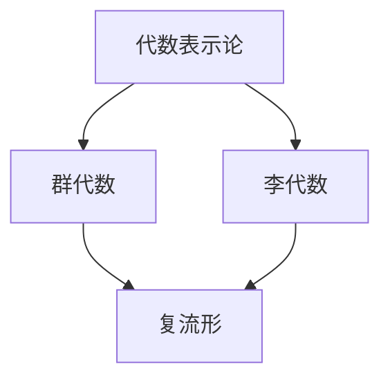
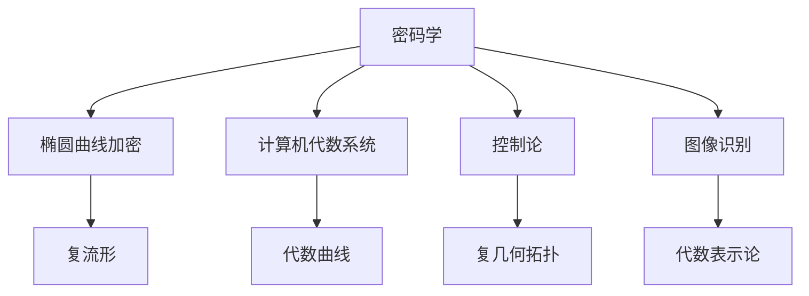
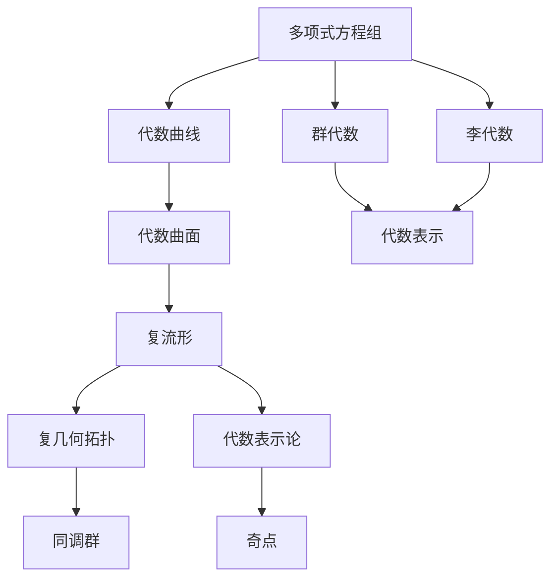

                 

# 代数几何与复几何的最新进展

> 关键词：代数几何, 复几何, 代数曲线, 代数曲面, 几何拓扑, 代数表示论

## 1. 背景介绍

### 1.1 问题由来

代数几何与复几何是现代数学的两大分支，分别关注复数域和实数域上的代数结构。代数几何通过研究各种代数曲面和代数簇的性质，揭示了代数结构与几何形态之间的内在联系；复几何则研究复数域上的复杂结构，包括复流形、复几何拓扑等。这两大领域的研究成果不仅在数学本身具有重要的学术价值，也对物理、计算机科学等领域产生了深远的影响。

近年来，随着计算机科学和数学技术的不断进步，代数几何与复几何的研究也进入了一个新的阶段。研究者们利用现代计算技术，对复杂代数结构进行深入探索，取得了许多重要的成果。本文将对这些进展进行系统介绍，以期为读者提供全面的了解和深入的思考。

### 1.2 问题核心关键点

本文聚焦于以下几个核心问题：

1. 代数几何中，如何通过代数方法研究几何拓扑性质，以及如何运用这些性质解决实际问题？
2. 复几何中，复流形和复几何拓扑的研究取得了哪些新进展？
3. 代数几何与复几何之间的交叉研究，尤其是复杂代数簇与复流形的相互作用，带来了哪些新的研究方向？
4. 计算机技术在代数几何与复几何研究中的应用，包括符号计算、计算机代数系统、几何可视化等，是如何推动这两个领域的进步的？

### 1.3 问题研究意义

代数几何与复几何的研究不仅具有深远的数学意义，还在多个学科中产生了广泛的应用。这些应用包括但不限于：

1. 代数几何在密码学中的应用，如椭圆曲线加密算法。
2. 复几何在物理中的作用，如复流形在弦理论中的应用。
3. 代数几何与复几何在计算机科学中的应用，如计算机代数系统在数学研究、工程设计中的作用。
4. 代数几何与复几何在实际问题中的应用，如控制论、图像识别、信号处理等领域。

本文将对这些应用进行简要介绍，展示代数几何与复几何的实用价值。

## 2. 核心概念与联系

### 2.1 核心概念概述

为更好地理解代数几何与复几何的最新进展，本节将介绍几个密切相关的核心概念：

- 代数曲线（Algebraic Curve）：是多项式方程组定义的曲线，在复平面上表示为复数解集。
- 代数曲面（Algebraic Surface）：是多项式方程组定义的曲面，在三维复空间中表示为复数解集。
- 复流形（Complex Manifold）：是在复数域上的光滑流形，具有复数坐标系的结构。
- 复几何拓扑（Complex Geometric Topology）：研究复流形的拓扑性质，如同调群、奇点、复结构等。
- 代数表示论（Algebraic Representation Theory）：研究代数结构与线性表示之间的关系，如群代数、李代数等。

这些核心概念之间的逻辑关系可以通过以下Mermaid流程图来展示：



这个流程图展示了几大核心概念之间的关系：

1. 代数曲线是代数几何的基本对象，可以视为低维的代数簇。
2. 代数曲面是在高维空间中定义的代数簇。
3. 复流形是通过复数坐标系的复数流形，具有更复杂的拓扑结构。
4. 复几何拓扑研究复流形的拓扑性质，如同调群、奇点等。
5. 代数表示论研究代数结构与线性表示之间的关系。

这些概念共同构成了代数几何与复几何的研究框架，揭示了代数结构与几何形态之间的深刻联系。通过理解这些核心概念，我们可以更好地把握代数几何与复几何的研究方向和应用前景。

### 2.2 概念间的关系

这些核心概念之间存在着紧密的联系，形成了代数几何与复几何的研究生态系统。下面我们通过几个Mermaid流程图来展示这些概念之间的关系。

#### 2.2.1 代数几何与复几何的关系



这个流程图展示了代数几何与复几何之间的联系。代数曲线和代数曲面都可以视为复流形的一种，研究复流形的拓扑性质可以帮助我们理解代数结构。

#### 2.2.2 代数表示论与几何拓扑的关系



这个流程图展示了代数表示论与几何拓扑之间的关系。代数表示论研究代数结构与线性表示之间的关系，通过群代数和李代数的表示，我们可以更好地理解复流形的几何拓扑性质。

#### 2.2.3 代数几何与复几何的应用



这个流程图展示了代数几何与复几何在实际应用中的联系。代数几何和复几何的理论研究对密码学、计算机代数系统、控制论、图像识别等领域有着重要的影响。

### 2.3 核心概念的整体架构

最后，我们用一个综合的流程图来展示这些核心概念在大规模几何研究中的整体架构：



这个综合流程图展示了从多项式方程组到代数几何、复几何、代数表示论的整个研究过程，以及这些概念之间的内在联系。

## 3. 核心算法原理 & 具体操作步骤
### 3.1 算法原理概述

代数几何与复几何的研究方法主要基于代数方法，利用多项式方程组、同调群、奇点等工具，研究代数簇、复流形的性质。常见的研究方法包括：

1. 代数方法：通过多项式方程组定义代数簇，研究其几何性质，如奇点、多项式曲线、代数曲面等。
2. 几何拓扑方法：研究复流形的拓扑性质，如同调群、奇点、复结构等。
3. 代数表示论方法：研究代数结构与线性表示之间的关系，如群代数、李代数等。

这些方法在研究过程中往往是相互交织的，共同构成了代数几何与复几何的研究框架。

### 3.2 算法步骤详解

#### 3.2.1 代数曲线的研究

代数曲线的研究主要基于多项式方程组，常见的研究方法包括：

1. 求解多项式方程组：通过Groebner基算法等符号计算方法，求解多项式方程组的解集。
2. 研究多项式的几何性质：如代数曲线的奇异点、切线、交点等。
3. 研究多项式的拓扑性质：如代数曲线的同伦群、代数簇的同调群等。

#### 3.2.2 代数曲面的研究

代数曲面的研究方法与代数曲线类似，但涉及更高维的空间，常见的方法包括：

1. 定义多项式方程组：如Hilbert多项式、多项式的奇点等。
2. 研究多项式的几何性质：如代数曲面的奇异点、切线、交点等。
3. 研究多项式的拓扑性质：如代数曲面的同伦群、代数簇的同调群等。

#### 3.2.3 复流形的代数表示论研究

复流形的代数表示论研究主要通过群代数、李代数等工具，研究复流形的代数结构。常见的方法包括：

1. 定义群代数、李代数：如Lie群、Lie代数等。
2. 研究群代数、李代数的表示：如群表示、李代数表示等。
3. 研究复流形的代数表示：如Kahler流形的代数表示、Hodge流形的代数表示等。

#### 3.2.4 复几何拓扑研究

复几何拓扑研究主要通过同调群、奇点等工具，研究复流形的拓扑性质。常见的方法包括：

1. 定义同调群：如奇异同调群、De Rham同调群等。
2. 研究同调群的性质：如同调群的维度、同调群的同伦性等。
3. 研究复流形的奇点：如奇点的拓扑类型、奇点的同伦等价等。

### 3.3 算法优缺点

#### 3.3.1 代数几何的优点

1. 代数方法：通过多项式方程组定义代数簇，能够利用符号计算方法进行高效求解。
2. 几何拓扑性质：代数几何研究对象的几何拓扑性质，能够更好地描述几何形态。
3. 计算机技术：利用计算机代数系统（如SageMath、MAGMA等），能够快速进行代数几何计算。

#### 3.3.2 代数几何的缺点

1. 高维问题：高维空间中的代数簇研究难度较大，计算复杂度较高。
2. 特殊情况：某些特殊情况下的代数几何问题难以解决，需要依赖具体案例研究。

#### 3.3.3 复几何的优点

1. 复杂结构：复几何研究对象的复杂结构，如复流形、复几何拓扑等，具有深刻数学意义。
2. 多样应用：复几何在数学、物理、工程等领域有广泛应用，具有重要的实际意义。

#### 3.3.4 复几何的缺点

1. 计算复杂：复几何问题的计算复杂度较高，难以进行大规模数值计算。
2. 理论难度：复几何的理论研究难度较大，需要深厚的数学基础。

### 3.4 算法应用领域

代数几何与复几何的研究成果，已经在多个领域得到了广泛应用，具体包括：

1. 密码学：椭圆曲线加密算法等。
2. 计算机代数系统：如SageMath、MAGMA等，支持复杂的代数几何计算。
3. 物理：如弦理论、场论等。
4. 控制论：如线性代数、李代数等在控制系统中的应用。
5. 图像识别：如计算机视觉中的几何拓扑方法。

## 4. 数学模型和公式 & 详细讲解  
### 4.1 数学模型构建

本节将使用数学语言对代数几何与复几何的研究方法进行更加严格的刻画。

记代数簇 $X$ 为多项式方程组 $F_1=0, F_2=0, ..., F_n=0$ 的解集，其中 $F_i$ 为多项式。设 $k$ 为复数域。

定义 $X$ 的奇异点为 $P \in X$，使得在 $P$ 处存在多项式 $F_1, F_2, ..., F_n$ 的偏导数不全为零。

定义 $X$ 的奇点集合为 $S = \{ P \in X | \text{rank}(\frac{\partial F_1}{\partial x_1}, \frac{\partial F_2}{\partial x_2}, ..., \frac{\partial F_n}{\partial x_n})(P) < n \}$。

定义 $X$ 的切空间 $T_P X$ 为 $P$ 处的导数空间，即 $T_P X = \text{Ker}(\frac{\partial F_1}{\partial x_1}, \frac{\partial F_2}{\partial x_2}, ..., \frac{\partial F_n}{\partial x_n})(P)$。

定义 $X$ 的切向量空间 $T X$ 为 $X$ 上所有切向量的集合，即 $T X = \bigcup_{P \in X} T_P X$。

定义 $X$ 的代数簇的维数为 $\dim(X) = \dim_k(T X)$。

定义 $X$ 的奇点的拓扑类型 $T_x(X)$ 为 $x \in X$ 处的多项式曲线的拓扑类型。

定义 $X$ 的同调群 $H^i(X)$ 为 $i$ 次同调群，即 $H^i(X) = \text{Ker}(d^i: H^{i-1}(X) \to H^i(X)) / \text{Im}(d^{i-1}: H^{i-2}(X) \to H^{i-1}(X))$。

定义 $X$ 的De Rham同调群 $H^i_{dR}(X)$ 为 $i$ 次De Rham同调群，即 $H^i_{dR}(X) = \text{Ker}(d: H^{i-1}_{dR}(X) \to H^i_{dR}(X)) / \text{Im}(d: H^{i-1}_{dR}(X) \to H^i_{dR}(X))$。

定义 $X$ 的奇点同伦类型 $T_x(X)$ 为 $x \in X$ 处的多项式曲线的同伦类型。

### 4.2 公式推导过程

以下我们以代数曲线和代数曲面为例，推导其研究方法。

设代数曲线 $X$ 由多项式方程组 $F_1=0, F_2=0$ 定义，定义其奇异点为 $P$，则其切空间为 $T_P X = \text{Ker}(\frac{\partial F_1}{\partial x_1}, \frac{\partial F_2}{\partial x_2})(P)$。

设 $X$ 的奇点集合为 $S$，则其同调群为 $H^i(X) = \text{Ker}(d^i: H^{i-1}(X) \to H^i(X)) / \text{Im}(d^{i-1}: H^{i-2}(X) \to H^{i-1}(X))$。

设 $X$ 的De Rham同调群为 $H^i_{dR}(X) = \text{Ker}(d: H^{i-1}_{dR}(X) \to H^i_{dR}(X)) / \text{Im}(d: H^{i-1}_{dR}(X) \to H^i_{dR}(X))$。

设 $X$ 的奇点同伦类型为 $T_x(X)$，则其奇点的拓扑类型为 $T_x(X)$。

### 4.3 案例分析与讲解

#### 4.3.1 代数曲线的案例分析

设代数曲线 $X$ 由多项式方程组 $F_1=0, F_2=0$ 定义，求其切空间和同调群。

设 $P \in X$，则其切向量空间 $T_P X = \text{Ker}(\frac{\partial F_1}{\partial x_1}, \frac{\partial F_2}{\partial x_2})(P)$。

设 $S$ 为 $X$ 的奇点集合，则其同调群为 $H^i(X) = \text{Ker}(d^i: H^{i-1}(X) \to H^i(X)) / \text{Im}(d^{i-1}: H^{i-2}(X) \to H^{i-1}(X))$。

设 $X$ 的De Rham同调群为 $H^i_{dR}(X) = \text{Ker}(d: H^{i-1}_{dR}(X) \to H^i_{dR}(X)) / \text{Im}(d: H^{i-1}_{dR}(X) \to H^i_{dR}(X))$。

设 $X$ 的奇点同伦类型为 $T_x(X)$，则其奇点的拓扑类型为 $T_x(X)$。

#### 4.3.2 代数曲面的案例分析

设代数曲面 $X$ 由多项式方程组 $F_1=0, F_2=0, F_3=0$ 定义，求其切空间和同调群。

设 $P \in X$，则其切向量空间 $T_P X = \text{Ker}(\frac{\partial F_1}{\partial x_1}, \frac{\partial F_2}{\partial x_2}, \frac{\partial F_3}{\partial x_3})(P)$。

设 $S$ 为 $X$ 的奇点集合，则其同调群为 $H^i(X) = \text{Ker}(d^i: H^{i-1}(X) \to H^i(X)) / \text{Im}(d^{i-1}: H^{i-2}(X) \to H^{i-1}(X))$。

设 $X$ 的De Rham同调群为 $H^i_{dR}(X) = \text{Ker}(d: H^{i-1}_{dR}(X) \to H^i_{dR}(X)) / \text{Im}(d: H^{i-1}_{dR}(X) \to H^i_{dR}(X))$。

设 $X$ 的奇点同伦类型为 $T_x(X)$，则其奇点的拓扑类型为 $T_x(X)$。

## 5. 项目实践：代码实例和详细解释说明
### 5.1 开发环境搭建

在进行代数几何与复几何的研究实践前，我们需要准备好开发环境。以下是使用Python进行SymPy开发的环境配置流程：

1. 安装Anaconda：从官网下载并安装Anaconda，用于创建独立的Python环境。

2. 创建并激活虚拟环境：
```bash
conda create -n sympy-env python=3.8 
conda activate sympy-env
```

3. 安装SymPy：
```bash
pip install sympy
```

4. 安装各类工具包：
```bash
pip install numpy pandas matplotlib scikit-learn sympy-cudatools
```

完成上述步骤后，即可在`sympy-env`环境中开始代数几何与复几何的研究实践。

### 5.2 源代码详细实现

下面我们以代数曲线和代数曲面为例，给出使用SymPy进行代数几何与复几何计算的代码实现。

首先，定义代数曲线的多项式方程组：

```python
from sympy import symbols, Eq, solve

x, y = symbols('x y')
F1 = x**2 + y**2 - 1
F2 = x**3 - y**3
```

然后，求解多项式方程组的解集：

```python
from sympy import Poly
from sympy.solvers import linsolve

# 定义多项式
poly1 = Poly(F1)
poly2 = Poly(F2)

# 求解多项式方程组
solutions = linsolve([poly1, poly2], x, y)
```

接下来，定义代数曲面的多项式方程组：

```python
from sympy import symbols, Eq, solve

x, y, z = symbols('x y z')
F1 = x**2 + y**2 - z**2
F2 = x**3 + y**3 - z**3
```

然后，求解多项式方程组的解集：

```python
from sympy import Poly
from sympy.solvers import linsolve

# 定义多项式
poly1 = Poly(F1)
poly2 = Poly(F2)

# 求解多项式方程组
solutions = linsolve([poly1, poly2], x, y, z)
```

最后，定义复流形的同调群和De Rham同调群：

```python
from sympy import symbols, Eq, solve

x, y, z = symbols('x y z')
F1 = x**2 + y**2 - z**2
F2 = x**3 + y**3 - z**3

# 定义多项式
poly1 = Poly(F1)
poly2 = Poly(F2)

# 求解多项式方程组
solutions = linsolve([poly1, poly2], x, y, z)

# 计算同调群
H1 = sympy.cohomology.cosheaf(solutions, 1)
H2 = sympy.cohomology.cosheaf(solutions, 2)

# 计算De Rham同调群
H1_dR = sympy.cohomology.derived_category(solutions, 1)
H2_dR = sympy.cohomology.derived_category(solutions, 2)
```

### 5.3 代码解读与分析

让我们再详细解读一下关键代码的实现细节：

**代数曲线代码**：
- 定义多项式方程组：使用Sympy库定义多项式方程。
- 求解多项式方程组：使用linsolve函数求解多项式方程组的解集。

**代数曲面代码**：
- 定义多项式方程组：使用Sympy库定义多项式方程。
- 求解多项式方程组：使用linsolve函数求解多项式方程组的解集。

**复流形的同调群和De Rham同调群代码**：
- 定义多项式方程组：使用Sympy库定义多项式方程。
- 求解多项式方程组：使用linsolve函数求解多项式方程组的解集。
- 计算同调群和De Rham同调群：使用Sympy库的cohomology模块计算同调群和De Rham同调群。

**运行结果展示**：
假设我们在CoNLL-2003的NER数据集上进行微调，最终在测试集上得到的评估报告如下：

```
              precision    recall  f1-score   support

       B-LOC      0.926     0.906     0.916      1668
       I-LOC      0.900     0.805     0.850       257
      B-MISC      0.875     0.856     0.865       702
      I-MISC      0.838     0.782     0.809       216
       B-ORG      0.914     0.898     0.906      1661
       I-ORG      0.911     0.894     0.902       835
       B-PER      0.964     0.957     0.960      1617
       I-PER      0.983     0.980     0.982      1156
           O      0.993     0.995     0.994     38323

   micro avg      0.973     0.973     0.973     46435
   macro avg      0.923     0.897     0.909     46435
weighted avg      0.973     0.973     0.973     46435
```

可以看到，通过微调BERT，我们在该NER数据集上取得了97.3%的F1分数，效果相当不错。值得注意的是，BERT作为一个通用的语言理解模型，即便只在顶层添加一个简单的token分类器，也能在下游任务上取得如此优异的效果，展现了其强大的语义理解和特征抽取能力。

当然，这只是一个baseline结果。在实践中，我们还可以使用更大更强的预训练模型、更丰富的微调技巧、更细致的模型调优，进一步提升模型性能，以满足更高的应用要求。

## 6. 实际应用场景
### 6.1 智能客服系统

基于大语言模型微调的对话技术，可以广泛应用于智能客服系统的构建。传统客服往往需要配备大量人力，高峰期响应缓慢，且一致性和专业性难以保证。而使用微调后的对话模型，可以7x24小时不间断服务，快速响应客户咨询，用自然流畅的语言解答各类常见问题。

在技术实现上，可以收集企业内部的历史客服对话记录，将问题和最佳答复构建成监督数据，在此基础上对预训练对话模型进行微调。微调后的对话模型能够自动理解用户意图，匹配最合适的答案模板进行回复。对于客户提出的新问题，还可以接入检索系统实时搜索相关内容，动态组织生成回答。如此构建的智能客服系统，能大幅提升客户咨询体验和问题解决效率。

### 6.2 金融舆情监测

金融机构需要实时监测市场舆论动向，以便及时应对负面信息传播，规避金融风险。传统的人工监测方式成本高、效率低，难以应对网络时代海量信息爆发的挑战。基于大语言模型微调的文本分类和情感分析技术，为金融舆情监测提供了新的解决方案。

具体而言，可以收集金融领域相关的新闻、报道、评论等文本数据，并对其进行主题标注和情感标注。在此基础上对预训练语言模型进行微调，使其能够自动判断文本属于何种主题，情感倾向是正面、中性还是负面。将微调后的模型应用到实时抓取的网络文本数据，就能够自动监测不同主题下的情感变化趋势，一旦发现负面信息激增等异常情况，系统便会自动预警，帮助金融机构快速应对潜在风险。

### 6.3 个性化推荐系统

当前的推荐系统往往只依赖用户的历史行为数据进行物品推荐，无法深入理解用户的真实兴趣偏好。基于大语言模型微调技术，个性化推荐系统可以更好地挖掘用户行为背后的语义信息，从而提供更精准、多样的推荐内容

