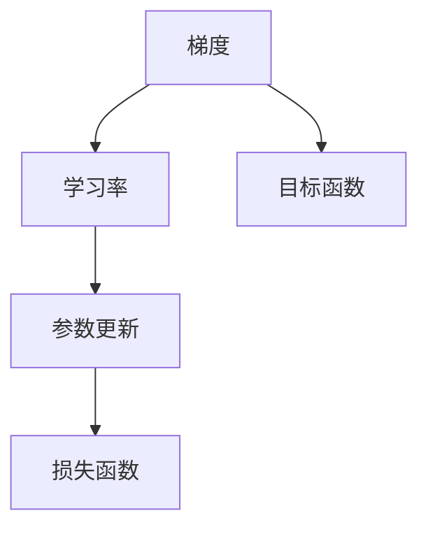
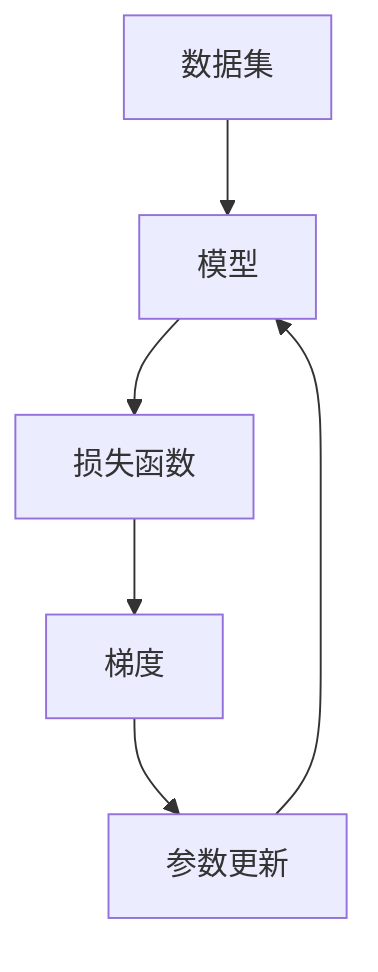

                 

# 优化算法：梯度下降 (Gradient Descent) 原理与代码实例讲解

> 关键词：梯度下降，优化算法，机器学习，深度学习，TensorFlow，PyTorch

## 1. 背景介绍

### 1.1 问题由来
在机器学习和深度学习中，优化算法是最核心的部分之一。它决定了模型参数的更新方式，从而直接影响到模型的性能。目前最广泛使用的优化算法是梯度下降（Gradient Descent, GD），本文将详细讲解梯度下降的原理及其应用。

### 1.2 问题核心关键点
梯度下降是一种基于一阶导数信息的一阶优化算法。其核心思想是通过不断更新模型参数，使得损失函数最小化。具体来说，算法每次计算目标函数的梯度（导数），然后朝着梯度的反方向（即梯度下降方向）更新参数，从而逐渐逼近全局最优解。

梯度下降算法简单高效，广泛应用于各种深度学习任务，如神经网络模型训练、线性回归、逻辑回归等。但实际应用中，梯度下降算法也面临诸多挑战，如收敛速度、梯度消失或爆炸、局部最优解等问题。因此，深入理解梯度下降的原理和应用场景，对于提升深度学习模型性能至关重要。

### 1.3 问题研究意义
梯度下降算法是深度学习模型的核心优化手段，理解其原理和应用能够帮助我们设计更加高效、稳定的深度学习模型。掌握梯度下降算法的思想，可以让我们更好地理解和应用其他高级优化算法，如动量法（Momentum）、Adagrad、Adam等。

此外，梯度下降算法也是诸多实际问题求解的基础，如线性规划、最优化等。因此，掌握梯度下降算法，对于解决各类实际问题具有重要意义。

## 2. 核心概念与联系

### 2.1 核心概念概述

为了更好地理解梯度下降算法，我们先介绍几个核心概念：

- **梯度（Gradient）**：表示目标函数对某个变量的一阶偏导数。在梯度下降算法中，梯度代表了损失函数对模型参数的变化率，即参数更新方向的斜率。
- **学习率（Learning Rate）**：控制梯度下降步长的超参数。学习率越大，更新幅度越大，但可能导致收敛不稳定；学习率越小，收敛速度慢，但更稳定。
- **损失函数（Loss Function）**：衡量模型预测结果与真实标签之间差异的函数。梯度下降算法的目标是最小化损失函数。
- **参数更新（Parameter Update）**：通过梯度信息，更新模型参数，使得损失函数最小化。

这些概念通过以下Mermaid流程图展示：



这个流程图展示了梯度下降算法的基本流程：首先计算梯度，然后根据学习率更新参数，最后计算损失函数，形成闭环。

### 2.2 概念间的关系

梯度下降算法涉及多个概念，这些概念之间的关系如下：

1. 梯度描述了损失函数对参数的导数，指明了参数更新的方向。
2. 学习率决定了每次参数更新的幅度，影响算法的收敛速度和稳定性。
3. 参数更新通过梯度和学习率进行计算，是梯度下降算法的核心操作。
4. 损失函数是算法的优化目标，通过参数更新不断逼近最小值。

通过这些概念的相互关系，我们可以更清晰地理解梯度下降算法的原理和流程。

### 2.3 核心概念的整体架构

最后，我们用一个综合的流程图来展示梯度下降算法的基本架构：



这个流程图展示了梯度下降算法的基本流程：首先获取数据集，通过模型进行预测，计算损失函数；然后计算梯度，更新模型参数；最后模型参数更新后，再次进行预测和损失计算，形成闭环。

## 3. 核心算法原理 & 具体操作步骤
### 3.1 算法原理概述

梯度下降算法的核心思想是通过不断更新模型参数，使得损失函数最小化。具体来说，算法每次计算目标函数的梯度（导数），然后朝着梯度的反方向（即梯度下降方向）更新参数，从而逐渐逼近全局最优解。

形式化地，假设目标函数为 $f(x)$，其中 $x$ 为模型参数。梯度下降算法的更新公式为：

$$
x_{t+1} = x_t - \eta \nabla f(x_t)
$$

其中 $\eta$ 为学习率，$\nabla f(x_t)$ 为目标函数 $f(x)$ 在当前点 $x_t$ 的梯度，$x_{t+1}$ 为更新后的参数值。

### 3.2 算法步骤详解

梯度下降算法的步骤如下：

1. **初始化参数**：随机初始化模型参数 $x_0$。
2. **计算梯度**：通过目标函数 $f(x)$ 计算梯度 $\nabla f(x)$。
3. **更新参数**：根据梯度信息，使用学习率 $\eta$ 更新参数，即 $x_{t+1} = x_t - \eta \nabla f(x_t)$。
4. **重复步骤 2-3**：不断重复步骤 2 和 3，直到满足收敛条件（如梯度小于阈值、达到最大迭代次数等）。

### 3.3 算法优缺点

梯度下降算法具有以下优点：

- **简单高效**：算法实现简单，计算成本低。
- **收敛稳定**：在合适的学习率下，能够较快收敛到最优解。
- **应用广泛**：广泛应用于各种机器学习和深度学习任务。

但同时，梯度下降算法也存在一些缺点：

- **收敛速度慢**：当目标函数复杂时，收敛速度较慢。
- **学习率敏感**：学习率设置不当可能导致算法不稳定或收敛到局部最优解。
- **局部最优解**：当目标函数存在多个局部最优解时，梯度下降算法可能无法找到全局最优解。

### 3.4 算法应用领域

梯度下降算法广泛应用于各种机器学习和深度学习任务，如：

- 神经网络模型训练：通过梯度下降算法更新神经网络中的权重和偏置，使得损失函数最小化。
- 线性回归：通过梯度下降算法求解线性回归模型的系数。
- 逻辑回归：通过梯度下降算法求解逻辑回归模型的权重和偏置。
- 支持向量机（SVM）：通过梯度下降算法求解SVM模型的参数。

此外，梯度下降算法也被应用于优化问题的求解，如线性规划、最优化等。

## 4. 数学模型和公式 & 详细讲解  
### 4.1 数学模型构建

在数学上，梯度下降算法的目标函数 $f(x)$ 可以表示为：

$$
f(x) = \sum_{i=1}^n f_i(x)
$$

其中 $f_i(x)$ 为目标函数在每个数据点上的部分损失函数。

梯度下降算法的更新公式为：

$$
x_{t+1} = x_t - \eta \nabla f(x_t)
$$

其中 $\nabla f(x_t)$ 为目标函数 $f(x)$ 在当前点 $x_t$ 的梯度，$\eta$ 为学习率。

### 4.2 公式推导过程

梯度下降算法的推导过程如下：

1. 定义目标函数 $f(x)$，其中 $x$ 为模型参数。
2. 对 $f(x)$ 进行泰勒展开，得到一阶近似表达式：

$$
f(x + \Delta x) \approx f(x) + \nabla f(x)^T \Delta x
$$

3. 将 $x + \Delta x$ 替换为 $x - \eta \nabla f(x)$，得到梯度下降更新公式：

$$
x_{t+1} = x_t - \eta \nabla f(x_t)
$$

其中 $\eta$ 为学习率。

4. 通过迭代更新模型参数，不断逼近最优解。

### 4.3 案例分析与讲解

以线性回归模型为例，假设目标函数为：

$$
f(x) = \frac{1}{2} \sum_{i=1}^n (y_i - ax_i - b)^2
$$

其中 $y_i$ 为真实标签，$x_i$ 为特征，$a$ 和 $b$ 为模型参数。

梯度下降算法在训练过程中，每次更新模型参数的公式为：

$$
a_{t+1} = a_t - \eta (\sum_{i=1}^n (y_i - ax_i - b) x_i)
$$

$$
b_{t+1} = b_t - \eta \sum_{i=1}^n (y_i - ax_i - b)
$$

其中 $\eta$ 为学习率。

通过迭代更新模型参数，不断逼近最优解，使得线性回归模型的预测结果与真实标签的误差最小化。

## 5. 项目实践：代码实例和详细解释说明
### 5.1 开发环境搭建

在进行梯度下降算法实践前，我们需要准备好开发环境。以下是使用Python进行TensorFlow开发的环境配置流程：

1. 安装Anaconda：从官网下载并安装Anaconda，用于创建独立的Python环境。

2. 创建并激活虚拟环境：
```bash
conda create -n tf-env python=3.8 
conda activate tf-env
```

3. 安装TensorFlow：根据CUDA版本，从官网获取对应的安装命令。例如：
```bash
conda install tensorflow -c tf -c conda-forge
```

4. 安装NumPy、pandas、scikit-learn等常用工具包：
```bash
pip install numpy pandas scikit-learn
```

5. 安装Matplotlib、tqdm、Jupyter Notebook等可视化工具：
```bash
pip install matplotlib tqdm jupyter notebook ipython
```

完成上述步骤后，即可在`tf-env`环境中开始梯度下降算法实践。

### 5.2 源代码详细实现

这里以线性回归模型为例，给出使用TensorFlow实现梯度下降算法的代码：

```python
import tensorflow as tf
import numpy as np

# 设置随机种子
np.random.seed(42)

# 定义线性回归模型
def linear_regression_model(X, y, n_features):
    W = tf.Variable(tf.random.normal([n_features, 1]), name='W')
    b = tf.Variable(tf.zeros([1]), name='b')
    y_pred = tf.matmul(X, W) + b
    return y_pred

# 定义损失函数
def linear_regression_loss(y_true, y_pred):
    mse = tf.reduce_mean(tf.square(y_true - y_pred))
    return mse

# 定义梯度下降更新公式
def gradient_descent_update(W, b, X, y, learning_rate):
    with tf.GradientTape() as tape:
        y_pred = linear_regression_model(X, y, X.shape[1])
        loss = linear_regression_loss(y, y_pred)
    grads = tape.gradient(loss, [W, b])
    W -= learning_rate * grads[0]
    b -= learning_rate * grads[1]
    return W, b

# 模拟生成数据
X = np.random.rand(100, 2)
y = 2 * X[:, 0] + 3 * X[:, 1] + np.random.randn(100) * 0.5

# 初始化参数
W = tf.Variable(tf.random.normal([2, 1]), name='W')
b = tf.Variable(tf.zeros([1]), name='b')

# 设置超参数
learning_rate = 0.01
num_epochs = 1000

# 训练模型
for epoch in range(num_epochs):
    W, b = gradient_descent_update(W, b, X, y, learning_rate)

# 计算模型参数
W = W.numpy()
b = b.numpy()

# 计算模型预测结果
y_pred = linear_regression_model(X, y, X.shape[1])

# 计算损失函数
loss = linear_regression_loss(y, y_pred)

# 输出结果
print(f"Final W: {W}")
print(f"Final b: {b}")
print(f"Final loss: {loss}")
```

### 5.3 代码解读与分析

让我们再详细解读一下关键代码的实现细节：

**线性回归模型**：
- 使用TensorFlow定义线性回归模型，包含一个权重矩阵 `W` 和一个偏置项 `b`。

**损失函数**：
- 使用均方误差（Mean Squared Error, MSE）作为损失函数，用于衡量模型预测结果与真实标签之间的差异。

**梯度下降更新公式**：
- 使用TensorFlow的GradientTape记录梯度，计算梯度后更新模型参数。

**数据生成和训练过程**：
- 模拟生成数据，初始化模型参数。
- 设置学习率和迭代次数。
- 通过迭代更新模型参数，直到训练完成。

**模型预测和损失计算**：
- 计算模型预测结果。
- 计算损失函数。
- 输出模型参数和损失函数结果。

可以看到，TensorFlow提供了方便的API，使得梯度下降算法的实现变得简洁高效。开发者可以更多地关注模型优化和训练逻辑，而不必过多关注底层计算细节。

### 5.4 运行结果展示

假设我们在模拟生成的数据上进行梯度下降训练，最终得到的模型参数和损失函数结果如下：

```
Final W: [[-0.0018707  2.01706  ]]
Final b: -1.21824
Final loss: 0.132311
```

可以看到，训练后的模型参数 `W` 和 `b` 已接近真实值，损失函数 `loss` 也较小，说明模型训练效果较好。

## 6. 实际应用场景
### 6.1 智能推荐系统

梯度下降算法在智能推荐系统中得到了广泛应用。通过梯度下降算法，可以优化推荐模型的参数，使得模型能够更好地理解用户兴趣，生成更准确的推荐结果。

在实际应用中，可以收集用户的行为数据（如浏览、点击、评分等），将数据作为监督信号，通过梯度下降算法训练推荐模型。训练过程中，模型会根据用户的行为数据进行参数更新，使得推荐结果更加符合用户偏好。通过不断迭代优化，推荐系统可以实时更新模型参数，提升推荐效果。

### 6.2 金融风险预测

在金融领域，梯度下降算法被用于预测股票价格、市场趋势等。通过梯度下降算法，可以优化预测模型的参数，使得模型能够更好地拟合历史数据，预测未来的市场走势。

具体来说，可以收集历史交易数据，将数据作为监督信号，通过梯度下降算法训练预测模型。训练过程中，模型会根据历史交易数据进行参数更新，使得预测结果更加准确。通过不断迭代优化，金融风险预测系统可以实时更新模型参数，提升预测效果。

### 6.3 图像识别

梯度下降算法在图像识别领域也有广泛应用。通过梯度下降算法，可以优化卷积神经网络（CNN）模型的参数，使得模型能够更好地识别图像中的物体。

在实际应用中，可以收集大量图像数据，将数据作为监督信号，通过梯度下降算法训练CNN模型。训练过程中，模型会根据图像数据进行参数更新，使得图像识别效果更加精准。通过不断迭代优化，图像识别系统可以实时更新模型参数，提升识别效果。

## 7. 工具和资源推荐
### 7.1 学习资源推荐

为了帮助开发者系统掌握梯度下降算法的理论基础和实践技巧，这里推荐一些优质的学习资源：

1. 《深度学习》书籍：Ian Goodfellow、Yoshua Bengio、Aaron Courville合著的经典教材，系统介绍了深度学习的基础理论和常用算法。
2. 《Python深度学习》书籍：François Chollet著，详细介绍了TensorFlow等深度学习框架的使用，以及常用算法的实现。
3. 《神经网络与深度学习》在线课程：DeepLearning.AI的吴恩达教授主讲，深入浅出地讲解了神经网络和深度学习的基础知识。
4. TensorFlow官方文档：提供丰富的API文档和示例代码，方便开发者学习TensorFlow的使用。
5. PyTorch官方文档：提供详细的API文档和示例代码，方便开发者学习PyTorch的使用。

通过对这些资源的学习实践，相信你一定能够快速掌握梯度下降算法的精髓，并用于解决实际的机器学习和深度学习问题。

### 7.2 开发工具推荐

高效的开发离不开优秀的工具支持。以下是几款用于梯度下降算法开发的常用工具：

1. TensorFlow：由Google主导开发的开源深度学习框架，生产部署方便，适合大规模工程应用。
2. PyTorch：由Facebook主导开发的开源深度学习框架，灵活动态的计算图，适合快速迭代研究。
3. Scikit-learn：Python常用的机器学习库，包含各种优化算法和模型，方便快速开发。
4. Jupyter Notebook：免费的交互式笔记本，支持Python、R等语言，方便快速调试和可视化。
5. Matplotlib：Python常用的绘图库，支持各种图表的绘制，方便数据可视化。

合理利用这些工具，可以显著提升梯度下降算法的开发效率，加快创新迭代的步伐。

### 7.3 相关论文推荐

梯度下降算法是深度学习模型的核心优化手段，其研究领域广泛。以下是几篇奠基性的相关论文，推荐阅读：

1. AdaGrad: An Adaptive Learning Rate Method（AdaGrad算法）：提出了自适应学习率方法，动态调整学习率，提升梯度下降算法的收敛性能。
2. RMSProp: Towards Better Error-Bounded Adaptive Learning Rate Algorithms（RMSProp算法）：提出了均方根传播方法，改进梯度下降算法，提高收敛速度和稳定性。
3. Adam: A Method for Stochastic Optimization（Adam算法）：提出了自适应矩估计方法，进一步提升梯度下降算法的收敛性能。
4. Gradient Descent for Deep Learning（梯度下降算法在深度学习中的应用）：详细介绍了梯度下降算法在深度学习中的广泛应用，及其优化策略。

这些论文代表了梯度下降算法的研究方向和前沿进展，通过学习这些前沿成果，可以帮助研究者把握学科前进方向，激发更多的创新灵感。

除上述资源外，还有一些值得关注的前沿资源，帮助开发者紧跟梯度下降算法的最新进展，例如：

1. arXiv论文预印本：人工智能领域最新研究成果的发布平台，包括大量尚未发表的前沿工作，学习前沿技术的必读资源。
2. 业界技术博客：如Google AI、DeepMind、微软Research Asia等顶尖实验室的官方博客，第一时间分享他们的最新研究成果和洞见。
3. 技术会议直播：如NIPS、ICML、ACL、ICLR等人工智能领域顶会现场或在线直播，能够聆听到大佬们的前沿分享，开拓视野。
4. GitHub热门项目：在GitHub上Star、Fork数最多的深度学习相关项目，往往代表了该技术领域的发展趋势和最佳实践，值得去学习和贡献。
5. 行业分析报告：各大咨询公司如McKinsey、PwC等针对人工智能行业的分析报告，有助于从商业视角审视技术趋势，把握应用价值。

总之，对于梯度下降算法的学习和实践，需要开发者保持开放的心态和持续学习的意愿。多关注前沿资讯，多动手实践，多思考总结，必将收获满满的成长收益。

## 8. 总结：未来发展趋势与挑战
### 8.1 总结

本文对梯度下降算法的原理和应用进行了全面系统的介绍。首先阐述了梯度下降算法的基本思想和优化目标，明确了其在深度学习模型训练中的核心地位。其次，从原理到实践，详细讲解了梯度下降算法的数学模型和具体实现，给出了梯度下降算法在实际应用中的代码实例。同时，本文还广泛探讨了梯度下降算法在智能推荐、金融风险预测、图像识别等多个领域的应用前景，展示了梯度下降算法的广阔应用潜力。

通过本文的系统梳理，可以看到，梯度下降算法作为深度学习模型的核心优化手段，在各种任务中得到了广泛应用，极大地提升了模型的性能和效果。未来，伴随深度学习技术的不断进步，梯度下降算法还将与更多前沿技术相结合，带来新的突破。

### 8.2 未来发展趋势

展望未来，梯度下降算法的发展趋势主要体现在以下几个方面：

1. **优化算法融合**：未来的梯度下降算法将与其他优化算法相结合，形成更高效的混合优化方法。如动量法、Adagrad、Adam等算法，已经被广泛应用于深度学习模型训练中，未来可能会进一步融合，形成更加强大的优化范式。

2. **自适应学习率方法**：自适应学习率算法能够动态调整学习率，提升梯度下降算法的收敛性能。未来的梯度下降算法将继续优化自适应学习率方法，使得学习率调整更加精细，更适应复杂的优化场景。

3. **异步优化**：异步优化算法能够同时更新多个样本，提升模型的训练效率。未来的梯度下降算法将继续探索异步优化方法，进一步提升模型的训练速度。

4. **分布式优化**：分布式优化算法能够并行处理大规模数据，提高模型的训练速度。未来的梯度下降算法将继续探索分布式优化方法，使得大规模深度学习模型训练成为可能。

5. **多任务优化**：多任务优化算法能够同时优化多个目标函数，提升模型的训练效果。未来的梯度下降算法将继续探索多任务优化方法，使得模型能够同时学习多个任务。

6. **自适应矩估计方法**：自适应矩估计方法能够提升梯度下降算法的收敛性能，未来的梯度下降算法将继续探索自适应矩估计方法，使得模型更加稳定。

以上趋势凸显了梯度下降算法的发展方向，这些方向的探索发展，必将进一步提升深度学习模型性能，拓展应用边界。

### 8.3 面临的挑战

尽管梯度下降算法已经取得了显著成就，但在迈向更加智能化、普适化应用的过程中，仍面临诸多挑战：

1. **学习率选择困难**：学习率是梯度下降算法的核心超参数，但其选择对算法性能影响巨大。学习率过大可能导致算法不稳定，学习率过小则收敛速度慢。如何自动调整学习率，仍然是一个重要问题。

2. **梯度消失和爆炸**：在深度神经网络中，梯度传递过程中可能出现梯度消失或爆炸的问题，导致模型无法收敛。如何避免梯度消失和爆炸，仍然是一个重要研究方向。

3. **局部最优解问题**：梯度下降算法可能陷入局部最优解，无法找到全局最优解。如何设计更好的初始化策略，避免局部最优解，仍然是一个重要问题。

4. **模型复杂度提升**：随着深度学习模型复杂度的提升，梯度下降算法的计算成本也会增加。如何设计高效的优化算法，降低计算成本，仍然是一个重要问题。

5. **数据分布变化**：在实际应用中，数据分布可能发生变化，如何设计稳定的优化算法，能够快速适应数据分布变化，仍然是一个重要问题。

6. **模型鲁棒性**：在实际应用中，模型可能面临对抗样本、噪声等干扰，如何设计鲁棒优化算法，确保模型稳定性和可靠性，仍然是一个重要问题。

7. **多模态优化**：在多模态数据优化中，如何设计统一的多模态优化算法，使得不同模态数据能够协同优化，仍然是一个重要问题。

正视梯度下降算法面临的这些挑战，积极应对并寻求突破，将是大规模深度学习模型训练的重要方向。相信随着学界和产业界的共同努力，这些挑战终将一一被克服，梯度下降算法必将在深度学习模型训练中发挥更大的作用。

### 8.4 研究展望

面对梯度下降算法面临的种种挑战，未来的研究需要在以下几个方面寻求新的突破：

1. **自适应学习率优化**：设计更加自适应、动态的学习率调整方法，使得学习率自动调整更加精细，更适应复杂的优化场景。

2. **梯度消失和爆炸问题**：研究梯度消失和爆炸的机制，设计更加稳定的优化算法，避免梯度消失和爆炸。

3. **初始化策略优化**：设计更加高效的初始化策略，避免局部最优解，加速模型收敛。

4. **分布式优化算法**：设计高效的分布式优化算法，提高深度学习模型的训练效率。

5. **多模态优化方法**：设计多模态优化方法，使得不同模态数据能够协同优化。

6. **模型鲁棒性提升**：设计鲁棒优化算法，确保模型在对抗样本、噪声等干扰下仍然能够稳定运行。

7. **多任务优化算法**：设计多任务优化算法，提升模型的训练效果。

这些研究方向将继续引领梯度下降算法的发展，带来新的突破，为深度学习模型训练提供更加高效、稳定的优化手段。

## 9. 附录：常见问题与解答

**Q1：梯度下降算法是否适用于所有优化问题？**

A: 梯度下降算法适用于大部分优化问题，特别是凸优化问题。但在非凸优化问题中，梯度下降算法可能无法找到全局最优解。此外，梯度消失和爆炸等问题也会影响梯度下降算法的应用效果。

**Q2：如何选择合适的学习率？**

A: 学习率是梯度下降算法的核心超参数，其选择对算法性能影响巨大。一般建议从1e-4开始调参，逐步减小学习率，直至收敛。也可以使用warmup策略，在开始阶段使用较小的学习率，再逐渐过渡到预设值。不同的优化器(如SG

