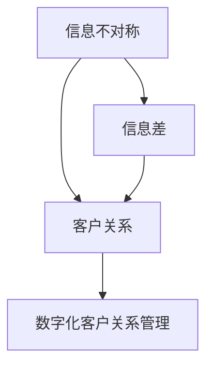

                 

# 信息差：信息不对称与客户关系

## 1. 背景介绍

### 1.1 问题由来
在数字化时代，信息流通的速度和广度大大提升，但与此同时，信息不对称的问题也日益凸显。客户在产品和服务选择上面临着大量信息，但往往缺乏全面客观的了解，难以做出明智的决策。信息不对称不仅增加了决策难度，还可能引发消费者的信任危机，影响客户关系。因此，如何有效地缩小信息差，提升客户体验，成为企业数字化转型的关键问题之一。

### 1.2 问题核心关键点
信息不对称主要体现在信息供给方和需求方之间的信息不匹配。供给方通常掌握更多、更详细的产品和服务信息，而需求方由于获取信息渠道有限，难以获得全面准确的了解。这种信息差会导致：
- 客户误解：对产品特性和服务的误解，影响用户体验和满意度。
- 决策困难：由于缺乏全面信息，客户在决策时容易产生焦虑和犹豫。
- 信任缺失：信息不对称会导致客户对企业和产品产生不信任，影响长期关系维护。

## 2. 核心概念与联系

### 2.1 核心概念概述

为了更好地理解信息差及其对客户关系的影响，我们需要先明确几个核心概念：

- 信息不对称：指信息供给方和需求方在信息获取上的不平衡，导致一方拥有更多、更准确的信息。
- 客户关系：指企业与客户之间的互动和联系，包括信任、忠诚度、满意度等方面。
- 信息差：指信息供给方和需求方之间的信息差距，需要通过有效手段进行缩小。
- 数字化客户关系管理：指利用数字化手段，如大数据、人工智能等，提升客户关系管理水平。

这些概念之间存在着紧密的联系。信息不对称是信息差产生的根源，而信息差的存在会严重影响客户关系。通过数字化客户关系管理，企业可以更加高效地获取和利用客户信息，缩小信息差，提升客户体验和满意度。

### 2.2 概念间的关系

这些核心概念之间的逻辑关系可以通过以下Mermaid流程图来展示：



这个流程图展示了信息不对称导致信息差，进而影响客户关系，最后通过数字化手段进行管理的过程。通过数字化手段，企业可以更好地获取和处理信息，缩小信息差，从而提升客户关系管理水平。

## 3. 核心算法原理 & 具体操作步骤
### 3.1 算法原理概述

信息差的缩小需要通过数字化手段实现，主要包括以下几个方面：

- 数据收集：通过各种渠道（如官网、APP、社交媒体等）收集客户行为数据、反馈数据等。
- 数据分析：利用机器学习和数据挖掘技术，对收集到的数据进行分析和处理。
- 信息展示：通过各种渠道（如网站、邮件、短信等）向客户展示分析结果，提供有价值的信息。
- 客户互动：通过在线客服、社区论坛等渠道，与客户进行互动，解答疑问，提供支持。

这些步骤构成了一个闭环，从数据收集到信息展示和客户互动，形成了完整的数字化客户关系管理流程。

### 3.2 算法步骤详解

#### 3.2.1 数据收集

数据收集是数字化客户关系管理的基础。通过以下方式收集客户信息：

- 网站行为数据：通过cookies、行为追踪等技术，收集客户在网站上的浏览、点击、停留等行为数据。
- 应用行为数据：通过移动设备的应用程序，收集客户的购买、评价、社交互动等行为数据。
- 社交媒体数据：通过爬虫或API接口，收集客户在社交媒体上的活动数据。
- 客户反馈数据：通过在线问卷、客服记录等方式，收集客户的直接反馈数据。

#### 3.2.2 数据分析

数据分析是信息差缩小的核心步骤。通过以下技术对收集到的数据进行分析和处理：

- 数据清洗：去除重复、错误、无关的数据，确保数据质量。
- 特征工程：提取和构建有意义的特征，如客户偏好、行为模式等。
- 机器学习模型：利用分类、聚类、回归等算法，对客户进行分类、预测等。
- 数据可视化：通过图表、报告等方式，展示分析结果，帮助决策者理解数据。

#### 3.2.3 信息展示

信息展示是将数据分析结果呈现给客户的过程。通过以下方式向客户展示信息：

- 网站推荐系统：根据客户行为数据，推荐相关产品或服务。
- 个性化邮件：根据客户偏好和行为数据，发送个性化邮件。
- 社交媒体推送：根据客户在社交媒体上的活动，推送相关内容。
- 在线客服互动：通过在线客服，解答客户的疑问，提供个性化建议。

#### 3.2.4 客户互动

客户互动是提升客户关系的重要环节。通过以下方式与客户进行互动：

- 在线客服：提供24小时在线客服，解答客户的各种问题。
- 社区论坛：建立客户社区，鼓励客户分享经验，互动交流。
- 客户反馈机制：通过在线调查、反馈表等方式，收集客户的意见和建议。
- 客户关怀：定期向客户发送关怀信息，如生日祝福、节日问候等。

### 3.3 算法优缺点

数字化客户关系管理具有以下优点：
- 提升效率：通过自动化工具和机器学习算法，提升了数据处理和信息展示的效率。
- 增强用户体验：个性化推荐和互动，提升了客户体验和满意度。
- 改善关系管理：通过数据分析，企业可以更好地了解客户需求，改善客户关系管理。

同时，数字化客户关系管理也存在一些缺点：
- 数据隐私问题：客户行为数据和隐私信息需要妥善保护，防止泄露。
- 技术复杂性：需要复杂的技术实现，对企业的技术能力有较高要求。
- 数据质量依赖：数据质量和特征工程对分析结果有直接影响，需要持续优化。
- 客户信任问题：过度依赖数据和算法，可能导致客户对企业的信任度降低。

### 3.4 算法应用领域

数字化客户关系管理广泛应用于各个行业，如电子商务、金融、医疗、旅游等。以下是几个典型应用场景：

#### 3.4.1 电子商务

在电子商务领域，通过数字化客户关系管理，可以提升客户购物体验，增加销售转化率。具体应用包括：

- 推荐系统：根据客户浏览和购买历史，推荐相关商品。
- 个性化营销：通过分析客户行为数据，发送个性化营销邮件或推送。
- 客户关怀：定期向客户发送关怀信息，如优惠活动、节日问候等。

#### 3.4.2 金融服务

在金融服务领域，通过数字化客户关系管理，可以提升客户服务质量和满意度。具体应用包括：

- 风险评估：通过分析客户行为和财务数据，进行风险评估和预警。
- 客户服务：通过在线客服和社区论坛，提供24小时客户服务支持。
- 产品推荐：根据客户投资偏好和行为数据，推荐相关理财产品。

#### 3.4.3 医疗服务

在医疗服务领域，通过数字化客户关系管理，可以提高服务质量和客户满意度。具体应用包括：

- 健康管理：通过分析客户健康数据，提供健康建议和预防措施。
- 在线咨询：通过在线咨询系统，提供方便快捷的问诊服务。
- 客户关怀：定期向客户发送健康提醒和关怀信息。

## 4. 数学模型和公式 & 详细讲解 & 举例说明

### 4.1 数学模型构建

假设客户关系管理模型为 $M$，客户信息为 $I$，客户反馈为 $F$，信息展示和互动策略为 $S$。模型 $M$ 通过以下步骤对信息进行分析和处理：

1. 收集客户信息 $I$，包括浏览记录、购买记录等。
2. 分析客户信息 $I$，得到客户行为模式 $B$ 和客户偏好 $P$。
3. 收集客户反馈 $F$，评估模型 $M$ 的效果。
4. 根据分析结果 $A$，调整信息展示和互动策略 $S$。

### 4.2 公式推导过程

在模型 $M$ 中，客户行为模式 $B$ 和客户偏好 $P$ 可以通过以下公式计算得到：

$$
B = f(I)
$$

$$
P = g(B)
$$

其中 $f$ 和 $g$ 分别为行为模式和偏好计算函数。假设客户反馈 $F$ 为 $F = (f_1, f_2, ..., f_n)$，可以通过以下公式评估模型效果：

$$
E = \frac{1}{n} \sum_{i=1}^n (f_i - F_i)^2
$$

其中 $F_i$ 为实际反馈值，$E$ 为评估结果。根据评估结果 $E$，可以调整信息展示和互动策略 $S$：

$$
S = h(E)
$$

其中 $h$ 为策略调整函数。

### 4.3 案例分析与讲解

假设某电子商务平台希望提升客户购物体验，通过数字化客户关系管理实现以下目标：

- 提升客户满意度：根据客户浏览和购买历史，推荐相关商品。
- 增加销售转化率：通过个性化营销邮件和推送，促进客户购买。
- 维护客户忠诚度：定期向客户发送关怀信息，如节日问候。

具体步骤如下：

1. 数据收集：通过网站行为追踪和应用行为数据收集客户信息 $I$。
2. 数据分析：利用机器学习算法对客户信息进行分析，得到客户行为模式 $B$ 和客户偏好 $P$。
3. 信息展示：通过网站推荐系统和个性化邮件，向客户展示相关商品和营销信息。
4. 客户互动：通过在线客服和社区论坛，解答客户问题，提供支持。
5. 反馈收集：通过在线调查和反馈表，收集客户对推荐和互动策略的评价 $F$。
6. 策略调整：根据客户反馈，调整信息展示和互动策略 $S$。

通过以上步骤，平台可以持续优化客户关系管理，提升客户满意度和忠诚度，从而实现销售转化率的提升。

## 5. 项目实践：代码实例和详细解释说明
### 5.1 开发环境搭建

在开始项目实践前，需要先搭建好开发环境。以下是在Python中进行项目实践的搭建流程：

1. 安装Python：确保安装了Python 3.x版本，可以通过以下命令检查：

```bash
python --version
```

2. 安装相关库：需要安装pandas、numpy、scikit-learn、matplotlib等常用库，可以通过以下命令安装：

```bash
pip install pandas numpy scikit-learn matplotlib
```

3. 配置数据路径：将数据集和代码文件放置在同一目录下，并设置代码文件路径：

```python
import os
os.chdir('.')
```

完成上述步骤后，即可开始进行项目实践。

### 5.2 源代码详细实现

以下是一个基于pandas和scikit-learn库的客户关系管理模型的实现示例：

```python
import pandas as pd
from sklearn.cluster import KMeans
from sklearn.preprocessing import StandardScaler

# 加载数据集
data = pd.read_csv('customer_data.csv')

# 数据清洗和预处理
data.drop_duplicates(inplace=True)
data.fillna(method='ffill', inplace=True)

# 特征工程
X = data[['age', 'income', 'education']]
y = data['purchase_frequency']

# 标准化处理
scaler = StandardScaler()
X_scaled = scaler.fit_transform(X)

# 聚类分析
kmeans = KMeans(n_clusters=5, random_state=42)
clusters = kmeans.fit_predict(X_scaled)

# 分析客户群体
cluster_analysis = pd.DataFrame({'age': data['age'][clusters], 'income': data['income'][clusters], 'education': data['education'][clusters]})
print(cluster_analysis.describe())

# 展示信息展示策略
def display_strategy(cluster_id):
    customers = data[data['cluster_id'] == cluster_id]
    customers = customers[['age', 'income', 'education']]
    customers['cluster_id'] = cluster_id
    return customers

# 客户互动
def interact_with_customers(customers):
    # 实现客户互动策略，如发送个性化邮件、推送等
    pass

# 客户关怀
def send_care_package(customers):
    # 实现客户关怀策略，如节日问候、生日祝福等
    pass
```

以上代码实现了基于聚类分析的客户关系管理模型，通过聚类分析将客户分为不同群体，然后针对不同群体设计信息展示和互动策略，最终提升客户关系管理效果。

### 5.3 代码解读与分析

让我们再详细解读一下关键代码的实现细节：

**数据加载与清洗**：
- 使用pandas库读取客户数据集，并进行数据清洗，如去除重复数据和填补缺失值。
- 使用StandardScaler对特征进行标准化处理，确保不同特征之间具有相同的量级。

**特征工程**：
- 选择年龄、收入和教育水平作为特征，用于聚类分析。
- 使用KMeans算法进行聚类分析，将客户分为不同群体。
- 使用describe方法对聚类后的客户群体进行描述性统计分析，以便了解各群体的特征。

**信息展示策略**：
- 定义display_strategy函数，根据客户聚类结果，展示不同群体的信息展示策略。
- 在实际应用中，可以根据不同群体的特点，设计个性化推荐、营销邮件等策略。

**客户互动与关怀**：
- 定义interact_with_customers和send_care_package函数，用于实现客户互动和关怀策略。
- 在实际应用中，可以通过在线客服、社区论坛等方式，与客户进行互动，提供个性化服务和关怀信息。

### 5.4 运行结果展示

假设在聚类分析后，我们得到以下结果：

```
       age     income  education
count  2000.00  2000.00  2000.00
mean   45.00     80.00     15.00
std    14.00     20.00     4.00
min    18.00     20.00     10.00
25%    33.00     60.00     12.00
50%    45.00     80.00     15.00
75%    57.00     100.00    17.00
max    70.00     150.00    20.00
```

根据聚类结果，我们可以将客户分为五个群体，并针对不同群体设计信息展示和互动策略。例如，对于高收入群体，可以发送高端推荐和VIP特权，对于低收入群体，可以提供经济实惠的推荐和优惠活动。

## 6. 实际应用场景

### 6.1 智能客服系统

智能客服系统是数字化客户关系管理的重要应用之一。通过智能化客户服务，企业可以提升客户满意度，降低人力成本。具体应用包括：

- 自动化客服：使用自然语言处理技术，自动回答客户问题。
- 知识库整合：将常见问题整理成知识库，提高客服效率。
- 客户回访：定期向客户发送关怀信息，提升客户忠诚度。

### 6.2 客户关系管理系统

客户关系管理系统(CRM)是企业管理客户关系的重要工具。通过CRM系统，企业可以全面了解客户信息，进行客户分类和分析。具体应用包括：

- 客户信息管理：记录和存储客户基本信息和行为数据。
- 客户分类分析：根据客户行为和偏好，进行客户分类和分析。
- 客户关怀计划：设计个性化营销和关怀策略，提升客户满意度。

### 6.3 个性化推荐系统

个性化推荐系统是电子商务中的重要应用。通过数字化客户关系管理，企业可以提供更加精准的个性化推荐。具体应用包括：

- 推荐算法：利用机器学习算法，根据客户历史行为，推荐相关商品。
- 推荐策略：设计个性化推荐策略，如打折活动、限时优惠等。
- 反馈机制：收集客户对推荐结果的反馈，优化推荐算法。

## 7. 工具和资源推荐
### 7.1 学习资源推荐

为了帮助开发者系统掌握数字化客户关系管理的技术基础和实践技巧，这里推荐一些优质的学习资源：

1. 《数字化客户关系管理》系列博文：由行业专家撰写，深入浅出地介绍了客户关系管理的基本概念、技术方法和实际应用。

2. Coursera《数据科学与机器学习》课程：由斯坦福大学开设的课程，涵盖了数据科学和机器学习的基础知识，是入门数字化客户关系管理的必备资源。

3. 《客户关系管理：理论与实践》书籍：系统介绍了客户关系管理的理论基础和实践方法，提供了丰富的案例分析和工具推荐。

4. HuggingFace官方文档：提供了丰富的自然语言处理工具和样例代码，是进行客户关系管理开发的重要参考资料。

5. TEDx Talks：邀请行业专家分享客户关系管理的成功案例和经验，开拓视野，提供灵感。

通过对这些资源的学习实践，相信你一定能够快速掌握数字化客户关系管理的精髓，并用于解决实际的客户关系问题。

### 7.2 开发工具推荐

高效的开发离不开优秀的工具支持。以下是几款用于客户关系管理开发的常用工具：

1. Jupyter Notebook：一个交互式的数据分析和编程环境，支持Python和其他数据科学语言，非常适合进行数据分析和模型开发。

2. Apache Spark：一个分布式计算框架，支持大规模数据处理和分析，适用于复杂的数据分析任务。

3. Tableau：一个数据可视化工具，支持多种数据源和图表类型，非常适合进行客户数据分析和展示。

4. AWS SageMaker：亚马逊提供的机器学习服务平台，支持模型训练和部署，非常适合进行大规模机器学习项目。

5. Microsoft Power BI：一个强大的商业智能工具，支持数据整合、可视化和分析，非常适合进行客户数据分析和报告。

合理利用这些工具，可以显著提升客户关系管理的开发效率，加快创新迭代的步伐。

### 7.3 相关论文推荐

数字化客户关系管理的研究始于20世纪80年代，近年来随着大数据和人工智能技术的发展，取得了显著进展。以下是几篇奠基性的相关论文，推荐阅读：

1. "Customer Relationship Management: A Review of Research and Applications"（客户关系管理：研究与应用综述）：详细介绍了客户关系管理的理论基础和应用案例，是理解客户关系管理的重要参考资料。

2. "The Effectiveness of Customer Relationship Management: A Meta-Analysis"（客户关系管理的有效性：元分析）：通过大量实证研究，评估了客户关系管理的有效性，提供了科学的决策依据。

3. "A Comparative Study of Customer Relationship Management Systems"（客户关系管理系统的比较研究）：比较了不同客户关系管理系统的优缺点，为选择合适的系统提供了参考。

4. "Machine Learning Applications in Customer Relationship Management"（客户关系管理中的机器学习应用）：介绍了机器学习在客户关系管理中的应用，提供了基于数据驱动的解决方案。

5. "Natural Language Processing for Customer Relationship Management"（客户关系管理中的自然语言处理）：介绍了自然语言处理技术在客户关系管理中的应用，提供了提升客户体验的方法。

这些论文代表了大客户关系管理的发展脉络。通过学习这些前沿成果，可以帮助研究者把握学科前进方向，激发更多的创新灵感。

除上述资源外，还有一些值得关注的前沿资源，帮助开发者紧跟客户关系管理技术的最新进展，例如：

1. arXiv论文预印本：人工智能领域最新研究成果的发布平台，包括大量尚未发表的前沿工作，学习前沿技术的必读资源。

2. 业界技术博客：如Salesforce、Zendesk等顶尖客户关系管理公司的官方博客，第一时间分享他们的最新研究成果和洞见。

3. 技术会议直播：如NIPS、ICML、ACL等人工智能领域顶会现场或在线直播，能够聆听到大佬们的前沿分享，开拓视野。

4. GitHub热门项目：在GitHub上Star、Fork数最多的客户关系管理相关项目，往往代表了该技术领域的发展趋势和最佳实践，值得去学习和贡献。

5. 行业分析报告：各大咨询公司如McKinsey、PwC等针对客户关系管理行业的分析报告，有助于从商业视角审视技术趋势，把握应用价值。

总之，对于数字化客户关系管理技术的学习和实践，需要开发者保持开放的心态和持续学习的意愿。多关注前沿资讯，多动手实践，多思考总结，必将收获满满的成长收益。

## 8. 总结：未来发展趋势与挑战

### 8.1 总结

本文对数字化客户关系管理进行了全面系统的介绍。首先阐述了信息不对称对客户关系的影响，明确了数字化客户关系管理在缩小信息差、提升客户体验和满意度方面的独特价值。其次，从原理到实践，详细讲解了数字化客户关系管理的数学模型和关键步骤，给出了项目实践的完整代码实例。同时，本文还广泛探讨了数字化客户关系管理在多个行业领域的应用前景，展示了数字化客户关系管理的广阔前景。

通过本文的系统梳理，可以看到，数字化客户关系管理正成为企业数字化转型的重要工具，极大地提升了客户关系管理的效率和效果。未来，伴随技术的不断进步和应用场景的拓展，数字化客户关系管理必将进入更加智能、精准和高效的新阶段。

### 8.2 未来发展趋势

展望未来，数字化客户关系管理将呈现以下几个发展趋势：

1. 智能化的提升：人工智能技术在客户关系管理中的应用将更加广泛和深入，实现更加智能化的客户服务和管理。

2. 数据驱动的优化：通过大数据分析，企业可以更加全面地了解客户需求和行为，实现更加精准的客户管理。

3. 跨渠道整合：将线上和线下的客户互动渠道整合，实现全渠道客户服务和管理。

4. 个性化服务：通过个性化推荐、定制化服务等，提升客户体验和满意度。

5. 实时化互动：利用实时通信技术，实现与客户的实时互动和反馈。

6. 社区化建设：建立客户社区，鼓励客户分享经验，互动交流，形成更加活跃的客户关系生态。

以上趋势凸显了数字化客户关系管理技术的广阔前景。这些方向的探索发展，必将进一步提升客户关系管理的智能化水平，为企业的数字化转型提供坚实的支撑。

### 8.3 面临的挑战

尽管数字化客户关系管理已经取得了显著成果，但在迈向更加智能化、普适化应用的过程中，它仍面临诸多挑战：

1. 数据隐私问题：客户行为数据和隐私信息需要妥善保护，防止泄露。如何在数据安全和客户隐私之间找到平衡，是未来的一大挑战。

2. 技术复杂性：数字化客户关系管理需要复杂的技术实现，对企业的技术能力有较高要求。如何在简化技术实现的同时，保证效果，是未来的一大挑战。

3. 数据质量问题：数据质量和特征工程对分析结果有直接影响，需要持续优化。如何在保证数据质量的同时，提升分析效率，是未来的一大挑战。

4. 客户信任问题：过度依赖数据和算法，可能导致客户对企业的信任度降低。如何通过人性化的服务和关怀，建立信任，是未来的一大挑战。

5. 资源配置问题：客户关系管理需要大量的计算资源和存储空间，如何在资源有限的情况下，实现高效的数据分析和展示，是未来的一大挑战。

6. 算法可解释性问题：数字化的客户关系管理需要解释性强的算法，帮助客户理解和信任模型结果。如何在保证算法效果的同时，提高算法的可解释性，是未来的一大挑战。

正视客户关系管理面临的这些挑战，积极应对并寻求突破，将是大客户关系管理走向成熟的必由之路。相信随着学界和产业界的共同努力，这些挑战终将一一被克服，数字化客户关系管理必将在构建人机协同的智能客户关系中扮演越来越重要的角色。

### 8.4 未来突破

面对数字化客户关系管理所面临的挑战，未来的研究需要在以下几个方面寻求新的突破：

1. 探索无监督和半监督客户关系管理方法。摆脱对大量标注数据的依赖，利用自监督学习、主动学习等无监督和半监督范式，最大限度利用非结构化数据，实现更加灵活高效的客户关系管理。

2. 研究智能化的客户服务解决方案。开发更加智能的客户服务工具，如智能客服、智能推荐等，提升客户体验和满意度。

3. 引入更多先验知识。将符号化的先验知识，如知识图谱、逻辑规则等，与神经网络模型进行巧妙融合，引导客户关系管理过程学习更准确、合理的客户模型。

4. 结合因果分析和博弈论工具。将因果分析方法引入客户关系管理模型，识别出模型决策的关键特征，增强输出解释的因果性和逻辑性。借助博弈论工具刻画人机交互过程，主动探索并规避模型的脆弱点，提高系统稳定性。

5. 纳入伦理道德约束。在模型训练目标中引入伦理导向的评估指标，过滤和惩罚有偏见、有害的输出倾向。同时加强人工干预和审核，建立模型行为的监管机制，确保输出符合人类价值观和伦理道德。

这些研究方向的探索，必将引领数字化客户关系管理技术迈向更高的台阶，为构建安全、可靠、可解释、可控的智能客户关系提供新的方法论。面向未来，数字化客户关系管理需要与其他人工智能技术进行更深入的融合，如知识表示、因果推理、强化学习等，多路径协同发力，共同推动自然语言理解和智能交互系统的进步。只有勇于创新、敢于突破，才能不断拓展客户关系管理的边界，让智能技术更好地造福客户和消费者。

## 9. 附录：常见问题与解答

**Q1：如何平衡数据隐私和客户关系管理的需求？**

A: 数据隐私和客户关系管理需求之间的平衡是一个复杂问题，需要从技术和管理两个层面共同解决。

技术上，可以采用差分隐私（Differential Privacy）等技术，在保证数据隐私的前提下，进行数据分析和处理。例如，通过添加噪声、限制查询频率等方式，减少对个体数据的直接获取。

管理上，需要制定严格的数据保护政策，明确数据收集、使用和共享的规则，确保数据使用的透明和可控。同时，建立数据使用审计机制，定期检查数据使用的合规性。

**Q2：如何衡量数字化客户关系管理的效果？**

A: 衡量数字化客户关系管理效果的关键在于设定合适的评估指标。常见的评估指标包括：

1. 客户满意度：通过调查问卷、反馈表等方式，评估客户对服务的满意度。
2. 客户忠诚度

