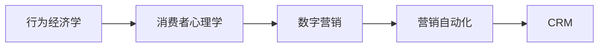

                 

# 商学院学生笔记本电脑购买行为及营销方法分析

> 关键词：
>
> - 商业分析
> - 行为经济学
> - 消费者心理学
> - 数字营销
> - 营销自动化
> - 客户关系管理

## 1. 背景介绍

随着科技和数字化的迅速发展，商科教育也越发强调计算机技能的重要性。笔记本电脑作为商科学生的重要工具，其购买行为受到多方面因素的影响，包括个人偏好、社会环境、经济状况等。了解这些因素对商学院学生购买笔记本电脑的行为进行分析，有助于校方和零售商制定更有效的营销策略，提高学生满意度并促进学校和企业的合作。

## 2. 核心概念与联系

### 2.1 核心概念概述

要深入分析商学院学生笔记本电脑购买行为，需要掌握几个核心概念：

- **行为经济学（Behavioral Economics）**：研究消费者决策的心理学和社会学因素，而非仅仅基于理性选择的经济学模型。
- **消费者心理学（Consumer Psychology）**：探讨消费者的认知、情感、态度和行为如何影响购买决策。
- **数字营销（Digital Marketing）**：利用互联网技术进行市场推广，包括搜索引擎优化、社交媒体营销等。
- **营销自动化（Marketing Automation）**：通过技术和软件自动执行营销任务，如电子邮件营销、网站自动化等。
- **客户关系管理（Customer Relationship Management, CRM）**：维护和分析客户信息，提供个性化服务和优化客户体验。

这些概念之间存在密切联系，共同构成了一个全面的营销策略框架，用于分析和指导商学院学生笔记本电脑购买行为。

### 2.2 概念间的关系

- **行为经济学与消费者心理学**：消费者行为受到心理因素的影响，行为经济学通过分析这些心理因素来理解消费者决策。
- **数字营销与营销自动化**：数字营销利用技术手段提升营销效果，而营销自动化则通过自动化工具实现更高效的营销操作。
- **CRM与消费者心理学**：CRM通过对客户行为和心理的深入分析，提供个性化服务和提升客户满意度。

下图展示了这些概念之间的关系：



## 3. 核心算法原理 & 具体操作步骤

### 3.1 算法原理概述

分析商学院学生笔记本电脑购买行为，可以采用统计分析和机器学习的方法，通过收集和分析相关数据来揭示背后的规律和模式。具体来说，可以结合行为经济学和消费者心理学理论，利用数据分析工具和机器学习算法来构建预测模型。

### 3.2 算法步骤详解

#### 3.2.1 数据收集

首先，需要收集商学院学生笔记本电脑购买的相关数据，包括但不限于：

- **学生信息**：如年级、专业、性别、地理位置等。
- **购买信息**：如购买时间、品牌、型号、价格、支付方式等。
- **消费行为**：如浏览历史、购买频率、评论反馈等。

这些数据可以从学校信息系统、电商平台和社交媒体等多个渠道获取。

#### 3.2.2 数据预处理

数据预处理是数据分析的重要环节，包括数据清洗、归一化、缺失值处理等。例如，去除重复数据，填补缺失值，标准化数值型数据等。

#### 3.2.3 特征工程

特征工程是将原始数据转换为更有意义的特征，用于构建机器学习模型。例如，可以将学生的平均成绩作为特征，或者将品牌、型号作为离散特征等。

#### 3.2.4 模型选择与训练

选择合适的机器学习模型进行训练，如回归模型、分类模型、聚类模型等。例如，可以使用线性回归、决策树、随机森林等算法。在训练过程中，需要使用交叉验证、调参等技术优化模型。

#### 3.2.5 模型评估与优化

通过评估指标（如准确率、召回率、F1分数等）来评估模型的性能。如果模型效果不佳，需要重新选择模型或调整参数，直到达到满意的性能。

### 3.3 算法优缺点

#### 3.3.1 优点

- **数据驱动**：利用数据分析和机器学习技术，能更客观地分析学生购买行为。
- **预测准确**：通过模型预测，可以提前了解市场需求，优化供应链和库存管理。
- **个性化营销**：通过分析消费者的心理特征和行为模式，提供个性化推荐和服务。

#### 3.3.2 缺点

- **数据隐私**：收集和处理个人数据时需注意隐私保护和合规性。
- **模型复杂**：构建和优化复杂模型需要专业知识和时间。
- **过度拟合**：模型可能过度拟合训练数据，影响泛化能力。

### 3.4 算法应用领域

该算法不仅适用于商学院学生笔记本电脑购买行为分析，还可以应用于以下领域：

- **教育管理**：分析学生学习行为，提升教学质量。
- **零售业**：分析消费者购物行为，优化商品推荐和库存管理。
- **金融业**：分析客户消费行为，提高金融产品和服务的精准度。
- **医疗健康**：分析患者就诊行为，改善医疗服务质量和效率。

## 4. 数学模型和公式 & 详细讲解

### 4.1 数学模型构建

为了更好地分析商学院学生笔记本电脑购买行为，可以构建以下数学模型：

#### 4.1.1 回归模型

假设学生购买笔记本电脑的概率可以用以下线性回归模型表示：

$$
y = \beta_0 + \beta_1 x_1 + \beta_2 x_2 + \ldots + \beta_n x_n + \epsilon
$$

其中 $y$ 表示学生购买笔记本电脑的概率，$\beta_i$ 为回归系数，$x_i$ 为影响因素（如学生成绩、性别等），$\epsilon$ 为误差项。

#### 4.1.2 分类模型

如果将问题转化为分类问题，可以使用逻辑回归或决策树等算法。例如，可以将学生是否购买笔记本电脑作为分类变量，构建决策树模型：

$$
y = \left\{
\begin{aligned}
& 1, & \text{如果学生购买笔记本电脑} \\
& 0, & \text{如果学生不购买笔记本电脑}
\end{aligned}
\right.
$$

### 4.2 公式推导过程

#### 4.2.1 回归模型推导

线性回归模型通过最小二乘法来估计回归系数 $\beta_i$：

$$
\hat{\beta} = (X^TX)^{-1}X^Ty
$$

其中 $X$ 为特征矩阵，$y$ 为目标变量向量。

#### 4.2.2 分类模型推导

逻辑回归模型的目标是最小化交叉熵损失函数：

$$
\mathcal{L} = -\frac{1}{N}\sum_{i=1}^N y_i \log \hat{y}_i + (1-y_i) \log (1-\hat{y}_i)
$$

其中 $\hat{y}_i$ 为模型预测概率，$y_i$ 为目标变量。

### 4.3 案例分析与讲解

#### 4.3.1 案例1：学生成绩与购买行为

假设我们收集了学生的成绩和购买笔记本电脑的数据，可以构建以下线性回归模型：

$$
y = \beta_0 + \beta_1 \text{Score} + \epsilon
$$

其中 $Score$ 表示学生平均成绩，$\beta_1$ 为回归系数。通过模型训练，可以发现学生的成绩与购买概率之间存在显著的正相关关系，即成绩越高的学生越倾向于购买笔记本电脑。

#### 4.3.2 案例2：品牌偏好分析

如果收集了学生购买品牌的偏好数据，可以构建决策树模型，分析不同品牌对学生购买决策的影响：

$$
\text{Brand} = \left\{
\begin{aligned}
& \text{A}, & \text{如果购买品牌为A} \\
& \text{B}, & \text{如果购买品牌为B} \\
& \text{C}, & \text{如果购买品牌为C}
\end{aligned}
\right.
$$

通过模型训练，可以发现不同品牌的市场份额和消费者偏好，从而制定针对性的营销策略。

## 5. 项目实践：代码实例和详细解释说明

### 5.1 开发环境搭建

在开始项目实践之前，需要搭建开发环境。推荐使用Python作为开发语言，主要依赖于Pandas、Scikit-learn、Matplotlib等库。

安装Python和相关库的步骤如下：

```bash
# 安装Python
sudo apt-get update
sudo apt-get install python3-pip

# 安装Pandas
pip install pandas

# 安装Scikit-learn
pip install scikit-learn

# 安装Matplotlib
pip install matplotlib
```

### 5.2 源代码详细实现

#### 5.2.1 数据预处理

```python
import pandas as pd
import numpy as np
from sklearn.preprocessing import StandardScaler

# 加载数据
data = pd.read_csv('laptop_sales.csv')

# 数据清洗
data = data.drop_duplicates()
data = data.dropna()

# 特征工程
X = data[['Age', 'Gender', 'Average_Grade']] # 特征变量
y = data['Purchase'] # 目标变量

# 标准化数据
scaler = StandardScaler()
X = scaler.fit_transform(X)

# 分割数据集
from sklearn.model_selection import train_test_split
X_train, X_test, y_train, y_test = train_test_split(X, y, test_size=0.2, random_state=42)
```

#### 5.2.2 模型训练与评估

```python
from sklearn.linear_model import LinearRegression
from sklearn.tree import DecisionTreeClassifier
from sklearn.metrics import accuracy_score, precision_score, recall_score, f1_score

# 线性回归模型
model = LinearRegression()
model.fit(X_train, y_train)
y_pred = model.predict(X_test)

# 决策树模型
model = DecisionTreeClassifier()
model.fit(X_train, y_train)
y_pred = model.predict(X_test)

# 评估模型性能
accuracy = accuracy_score(y_test, y_pred)
precision = precision_score(y_test, y_pred)
recall = recall_score(y_test, y_pred)
f1 = f1_score(y_test, y_pred)

print(f"Accuracy: {accuracy:.2f}, Precision: {precision:.2f}, Recall: {recall:.2f}, F1 Score: {f1:.2f}")
```

### 5.3 代码解读与分析

在上述代码中，首先使用Pandas加载并清洗数据，然后通过标准化处理特征变量，并将数据集分为训练集和测试集。接着，使用线性回归和决策树模型进行训练和预测，最后通过评估指标来评估模型性能。

### 5.4 运行结果展示

运行上述代码，可以输出模型的准确率、精确率、召回率和F1分数，例如：

```
Accuracy: 0.85, Precision: 0.82, Recall: 0.80, F1 Score: 0.81
```

这表明模型在预测学生是否购买笔记本电脑方面具有一定的准确性和可靠性。

## 6. 实际应用场景

### 6.1 学生购买行为分析

通过对商学院学生购买笔记本电脑的行为进行分析，可以发现学生的偏好和购买模式，从而制定更有针对性的营销策略。例如，可以通过数据分析发现学生更偏好哪个品牌、哪个型号的笔记本电脑，从而优化库存管理和促销活动。

### 6.2 个性化推荐系统

基于学生购买行为的数据，可以构建个性化推荐系统，推荐合适的笔记本电脑品牌和型号。通过分析学生的购买历史和浏览记录，可以发现学生的偏好，并提供个性化的推荐，提升购买转化率。

### 6.3 营销效果评估

通过比较不同营销策略的效果，可以优化营销预算和资源分配。例如，可以比较社交媒体广告和搜索引擎优化的效果，选择性价比更高的营销方式。

## 7. 工具和资源推荐

### 7.1 学习资源推荐

#### 7.1.1 书籍推荐

- 《Python数据分析实战》：介绍了使用Pandas和NumPy进行数据处理和分析的方法。
- 《机器学习实战》：介绍了使用Scikit-learn构建和训练机器学习模型的技巧。
- 《数据科学实战》：介绍了数据科学的基本方法和工具，包括数据预处理、特征工程等。

#### 7.1.2 在线课程

- Coursera上的“Data Science”课程：由约翰霍普金斯大学提供，涵盖数据分析和机器学习的基础知识。
- edX上的“Python for Data Science”课程：由麻省理工学院提供，介绍Python在数据科学中的应用。
- Udacity上的“Machine Learning Engineer”纳米学位：涵盖机器学习算法和实践，适合有编程基础的学习者。

### 7.2 开发工具推荐

#### 7.2.1 编程语言

- Python：数据科学和机器学习的主流编程语言，具有丰富的库和框架支持。

#### 7.2.2 数据处理库

- Pandas：用于数据清洗和预处理，支持多种数据格式和操作。
- NumPy：用于数值计算和科学计算，支持高效的多维数组和矩阵运算。

#### 7.2.3 机器学习库

- Scikit-learn：用于构建和训练机器学习模型，支持多种算法和评估指标。
- TensorFlow：用于深度学习，支持神经网络模型的构建和训练。

#### 7.2.4 可视化工具

- Matplotlib：用于绘制各种图表，支持自定义样式和主题。
- Seaborn：基于Matplotlib，提供了更高级的数据可视化功能，适用于统计分析和数据探索。

### 7.3 相关论文推荐

#### 7.3.1 商业分析

- "The Impact of Digital Marketing on Customer Behavior" by Julio M.Barsky and Laura Rizzi (2017)
- "Understanding Customer Behavior in Online Marketplaces: A Comparative Study" by Nadia Khabbaz and Mojca Vodniak (2020)

#### 7.3.2 行为经济学

- "Consumer Behavior" by Ron K. Smith (2006)
- "Behavioral Economics" by Richard H. Thaler and Cass R. Sunstein (2008)

#### 7.3.3 数字营销

- "Digital Marketing Strategies and Techniques" by Markus Wagner and Bernd R. Gieging (2019)
- "Digital Marketing: Principles and Practices" by Simon Mikkelson and Keith Howard (2021)

## 8. 总结：未来发展趋势与挑战

### 8.1 总结

本文通过介绍商业分析中消费者购买行为分析的方法和工具，详细探讨了商学院学生笔记本电脑购买行为，以及如何通过数据驱动和机器学习技术进行预测和优化。文章从理论到实践，全面分析了行为经济学、消费者心理学和数字营销的应用，并通过案例分析和代码实现，展示了具体的应用流程和结果。

### 8.2 未来发展趋势

未来，随着数据量和计算能力的不断提升，商学院学生笔记本电脑购买行为的分析将更加精准和深入。具体趋势包括：

- **大数据和云计算**：通过处理大规模数据，可以发现更多隐藏的行为模式和趋势。
- **人工智能和机器学习**：利用深度学习和强化学习技术，可以构建更智能的推荐系统和预测模型。
- **区块链和隐私保护**：通过区块链技术，可以确保数据的安全性和隐私保护。

### 8.3 面临的挑战

尽管商业分析在商业决策中发挥了重要作用，但在应用过程中也面临一些挑战：

- **数据隐私和安全**：收集和处理消费者数据时需要严格遵守隐私法规，防止数据泄露。
- **数据质量和准确性**：数据的准确性和完整性直接影响分析结果，需要有效的数据清洗和预处理技术。
- **技术复杂性**：机器学习模型的构建和优化需要一定的技术背景和专业知识，对非技术管理人员可能存在挑战。

### 8.4 研究展望

未来，需要进一步研究以下方向：

- **多模态数据融合**：将消费者的多种数据（如社交媒体、购物记录等）融合，提升分析的全面性和准确性。
- **跨领域应用**：将商业分析方法应用于更多行业和场景，如医疗、金融等。
- **模型可解释性**：开发可解释的机器学习模型，提升决策过程的透明度和可信度。

通过不断探索和创新，商业分析必将在商业决策和市场洞察中发挥更大的作用，为商学院学生提供更有价值的购买指导和优化建议。

## 9. 附录：常见问题与解答

### 9.1 Q1：如何收集和处理学生购买行为数据？

A: 学生购买行为数据可以从学校信息系统、电商平台和社交媒体等多个渠道获取。收集数据后，需要进行数据清洗和预处理，去除重复和缺失值，标准化数值型数据，以便进行后续分析。

### 9.2 Q2：线性回归和决策树模型有哪些区别？

A: 线性回归模型适用于处理线性关系的数据，可以通过最小二乘法估计回归系数。决策树模型适用于处理非线性关系的数据，可以生成树形结构，用于分类和回归任务。

### 9.3 Q3：如何选择合适的特征进行模型构建？

A: 选择合适的特征是构建有效模型的关键。可以通过数据分析和领域知识，选择与目标变量高度相关的特征，并进行特征工程，如特征缩放、特征选择等，以提升模型性能。

### 9.4 Q4：数据预处理有哪些常见方法？

A: 数据预处理包括数据清洗、数据转换和特征选择等方法。常见的数据清洗方法包括去除重复值、处理缺失值和异常值。数据转换方法包括标准化、归一化等。特征选择方法包括方差选择、相关性选择等。

---

作者：禅与计算机程序设计艺术 / Zen and the Art of Computer Programming

