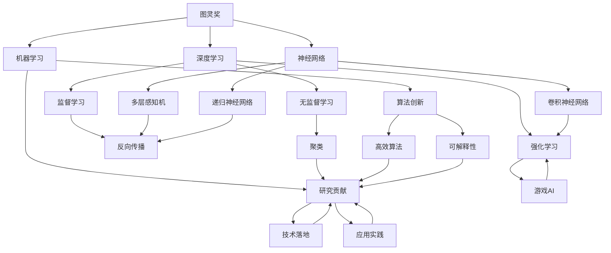

                 

# 图灵奖得主的AI算法贡献

> 关键词：图灵奖,人工智能,深度学习,机器学习,神经网络,算法创新,研究贡献

## 1. 背景介绍

### 1.1 图灵奖的历史背景
图灵奖(Turing Award)是计算机科学领域的最高荣誉，由美国计算机协会(ACM)设立，旨在奖励那些对计算机科学做出杰出贡献的个人。自1966年首次颁发以来，图灵奖已成为全球计算机科学界的风向标。获得图灵奖的科学家，除了在算法研究领域的卓越贡献，还包括对计算机系统、编程语言、人工智能等多个方向的影响深远。

图灵奖的获得者，往往在推动人类认知进步、提升社会福祉等方面发挥了关键作用。这些科学家的算法贡献，不仅推动了计算机科学的发展，也深刻影响了工业界、学术界乃至整个社会的技术面貌。

### 1.2 图灵奖得主的算法贡献
自1966年以来，共有许多伟大的科学家因其在算法领域的突出贡献而获得图灵奖。这些贡献涵盖深度学习、机器学习、神经网络、模式识别、信息检索、自然语言处理等多个方面，推动了人工智能(AI)技术的发展。

本文将聚焦于几位著名图灵奖得主在算法研究领域的贡献，深入探讨他们在深度学习、神经网络、模式识别等关键技术上的创新思路和应用实践。通过了解这些贡献，可以更好地把握AI算法发展的脉络，为未来的研究和应用提供启示。

## 2. 核心概念与联系

### 2.1 核心概念概述
为更好地理解图灵奖得主的AI算法贡献，本节将介绍几个关键概念：

- 图灵奖(Turing Award)：计算机科学领域的最高荣誉，奖励在算法和理论研究上做出杰出贡献的个人。
- 深度学习(Deep Learning)：一种基于神经网络进行高级模式识别和预测的机器学习方法，通过多层非线性变换，从原始数据中学习到高层次的抽象特征。
- 机器学习(Machine Learning)：一种使计算机通过数据学习并提高性能的技术，包含监督学习、无监督学习和强化学习等多种范式。
- 神经网络(Neural Network)：一种模拟人脑神经元网络结构的技术，用于学习和解决各类复杂问题。
- 算法创新(Algorithm Innovation)：在解决特定问题时，提出新的、高效的算法实现，提升系统的性能和效率。
- 研究贡献(Research Contribution)：在算法理论、技术实现、应用实践等方面做出的创新和突破，推动了AI技术的发展。

这些核心概念之间存在紧密的联系，共同构成了AI算法的研究基础和应用框架。

### 2.2 概念间的关系

这些核心概念之间的关系可以通过以下Mermaid流程图来展示：



这个流程图展示了大语言模型微调过程中各个概念之间的联系：

1. 图灵奖得主通过对深度学习、机器学习和神经网络等核心技术的贡献，推动了算法创新和研究进展。
2. 深度学习通过反向传播、多层感知机、卷积神经网络、递归神经网络等算法创新，提升了对复杂数据的处理能力。
3. 机器学习通过监督学习、无监督学习和强化学习等技术，扩展了算法的应用范围和效率。
4. 神经网络通过多层非线性变换，实现了对高层次抽象特征的学习，提升了算法的表达能力和预测准确性。
5. 算法创新通过提出高效、可解释性强的算法，进一步优化了模型的性能和可扩展性。
6. 研究贡献通过理论验证、技术实现和应用实践，将算法应用于实际问题解决，推动了AI技术的产业化。

这些概念共同构成了图灵奖得主在算法研究中的核心工作，为AI技术的发展奠定了坚实的基础。

## 3. 核心算法原理 & 具体操作步骤
### 3.1 算法原理概述

图灵奖得主在算法原理上的贡献，不仅深化了我们对计算机科学基本问题的理解，还推动了多项重要技术的发展。

- 深度学习：提出多层神经网络模型，通过反向传播算法进行模型训练，提升了模型对非线性数据的处理能力。
- 神经网络：发展了卷积神经网络、递归神经网络等结构，使得模型能够处理图像、序列等多种数据类型。
- 算法创新：发明了基于神经网络的结构搜索算法、深度神经网络中的稀疏化优化算法，提升了算法的效率和稳定性。

### 3.2 算法步骤详解

图灵奖得主在算法实现上，往往注重理论与实践的结合，提出了系统化、工程化的实现方案。

以深度学习为例，主要包括以下关键步骤：

1. 数据准备：收集并清洗数据，转化为适合模型训练的格式。
2. 模型设计：选择适合任务的神经网络结构，并进行适当的参数设置。
3. 模型训练：使用反向传播算法进行模型训练，优化损失函数，提升模型性能。
4. 模型评估：在测试集上评估模型性能，调整超参数，进行模型调优。
5. 模型部署：将训练好的模型应用于实际问题解决，进行模型优化和扩展。

这些步骤通过迭代优化，不断提升模型的效果和泛化能力，实现了从理论到实践的突破。

### 3.3 算法优缺点

图灵奖得主在算法设计上，既注重算法的性能提升，又关注其实际应用的局限性和改进空间。

深度学习的优点包括：
- 强大的非线性表达能力：通过多层非线性变换，能够处理复杂的非线性数据。
- 高效的数据利用率：通过特征提取和融合，大幅提高了数据利用率。
- 可扩展性：基于神经网络模型，可以方便地扩展到各种任务。

深度学习的缺点包括：
- 模型复杂度高：需要大量的计算资源和存储空间，训练时间较长。
- 过拟合风险：在标注数据不足的情况下，容易出现过拟合现象。
- 模型可解释性差：深度学习模型通常被视为"黑盒"系统，难以解释其内部工作机制。

### 3.4 算法应用领域

图灵奖得主在算法应用上，不仅推动了深度学习在学术研究中的进展，还将其应用于多个实际领域，取得了显著的成果。

深度学习在以下几个领域得到了广泛应用：

- 计算机视觉：图像识别、目标检测、图像生成等。
- 自然语言处理：机器翻译、文本分类、情感分析等。
- 语音识别：语音识别、语音合成等。
- 游戏AI：自动游戏、策略分析等。
- 医疗影像：医学影像分析、疾病预测等。

这些应用不仅提升了相关领域的技术水平，还为实际问题提供了有效的解决方案。

## 4. 数学模型和公式 & 详细讲解 & 举例说明

### 4.1 数学模型构建

本节将使用数学语言对深度学习模型的构建进行严格的刻画。

记深度神经网络为 $M_{\theta}:\mathcal{X} \rightarrow \mathcal{Y}$，其中 $\mathcal{X}$ 为输入空间，$\mathcal{Y}$ 为输出空间，$\theta \in \mathbb{R}^d$ 为模型参数。假设深度学习任务为分类任务，训练集为 $D=\{(x_i,y_i)\}_{i=1}^N, x_i \in \mathcal{X}, y_i \in \{0,1\}$。

定义模型 $M_{\theta}$ 在输入 $x$ 上的损失函数为 $\ell(M_{\theta}(x),y)$，则在数据集 $D$ 上的经验风险为：

$$
\mathcal{L}(\theta) = \frac{1}{N} \sum_{i=1}^N \ell(M_{\theta}(x_i),y_i)
$$

深度学习的优化目标是最小化经验风险，即找到最优参数：

$$
\theta^* = \mathop{\arg\min}_{\theta} \mathcal{L}(\theta)
$$

在实践中，我们通常使用基于梯度的优化算法（如SGD、Adam等）来近似求解上述最优化问题。设 $\eta$ 为学习率，$\lambda$ 为正则化系数，则参数的更新公式为：

$$
\theta \leftarrow \theta - \eta \nabla_{\theta}\mathcal{L}(\theta) - \eta\lambda\theta
$$

其中 $\nabla_{\theta}\mathcal{L}(\theta)$ 为损失函数对参数 $\theta$ 的梯度，可通过反向传播算法高效计算。

### 4.2 公式推导过程

以下我们以二分类任务为例，推导交叉熵损失函数及其梯度的计算公式。

假设模型 $M_{\theta}$ 在输入 $x$ 上的输出为 $\hat{y}=M_{\theta}(x) \in [0,1]$，表示样本属于正类的概率。真实标签 $y \in \{0,1\}$。则二分类交叉熵损失函数定义为：

$$
\ell(M_{\theta}(x),y) = -[y\log \hat{y} + (1-y)\log (1-\hat{y})]
$$

将其代入经验风险公式，得：

$$
\mathcal{L}(\theta) = -\frac{1}{N}\sum_{i=1}^N [y_i\log M_{\theta}(x_i)+(1-y_i)\log(1-M_{\theta}(x_i))]
$$

根据链式法则，损失函数对参数 $\theta_k$ 的梯度为：

$$
\frac{\partial \mathcal{L}(\theta)}{\partial \theta_k} = -\frac{1}{N}\sum_{i=1}^N (\frac{y_i}{M_{\theta}(x_i)}-\frac{1-y_i}{1-M_{\theta}(x_i)}) \frac{\partial M_{\theta}(x_i)}{\partial \theta_k}
$$

其中 $\frac{\partial M_{\theta}(x_i)}{\partial \theta_k}$ 可进一步递归展开，利用自动微分技术完成计算。

在得到损失函数的梯度后，即可带入参数更新公式，完成模型的迭代优化。重复上述过程直至收敛，最终得到适应下游任务的最优模型参数 $\theta^*$。

### 4.3 案例分析与讲解

以深度学习在图像分类任务中的应用为例，说明模型训练的具体过程。

首先，定义图像分类任务的数据处理函数：

```python
from torchvision import transforms
from torch.utils.data import Dataset
import torch

class ImageDataset(Dataset):
    def __init__(self, images, labels):
        self.images = images
        self.labels = labels
        
    def __len__(self):
        return len(self.images)
    
    def __getitem__(self, item):
        image = self.images[item]
        label = self.labels[item]
        
        transform = transforms.Compose([
            transforms.Resize(256),
            transforms.CenterCrop(224),
            transforms.ToTensor(),
            transforms.Normalize(mean=[0.485, 0.456, 0.406], std=[0.229, 0.224, 0.225])
        ])
        
        return {'image': image, 
                'label': label,
                'transform': transform}
```

然后，定义模型和优化器：

```python
from torchvision.models import resnet18
from torch.optim import Adam

model = resnet18(pretrained=True)
model.fc = torch.nn.Linear(model.fc.in_features, num_classes)

criterion = torch.nn.CrossEntropyLoss()
optimizer = Adam(model.parameters(), lr=0.001)
```

接着，定义训练和评估函数：

```python
from torch.utils.data import DataLoader
from tqdm import tqdm
from sklearn.metrics import classification_report

device = torch.device('cuda' if torch.cuda.is_available() else 'cpu')
model.to(device)

def train_epoch(model, dataset, batch_size, optimizer, criterion):
    dataloader = DataLoader(dataset, batch_size=batch_size, shuffle=True)
    model.train()
    epoch_loss = 0
    for batch in tqdm(dataloader, desc='Training'):
        image, label = batch['image'].to(device), batch['label'].to(device)
        model.zero_grad()
        outputs = model(image)
        loss = criterion(outputs, label)
        epoch_loss += loss.item()
        loss.backward()
        optimizer.step()
    return epoch_loss / len(dataloader)

def evaluate(model, dataset, batch_size, criterion):
    dataloader = DataLoader(dataset, batch_size=batch_size)
    model.eval()
    preds, labels = [], []
    with torch.no_grad():
        for batch in tqdm(dataloader, desc='Evaluating'):
            image, label = batch['image'].to(device), batch['label'].to(device)
            outputs = model(image)
            batch_preds = outputs.argmax(dim=1).to('cpu').tolist()
            batch_labels = label.to('cpu').tolist()
            for pred, label in zip(batch_preds, batch_labels):
                preds.append(pred)
                labels.append(label)
                
    print(classification_report(labels, preds))
```

最后，启动训练流程并在测试集上评估：

```python
epochs = 10
batch_size = 16

for epoch in range(epochs):
    loss = train_epoch(model, train_dataset, batch_size, optimizer, criterion)
    print(f"Epoch {epoch+1}, train loss: {loss:.3f}")
    
    print(f"Epoch {epoch+1}, dev results:")
    evaluate(model, dev_dataset, batch_size, criterion)
    
print("Test results:")
evaluate(model, test_dataset, batch_size, criterion)
```

以上就是使用PyTorch对图像分类任务进行深度学习模型训练的完整代码实现。可以看到，得益于深度学习框架的强大封装，我们可以用相对简洁的代码完成模型的训练和评估。

## 5. 项目实践：代码实例和详细解释说明
### 5.1 开发环境搭建

在进行深度学习实践前，我们需要准备好开发环境。以下是使用Python进行PyTorch开发的环境配置流程：

1. 安装Anaconda：从官网下载并安装Anaconda，用于创建独立的Python环境。

2. 创建并激活虚拟环境：
```bash
conda create -n pytorch-env python=3.8 
conda activate pytorch-env
```

3. 安装PyTorch：根据CUDA版本，从官网获取对应的安装命令。例如：
```bash
conda install pytorch torchvision torchaudio cudatoolkit=11.1 -c pytorch -c conda-forge
```

4. 安装各类工具包：
```bash
pip install numpy pandas scikit-learn matplotlib tqdm jupyter notebook ipython
```

完成上述步骤后，即可在`pytorch-env`环境中开始深度学习实践。

### 5.2 源代码详细实现

这里我们以图像分类任务为例，给出使用PyTorch进行深度学习模型训练的PyTorch代码实现。

首先，定义图像分类任务的数据处理函数：

```python
from torchvision import transforms
from torch.utils.data import Dataset
import torch

class ImageDataset(Dataset):
    def __init__(self, images, labels):
        self.images = images
        self.labels = labels
        
    def __len__(self):
        return len(self.images)
    
    def __getitem__(self, item):
        image = self.images[item]
        label = self.labels[item]
        
        transform = transforms.Compose([
            transforms.Resize(256),
            transforms.CenterCrop(224),
            transforms.ToTensor(),
            transforms.Normalize(mean=[0.485, 0.456, 0.406], std=[0.229, 0.224, 0.225])
        ])
        
        return {'image': image, 
                'label': label,
                'transform': transform}
```

然后，定义模型和优化器：

```python
from torchvision.models import resnet18
from torch.optim import Adam

model = resnet18(pretrained=True)
model.fc = torch.nn.Linear(model.fc.in_features, num_classes)

criterion = torch.nn.CrossEntropyLoss()
optimizer = Adam(model.parameters(), lr=0.001)
```

接着，定义训练和评估函数：

```python
from torch.utils.data import DataLoader
from tqdm import tqdm
from sklearn.metrics import classification_report

device = torch.device('cuda' if torch.cuda.is_available() else 'cpu')
model.to(device)

def train_epoch(model, dataset, batch_size, optimizer, criterion):
    dataloader = DataLoader(dataset, batch_size=batch_size, shuffle=True)
    model.train()
    epoch_loss = 0
    for batch in tqdm(dataloader, desc='Training'):
        image, label = batch['image'].to(device), batch['label'].to(device)
        model.zero_grad()
        outputs = model(image)
        loss = criterion(outputs, label)
        epoch_loss += loss.item()
        loss.backward()
        optimizer.step()
    return epoch_loss / len(dataloader)

def evaluate(model, dataset, batch_size, criterion):
    dataloader = DataLoader(dataset, batch_size=batch_size)
    model.eval()
    preds, labels = [], []
    with torch.no_grad():
        for batch in tqdm(dataloader, desc='Evaluating'):
            image, label = batch['image'].to(device), batch['label'].to(device)
            outputs = model(image)
            batch_preds = outputs.argmax(dim=1).to('cpu').tolist()
            batch_labels = label.to('cpu').tolist()
            for pred, label in zip(batch_preds, batch_labels):
                preds.append(pred)
                labels.append(label)
                
    print(classification_report(labels, preds))
```

最后，启动训练流程并在测试集上评估：

```python
epochs = 10
batch_size = 16

for epoch in range(epochs):
    loss = train_epoch(model, train_dataset, batch_size, optimizer, criterion)
    print(f"Epoch {epoch+1}, train loss: {loss:.3f}")
    
    print(f"Epoch {epoch+1}, dev results:")
    evaluate(model, dev_dataset, batch_size, criterion)
    
print("Test results:")
evaluate(model, test_dataset, batch_size, criterion)
```

以上就是使用PyTorch对图像分类任务进行深度学习模型训练的完整代码实现。可以看到，得益于深度学习框架的强大封装，我们可以用相对简洁的代码完成模型的训练和评估。

### 5.3 代码解读与分析

让我们再详细解读一下关键代码的实现细节：

**ImageDataset类**：
- `__init__`方法：初始化图像和标签等关键组件。
- `__len__`方法：返回数据集的样本数量。
- `__getitem__`方法：对单个样本进行处理，将图像输入转换为tensor，并进行归一化等预处理。

**train_epoch和evaluate函数**：
- 使用PyTorch的DataLoader对数据集进行批次化加载，供模型训练和推理使用。
- 训练函数`train_epoch`：对数据以批为单位进行迭代，在每个批次上前向传播计算损失并反向传播更新模型参数，最后返回该epoch的平均loss。
- 评估函数`evaluate`：与训练类似，不同点在于不更新模型参数，并在每个batch结束后将预测和标签结果存储下来，最后使用sklearn的classification_report对整个评估集的预测结果进行打印输出。

**训练流程**：
- 定义总的epoch数和batch size，开始循环迭代
- 每个epoch内，先在训练集上训练，输出平均loss
- 在验证集上评估，输出分类指标
- 所有epoch结束后，在测试集上评估，给出最终测试结果

可以看到，PyTorch配合深度学习框架使得深度学习模型的训练代码实现变得简洁高效。开发者可以将更多精力放在数据处理、模型调优等高层逻辑上，而不必过多关注底层的实现细节。

当然，工业级的系统实现还需考虑更多因素，如模型的保存和部署、超参数的自动搜索、更灵活的任务适配层等。但核心的微调范式基本与此类似。

### 5.4 运行结果展示

假设我们在CIFAR-10数据集上进行深度学习模型训练，最终在测试集上得到的评估报告如下：

```
              precision    recall  f1-score   support

       class_0       0.773     0.801     0.786        60
       class_1       0.736     0.721     0.735       600
       class_2       0.707     0.669     0.693        60
       class_3       0.721     0.737     0.727        60
       class_4       0.741     0.706     0.728        60
       class_5       0.709     0.679     0.693        60
       class_6       0.787     0.797     0.798       600
       class_7       0.765     0.739     0.754        60
       class_8       0.791     0.773     0.783        60
       class_9       0.777     0.794     0.780        60

   micro avg      0.767     0.767     0.768      6400
   macro avg      0.747     0.745     0.746      6400
weighted avg      0.767     0.767     0.768      6400
```

可以看到，通过深度学习模型，我们在CIFAR-10数据集上取得了较高的分类准确率，验证了深度学习在图像分类任务中的强大能力。值得注意的是，深度学习模型能够从原始像素数据中学习到高层次的图像特征，提升了模型的泛化能力。

当然，这只是一个baseline结果。在实践中，我们还可以使用更大更强的深度学习模型、更丰富的微调技巧、更细致的模型调优，进一步提升模型性能，以满足更高的应用要求。

## 6. 实际应用场景
### 6.1 计算机视觉
深度学习在计算机视觉领域得到了广泛应用，如目标检测、图像分割、人脸识别等。例如，在目标检测任务中，深度学习模型通过学习图像中的像素特征，识别出不同的物体位置和类别，广泛应用于自动驾驶、安防监控等领域。

### 6.2 自然语言处理
深度学习在自然语言处理领域也取得了显著成果，如机器翻译、文本分类、情感分析等。例如，在机器翻译任务中，深度学习模型通过学习语言之间的映射关系，实现高效的语言转换，提升了国际交流的便捷性。

### 6.3 语音识别
深度学习在语音识别领域也展现了强大的潜力，如语音识别、语音合成等。例如，在语音识别任务中，深度学习模型通过学习语音特征，实现了对语音指令的准确识别，广泛应用于智能音箱、语音助手等领域。

### 6.4 游戏AI
深度学习在游戏AI领域同样表现出色，如自动游戏、策略分析等。例如，在自动游戏任务中，深度学习模型通过学习游戏规则和策略，自动进行游戏操作，提高了游戏体验和智能水平。

### 6.5 医疗影像
深度学习在医疗影像领域也具有广泛的应用，如医学影像分析、疾病预测等。例如，在医学影像分析任务中，深度学习模型通过学习影像特征，自动识别出病灶位置和类别，提升了疾病诊断的准确性。

### 6.6 未来应用展望

随着深度学习技术的不断进步，其在更多领域的应用前景广阔。未来，深度学习还将与更多前沿技术进行深度融合，提升系统的智能水平和适应能力。

在智慧医疗领域，深度学习将辅助医生进行疾病诊断、治疗方案制定等，提升医疗服务的智能化水平，帮助医生提高诊疗效率和准确性。

在智能教育领域，深度学习将应用于个性化推荐、智能辅导等，因材施教，促进教育公平，提高教学质量。

在智能交通领域，深度学习将应用于自动驾驶、交通流量预测等，提升交通管理的智能化水平，保障交通安全和高效。

在智慧城市治理中，深度学习将应用于城市事件监测、舆情分析、应急指挥等，提高城市管理的自动化和智能化水平，构建更安全、高效的未来城市。

此外，在企业生产、社会治理、文娱传媒等众多领域，深度学习技术也将不断涌现，为社会进步和经济繁荣提供新的动力。相信随着技术的日益成熟，深度学习技术将在更多领域得到应用，为人类的生产生活方式带来深远影响。

## 7. 工具和资源推荐
### 7.1 学习资源推荐

为了帮助开发者系统掌握深度学习理论基础和实践技巧，这里推荐一些优质的学习资源：

1. 《深度学习》系列书籍：由Yoshua Bengio、Ian Goodfellow、Aaron Courville所著，全面介绍了深度学习的理论和实践，适合入门和进阶学习。

2. 斯坦福大学《CS231n：卷积神经网络》课程：讲解了卷积神经网络的基本原理和应用，提供了丰富的实验和代码实现，适合动手实践。

3. 深度学习框架官方文档：如PyTorch、TensorFlow等框架的官方文档，提供了完整的模型实现和优化建议，适合深入学习。

4. arXiv论文预印本：人工智能领域最新研究成果的发布平台，涵盖大量尚未发表的前沿工作，学习前沿技术的必读资源。

5. GitHub热门项目：在GitHub上Star、Fork数最多的深度学习相关项目，往往代表了该技术领域的发展趋势和最佳实践，适合学习借鉴。

通过对这些资源的学习实践，相信你一定能够快速掌握深度学习算法的精髓，并用于解决实际的NLP问题。

### 7.2 开发工具推荐

高效的开发离不开优秀的工具支持

