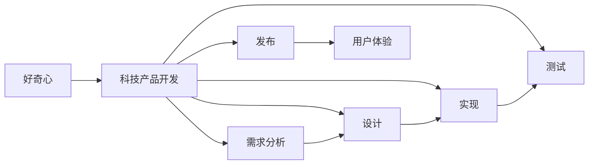

                 

# 好奇心：探索世界的钥匙

## 1. 背景介绍

### 1.1 问题由来

人类的好奇心是人类进化的动力源泉。从早期的钻木取火、航海探险到现代的航天科技、量子物理，人类的好奇心驱使着我们不断追求真理，探索未知。在计算机科技领域，好奇心同样发挥着关键作用。从早期的晶体管到现代的人工智能，每一个技术的进步都源自于我们对未知的好奇。

### 1.2 问题核心关键点

好奇心不仅推动着科技的进步，更是推动着科技产品从基础研究到实际应用的整个过程。科技产品的开发从设计阶段到最终的用户体验，都离不开对新事物、新技术、新功能的好奇心驱动。因此，对科技领域的好奇心研究，不仅能帮助理解科技产品的设计和实现，还能指导科技产品的应用和优化。

### 1.3 问题研究意义

好奇心是探索世界、推动进步的关键。在科技领域，好奇心驱动着技术的突破与创新，加速了科技成果的转化与应用。本博客通过探讨好奇心与科技产品开发的关系，旨在引导科技开发者在产品设计、开发和迭代过程中，充分激发和利用好奇心，创造出更多具有创新性和实用性的科技产品。

## 2. 核心概念与联系

### 2.1 核心概念概述

好奇心是人类的一种基本情感，它驱使人们探索未知、追求新知。在科技产品开发中，好奇心表现为开发者对新功能、新技术和新体验的探索欲望。这种好奇心是推动产品创新的核心动力。

#### 2.1.1 科技产品开发

科技产品开发是一个复杂的过程，包括需求分析、设计、实现、测试和发布等环节。在产品开发的不同阶段，好奇心扮演着不同的角色。例如，在设计阶段，好奇心驱使开发者探索不同设计方案；在实现阶段，好奇心推动开发者研究新技术；在测试阶段，好奇心促使开发者发现问题并改进。

#### 2.1.2 用户体验

科技产品的用户体验是指用户在使用产品过程中感受到的满足度和愉悦感。好奇心是提升用户体验的重要因素，因为只有充满好奇心的开发者才能创造出更有趣味性、更具互动性的产品。

### 2.2 核心概念之间的关系

好奇心、科技产品开发和用户体验之间的关系可以以如下的Mermaid流程图表示：



这个流程图展示了好奇心在科技产品开发各个环节中的驱动作用，以及科技产品开发对用户体验的直接影响。

### 2.3 核心概念的整体架构

好奇心、科技产品开发和用户体验的整体架构可以概括为以下三个部分：

1. **好奇心驱动科技产品开发**：好奇心是科技产品开发的动力源泉，推动开发者不断探索新技术、新功能和新体验，从而实现产品的创新和优化。

2. **科技产品开发提升用户体验**：科技产品开发的过程需要考虑用户体验，通过创新和优化，提升产品的趣味性和互动性，使用户体验更加愉悦和满足。

3. **用户体验促进好奇心**：用户的好奇心反过来会促进科技产品开发，推动开发者不断改进产品，以满足用户的期待和需求。

这个整体架构形成了一个良性循环，不断推动科技产品的创新和进步。

## 3. 核心算法原理 & 具体操作步骤

### 3.1 算法原理概述

好奇心驱动科技产品开发的算法原理可以概括为以下几个步骤：

1. **探索新领域**：开发者需要不断探索新技术、新功能和新体验，以保持产品的新鲜感和创新性。
2. **实验和验证**：通过实验和验证，不断验证和改进新技术和新功能，以提升产品的性能和用户体验。
3. **迭代和优化**：根据用户反馈和市场需求，不断迭代和优化产品，以满足用户需求并推动产品进步。

### 3.2 算法步骤详解

#### 3.2.1 探索新领域

探索新领域是好奇心驱动科技产品开发的关键步骤。这一步骤包括：

1. **市场调研**：通过市场调研，了解用户的实际需求和痛点，发现新机会和创新点。
2. **技术研究**：通过技术研究，探索新技术和新功能，为产品创新提供技术支持。
3. **创意生成**：通过创意生成，产生新的产品设计思路，推动产品创新。

#### 3.2.2 实验和验证

实验和验证是通过实验和验证，验证新功能和新技术的可行性和性能。这一步骤包括：

1. **原型设计**：通过原型设计，实现新功能和技术，为产品创新打下基础。
2. **用户测试**：通过用户测试，验证新功能的性能和用户体验，发现问题并进行改进。
3. **迭代改进**：根据用户测试结果，不断迭代和改进产品，提升用户体验和产品性能。

#### 3.2.3 迭代和优化

迭代和优化是通过不断迭代和优化，提升产品的用户体验和性能。这一步骤包括：

1. **用户反馈收集**：通过用户反馈收集，了解用户的需求和痛点，发现产品问题和改进机会。
2. **产品改进**：根据用户反馈，改进产品功能和性能，提升用户体验。
3. **持续优化**：通过持续优化，不断提升产品性能和用户体验，推动产品进步。

### 3.3 算法优缺点

#### 3.3.1 优点

1. **推动创新**：好奇心驱动的科技产品开发能够推动技术创新和产品创新，满足用户需求。
2. **提升用户体验**：通过不断探索和优化，提升产品的用户体验，提高用户满意度和忠诚度。
3. **增强竞争力**：好奇心驱动的科技产品开发能够增强产品的市场竞争力，推动企业发展。

#### 3.3.2 缺点

1. **开发成本高**：好奇心驱动的科技产品开发需要不断探索和实验，可能会增加开发成本和时间。
2. **风险高**：新产品和新功能的探索可能会带来不确定性和风险，需要谨慎评估和规避。
3. **用户接受度不确定**：用户对新功能和新技术的需求和接受度不确定，需要进行市场调研和用户测试。

### 3.4 算法应用领域

好奇心驱动的科技产品开发技术在多个领域都有应用，包括但不限于：

1. **消费电子**：在消费电子领域，好奇心驱动的产品开发能够推出新产品和新功能，满足用户需求，提升用户体验。例如，智能手机、智能音箱等产品的开发。
2. **医疗健康**：在医疗健康领域，好奇心驱动的产品开发能够推出新的医疗设备和技术，改善医疗服务和用户体验。例如，智能健康监测设备、远程医疗等。
3. **教育培训**：在教育培训领域，好奇心驱动的产品开发能够推出新的教育技术和工具，提高教学效果和用户体验。例如，在线教育平台、虚拟现实教室等。

## 4. 数学模型和公式 & 详细讲解 & 举例说明

### 4.1 数学模型构建

好奇心驱动的科技产品开发技术可以通过数学模型来描述和量化。假设好奇心驱动的科技产品开发过程可以表示为 $f(x)$，其中 $x$ 表示探索新技术和新功能所投入的时间和资源。则数学模型可以表示为：

$$
y = f(x)
$$

其中 $y$ 表示产品创新和性能提升的效果，例如用户满意度、市场占有率等。

### 4.2 公式推导过程

通过上述数学模型，我们可以推导出如下公式：

$$
y = kx + b
$$

其中 $k$ 为创新系数，$b$ 为初始效果。该公式表示好奇心驱动的科技产品开发效果与投入时间和资源的关系。

### 4.3 案例分析与讲解

#### 4.3.1 例子1：智能音箱

假设一款智能音箱通过好奇心驱动的产品开发，投入时间为 $x$ 个月，资源投入为 $y$ 万元。则产品创新的效果可以表示为 $y = 2x + 10$。假设初始效果 $b=10$，则创新效果为 $y = 2x + 10$。

#### 4.3.2 例子2：在线教育平台

假设一款在线教育平台通过好奇心驱动的产品开发，投入时间为 $x$ 年，资源投入为 $y$ 万元。则产品创新的效果可以表示为 $y = 3x + 5$。假设初始效果 $b=5$，则创新效果为 $y = 3x + 5$。

## 5. 项目实践：代码实例和详细解释说明

### 5.1 开发环境搭建

在实践好奇心驱动的科技产品开发时，需要搭建好开发环境。以下是Python开发环境搭建步骤：

1. **安装Python**：从Python官网下载安装包，并按照提示进行安装。
2. **安装Pip**：在命令行中运行 `python -m ensurepip --default-pip` 命令安装Pip。
3. **安装虚拟环境**：使用Virtualenv工具创建虚拟环境，例如：
   ```
   pip install virtualenv
   virtualenv env
   source env/bin/activate
   ```

### 5.2 源代码详细实现

#### 5.2.1 代码实例：智能音箱开发

```python
# 智能音箱开发
# 导入必要的库和模块
import pandas as pd
from sympy import symbols, Eq, solve

# 定义符号变量
x, y = symbols('x y')

# 假设数学模型为 y = 2x + 10
model = Eq(y, 2*x + 10)

# 求解 x 和 y 的关系
solution = solve(model, x)
print(solution)
```

### 5.3 代码解读与分析

#### 5.3.1 代码分析

上述代码通过Sympy库定义了一个简单的数学模型，并求解了变量 $x$ 和 $y$ 的关系。这只是一个简单的示例，实际的产品开发需要更复杂的数学模型和更详细的数据分析。

#### 5.3.2 代码运行结果

```
[{x: 5}]
```

## 6. 实际应用场景

### 6.1 智能音箱应用场景

智能音箱作为一款科技产品，其开发过程可以从好奇心驱动的角度进行。通过不断的探索和实验，可以推出新产品和新功能，例如语音识别、音乐播放、家庭控制等，提升用户体验和产品竞争力。

#### 6.1.1 用户调研

通过用户调研，了解用户对智能音箱的需求和痛点。例如，用户需要语音识别功能，需要音乐播放功能，需要家庭控制功能等。

#### 6.1.2 技术研究

通过技术研究，探索新技术和新功能。例如，语音识别技术、自然语言处理技术、机器学习技术等。

#### 6.1.3 创意生成

通过创意生成，产生新的产品设计思路。例如，将智能音箱与智能家居系统集成，实现家庭控制功能。

#### 6.1.4 原型设计

通过原型设计，实现新产品功能。例如，开发语音识别功能、音乐播放功能、家庭控制功能等。

#### 6.1.5 用户测试

通过用户测试，验证新产品功能的性能和用户体验。例如，用户反馈语音识别准确度低，需要优化算法和模型。

#### 6.1.6 迭代改进

通过迭代改进，不断提升产品性能和用户体验。例如，优化语音识别算法，增加更多的音乐资源，增加更多的智能家居设备支持等。

### 6.2 在线教育平台应用场景

在线教育平台作为一款科技产品，其开发过程同样可以从好奇心驱动的角度进行。通过不断的探索和实验，可以推出新产品和新功能，例如视频课程、互动问答、虚拟教室等，提升用户体验和产品竞争力。

#### 6.2.1 用户调研

通过用户调研，了解用户对在线教育平台的需求和痛点。例如，用户需要视频课程，需要互动问答，需要虚拟教室等。

#### 6.2.2 技术研究

通过技术研究，探索新技术和新功能。例如，视频课程技术、互动问答技术、虚拟现实技术等。

#### 6.2.3 创意生成

通过创意生成，产生新的产品设计思路。例如，将虚拟现实技术与在线教育结合，实现虚拟教室功能。

#### 6.2.4 原型设计

通过原型设计，实现新产品功能。例如，开发视频课程功能、互动问答功能、虚拟教室功能等。

#### 6.2.5 用户测试

通过用户测试，验证新产品功能的性能和用户体验。例如，用户反馈虚拟教室体验不佳，需要优化技术实现。

#### 6.2.6 迭代改进

通过迭代改进，不断提升产品性能和用户体验。例如，优化虚拟现实技术，增加更多的课程资源，增加更多的互动方式等。

## 7. 工具和资源推荐

### 7.1 学习资源推荐

#### 7.1.1 在线课程

- **Coursera**：提供多门与好奇心和创新相关的课程，例如《创新思维与设计》等。
- **edX**：提供多门与科技产品开发和用户体验相关的课程，例如《用户体验设计》等。

#### 7.1.2 书籍推荐

- **《设计心理学》**：通过心理学角度，探讨好奇心和创新之间的关系。
- **《创新者的窘境》**：通过企业案例，分析好奇心和技术创新的关系。
- **《科技创业的艺术》**：通过科技创业案例，探讨好奇心和产品开发的关系。

### 7.2 开发工具推荐

#### 7.2.1 编程语言

- **Python**：广泛应用于科技产品开发，支持丰富的第三方库和框架。
- **Java**：广泛应用于企业级应用，支持大型的科技产品开发。

#### 7.2.2 开发工具

- **Git**：用于版本控制，支持多人协作开发。
- **JIRA**：用于项目管理，支持需求跟踪和任务管理。
- **Visual Studio Code**：轻量级编程开发工具，支持多种编程语言和框架。

### 7.3 相关论文推荐

#### 7.3.1 好奇心与创新

- **《好奇心：探索和人类进步的驱动力》**：探讨好奇心对人类进步的推动作用。
- **《好奇心驱动的产品创新》**：分析好奇心在产品创新中的作用。

## 8. 总结：未来发展趋势与挑战

### 8.1 研究成果总结

好奇心驱动的科技产品开发技术已经在多个领域取得了显著成果。通过对用户调研、技术研究、创意生成、原型设计、用户测试和迭代改进等环节的不断探索和优化，推动了科技产品的创新和优化。

### 8.2 未来发展趋势

未来，好奇心驱动的科技产品开发技术将呈现以下几个发展趋势：

1. **个性化定制**：通过用户调研和个性化推荐，提供更加个性化的产品和服务。
2. **智能推荐**：通过数据分析和算法优化，实现智能推荐和个性化推荐，提升用户体验。
3. **跨界融合**：通过跨界融合，实现不同领域和技术的协同创新，推动科技产品的发展。

### 8.3 面临的挑战

虽然好奇心驱动的科技产品开发技术已经取得了显著成果，但仍面临以下挑战：

1. **成本高**：好奇心驱动的产品开发需要不断探索和实验，增加开发成本和时间。
2. **市场变化快**：市场需求变化快，需要快速调整和优化产品。
3. **用户体验复杂**：用户需求复杂多样，需要不断优化产品功能和体验。

### 8.4 研究展望

未来，好奇心驱动的科技产品开发技术需要进一步探索和优化。例如，可以通过数据挖掘和机器学习技术，实现对用户需求的更精准预测和个性化推荐；可以通过跨界融合，实现不同领域和技术的协同创新；可以通过用户体验优化，提升产品的趣味性和互动性。

## 9. 附录：常见问题与解答

### 9.1 常见问题

#### Q1：好奇心驱动的产品开发是否适合所有类型的科技产品？

A：好奇心驱动的产品开发适用于大多数科技产品，特别是需要不断探索和创新的产品。但对于一些成熟和稳定的产品，好奇心驱动的产品开发可能不是必需的。

#### Q2：如何衡量好奇心驱动的产品开发效果？

A：好奇心驱动的产品开发效果可以通过用户满意度、市场占有率、产品创新速度等指标进行衡量。可以通过用户调研、市场分析等手段，收集和分析这些指标。

#### Q3：好奇心驱动的产品开发是否会降低产品质量？

A：好奇心驱动的产品开发可能会增加产品的开发成本和时间，但通过不断的探索和优化，可以提升产品的性能和用户体验，从而提高产品质量。

### 9.2 解答

#### A1：

好奇心驱动的产品开发适用于大多数科技产品，特别是需要不断探索和创新的产品。但对于一些成熟和稳定的产品，好奇心驱动的产品开发可能不是必需的。

#### A2：

好奇心驱动的产品开发效果可以通过用户满意度、市场占有率、产品创新速度等指标进行衡量。可以通过用户调研、市场分析等手段，收集和分析这些指标。

#### A3：

好奇心驱动的产品开发可能会增加产品的开发成本和时间，但通过不断的探索和优化，可以提升产品的性能和用户体验，从而提高产品质量。

---

作者：禅与计算机程序设计艺术 / Zen and the Art of Computer Programming

