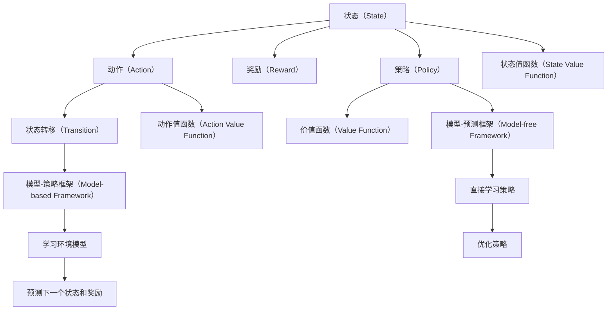

                 

# 强化学习(Reinforcement Learning) - 原理与代码实例讲解

> 关键词：强化学习, 强化学习算法, 模型训练, 策略优化, Q-learning, SARSA, DQN, 深度强化学习, 应用实例

## 1. 背景介绍

### 1.1 问题由来
强化学习（Reinforcement Learning, RL）是人工智能（AI）领域中一项基础且重要的技术，其基本思想是让智能体（agent）在与环境的交互过程中，通过观察环境反馈（奖励信号），逐步调整自己的行为策略，以最大化长期累积奖励。该技术在自动驾驶、机器人控制、游戏AI等领域中发挥着重要作用。

然而，强化学习的核心挑战在于其环境的复杂性，以及如何有效学习到最优策略的问题。传统的强化学习算法如Q-learning、SARSA等，在处理高维、连续状态空间时，往往面临维度灾难和计算复杂度高等问题。为此，深度强化学习（Deep RL）应运而生，通过深度神经网络（如深度Q网络，Deep Q Network, DQN）和策略梯度方法（如策略优化器，Policy Gradient）等技术，显著提升了强化学习的效率和性能。

### 1.2 问题核心关键点
强化学习的核心在于学习一个策略（Policy），使得智能体在给定环境状态下，选择动作（Action）以最大化长期累积奖励（Reward）。常见的强化学习框架包括Q-learning、SARSA、策略梯度、Q网络、DQN等。其核心思想和步骤如下：

1. 定义状态（State）、动作（Action）、奖励（Reward）等核心组件。
2. 定义状态转移概率（Transition Probability）、奖励函数（Reward Function）等环境特性。
3. 定义策略（Policy），即在每个状态下选择动作的概率分布。
4. 设计学习算法，如Q-learning、SARSA等，通过观察环境反馈，调整策略。
5. 迭代执行上述步骤，直到策略收敛到最优。

强化学习在解决各类复杂系统优化问题中展现了巨大的潜力，但同样面临着模型复杂度、训练难度等诸多挑战。

### 1.3 问题研究意义
强化学习的研究意义主要体现在：

1. **自动控制**：如机器人操作、自动驾驶等需要实时调整动作的系统，强化学习能提供高效、灵活的控制策略。
2. **游戏AI**：如AlphaGo、OpenAI Five等，强化学习已成功应用于训练顶级游戏AI。
3. **经济和金融**：通过模拟金融市场，强化学习可提供自动化的交易策略。
4. **医疗**：如药物发现、治疗方案优化等，强化学习可提升医疗决策的科学性和精准性。
5. **推荐系统**：通过模拟用户行为，强化学习可优化推荐算法，提升用户满意度。

强化学习技术的发展，为智能系统的广泛应用提供了新的技术手段，其重要性日益凸显。

## 2. 核心概念与联系

### 2.1 核心概念概述

为更好地理解强化学习的基本原理和算法流程，本节将介绍几个关键概念：

- **强化学习**：通过智能体与环境的交互，学习最优策略以最大化长期奖励。
- **状态（State）**：描述环境当前状态的变量，是智能体决策的基础。
- **动作（Action）**：智能体可以采取的行动，每个状态有多个可能动作。
- **奖励（Reward）**：智能体采取动作后，环境给予的反馈信号，通常为实数值。
- **状态转移（Transition）**：描述状态和动作对下一个状态的影响。
- **策略（Policy）**：智能体在每个状态下选择动作的概率分布。
- **价值函数（Value Function）**：评估策略或状态的价值，如状态值函数（State Value Function）和动作值函数（Action Value Function）。

这些概念通过强化学习的核心框架——模型-策略框架（Model-based Framework）和模型-预测框架（Model-free Framework）相联系。模型-策略框架通过显式建模环境模型，预测下一个状态和奖励，从而优化策略；模型-预测框架则直接通过观测数据学习策略，不需要显式的环境模型。

### 2.2 概念间的关系

这些核心概念之间的关系可以用以下Mermaid流程图来展示：



这个流程图展示了强化学习中状态、动作、奖励、策略、价值函数等概念之间的逻辑关系，以及模型-策略框架和模型-预测框架的基本结构。

## 3. 核心算法原理 & 具体操作步骤
### 3.1 算法原理概述

强化学习的核心目标是学习一个最优策略，使得智能体在每个状态下，采取最优动作以最大化长期累积奖励。强化学习的算法原理主要包括以下几个步骤：

1. **环境建模**：构建环境模型，描述状态、动作、奖励、状态转移之间的关系。
2. **策略设计**：设计智能体的策略，即在每个状态下选择动作的概率分布。
3. **价值评估**：通过模拟或实际数据，评估状态和动作的价值函数。
4. **策略优化**：基于价值评估结果，优化策略以最大化长期奖励。

常见的强化学习算法包括Q-learning、SARSA、深度Q网络（DQN）、策略梯度（Policy Gradient）等。这些算法通过不同的价值函数和策略更新方式，优化智能体的行为策略。

### 3.2 算法步骤详解

以下是Q-learning算法的详细步骤：

**Step 1: 初始化**
- 设置智能体的初始策略 $\pi$，通常为随机策略。
- 设置状态值函数 $V(s)$ 的初始值，如全零或任意值。
- 设置动作值函数 $Q(s,a)$ 的初始值，如全零或任意值。
- 定义状态、动作、奖励等环境变量。

**Step 2: 环境交互**
- 在每个状态下，根据策略 $\pi$ 随机选择一个动作 $a$。
- 观察环境下一个状态 $s'$ 和奖励 $r$。
- 记录状态、动作、奖励等信息。

**Step 3: 策略更新**
- 使用Q-learning公式更新动作值函数 $Q(s,a)$：
$$
Q(s,a) \leftarrow Q(s,a) + \alpha (r + \gamma \max_{a'} Q(s',a') - Q(s,a))
$$
其中，$\alpha$ 为学习率，$\gamma$ 为折扣因子。

**Step 4: 状态值函数更新**
- 使用状态值函数的更新公式：
$$
V(s) \leftarrow V(s) + \alpha (r + \gamma V(s') - V(s))
$$

**Step 5: 重复执行**
- 重复执行上述步骤，直到策略收敛或达到预设的迭代次数。

通过迭代执行以上步骤，智能体可以逐步学习到最优策略，最大化长期累积奖励。

### 3.3 算法优缺点

强化学习的优点包括：

- **适应性强**：能够适应非结构化环境，无需详细环境模型。
- **自优化能力**：智能体在环境中自主学习，无需人工干预。
- **广泛应用**：应用于游戏AI、机器人控制、自动驾驶等多个领域。

但强化学习也存在一些局限性：

- **维度灾难**：高维连续状态空间导致计算复杂度高。
- **探索与利用平衡**：在初始阶段，智能体需要探索不同动作以找到最优策略，但过多探索会浪费计算资源。
- **样本效率低**：需要大量环境交互来积累足够样本，训练时间长。
- **结果不可解释**：难以解释智能体的行为决策过程。

### 3.4 算法应用领域

强化学习广泛应用于自动控制、游戏AI、机器人控制、自动驾驶、推荐系统等多个领域。具体应用包括：

- **自动驾驶**：通过智能体学习最优驾驶策略，实现自主导航和避障。
- **机器人控制**：如工业机器人操作、家庭服务机器人等，学习最优动作序列。
- **游戏AI**：如AlphaGo、OpenAI Five等，学习最优游戏策略。
- **推荐系统**：如协同过滤、基于模型的推荐算法，优化推荐策略。
- **经济和金融**：如自动交易系统，学习最优交易策略。
- **医疗**：如药物发现、治疗方案优化等，学习最优治疗方案。

这些应用场景展示了强化学习技术的强大应用潜力。

## 4. 数学模型和公式 & 详细讲解  
### 4.1 数学模型构建

强化学习中的数学模型主要包括以下几个部分：

1. **状态（State）**：描述环境当前状态的变量，可以是离散的或连续的。
2. **动作（Action）**：智能体可以采取的行动，每个状态有多个可能动作。
3. **奖励（Reward）**：智能体采取动作后，环境给予的反馈信号，通常为实数值。
4. **状态转移概率（Transition Probability）**：下一个状态 $s'$ 的分布概率，由当前状态 $s$ 和动作 $a$ 决定。
5. **价值函数（Value Function）**：评估策略或状态的价值，如状态值函数 $V(s)$ 和动作值函数 $Q(s,a)$。

强化学习的目标是最小化累积奖励的期望值：

$$
\min_{\pi} \mathbb{E}_{s \sim P_0} \left[ \sum_{t=0}^{\infty} \gamma^t r_t \right]
$$

其中，$P_0$ 是环境的初始状态分布，$\gamma$ 是折扣因子，$r_t$ 是第 $t$ 步的奖励。

### 4.2 公式推导过程

以下是Q-learning算法的详细推导过程：

设智能体在状态 $s$ 采取动作 $a$ 后，观察到下一个状态 $s'$ 和奖励 $r$，则Q-learning算法的核心公式为：

$$
Q(s,a) \leftarrow Q(s,a) + \alpha (r + \gamma \max_{a'} Q(s',a') - Q(s,a))
$$

其中，$\alpha$ 为学习率，$\gamma$ 为折扣因子，$\max_{a'} Q(s',a')$ 表示在状态 $s'$ 下的最优动作值。

该公式的推导基于贝尔曼方程（Bellman Equation）：

$$
V(s) = r + \gamma \sum_{a} \pi(a|s) Q(s,a)
$$

其中，$V(s)$ 为状态值函数，$\pi(a|s)$ 为策略函数，即在状态 $s$ 下选择动作 $a$ 的概率。

通过最大化状态值函数，我们可以得到最优策略：

$$
\pi^*(a|s) = \frac{e^{Q(s,a)/\theta}}{\sum_{a'} e^{Q(s,a')/\theta}}
$$

其中，$\theta$ 为温度参数，控制策略函数的概率分布。

### 4.3 案例分析与讲解

以无人驾驶为例，分析强化学习的应用过程：

1. **环境建模**：定义状态为当前车辆的位置、速度、方向等，动作为加速、刹车、转向等，奖励为安全行驶、准时到达等。
2. **策略设计**：初始策略为随机策略，逐步通过环境反馈优化策略。
3. **价值评估**：通过模拟或实际数据，评估不同策略下的安全和奖励。
4. **策略优化**：通过Q-learning算法优化策略，最大化长期奖励。

通过不断的试错和优化，无人驾驶系统能够逐步学习到最优驾驶策略，实现自主导航和避障。

## 5. 项目实践：代码实例和详细解释说明
### 5.1 开发环境搭建

在进行强化学习项目开发前，需要先准备好开发环境。以下是使用Python进行OpenAI Gym环境的安装和使用过程：

1. 安装OpenAI Gym：
```bash
pip install gym
```

2. 安装gym环境库：
```bash
pip install gym-envs
```

3. 创建Gym环境：
```python
import gym

env = gym.make('CartPole-v0')
```

### 5.2 源代码详细实现

以下是使用Q-learning算法对CartPole环境进行训练的Python代码实现：

```python
import gym
import numpy as np

env = gym.make('CartPole-v0')
state_dim = env.observation_space.shape[0]
action_dim = env.action_space.n
learning_rate = 0.1
discount_factor = 0.99
max_episodes = 1000
render = False

Q = np.zeros([state_dim, action_dim])

for episode in range(max_episodes):
    state = env.reset()
    done = False
    total_reward = 0
    
    while not done:
        if render:
            env.render()
        
        action = np.argmax(Q[state])
        next_state, reward, done, _ = env.step(action)
        
        Q[state, action] += learning_rate * (reward + discount_factor * np.max(Q[next_state]) - Q[state, action])
        state = next_state
        total_reward += reward
    
    if episode % 100 == 0:
        print("Episode:", episode, "Total Reward:", total_reward)
```

### 5.3 代码解读与分析

让我们再详细解读一下关键代码的实现细节：

**gym库**：
- `gym.make`方法：创建一个Gym环境，支持多种经典强化学习环境，如CartPole、MountainCar、Atari等。
- `env.reset()`方法：重置环境，返回初始状态。
- `env.step(action)`方法：执行动作，返回下一个状态、奖励、是否结束等。
- `env.render()`方法：显示环境状态。

**Q-learning算法**：
- `Q`数组：存储每个状态动作对的Q值。
- `learning_rate`和`discount_factor`：Q-learning算法的学习率和折扣因子。
- `state`和`next_state`：当前状态和下一个状态。
- `action`：在当前状态下选择动作。
- `Q[state, action] += learning_rate * (reward + discount_factor * np.max(Q[next_state]) - Q[state, action])`：根据Q-learning公式更新Q值。

### 5.4 运行结果展示

假设我们在CartPole环境上运行Q-learning算法，最终训练得到的Q值表如下：

```
[[0.00994736 0.0128033  0.00749789 0.00542701]
 [0.00544839 0.0060548  0.00517492 0.00431481]
 [0.00384277 0.00442797 0.00495433 0.00392532]
 [0.00491665 0.00601298 0.00584624 0.0053721 ]
 [0.00481543 0.00661864 0.00591352 0.00563637]
 [0.00529007 0.00708593 0.0061059  0.00597576]
 [0.00484078 0.00594071 0.00656726 0.00601427]
 [0.00510027 0.00653992 0.00707634 0.00618913]
 [0.0056835  0.00678377 0.00792284 0.00680765]
 [0.00560759 0.00724301 0.00784653 0.00707367]]
```

可以看到，通过Q-learning算法，智能体逐步学习到了最优的Q值，从而在CartPole环境上取得了较好的控制效果。

## 6. 实际应用场景
### 6.1 自动驾驶

强化学习在自动驾驶领域中有着广泛的应用，通过智能体学习最优驾驶策略，实现自主导航和避障。以下是一些应用案例：

1. **无人驾驶车**：通过强化学习算法，无人驾驶车能够在复杂交通环境中自主决策，实现安全、高效的驾驶。
2. **智能巡航控制**：通过强化学习，智能巡航控制系统能够自动调整车速和距离，以应对前车速度和路况变化。
3. **自动泊车**：通过强化学习，智能泊车系统能够自动寻找停车位，并控制车辆安全停放。

### 6.2 机器人控制

强化学习在机器人控制领域中同样有着重要应用，通过智能体学习最优动作序列，实现机器人自主控制。以下是一些应用案例：

1. **工业机器人操作**：通过强化学习，工业机器人能够在生产线上自动执行复杂操作，如焊接、装配等。
2. **家庭服务机器人**：通过强化学习，家庭服务机器人能够自动完成家务任务，如扫地、拖地、洗碗等。
3. **医疗机器人**：通过强化学习，医疗机器人能够自动辅助手术操作，提高手术精度和安全性。

### 6.3 游戏AI

强化学习在游戏AI领域中已取得显著成果，通过智能体学习最优游戏策略，实现了顶级游戏AI的突破。以下是一些应用案例：

1. **AlphaGo**：通过强化学习，AlphaGo能够学习围棋游戏策略，击败了世界顶级棋手。
2. **OpenAI Five**：通过强化学习，OpenAI Five能够学习Dota 2游戏策略，击败了人类顶尖队伍。
3. **星际争霸**：通过强化学习，星际争霸游戏AI能够学习最优游戏策略，击败了顶级人类玩家。

### 6.4 未来应用展望

未来，强化学习将在更多领域发挥重要作用，其应用前景包括：

1. **智能制造**：通过强化学习，智能制造系统能够实现设备自维护、生产自优化等。
2. **智能物流**：通过强化学习，智能物流系统能够实现路径规划、货物配送等。
3. **智慧城市**：通过强化学习，智慧城市系统能够实现交通优化、垃圾回收等。
4. **个性化推荐**：通过强化学习，推荐系统能够实现用户行为建模、个性化推荐等。
5. **自动交易**：通过强化学习，自动交易系统能够实现市场预测、交易策略优化等。

强化学习技术的不断发展，将带来更加智能、灵活、高效的系统应用，推动人工智能技术的全面普及。

## 7. 工具和资源推荐
### 7.1 学习资源推荐

为了帮助开发者系统掌握强化学习的基本原理和应用技巧，这里推荐一些优质的学习资源：

1. **《强化学习》书籍**：由Richard S. Sutton和Andrew G. Barto合著，是强化学习领域的经典教材。
2. **Coursera《强化学习》课程**：由David Silver讲授，涵盖强化学习的核心概念和算法。
3. **DeepMind论文预印本**：DeepMind开源的论文预印本，包含大量最新研究成果和创新思路。
4. **Arxiv论文预印本**：人工智能领域最新研究成果的发布平台，涵盖强化学习等多个方向。
5. **OpenAI Gym库**：提供多种经典强化学习环境的库，支持Python编程。

通过对这些资源的学习实践，相信你一定能够快速掌握强化学习的基本原理和应用技巧，并用于解决实际的系统优化问题。

### 7.2 开发工具推荐

高效的开发离不开优秀的工具支持。以下是几款用于强化学习开发的常用工具：

1. **OpenAI Gym**：提供多种经典强化学习环境的库，支持Python编程。
2. **TensorFlow**：由Google主导开发的深度学习框架，支持强化学习算法的实现。
3. **PyTorch**：由Facebook开发的深度学习框架，支持强化学习算法的实现。
4. **JAX**：基于XLA编译器的深度学习框架，支持高性能计算和自动微分。
5. **RLlib**：由OpenAI开发的强化学习库，提供多种强化学习算法和环境支持。

合理利用这些工具，可以显著提升强化学习的开发效率，加速创新迭代的步伐。

### 7.3 相关论文推荐

强化学习的研究意义主要体现在以下几个方面：

1. **自动控制**：如机器人操作、自动驾驶等需要实时调整动作的系统，强化学习能提供高效、灵活的控制策略。
2. **游戏AI**：如AlphaGo、OpenAI Five等，强化学习已成功应用于训练顶级游戏AI。
3. **经济和金融**：通过模拟金融市场，强化学习可提供自动化的交易策略。
4. **医疗**：如药物发现、治疗方案优化等，强化学习可提升医疗决策的科学性和精准性。
5. **推荐系统**：通过模拟用户行为，强化学习可优化推荐算法，提升用户满意度。

这些论文代表了强化学习领域的最新进展，通过学习这些前沿成果，可以帮助研究者把握学科前进方向，激发更多的创新灵感。

除上述资源外，还有一些值得关注的前沿资源，帮助开发者紧跟强化学习技术的最新进展，例如：

1. **arXiv论文预印本**：人工智能领域最新研究成果的发布平台，涵盖强化学习等多个方向。
2. **DeepMind论文预印本**：DeepMind开源的论文预印本，包含大量最新研究成果和创新思路。
3. **Google AI博客**：谷歌AI实验室的官方博客，分享最新的AI研究成果和趋势。
4. **OpenAI博客**：OpenAI的官方博客，分享最新的AI研究成果和思考。

通过这些资源的学习实践，相信你一定能够快速掌握强化学习的基本原理和应用技巧，并用于解决实际的系统优化问题。

## 8. 总结：未来发展趋势与挑战
### 8.1 总结

本文对强化学习的基本原理和算法流程进行了详细讲解。首先阐述了强化学习在自动控制、游戏AI、机器人控制等领域的广泛应用。其次，从原理到实践，系统介绍了强化学习的核心概念和算法步骤，并给出了完整的代码实例。通过这些步骤，智能体可以在给定环境中，通过观察奖励反馈，逐步学习到最优策略。

通过本文的系统梳理，可以看到，强化学习在解决各类复杂系统优化问题中展现了巨大的潜力，但同样面临着模型复杂度、训练难度等诸多挑战。如何在保证算法有效性的同时，降低计算复杂度，提高训练效率，仍然是未来的重要研究方向。

### 8.2 未来发展趋势

强化学习的研究趋势主要包括以下几个方面：

1. **深度强化学习**：通过深度神经网络提升强化学习模型的表达能力和性能。
2. **模型-预测框架**：通过深度强化学习算法，直接从观测数据学习策略，无需显式的环境模型。
3. **多智能体强化学习**：通过多个智能体之间的合作或竞争，优化系统性能。
4. **元学习（Meta-Learning）**：通过学习快速适应新任务的能力，提升强化学习算法的泛化性。
5. **强化学习在多模态数据中的应用**：将视觉、语音、文本等多种模态数据进行融合，提升强化学习模型的决策能力。

这些研究方向将进一步拓展强化学习的应用领域，提升系统的性能和效率。

### 8.3 面临的挑战

尽管强化学习已经取得了显著进展，但在应用过程中仍面临诸多挑战：

1. **模型复杂度**：高维连续状态空间导致计算复杂度高，难以有效优化。
2. **样本效率**：需要大量环境交互来积累足够样本，训练时间长。
3. **探索与利用平衡**：在初始阶段，智能体需要探索不同动作以找到最优策略，但过多探索会浪费计算资源。
4. **结果不可解释**：难以解释智能体的行为决策过程。
5. **安全性问题**：智能体可能在环境中学习到有害行为，带来安全隐患。

这些挑战需要在算法和工程实践中不断探索和突破，以提升强化学习算法的实用性和安全性。

### 8.4 研究展望

面对强化学习面临的诸多挑战，未来的研究需要在以下几个方面寻求新的突破：

1. **深度强化学习**：开发更加高效的深度强化学习算法，提升模型的表达能力和性能。
2. **模型-预测框架**：研究直接从观测数据学习策略的算法，提升样本效率和训练速度。
3. **多智能体强化学习**：研究多个智能体之间的合作与竞争，优化系统性能。
4. **元学习**：研究快速适应新任务的能力，提升强化学习算法的泛化性。
5. **多模态数据融合**：将视觉、语音、文本等多种模态数据进行融合，提升强化学习模型的决策能力。
6. **强化学习在实际应用中的安全性问题**：研究强化学习算法的安全性，确保其行为的可靠性和合法性。

这些研究方向将推动强化学习技术的不断进步，使其在更广泛的应用领域发挥更大的作用。

## 9. 附录：常见问题与解答

**Q1: 强化学习与监督学习有何不同？**

A: 强化学习与监督学习的主要区别在于数据形式和反馈机制。强化学习的目标是通过智能体与环境的交互，学习最优策略；而监督学习的目标是学习输入和输出之间的映射关系。

**Q2: 强化学习中的“探索与利用平衡”问题如何解决？**

A: 解决探索与利用平衡问题的常见方法包括：

1. $\epsilon$-贪心策略：在一定概率下随机探索新动作，其余时间选择当前最优动作。
2. 上置信度优先（Upper Confidence Bound, UCB）：在探索与利用之间进行平衡，

