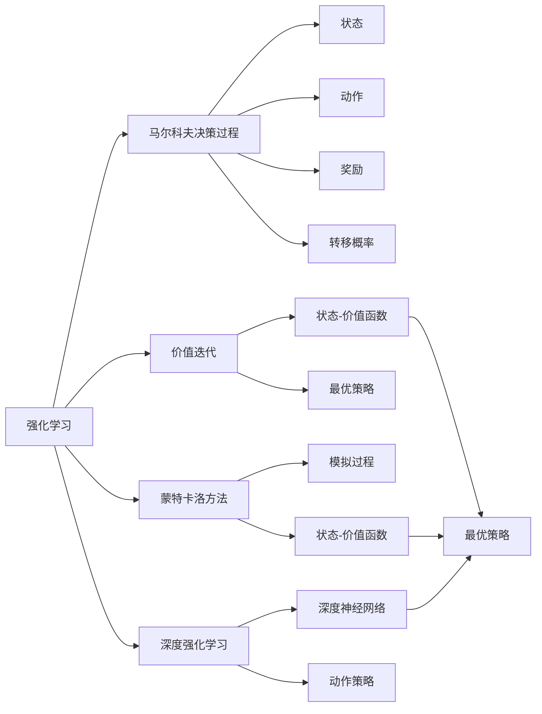
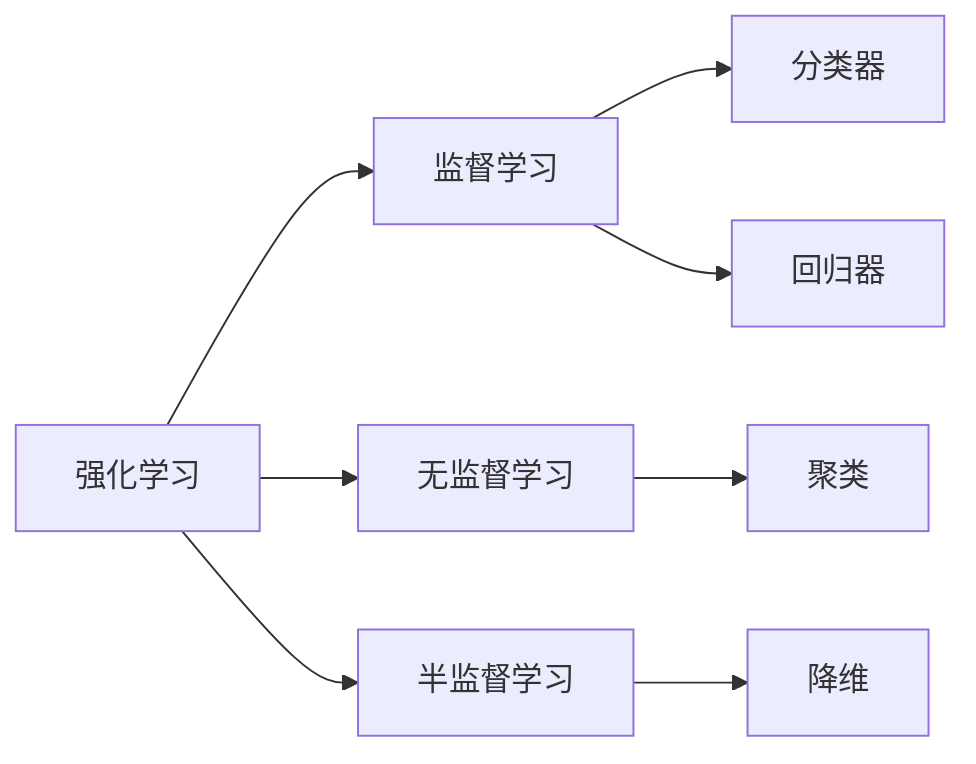
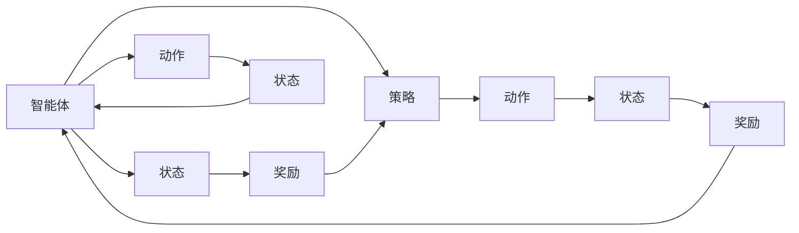
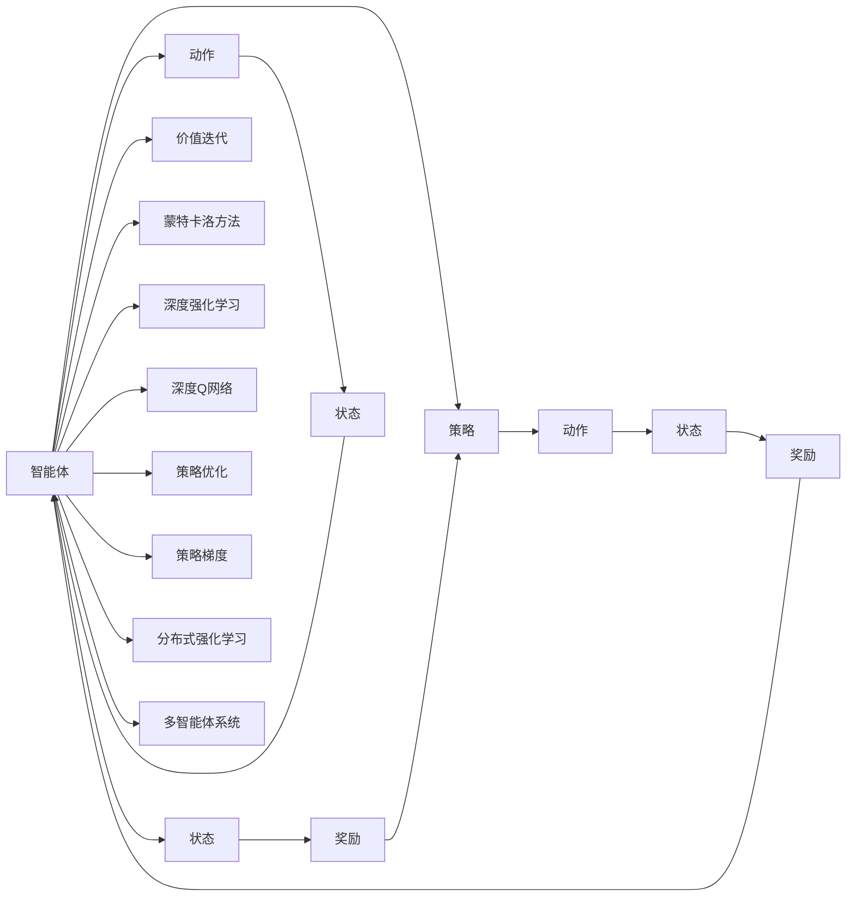

                 

# 强化学习原理与代码实例讲解

> 关键词：强化学习,动态规划,价值迭代,蒙特卡洛方法,深度强化学习,深度Q网络(DQN),策略优化,策略梯度,分布式强化学习,多智能体系统

## 1. 背景介绍

### 1.1 问题由来
强化学习(Reinforcement Learning, RL)是人工智能领域中的一个重要分支，主要研究如何使智能体(Agent)通过与环境的交互，学习最优策略，从而实现特定的目标。与传统的监督学习和无监督学习不同，强化学习通过奖励和惩罚信号指导智能体的决策，使得智能体能够逐步优化其行为策略。

强化学习广泛应用于游戏AI、机器人控制、自动驾驶、推荐系统、金融风控等领域，展示了其强大的自适应和优化能力。在许多情况下，强化学习能够带来比传统方法更优的效果，成为解决复杂优化问题的有力工具。

### 1.2 问题核心关键点
强化学习涉及智能体、环境、状态(state)、动作(action)、奖励(reward)、策略(policy)等多个核心概念，其核心思想是通过智能体与环境的交互，通过不断试错，学习出一种能够最大化长期累计奖励的策略。

强化学习的成功与否，关键在于如何设计智能体的策略，以及如何处理智能体与环境之间的交互。具体包括以下几个关键问题：
- 如何设计智能体的状态表示方法，使其能够有效捕捉环境信息。
- 如何设计智能体的动作策略，使得动作空间充分覆盖最优决策。
- 如何设计奖励函数，使其能够有效引导智能体的学习方向。
- 如何处理智能体与环境之间的动态交互，使得智能体能够适应不断变化的环境。
- 如何设计高效的算法，快速找到最优策略。

### 1.3 问题研究意义
强化学习作为人工智能的重要分支，对于提升智能体的自适应能力、优化能力、决策能力具有重要意义。研究强化学习不仅可以推动机器学习技术的发展，还可以在实际应用中解决诸多复杂问题，如机器人控制、智能交通、金融风控等，具有重要的应用价值。

## 2. 核心概念与联系

### 2.1 核心概念概述

为更好地理解强化学习的原理，本节将介绍几个密切相关的核心概念：

- 强化学习(Reinforcement Learning, RL)：通过与环境的交互，智能体通过不断的试错，学习出一种能够最大化长期累计奖励的策略。
- 马尔科夫决策过程(Markov Decision Process, MDP)：描述智能体与环境之间交互过程的一种数学框架，包含状态(state)、动作(action)、奖励(reward)、转移概率、策略(policy)等多个要素。
- 价值迭代(Value Iteration)：通过迭代计算状态-价值函数，得到最优策略的强化学习方法。
- 蒙特卡洛方法(Monte Carlo Method)：通过模拟环境状态和奖励信号，计算状态-价值函数，进而得到最优策略的强化学习方法。
- 深度强化学习(Deep Reinforcement Learning, DRL)：结合深度神经网络，通过端到端的优化，学习复杂策略的强化学习方法。
- 深度Q网络(DQN, Deep Q-Network)：结合深度神经网络和Q-learning的强化学习方法，通过端到端优化，学习动作策略的强化学习方法。
- 策略优化(Policy Optimization)：通过优化策略函数，直接最大化期望累计奖励的强化学习方法。
- 策略梯度(Services Gradient, SG)：通过优化策略函数的梯度，最大化期望累计奖励的强化学习方法。
- 分布式强化学习(Distributed Reinforcement Learning)：通过多台计算机协同训练，提高智能体学习效率的强化学习方法。
- 多智能体系统(Multi-Agent System,MAS)：由多个智能体共同组成的协同学习系统，适用于多智能体、复杂交互的场景。

这些核心概念之间的逻辑关系可以通过以下Mermaid流程图来展示：



这个流程图展示了强化学习的核心概念及其之间的关系：

1. 强化学习基于马尔科夫决策过程，通过与环境的交互，学习最优策略。
2. 价值迭代和蒙特卡洛方法分别从动态规划和模拟方法的角度，解决强化学习问题。
3. 深度强化学习利用深度神经网络，通过端到端的方式，学习复杂的策略。
4. 深度Q网络结合了深度神经网络和Q-learning的强化学习方法，进一步提高了策略学习的效率。
5. 策略优化和策略梯度方法分别从策略函数的角度，直接优化策略函数，最大化期望累计奖励。
6. 分布式强化学习和多智能体系统，分别通过多计算机协同训练和多智能体协同学习，提高智能体的学习效率。

这些概念共同构成了强化学习的完整框架，使得智能体能够在各种场景下，通过与环境的交互，学习出最优策略。

### 2.2 概念间的关系

这些核心概念之间存在着紧密的联系，形成了强化学习的完整生态系统。下面我们通过几个Mermaid流程图来展示这些概念之间的关系。

#### 2.2.1 强化学习的学习范式


这个流程图展示了强化学习的学习范式，包括基于马尔科夫决策过程、价值迭代、蒙特卡洛方法、深度强化学习的不同强化学习范式。

#### 2.2.2 强化学习与机器学习的关系



这个流程图展示了强化学习与监督学习、无监督学习、半监督学习的关系。强化学习虽然与监督学习、无监督学习不同，但在实际应用中，可以通过迁移学习的方式，将强化学习的方法应用于机器学习的任务中。

#### 2.2.3 强化学习的动态调整



这个流程图展示了智能体与环境的动态交互过程，智能体通过动作改变状态，根据状态和奖励更新策略，完成一个闭环的动态调整过程。

### 2.3 核心概念的整体架构

最后，我们用一个综合的流程图来展示这些核心概念在强化学习中的整体架构：



这个综合流程图展示了强化学习的核心概念在强化学习中的整体架构。智能体通过与环境的交互，通过价值迭代、蒙特卡洛方法、深度强化学习、深度Q网络、策略优化、策略梯度、分布式强化学习、多智能体系统等多种方法，学习出最优策略，从而实现智能体的目标。

## 3. 核心算法原理 & 具体操作步骤

### 3.1 算法原理概述

强化学习的核心目标是通过智能体与环境的交互，学习出一种能够最大化长期累计奖励的策略。其基本原理可以总结为以下几个步骤：

1. 智能体与环境交互，根据当前状态(state)和动作(action)，观察到下一个状态(s')和奖励(reward)。
2. 智能体根据当前状态(s)和奖励(reward)，更新策略函数(policy)，选择下一个动作(action)。
3. 重复上述过程，直到达到目标状态(target state)或达到预设迭代次数。

强化学习的核心在于策略函数的优化，即如何设计策略函数，使其能够最大化期望累计奖励。常用的策略优化方法包括值迭代、蒙特卡洛方法、深度Q网络、策略梯度等。

### 3.2 算法步骤详解

以下我们将详细介绍这些核心算法的具体步骤和实现细节。

#### 3.2.1 值迭代算法

值迭代算法是一种基于动态规划的强化学习算法，通过迭代计算状态-价值函数，得到最优策略。

具体步骤如下：

1. 定义状态-价值函数 $V(s)$，表示智能体从状态 $s$ 开始，采取最优策略，所能获得的长期累计奖励。
2. 定义状态-动作-状态转移函数 $P(s'|s,a)$，表示从状态 $s$ 采取动作 $a$，转移到状态 $s'$ 的概率。
3. 定义奖励函数 $R(s,a,s')$，表示从状态 $s$ 采取动作 $a$，转移到状态 $s'$ 的奖励。
4. 定义折现因子 $\gamma$，表示未来奖励的折扣率。
5. 迭代计算状态-价值函数，直至收敛。

值迭代算法的数学表达如下：

$$
V(s) = \max_a \sum_{s'} P(s'|s,a) [R(s,a,s') + \gamma V(s')]
$$

其中 $P(s'|s,a)$ 表示从状态 $s$ 采取动作 $a$，转移到状态 $s'$ 的概率。

#### 3.2.2 蒙特卡洛方法

蒙特卡洛方法是一种基于模拟的强化学习算法，通过模拟智能体与环境的交互，计算状态-价值函数，进而得到最优策略。

具体步骤如下：

1. 定义状态-价值函数 $V(s)$，表示智能体从状态 $s$ 开始，采取最优策略，所能获得的长期累计奖励。
2. 定义状态-动作-状态转移函数 $P(s'|s,a)$，表示从状态 $s$ 采取动作 $a$，转移到状态 $s'$ 的概率。
3. 定义奖励函数 $R(s,a,s')$，表示从状态 $s$ 采取动作 $a$，转移到状态 $s'$ 的奖励。
4. 定义折现因子 $\gamma$，表示未来奖励的折扣率。
5. 通过模拟智能体与环境的交互，计算状态-价值函数，直至收敛。

蒙特卡洛方法的数学表达如下：

$$
V(s) = \sum_{s'} P(s'|s) \sum_{t=0}^{\infty} \gamma^t R(s',a) V(s')
$$

其中 $P(s'|s)$ 表示从状态 $s$ 转移到状态 $s'$ 的概率。

#### 3.2.3 深度Q网络算法

深度Q网络算法是一种结合深度神经网络与Q-learning的强化学习算法，通过端到端优化，学习出最优的动作策略。

具体步骤如下：

1. 定义状态-动作-状态转移函数 $P(s'|s,a)$，表示从状态 $s$ 采取动作 $a$，转移到状态 $s'$ 的概率。
2. 定义奖励函数 $R(s,a,s')$，表示从状态 $s$ 采取动作 $a$，转移到状态 $s'$ 的奖励。
3. 定义折现因子 $\gamma$，表示未来奖励的折扣率。
4. 定义神经网络 $Q_{\theta}(s,a)$，表示从状态 $s$ 采取动作 $a$，所能获得的长期累计奖励。
5. 通过深度神经网络训练，学习出最优的动作策略。

深度Q网络的数学表达如下：

$$
Q_{\theta}(s,a) = \sum_{s'} P(s'|s,a) [R(s,a,s') + \gamma \max_a Q_{\theta}(s',a)]
$$

其中 $Q_{\theta}(s,a)$ 表示从状态 $s$ 采取动作 $a$，所能获得的长期累计奖励。

#### 3.2.4 策略梯度算法

策略梯度算法是一种基于策略函数的强化学习算法，通过优化策略函数的梯度，直接最大化期望累计奖励。

具体步骤如下：

1. 定义状态-动作-状态转移函数 $P(s'|s,a)$，表示从状态 $s$ 采取动作 $a$，转移到状态 $s'$ 的概率。
2. 定义奖励函数 $R(s,a,s')$，表示从状态 $s$ 采取动作 $a$，转移到状态 $s'$ 的奖励。
3. 定义折现因子 $\gamma$，表示未来奖励的折扣率。
4. 定义策略函数 $\pi(a|s)$，表示从状态 $s$ 采取动作 $a$ 的概率。
5. 通过优化策略函数的梯度，最大化期望累计奖励。

策略梯度的数学表达如下：

$$
\frac{\partial}{\partial \pi} \sum_{s} \sum_{t=0}^{\infty} \gamma^t R(s,a) \pi(a|s) = 0
$$

其中 $\pi(a|s)$ 表示从状态 $s$ 采取动作 $a$ 的概率。

### 3.3 算法优缺点

强化学习算法具有以下优点：

1. 能够处理动态变化的环境，自适应性强。
2. 能够优化复杂决策问题，适用于多模态数据。
3. 能够处理序列数据，如自然语言、时间序列等。
4. 能够同时优化多个目标，提高决策效率。
5. 能够优化复杂交互问题，如多智能体系统。

同时，强化学习算法也存在以下缺点：

1. 数据需求量大，需要大量模拟环境数据或实际数据。
2. 难以优化动作空间较大的问题。
3. 难以处理连续动作空间。
4. 难以处理高维度状态空间。
5. 难以优化多目标问题。

尽管存在这些缺点，但强化学习算法在许多复杂优化问题中，依然具有重要的应用价值，如机器人控制、自动驾驶、游戏AI、推荐系统等。未来，随着深度学习、强化学习等技术的不断发展，相信强化学习将能够解决更多复杂优化问题，推动人工智能技术的不断进步。

### 3.4 算法应用领域

强化学习算法在许多领域中得到了广泛应用，以下是一些典型的应用场景：

- 游戏AI：通过强化学习算法训练游戏AI，使其能够自主决策，提升游戏水平。
- 机器人控制：通过强化学习算法训练机器人，使其能够自主导航、抓取、搬运等。
- 自动驾驶：通过强化学习算法训练自动驾驶系统，使其能够自主决策，安全行驶。
- 推荐系统：通过强化学习算法训练推荐系统，使其能够自适应用户行为，优化推荐结果。
- 金融风控：通过强化学习算法训练风控系统，使其能够自适应市场变化，提升风险预警能力。
- 自然语言处理：通过强化学习算法训练聊天机器人、翻译系统等，使其能够自主交互，提升用户体验。

## 4. 数学模型和公式 & 详细讲解 & 举例说明

### 4.1 数学模型构建

强化学习的数学模型可以总结为以下几个要素：

- 状态(state)：描述智能体所处环境的当前状态，可以是离散或连续的。
- 动作(action)：智能体可以采取的行动，可以是离散或连续的。
- 奖励(reward)：智能体采取动作后，环境给出的奖励，可以是即时奖励或累积奖励。
- 转移概率(transition probability)：从当前状态采取动作后，转移到下一个状态的转移概率。
- 折现因子(discount factor)：未来奖励的折扣率，表示未来奖励的权重。
- 策略(policy)：智能体从当前状态采取动作的概率分布，可以是确定性策略或随机策略。

强化学习的目标是最小化累积奖励的方差，使得智能体能够学习出最优策略，最大化期望累计奖励。常用的数学模型如下：

$$
\min_{\pi} V_{\pi}(s)
$$

其中 $V_{\pi}(s)$ 表示在策略 $\pi$ 下，从状态 $s$ 开始，采取最优策略，所能获得的长期累计奖励。

### 4.2 公式推导过程

以下我们将详细介绍一些核心算法的数学推导过程，以加深理解。

#### 4.2.1 值迭代算法的推导

值迭代算法通过迭代计算状态-价值函数，得到最优策略。其数学推导过程如下：

$$
V^*(s) = \max_a \sum_{s'} P(s'|s,a) [R(s,a,s') + \gamma V^*(s')]
$$

其中 $V^*(s)$ 表示最优状态-价值函数，$P(s'|s,a)$ 表示从状态 $s$ 采取动作 $a$，转移到状态 $s'$ 的概率，$R(s,a,s')$ 表示从状态 $s$ 采取动作 $a$，转移到状态 $s'$ 的奖励，$\gamma$ 表示未来奖励的折扣率。

通过迭代计算，可以得到最优状态-价值函数 $V^*(s)$，进而得到最优策略 $\pi^*(a|s)$，即：

$$
\pi^*(a|s) = \frac{\partial}{\partial a} V^*(s)
$$

其中 $V^*(s)$ 表示最优状态-价值函数，$a$ 表示动作。

#### 4.2.2 蒙特卡洛方法的推导

蒙特卡洛方法通过模拟智能体与环境的交互，计算状态-价值函数，进而得到最优策略。其数学推导过程如下：

$$
V(s) = \sum_{s'} P(s'|s) \sum_{t=0}^{\infty} \gamma^t R(s',a) V(s')
$$

其中 $V(s)$ 表示状态-价值函数，$P(s'|s)$ 表示从状态 $s$ 转移到状态 $s'$ 的概率，$R(s',a)$ 表示从状态 $s'$ 采取动作 $a$，获得的奖励，$\gamma$ 表示未来奖励的折扣率。

通过模拟智能体与环境的交互，可以得到状态-价值函数 $V(s)$，进而得到最优策略 $\pi^*(a|s)$，即：

$$
\pi^*(a|s) = \frac{\partial}{\partial a} V(s)
$$

其中 $V(s)$ 表示状态-价值函数，$a$ 表示动作。

#### 4.2.3 深度Q网络算法的推导

深度Q网络算法通过深度神经网络训练，学习出最优的动作策略。其数学推导过程如下：

$$
Q_{\theta}(s,a) = \sum_{s'} P(s'|s,a) [R(s,a,s') + \gamma \max_a Q_{\theta}(s',a)]
$$

其中 $Q_{\theta}(s,a)$ 表示从状态 $s$ 采取动作 $a$，所能获得的长期累计奖励，$\theta$ 表示神经网络的参数，$P(s'|s,a)$ 表示从状态 $s$ 采取动作 $a$，转移到状态 $s'$ 的概率，$R(s,a,s')$ 表示从状态 $s$ 采取动作 $a$，转移到状态 $s'$ 的奖励，$\gamma$ 表示未来奖励的折扣率。

通过深度神经网络训练，可以得到最优的动作策略 $\pi^*(a|s)$，即：

$$
\pi^*(a|s) = \frac{\partial}{\partial a} Q_{\theta}(s,a)
$$

其中 $Q_{\theta}(s,a)$ 表示从状态 $s$ 采取动作 $a$，所能获得的长期累计奖励，$a$ 表示动作。

#### 4.2.4 策略梯度算法的推导

策略梯度算法通过优化策略函数的梯度，直接最大化期望累计奖励。其数学推导过程如下：

$$
\frac{\partial}{\partial \pi} \sum_{s} \sum_{t=0}^{\infty} \gamma^t R(s,a) \pi(a|s) = 0
$$

其中 $\pi(a|s)$ 表示从状态 $s$ 采取动作 $a$ 的概率，$\pi$ 表示策略函数，$\gamma$ 表示未来奖励的折扣率，$R(s,a,s')$ 表示从状态 $s$ 采取动作 $a$，转移到状态 $s'$ 的奖励。

通过优化策略函数的梯度，可以得到最优策略 $\pi^*(a|s)$，即：

$$
\pi^*(a|s) = \frac{\partial}{\partial a} \log \pi(a|s)
$$

其中 $\pi(a|s)$ 表示从状态 $s$ 采取动作 $a$ 的概率，$a$ 表示动作。

## 5. 项目实践：代码实例和详细解释说明

### 5.1 开发环境搭建

在进行强化学习项目开发前，我们需要准备好开发环境。以下是使用Python进行TensorFlow开发的环境配置流程：

1. 安装Anaconda：从官网下载并安装Anaconda，用于创建独立的Python环境。

2. 创建并激活虚拟环境：
```bash
conda create -n tensorflow-env python=3.8 
conda activate tensorflow-env
```

3. 安装TensorFlow：根据CUDA版本，从官网获取对应的安装命令。例如：
```bash
pip install tensorflow==2.5
```

4. 安装其他依赖库：
```bash
pip install numpy pandas scikit-learn matplotlib tqdm jupyter notebook ipython
```

完成上述步骤后，即可在`tensorflow-env`环境中开始强化学习项目开发。

### 5.2 源代码详细实现

下面我们以简单的CartPole游戏为例，给出使用TensorFlow实现强化学习的PyTorch代码实现。

首先，定义CartPole游戏环境的类：

```python
import numpy as np
import tensorflow as tf

class CartPoleEnv:
    def __init__(self):
        self.gravity = 9.8
        self.mass_cart = 1.0
        self.mass_pole = 0.1
        self.length = 0.5
        self.pole_mass_length = self.mass_pole * self.length
        self.dt = 0.02
        self.max_steps = 1000
        self.reset()
        
    def reset(self):
        self.state = np.array([0.0, 0.0, 0.0, 0.0])
        self.state[1] = -1.2 * np.random.randn()
        self.done = False
        
    def step(self, action):
        self.state[0] += self.dt * action
        self.state[1] += self.dt * (-self.gravity * self.state[1] - self.state[0]**2 / (2.0 * self.length) + 0.1 * np.random.randn())
        self.state[2] += self.dt * (np.sin(self.state[1]) + 0.1 * np.random.randn())
        self.state[3] += self.dt * np.cos(self.state[1])
        done = False
        if (self.state[0] >= 2.0 or self.state[0] <= -2.0 or
            self.state[1] >= 1.2 or self.state[1] <= -1.2 or
            abs(self.state[2]) >= 2.0 * np.pi):
            done = True
        return self.state, 1.0 if not done else -1.0, done
        
    def render(self):
        pass
```

然后，定义强化学习算法的类：

```python
class RLAgent:
    def __init__(self, env, learning_rate=0.01, discount_factor=0.99):
        self.env = env
        self.learning_rate = learning_rate
        self.discount_factor = discount_factor
        self.state = env.reset()
        self.reward_sum = 0
        self.done = False
        
    def act(self):
        return np.random.randint(0, 2)
        
    def update(self):
        state = self.state
        action = self.act()
        self.state, reward, done = self.env.step(action)
        self.reward_sum += reward
        if done:
            print('Episode: {}, Reward: {}'.format(self.reward_sum, self.reward_sum))
            self.reward_sum = 0
            self.state = self.env.reset()
            
    def run(self, episodes=1000):
        for episode in range(episodes):
            self.update()
```

最后，启动训练流程：

```python
import gym

env = gym.make('CartPole-v0')
agent = RLAgent(env)
agent.run(episodes=1000)
```

以上就是使用TensorFlow实现CartPole游戏环境的强化学习项目开发的完整代码实现。可以看到

