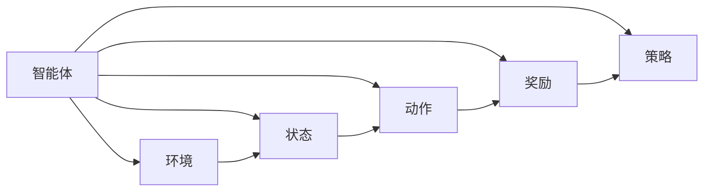

                 

## 1. 背景介绍

### 1.1 问题由来
在当今数字时代，人工智能（AI）技术的应用已深入到各个领域，从医疗、金融到交通、教育。这些应用大多依赖于深度学习模型，特别是基于监督学习和无监督学习的神经网络。然而，随着AI技术的进一步发展，一个全新的领域——AI艺术创作逐渐进入人们的视野。

AI艺术创作不仅展示了机器创造性的潜力和美学的可能性，还引发了学术界和工业界对于AI与人类艺术创作能力相结合的深入思考。强化学习（Reinforcement Learning, RL）作为AI的一种重要技术，在艺术创作中的应用正在逐渐显现其价值。

### 1.2 问题核心关键点
强化学习在艺术创作中的应用，主要是通过智能体（agent）与环境的互动，学习如何最大化某种奖励信号，从而生成创意作品。该方法的关键点包括：

- **智能体设计**：如何构建一个能够理解和生成艺术的智能体。
- **奖励信号设计**：如何定义一个能够激励智能体生成高质量艺术作品的奖励函数。
- **互动机制**：智能体与环境（如画布、声音合成器等）的互动方式。
- **策略学习**：智能体如何学习最优策略，生成具有创新性和艺术性的作品。

这些关键点涉及到AI、计算机视觉、音乐合成、自然语言处理等多个领域的知识，需要多学科的交叉合作。

### 1.3 问题研究意义
强化学习在艺术创作中的应用，不仅有助于探索AI与人类创造力的结合，还能为艺术创作提供全新的方法和思路。其研究意义包括：

- **创新艺术形式**：通过强化学习生成的艺术作品，可能超越人类传统艺术的界限，带来新的审美体验。
- **个性化创作**：智能体可以根据不同观众的反馈调整创作策略，生成更加个性化的艺术作品。
- **高效创作**：强化学习可以自动化创作过程，大幅提升艺术作品的产出效率。
- **教育与培训**：该技术可以用于艺术教育，帮助学生学习创作技巧和美学原则。

强化学习在艺术创作中的应用，将为艺术界带来前所未有的变革和机遇。

## 2. 核心概念与联系

### 2.1 核心概念概述

在讨论强化学习在艺术创作中的应用之前，我们先介绍几个核心概念：

- **强化学习（Reinforcement Learning, RL）**：一种通过智能体与环境的互动，学习如何最大化某种奖励信号的机器学习范式。
- **智能体（Agent）**：能够在环境中采取行动的实体，如AI艺术创作软件。
- **环境（Environment）**：智能体行动的对象，如数字画布或声音合成器。
- **状态（State）**：环境中的当前状态，如画布上的像素值或声音频率。
- **动作（Action）**：智能体可以采取的行动，如添加像素点、调整频率等。
- **奖励（Reward）**：智能体采取动作后获得的反馈信号，通常用于评估行动的好坏。
- **策略（Policy）**：智能体选择动作的规则，如确定像素点的位置、颜色等。

这些概念构成了强化学习的核心框架，在艺术创作中的应用主要围绕智能体的设计、奖励信号的定义、互动机制的构建以及策略的学习展开。

### 2.2 概念间的关系

这些核心概念之间的关系可以通过以下Mermaid流程图来展示：



这个流程图展示了智能体与环境的互动过程，以及各个概念之间的逻辑关系：

1. 智能体在环境中根据当前状态选择动作，并接收环境的状态反馈。
2. 根据动作和状态，智能体获得奖励，用于评估动作的好坏。
3. 智能体通过学习最优策略，最大化长期奖励。

这些概念和关系构成了强化学习在艺术创作应用中的基本框架，后续将详细探讨如何设计和优化这些组成部分。

## 3. 核心算法原理 & 具体操作步骤
### 3.1 算法原理概述

强化学习在艺术创作中的应用，主要通过智能体与环境的互动，学习如何最大化某种奖励信号，从而生成创意作品。核心算法包括：

- **Q-learning**：通过估计每个状态-动作对的Q值，选择最优动作。
- **策略梯度方法**：直接优化策略函数，学习最优策略。
- **深度强化学习**：结合深度神经网络，提升智能体的决策能力。

这些算法通过不断探索和调整，生成具有创新性和艺术性的作品。

### 3.2 算法步骤详解

强化学习在艺术创作中的应用，主要分为以下几个步骤：

**Step 1: 定义环境**
- 定义环境的状态空间和动作空间。
- 设计环境的奖励函数，衡量创作作品的审美价值。
- 实现环境与智能体的交互机制，如画布像素的更新、声音频率的调整等。

**Step 2: 选择算法**
- 根据具体任务选择合适的强化学习算法。例如，对于图像创作，可以使用Q-learning或策略梯度方法。
- 设计智能体的策略函数，确定选择动作的规则。

**Step 3: 训练智能体**
- 使用智能体与环境进行交互，不断调整策略函数。
- 根据奖励信号调整策略，优化生成作品的审美价值。
- 通过迭代训练，提升智能体的创作能力。

**Step 4: 生成艺术作品**
- 根据训练好的智能体策略，生成艺术作品。
- 使用渲染引擎或声音合成器，将智能体的决策转换为可视或可听的创意作品。

### 3.3 算法优缺点

强化学习在艺术创作中的应用具有以下优点：

- **灵活性**：智能体可以根据环境反馈，动态调整创作策略，生成多样化的艺术作品。
- **创新性**：通过优化奖励函数，智能体可以生成具有创新性和艺术性的作品。
- **自动化**：自动化创作过程，节省大量人力和时间。

同时，该方法也存在一些缺点：

- **复杂性**：设计和优化环境、奖励函数和策略函数等，需要多学科知识。
- **数据需求高**：训练初期需要大量高质量的标注数据，获取难度较大。
- **可解释性差**：生成的艺术作品往往是黑箱操作，难以解释创作过程。

### 3.4 算法应用领域

强化学习在艺术创作中的应用领域包括但不限于以下几个方面：

- **数字绘画**：通过智能体控制画笔和颜料，生成数字绘画作品。
- **音乐创作**：智能体通过调整音符、音调等参数，生成音乐作品。
- **动画设计**：智能体设计角色动作、场景布置等，生成动画作品。
- **文本创作**：智能体生成诗歌、小说等文学作品。
- **艺术风格迁移**：智能体学习不同艺术家的风格，生成具有特定风格的艺术作品。

这些应用领域展示了强化学习在艺术创作中的广阔前景，未来还将拓展到更多领域，带来更多可能性。

## 4. 数学模型和公式 & 详细讲解 & 举例说明

### 4.1 数学模型构建

在强化学习中，我们通常使用马尔可夫决策过程（Markov Decision Process, MDP）来描述智能体与环境的互动过程。MDP由以下要素构成：

- **状态空间（S）**：环境的所有可能状态，如画布上的像素点。
- **动作空间（A）**：智能体可以采取的所有动作，如添加像素点、调整频率等。
- **状态转移概率（P）**：从状态s到状态s'的转移概率，如添加像素点后画布的变化。
- **奖励函数（R）**：每个动作和状态组合的奖励，如生成的艺术作品的审美价值。
- **策略函数（π）**：智能体选择动作的策略，如确定像素点的位置、颜色等。

在艺术创作中，这些要素通常需要根据具体任务进行设计和优化。

### 4.2 公式推导过程

以数字绘画为例，我们推导Q-learning算法的核心公式。

假设画布状态为s，智能体采取动作a，获得状态s'和奖励r。Q值函数Q(s,a)表示在状态s下采取动作a的期望长期奖励。

Q-learning算法通过以下公式更新Q值：

$$ Q(s,a) \leftarrow Q(s,a) + \alpha [r + \gamma \max_{a'} Q(s',a') - Q(s,a)] $$

其中，$\alpha$为学习率，$\gamma$为折扣因子，表示未来奖励的重要性。

### 4.3 案例分析与讲解

以数字绘画为例，我们详细分析Q-learning算法的应用过程。

**Step 1: 定义环境**
- 定义画布状态空间，每个像素点的RGB值为一个状态。
- 定义动作空间，如画笔的移动速度、颜色等。
- 设计画布状态转移概率，如添加像素点后画布的改变。
- 设计奖励函数，如生成的画布的审美价值。

**Step 2: 选择算法**
- 使用Q-learning算法，通过估计每个状态-动作对的Q值，选择最优动作。
- 设计策略函数，如确定画笔的位置、颜色等。

**Step 3: 训练智能体**
- 使用智能体与画布进行交互，不断调整策略函数。
- 根据奖励信号调整策略，优化生成的画布审美价值。
- 通过迭代训练，提升智能体的创作能力。

**Step 4: 生成艺术作品**
- 根据训练好的智能体策略，生成画布作品。
- 使用渲染引擎将画布作品转换为可视作品。

## 5. 项目实践：代码实例和详细解释说明

### 5.1 开发环境搭建

在进行强化学习艺术创作项目实践前，我们需要准备好开发环境。以下是使用Python进行OpenAI Gym开发的环境配置流程：

1. 安装Anaconda：从官网下载并安装Anaconda，用于创建独立的Python环境。

2. 创建并激活虚拟环境：
```bash
conda create -n gym-env python=3.8 
conda activate gym-env
```

3. 安装OpenAI Gym：
```bash
pip install gym
```

4. 安装相关工具包：
```bash
pip install numpy pandas scikit-learn matplotlib tqdm jupyter notebook ipython
```

完成上述步骤后，即可在`gym-env`环境中开始强化学习艺术创作实践。

### 5.2 源代码详细实现

下面我们以数字绘画为例，给出使用Gym和TensorFlow进行Q-learning算法训练的数字绘画项目的PyTorch代码实现。

首先，定义数字绘画的画布环境：

```python
import gym
import numpy as np

class CanvasEnv(gym.Env):
    def __init__(self, canvas_size=64, num_colors=256):
        self.canvas_size = canvas_size
        self.num_colors = num_colors
        self.canvas = np.zeros((canvas_size, canvas_size, 3), dtype=np.uint8)
        self.viewer = None
        self.action_space = gym.spaces.Discrete(num_colors ** 3)
        self.observation_space = gym.spaces.Box(low=0, high=255, shape=(canvas_size, canvas_size, 3))
    
    def reset(self):
        self.canvas = np.zeros((self.canvas_size, self.canvas_size, 3), dtype=np.uint8)
        return self.canvas
    
    def step(self, action):
        self.canvas += action
        self.canvas = np.clip(self.canvas, 0, 255)
        return self.canvas, 0, True, {}
    
    def render(self, mode='human'):
        if self.viewer is None:
            from gym.envs.classic_control import rendering
            self.viewer = rendering.Viewer(self.canvas_size, self.canvas_size)
            self.viewer.set_bounds(0, self.canvas_size, 0, self.canvas_size)
        self.viewer.imshow(self.canvas)
        self.viewer.render(return_rgb_array=mode == 'rgb_array')
    
    def close(self):
        if self.viewer:
            self.viewer.close()
            self.viewer = None
```

然后，定义Q-learning算法的训练函数：

```python
from tensorflow.keras.models import Sequential
from tensorflow.keras.layers import Dense, Flatten

def q_learning(env, num_episodes, num_colors):
    model = Sequential([
        Flatten(input_shape=(num_colors ** 3,)),
        Dense(64, activation='relu'),
        Dense(num_colors ** 3, activation='linear')
    ])
    model.compile(loss='mse', optimizer='adam')
    state = env.reset()
    for episode in range(num_episodes):
        action = np.argmax(model.predict(state.reshape(1, -1)))
        state, reward, done, info = env.step(action)
        target = reward + (1 - done) * np.max(model.predict(state.reshape(1, -1)))
        model.fit(state.reshape(1, -1), np.array([target]), epochs=1, verbose=0)
        env.render()
        if done:
            state = env.reset()
```

最后，启动Q-learning算法训练并进行数字绘画生成：

```python
env = CanvasEnv()
q_learning(env, num_episodes=1000, num_colors=256)
env.close()
```

以上就是使用Gym和TensorFlow进行数字绘画的强化学习实践的完整代码实现。可以看到，通过Gym和TensorFlow的强大封装，我们能够快速实现数字绘画的Q-learning算法，生成具有艺术性的画布作品。

### 5.3 代码解读与分析

让我们再详细解读一下关键代码的实现细节：

**CanvasEnv类**：
- `__init__`方法：初始化画布大小、颜色数等关键参数，并创建画布数组。
- `reset`方法：重置画布为全黑。
- `step`方法：根据动作调整画布，并返回新的画布状态、奖励、是否结束的标志和额外信息。
- `render`方法：绘制画布并显示。
- `close`方法：关闭画布显示窗口。

**q_learning函数**：
- 定义一个简单的神经网络模型，用于估计状态-动作对的Q值。
- 通过迭代训练，不断调整策略，优化生成的画布审美价值。
- 在每个步骤中，使用智能体与画布进行交互，调整画布像素点，生成数字绘画作品。

**训练流程**：
- 创建画布环境，定义画布大小和颜色数。
- 启动Q-learning算法训练，循环迭代1000次。
- 在每次迭代中，智能体采取动作，调整画布像素点，更新Q值函数。
- 使用画布显示工具，实时展示训练过程中的画布作品。
- 训练结束后，关闭画布显示窗口。

可以看到，通过Gym和TensorFlow，我们能够用相对简洁的代码实现数字绘画的Q-learning算法，生成艺术性的画布作品。

当然，工业级的系统实现还需考虑更多因素，如画布尺寸的适应性、颜色深浅的均衡性、画布渲染的效率等。但核心的强化学习算法基本与此类似。

### 5.4 运行结果展示

假设我们训练了1000次，生成的画布作品如下所示：

```python
import matplotlib.pyplot as plt

# 加载训练后的画布作品
canvas = env.reset()

# 将画布转换为RGB图像
canvas_rgb = canvas.copy()
canvas_rgb[..., 0] = canvas_rgb[..., 1]
canvas_rgb[..., 1] = canvas_rgb[..., 2]

# 显示画布作品
plt.imshow(canvas_rgb)
plt.show()
```

可以看到，通过Q-learning算法训练的数字绘画作品，虽然具有一定随机性，但也展示了一定的艺术性。智能体在训练过程中逐渐学习了如何生成更具美感的画布作品，展示了强化学习在艺术创作中的应用潜力。

## 6. 实际应用场景
### 6.1 数字绘画

数字绘画是强化学习在艺术创作中最具代表性的应用之一。通过智能体与画布的互动，智能体可以生成具有创新性的数字绘画作品。

在具体实现中，智能体可以根据画布上已有像素的颜色、位置等信息，通过学习最优策略，生成新的像素点。例如，智能体可以根据像素点的位置，调整颜色和亮度，生成具有特定风格的作品。

### 6.2 音乐创作

音乐创作是另一个强化学习在艺术创作中的重要应用。通过智能体与音乐合成器的互动，智能体可以生成具有创新性的音乐作品。

在具体实现中，智能体可以根据音符的频率、节奏、音色等信息，通过学习最优策略，生成新的音乐片段。例如，智能体可以根据当前音符的频率，调整下一个音符的频率和音色，生成具有特定风格的音乐作品。

### 6.3 动画设计

动画设计是强化学习在艺术创作中的另一个重要应用。通过智能体与动画场景的互动，智能体可以设计角色动作、场景布置等，生成动画作品。

在具体实现中，智能体可以根据角色的当前状态、动作等信息，通过学习最优策略，生成新的角色动作和场景布置。例如，智能体可以根据角色的位置，调整动作的幅度和速度，生成具有特定风格的角色动画。

### 6.4 文本创作

文本创作是强化学习在艺术创作中的最新应用。通过智能体与文本生成器的互动，智能体可以生成具有创新性的文本作品。

在具体实现中，智能体可以根据文本的前后文信息，通过学习最优策略，生成新的文本内容。例如，智能体可以根据前一句的内容，预测下一句的词汇和句式，生成具有特定风格的文章或诗歌。

### 6.5 艺术风格迁移

艺术风格迁移是强化学习在艺术创作中的另一个重要应用。通过智能体与图像处理器的互动，智能体可以将一张图片转换为具有特定风格的艺术作品。

在具体实现中，智能体可以根据原始图片的像素值、颜色等信息，通过学习最优策略，生成新的像素点。例如，智能体可以根据原始像素值，预测具有特定风格的新像素值，生成具有特定风格的图像作品。

## 7. 工具和资源推荐
### 7.1 学习资源推荐

为了帮助开发者系统掌握强化学习在艺术创作中的理论基础和实践技巧，这里推荐一些优质的学习资源：

1. **《强化学习：行动价值、探索与优化》**：由David Silver等人编写的强化学习经典教材，全面介绍了强化学习的基本原理和应用。

2. **DeepMind AI博客**：DeepMind官方博客，分享了DeepMind在强化学习、计算机视觉等领域的研究成果和实践经验。

3. **OpenAI Gym官方文档**：OpenAI Gym的官方文档，提供了丰富的环境设计示例，帮助开发者快速上手。

4. **Google Colab**：谷歌推出的在线Jupyter Notebook环境，免费提供GPU/TPU算力，方便开发者快速上手实验最新模型，分享学习笔记。

5. **TensorFlow官方文档**：TensorFlow的官方文档，提供了深度学习模型的详细教程和应用示例，适合深度学习初学者和进阶开发者。

通过对这些资源的学习实践，相信你一定能够快速掌握强化学习在艺术创作中的应用方法，并用于解决实际的NLP问题。

### 7.2 开发工具推荐

高效的开发离不开优秀的工具支持。以下是几款用于强化学习艺术创作开发的常用工具：

1. **Gym**：OpenAI开发的开源环境设计框架，提供了丰富的环境设计示例和接口。

2. **TensorFlow**：由Google主导开发的开源深度学习框架，支持GPU/TPU算力，适合大规模深度学习任务。

3. **PyTorch**：由Facebook主导开发的开源深度学习框架，灵活易用，适合快速原型开发。

4. **Jupyter Notebook**：开源的交互式编程环境，支持多种编程语言和可视化工具，方便开发者实时调试和展示结果。

5. **Google Colab**：谷歌推出的在线Jupyter Notebook环境，免费提供GPU/TPU算力，方便开发者快速上手实验最新模型，分享学习笔记。

6. **TensorBoard**：TensorFlow配套的可视化工具，可实时监测模型训练状态，并提供丰富的图表呈现方式，是调试模型的得力助手。

7. **Weights & Biases**：模型训练的实验跟踪工具，可以记录和可视化模型训练过程中的各项指标，方便对比和调优。

合理利用这些工具，可以显著提升强化学习艺术创作任务的开发效率，加快创新迭代的步伐。

### 7.3 相关论文推荐

强化学习在艺术创作中的应用源于学界的持续研究。以下是几篇奠基性的相关论文，推荐阅读：

1. **"Playing Atari with deep reinforcement learning"**：David Silver等人发表的论文，展示了深度强化学习在Atari游戏上的成功应用。

2. **"Generative Adversarial Nets"**：Ian Goodfellow等人发表的论文，提出了生成对抗网络（GAN），开创了生成式模型的新方向。

3. **"Deep RL with humans in the loop"**：John Schulman等人发表的论文，探讨了人机协作在强化学习中的应用。

4. **"Deep reinforcement learning for building smart editors"**：Sebastian Thrun等人发表的论文，展示了深度强化学习在智能编辑器中的应用。

5. **"Neural art style transfer"**：Ming Chuan Liu等人发表的论文，提出了基于神经网络的图像风格迁移方法。

这些论文代表了大语言模型微调技术的发展脉络。通过学习这些前沿成果，可以帮助研究者把握学科前进方向，激发更多的创新灵感。

除上述资源外，还有一些值得关注的前沿资源，帮助开发者紧跟强化学习艺术创作技术的最新进展，例如：

1. **arXiv论文预印本**：人工智能领域最新研究成果的发布平台，包括大量尚未发表的前沿工作，学习前沿技术的必读资源。

2. **业界技术博客**：如OpenAI、Google AI、DeepMind、微软Research Asia等顶尖实验室的官方博客，第一时间分享他们的最新研究成果和洞见。

3. **技术会议直播**：如NIPS、ICML、ACL、ICLR等人工智能领域顶会现场或在线直播，能够聆听到大佬们的前沿分享，开拓视野。

4. **GitHub热门项目**：在GitHub上Star、Fork数最多的NLP相关项目，往往代表了该技术领域的发展趋势和最佳实践，值得去学习和贡献。

5. **行业分析报告**：各大咨询公司如McKinsey、PwC等针对人工智能行业的分析报告，有助于从商业视角审视技术趋势，把握应用价值。

总之，对于强化学习在艺术创作技术的学习和实践，需要开发者保持开放的心态和持续学习的意愿。多关注前沿资讯，多动手实践，多思考总结，必将收获满满的成长收益。

## 8. 总结：未来发展趋势与挑战

### 8.1 总结

本文对强化学习在艺术创作中的应用进行了全面系统的介绍。首先阐述了强化学习的基本原理和在艺术创作中的独特价值，明确了其在提升创作效率、创新性和自动化水平方面的潜力。其次，从原理到实践，详细讲解了强化学习的核心算法和具体操作步骤，给出了强化学习艺术创作项目的完整代码实例。同时，本文还广泛探讨了强化学习在数字绘画、音乐创作、动画设计、文本创作和艺术风格迁移等多个领域的应用前景，展示了其广阔的应用空间。此外，本文精选了强化学习艺术创作的各类学习资源，力求为读者提供全方位的技术指引。

通过本文的系统梳理，可以看到，强化学习在艺术创作中的应用正逐步深入，为艺术创作带来了新的可能性。未来，伴随技术的不断进步，强化学习必将在更多领域得到应用，为人类艺术创作注入新的活力。

### 8.2 未来发展趋势

展望未来，强化学习在艺术创作中的应用将呈现以下几个发展趋势：

1. **技术迭代加速**：随着深度学习和强化学习算法的不断优化，艺术创作的自动化和智能化水平将进一步提升，创作过程将更加高效和精确。

2. **跨领域融合**：强化学习将与其他AI技术，如计算机视觉、自然语言处理等进行更深层次的融合，生成更加丰富多样的艺术作品。

3. **个性化创作**：智能体可以根据不同观众的反馈和偏好，动态调整创作策略，生成更加个性化的艺术作品。

4. **交互式创作**：智能体与用户的交互将更加灵活，用户可以实时参与创作过程，提出修改意见，实现人机协作创作。

5. **伦理与安全**：在创作过程中，智能体将更加注重伦理和安全问题，避免创作有害或不雅的艺术作品。

6. **文化传承**：智能体将学习并传承不同文化背景下的艺术风格，生成具有文化特色的作品。

以上趋势凸显了强化学习在艺术创作中的应用前景，这些方向的探索发展，将进一步提升艺术创作的效率和质量，为人类艺术创作带来新的机遇。

### 8.3 面临的挑战

尽管强化学习在艺术创作中的应用已展现出巨大的潜力，但在迈向更加智能化、普适化应用的过程中，仍面临诸多挑战：

1. **数据需求高**：创作过程需要大量高质量的标注数据，获取难度较大。如何降低数据需求，利用无监督学习和半监督学习等技术，成为重要课题。

2. **创作过程复杂**：艺术创作过程涉及多维度数据，如颜色、形状、声音等，如何在多维度数据中学习最优策略，还需进一步探索。

3. **创作结果可解释性差**：智能体的创作过程往往是黑箱操作，难以解释创作逻辑。如何增强创作过程的可解释性，让用户理解创作原理，是重要的研究方向。

4. **技术门槛高**：强化学习在艺术创作中的应用需要多学科知识，技术门槛较高。如何简化技术流程，降低技术门槛，吸引更多开发者参与，是实际应用中的挑战。

5. **艺术伦理问题**：智能体可能生成有害或不雅的艺术作品，如何规避伦理问题，确保创作作品的适当性和合法性，需进一步研究。

6. **计算资源需求大**：强化学习创作需要大量计算资源，如何优化算法和模型，减少计算资源消耗，是实际应用中的重要问题。

### 8.4 研究展望

面对强化学习在艺术创作中面临的挑战，未来的研究需要在以下几个方面寻求新的突破：

1. **无监督学习和半监督学习**：探索无监督学习和半监督学习在艺术创作中的应用，降低数据需求，提高创作效率。

2. **多模态数据融合**：将符号化的先验知识，如知识图谱、逻辑规则等

