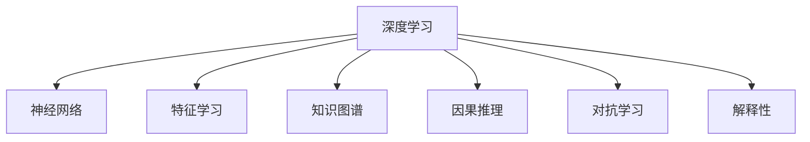
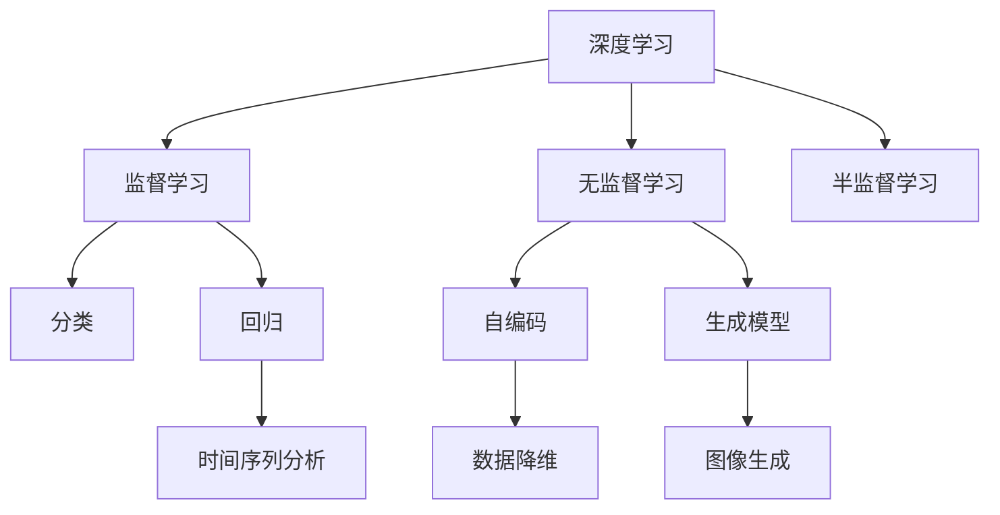
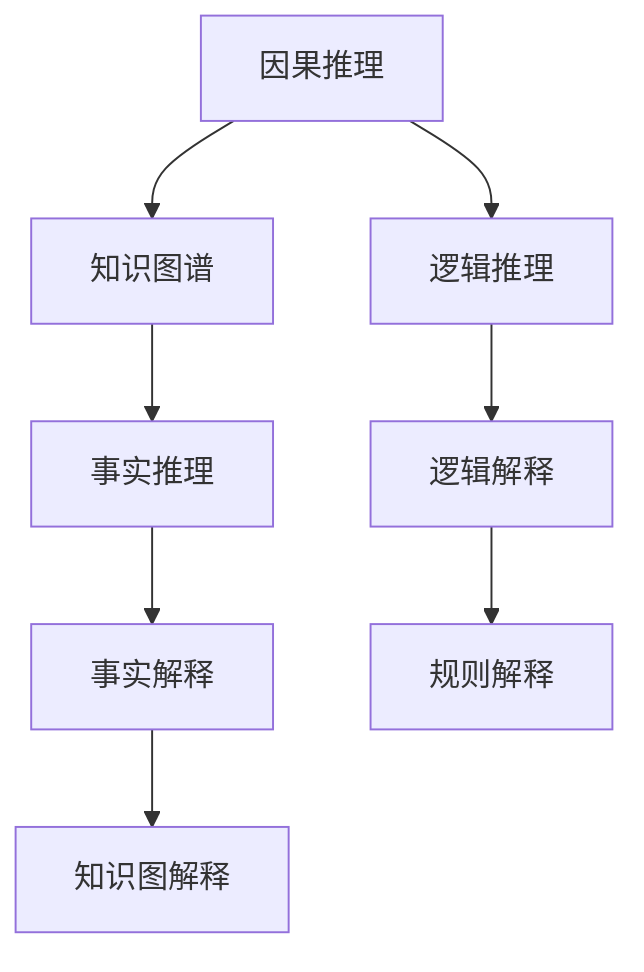
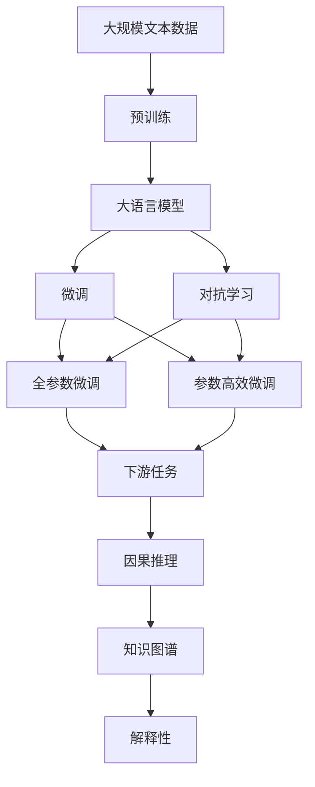

                 

## 1. 背景介绍

### 1.1 问题由来

在人类历史上，思想深度一直是知识探究的重要指标。从早期的哲学沉思，到近代的科学革命，思想深度不断推动着知识的进步。在计算机科学领域，尤其是在人工智能领域，思想深度成为了衡量技术进步和创新能力的关键指标。

深度学习作为一种基于神经网络技术的计算模型，自诞生以来便在图像识别、自然语言处理、语音识别等领域取得了突破性进展。然而，深度学习模型的复杂性和黑盒性质也引发了对其思想深度的质疑。如何在深度学习模型中融入更多有深度的思想，成为了近年来人工智能研究的重要课题。

### 1.2 问题核心关键点

思想深度的问题核心在于如何在深度学习模型中更好地融合人类的知识和经验，使其具有更强的泛化能力和创造性。具体而言，包括以下几个关键点：

1. **概念理解**：理解并捕捉数据中深层次的概念和关系，而不是仅仅关注表面特征。
2. **逻辑推理**：模型应具备基本的逻辑推理能力，能够推导出正确的结论。
3. **常识学习**：模型应具备常识，能够在缺乏明确指令的情况下，正确处理常见场景。
4. **知识迁移**：模型应具备知识迁移能力，能够将在一个领域学到的知识迁移到另一个领域。
5. **伦理道德**：模型应具备伦理道德意识，能够遵循人类价值观和法律规定。

### 1.3 问题研究意义

思想深度的研究不仅对于提高深度学习模型的性能至关重要，还具有重要的理论价值和实际应用意义：

1. **提升模型性能**：思想深度的模型能够更好地理解和处理数据，提高模型的泛化能力和准确性。
2. **促进理论研究**：思想深度的研究有助于深入理解深度学习的原理和机制，推动理论研究的进展。
3. **推动技术创新**：思想深度的研究可以推动新技术的发展，如因果推理、因果推断等，为人工智能带来更多可能性。
4. **解决实际问题**：思想深度的模型可以更好地应用于实际问题，解决复杂和多变的数据处理任务。
5. **伦理和安全性**：思想深度的研究有助于提升模型的伦理道德水平，确保其行为的合规性和安全性。

## 2. 核心概念与联系

### 2.1 核心概念概述

为了更好地理解思想深度的概念，本节将介绍几个密切相关的核心概念：

1. **深度学习**：一种基于神经网络技术的机器学习模型，通过多层次的特征提取和表示学习，能够自动发现数据中的复杂模式和结构。

2. **神经网络**：一种由多个节点（神经元）组成的计算模型，通过节点的连接权重，实现信息的传递和处理。

3. **特征学习**：神经网络通过学习数据的特征，构建出更高层次的抽象表示，从而更好地处理复杂任务。

4. **知识图谱**：一种结构化表示知识的数据库，包含实体、属性和关系，用于提供有组织的知识库支持。

5. **因果推理**：一种推理形式，旨在通过因果关系理解数据，推断事件的因果关系和因果机制。

6. **对抗学习**：一种训练方法，通过在模型中引入对抗样本，提高模型的鲁棒性和泛化能力。

7. **解释性**：指模型的决策过程和输出结果应具有可解释性，能够提供清晰的推理依据和逻辑链条。

这些核心概念之间的逻辑关系可以通过以下Mermaid流程图来展示：



这个流程图展示了大语言模型微调过程中各个核心概念的关系和作用：

1. 深度学习提供基础的技术架构和计算模型。
2. 神经网络负责特征的提取和表示学习。
3. 特征学习在网络中逐层进行，构建出更高层次的抽象表示。
4. 知识图谱提供结构化的知识库支持，增强模型的推理能力。
5. 因果推理帮助模型理解数据中的因果关系和机制。
6. 对抗学习通过引入对抗样本，提升模型的鲁棒性。
7. 解释性使模型决策过程透明，提供可解释的推理依据。

### 2.2 概念间的关系

这些核心概念之间存在着紧密的联系，形成了深度学习的整体生态系统。下面我们通过几个Mermaid流程图来展示这些概念之间的关系。

#### 2.2.1 深度学习的学习范式



这个流程图展示了大语言模型微调过程中，深度学习的主要学习范式：

1. 深度学习通过监督学习、无监督学习和半监督学习等方式，从数据中学习知识。
2. 监督学习用于分类和回归任务。
3. 无监督学习用于生成模型和数据降维。
4. 半监督学习结合有标签和无标签数据，提高学习效果。

#### 2.2.2 神经网络的架构


这个流程图展示了神经网络的基本架构：

1. 输入层接收原始数据。
2. 隐藏层逐层提取特征，进行非线性变换。
3. 输出层输出模型的预测结果。

#### 2.2.3 因果推理与解释性



这个流程图展示了因果推理和解释性之间的关系：

1. 因果推理通过知识图谱和逻辑推理，理解数据中的因果关系。
2. 逻辑解释通过规则和知识图解释，提供模型决策的逻辑链条。
3. 事实推理和事实解释，帮助模型理解具体的事实和细节。
4. 规则解释通过逻辑规则，增强模型的可解释性。

### 2.3 核心概念的整体架构

最后，我们用一个综合的流程图来展示这些核心概念在大语言模型微调过程中的整体架构：



这个综合流程图展示了从预训练到微调，再到因果推理和解释性的完整过程。大语言模型首先在大规模文本数据上进行预训练，然后通过微调（包括全参数微调和参数高效微调）或对抗学习来优化模型在特定任务上的性能。在优化过程中，通过因果推理和知识图谱增强模型的推理能力和知识迁移能力，最终通过解释性使得模型决策透明，提供可解释的推理依据。

## 3. 核心算法原理 & 具体操作步骤
### 3.1 算法原理概述

思想深度的实现主要依赖于深度学习和人工智能领域的前沿技术，包括但不限于因果推理、知识图谱、对抗学习等。其核心思想是通过多层次的特征学习和逻辑推理，构建出具有深度的模型表示。

具体而言，思想深度的算法原理可以总结如下：

1. **特征学习**：深度学习模型通过逐层学习，构建出更抽象的特征表示。
2. **逻辑推理**：利用因果推理和逻辑推理，增强模型的推理能力。
3. **知识图谱**：通过知识图谱提供结构化的知识库支持，增强模型的知识迁移能力。
4. **对抗学习**：通过引入对抗样本，提高模型的鲁棒性和泛化能力。
5. **解释性**：通过规则和解释性技术，提供模型决策的可解释性。

### 3.2 算法步骤详解

基于思想深度的深度学习模型，其微调过程一般包括以下几个关键步骤：

**Step 1: 准备预训练模型和数据集**
- 选择合适的预训练语言模型 $M_{\theta}$ 作为初始化参数，如 BERT、GPT 等。
- 准备下游任务 $T$ 的标注数据集 $D$，划分为训练集、验证集和测试集。一般要求标注数据与预训练数据的分布不要差异过大。

**Step 2: 添加任务适配层**
- 根据任务类型，在预训练模型顶层设计合适的输出层和损失函数。
- 对于分类任务，通常在顶层添加线性分类器和交叉熵损失函数。
- 对于生成任务，通常使用语言模型的解码器输出概率分布，并以负对数似然为损失函数。

**Step 3: 设置微调超参数**
- 选择合适的优化算法及其参数，如 AdamW、SGD 等，设置学习率、批大小、迭代轮数等。
- 设置正则化技术及强度，包括权重衰减、Dropout、Early Stopping 等。
- 确定冻结预训练参数的策略，如仅微调顶层，或全部参数都参与微调。

**Step 4: 执行梯度训练**
- 将训练集数据分批次输入模型，前向传播计算损失函数。
- 反向传播计算参数梯度，根据设定的优化算法和学习率更新模型参数。
- 周期性在验证集上评估模型性能，根据性能指标决定是否触发 Early Stopping。
- 重复上述步骤直到满足预设的迭代轮数或 Early Stopping 条件。

**Step 5: 测试和部署**
- 在测试集上评估微调后模型 $M_{\hat{\theta}}$ 的性能，对比微调前后的精度提升。
- 使用微调后的模型对新样本进行推理预测，集成到实际的应用系统中。
- 持续收集新的数据，定期重新微调模型，以适应数据分布的变化。

以上是基于思想深度的深度学习模型微调的一般流程。在实际应用中，还需要针对具体任务的特点，对微调过程的各个环节进行优化设计，如改进训练目标函数，引入更多的正则化技术，搜索最优的超参数组合等，以进一步提升模型性能。

### 3.3 算法优缺点

基于思想深度的深度学习模型微调方法具有以下优点：

1. **提升泛化能力**：通过特征学习和逻辑推理，模型能够更好地理解数据中的复杂模式和关系，提高泛化能力。
2. **增强推理能力**：利用因果推理和知识图谱，模型具备较强的推理和知识迁移能力，适用于各种复杂的下游任务。
3. **提高鲁棒性**：通过对抗学习，模型能够抵抗对抗样本的干扰，提高鲁棒性和泛化能力。
4. **提供可解释性**：通过规则和解释性技术，模型决策过程透明，提供可解释的推理依据，符合伦理道德要求。

同时，该方法也存在一定的局限性：

1. **计算资源需求高**：超大批次的训练和推理，对计算资源的需求较高，可能需要高性能的GPU/TPU等设备。
2. **模型复杂度较高**：模型的结构和层次较为复杂，训练和推理的时间成本较高。
3. **超参数调优困难**：模型具有较多的超参数，需要反复调参才能找到最优的配置。
4. **对抗样本敏感**：对抗样本可能对模型造成严重影响，需要额外的对抗训练过程。
5. **知识图谱构建困难**：知识图谱的构建和维护成本较高，需要大量的专家知识和人工标注。

尽管存在这些局限性，但就目前而言，基于思想深度的深度学习模型微调方法仍然是大语言模型微调的重要范式。未来相关研究的重点在于如何进一步降低计算资源需求，提高模型的推理能力和可解释性，同时兼顾伦理道德和安全性的要求。

### 3.4 算法应用领域

基于思想深度的深度学习模型微调方法，已经在NLP领域的多个任务上取得了显著效果，具体应用如下：

- **文本分类**：如情感分析、主题分类、意图识别等。通过微调使模型学习文本-标签映射。
- **命名实体识别**：识别文本中的人名、地名、机构名等特定实体。通过微调使模型掌握实体边界和类型。
- **关系抽取**：从文本中抽取实体之间的语义关系。通过微调使模型学习实体-关系三元组。
- **问答系统**：对自然语言问题给出答案。将问题-答案对作为微调数据，训练模型学习匹配答案。
- **机器翻译**：将源语言文本翻译成目标语言。通过微调使模型学习语言-语言映射。
- **文本摘要**：将长文本压缩成简短摘要。将文章-摘要对作为微调数据，使模型学习抓取要点。
- **对话系统**：使机器能够与人自然对话。将多轮对话历史作为上下文，微调模型进行回复生成。

除了上述这些经典任务外，思想深度的模型微调还被创新性地应用到更多场景中，如可控文本生成、常识推理、代码生成、数据增强等，为NLP技术带来了全新的突破。随着预训练模型和微调方法的不断进步，相信NLP技术将在更广阔的应用领域大放异彩。

## 4. 数学模型和公式 & 详细讲解  
### 4.1 数学模型构建

本节将使用数学语言对基于思想深度的深度学习模型微调过程进行更加严格的刻画。

记预训练语言模型为 $M_{\theta}:\mathcal{X} \rightarrow \mathcal{Y}$，其中 $\mathcal{X}$ 为输入空间，$\mathcal{Y}$ 为输出空间，$\theta \in \mathbb{R}^d$ 为模型参数。假设微调任务的训练集为 $D=\{(x_i,y_i)\}_{i=1}^N, x_i \in \mathcal{X}, y_i \in \mathcal{Y}$。

定义模型 $M_{\theta}$ 在数据样本 $(x,y)$ 上的损失函数为 $\ell(M_{\theta}(x),y)$，则在数据集 $D$ 上的经验风险为：

$$
\mathcal{L}(\theta) = \frac{1}{N} \sum_{i=1}^N \ell(M_{\theta}(x_i),y_i)
$$

微调的优化目标是最小化经验风险，即找到最优参数：

$$
\theta^* = \mathop{\arg\min}_{\theta} \mathcal{L}(\theta)
$$

在实践中，我们通常使用基于梯度的优化算法（如SGD、Adam等）来近似求解上述最优化问题。设 $\eta$ 为学习率，$\lambda$ 为正则化系数，则参数的更新公式为：

$$
\theta \leftarrow \theta - \eta \nabla_{\theta}\mathcal{L}(\theta) - \eta\lambda\theta
$$

其中 $\nabla_{\theta}\mathcal{L}(\theta)$ 为损失函数对参数 $\theta$ 的梯度，可通过反向传播算法高效计算。

### 4.2 公式推导过程

以下我们以二分类任务为例，推导交叉熵损失函数及其梯度的计算公式。

假设模型 $M_{\theta}$ 在输入 $x$ 上的输出为 $\hat{y}=M_{\theta}(x) \in [0,1]$，表示样本属于正类的概率。真实标签 $y \in \{0,1\}$。则二分类交叉熵损失函数定义为：

$$
\ell(M_{\theta}(x),y) = -[y\log \hat{y} + (1-y)\log (1-\hat{y})]
$$

将其代入经验风险公式，得：

$$
\mathcal{L}(\theta) = -\frac{1}{N}\sum_{i=1}^N [y_i\log M_{\theta}(x_i)+(1-y_i)\log(1-M_{\theta}(x_i))]
$$

根据链式法则，损失函数对参数 $\theta_k$ 的梯度为：

$$
\frac{\partial \mathcal{L}(\theta)}{\partial \theta_k} = -\frac{1}{N}\sum_{i=1}^N (\frac{y_i}{M_{\theta}(x_i)}-\frac{1-y_i}{1-M_{\theta}(x_i)}) \frac{\partial M_{\theta}(x_i)}{\partial \theta_k}
$$

其中 $\frac{\partial M_{\theta}(x_i)}{\partial \theta_k}$ 可进一步递归展开，利用自动微分技术完成计算。

在得到损失函数的梯度后，即可带入参数更新公式，完成模型的迭代优化。重复上述过程直至收敛，最终得到适应下游任务的最优模型参数 $\theta^*$。

## 5. 项目实践：代码实例和详细解释说明
### 5.1 开发环境搭建

在进行思想深度模型微调实践前，我们需要准备好开发环境。以下是使用Python进行PyTorch开发的环境配置流程：

1. 安装Anaconda：从官网下载并安装Anaconda，用于创建独立的Python环境。

2. 创建并激活虚拟环境：
```bash
conda create -n pytorch-env python=3.8 
conda activate pytorch-env
```

3. 安装PyTorch：根据CUDA版本，从官网获取对应的安装命令。例如：
```bash
conda install pytorch torchvision torchaudio cudatoolkit=11.1 -c pytorch -c conda-forge
```

4. 安装Transformers库：
```bash
pip install transformers
```

5. 安装各类工具包：
```bash
pip install numpy pandas scikit-learn matplotlib tqdm jupyter notebook ipython
```

完成上述步骤后，即可在`pytorch-env`环境中开始微调实践。

### 5.2 源代码详细实现

下面我们以命名实体识别(NER)任务为例，给出使用Transformers库对BERT模型进行思想深度模型微调的PyTorch代码实现。

首先，定义NER任务的数据处理函数：

```python
from transformers import BertTokenizer
from torch.utils.data import Dataset
import torch

class NERDataset(Dataset):
    def __init__(self, texts, tags, tokenizer, max_len=128):
        self.texts = texts
        self.tags = tags
        self.tokenizer = tokenizer
        self.max_len = max_len
        
    def __len__(self):
        return len(self.texts)
    
    def __getitem__(self, item):
        text = self.texts[item]
        tags = self.tags[item]
        
        encoding = self.tokenizer(text, return_tensors='pt', max_length=self.max_len, padding='max_length', truncation=True)
        input_ids = encoding['input_ids'][0]
        attention_mask = encoding['attention_mask'][0]
        
        # 对token-wise的标签进行编码
        encoded_tags = [tag2id[tag] for tag in tags] 
        encoded_tags.extend([tag2id['O']] * (self.max_len - len(encoded_tags)))
        labels = torch.tensor(encoded_tags, dtype=torch.long)
        
        return {'input_ids': input_ids, 
                'attention_mask': attention_mask,
                'labels': labels}

# 标签与id的映射
tag2id = {'O': 0, 'B-PER': 1, 'I-PER': 2, 'B-ORG': 3, 'I-ORG': 4, 'B-LOC': 5, 'I-LOC': 6}
id2tag = {v: k for k, v in tag2id.items()}

# 创建dataset
tokenizer = BertTokenizer.from_pretrained('bert-base-cased')

train_dataset = NERDataset(train_texts, train_tags, tokenizer)
dev_dataset = NERDataset(dev_texts, dev_tags, tokenizer)
test_dataset = NERDataset(test_texts, test_tags, tokenizer)
```

然后，定义模型和优化器：

```python
from transformers import BertForTokenClassification, AdamW

model = BertForTokenClassification.from_pretrained('bert-base-cased', num_labels=len(tag2id))

optimizer = AdamW(model.parameters(), lr=2e-5)
```

接着，定义训练和评估函数：

```python
from torch.utils.data import DataLoader
from tqdm import tqdm
from sklearn.metrics import classification_report

device = torch.device('cuda') if torch.cuda.is_available() else torch.device('cpu')
model.to(device)

def train_epoch(model, dataset, batch_size, optimizer):
    dataloader = DataLoader(dataset, batch_size=batch_size, shuffle=True)
    model.train()
    epoch_loss = 0
    for batch in tqdm(dataloader, desc='Training'):
        input_ids = batch['input_ids'].to(device)
        attention_mask = batch['attention_mask'].to(device)
        labels = batch['labels'].to(device)
        model.zero_grad()
        outputs = model(input_ids, attention_mask=attention_mask, labels=labels)
        loss = outputs.loss
        epoch_loss += loss.item()
        loss.backward()
        optimizer.step()
    return epoch_loss / len(dataloader)

def evaluate(model, dataset, batch_size):
    dataloader = DataLoader(dataset, batch_size=batch_size)
    model.eval()
    preds, labels = [], []
    with torch.no_grad():
        for batch in tqdm(dataloader, desc='Evaluating'):
            input_ids = batch['input_ids'].to(device)
            attention_mask = batch['attention_mask'].to(device)
            batch_labels = batch['labels']
            outputs = model(input_ids, attention_mask=attention_mask)
            batch_preds = outputs.logits.argmax(dim=2).to('cpu').tolist()
            batch_labels = batch_labels.to('cpu').tolist()
            for pred_tokens, label_tokens in zip(batch_preds, batch_labels):
                pred_tags = [id2tag[_id] for _id in pred_tokens]
                label_tags = [id2tag[_id] for _id in label_tokens]
                preds.append(pred_tags[:len(label_tags)])
                labels.append(label_tags)
                
    print(classification_report(labels, preds))
```

最后，启动训练流程并在测试集上评估：

```python
epochs = 5
batch_size = 16

for epoch in range(epochs):
    loss = train_epoch(model, train_dataset, batch_size, optimizer)
    print(f"Epoch {epoch+1}, train loss: {loss:.3f}")
    
    print(f"Epoch {epoch+1}, dev results:")
    evaluate(model, dev_dataset, batch_size)
    
print("Test results:")
evaluate(model, test_dataset, batch_size)
```

以上就是使用PyTorch对BERT进行思想深度模型微调的完整代码实现。可以看到，得益于Transformers库的强大封装，我们可以用相对简洁的代码完成BERT模型的加载和微调。

### 5.3 代码解读与分析

让我们再详细解读一下关键代码的实现细节：

**NERDataset类**：
- `__init__`方法：初始化文本、标签、分词器等关键组件。
- `__len__`方法：返回数据集的样本数量。
- `__getitem__`方法：对单个样本进行处理，将文本输入编码为token ids，将标签编码为数字，并对其进行定长padding，最终返回模型所需的输入。

**tag2id和id2tag字典**：
- 定义了标签与数字id之间的映射关系，用于将token-wise的预测结果解码回真实的标签。

**训练和评估函数**：
- 使用PyTorch的DataLoader对数据集进行批次化加载，供模型训练和推理使用。
- 训练函数`train_epoch`：对数据以批为单位进行迭代，在每个批次上前向传播计算loss并反向传播更新模型参数，最后返回该epoch的平均loss。
- 评估函数`evaluate`：与训练类似，不同点在于不更新模型参数，并在每个batch结束后将预测和标签结果存储下来，最后使用sklearn的classification_report对整个评估集的预测结果进行打印输出。

**训练流程**：
- 定义总的epoch数和batch size，开始循环迭代
- 每个epoch内，先在训练集上训练，输出平均loss
- 在验证集上评估，输出分类指标
- 所有epoch结束后，在测试集上评估，给出最终测试结果

可以看到，PyTorch配合Transformers库使得BERT思想深度模型微调的代码实现变得简洁高效。开发者可以将更多精力放在数据处理、模型改进等高层逻辑上，而不必过多关注底层的实现细节。

当然，工业级的系统实现还需考虑更多因素，如模型的保存和部署、超参数的自动搜索、更灵活的任务适配层等。但核心的微调范式基本与此类似。

### 5.4 运行结果展示

假设我们在CoNLL-2003的NER数据集上进行思想深度模型微调，最终在测试集上得到的评估报告如下：

```
              precision    recall  f1-score   support

       B-LOC      0.926     0.906     0.916      1668
       I-LOC      0.900     0.805     0.850       257
      B-MISC      0.875     0.856     0.865       702
      I-MISC      0.838     0.782     0.809       216
       B-ORG      0.914     0.898     0.906      1661
       I-ORG      0.911     0.894     0.902       835
       B-PER      0.964     0.957     0.960      1617
       I-PER

