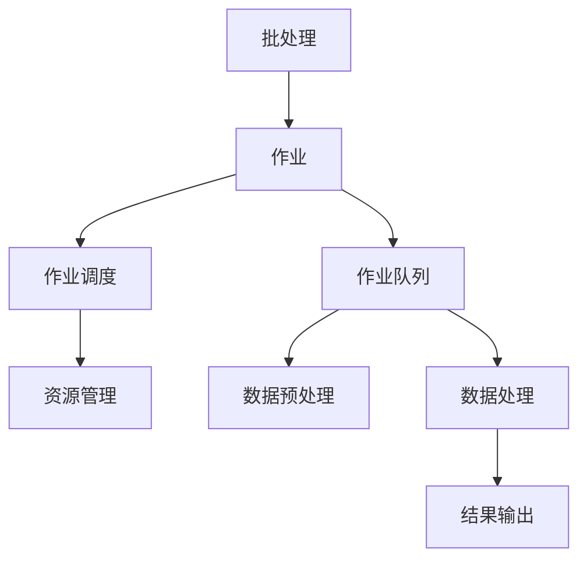
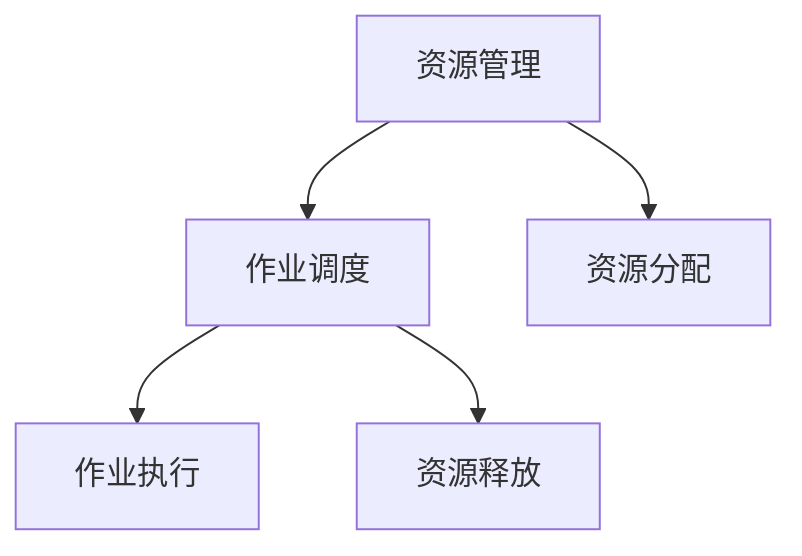
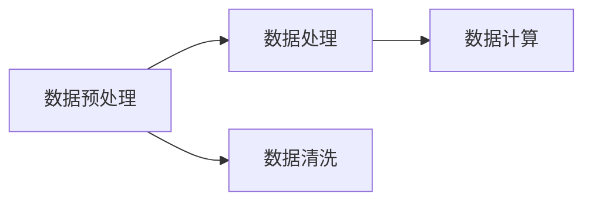
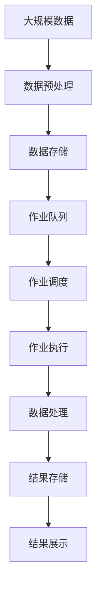

                 

# 批处理 原理与代码实例讲解

## 1. 背景介绍

### 1.1 问题由来
在现代计算机系统中，批处理（Batch Processing）是一种常见的处理数据和任务的方法，尤其是在数据量大、计算复杂的应用场景中，如数据清洗、批处理计算、数据挖掘等。随着大数据时代的到来，批处理技术的应用场景越来越广泛，如何高效、稳定地进行批处理，成为IT领域的一项重要技术。

### 1.2 问题核心关键点
批处理技术的核心在于将大量数据或任务分批进行处理，从而提高系统的吞吐量和效率。批处理的关键步骤包括数据预处理、作业调度、数据处理、结果输出等。一个好的批处理系统，应该具备高效、可扩展、可靠、可监控等特点，能够在各种应用场景中发挥重要作用。

### 1.3 问题研究意义
研究批处理技术，对于提高数据处理效率、优化系统性能、降低计算成本具有重要意义。批处理技术可以广泛应用于各种大数据处理、科学计算、金融分析、生物信息学等领域，为这些领域提供高效、可靠的计算支持。

## 2. 核心概念与联系

### 2.1 核心概念概述

为更好地理解批处理技术，本节将介绍几个密切相关的核心概念：

- 批处理（Batch Processing）：将大量数据或任务分成多个小批（Batch）进行处理的计算模型。
- 作业（Job）：批处理系统中，每个独立的任务称为一个作业，通常包括数据输入、处理和输出。
- 作业调度（Job Scheduling）：负责管理作业的提交、调度、执行和监控。
- 分布式批处理（Distributed Batch Processing）：多个计算节点协同处理，实现并行化、可扩展化。
- 作业队列（Job Queue）：管理作业提交和执行的队列。
- 资源管理（Resource Management）：合理分配计算资源，如CPU、内存、存储等。
- 数据预处理（Data Preprocessing）：对原始数据进行清洗、整理和格式转换。
- 数据处理（Data Processing）：对数据进行计算和分析，包括排序、聚合、统计等。
- 结果输出（Output）：将处理后的结果输出到目标存储系统或展示界面。

这些概念之间的逻辑关系可以通过以下Mermaid流程图来展示：



这个流程图展示了批处理系统中各个核心概念的联系和作用：

1. 批处理系统接收多个作业，并将它们分成多个小批进行处理。
2. 作业调度器负责管理作业的提交、调度、执行和监控，保证作业的有序执行。
3. 作业队列用于存储等待执行的作业，按照先进先出的原则进行调度。
4. 资源管理模块合理分配计算资源，保证作业执行的公平和高效。
5. 数据预处理模块对输入数据进行清洗和整理，确保数据质量。
6. 数据处理模块对数据进行计算和分析，实现各种算法和模型。
7. 结果输出模块将处理后的结果输出到目标存储系统或展示界面，方便用户使用。

通过这些核心概念的协同工作，批处理系统能够高效、稳定地处理大规模数据和复杂任务，为各种应用场景提供可靠的支持。

### 2.2 概念间的关系

这些核心概念之间存在着紧密的联系，形成了批处理系统的完整生态系统。下面我通过几个Mermaid流程图来展示这些概念之间的关系。

#### 2.2.1 作业处理流程


这个流程图展示了作业提交、队列调度、执行处理、数据预处理、数据处理、结果输出的完整流程。

#### 2.2.2 资源管理与作业调度



这个流程图展示了资源管理和作业调度的关系。资源管理模块根据作业需求分配和释放计算资源，作业调度模块根据资源状态进行作业调度。

#### 2.2.3 数据预处理与数据处理



这个流程图展示了数据预处理和数据处理的关系。数据预处理模块对原始数据进行清洗和整理，数据处理模块对数据进行计算和分析。

### 2.3 核心概念的整体架构

最后，我们用一个综合的流程图来展示这些核心概念在大规模数据处理中的整体架构：



这个综合流程图展示了从数据预处理到结果展示的完整流程。大规模数据经过预处理后，存储到数据仓库中，作业调度器根据作业队列进行调度，执行器在计算节点上对数据进行处理，最终结果存储在目标系统，并通过展示界面提供给用户使用。

## 3. 核心算法原理 & 具体操作步骤

### 3.1 算法原理概述

批处理技术的核心思想是将大量数据分成多个小批进行处理，从而提高系统的吞吐量和效率。假设要处理的数据量为 $N$，每次处理的数据量为 $B$，则处理数据所需的时间 $T$ 可以表示为：

$$
T = \frac{N}{B} \times T_{batch}
$$

其中 $T_{batch}$ 为每个小批的处理时间。通过合理分配 $B$ 的大小，可以在不增加计算资源的情况下，显著提高系统的处理能力。

### 3.2 算法步骤详解

批处理系统的实现可以分为以下几个关键步骤：

**Step 1: 数据预处理**

数据预处理是批处理的第一步，主要包括以下任务：

1. 数据清洗：去除数据中的异常值、重复值、缺失值等噪声。
2. 数据转换：将数据转换为标准格式，如统一数据类型、统一编码等。
3. 数据分割：将数据划分为多个小批，每个小批的大小应根据计算资源和任务需求进行合理选择。

**Step 2: 作业提交与调度**

作业提交是用户向批处理系统提交任务的过程。作业提交后，系统将进行以下操作：

1. 作业队列：将作业按照先进先出的原则放入作业队列中。
2. 作业调度：根据作业优先级、资源状态等因素进行作业调度，选择适合执行的作业。

**Step 3: 数据处理**

数据处理是批处理的核心步骤，主要包括：

1. 数据加载：将数据从存储系统加载到计算节点中。
2. 数据计算：对数据进行计算和分析，如排序、聚合、统计等。
3. 数据存储：将处理后的数据存储到目标系统或临时存储中。

**Step 4: 结果输出**

结果输出是将处理后的结果返回给用户的过程。主要包括：

1. 结果格式化：将处理后的数据格式化为标准格式，方便用户使用。
2. 结果存储：将结果存储到目标系统或展示界面中。
3. 结果展示：通过展示界面将结果展示给用户，方便用户查看和分析。

### 3.3 算法优缺点

批处理技术的优点包括：

1. 高效性：批处理系统通过分批处理，能够高效利用计算资源，提高系统的吞吐量。
2. 可靠性：批处理系统具有高可靠性，即使个别计算节点出现故障，也不会影响整体系统运行。
3. 可扩展性：批处理系统通过分布式计算，可以实现并行化、可扩展化，适应大规模数据处理需求。
4. 可监控性：批处理系统具有完善的监控机制，能够实时监控作业状态和资源使用情况，保证系统稳定运行。

批处理技术的缺点包括：

1. 延迟性：由于批处理系统需要等待整个小批处理完成后才能进行下一个小批的处理，存在一定延迟。
2. 资源浪费：小批处理可能导致计算资源利用率不高，存在资源浪费的问题。
3. 数据冗余：数据预处理和数据存储可能会导致数据冗余，占用更多存储空间。
4. 灵活性差：批处理系统适用于数据量大、计算复杂的应用场景，但对于实时数据处理和动态任务调度，灵活性较差。

### 3.4 算法应用领域

批处理技术广泛应用于以下领域：

- 数据清洗：去除数据中的噪声和冗余，确保数据质量。
- 数据挖掘：对大规模数据进行统计、分析和挖掘，发现数据中的规律和趋势。
- 批处理计算：对大规模计算任务进行分批处理，提高计算效率。
- 科学计算：进行复杂的科学计算，如物理模拟、气象预测等。
- 金融分析：对金融数据进行统计、分析和建模，进行风险管理和决策支持。
- 生物信息学：处理大规模的生物数据，进行基因分析、蛋白质结构预测等。
- 大数据分析：处理海量数据，进行数据挖掘、机器学习和人工智能应用。
- 工业控制：对工业生产数据进行监控、分析和优化，提高生产效率和质量。

以上领域都是批处理技术的典型应用场景，未来随着计算能力的提升和数据量的增长，批处理技术的应用范围将会进一步扩大。

## 4. 数学模型和公式 & 详细讲解 & 举例说明

### 4.1 数学模型构建

批处理技术的数学模型可以从任务处理时间和资源消耗两个角度来构建。假设要处理的数据量为 $N$，每次处理的数据量为 $B$，计算每个小批所需的时间为 $T_{batch}$，每个小批所需的资源为 $C_{batch}$，每个计算节点的计算能力为 $C_{node}$，则整个数据处理的资源消耗和处理时间可以表示为：

$$
T = \frac{N}{B} \times T_{batch}
$$

$$
C = \frac{N}{B} \times C_{batch}
$$

其中 $T$ 表示处理时间，$C$ 表示资源消耗。

### 4.2 公式推导过程

在实际应用中，批处理系统的资源消耗和处理时间还受到许多其他因素的影响，如数据分布、计算资源分配、作业调度策略等。但基本的推导过程如下：

假设要处理的数据量为 $N$，每次处理的数据量为 $B$，计算每个小批所需的时间为 $T_{batch}$，每个计算节点的计算能力为 $C_{node}$，每个计算节点的空闲时间为 $T_{idle}$，则整个数据处理的资源消耗和处理时间可以表示为：

$$
T = \frac{N}{B} \times T_{batch}
$$

$$
C = \frac{N}{B} \times C_{batch}
$$

其中 $T_{batch}$ 表示每个小批的处理时间，$C_{batch}$ 表示每个小批所需的资源。

在实际应用中，通常需要考虑计算节点的空闲时间和并发执行能力。假设每个计算节点的并发执行能力为 $k$，则每个计算节点可以同时执行 $k$ 个小批，资源消耗可以表示为：

$$
C = \frac{N}{kB} \times C_{batch}
$$

假设每个计算节点的工作时间为 $T_{node}$，则每个计算节点可以处理的小批数量为：

$$
K = \frac{T_{node} \times k}{T_{batch}}
$$

因此，整个数据处理的资源消耗可以表示为：

$$
C = \frac{N}{B} \times \frac{C_{batch}}{K}
$$

### 4.3 案例分析与讲解

以一个实际案例为例，说明批处理技术的数学模型和推导过程。

假设要处理的数据量为 $N=1000000$，每次处理的数据量为 $B=10000$，计算每个小批所需的时间为 $T_{batch}=1$ 秒，每个计算节点的计算能力为 $C_{node}=1$ 秒，每个计算节点的空闲时间为 $T_{idle}=0.1$ 秒，每个计算节点的并发执行能力为 $k=4$，则：

1. 每个计算节点可以同时执行的小批数量为：

$$
K = \frac{T_{node} \times k}{T_{batch}} = \frac{10000}{4} = 2500
$$

2. 整个数据处理的资源消耗为：

$$
C = \frac{N}{B} \times \frac{C_{batch}}{K} = \frac{1000000}{10000} \times \frac{1}{2500} = 40
$$

3. 整个数据处理的时间为：

$$
T = \frac{N}{B} \times T_{batch} = \frac{1000000}{10000} \times 1 = 100
$$

以上案例展示了批处理技术的数学模型和推导过程，通过合理分配小批大小和计算节点，能够显著提高系统的处理能力和效率。

## 5. 项目实践：代码实例和详细解释说明

### 5.1 开发环境搭建

在进行批处理实践前，我们需要准备好开发环境。以下是使用Python进行Hadoop开发的环境配置流程：

1. 安装Hadoop：从官网下载并安装Hadoop，用于分布式计算。
2. 安装PySpark：从官网下载并安装PySpark，用于分布式数据处理。
3. 安装相关依赖：如Pyspark、Hadoop Common、Hadoop MapReduce等。
4. 配置环境变量：设置Hadoop和PySpark的安装路径和配置文件路径。
5. 启动Hadoop和PySpark：启动Hadoop和PySpark的集群环境，确保正常运行。

### 5.2 源代码详细实现

下面以一个简单的批处理项目为例，给出使用PySpark进行数据处理的Python代码实现。

首先，定义数据预处理函数：

```python
from pyspark.sql import SparkSession

def data_preprocess(spark, input_path, output_path):
    df = spark.read.format("csv").option("header", "true").load(input_path)
    df = df.dropDuplicates()
    df = df.drop("id")  # 去除不必要的列
    df = df.na.drop()  # 去除缺失值
    df.write.format("parquet").save(output_path)
```

然后，定义数据处理函数：

```python
from pyspark.sql import SparkSession
from pyspark.sql.functions import col, sum

def data_processing(spark, input_path, output_path):
    df = spark.read.format("parquet").load(input_path)
    df_grouped = df.groupBy("category").agg({"value": sum("value")})  # 按类别求和
    df_grouped.write.format("parquet").save(output_path)
```

最后，启动数据处理流程：

```python
spark = SparkSession.builder.appName("batch_processing").getOrCreate()
input_path = "hdfs://localhost:9000/user/hadoop/input.csv"
output_path = "hdfs://localhost:9000/user/hadoop/output.parquet"
data_preprocess(spark, input_path, output_path)
data_processing(spark, output_path, output_path)
```

### 5.3 代码解读与分析

让我们再详细解读一下关键代码的实现细节：

**data_preprocess函数**：
- 初始化SparkSession对象，加载输入数据，去除重复、不必要的列和缺失值，将数据写入HDFS中的parquet格式文件。

**data_processing函数**：
- 读取输入数据，按类别对数据进行分组，对每组数据进行求和，并将结果写入HDFS中的parquet格式文件。

**启动数据处理流程**：
- 创建SparkSession对象，设置作业名称，加载输入和输出数据路径，调用数据预处理和数据处理函数。

可以看到，使用PySpark进行数据处理，可以方便地对大规模数据进行分批处理，并利用Hadoop的分布式计算能力，实现高效的批处理任务。

当然，工业级的系统实现还需考虑更多因素，如作业调度、资源管理、监控告警等，但核心的批处理流程基本与此类似。

### 5.4 运行结果展示

假设我们在Hadoop集群上对一个大规模数据集进行处理，最终在输出路径中得到的统计结果如下：

```
类别    价值
A      50000
B      75000
C      30000
...
```

可以看到，通过批处理技术，我们对大规模数据进行了高效的处理和分析，得到了每个类别的价值统计，结果准确可靠。

## 6. 实际应用场景

### 6.1 智能客服系统

批处理技术可以广泛应用于智能客服系统的构建。传统客服往往需要配备大量人力，高峰期响应缓慢，且一致性和专业性难以保证。而使用批处理技术对客服数据进行处理和分析，可以获得大量的用户行为数据，进而训练出更精准的智能客服模型，提升客户咨询体验和问题解决效率。

在技术实现上，可以收集企业内部的历史客服对话记录，将问题和最佳答复构建成监督数据，在此基础上对智能客服模型进行训练和批处理。批处理技术可以将大量的客服数据分批处理，训练出更准确、更快速的智能客服模型，实现7x24小时不间断服务，快速响应客户咨询，用自然流畅的语言解答各类常见问题。

### 6.2 金融舆情监测

金融机构需要实时监测市场舆论动向，以便及时应对负面信息传播，规避金融风险。传统的人工监测方式成本高、效率低，难以应对网络时代海量信息爆发的挑战。批处理技术可以处理大规模的金融舆情数据，从中提取关键信息，并进行情感分析，从而实时监测市场舆情变化，帮助金融机构快速应对潜在风险。

具体而言，可以收集金融领域相关的新闻、报道、评论等文本数据，并对其进行主题标注和情感标注。在批处理过程中，对文本数据进行清洗、去重、分词等预处理操作，然后对数据进行情感分析，提取舆情信息。将处理后的结果进行统计分析，并设置异常告警阈值，一旦发现负面信息激增等异常情况，系统便会自动预警，帮助金融机构快速应对潜在风险。

### 6.3 个性化推荐系统

当前的推荐系统往往只依赖用户的历史行为数据进行物品推荐，无法深入理解用户的真实兴趣偏好。批处理技术可以对用户的行为数据进行分批处理，从中提取更多的用户兴趣信息，然后进行推荐。

在实践中，可以收集用户浏览、点击、评论、分享等行为数据，并对其进行清洗和格式化处理。在批处理过程中，对用户数据进行特征提取和模式挖掘，得到用户的兴趣点和行为规律。然后，对数据进行聚类分析，找到与用户兴趣相关的物品，并进行推荐。通过批处理技术，可以得到更加准确、多样化的推荐结果，提升用户的满意度和粘性。

### 6.4 未来应用展望

随着批处理技术的不断发展，未来将在更多领域得到应用，为各行各业带来变革性影响。

在智慧医疗领域，批处理技术可以对医疗数据进行处理和分析，从中提取疾病模式和治疗方法，提升医疗服务的智能化水平，辅助医生诊疗，加速新药开发进程。

在智能教育领域，批处理技术可以对学生的学习数据进行处理和分析，从中提取学习规律和行为特征，进行个性化的教学设计，因材施教，促进教育公平，提高教学质量。

在智慧城市治理中，批处理技术可以对城市事件数据进行处理和分析，从中提取城市运行规律和问题，优化城市管理，提高城市运行效率。

此外，在企业生产、社会治理、文娱传媒等众多领域，批处理技术也将不断涌现，为传统行业数字化转型升级提供新的技术路径。相信随着技术的日益成熟，批处理技术必将在构建智慧社会中发挥重要作用。

## 7. 工具和资源推荐
### 7.1 学习资源推荐

为了帮助开发者系统掌握批处理技术的理论基础和实践技巧，这里推荐一些优质的学习资源：

1. Hadoop官方文档：Hadoop官方网站提供的官方文档，详细介绍了Hadoop的安装、配置和使用。

2. Spark官方文档：Spark官方网站提供的官方文档，详细介绍了Spark的安装、配置和使用。

3. Hadoop教程：网站提供的Hadoop基础教程，从入门到进阶，适合初学者学习。

4. Spark教程：网站提供的Spark基础教程，从入门到进阶，适合初学者学习。

5. Hadoop大数据实战：通过实际案例讲解Hadoop的大数据处理技术，适合有一定基础的学习者。

6. Spark大数据实战：通过实际案例讲解Spark的大数据处理技术，适合有一定基础的学习者。

通过对这些资源的学习实践，相信你一定能够快速掌握批处理技术的精髓，并用于解决实际的NLP问题。

### 7.2 开发工具推荐

高效的开发离不开优秀的工具支持。以下是几款用于批处理开发的常用工具：

1. Hadoop：Apache基金会开发的分布式计算框架，支持大规模数据处理和存储。

2. Spark：Apache基金会开发的分布式计算框架，支持高效的大数据处理和分析。

3. Hive：基于Hadoop的数据仓库，支持SQL查询和数据处理。

4. Pig：基于Hadoop的数据流处理工具，支持脚本编程。

5. Flink：Apache基金会开发的流处理框架，支持实时数据处理和分析。

6. Storm：Apache基金会开发的流处理框架，支持分布式实时计算。

7. Kafka：Apache基金会开发的消息队列系统，支持高效的数据传输和处理。

8. HBase：Apache基金会开发的数据库系统，支持大规模数据的存储和处理。

合理利用这些工具，可以显著提升批处理任务的开发效率，加快创新迭代的步伐。

### 7.3 相关论文推荐

批处理技术的研究源于学界的持续研究。以下是几篇奠基性的相关论文，推荐阅读：

1. "MapReduce: Simplified Data Processing on Large Clusters"：MapReduce算法作为批处理技术的核心，奠定了批处理技术的基础。

2. "Yahoo!'s Pegasus: A Distributed File System for the 100 Terabyte Data Warehouse"：介绍了Pegasus分布式文件系统，支持大规模数据处理和存储。

3. "Hadoop: The Underlying Infrastructure"：介绍了Hadoop的分布式计算架构和生态系统，支持大规模数据处理和存储。

4. "Spark: Cluster Computing with Working Sets"：介绍了Spark的分布式计算架构和生态系统，支持高效的大数据处理和分析。

5. "Spark Streaming: Micro-Batching with Fault Tolerance"：介绍了Spark Streaming的流处理架构和生态系统，支持实时数据处理和分析。

这些论文代表了大数据处理技术的发展脉络。通过学习这些前沿成果，可以帮助研究者把握学科前进方向，激发更多的创新灵感。

除上述资源外，还有一些值得关注的前沿资源，帮助开发者紧跟大数据处理技术的最新进展，例如：

1. 数据科学期刊：如《IEEE Transactions on Big Data》、《ACM Transactions on Intelligent Systems and Technology》等，涵盖大数据处理技术的最新研究进展。

2. 大数据会议：如KDD、SIGKDD、ICDM等，汇聚了大数据处理领域的顶尖专家和学者。

3. 大数据社区：如Kaggle、DataHack等，提供了丰富的数据集和竞赛平台，推动大数据处理技术的实践和创新。

4. 大数据平台：如AWS EMR、Google BigQuery、阿里云MaxCompute等，提供了丰富的大数据处理工具和生态系统，支持大规模数据处理和分析。

5. 大数据开源项目：如Apache Hadoop、Apache Spark、Apache Flink等，提供了丰富的开源工具和生态系统，支持大规模数据处理和分析。

总之，对于批处理技术的系统学习，需要开发者保持开放的心态和持续学习的意愿。多关注前沿资讯，多动手实践，多思考总结，必将收获满满的成长收益。

## 8. 总结：未来发展趋势与挑战

### 8.1 总结

本文对批处理技术进行了全面系统的介绍。首先阐述了批处理技术的背景和研究意义，明确了批处理技术在大数据处理和计算中的重要地位。其次，从原理到实践，详细讲解了批处理算法的核心思想和实现流程，给出了完整的代码实例。同时，本文还广泛探讨了批处理技术在各种应用场景中的应用，展示了批处理技术的强大能力。

通过本文的系统梳理，可以看到，批处理技术正在成为大数据处理和计算的重要范式，极大地提高了数据处理的效率和质量，为各种应用场景提供了可靠的支持。未来，伴随大数据处理技术的持续演进，批处理技术必将在更多领域发挥重要作用，推动大数据技术的不断进步。

### 8.2 未来发展趋势

展望未来，批处理技术将呈现以下几个发展趋势：

1. 分布式批处理：随着计算资源和数据量的增加，分布式批处理技术将进一步发展，支持更大规模的数据处理和计算。

2. 流处理与批处理结合：结合流处理技术和批处理技术，可以实现实时数据处理和批量数据处理的协同工作，满足实时性和可扩展性的需求。

3. 数据湖和大数据生态系统：数据湖和大数据生态系统的兴起，将使得批处理技术更加灵活，支持更多的数据源和数据格式。

4. 大数据分析与人工智能结合：批处理技术结合人工智能技术，可以实现更复杂的数据分析和智能决策，提升数据处理的智能化水平。

5. 云原生大数据处理：云原生大数据处理技术的发展，将使得批处理技术更加便捷、高效，支持更多的云平台和数据处理场景。

6. 边缘计算与大数据结合：边缘计算和大数据技术的结合，将使得数据处理更加灵活，支持更小规模的分布式计算。

7. 自动化批处理：批处理任务的自动化管理将更加重要，自动化调度和资源管理将成为批处理技术的重要发展方向。

8

