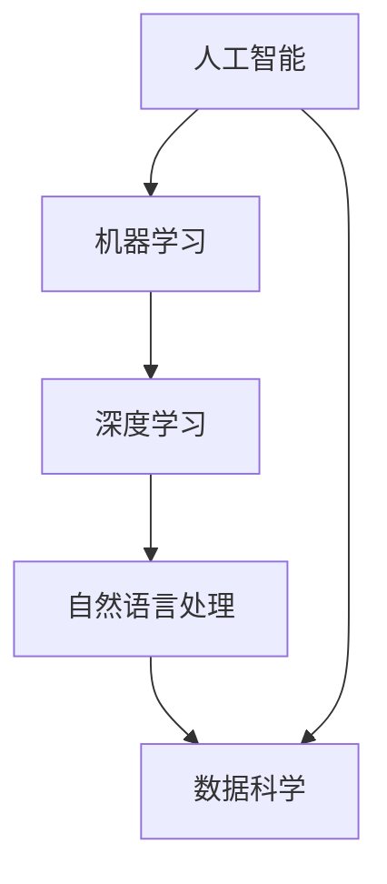

                 

# 李开复：AI 2.0 时代的产业

## 1. 背景介绍

### 1.1 问题由来
随着人工智能（AI）技术的飞速发展，特别是深度学习和大数据的应用，AI 2.0时代的到来已成为不可逆转的趋势。AI 2.0，也称为新一代人工智能，其核心在于通过大规模数据、复杂模型和高效计算，实现对海量数据的深度挖掘和智能处理。

### 1.2 问题核心关键点
AI 2.0时代，人工智能的应用范围和深度不断拓展，从传统的机器视觉、语音识别等领域，延伸到医疗、金融、教育等垂直行业，推动了各行业的数字化转型和智能化升级。AI 2.0技术不仅提高了生产效率，还改善了用户体验，为各行各业带来了前所未有的变革。

### 1.3 问题研究意义
AI 2.0技术的发展对产业的影响深远，具有以下重要意义：

1. **提高生产力**：AI 2.0技术通过自动化、智能化手段，大幅提高了各行各业的生产效率，减少了人工操作和人为错误。
2. **改善用户体验**：AI 2.0技术提升了用户界面的友好性，增加了个性化服务，满足了用户的多样化需求。
3. **促进创新**：AI 2.0技术为各行各业带来了新的商业模式和商业模式，催生了大量的创新产品和应用。
4. **增强竞争力**：AI 2.0技术使企业能够更快地响应市场变化，提高市场竞争力。
5. **推动社会进步**：AI 2.0技术在医疗、教育、环境保护等领域的应用，推动了社会的整体进步和福祉改善。

## 2. 核心概念与联系

### 2.1 核心概念概述

在AI 2.0时代，核心概念包括：

- **人工智能（AI）**：通过模拟人类的智能行为，实现信息的处理、分析和决策。
- **机器学习（ML）**：一种数据驱动的技术，通过训练算法使计算机系统自动提升性能。
- **深度学习（DL）**：一种特殊的机器学习方法，通过构建多层次神经网络模型，实现对复杂数据的深度学习和表示。
- **数据科学（DS）**：研究数据的收集、处理、分析和应用，以发现数据中的模式和趋势。
- **自然语言处理（NLP）**：使计算机能够理解、解释和生成人类语言的技术。

### 2.2 概念间的关系

AI 2.0技术由多个核心概念构成，这些概念之间存在着紧密的联系。它们通过协同工作，推动了AI 2.0技术在各个垂直领域的应用。以下是一个综合性的Mermaid流程图，展示了这些概念之间的关系：



## 3. 核心算法原理 & 具体操作步骤

### 3.1 算法原理概述

AI 2.0技术的核心算法原理主要包括：

- **深度学习（DL）**：通过构建多层次的神经网络模型，实现对复杂数据的高效处理和分析。
- **卷积神经网络（CNN）**：用于图像识别和处理，通过卷积操作提取图像特征。
- **循环神经网络（RNN）**：用于序列数据的处理，通过循环机制捕捉时间序列中的长期依赖。
- **注意力机制（Attention）**：用于增强模型对关键信息的关注，提高模型的处理能力。
- **生成对抗网络（GAN）**：用于生成新的数据，通过对抗训练提高生成数据的质量。

### 3.2 算法步骤详解

AI 2.0技术的实现步骤包括：

1. **数据预处理**：清洗、标注数据，确保数据的质量和一致性。
2. **模型构建**：选择合适的算法和模型结构，并根据数据特点进行调参。
3. **模型训练**：使用训练数据集对模型进行迭代训练，调整模型参数以最小化损失函数。
4. **模型评估**：使用验证数据集评估模型性能，确保模型泛化能力。
5. **模型应用**：将训练好的模型应用于实际问题中，进行预测、分类、生成等任务。

### 3.3 算法优缺点

AI 2.0技术具有以下优点：

- **高精度**：通过深度学习和多层次模型结构，AI 2.0技术能够处理和分析复杂数据，提高预测和分类的精度。
- **高效性**：AI 2.0技术能够自动化处理大量数据，减少人工干预，提高处理效率。
- **灵活性**：AI 2.0技术适用于多种应用场景，能够适应不同领域的需求。

同时，AI 2.0技术也存在一些缺点：

- **高需求资源**：深度学习和神经网络模型需要大量的计算资源和存储空间。
- **模型复杂性**：模型结构复杂，难以解释和调试。
- **数据依赖性**：模型性能高度依赖于数据质量，需要大量高质量标注数据。

### 3.4 算法应用领域

AI 2.0技术在多个领域得到广泛应用，包括但不限于：

- **医疗**：AI 2.0技术用于疾病诊断、医疗影像分析、基因分析等，提升了医疗服务的效率和准确性。
- **金融**：AI 2.0技术用于风险管理、投资分析、客户服务等，提高了金融服务的智能化水平。
- **教育**：AI 2.0技术用于个性化学习、智能辅导、作业批改等，提升了教育体验和效果。
- **制造业**：AI 2.0技术用于智能制造、供应链管理、质量控制等，提高了生产效率和产品质量。
- **物流**：AI 2.0技术用于路径规划、货物追踪、配送优化等，提升了物流服务的效率和准确性。

## 4. 数学模型和公式 & 详细讲解 & 举例说明

### 4.1 数学模型构建

AI 2.0技术中的数学模型构建通常包括：

- **深度神经网络模型**：使用反向传播算法，通过链式法则计算损失函数的梯度，更新模型参数。
- **卷积神经网络（CNN）**：使用卷积操作提取图像特征，通过池化层减少数据维度。
- **循环神经网络（RNN）**：使用循环层处理序列数据，捕捉时间依赖。
- **注意力机制（Attention）**：使用注意力权重调整输入数据的权重，提高模型的关注点。

### 4.2 公式推导过程

以卷积神经网络（CNN）为例，其基本结构包括卷积层、池化层、全连接层等。以下是一个简单的卷积神经网络模型的推导过程：

$$
\text{Convolution}(X) = \sum_{i,j} w_{i,j} \cdot X_{i,j}
$$

$$
\text{ReLU}(X) = \max(0,X)
$$

$$
\text{Pooling}(X) = \max_{i,j} X_{i,j}
$$

其中，$X$表示输入数据，$w_{i,j}$表示卷积核，$\text{ReLU}$表示激活函数，$\text{Pooling}$表示池化操作。

### 4.3 案例分析与讲解

以图像分类为例，使用CNN模型进行图像分类的推导过程如下：

1. **数据预处理**：将图像转换为像素矩阵，并进行归一化处理。
2. **卷积层**：使用多个卷积核提取图像特征，生成多个特征图。
3. **池化层**：对特征图进行池化操作，减少数据维度。
4. **全连接层**：将池化后的特征图输入全连接层，生成分类得分。
5. **softmax层**：将得分转换为概率分布，进行分类预测。

## 5. 项目实践：代码实例和详细解释说明

### 5.1 开发环境搭建

使用Python进行AI 2.0项目开发，需要安装以下工具：

1. **Python**：选择3.8及以上版本，建议使用Anaconda安装。
2. **PyTorch**：选择最新稳定版本，用于深度学习模型的开发和训练。
3. **TensorFlow**：选择最新稳定版本，用于深度学习模型的部署和推理。
4. **Numpy**：用于数组计算和矩阵运算。
5. **Pandas**：用于数据处理和分析。
6. **Scikit-learn**：用于机器学习模型的评估和选择。
7. **Matplotlib**：用于绘制图形和可视化。

### 5.2 源代码详细实现

以下是一个使用PyTorch进行图像分类任务的代码示例：

```python
import torch
import torch.nn as nn
import torch.optim as optim
import torchvision
import torchvision.transforms as transforms
import matplotlib.pyplot as plt

# 数据预处理
transform = transforms.Compose([
    transforms.ToTensor(),
    transforms.Normalize((0.5, 0.5, 0.5), (0.5, 0.5, 0.5))
])

trainset = torchvision.datasets.CIFAR10(root='./data', train=True, download=True, transform=transform)
trainloader = torch.utils.data.DataLoader(trainset, batch_size=4, shuffle=True, num_workers=2)

testset = torchvision.datasets.CIFAR10(root='./data', train=False, download=True, transform=transform)
testloader = torch.utils.data.DataLoader(testset, batch_size=4, shuffle=False, num_workers=2)

# 模型构建
class Net(nn.Module):
    def __init__(self):
        super(Net, self).__init__()
        self.conv1 = nn.Conv2d(3, 6, 5)
        self.pool = nn.MaxPool2d(2, 2)
        self.conv2 = nn.Conv2d(6, 16, 5)
        self.fc1 = nn.Linear(16 * 5 * 5, 120)
        self.fc2 = nn.Linear(120, 84)
        self.fc3 = nn.Linear(84, 10)

    def forward(self, x):
        x = self.pool(F.relu(self.conv1(x)))
        x = self.pool(F.relu(self.conv2(x)))
        x = x.view(-1, 16 * 5 * 5)
        x = F.relu(self.fc1(x))
        x = F.relu(self.fc2(x))
        x = self.fc3(x)
        return x

net = Net()

# 模型训练
criterion = nn.CrossEntropyLoss()
optimizer = optim.SGD(net.parameters(), lr=0.001, momentum=0.9)

for epoch in range(2):
    running_loss = 0.0
    for i, data in enumerate(trainloader, 0):
        inputs, labels = data
        optimizer.zero_grad()
        outputs = net(inputs)
        loss = criterion(outputs, labels)
        loss.backward()
        optimizer.step()
        running_loss += loss.item()
        if i % 2000 == 1999:
            print('[%d, %5d] loss: %.3f' %
                  (epoch + 1, i + 1, running_loss / 2000))
            running_loss = 0.0

print('Finished Training')

# 模型评估
correct = 0
total = 0
with torch.no_grad():
    for data in testloader:
        images, labels = data
        outputs = net(images)
        _, predicted = torch.max(outputs.data, 1)
        total += labels.size(0)
        correct += (predicted == labels).sum().item()

print('Accuracy of the network on the 10000 test images: %d %%' % (
    100 * correct / total))
```

### 5.3 代码解读与分析

上述代码中，我们使用了PyTorch构建了一个简单的卷积神经网络模型，用于CIFAR-10数据集上的图像分类任务。具体步骤包括：

1. **数据预处理**：将图像数据转换为Tensor格式，并进行归一化处理。
2. **模型构建**：定义了一个包含两个卷积层、两个池化层、三个全连接层的神经网络模型。
3. **模型训练**：使用随机梯度下降算法（SGD）对模型进行训练，优化交叉熵损失函数。
4. **模型评估**：在测试集上评估模型性能，输出分类准确率。

## 6. 实际应用场景

### 6.1 智能制造

AI 2.0技术在智能制造中的应用包括：

- **预测性维护**：通过数据分析和机器学习，预测设备故障，实现预测性维护，减少停机时间和维护成本。
- **质量控制**：通过图像识别和深度学习技术，自动检测产品质量缺陷，提高产品合格率。
- **生产优化**：通过数据分析和优化算法，优化生产流程，提高生产效率和资源利用率。

### 6.2 智能交通

AI 2.0技术在智能交通中的应用包括：

- **智能导航**：通过图像识别和路径规划技术，实现智能导航，提升驾驶安全和效率。
- **交通监控**：通过视频分析和深度学习技术，实时监控交通流量，优化交通信号灯控制。
- **自动驾驶**：通过感知、决策和控制技术，实现自动驾驶，提升交通安全和效率。

### 6.3 智慧医疗

AI 2.0技术在智慧医疗中的应用包括：

- **疾病诊断**：通过医学影像分析和深度学习技术，辅助医生进行疾病诊断，提高诊断准确率。
- **个性化治疗**：通过数据分析和机器学习技术，制定个性化治疗方案，提高治疗效果。
- **健康监测**：通过可穿戴设备和深度学习技术，实时监测患者健康状况，及时预警异常情况。

## 7. 工具和资源推荐

### 7.1 学习资源推荐

- **《深度学习》（周志华）**：全面介绍了深度学习的基本原理和应用，适合初学者入门。
- **《机器学习实战》（Peter Harrington）**：通过实例演示了机器学习模型的开发和应用，适合实践学习。
- **《TensorFlow实战》（Yaroslav Halchenko）**：详细介绍了TensorFlow框架的使用方法和技巧，适合进阶学习。
- **《Python机器学习》（Andreas C. Müller, Sarah Guido）**：介绍了Python在机器学习中的应用，适合Python开发者学习。
- **《自然语言处理综论》（Daniel Jurafsky, James H. Martin）**：介绍了自然语言处理的基本概念和算法，适合NLP领域的学习者。

### 7.2 开发工具推荐

- **Anaconda**：Python环境管理和数据科学开发工具。
- **Jupyter Notebook**：交互式编程和数据可视化工具。
- **PyTorch**：深度学习框架，支持动态计算图。
- **TensorFlow**：深度学习框架，支持静态计算图和分布式计算。
- **Keras**：高级深度学习框架，提供简单易用的接口。

### 7.3 相关论文推荐

- **《ImageNet Classification with Deep Convolutional Neural Networks》**：AlexNet论文，介绍了深度卷积神经网络在图像分类中的应用。
- **《Distributed Deep Learning》**：Google分布式深度学习论文，介绍了分布式深度学习技术的应用。
- **《Attention is All You Need》**：Transformer论文，介绍了自注意力机制在自然语言处理中的应用。
- **《Generative Adversarial Nets》**：GAN论文，介绍了生成对抗网络在图像生成和数据增强中的应用。

## 8. 总结：未来发展趋势与挑战

### 8.1 研究成果总结

AI 2.0技术的发展离不开学术界和工业界的共同努力。以下是对AI 2.0技术的几个关键研究成果的总结：

1. **深度学习**：通过多层神经网络结构，实现了对复杂数据的高效处理和分析。
2. **卷积神经网络（CNN）**：用于图像识别和处理，通过卷积操作提取图像特征。
3. **循环神经网络（RNN）**：用于序列数据的处理，通过循环机制捕捉时间依赖。
4. **注意力机制（Attention）**：用于增强模型对关键信息的关注，提高模型的处理能力。
5. **生成对抗网络（GAN）**：用于生成新的数据，通过对抗训练提高生成数据的质量。

### 8.2 未来发展趋势

AI 2.0技术的未来发展趋势包括：

1. **多模态学习**：通过融合视觉、听觉、语言等多种模态信息，提升AI系统的感知能力和理解能力。
2. **联邦学习**：通过分布式计算和多节点协同训练，保护数据隐私和安全。
3. **可解释性AI**：通过可解释性算法和工具，增强AI系统的透明性和可信度。
4. **自适应学习**：通过自适应算法和模型，实现AI系统的自我优化和调整。
5. **伦理AI**：通过伦理约束和规范，确保AI系统的公平性、公正性和安全性。

### 8.3 面临的挑战

AI 2.0技术在发展过程中面临以下挑战：

1. **数据隐私和安全**：数据隐私和安全问题成为制约AI技术应用的重要因素。
2. **算法公平性和偏见**：AI算法可能存在歧视性偏见，影响决策的公正性和可信度。
3. **模型可解释性**：AI模型的复杂性和黑盒特性，使其难以解释和理解。
4. **资源消耗**：AI模型的复杂性和计算需求，需要大量的计算资源和存储空间。
5. **伦理和法律问题**：AI技术在应用过程中可能涉及伦理和法律问题，需要规范和监管。

### 8.4 研究展望

为了应对AI 2.0技术面临的挑战，未来的研究方向包括：

1. **隐私保护技术**：研究隐私保护算法和联邦学习技术，确保数据隐私和安全。
2. **公平性算法**：研究公平性算法和模型，消除AI算法的偏见和歧视。
3. **可解释性算法**：研究可解释性算法和工具，增强AI系统的透明性和可信度。
4. **资源优化技术**：研究资源优化算法和模型压缩技术，降低AI模型的计算需求。
5. **伦理规范**：研究AI技术的伦理规范和法律框架，确保AI系统的公平性和公正性。

## 9. 附录：常见问题与解答

**Q1: 深度学习模型在实际应用中需要注意哪些问题？**

A: 深度学习模型在实际应用中需要注意以下问题：

1. **数据质量和数量**：深度学习模型依赖于大量高质量标注数据，数据质量和数量不足会影响模型性能。
2. **模型选择和调参**：选择合适的深度学习模型和调参，确保模型能够在特定任务上取得良好效果。
3. **计算资源需求**：深度学习模型需要大量计算资源，需要合理规划和优化计算资源。
4. **模型可解释性**：深度学习模型通常是黑盒模型，难以解释其内部工作机制，需要进行可解释性分析。
5. **数据隐私和安全**：深度学习模型需要保护数据隐私和安全，防止数据泄露和滥用。

**Q2: 什么是联邦学习？它有哪些应用场景？**

A: 联邦学习是一种分布式机器学习技术，通过多节点协同训练，保护数据隐私和安全。其主要应用场景包括：

1. **医疗数据共享**：联邦学习可用于保护医疗数据隐私，实现多中心医疗数据共享和分析。
2. **金融数据分析**：联邦学习可用于保护金融数据隐私，实现多机构金融数据共享和分析。
3. **智能电网**：联邦学习可用于保护电网数据隐私，实现多节点智能电网数据分析和优化。
4. **智能制造**：联邦学习可用于保护制造数据隐私，实现多工厂智能制造数据分析和优化。

**Q3: 如何提高深度学习模型的可解释性？**

A: 提高深度学习模型的可解释性可以通过以下方法：

1. **可视化工具**：使用可视化工具，如TensorBoard，可视化模型的训练过程和特征提取过程。
2. **解释性算法**：使用解释性算法，如LIME、SHAP等，解释模型的决策过程和特征重要性。
3. **可解释性模型**：使用可解释性模型，如决策树、线性回归等，替代复杂黑盒模型。
4. **特征分析**：对模型输入的特征进行分析和解释，理解模型对输入的依赖关系。
5. **模型评估**：通过模型评估指标，如准确率、召回率等，评估模型的性能和公平性。

**Q4: AI 2.0技术在实际应用中如何处理数据隐私和安全问题？**

A: AI 2.0技术在实际应用中处理数据隐私和安全问题的方法包括：

1. **数据加密**：使用数据加密技术，保护数据在传输和存储过程中的安全性。
2. **联邦学习**：通过分布式计算和多节点协同训练，保护数据隐私和安全。
3. **隐私保护算法**：使用隐私保护算法，如差分隐私、同态加密等，保护数据隐私和安全。
4. **访问控制**：通过访问控制技术，限制数据访问权限，防止数据泄露和滥用。
5. **合规性检查**：遵循相关法律法规，确保数据处理过程的合规性。

**Q5: 什么是自适应学习？它有哪些应用场景？**

A: 自适应学习是一种通过模型自我优化和调整的机器学习方法，其主要应用场景包括：

1. **动态环境**：在动态环境下，自适应学习可以实时调整模型参数，保持模型性能和适应性。
2. **个性化推荐**：自适应学习可以实时调整推荐模型，根据用户行为和偏好进行个性化推荐。
3. **实时优化**：在实时优化任务中，自适应学习可以实时调整模型参数，提高优化效率和效果。
4. **多任务学习**：在多任务学习中，自适应学习可以动态调整模型参数，实现多任务协同优化。
5. **自监督学习**：在自监督学习中，自适应学习可以自动发现和利用未标注数据，提高模型泛化能力。

**Q6: 什么是伦理AI？它有哪些重要意义？**

A: 伦理AI是指在AI技术开发和应用过程中，遵循伦理规范和法律框架的AI系统。其主要意义包括：

1. **公平性**：确保AI系统在处理数据和做出决策时，遵循公平性和公正性原则，避免偏见和歧视。
2. **透明性**：确保AI系统的工作机制和决策过程透明，增强用户信任和接受度。
3. **安全性**：确保AI系统在处理数据和做出决策时，保护用户隐私和安全，防止数据泄露和滥用。
4. **可解释性**：确保AI系统的决策过程可解释，增强用户理解和使用。
5. **责任明确**：确保AI系统的决策责任明确，防止滥用和误导。

**Q7: 如何有效使用联邦学习保护数据隐私？**

A: 联邦学习通过分布式计算和多节点协同训练，保护数据隐私的方法包括：

1. **数据加密**：在数据传输过程中，使用数据加密技术保护数据隐私。
2. **差分隐私**：在数据聚合过程中，使用差分隐私技术保护数据隐私。
3. **同态加密**：在数据计算过程中，使用同态加密技术保护数据隐私。
4. **安全多方计算**：在数据共享过程中，使用安全多方计算技术保护数据隐私。
5. **模型训练**：在模型训练过程中，使用差分隐私和同态加密等技术保护数据隐私。

**Q8: 什么是自监督学习？它有哪些应用场景？**

A: 自监督学习是一种无需标注数据，通过数据自身的特点进行学习的方法。其主要应用场景包括：

1. **数据标注**：在数据标注成本较高的情况下，自监督学习可以通过数据自身的特点进行学习，减少标注需求。
2. **数据增强**：自监督学习可以通过数据自身的特点进行数据增强，提高模型泛化能力。
3. **模型预训练**：自监督学习可以通过数据自身的特点进行模型预训练，提高模型性能和泛化能力。
4. **数据处理**：自监督学习可以通过数据自身的特点进行数据处理，提高数据质量。
5. **异常检测**：自监督学习可以通过数据自身的特点进行异常检测，提高异常检测准确率。

通过以上学习资源的推荐和开发工具的使用，相信读者可以更好地理解和应用AI 2.0技术，推动AI技术在各个垂直领域的应用和发展。

---

作者：禅与计算机程序设计艺术 / Zen and the Art of Computer Programming

