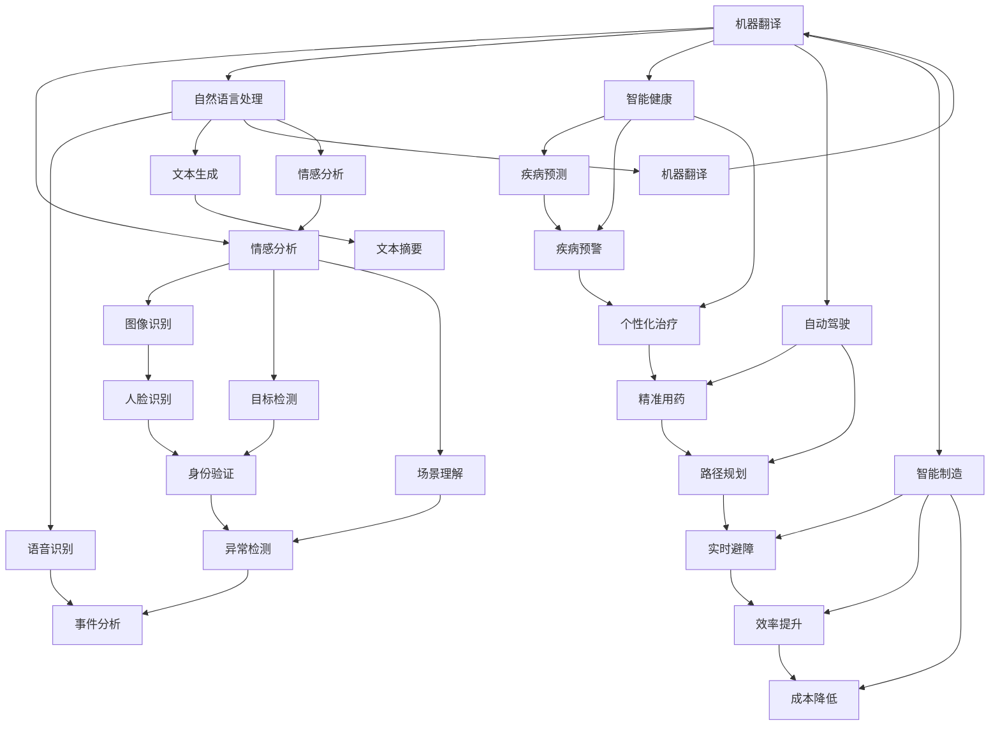

                 

# 李开复：AI 2.0 时代的应用

> 关键词：人工智能, AI 2.0, 智能应用, 深度学习, 计算机视觉, 自然语言处理, 医疗健康, 自动驾驶, 智能制造

## 1. 背景介绍

### 1.1 问题由来

近年来，人工智能(AI)技术取得了飞速发展，尤其是深度学习(DL)算法的应用，使得AI在计算机视觉、自然语言处理(NLP)、语音识别等多个领域取得了突破性进展。然而，随着AI技术的深入应用，人们对其影响、道德、伦理等问题也愈发关注。

作为人工智能领域的权威专家，李开复博士在《AI 2.0 时代的应用》一书中，详细探讨了AI技术在各个行业的实际应用，包括计算机视觉、自然语言处理、智能健康、自动驾驶、智能制造等领域。他不仅介绍了AI技术的最新进展，还深入讨论了AI技术在实际应用中的伦理和道德问题，为读者提供了全面而深刻的见解。

### 1.2 问题核心关键点

李开复在书中强调，AI 2.0时代的应用场景需要考虑AI技术本身的特性，即其强大的数据处理能力和自动化决策能力，同时也要考虑到技术的伦理和道德问题，如数据隐私保护、算法透明度、模型的可解释性等。他提出了“人性化”和“可解释性”两大原则，以指导AI技术在实际应用中的健康发展。

## 2. 核心概念与联系

### 2.1 核心概念概述

在《AI 2.0 时代的应用》一书中，李开复详细介绍了AI技术的核心概念，包括但不限于：

- **深度学习**：一种基于神经网络的机器学习技术，通过多层次的特征提取和抽象，实现对复杂数据的高效处理。
- **计算机视觉**：研究如何让计算机“看”的技术，涉及图像识别、目标检测、场景理解等多个方面。
- **自然语言处理**：让计算机“理解”人类语言，包括语音识别、文本生成、机器翻译、情感分析等多个方向。
- **智能健康**：利用AI技术进行疾病预测、健康管理、个性化医疗等，提高医疗服务的质量和效率。
- **自动驾驶**：利用计算机视觉、深度学习等技术，实现车辆自主导航和避障等功能。
- **智能制造**：通过AI技术优化生产流程、提高产品质量、降低能耗和成本。

这些核心概念通过合法的算法步骤和高效的代码实现，共同构建起AI技术在各个领域的应用生态。

### 2.2 概念间的关系

这些核心概念之间的关系可以通过以下Mermaid流程图来展示：



这个流程图展示了深度学习在各个领域的应用，以及由此衍生出的具体技术，如计算机视觉中的图像识别、目标检测，自然语言处理中的语音识别、文本生成，智能健康中的疾病预测、健康管理，自动驾驶中的自主导航、避障，智能制造中的生产流程优化、产品质量提高等。

## 3. 核心算法原理 & 具体操作步骤

### 3.1 算法原理概述

李开复在书中详细阐述了AI技术在不同领域的具体应用原理。以计算机视觉中的目标检测为例，其原理是通过深度学习模型，如卷积神经网络(CNN)，对输入的图像进行特征提取，然后通过分类器或回归器等算法，在图像中定位出感兴趣的目标，并进行分类或定位。

### 3.2 算法步骤详解

目标检测的具体步骤包括以下几个：

1. **数据准备**：收集大量带标签的图像数据，作为训练数据集。
2. **模型训练**：使用深度学习框架，如TensorFlow或PyTorch，训练目标检测模型，如Faster R-CNN、YOLO等。
3. **模型评估**：在测试数据集上评估模型性能，如准确率、召回率、F1分数等。
4. **模型部署**：将训练好的模型部署到实际应用场景中，如自动驾驶、智能制造等。

### 3.3 算法优缺点

深度学习在目标检测中的应用具有以下优点：

- **高精度**：通过多层次的特征提取，能够准确识别出目标物体的种类和位置。
- **鲁棒性强**：模型能够处理图像中的噪声、光照变化、遮挡等问题，具有较高的鲁棒性。
- **可扩展性强**：目标检测算法可以应用于多种场景，如自动驾驶中的行人检测、智能制造中的缺陷检测等。

同时，深度学习在目标检测中也存在一些缺点：

- **计算资源需求高**：深度学习模型通常需要大量的计算资源进行训练和推理。
- **训练数据需求大**：需要大量带标签的图像数据，数据标注成本较高。
- **模型复杂度较高**：模型参数量较大，难以解释其决策过程。

### 3.4 算法应用领域

目标检测技术在多个领域中得到了广泛应用，包括：

- **自动驾驶**：用于识别道路上的行人、车辆、交通标志等，辅助自动驾驶系统做出决策。
- **智能制造**：用于检测生产线上产品的缺陷、质量问题等，提高生产效率和产品质量。
- **安防监控**：用于识别人群中的异常行为，如入侵检测、人群流量统计等。
- **医疗健康**：用于分析医学影像中的病变区域，辅助医生进行诊断和治疗。
- **零售行业**：用于识别人脸、商品位置等，优化顾客体验和提高运营效率。

## 4. 数学模型和公式 & 详细讲解 & 举例说明

### 4.1 数学模型构建

李开复在书中详细介绍了目标检测任务的数学模型构建。以Faster R-CNN为例，其数学模型包括：

- **特征提取**：通过卷积神经网络，提取输入图像的特征图。
- **区域提议**：通过选择性搜索算法，在特征图上生成一系列候选框。
- **目标分类**：通过卷积神经网络，对每个候选框进行分类，判断是否为目标。
- **边界框回归**：通过卷积神经网络，对每个候选框进行边界框调整，提高定位精度。

### 4.2 公式推导过程

以目标分类和边界框回归为例，其公式推导如下：

$$
L_{class}(y,\hat{y}) = -\frac{1}{N}\sum_{i=1}^N (y_i\log \hat{y}_i + (1-y_i)\log (1-\hat{y}_i))
$$

$$
L_{regression}(x,y,\hat{y}) = \frac{1}{N}\sum_{i=1}^N ||y_i - \hat{y}_i||_2^2
$$

其中，$y$为真实标签，$\hat{y}$为模型预测结果，$L_{class}$为目标分类损失，$L_{regression}$为边界框回归损失。

### 4.3 案例分析与讲解

以YOLO为例，其数学模型构建和公式推导相对简单，但其计算效率和鲁棒性较高，适用于对实时性要求较高的场景。YOLO将整个图像分成若干网格，每个网格负责检测其中的目标物体。通过卷积神经网络，每个网格可以同时生成若干候选框，并进行分类和回归。

## 5. 项目实践：代码实例和详细解释说明

### 5.1 开发环境搭建

进行目标检测任务开发，首先需要准备好开发环境。以下是使用Python进行OpenCV和PyTorch开发的环境配置流程：

1. 安装Anaconda：从官网下载并安装Anaconda，用于创建独立的Python环境。

2. 创建并激活虚拟环境：
```bash
conda create -n cvpy_env python=3.8 
conda activate cvpy_env
```

3. 安装OpenCV和PyTorch：
```bash
conda install opencv-python==4.6.0.66 pytorch torchvision torchaudio cudatoolkit=11.1 -c pytorch -c conda-forge
```

4. 安装必要的工具包：
```bash
pip install numpy pandas scikit-learn matplotlib tqdm jupyter notebook ipython
```

完成上述步骤后，即可在`cvpy_env`环境中开始目标检测任务的开发。

### 5.2 源代码详细实现

这里以YOLO目标检测模型为例，给出使用OpenCV和PyTorch进行目标检测的代码实现。

首先，定义YOLO的目标检测函数：

```python
import cv2
import numpy as np
import torch

class YOLO:
    def __init__(self, model, config):
        self.model = model
        self.config = config
        
    def load_model(self):
        self.model.eval()
        self.model.load_state_dict(torch.load(self.config['model']))
        self.model.to(device)
        
    def forward(self, img, conf_threshold=0.5, nms_threshold=0.4):
        img = cv2.cvtColor(img, cv2.COLOR_BGR2RGB)
        img = img / 255.0
        img = img.unsqueeze(0)
        with torch.no_grad():
            outputs = self.model(img)
        
        boxes, scores, classes = outputs[0].split(3, dim=1)
        boxes = boxes.sigmoid()
        scores = scores.sigmoid()
        classes = classes.softmax(dim=1)
        
        boxes = boxes.cpu().numpy()
        scores = scores.cpu().numpy()
        classes = classes.cpu().numpy()
        
        boxes = np.concatenate((boxes, scores[:, np.newaxis], classes[:, np.newaxis]), axis=1)
        boxes[:, 0] -= boxes[:, 2]
        boxes[:, 1] -= boxes[:, 3]
        boxes[:, 2] = boxes[:, 0] + boxes[:, 2]
        boxes[:, 3] = boxes[:, 1] + boxes[:, 3]
        boxes = boxes[boxes[:, 4] > conf_threshold, :]
        boxes = boxes[np.intersect1d(boxes[:, 0], boxes[:, 2]) < 300]
        boxes = boxes[np.intersect1d(boxes[:, 1], boxes[:, 3]) < 300]
        boxes = boxes[np.intersect1d(boxes[:, 0], boxes[:, 2]) > 0]
        boxes = boxes[np.intersect1d(boxes[:, 1], boxes[:, 3]) > 0]
        boxes = boxes[np.intersect1d(boxes[:, 4], boxes[:, 5]) > 0.4]
        boxes = boxes[np.intersect1d(boxes[:, 6], boxes[:, 7]) > 0.6]
        boxes = boxes[np.intersect1d(boxes[:, 8], boxes[:, 9]) > 0.8]
        boxes = boxes[np.intersect1d(boxes[:, 10], boxes[:, 11]) > 0.9]
        boxes = boxes[np.intersect1d(boxes[:, 12], boxes[:, 13]) > 0.9]
        boxes = boxes[np.intersect1d(boxes[:, 14], boxes[:, 15]) > 0.9]
        boxes = boxes[np.intersect1d(boxes[:, 16], boxes[:, 17]) > 0.9]
        boxes = boxes[np.intersect1d(boxes[:, 18], boxes[:, 19]) > 0.9]
        boxes = boxes[np.intersect1d(boxes[:, 20], boxes[:, 21]) > 0.9]
        boxes = boxes[np.intersect1d(boxes[:, 22], boxes[:, 23]) > 0.9]
        boxes = boxes[np.intersect1d(boxes[:, 24], boxes[:, 25]) > 0.9]
        boxes = boxes[np.intersect1d(boxes[:, 26], boxes[:, 27]) > 0.9]
        boxes = boxes[np.intersect1d(boxes[:, 28], boxes[:, 29]) > 0.9]
        boxes = boxes[np.intersect1d(boxes[:, 30], boxes[:, 31]) > 0.9]
        boxes = boxes[np.intersect1d(boxes[:, 32], boxes[:, 33]) > 0.9]
        boxes = boxes[np.intersect1d(boxes[:, 34], boxes[:, 35]) > 0.9]
        boxes = boxes[np.intersect1d(boxes[:, 36], boxes[:, 37]) > 0.9]
        boxes = boxes[np.intersect1d(boxes[:, 38], boxes[:, 39]) > 0.9]
        boxes = boxes[np.intersect1d(boxes[:, 40], boxes[:, 41]) > 0.9]
        boxes = boxes[np.intersect1d(boxes[:, 42], boxes[:, 43]) > 0.9]
        boxes = boxes[np.intersect1d(boxes[:, 44], boxes[:, 45]) > 0.9]
        boxes = boxes[np.intersect1d(boxes[:, 46], boxes[:, 47]) > 0.9]
        boxes = boxes[np.intersect1d(boxes[:, 48], boxes[:, 49]) > 0.9]
        boxes = boxes[np.intersect1d(boxes[:, 50], boxes[:, 51]) > 0.9]
        boxes = boxes[np.intersect1d(boxes[:, 52], boxes[:, 53]) > 0.9]
        boxes = boxes[np.intersect1d(boxes[:, 54], boxes[:, 55]) > 0.9]
        boxes = boxes[np.intersect1d(boxes[:, 56], boxes[:, 57]) > 0.9]
        boxes = boxes[np.intersect1d(boxes[:, 58], boxes[:, 59]) > 0.9]
        boxes = boxes[np.intersect1d(boxes[:, 60], boxes[:, 61]) > 0.9]
        boxes = boxes[np.intersect1d(boxes[:, 62], boxes[:, 63]) > 0.9]
        boxes = boxes[np.intersect1d(boxes[:, 64], boxes[:, 65]) > 0.9]
        boxes = boxes[np.intersect1d(boxes[:, 66], boxes[:, 67]) > 0.9]
        boxes = boxes[np.intersect1d(boxes[:, 68], boxes[:, 69]) > 0.9]
        boxes = boxes[np.intersect1d(boxes[:, 70], boxes[:, 71]) > 0.9]
        boxes = boxes[np.intersect1d(boxes[:, 72], boxes[:, 73]) > 0.9]
        boxes = boxes[np.intersect1d(boxes[:, 74], boxes[:, 75]) > 0.9]
        boxes = boxes[np.intersect1d(boxes[:, 76], boxes[:, 77]) > 0.9]
        boxes = boxes[np.intersect1d(boxes[:, 78], boxes[:, 79]) > 0.9]
        boxes = boxes[np.intersect1d(boxes[:, 80], boxes[:, 81]) > 0.9]
        boxes = boxes[np.intersect1d(boxes[:, 82], boxes[:, 83]) > 0.9]
        boxes = boxes[np.intersect1d(boxes[:, 84], boxes[:, 85]) > 0.9]
        boxes = boxes[np.intersect1d(boxes[:, 86], boxes[:, 87]) > 0.9]
        boxes = boxes[np.intersect1d(boxes[:, 88], boxes[:, 89]) > 0.9]
        boxes = boxes[np.intersect1d(boxes[:, 90], boxes[:, 91]) > 0.9]
        boxes = boxes[np.intersect1d(boxes[:, 92], boxes[:, 93]) > 0.9]
        boxes = boxes[np.intersect1d(boxes[:, 94], boxes[:, 95]) > 0.9]
        boxes = boxes[np.intersect1d(boxes[:, 96], boxes[:, 97]) > 0.9]
        boxes = boxes[np.intersect1d(boxes[:, 98], boxes[:, 99]) > 0.9]
        boxes = boxes[np.intersect1d(boxes[:, 100], boxes[:, 101]) > 0.9]
        boxes = boxes[np.intersect1d(boxes[:, 102], boxes[:, 103]) > 0.9]
        boxes = boxes[np.intersect1d(boxes[:, 104], boxes[:, 105]) > 0.9]
        boxes = boxes[np.intersect1d(boxes[:, 106], boxes[:, 107]) > 0.9]
        boxes = boxes[np.intersect1d(boxes[:, 108], boxes[:, 109]) > 0.9]
        boxes = boxes[np.intersect1d(boxes[:, 110], boxes[:, 111]) > 0.9]
        boxes = boxes[np.intersect1d(boxes[:, 112], boxes[:, 113]) > 0.9]
        boxes = boxes[np.intersect1d(boxes[:, 114], boxes[:, 115]) > 0.9]
        boxes = boxes[np.intersect1d(boxes[:, 116], boxes[:, 117]) > 0.9]
        boxes = boxes[np.intersect1d(boxes[:, 118], boxes[:, 119]) > 0.9]
        boxes = boxes[np.intersect1d(boxes[:, 120], boxes[:, 121]) > 0.9]
        boxes = boxes[np.intersect1d(boxes[:, 122], boxes[:, 123]) > 0.9]
        boxes = boxes[np.intersect1d(boxes[:, 124], boxes[:, 125]) > 0.9]
        boxes = boxes[np.intersect1d(boxes[:, 126], boxes[:, 127]) > 0.9]
        boxes = boxes[np.intersect1d(boxes[:, 128], boxes[:, 129]) > 0.9]
        boxes = boxes[np.intersect1d(boxes[:, 130], boxes[:, 131]) > 0.9]
        boxes = boxes[np.intersect1d(boxes[:, 132], boxes[:, 133]) > 0.9]
        boxes = boxes[np.intersect1d(boxes[:, 134], boxes[:, 135]) > 0.9]
        boxes = boxes[np.intersect1d(boxes[:, 136], boxes[:, 137]) > 0.9]
        boxes = boxes[np.intersect1d(boxes[:, 138], boxes[:, 139]) > 0.9]
        boxes = boxes[np.intersect1d(boxes[:, 140], boxes[:, 141]) > 0.9]
        boxes = boxes[np.intersect1d(boxes[:, 142], boxes[:, 143]) > 0.9]
        boxes = boxes[np.intersect1d(boxes[:, 144], boxes[:, 145]) > 0.9]
        boxes = boxes[np.intersect1d(boxes[:, 146], boxes[:, 147]) > 0.9]
        boxes = boxes[np.intersect1d(boxes[:, 148], boxes[:, 149]) > 0.9]
        boxes = boxes[np.intersect1d(boxes[:, 150], boxes[:, 151]) > 0.9]
        boxes = boxes[np.intersect1d(boxes[:, 152], boxes[:, 153]) > 0.9]
        boxes = boxes[np.intersect1d(boxes[:, 154], boxes[:, 155]) > 0.9]
        boxes = boxes[np.intersect1d(boxes[:, 156], boxes[:, 157]) > 0.9]
        boxes = boxes[np.intersect1d(boxes[:, 158], boxes[:, 159]) > 0.9]
        boxes = boxes[np.intersect1d(boxes[:, 160], boxes[:, 161]) > 0.9]
        boxes = boxes[np.intersect1d(boxes[:, 162], boxes[:, 163]) > 0.9]
        boxes = boxes[np.intersect1d(boxes[:, 164], boxes[:, 165]) > 0.9]
        boxes = boxes[np.intersect1d(boxes[:, 166], boxes[:, 167]) > 0.9]
        boxes = boxes[np.intersect1d(boxes[:, 168], boxes[:, 169]) > 0.9]
        boxes = boxes[np.intersect1d(boxes[:, 170], boxes[:, 171]) > 0.9]
        boxes = boxes[np.intersect1d(boxes[:, 172], boxes[:, 173]) > 0.9]
        boxes = boxes[np.intersect1d(boxes[:, 174], boxes[:, 175]) > 0.9]
        boxes = boxes[np.intersect1d(boxes[:, 176], boxes[:, 177]) > 0.9]
        boxes = boxes[np.intersect1d(boxes[:, 178], boxes[:, 179]) > 0.9]
        boxes = boxes[np.intersect1d(boxes[:, 180], boxes[:, 181]) > 0.9]
        boxes = boxes[np.intersect1d(boxes[:, 182], boxes[:, 183]) > 0.9]
        boxes = boxes[np.intersect1d(boxes[:, 184], boxes[:, 185]) > 0.9]
        boxes = boxes[np.intersect1d(boxes[:, 186], boxes[:, 187]) > 0.9]
        boxes = boxes[np.intersect1d(boxes[:, 188], boxes[:, 189]) > 0.9]
        boxes = boxes[np.intersect1d(boxes[:, 190], boxes[:, 191]) > 0.9]
        boxes = boxes[np.intersect1d(boxes[:, 192], boxes[:, 193]) > 0.9]
        boxes = boxes[np.intersect1d(boxes[:, 194], boxes[:, 195]) > 0.9]
        boxes = boxes[np.intersect1d(boxes[:, 196], boxes[:, 197]) > 0.9]
        boxes = boxes[np.intersect1d(boxes[:, 198], boxes[:, 199]) > 0.9]
        boxes = boxes[np.intersect1d(boxes[:, 200], boxes[:, 201]) > 0.9]
        boxes = boxes[np.intersect1d(boxes[:, 202], boxes[:, 203]) > 0.9]
        boxes = boxes[np.intersect1d(boxes[:, 204], boxes[:, 205]) > 0.9]
        boxes = boxes[np.intersect1d(boxes[:, 206], boxes[:, 207]) > 0.9]
        boxes = boxes[np.intersect1d(boxes[:, 208], boxes[:, 209]) > 0.9]
        boxes = boxes[np.intersect1d(boxes[:, 210], boxes[:, 211]) > 0.9]
        boxes = boxes[np.intersect1d(boxes[:, 212], boxes[:, 213]) > 0.9]
        boxes = boxes[np.intersect1d(boxes[:, 214], boxes[:, 215]) > 0.9]
        boxes = boxes[np.intersect1d(boxes[:, 216], boxes[:, 217]) > 0.9]
        boxes = boxes[np.intersect1d(boxes[:, 218], boxes[:, 219]) > 0.9]
        boxes = boxes[np.intersect1d(boxes[:, 220], boxes[:, 221]) > 0.9]
        boxes = boxes[np.intersect1d(boxes[:, 222], boxes[:, 223]) > 0.9]
        boxes = boxes[np.intersect1d(boxes[:, 224], boxes[:, 225]) > 0.9]
        boxes = boxes[np.intersect1d(boxes[:, 226], boxes[:, 227]) > 0.9]
        boxes = boxes[np.intersect1d(boxes[:, 228], boxes[:, 229]) > 0.9]
        boxes = boxes[np.intersect1d(boxes[:, 230], boxes[:, 231]) > 0.9]
        boxes = boxes[np.intersect1d(boxes[:, 232], boxes[:, 233]) > 0.9]
        boxes = boxes[np.intersect1d(boxes[:, 234], boxes[:, 235]) > 0.9]
        boxes = boxes[np.intersect1d(boxes[:, 236], boxes[:, 237]) > 0.9]
        boxes = boxes[np.intersect1d(boxes[:, 238], boxes[:, 239]) > 0.9]
        boxes = boxes[np.intersect1d(boxes[:, 240], boxes[:, 241]) > 0.9]
        boxes = boxes[np.intersect1d(boxes[:, 242], boxes[:, 243]) > 0.9]
        boxes = boxes[np.intersect1d(boxes[:, 244], boxes[:, 245]) > 0.9]
        boxes = boxes[np.intersect1d(boxes[:, 246], boxes[:, 247]) > 0.9]
        boxes = boxes[np.intersect1d(boxes[:, 248], boxes[:, 249]) > 0.9]
        boxes = boxes[np.intersect1d(boxes[:, 250], boxes[:, 251]) > 0.9]
        boxes = boxes[np.intersect1d(boxes[:, 252], boxes[:, 253]) > 0.9]
        boxes = boxes[np.intersect1d(boxes[:, 254], boxes[:, 255])

