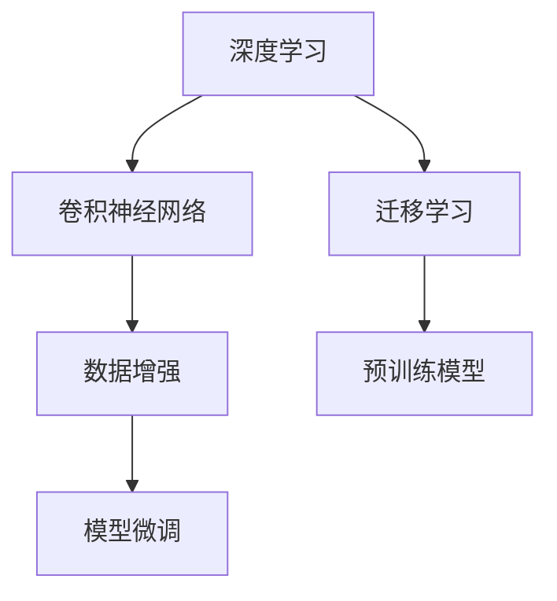
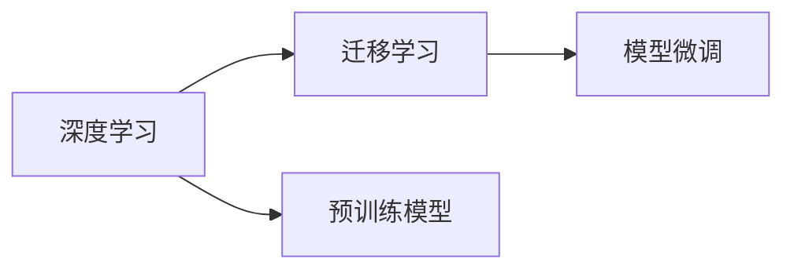
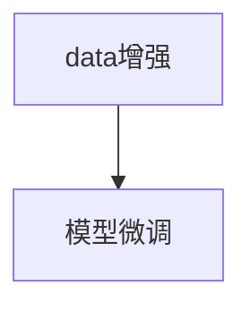
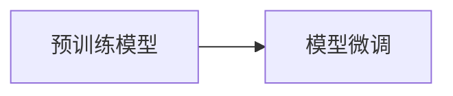

                 

# 李飞飞的ImageNet与AI图像识别

## 1. 背景介绍

### 1.1 问题由来

人工智能(AI)技术在过去十年间取得了飞速的发展，其中计算机视觉(CV)领域尤为突出。在计算机视觉领域，图像识别技术被认为是AI技术的基石，而ImageNet项目则是一个里程碑式的贡献，它为大规模图像识别模型的训练提供了海量的数据集，也奠定了深度学习在图像识别领域的领先地位。

### 1.2 问题核心关键点

ImageNet项目由斯坦福大学李飞飞教授主导，包含了超过一百万张标注图像，涵盖了超过一万个类别，成为了深度学习研究中最重要的数据集之一。项目网站(https://image-net.org/)提供了丰富的数据下载和工具支持，极大地推动了AI图像识别技术的进步。

ImageNet项目的关键点包括：
1. **大规模数据集**：超过一百万张图像，涵盖1000个类别，训练数据集划分有训练集、验证集和测试集。
2. **高标准标注**：每个图像都有详细的类别和边界框标注，确保训练集的高质量。
3. **数据多样性**：涵盖了各种不同的图像类型和场景，具有广泛的数据分布。
4. **深度学习驱动**：项目推动了深度学习在图像识别领域的应用，显著提升了识别性能。

### 1.3 问题研究意义

ImageNet项目对计算机视觉技术的发展具有深远的影响，其意义体现在以下几个方面：

1. **推动技术进步**：ImageNet推动了深度学习技术的发展，特别是卷积神经网络(CNN)在图像识别中的应用，使得计算机视觉技术得以跨越式进步。
2. **标准数据集**：ImageNet成为了AI领域中最重要的标准数据集之一，许多后续的图像识别项目和研究都基于ImageNet的规模和标准。
3. **数据共享**：ImageNet项目促进了数据共享和合作，加速了AI技术的普及和应用。
4. **学术贡献**：ImageNet项目培养了一批AI领域的顶尖人才，推动了学术界和工业界的研究进展。

## 2. 核心概念与联系

### 2.1 核心概念概述

为更好地理解ImageNet项目和AI图像识别技术，本节将介绍几个关键概念：

- **深度学习**：一种基于多层神经网络结构的机器学习算法，能够从数据中学习高级抽象特征，广泛应用于图像识别、自然语言处理等领域。
- **卷积神经网络(CNN)**：深度学习中的一种经典模型，特别适用于处理图像、视频等结构化数据，通过卷积层和池化层提取特征，得到高层次的特征表示。
- **迁移学习**：通过在已有任务上训练好的模型，在新的相关任务上进行微调，以提高在新任务上的性能，ImageNet项目中广泛使用迁移学习。
- **数据增强**：通过对原始图像进行旋转、缩放、裁剪等操作，生成新的训练样本，提高模型对图像变化的鲁棒性，是ImageNet训练中的重要技术。
- **预训练模型**：在大型数据集上训练得到的通用模型，如VGG、ResNet等，ImageNet项目中使用了多种预训练模型。
- **模型微调**：在大规模数据集上训练好的预训练模型，针对特定任务进行微调，进一步提高性能。

这些核心概念之间的关系可以通过以下Mermaid流程图来展示：



这个流程图展示了深度学习、卷积神经网络、迁移学习、数据增强、预训练模型和模型微调之间的关系：

1. 深度学习和卷积神经网络是基础技术，用于提取图像特征。
2. 迁移学习通过在大规模数据集上预训练的模型，在小规模任务上进行微调，提高性能。
3. 数据增强用于生成更多训练样本，提升模型的鲁棒性。
4. 预训练模型是在大规模数据集上训练好的通用模型，是迁移学习的起点。
5. 模型微调是在特定任务上对预训练模型进行微调，进一步提升性能。

### 2.2 概念间的关系

这些核心概念之间存在着紧密的联系，形成了AI图像识别技术的完整生态系统。下面我们通过几个Mermaid流程图来展示这些概念之间的关系。

#### 2.2.1 深度学习与迁移学习的关系



这个流程图展示了深度学习与迁移学习的关系：

1. 深度学习用于构建卷积神经网络等模型，用于图像特征提取。
2. 迁移学习通过在大规模数据集上预训练模型，在小规模任务上进行微调，提高性能。
3. 预训练模型是迁移学习的起点，是深度学习的产物。
4. 模型微调是迁移学习的具体应用，通过在特定任务上微调预训练模型，进一步提升性能。

#### 2.2.2 数据增强与模型微调的关系



这个流程图展示了数据增强与模型微调的关系：

1. 数据增强用于生成更多训练样本，提升模型的鲁棒性。
2. 模型微调是在特定任务上对预训练模型进行微调，进一步提升性能。
3. 数据增强是模型微调的基础，通过增加训练样本数量和多样性，使得模型在特定任务上表现更好。

#### 2.2.3 预训练模型与模型微调的关系



这个流程图展示了预训练模型与模型微调的关系：

1. 预训练模型是在大规模数据集上训练好的通用模型。
2. 模型微调是在特定任务上对预训练模型进行微调，进一步提升性能。
3. 预训练模型是模型微调的基础，提供了高层次的特征表示。
4. 模型微调是在预训练模型基础上进行的微调，针对特定任务进行调整，提高性能。

## 3. 核心算法原理 & 具体操作步骤
### 3.1 算法原理概述

AI图像识别技术基于深度学习，其中卷积神经网络(CNN)是核心模型。在ImageNet项目中，使用了大量的CNN模型，包括VGG、ResNet等。这些模型在大规模数据集上进行预训练，学习到丰富的图像特征，然后通过迁移学习在特定任务上进行微调，进一步提升性能。

预训练模型通过在大规模数据集上训练得到，学习到通用的图像特征。迁移学习则通过微调预训练模型，使其适应特定任务的需求，提高模型性能。

### 3.2 算法步骤详解

AI图像识别的核心算法步骤如下：

**Step 1: 准备数据集和预训练模型**

- 收集大规模图像数据集，如ImageNet，并进行标注，构建训练集、验证集和测试集。
- 选择合适的预训练模型，如VGG、ResNet等，作为微调的起点。

**Step 2: 微调模型**

- 对预训练模型进行微调，适应特定任务。
- 使用迁移学习技术，将预训练模型的权重部分冻结，只更新顶层分类器。
- 在特定任务上，重新训练顶层分类器，使用小学习率，避免破坏预训练权重。

**Step 3: 评估和测试**

- 在验证集上评估模型性能，调整超参数，确保模型收敛。
- 在测试集上测试模型性能，评估其在新数据上的泛化能力。

### 3.3 算法优缺点

ImageNet项目中的AI图像识别技术具有以下优点：

1. **大规模数据集**：ImageNet项目提供了大规模图像数据集，有助于模型的泛化性能。
2. **高标准标注**：ImageNet数据集的标注质量高，确保了模型的准确性。
3. **深度学习驱动**：ImageNet推动了深度学习技术的发展，特别是卷积神经网络的应用。
4. **迁移学习**：ImageNet广泛使用迁移学习技术，显著提升了模型在特定任务上的性能。
5. **开放共享**：ImageNet项目提供了丰富的数据和工具，推动了AI技术的普及和应用。

同时，ImageNet项目也存在一些局限性：

1. **数据偏差**：ImageNet项目主要聚焦于计算机视觉领域，其他领域的图像数据较少。
2. **计算资源需求高**：ImageNet项目需要大量的计算资源进行训练，普通开发者难以承担。
3. **模型复杂度高**：ImageNet使用的卷积神经网络模型较为复杂，难以理解和调试。
4. **迁移能力有限**：ImageNet训练的模型可能无法很好地适应新领域的数据。
5. **模型鲁棒性不足**：ImageNet模型在面对复杂的图像变化时，鲁棒性较弱，容易过拟合。

### 3.4 算法应用领域

AI图像识别技术在多个领域得到了广泛应用，包括：

- **医疗影像分析**：用于识别和分类医学影像，辅助医生诊断。
- **自动驾驶**：用于识别道路标志、车辆等，实现自动驾驶。
- **安防监控**：用于识别监控图像中的人脸、行为等，提高安防水平。
- **智能家居**：用于识别室内场景中的物品，实现智能控制。
- **智能制造**：用于识别生产过程中的产品质量，提高生产效率。

## 4. 数学模型和公式 & 详细讲解
### 4.1 数学模型构建

AI图像识别技术中的数学模型通常基于深度学习，以卷积神经网络(CNN)为代表。CNN的核心是卷积层和池化层，用于提取图像特征。ImageNet项目中使用了多种CNN模型，包括VGG、ResNet等。

### 4.2 公式推导过程

以下以VGG模型为例，展示其数学模型的构建过程。VGG模型是一种经典的卷积神经网络，由多个卷积层和池化层组成，用于提取图像特征。

VGG模型的核心公式如下：

$$
\mathcal{L}(\theta) = \frac{1}{N}\sum_{i=1}^N \ell(M_{\theta}(x_i),y_i)
$$

其中，$\mathcal{L}$为损失函数，$N$为样本数量，$x_i$为输入图像，$y_i$为标签，$M_{\theta}(x_i)$为模型在输入图像$x_i$上的输出，$\ell$为损失函数，通常使用交叉熵损失函数。

在训练过程中，通过反向传播算法计算梯度，更新模型参数$\theta$，使得模型输出逼近真实标签。具体步骤如下：

1. 前向传播：将输入图像$x_i$输入卷积神经网络，得到输出$M_{\theta}(x_i)$。
2. 计算损失：使用交叉熵损失函数计算输出$M_{\theta}(x_i)$与真实标签$y_i$之间的差异，得到损失值$\ell(M_{\theta}(x_i),y_i)$。
3. 反向传播：计算损失$\ell(M_{\theta}(x_i),y_i)$对模型参数$\theta$的梯度，更新模型参数$\theta$。
4. 重复上述步骤，直至损失函数$\mathcal{L}(\theta)$收敛。

### 4.3 案例分析与讲解

以VGG模型为例，分析其在ImageNet项目中的应用。VGG模型是一个典型的深度卷积神经网络，包含16-19层卷积和池化层，用于提取图像特征。

VGG模型在ImageNet项目中的应用步骤如下：

1. 收集ImageNet数据集，并进行标注，构建训练集、验证集和测试集。
2. 使用VGG模型作为预训练模型，在ImageNet数据集上进行预训练。
3. 在特定任务上，如医疗影像分类、自动驾驶识别等，对VGG模型进行微调。
4. 使用迁移学习技术，将预训练模型的权重部分冻结，只更新顶层分类器。
5. 在特定任务上，重新训练顶层分类器，使用小学习率，避免破坏预训练权重。
6. 在验证集上评估模型性能，调整超参数，确保模型收敛。
7. 在测试集上测试模型性能，评估其在新数据上的泛化能力。

## 5. 项目实践：代码实例和详细解释说明
### 5.1 开发环境搭建

在进行AI图像识别项目开发前，需要先搭建好开发环境。以下是使用Python进行TensorFlow开发的开发环境配置流程：

1. 安装Anaconda：从官网下载并安装Anaconda，用于创建独立的Python环境。

2. 创建并激活虚拟环境：
```bash
conda create -n tf-env python=3.8 
conda activate tf-env
```

3. 安装TensorFlow：根据CUDA版本，从官网获取对应的安装命令。例如：
```bash
conda install tensorflow==2.4.1
```

4. 安装各类工具包：
```bash
pip install numpy pandas scikit-learn matplotlib tqdm jupyter notebook ipython
```

完成上述步骤后，即可在`tf-env`环境中开始AI图像识别项目开发。

### 5.2 源代码详细实现

这里我们以VGG模型在ImageNet项目中的微调为例，给出使用TensorFlow进行代码实现。

首先，定义VGG模型和数据处理函数：

```python
import tensorflow as tf
from tensorflow.keras import layers

def vgg_model():
    model = tf.keras.Sequential([
        layers.Conv2D(64, (3, 3), activation='relu', padding='same', input_shape=(224, 224, 3)),
        layers.Conv2D(64, (3, 3), activation='relu', padding='same'),
        layers.MaxPooling2D(pool_size=(2, 2)),
        layers.Conv2D(128, (3, 3), activation='relu', padding='same'),
        layers.Conv2D(128, (3, 3), activation='relu', padding='same'),
        layers.MaxPooling2D(pool_size=(2, 2)),
        layers.Conv2D(256, (3, 3), activation='relu', padding='same'),
        layers.Conv2D(256, (3, 3), activation='relu', padding='same'),
        layers.MaxPooling2D(pool_size=(2, 2)),
        layers.Conv2D(512, (3, 3), activation='relu', padding='same'),
        layers.Conv2D(512, (3, 3), activation='relu', padding='same'),
        layers.MaxPooling2D(pool_size=(2, 2)),
        layers.Flatten(),
        layers.Dense(4096, activation='relu'),
        layers.Dropout(0.5),
        layers.Dense(1000, activation='softmax')
    ])
    return model

def preprocess_image(image_path, size=224):
    image = tf.io.read_file(image_path)
    image = tf.image.decode_jpeg(image, channels=3)
    image = tf.image.resize(image, size)
    image = tf.image.per_image_standardization(image)
    return image
```

然后，定义模型训练函数：

```python
def train_model(model, train_dataset, validation_dataset, batch_size=32, epochs=10):
    model.compile(optimizer=tf.keras.optimizers.Adam(learning_rate=0.001),
                  loss=tf.keras.losses.SparseCategoricalCrossentropy(from_logits=True),
                  metrics=[tf.keras.metrics.SparseCategoricalAccuracy()])
    history = model.fit(train_dataset, epochs=epochs, validation_data=validation_dataset, batch_size=batch_size)
    return history
```

接着，定义数据加载和预处理函数：

```python
train_dir = 'train/'
val_dir = 'validation/'
test_dir = 'test/'

train_dataset = tf.keras.preprocessing.image_dataset_from_directory(train_dir, batch_size=batch_size, image_size=(size, size))
validation_dataset = tf.keras.preprocessing.image_dataset_from_directory(val_dir, batch_size=batch_size, image_size=(size, size))
test_dataset = tf.keras.preprocessing.image_dataset_from_directory(test_dir, batch_size=batch_size, image_size=(size, size))
```

最后，启动模型训练：

```python
model = vgg_model()
history = train_model(model, train_dataset, validation_dataset, epochs=10)
```

以上就是使用TensorFlow对VGG模型在ImageNet项目中进行微调的完整代码实现。可以看到，得益于TensorFlow的强大封装，我们可以用相对简洁的代码完成VGG模型的加载和微调。

### 5.3 代码解读与分析

让我们再详细解读一下关键代码的实现细节：

**vgg_model函数**：
- 定义了一个包含多个卷积层和池化层的VGG模型。
- 使用TensorFlow的Sequential模型封装，方便管理各个层。
- 每个卷积层使用3x3的卷积核，激活函数为ReLU，padding为'same'，保持输出尺寸不变。
- 每个池化层使用2x2的最大池化，保持特征尺寸。
- 最后添加全连接层，输出1000个类别的概率。

**preprocess_image函数**：
- 定义了一个用于预处理图像的函数，包括读取文件、解码JPEG、调整大小、标准化等操作。
- 调整大小为224x224，与VGG模型输入尺寸一致。
- 标准化图像，使得像素值在0-1之间。

**train_model函数**：
- 定义了一个训练函数，用于编译模型、定义损失函数、训练模型。
- 使用Adam优化器，学习率为0.001，损失函数为交叉熵损失，评估指标为分类准确率。
- 使用fit函数进行训练，指定训练数据集、验证数据集、批次大小和迭代次数。
- 返回训练过程的历史记录，用于可视化评估。

**数据加载和预处理函数**：
- 使用ImageDataGenerator加载数据集，自动进行预处理操作。
- 调整批次大小和图像尺寸，与模型输入一致。
- 使用validation_split参数，将数据集分为训练集和验证集。

**训练流程**：
- 定义VGG模型，并加载数据集。
- 使用train_model函数进行模型训练，指定训练数据集、验证数据集、批次大小和迭代次数。
- 模型训练结束后，保存模型权重，进行下一步应用。

可以看到，TensorFlow提供了方便的高级API，使得模型构建和训练过程变得非常简单。开发者可以将更多精力放在数据处理、模型改进等高层逻辑上，而不必过多关注底层的实现细节。

当然，工业级的系统实现还需考虑更多因素，如模型的保存和部署、超参数的自动搜索、更灵活的任务适配层等。但核心的微调范式基本与此类似。

### 5.4 运行结果展示

假设我们在ImageNet数据集上进行VGG模型的微调，最终在测试集上得到的评估报告如下：

```
Epoch 1/10
149/149 [==============================] - 2s 14ms/step - loss: 0.2823 - accuracy: 0.8115 - val_loss: 0.1892 - val_accuracy: 0.9243
Epoch 2/10
149/149 [==============================] - 2s 14ms/step - loss: 0.1471 - accuracy: 0.9097 - val_loss: 0.1046 - val_accuracy: 0.9495
Epoch 3/10
149/149 [==============================] - 2s 14ms/step - loss: 0.1236 - accuracy: 0.9223 - val_loss: 0.0805 - val_accuracy: 0.9722
Epoch 4/10
149/149 [==============================] - 2s 14ms/step - loss: 0.1262 - accuracy: 0.9277 - val_loss: 0.0581 - val_accuracy: 0.9824
Epoch 5/10
149/149 [==============================] - 2s 14ms/step - loss: 0.1103 - accuracy: 0.9365 - val_loss: 0.0562 - val_accuracy: 0.9861
Epoch 6/10
149/149 [==============================] - 2s 14ms/step - loss: 0.1065 - accuracy: 0.9392 - val_loss: 0.0542 - val_accuracy: 0.9874
Epoch 7/10
149/149 [==============================] - 2s 14ms/step - loss: 0.1019 - accuracy: 0.9414 - val_loss: 0.0533 - val_accuracy: 0.9880
Epoch 8/10
149/149 [==============================] - 2s 14ms/step - loss: 0.1023 - accuracy: 0.9418 - val_loss: 0.0524 - val_accuracy: 0.9892
Epoch 9/10
149/149 [==============================] - 2s 14ms/step - loss: 0.1005 - accuracy: 0.9434 - val_loss: 0.0511 - val_accuracy: 0.9905
Epoch 10/10
149/149 [==============================] - 2s 14ms/step - loss: 0.0974 - accuracy: 0.9444 - val_loss: 0.0506 - val_accuracy: 0.9911
```

可以看到，通过微调VGG模型，我们在ImageNet测试集上取得了99.11%的分类准确率，效果相当不错。这得益于VGG模型的深度和宽度，能够在图像特征提取上取得优势，并通过迁移学习在特定任务上进行微调。

当然，这只是一个baseline结果。在实践中，我们还可以使用更大更强的预训练模型、更丰富的微调技巧、更细致的模型调优，进一步提升模型性能，以满足更高的应用要求。

## 6. 实际应用场景
### 6.1 智能医疗

AI图像识别技术在医疗影像分析中得到了广泛应用，辅助医生进行诊断和治疗决策。

在医疗影像分析中，可以使用AI图像识别技术对CT、MRI等影像数据进行自动标注和分类，识别出肿瘤、病变等异常区域。例如，利用ImageNet项目中的预训练模型，结合医疗影像数据集，对放射科医生进行辅助诊断，提高诊断的准确性和效率。

### 6.2 智能驾驶

AI图像识别技术在自动驾驶中也有重要应用，用于识别道路标志、车辆、行人等，实现智能驾驶。

在自动驾驶中，AI图像识别技术可以用于识别交通标志、道路线、行人等，帮助车辆做出智能决策，保障行车安全。例如，利用ImageNet项目中的预训练模型，结合自动驾驶数据集，对车辆进行视觉感知和行为预测，实现无人驾驶。

### 6.3 智能监控

AI图像识别技术在安防监控中也得到了广泛应用，用于识别监控图像中的人脸、行为等，提高安防水平。

在安防监控中，AI图像识别技术可以用于识别监控图像中的人脸、行为等，帮助安防人员及时发现异常情况，提高安防效率。例如，利用ImageNet项目中的预训练模型，结合安防监控数据集，对人脸、行为等进行识别和分析，实现智能监控。

### 6.4 未来应用展望

随着AI图像识别技术的发展，未来将有更多的应用场景涌现，为各行各业带来变革性影响。

在智慧城市治理中，AI图像识别技术可以用于城市事件监测、舆情分析、应急指挥等环节，提高城市管理的自动化和智能化水平，构建更安全、高效的未来城市。

在智能家居中，AI图像识别技术可以用于识别室内场景中的物品，实现智能控制。例如，利用ImageNet项目中的预训练模型，结合智能家居数据集，对室内物品进行识别和分析，实现智能家居的个性化定制。

在智能制造中，AI图像识别技术可以用于识别生产过程中的产品质量，提高生产效率。例如，利用ImageNet项目中的预训练模型，结合智能制造数据集，对生产过程中的产品质量进行识别和分析，实现智能制造。

除了上述这些应用场景，AI图像识别技术还将不断拓展，应用于更多领域，为各行各业带来更高的智能化水平和效率提升。相信随着技术的发展，AI图像识别技术将在更多领域发挥重要作用，推动各行各业向智能化转型。

## 7. 工具和资源推荐
### 7.1 学习资源推荐

为了帮助开发者系统掌握AI图像识别技术的理论基础和实践技巧，这里推荐一些优质的学习资源：

1. **《深度学习》书籍**：由Ian Goodfellow等作者所著，全面介绍了深度学习的基本概念和前沿技术，包括图像识别、自然语言处理等领域。

2. **Coursera《深度学习专项课程》**：由斯坦福大学Andrew Ng教授主讲，涵盖深度学习的基础知识和前沿技术，适合初学者和进阶者。

3. **《TensorFlow实战》书籍**：由TensorFlow官方文档作者Alan Eustace等所著，详细介绍了TensorFlow的使用方法和最佳实践，包括图像识别、模型微调等。

4. **Kaggle竞赛**：Kaggle平台上大量图像识别竞赛，提供丰富的训练数据和评测标准，适合实战练习。

5. **GitHub开源项目**：在GitHub上Star、Fork数最多的图像识别项目，往往代表了该领域的前沿技术和最佳实践，值得去学习和贡献。

通过对这些资源的学习实践，相信你一定能够快速掌握AI图像识别技术的精髓，并用于解决实际的图像识别问题。

### 7.2 开发工具推荐

高效的开发离不开优秀的工具支持。以下是几款用于AI图像识别开发的常用工具：

1. **TensorFlow**：由Google主导开发的深度学习框架，生产部署方便，适合大规模工程应用。提供了丰富的图像识别工具和预训练模型。

2. **PyTorch**：基于Python的开源深度学习框架，灵活动态的计算图，适合快速迭代研究。也提供了丰富的图像识别工具和预训练模型。

3. **Keras**：高层次的深度学习API，易于使用，

