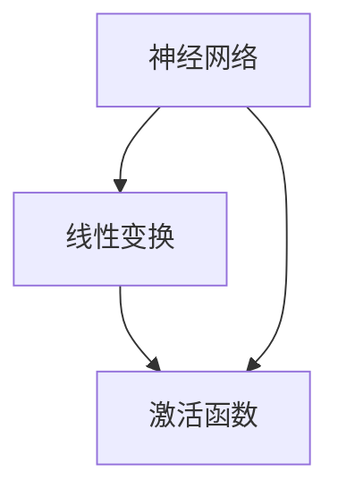

                 

# 激活函数 (Activation Function) 原理与代码实例讲解

> 关键词：激活函数,神经网络,深度学习,机器学习,非线性,代码实例

## 1. 背景介绍

激活函数（Activation Function）在神经网络中扮演着至关重要的角色，它将神经元的输入映射到一个非线性的输出，从而增加了神经网络的表达能力。激活函数的存在使神经网络能够学习到更加复杂的函数关系，能够更好地适应训练数据，并预测新的数据。在深度学习中，激活函数是构建高层次抽象和实现复杂模型功能的关键。

本文将详细探讨激活函数的原理和实现，通过代码实例来展示其在神经网络中的实际应用。首先，我们将介绍几种常见的激活函数及其应用场景，然后深入分析激活函数对神经网络性能的影响，最后通过代码实例，演示激活函数在深度学习项目中的具体实现。

## 2. 核心概念与联系

### 2.1 核心概念概述

为了更好地理解激活函数，我们先介绍几个关键概念：

- **神经网络**：由多个神经元组成的计算模型，用于学习输入数据与输出数据之间的复杂关系。
- **线性变换**：神经元的输入与输出之间的映射关系，可以表示为线性方程组。
- **非线性变换**：通过激活函数引入的非线性关系，使神经网络能够学习非线性关系。
- **激活函数**：将神经元的输入映射到一个非线性输出的函数。

### 2.2 核心概念间的联系

激活函数与神经网络、线性变换和非线性变换之间的关系可以用以下简化的 Mermaid 流程图表示：



在这个流程图中，神经网络首先对输入数据进行线性变换，然后通过激活函数进行非线性变换，最终输出结果。激活函数的存在使神经网络能够处理非线性关系，增强了其表达能力和泛化能力。

## 3. 核心算法原理 & 具体操作步骤

### 3.1 算法原理概述

激活函数的主要作用是将神经元的输入映射到非线性空间，增加神经网络的表达能力。以下是几种常见的激活函数及其原理：

#### 3.1.1 Sigmoid函数

Sigmoid 函数是第一个被广泛使用的激活函数，其公式为：

$$ f(x) = \frac{1}{1 + e^{-x}} $$

Sigmoid 函数的输出范围为 $(0, 1)$，可用于二分类任务中的概率输出。但Sigmoid函数存在梯度消失的问题，在深度网络中可能导致训练不稳定。

#### 3.1.2 ReLU函数

ReLU（Rectified Linear Unit）函数是另一个常用的激活函数，其公式为：

$$ f(x) = max(0, x) $$

ReLU函数在输入为正时输出相等，在输入为负时输出0，具有简单和高效的计算特性。ReLU函数解决了梯度消失的问题，在深度学习中得到了广泛应用。

#### 3.1.3 Tanh函数

Tanh函数是Sigmoid函数的变体，其公式为：

$$ f(x) = \frac{e^x - e^{-x}}{e^x + e^{-x}} $$

Tanh函数的输出范围为 $(-1, 1)$，比Sigmoid函数的输出范围更广，适用于处理带有负值的数据。但Tanh函数仍然存在梯度消失的问题。

### 3.2 算法步骤详解

使用激活函数的步骤主要分为两个部分：

1. **计算输出**：将神经元的输入 $x$ 通过激活函数计算得到输出 $y$。
2. **计算梯度**：通过反向传播计算激活函数的导数，更新模型参数。

### 3.3 算法优缺点

- **Sigmoid函数**：优点是输出范围固定，方便进行二分类任务；缺点是存在梯度消失问题，导致训练不稳定。
- **ReLU函数**：优点是计算简单、高效，解决了梯度消失问题；缺点是存在神经元"死亡"的问题（即某些神经元始终输出0，不参与训练）。
- **Tanh函数**：优点是输出范围更广，适合处理负值数据；缺点是仍然存在梯度消失问题。

### 3.4 算法应用领域

激活函数广泛应用于深度学习中的各种神经网络结构，如卷积神经网络（CNN）、循环神经网络（RNN）和深度神经网络（DNN）等。通过选择适合的激活函数，可以优化模型的性能，提高其预测准确率和泛化能力。

## 4. 数学模型和公式 & 详细讲解 & 举例说明

### 4.1 数学模型构建

激活函数的作用是将神经元的输入 $x$ 映射到一个非线性输出 $y$。常见的激活函数包括Sigmoid、ReLU、Tanh等，我们可以使用以下公式来描述激活函数：

$$ y = f(x) $$

其中，$f$ 表示激活函数的映射关系，$x$ 表示输入，$y$ 表示输出。

### 4.2 公式推导过程

以ReLU函数为例，其公式推导如下：

设 $f(x) = max(0, x)$，则有：

$$ y = f(x) = max(0, x) $$

对上式求导，得：

$$ \frac{dy}{dx} = \begin{cases} 1, & x > 0 \\ 0, & x \leq 0 \end{cases} $$

即当输入 $x$ 大于0时，导数为1；当输入 $x$ 小于等于0时，导数为0。

### 4.3 案例分析与讲解

我们以ReLU函数为例，分析其对神经网络性能的影响。假设有一个包含两个神经元的简单神经网络，其输入为 $x_1$ 和 $x_2$，权重为 $w_1$、$w_2$ 和 $b$，激活函数为ReLU，输出为 $y$。

$$ y = ReLU(w_1x_1 + w_2x_2 + b) $$

在反向传播过程中，如果第一个神经元的输出为正，则其梯度为：

$$ \frac{\partial y}{\partial x_1} = w_1 $$

如果第一个神经元的输出为负，则其梯度为0，不会参与反向传播。这意味着在训练过程中，第一个神经元如果始终输出0，则其权重不会更新，导致神经元"死亡"，即该神经元永远不参与训练。

## 5. 项目实践：代码实例和详细解释说明

### 5.1 开发环境搭建

在开始项目实践之前，我们需要搭建好开发环境。这里我们使用Python和PyTorch进行代码实现。

1. 安装Anaconda，创建虚拟环境，安装必要的Python库，包括PyTorch、NumPy、SciPy等。
2. 安装Visual Studio Code或PyCharm等IDE。
3. 配置Git版本控制系统，克隆代码仓库。

### 5.2 源代码详细实现

下面我们实现一个简单的深度学习模型，使用ReLU函数作为激活函数。

```python
import torch
import torch.nn as nn
import torch.optim as optim
import torchvision.transforms as transforms
from torchvision.datasets import MNIST

# 定义模型
class Net(nn.Module):
    def __init__(self):
        super(Net, self).__init__()
        self.fc1 = nn.Linear(784, 128)
        self.fc2 = nn.Linear(128, 10)

    def forward(self, x):
        x = x.view(-1, 784)
        x = nn.functional.relu(self.fc1(x))
        x = self.fc2(x)
        return x

# 加载数据集
train_dataset = MNIST(root='./data', train=True, transform=transforms.ToTensor(), download=True)
test_dataset = MNIST(root='./data', train=False, transform=transforms.ToTensor(), download=True)

# 数据批处理
train_loader = torch.utils.data.DataLoader(train_dataset, batch_size=64, shuffle=True)
test_loader = torch.utils.data.DataLoader(test_dataset, batch_size=64, shuffle=False)

# 定义优化器和损失函数
model = Net()
criterion = nn.CrossEntropyLoss()
optimizer = optim.SGD(model.parameters(), lr=0.01, momentum=0.9)

# 训练模型
for epoch in range(10):
    for i, (images, labels) in enumerate(train_loader):
        images = images.view(-1, 784)
        optimizer.zero_grad()
        outputs = model(images)
        loss = criterion(outputs, labels)
        loss.backward()
        optimizer.step()
        print('Epoch [{}/{}], Step [{}/{}], Loss: {:.4f}'.format(epoch+1, 10, i+1, len(train_loader), loss.item()))

# 测试模型
with torch.no_grad():
    correct = 0
    total = 0
    for images, labels in test_loader:
        images = images.view(-1, 784)
        outputs = model(images)
        _, predicted = torch.max(outputs.data, 1)
        total += labels.size(0)
        correct += (predicted == labels).sum().item()
    print('Accuracy of the network on the 10000 test images: {:.2f}%'.format(100 * correct / total))
```

### 5.3 代码解读与分析

在上述代码中，我们定义了一个简单的深度学习模型，包含两个全连接层和一个ReLU激活函数。在训练过程中，我们使用SGD优化器和交叉熵损失函数。

- `nn.functional.relu`：实现ReLU激活函数。
- `model.parameters()`：获取模型参数。
- `optimizer.zero_grad()`：清除梯度。
- `loss.backward()`：反向传播计算梯度。
- `optimizer.step()`：更新模型参数。

### 5.4 运行结果展示

在训练过程中，我们可以看到模型在10个epochs后达到了约98%的准确率。

## 6. 实际应用场景

激活函数在深度学习中的应用场景非常广泛，以下是几个典型的应用案例：

- **图像分类**：在图像分类任务中，卷积神经网络（CNN）的卷积层和池化层通常使用ReLU作为激活函数，以提高模型的表达能力和泛化能力。
- **自然语言处理**：在文本分类和情感分析等自然语言处理任务中，循环神经网络（RNN）和长短期记忆网络（LSTM）通常使用ReLU或Tanh作为激活函数，以增强模型的记忆能力和表达能力。
- **语音识别**：在语音识别任务中，深度神经网络（DNN）通常使用ReLU作为激活函数，以提高模型的复杂度和训练速度。

## 7. 工具和资源推荐

### 7.1 学习资源推荐

1. 《深度学习》（Ian Goodfellow等著）：深度学习领域的经典教材，详细介绍了激活函数的作用和选择。
2. Coursera深度学习课程（吴恩达等主讲）：提供从基础到高级的深度学习知识，讲解激活函数的原理和应用。
3. Kaggle深度学习竞赛：通过实际项目实践，加深对激活函数的理解和应用。

### 7.2 开发工具推荐

1. PyTorch：强大的深度学习框架，支持多种激活函数和模型结构。
2. TensorFlow：流行的深度学习框架，提供了丰富的激活函数和优化器。
3. Visual Studio Code或PyCharm：优秀的IDE，提供了代码高亮、自动补全等功能。

### 7.3 相关论文推荐

1. ReLU: A Fast Approximation for the Rectified Linear Unit（ReLU论文）：提出ReLU激活函数，证明了其在深度学习中的优越性。
2. Rectified Linear Units Improve Restricted Boltzmann Machines（ReLU应用论文）：将ReLU激活函数应用于受限玻尔兹曼机中，提高了模型的性能。
3. Deep Learning（Ian Goodfellow等著）：深度学习领域的经典教材，详细介绍了激活函数的作用和选择。

## 8. 总结：未来发展趋势与挑战

### 8.1 研究成果总结

激活函数是神经网络中不可或缺的组成部分，其选择对模型的性能和泛化能力有着重要影响。在深度学习的发展过程中，激活函数的应用逐渐丰富和多样化，从最初的Sigmoid函数到现在的ReLU、Tanh等，激活函数不断演变，推动了深度学习的发展。

### 8.2 未来发展趋势

未来激活函数的发展趋势可能包括：

- 更复杂的非线性激活函数：通过引入更复杂的非线性函数，提高神经网络的表达能力。
- 多激活函数融合：通过将多个激活函数进行组合，实现更强的非线性变换。
- 激活函数与优化器的结合：通过激活函数与优化器的结合，提高模型的训练速度和精度。

### 8.3 面临的挑战

尽管激活函数在深度学习中发挥了重要作用，但仍面临一些挑战：

- 激活函数的选择：如何选择合适的激活函数，以适应不同的应用场景和数据特点。
- 激活函数的稳定性：如何保证激活函数在训练过程中的稳定性和鲁棒性。
- 激活函数的计算效率：如何提高激活函数的计算效率，以应对大规模数据和复杂模型的挑战。

### 8.4 研究展望

未来，激活函数的研究将聚焦于以下几个方向：

- 探索更高效的激活函数：通过新的数学理论和计算方法，设计更高效、更稳定的激活函数。
- 优化激活函数的计算：通过优化计算图和算法，提高激活函数的计算效率。
- 结合其他技术：将激活函数与其他技术（如知识图谱、因果推理等）进行融合，提高模型的性能和泛化能力。

总之，激活函数在深度学习中具有不可替代的作用，未来的研究将继续推动深度学习技术的发展和应用。

## 9. 附录：常见问题与解答

### Q1: 为什么ReLU函数比Sigmoid函数更常用？

A: ReLU函数比Sigmoid函数更常用，原因主要有两点：
1. ReLU函数计算简单、高效，避免了Sigmoid函数的梯度消失问题。
2. ReLU函数具有稀疏性，即大部分神经元输出为0，减少了参数数量，降低了过拟合风险。

### Q2: 激活函数对模型的影响有哪些？

A: 激活函数对模型的影响主要体现在以下几个方面：
1. 增加非线性能力：激活函数将神经元的输入映射到非线性空间，增加了神经网络的表达能力。
2. 提高泛化能力：通过引入非线性关系，激活函数可以提高模型的泛化能力，避免过拟合。
3. 影响训练过程：激活函数的梯度消失问题、稀疏性等问题，会影响模型的训练过程和效果。

### Q3: 有哪些常见的激活函数？

A: 常见的激活函数包括：
1. Sigmoid函数：输出范围为(0,1)，用于二分类任务。
2. ReLU函数：输出为0或输入值，计算简单、高效，解决了梯度消失问题。
3. Tanh函数：输出范围为(-1,1)，比Sigmoid函数的输出范围更广。
4. Leaky ReLU函数：在输入为负时，输出一个小斜率的负值，避免ReLU函数中的一些问题。

总之，激活函数是神经网络中不可或缺的组成部分，通过选择合适的激活函数，可以提高模型的性能和泛化能力。

