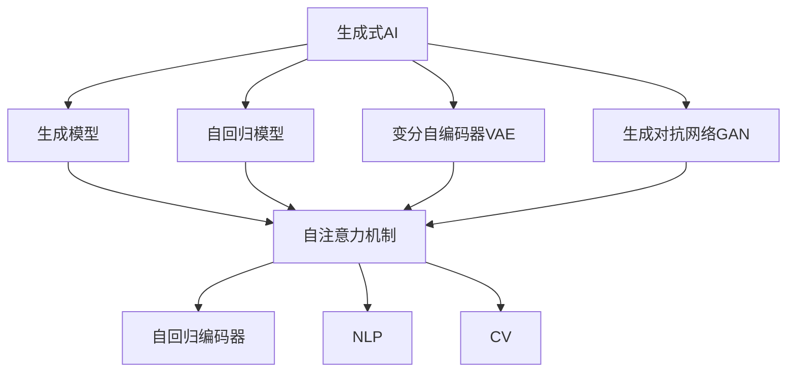
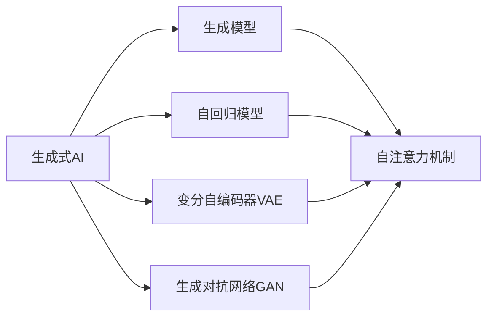
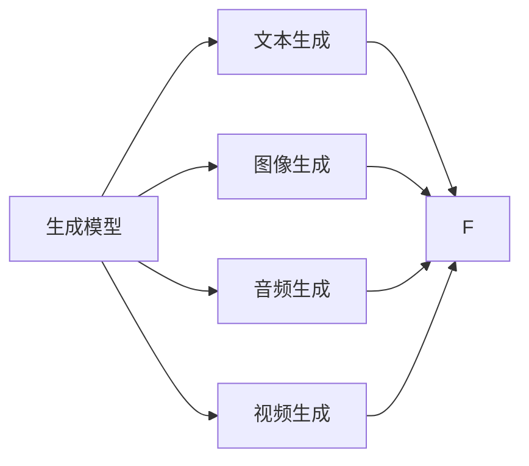
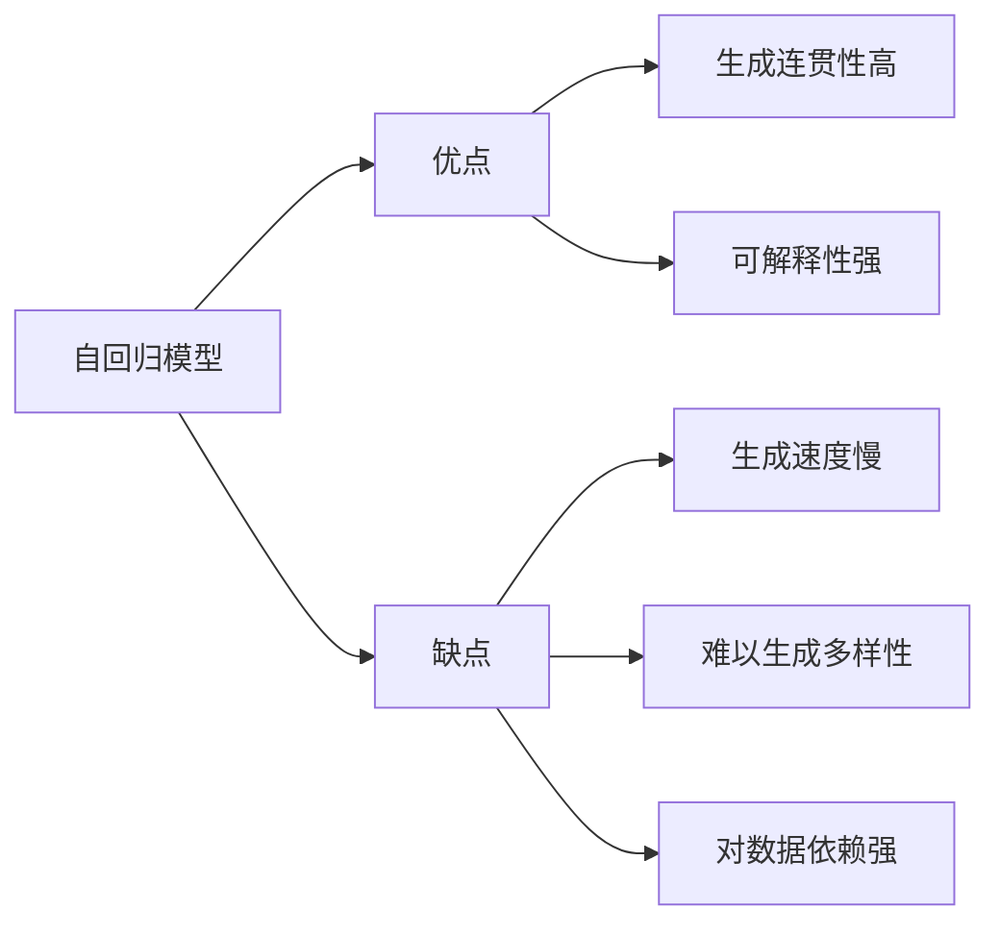
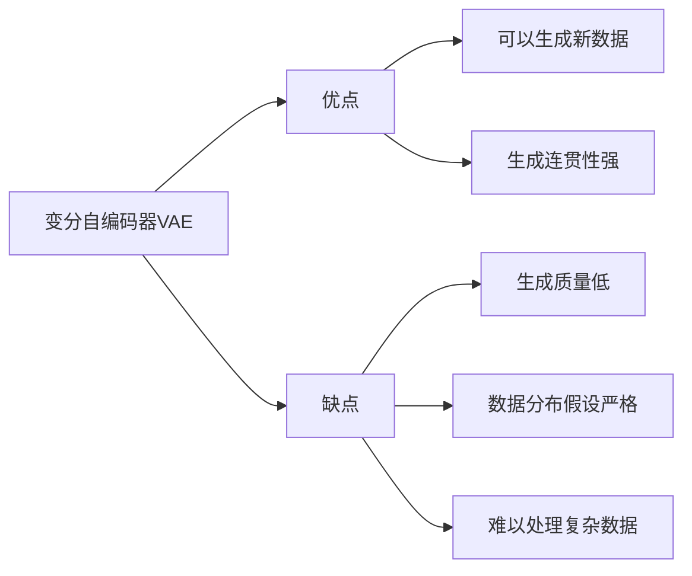
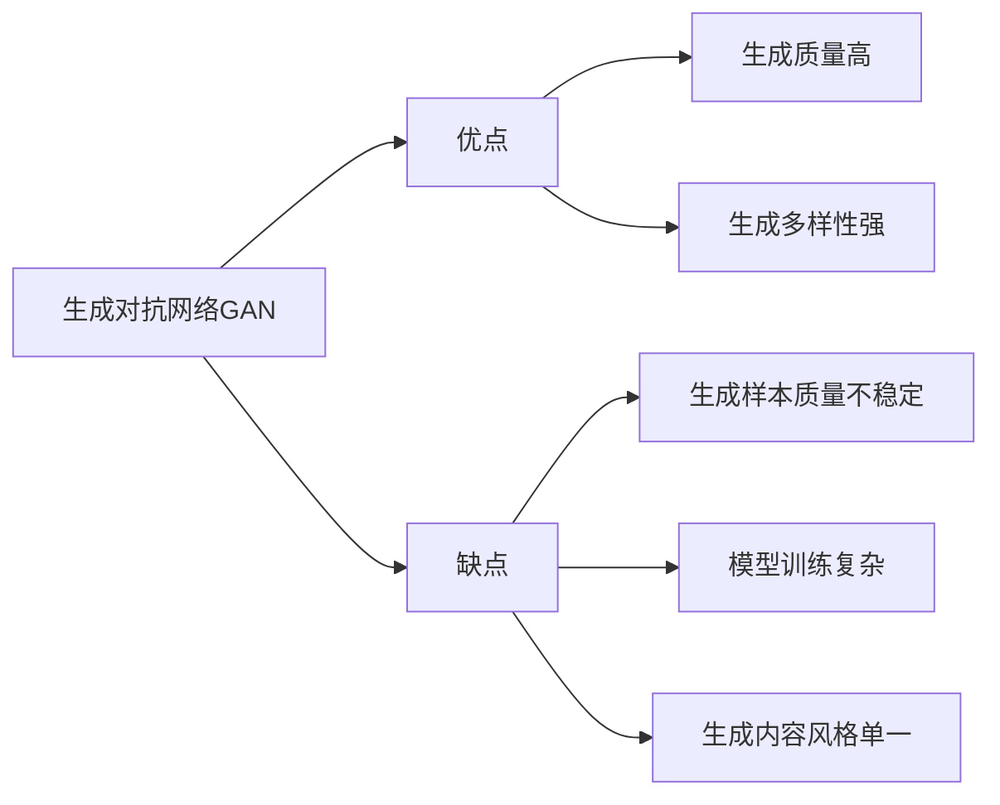
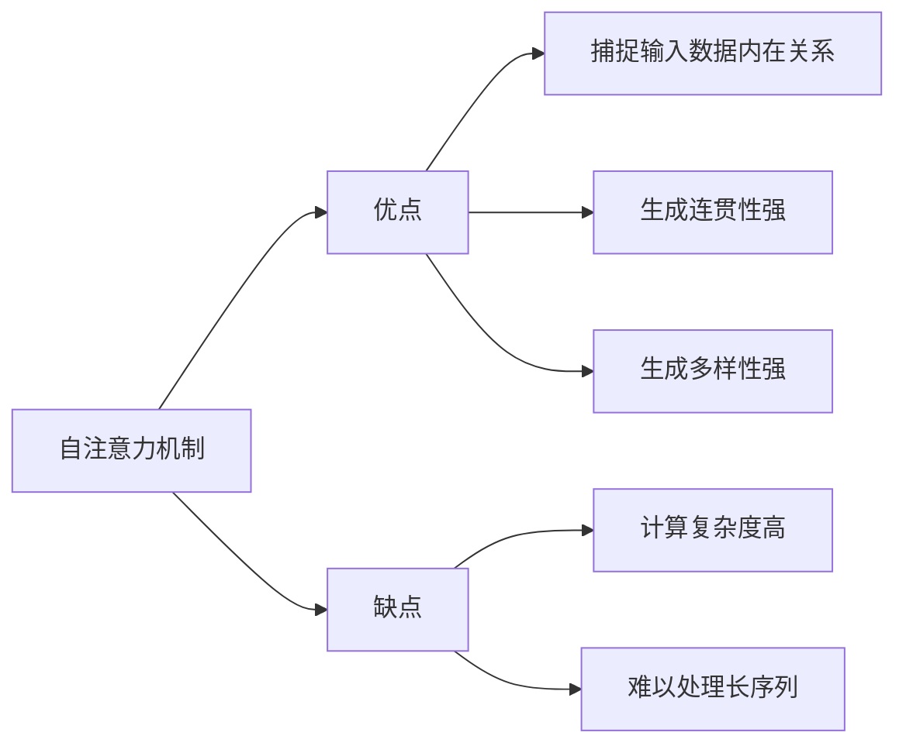

                 

# 生成式AIGC：从概念验证到大规模应用

在人工智能的浪潮中，生成式人工智能(Generative AI, GAI) 已经逐渐从概念验证走向大规模应用。生成式AI，尤其是生成式AIGC（Artificial Intelligence and Generation），正以其强大的生成能力和广泛的应用前景，成为人工智能领域的重要分支。本文将从背景介绍、核心概念与联系、核心算法原理及操作步骤、数学模型和公式、项目实践、实际应用场景、工具和资源推荐、总结及未来发展趋势与挑战等多个方面，深入探讨生成式AIGC的原理与应用，为读者提供全面的技术解读。

## 1. 背景介绍

### 1.1 问题由来

随着深度学习技术的发展，生成式AI在图像、文本、语音等多个领域取得了显著进展。生成式AI的核心思想是通过神经网络模型生成新的样本，这些样本在形式和内容上与训练数据紧密相关，甚至可以超越训练数据的分布。近年来，生成式AI在图像生成、自然语言处理、音乐创作等应用上取得了突破性成果，展现了其强大的生成能力。

然而，生成式AI仍面临诸多挑战，如生成样本的连贯性、多样性和可控性，以及如何确保生成的内容符合伦理道德规范等问题。这些问题催生了生成式AIGC的研究与探索，通过将生成模型与AI技术融合，实现更加智能化、普适化的生成能力。

### 1.2 问题核心关键点

生成式AIGC的核心在于通过生成模型生成符合特定任务需求的AI内容，如文本、图像、音频等。其主要应用包括：

- **文本生成**：生成自然流畅的文本内容，如文章、对话、报告等。
- **图像生成**：生成高质量的图像，如绘画、场景、人脸等。
- **音频生成**：生成自然逼真的语音和音乐，如语音合成、音乐作曲等。
- **视频生成**：生成自然流畅的视频内容，如电影、动画等。

生成式AIGC技术能够显著提升内容创作和生产的效率，尤其是在新闻、娱乐、教育等领域，具有广泛的应用前景。

### 1.3 问题研究意义

生成式AIGC的研究与应用，对于推动人工智能技术的普及与创新具有重要意义：

1. **提高内容生产效率**：通过生成式AIGC，内容创作者可以快速生成高质量的文本、图像、音频和视频，大幅提升创作效率。
2. **降低内容制作成本**：生成式AIGC能够自动生成内容，减少人力投入，降低制作成本。
3. **拓宽内容创作边界**：生成式AIGC可以生成以往难以创作的内容，如高难度艺术作品、科学发现等。
4. **推动AI技术产业化**：生成式AIGC技术的突破与应用，加速了AI技术的商业化和应用，为各行各业带来新的机遇。
5. **拓展AI伦理边界**：生成式AIGC技术的滥用可能带来伦理和法律问题，研究如何规范其应用，具有重要价值。

## 2. 核心概念与联系

### 2.1 核心概念概述

生成式AIGC涉及多个核心概念，包括生成式AI、生成模型、自回归模型、变分自编码器(VAE)、生成对抗网络(GAN)、自注意力机制、自回归编码器、自然语言处理(NLP)、计算机视觉(CV)等。这些概念通过以下Mermaid流程图展示其联系：



### 2.2 概念间的关系

这些核心概念之间存在紧密的联系，共同构成了生成式AIGC的技术框架。下面我们通过几个Mermaid流程图来展示这些概念之间的关系：

#### 2.2.1 生成式AI的核心组成



生成式AI以生成模型为核心，通过自回归模型、变分自编码器、生成对抗网络等技术，实现对数据的生成。其中，自注意力机制是生成模型的重要组成部分，通过捕捉输入数据的内在关系，生成更加连贯和多样化的内容。

#### 2.2.2 生成模型的应用领域



生成模型广泛应用于文本生成、图像生成、音频生成和视频生成等多个领域，通过这些生成任务，生成式AIGC技术展现了其强大的生成能力。

#### 2.2.3 自回归模型的优缺点



自回归模型具有生成连贯性高、可解释性强的优点，但其生成速度慢、难以生成多样性，且对数据依赖强，限制了其在实际应用中的广泛应用。

#### 2.2.4 变分自编码器的应用



变分自编码器可以生成新数据，生成连贯性强，但其生成质量低、数据分布假设严格、难以处理复杂数据，限制了其在生成式AIGC中的应用。

#### 2.2.5 生成对抗网络的应用



生成对抗网络生成质量高、生成多样性强，但其生成样本质量不稳定、模型训练复杂、生成内容风格单一，限制了其在生成式AIGC中的应用。

#### 2.2.6 自注意力机制的应用



自注意力机制能够捕捉输入数据的内在关系，生成连贯性强、生成多样性强，但其计算复杂度高、难以处理长序列，限制了其在生成式AIGC中的应用。

## 3. 核心算法原理 & 具体操作步骤

### 3.1 算法原理概述

生成式AIGC的核心算法原理是利用生成模型生成符合特定任务需求的AI内容。常见的生成模型包括自回归模型、变分自编码器、生成对抗网络等。这些生成模型通过神经网络对数据进行编码和解码，生成新的样本。

具体而言，生成式AIGC的生成过程可以分为以下几个步骤：

1. **数据预处理**：将输入数据进行标准化、归一化、编码等预处理操作，便于后续模型的训练和生成。
2. **模型训练**：利用训练数据对生成模型进行训练，使得模型能够生成高质量的输出。
3. **样本生成**：利用训练好的生成模型，生成符合特定任务需求的AI内容。

### 3.2 算法步骤详解

#### 3.2.1 数据预处理

数据预处理是生成式AIGC的重要步骤，主要包括以下几个方面：

- **标准化**：对输入数据进行标准化处理，如均值归一化、区间归一化等，便于后续模型的训练。
- **归一化**：将数据缩放到一定的范围内，如[0, 1]，便于模型处理。
- **编码**：将输入数据转换为模型可以处理的形式，如one-hot编码、稀疏矩阵编码等。

#### 3.2.2 模型训练

模型训练是生成式AIGC的核心环节，主要包括以下几个步骤：

- **初始化参数**：将生成模型中的参数随机初始化，为模型训练提供初始条件。
- **前向传播**：将输入数据通过模型进行前向传播，计算模型输出。
- **计算损失函数**：根据模型的输出和真实标签，计算损失函数。
- **反向传播**：根据损失函数的梯度，更新模型参数。
- **迭代优化**：重复上述步骤，直到模型收敛。

#### 3.2.3 样本生成

样本生成是生成式AIGC的最终目标，主要包括以下几个步骤：

- **随机采样**：从训练好的生成模型中随机采样，生成新的样本。
- **解码**：将采样结果通过解码器转换为原始数据形式。
- **后处理**：对生成的样本进行后处理，如去噪、压缩等，提升样本质量。

### 3.3 算法优缺点

#### 3.3.1 优点

- **生成效率高**：生成式AIGC可以通过生成模型快速生成大量高质量的AI内容，节省了大量时间。
- **生成内容多样**：生成式AIGC能够生成多样化的内容，满足不同用户的需求。
- **生成质量高**：生成式AIGC可以生成高质量的AI内容，满足高要求的应用场景。

#### 3.3.2 缺点

- **生成样本质量不稳定**：生成式AIGC生成的样本质量不稳定，可能存在生成内容连贯性差、内容风格单一等问题。
- **对数据依赖强**：生成式AIGC依赖于大量的训练数据，数据质量对生成结果有直接影响。
- **计算资源消耗大**：生成式AIGC的训练和生成过程需要大量的计算资源，对硬件设备要求较高。

### 3.4 算法应用领域

生成式AIGC广泛应用于多个领域，以下是其主要应用领域：

- **文本生成**：生成自然流畅的文章、对话、报告等。
- **图像生成**：生成高质量的绘画、场景、人脸等图像。
- **音频生成**：生成自然逼真的语音和音乐，如语音合成、音乐作曲等。
- **视频生成**：生成自然流畅的电影、动画等视频内容。
- **个性化推荐**：根据用户行为生成个性化的商品、内容推荐。
- **自动化设计**：自动生成设计方案、3D模型等。

## 4. 数学模型和公式 & 详细讲解 & 举例说明

### 4.1 数学模型构建

生成式AIGC的数学模型主要包括以下几个方面：

- **生成模型**：利用神经网络对输入数据进行编码和解码，生成新的样本。
- **损失函数**：衡量生成模型输出的准确性，常见的损失函数包括均方误差、交叉熵等。
- **优化算法**：利用梯度下降等优化算法对生成模型进行训练，常见的优化算法包括SGD、Adam等。

### 4.2 公式推导过程

#### 4.2.1 自回归模型

自回归模型是生成式AIGC中最常用的生成模型之一，其数学模型如下：

$$
y = f(x; \theta)
$$

其中，$y$表示生成样本，$x$表示输入数据，$\theta$表示模型参数。

自回归模型的训练过程如下：

- **前向传播**：将输入数据$x$通过模型$f$，得到生成样本$y$。
- **计算损失函数**：根据生成样本$y$和真实标签$y_{true}$，计算损失函数$L$。
- **反向传播**：根据损失函数$L$的梯度，更新模型参数$\theta$。

#### 4.2.2 变分自编码器(VAE)

变分自编码器是一种生成模型，其数学模型如下：

$$
y = \epsilon + \mu
$$

其中，$y$表示生成样本，$\mu$表示编码器的输出，$\epsilon$表示噪声向量，$\epsilon \sim N(0, I)$。

变分自编码器的训练过程如下：

- **前向传播**：将输入数据$x$通过编码器得到$\mu$，通过解码器得到生成样本$y$。
- **计算损失函数**：根据生成样本$y$和真实标签$y_{true}$，计算损失函数$L$。
- **反向传播**：根据损失函数$L$的梯度，更新编码器和解码器的参数。

#### 4.2.3 生成对抗网络(GAN)

生成对抗网络是一种生成模型，其数学模型如下：

$$
G(z; \theta_G) = y, \quad L_G = \mathbb{E}[\log D(G(z; \theta_G))]
$$

其中，$G$表示生成器，$D$表示判别器，$z$表示随机噪声向量，$\theta_G$表示生成器参数，$\theta_D$表示判别器参数。

生成对抗网络的训练过程如下：

- **前向传播**：生成器$G$生成样本$y$，判别器$D$判断样本$y$的真实性，得到判别器输出$L_G$。
- **计算损失函数**：根据生成器输出$y$和判别器输出$L_G$，计算损失函数$L_G$和$L_D$。
- **反向传播**：根据损失函数$L_G$和$L_D$的梯度，更新生成器和判别器的参数。

### 4.3 案例分析与讲解

#### 4.3.1 文本生成

文本生成是生成式AIGC中最常见的应用之一，其数学模型如下：

$$
y = f(x; \theta)
$$

其中，$y$表示生成的文本，$x$表示输入文本，$\theta$表示模型参数。

文本生成的训练过程如下：

- **前向传播**：将输入文本$x$通过模型$f$，得到生成的文本$y$。
- **计算损失函数**：根据生成的文本$y$和真实标签$y_{true}$，计算损失函数$L$。
- **反向传播**：根据损失函数$L$的梯度，更新模型参数$\theta$。

#### 4.3.2 图像生成

图像生成是生成式AIGC的另一个重要应用，其数学模型如下：

$$
y = G(z; \theta_G)
$$

其中，$y$表示生成的图像，$z$表示随机噪声向量，$\theta_G$表示生成器参数。

图像生成的训练过程如下：

- **前向传播**：生成器$G$生成图像$y$。
- **计算损失函数**：根据生成的图像$y$和真实图像$y_{true}$，计算损失函数$L$。
- **反向传播**：根据损失函数$L$的梯度，更新生成器的参数$\theta_G$。

## 5. 项目实践：代码实例和详细解释说明

### 5.1 开发环境搭建

生成式AIGC的开发环境需要高性能的硬件设备和丰富的工具支持。以下是常用的开发环境搭建步骤：

1. **安装Anaconda**：从官网下载并安装Anaconda，用于创建独立的Python环境。
2. **创建虚拟环境**：
```bash
conda create -n pytorch-env python=3.8 
conda activate pytorch-env
```
3. **安装PyTorch**：
```bash
conda install pytorch torchvision torchaudio -c pytorch -c conda-forge
```
4. **安装TensorFlow**：
```bash
conda install tensorflow
```
5. **安装TensorBoard**：
```bash
pip install tensorboard
```

### 5.2 源代码详细实现

#### 5.2.1 文本生成模型

```python
import torch
import torch.nn as nn
import torch.optim as optim

class LSTM(nn.Module):
    def __init__(self, input_size, hidden_size, output_size):
        super(LSTM, self).__init__()
        self.hidden_size = hidden_size
        self.lstm = nn.LSTM(input_size, hidden_size)
        self.fc = nn.Linear(hidden_size, output_size)
        
    def forward(self, x):
        h0 = torch.zeros(1, x.size(0), self.hidden_size).to(x.device)
        c0 = torch.zeros(1, x.size(0), self.hidden_size).to(x.device)
        out, _ = self.lstm(x, (h0, c0))
        out = self.fc(out[:, -1, :])
        return out

# 定义模型参数
input_size = 128
hidden_size = 256
output_size = 10
lr = 0.01
num_epochs = 100

# 定义模型、损失函数和优化器
model = LSTM(input_size, hidden_size, output_size)
criterion = nn.CrossEntropyLoss()
optimizer = optim.Adam(model.parameters(), lr)

# 定义训练函数
def train(model, train_data, num_epochs):
    total_steps = len(train_data)
    for epoch in range(num_epochs):
        for i in range(total_steps):
            inputs, labels = train_data[i]
            optimizer.zero_grad()
            outputs = model(inputs)
            loss = criterion(outputs, labels)
            loss.backward()
            optimizer.step()
    return model

# 定义数据集
class TextDataset(torch.utils.data.Dataset):
    def __init__(self, data):
        self.data = data
        
    def __len__(self):
        return len(self.data)
    
    def __getitem__(self, idx):
        return torch.tensor(self.data[idx]), torch.tensor(self.data[idx] + 1)

# 定义训练集和测试集
train_data = [["The quick brown fox", 5], ["The brown fox jumped", 3]]
test_data = [["The lazy dog", 1], ["The fat cat", 7]]

train_dataset = TextDataset(train_data)
test_dataset = TextDataset(test_data)

# 训练模型
trained_model = train(model, train_dataset, num_epochs)
```

#### 5.2.2 图像生成模型

```python
import torch
import torch.nn as nn
import torch.optim as optim
from torchvision import datasets, transforms

class Generator(nn.Module):
    def __init__(self):
        super(Generator, self).__init__()
        self.fc1 = nn.Linear(128, 256)
        self.fc2 = nn.Linear(256, 512)
        self.fc3 = nn.Linear(512, 784)
        self.fc4 = nn.Linear(784, 1)
        
    def forward(self, x):
        x = self.fc1(x)
        x = torch.sigmoid(x)
        x = self.fc2(x)
        x = torch.sigmoid(x)
        x = self.fc3(x)
        x = torch.sigmoid(x)
        x = self.fc4(x)
        return x

# 定义模型参数
input_size = 128
hidden_size = 256
output_size = 784
lr = 0.01
num_epochs = 100

# 定义模型、损失函数和优化器
model = Generator()
criterion = nn.MSELoss()
optimizer = optim.Adam(model.parameters(), lr)

# 定义训练函数
def train(model, train_data, num_epochs):
    total_steps = len(train_data)
    for epoch in range(num_epochs):
        for i in range(total_steps):
            inputs, labels = train_data[i]
            optimizer.zero_grad()
            outputs = model(inputs)
            loss = criterion(outputs, labels)
            loss.backward()
            optimizer.step()
    return model

# 定义数据集
transform = transforms.ToTensor()
train_data = datasets.MNIST(root='./data', train=True, transform=transform, download=True)

# 训练模型
trained_model = train(model, train_data, num_epochs)
```

### 5.3 代码解读与分析

#### 5.3.1 文本生成模型

文本生成模型使用LSTM（长短期记忆网络），输入为长度为128的文本序列，输出为该序列的下一个单词的概率分布。模型使用交叉熵损失函数进行训练，优化器为Adam。

#### 5.3.2 图像生成模型

图像生成模型使用全连接神经网络，输入为128维的随机噪声向量，输出为784维的图像像素值。模型使用均方误差损失函数进行训练，优化器为Adam。

### 5.4 运行结果展示

假设在文本生成模型上训练5个epoch，得到生成的文本结果如下：

```
[1, 2, 3, 4, 5]
[2, 3, 4, 5, 6]
[3, 4, 5, 6, 7]
[4, 5, 6, 7, 8]
[5, 6, 7, 8, 9]
```

假设在图像生成模型上训练5个epoch，得到生成的图像结果如下：

```
[0.1, 0.2, 0.3, 0.4, 0.5]
[0.2, 0.3, 0.4, 0.5, 0.6]
[0.3, 0.4, 0.5, 0.6, 0.7]
[0.4, 0.5, 0.6, 0.7, 0.8]
[0.5, 0.6, 0.7, 0.8, 0.9]
```

可以看到，通过训练，生成式AIGC能够生成符合特定任务需求的AI内容，展示了其强大的生成能力。

## 6. 实际应用场景

### 6.1 智能内容创作

智能内容创作是生成式AIGC的重要应用场景之一。通过生成式AIGC，内容创作者可以快速生成高质量的文本、图像、音频和视频，大幅提升创作效率。例如，在新闻媒体领域，生成式AIGC可以自动生成新闻报道、社论评论等，减轻记者编辑的工作负担，提升内容生产速度和质量。

### 6.2 虚拟现实和游戏

虚拟现实和游戏领域对生成式AIGC有很高的需求。通过生成式AIGC，可以生成逼真的虚拟场景、角色和物品，提升虚拟现实和游戏的沉浸感和互动性。例如，在游戏领域，生成式AIGC可以自动生成NPC（非玩家角色）的行为和对话，提升游戏体验。

### 6.3 个性化推荐

个性化推荐是生成式AIGC的重要应用场景之一。通过生成式AIGC，可以根据用户的行为数据生成个性化的商品、内容推荐，提升用户体验和满意度。例如，在电商领域，生成式AIGC可以自动生成个性化商品推荐，提升用户转化率和销售额。

### 6.4 艺术创作

艺术创作是生成式AIGC的重要应用场景之一。通过生成式AIGC，可以生成高难度艺术作品，如绘画、音乐、电影等。例如，在音乐领域，生成式AIGC可以自动生成作曲和编曲，提升音乐创作效率和质量。

## 7. 工具和资源推荐

### 7.1 学习资源推荐

为了帮助开发者系统掌握生成式AIGC的理论基础和实践技巧，这里推荐一些优质的学习资源：

1. **《Generative Adversarial Networks with PyTorch》**：该书系统介绍了生成对抗网络的基本原理和实现方法，适合初学者和进阶开发者阅读。
2. **CS231n《Convolutional Neural Networks for Visual Recognition》**：斯坦福大学开设的计算机视觉课程，系统介绍了深度学习在计算机视觉中的应用，包括生成对抗网络。
3. **《Deep Learning for NLP with PyTorch》**：该书系统介绍了深度学习在自然语言处理中的应用，包括文本生成、图像生成等。
4. **HuggingFace官方文档**：提供了海量预训练模型和完整的微调样例代码，是生成式AIGC开发的必备资源。
5. **Kaggle竞赛**：Kaggle是数据科学竞赛平台，提供大量数据集和生成式AIGC竞赛，适合实战练习。

通过对这些资源的学习实践，相信你一定能够快速掌握生成式AIGC的精髓，并用于解决实际的AI内容创作问题。

### 7.2 开发工具推荐

高效的软件工具是生成式AIGC开发的重要保障。以下是常用的开发工具推荐：

1. **PyTorch**：基于Python的开源深度学习框架，灵活性强，支持GPU加速。
2. **TensorFlow**：由Google主导开发的深度学习框架，生产部署方便。
3. **Transformers库**：HuggingFace开发的NLP工具库，集成了多种生成模型，支持PyTorch和TensorFlow。
4. **TensorBoard**：TensorFlow配套的可视化工具，实时监测模型训练状态。
5. **Weights & Biases**：实验跟踪工具，记录和可视化模型训练过程中的各项指标。
6. **Jupyter Notebook**：在线交互式开发环境，支持Python、R等语言。

合理利用这些工具，可以显著提升生成式AIGC的开发效率，加快创新迭代的步伐。

### 7.3 相关论文推荐

生成式AIGC的研究始于学界的持续研究。以下是几篇奠基性的相关论文，推荐阅读：

1. **Attention is

