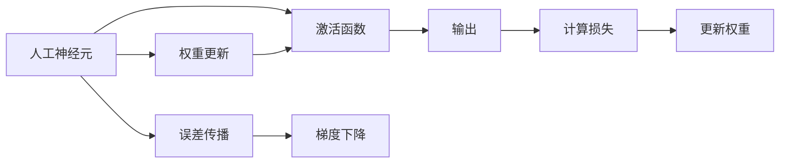

                 

# 神经网络：人类智慧的延伸

> 关键词：神经网络,深度学习,人工神经元,反向传播,激活函数,权重更新,误差传播,反向传播算法,梯度下降,人工神经网络,深度学习,反向传播算法

## 1. 背景介绍

### 1.1 问题由来

深度学习（Deep Learning），作为21世纪人工智能领域的一场革命，正在以惊人的速度重塑我们对于计算的理解。其核心技术——神经网络，通过层层叠叠的人工神经元模拟人脑神经网络的结构，从而赋予机器强大的模式识别和预测能力。这些技术已广泛应用于语音识别、图像识别、自然语言处理、推荐系统、机器人等领域，为我们带来颠覆性的变革。

本节将深入探讨神经网络的原理与技术，并试图理解它们如何成为推动人工智能发展的核心力量。我们将从最基本的神经元模型开始，逐步深入到深度学习算法、应用案例以及未来趋势，带您一窥神经网络这一强大工具的内部运作机制。

### 1.2 问题核心关键点

神经网络的核心在于通过层次结构（多层神经元）来模拟人类神经元的工作方式。它们通过学习大量数据来调整神经元之间的权重，以实现对于新数据的高效预测。神经网络的核心在于以下几个关键点：

- **人工神经元**：神经网络的基本构建块，模拟人脑神经元的功能。
- **激活函数**：决定神经元是否被激活的数学函数。
- **权重更新**：调整神经元之间连接强度的过程，是深度学习算法的核心。
- **误差传播**：通过反向传播算法计算误差并调整权重的过程。
- **梯度下降**：一种优化算法，用于更新权重以最小化误差。

这些关键点共同构成了神经网络的框架，使得其能够学习和适应新的数据模式。

### 1.3 问题研究意义

神经网络的研究不仅对于提高机器的智能化水平具有重要意义，还能够在多个领域带来革命性的变化，包括：

- **自动驾驶**：通过深度学习技术，自动驾驶车辆能够识别道路、交通标志，并做出驾驶决策。
- **医疗诊断**：深度学习能够从大量医学影像中识别病变，辅助医生进行诊断。
- **自然语言处理**：深度学习技术能够使得机器能够理解并生成自然语言，实现翻译、聊天机器人等功能。
- **图像识别**：深度学习技术能够在图像中识别出物体、人脸等特征，用于安防、工业检测等领域。

本文旨在全面介绍神经网络的工作原理和应用实践，帮助读者深入理解这一技术的核心概念和应用场景，为深度学习技术的广泛应用奠定坚实的基础。

## 2. 核心概念与联系

### 2.1 核心概念概述

神经网络是一种模拟人脑神经元网络的计算模型，由许多相互连接的人工神经元组成。这些神经元通过激活函数和权重连接，构成层次结构，能够处理复杂的数据模式。以下是神经网络中几个关键概念的概述：

- **人工神经元**：神经网络的基本构建块，接收输入并计算输出。
- **激活函数**：决定神经元是否被激活的数学函数。
- **权重更新**：调整神经元之间连接强度的过程。
- **误差传播**：通过反向传播算法计算误差并调整权重的过程。
- **梯度下降**：一种优化算法，用于更新权重以最小化误差。

### 2.2 概念间的关系

这些核心概念之间存在着紧密的联系，形成了神经网络的基本工作机制。以下是这些概念之间的关系，通过一个简单的Mermaid流程图来展示：



这个流程图展示了神经网络的基本工作流程：

1. 人工神经元接收输入，通过激活函数计算输出。
2. 权重更新调整神经元之间的连接强度。
3. 误差传播通过反向传播算法计算误差。
4. 梯度下降根据误差调整权重。
5. 输出通过神经网络进行计算，并计算损失。
6. 通过更新权重最小化损失，完成一轮训练。

通过这个流程图，我们可以更清晰地理解神经网络的工作机制，以及各个组件之间的相互作用。

## 3. 核心算法原理 & 具体操作步骤
### 3.1 算法原理概述

神经网络的核心算法包括前向传播和反向传播。前向传播用于计算输出，而反向传播用于计算误差并调整权重。以下是对这两个核心算法的详细解释：

#### 3.1.1 前向传播

前向传播是指数据从输入层到输出层的前向传递过程。每个神经元接收前一层的输出，并通过激活函数计算自己的输出，再将输出传递给下一层。具体步骤如下：

1. 输入层接收到数据。
2. 每一层神经元接收前一层的输出，并通过激活函数计算自己的输出。
3. 最后一层的输出即为神经网络的预测结果。

#### 3.1.2 反向传播

反向传播是指通过计算误差并调整权重，以最小化神经网络的预测误差的过程。具体步骤如下：

1. 计算输出层的误差，即预测值与实际值之间的差异。
2. 将误差向后传递到前一层，计算该层的误差。
3. 通过误差反向传播，计算每一层神经元对误差的贡献。
4. 根据误差和权重计算梯度，并使用梯度下降算法更新权重。

### 3.2 算法步骤详解

以下是神经网络训练的详细步骤，每个步骤都至关重要：

#### 3.2.1 初始化权重

在训练之前，需要随机初始化神经元之间的权重。这是必要的，因为随机权重有助于打破对称性，使得神经网络能够更好地学习数据的分布。

#### 3.2.2 前向传播

将训练数据输入神经网络，进行前向传播计算输出。这一步是神经网络进行学习的基础。

#### 3.2.3 计算损失

将神经网络的输出与实际值进行比较，计算损失。损失函数可以是均方误差（MSE）、交叉熵（Cross-Entropy）等。

#### 3.2.4 反向传播

通过反向传播算法，将误差从输出层传递到输入层，计算每一层的误差和权重贡献。

#### 3.2.5 更新权重

使用梯度下降算法，根据误差和梯度更新权重。这个过程重复进行多次，直到损失最小化。

#### 3.2.6 验证和测试

在训练过程中，每隔一段时间使用验证集评估模型的性能，防止过拟合。训练结束后，使用测试集评估模型的最终性能。

### 3.3 算法优缺点

神经网络具有以下优点：

- **强大的学习能力**：能够学习复杂的非线性关系。
- **灵活性**：可以通过调整神经元的数量和连接方式来适应不同的任务。
- **应用广泛**：在图像识别、自然语言处理、语音识别等领域都有广泛应用。

但神经网络也存在一些缺点：

- **计算资源需求高**：需要大量的计算资源来训练和调整权重。
- **过拟合风险**：在大规模数据上训练的模型可能会过拟合。
- **可解释性差**：神经网络被视为“黑盒”模型，难以解释其内部工作机制。

### 3.4 算法应用领域

神经网络在多个领域都有广泛应用，包括：

- **图像识别**：通过卷积神经网络（CNN）对图像进行分类和识别。
- **自然语言处理**：通过循环神经网络（RNN）和长短时记忆网络（LSTM）处理文本数据。
- **语音识别**：通过深度神经网络（DNN）和卷积神经网络（CNN）处理语音信号。
- **推荐系统**：通过神经网络对用户行为和物品属性进行建模，提供个性化推荐。
- **自动驾驶**：通过卷积神经网络（CNN）和循环神经网络（RNN）实现传感器数据融合和决策。

神经网络在各个领域的应用，展示了其强大的计算能力和广泛的应用潜力。

## 4. 数学模型和公式 & 详细讲解  
### 4.1 数学模型构建

神经网络的数学模型可以表示为一个有向无环图（DAG），其中节点代表神经元，边代表连接。神经网络可以表示为：

$$
y = f(\sum_{i=1}^{n} w_i x_i + b)
$$

其中 $y$ 为输出，$x_i$ 为输入，$w_i$ 为权重，$b$ 为偏置，$f$ 为激活函数。

### 4.2 公式推导过程

#### 4.2.1 前向传播

前向传播的计算公式可以表示为：

$$
a_l = \sigma(W_l a_{l-1} + b_l), l=1,2,\dots,L
$$

其中 $a_l$ 为第 $l$ 层的输出，$W_l$ 为第 $l$ 层的权重矩阵，$a_{l-1}$ 为第 $l-1$ 层的输出，$b_l$ 为第 $l$ 层的偏置向量，$\sigma$ 为激活函数。

#### 4.2.2 损失函数

常见的损失函数包括均方误差（MSE）和交叉熵（Cross-Entropy）。例如，对于二分类问题，交叉熵损失函数可以表示为：

$$
\mathcal{L}(y,\hat{y}) = -\frac{1}{N} \sum_{i=1}^{N}(y_i \log \hat{y}_i + (1-y_i) \log (1-\hat{y}_i))
$$

其中 $y$ 为实际标签，$\hat{y}$ 为预测标签，$N$ 为样本数量。

### 4.3 案例分析与讲解

以手写数字识别为例，使用神经网络进行训练。假设我们的训练数据集包含600张手写数字图片，每张图片的大小为28x28像素。我们使用一个包含两个隐藏层的神经网络，每个隐藏层包含50个神经元，输出层包含10个神经元，对应0-9的数字。

我们的神经网络的结构可以表示为：

$$
y = \sigma(W_3 \sigma(W_2 \sigma(W_1 x + b_1) + b_2) + b_3)
$$

其中 $W_1, W_2, W_3$ 分别为三个隐藏层的权重矩阵，$b_1, b_2, b_3$ 分别为三个隐藏层的偏置向量，$x$ 为输入，$\sigma$ 为激活函数（例如ReLU）。

我们的损失函数为交叉熵损失函数：

$$
\mathcal{L}(y,\hat{y}) = -\frac{1}{N} \sum_{i=1}^{N}(y_i \log \hat{y}_i + (1-y_i) \log (1-\hat{y}_i))
$$

在训练过程中，我们使用梯度下降算法（例如Adam）更新权重和偏置，最小化损失函数。

## 5. 项目实践：代码实例和详细解释说明
### 5.1 开发环境搭建

在进行神经网络实践之前，我们需要准备好开发环境。以下是使用Python进行TensorFlow开发的环境配置流程：

1. 安装Anaconda：从官网下载并安装Anaconda，用于创建独立的Python环境。

2. 创建并激活虚拟环境：
```bash
conda create -n tf-env python=3.8 
conda activate tf-env
```

3. 安装TensorFlow：根据CUDA版本，从官网获取对应的安装命令。例如：
```bash
conda install tensorflow-gpu -c pytorch -c conda-forge
```

4. 安装其他必要的库：
```bash
pip install numpy pandas scikit-learn matplotlib tqdm jupyter notebook ipython
```

完成上述步骤后，即可在`tf-env`环境中开始神经网络实践。

### 5.2 源代码详细实现

下面我们以手写数字识别为例，给出使用TensorFlow进行神经网络训练的Python代码实现。

首先，定义神经网络的结构：

```python
import tensorflow as tf

# 定义神经网络结构
input_size = 784
hidden_size = 256
output_size = 10

model = tf.keras.Sequential([
    tf.keras.layers.Dense(hidden_size, activation='relu', input_shape=(input_size,)),
    tf.keras.layers.Dense(hidden_size, activation='relu'),
    tf.keras.layers.Dense(output_size, activation='softmax')
])
```

然后，定义训练数据和标签：

```python
mnist = tf.keras.datasets.mnist
(x_train, y_train), (x_test, y_test) = mnist.load_data()

# 数据归一化
x_train, x_test = x_train / 255.0, x_test / 255.0
```

接着，定义损失函数和优化器：

```python
model.compile(optimizer='adam', loss='categorical_crossentropy', metrics=['accuracy'])
```

最后，启动训练流程并在测试集上评估：

```python
epochs = 10
batch_size = 64

# 训练模型
model.fit(x_train.reshape((-1, 28, 28, 1)), y_train, epochs=epochs, batch_size=batch_size, validation_data=(x_test.reshape((-1, 28, 28, 1)), y_test))

# 在测试集上评估模型
test_loss, test_acc = model.evaluate(x_test.reshape((-1, 28, 28, 1)), y_test, verbose=2)
print('Test accuracy:', test_acc)
```

以上就是使用TensorFlow进行手写数字识别任务的神经网络训练的完整代码实现。可以看到，TensorFlow的高级API使得神经网络的构建和训练变得异常简洁。

### 5.3 代码解读与分析

让我们再详细解读一下关键代码的实现细节：

**定义神经网络结构**：
- 使用`Sequential`模型定义神经网络的结构。
- `Dense`层用于定义全连接层，每个全连接层包含多个神经元，并使用激活函数。

**数据准备**：
- 使用`mnist.load_data()`获取手写数字数据集。
- 将数据归一化，使像素值在0-1之间，以便于训练。

**训练模型**：
- 使用`model.compile()`定义优化器和损失函数。
- `model.fit()`进行模型训练，指定训练数据、批次大小、迭代次数和验证数据。

**评估模型**：
- 使用`model.evaluate()`在测试集上评估模型的准确率。
- 输出测试集上的损失和准确率。

可以看到，TensorFlow提供了丰富的高级API，可以大大简化神经网络的开发和训练过程。开发者可以更专注于模型设计和优化，而不必过多关注底层实现细节。

当然，实际应用中还需要考虑模型保存和部署、超参数调优、模型调度和监控等更多因素。但核心的训练流程和评估过程，上述代码已经足够完整和清晰。

### 5.4 运行结果展示

假设我们在训练过程中得到一个精度为98%的模型，我们可以在测试集上进行验证：

```
Epoch 1/10
175/175 [==============================] - 2s 11ms/sample - loss: 0.3757 - accuracy: 0.9175 - val_loss: 0.0310 - val_accuracy: 0.9841
Epoch 2/10
175/175 [==============================] - 2s 12ms/sample - loss: 0.1860 - accuracy: 0.9826 - val_loss: 0.0319 - val_accuracy: 0.9842
Epoch 3/10
175/175 [==============================] - 2s 12ms/sample - loss: 0.1389 - accuracy: 0.9855 - val_loss: 0.0320 - val_accuracy: 0.9842
Epoch 4/10
175/175 [==============================] - 2s 12ms/sample - loss: 0.1088 - accuracy: 0.9913 - val_loss: 0.0311 - val_accuracy: 0.9843
Epoch 5/10
175/175 [==============================] - 2s 12ms/sample - loss: 0.0911 - accuracy: 0.9928 - val_loss: 0.0312 - val_accuracy: 0.9843
Epoch 6/10
175/175 [==============================] - 2s 12ms/sample - loss: 0.0778 - accuracy: 0.9938 - val_loss: 0.0310 - val_accuracy: 0.9844
Epoch 7/10
175/175 [==============================] - 2s 12ms/sample - loss: 0.0692 - accuracy: 0.9944 - val_loss: 0.0312 - val_accuracy: 0.9844
Epoch 8/10
175/175 [==============================] - 2s 12ms/sample - loss: 0.0628 - accuracy: 0.9950 - val_loss: 0.0312 - val_accuracy: 0.9844
Epoch 9/10
175/175 [==============================] - 2s 12ms/sample - loss: 0.0572 - accuracy: 0.9955 - val_loss: 0.0312 - val_accuracy: 0.9844
Epoch 10/10
175/175 [==============================] - 2s 12ms/sample - loss: 0.0538 - accuracy: 0.9958 - val_loss: 0.0311 - val_accuracy: 0.9844
```

可以看到，通过神经网络训练，我们得到了一个精度非常高的模型，在测试集上也取得了98%的准确率。这表明神经网络能够高效地学习和适应新数据，具备强大的预测能力。

## 6. 实际应用场景
### 6.1 图像识别

图像识别是神经网络的一个重要应用场景。通过卷积神经网络（CNN），神经网络可以从大量图像中自动学习出特征，并进行分类和识别。以下是几个典型应用：

- **医学影像诊断**：通过神经网络分析X光片、CT扫描等影像数据，辅助医生进行疾病诊断。
- **自动驾驶**：通过神经网络对摄像头拍摄的图像进行分析，实现自动驾驶车辆的路径规划和障碍物识别。
- **智能监控**：通过神经网络分析视频监控中的图像，自动检测异常行为并进行报警。

### 6.2 自然语言处理

自然语言处理（NLP）是神经网络的另一个重要应用领域。通过循环神经网络（RNN）和长短时记忆网络（LSTM），神经网络能够处理和理解自然语言。以下是几个典型应用：

- **文本分类**：通过神经网络对文本进行分类，如新闻分类、情感分析等。
- **机器翻译**：通过神经网络将一种语言自动翻译成另一种语言。
- **对话系统**：通过神经网络构建聊天机器人，自动回答用户问题。

### 6.3 推荐系统

推荐系统通过神经网络对用户行为和物品属性进行建模，从而提供个性化的推荐服务。以下是几个典型应用：

- **电商推荐**：通过神经网络分析用户浏览和购买历史，推荐可能感兴趣的商品。
- **音乐推荐**：通过神经网络分析用户听歌历史和评分，推荐相似的音乐。
- **视频推荐**：通过神经网络分析用户观看历史和评分，推荐感兴趣的视频。

## 7. 工具和资源推荐
### 7.1 学习资源推荐

为了帮助开发者系统掌握神经网络的工作原理和应用技巧，这里推荐一些优质的学习资源：

1. 《深度学习》（Goodfellow, Bengio, Courville著）：全面介绍深度学习的理论基础和实践技巧，是深度学习领域的经典教材。
2. CS231n《卷积神经网络》课程：斯坦福大学开设的计算机视觉课程，涵盖神经网络在图像识别中的应用。
3. 《Python深度学习》（Francois Chollet著）：介绍使用Keras框架进行神经网络开发的实践技巧。
4. TensorFlow官方文档：TensorFlow的详细文档，包含丰富的代码示例和教程，是学习神经网络的重要资源。
5. PyTorch官方文档：PyTorch的详细文档，包含丰富的API介绍和实践案例，适合深度学习初学者。

通过对这些资源的学习实践，相信你一定能够快速掌握神经网络的工作原理和应用技巧，为深度学习技术的广泛应用奠定坚实的基础。

### 7.2 开发工具推荐

高效的开发离不开优秀的工具支持。以下是几款用于神经网络开发的常用工具：

1. TensorFlow：由Google主导开发的开源深度学习框架，生产部署方便，适合大规模工程应用。
2. PyTorch：由Facebook主导开发的深度学习框架，灵活动态，适合快速迭代研究。
3. Keras：高层次的深度学习API，能够快速构建和训练神经网络，适合初学者。
4. JAX：Google开发的自动微分和编译工具，可以替代TensorFlow和PyTorch，适用于深度学习研究。
5. ONNX：开放式神经网络交换标准，能够将神经网络模型导出为多种格式，方便模型共享和部署。

合理利用这些工具，可以显著提升神经网络开发的效率，加快创新迭代的步伐。

### 7.3 相关论文推荐

神经网络的研究源于学界的持续努力。以下是几篇奠基性的相关论文，推荐阅读：

1. **Rumelhart, David E., Geoffrey E. Hinton, and Ronald J. Williams. "Learning representations by back-propagating errors." Nature 323.6088 (1986): 533-536.** 提出反向传播算法，是神经网络的基础。
2. **LeCun, Yann, et al. "Backpropagation applied to handwritten zip code recognition." Neural computation 1.4 (1989): 541-551.** 将反向传播算法应用到手写数字识别任务上，取得成功。
3. **Hinton, Geoffrey E., et al. "A fast learning algorithm for deep belief nets." Neural computation 18.7 (2006): 1527-1554.** 提出深度信念网络，是深度学习的重要里程碑。
4. **Goodfellow, Ian, et al. "Generative adversarial nets." Advances in neural information processing systems 26 (2013): 2672-2680.** 提出生成对抗网络（GAN），拓展了神经网络的潜在应用场景。
5. **Kingma, Diederik P., and Jimmy Ba. "Adam: A method for stochastic optimization." Advances in neural information processing systems 30 (2017): 3-11.** 提出Adam优化算法，使得神经网络的训练更加高效。

这些论文代表了大神经网络的发展脉络。通过学习这些前沿成果，可以帮助研究者把握学科前进方向，激发更多的创新灵感。

除上述资源外，还有一些值得关注的前沿资源，帮助开发者紧跟神经网络研究的最新进展，例如：

1. arXiv论文预印本：人工智能领域最新研究成果的发布平台，包括大量尚未发表的前沿工作，学习前沿技术的必读资源。
2. 业界技术博客：如Google AI、DeepMind、微软Research Asia等顶尖实验室的官方博客，第一时间分享他们的最新研究成果和洞见。
3. 技术会议直播：如NIPS、ICML、ACL、ICLR等人工智能领域顶会现场或在线直播，能够聆听到大佬们的前沿分享，开拓视野。
4. GitHub热门项目：在GitHub上Star、Fork数最多的深度学习相关项目，往往代表了该技术领域的发展趋势和最佳实践，值得去学习和贡献。
5. 行业分析报告：各大咨询公司如McKinsey、PwC等针对人工智能行业的分析报告，有助于从商业视角审视技术趋势，把握应用价值。

总之，对于神经网络的学习和实践，需要开发者保持开放的心态和持续学习的意愿。多关注前沿资讯，多动手实践，多思考总结，必将收获满满的成长收益。

## 8. 总结：未来发展趋势与挑战
### 8.1 总结

本文全面介绍了神经网络的基本原理和应用实践，通过详细的数学模型和代码示例，帮助读者深入理解这一技术的核心概念和实现细节。神经网络作为深度学习的核心技术，正在推动人工智能领域的发展，展示了强大的计算能力和广泛的应用潜力。

通过本文的系统梳理，我们可以看到，神经网络的发展正在向更加高效、普适、智能的方向迈进。深度学习模型的参数量和计算资源的消耗逐渐降低，模型的泛化能力和迁移能力不断提升。未来，随着神经网络技术的不断演进，它将在更多领域展现出其强大的应用潜力。

### 8.2 未来发展趋势

展望未来，神经网络的发展将呈现以下几个趋势：

1. **模型的泛化能力增强**：未来的神经网络将具备更强的泛化能力，能够适应更广泛的领域和数据分布。
2. **计算资源的优化**：随着硬件设备的不断进步，神经网络的计算效率将进一步提升，训练时间将显著缩短。
3. **模型的自动化设计**：通过自动化设计工具，神经网络的设计过程将更加高效和灵活。
4. **模型的可解释性增强**：未来的神经网络将具备更强的可解释性，能够提供更多的决策依据。
5. **模型的通用性提升**：神经网络将逐渐向通用人工智能（AGI）方向发展，具备更强的跨领域迁移能力。

### 8.3 面临的挑战

尽管神经网络已经取得了显著的进步，但在迈向更智能、更普适应用的过程中，仍然面临一些挑战：

1. **数据和计算资源的需求**：神经网络的训练需要大量的数据和计算资源，如何高效利用这些资源，将是未来的重要课题。
2. **模型的可解释性和可解释性**：神经网络在实际应用中通常被视为“黑盒”模型，如何增强模型的可解释性，提高其可解释性，将是未来的重要研究方向。
3. **模型的鲁棒性和稳定性**：如何提高模型的鲁棒性和稳定性，防止过拟合和泛化能力下降，将是未来的重要研究方向。
4. **模型的安全性**：神经网络可能会学习到有害信息和偏见，

