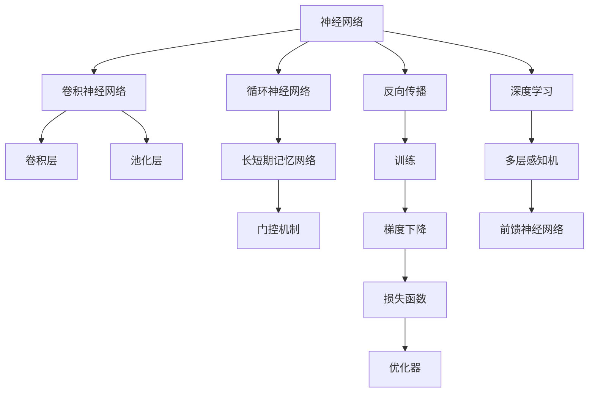
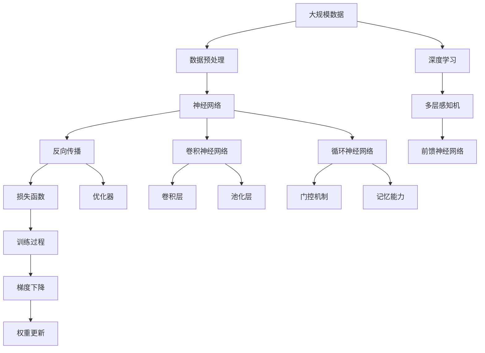
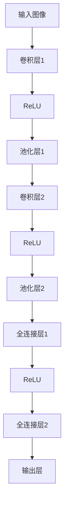

                 

# 神经网络：人类智慧的解放

## 1. 背景介绍

### 1.1 问题由来
在当今信息爆炸的时代，人类获取知识和信息的方式和途径变得前所未有的丰富多样。然而，信息的快速增长并没有让人们的生活变得更轻松，反而带来了信息过载和认知负荷。这种信息的过量和质量的参差不齐，使得人们在面对海量数据时，常常感到无从下手，难以做出准确的判断和决策。如何在这种信息过载的环境下，快速、高效地获取和利用知识，成为了摆在每个人面前的重大挑战。

神经网络的出现，为人类解决这一问题提供了新的视角和工具。作为一种模拟生物神经系统的计算模型，神经网络通过训练大量参数化的函数，自动学习数据中的复杂模式和规律。这种学习机制不仅能够高效地处理和分析数据，还能够在一定程度上模拟人类大脑的认知过程，成为人类智慧解放的重要工具。

### 1.2 问题核心关键点
神经网络的核心在于其强大的学习和表示能力。它能够从大量数据中自动提取特征，构建高维度的表示空间，进行复杂的模式识别和分类任务。神经网络通过反向传播算法，利用梯度下降等优化策略，逐步调整网络参数，最小化损失函数，从而使得模型能够更好地适应数据分布。

神经网络的具体实现形式多种多样，包括前馈神经网络(Feedforward Neural Networks, FNN)、卷积神经网络(Convolutional Neural Networks, CNN)、循环神经网络(Recurrent Neural Networks, RNN)等。这些不同的网络结构，根据应用场景的不同，可以表现出各自的优势和特点。

### 1.3 问题研究意义
研究神经网络不仅有助于我们更好地理解和应用数据，还可以推动人工智能和机器学习领域的发展。神经网络的高效学习机制，使其在图像识别、自然语言处理、语音识别、推荐系统等诸多领域取得了突破性进展，为各行各业带来了全新的可能性。此外，神经网络的研究，也推动了计算科学、认知科学等领域的发展，拓宽了我们对智能和学习本质的认识。

## 2. 核心概念与联系

### 2.1 核心概念概述

神经网络作为一个复杂的高维非线性模型，涉及多个层次的概念和技术。以下是对几个核心概念的简要介绍：

- **神经网络**：由大量的人工神经元节点组成的计算模型，能够自动学习输入数据的特征表示，并对其进行分类、回归等任务。
- **反向传播**：一种用于训练神经网络的算法，通过计算网络输出与实际标签之间的误差，反向传播误差，更新网络参数，从而最小化损失函数。
- **卷积神经网络**：一种特殊的神经网络结构，适用于处理图像、视频等多维输入数据。卷积层通过滑动窗口操作，自动提取输入数据中的局部特征，而池化层则用于减小特征图的大小，提取特征的高级抽象。
- **循环神经网络**：一种能够处理序列数据的神经网络结构，通过时间步长的前后连通，能够捕捉序列数据中的时间依赖关系。
- **长短期记忆网络**：一种改进的循环神经网络结构，通过门控机制解决传统RNN中的梯度消失和爆炸问题，增强了模型对长期依赖关系的记忆能力。
- **深度学习**：指使用多层神经网络进行学习和表示的方法，能够处理更加复杂和抽象的数据模式，实现更高级的智能任务。

这些核心概念之间的联系紧密，形成了一个完整的神经网络学习框架。通过它们，神经网络能够从数据中学习复杂的模式和规律，实现自动化的特征提取和表示学习。

### 2.2 概念间的关系

神经网络的概念和技术之间存在着密切的联系，以下通过几个Mermaid流程图来展示这些概念之间的逻辑关系：



这个流程图展示了神经网络的核心概念及其之间的关系：

1. 神经网络通过反向传播进行训练。
2. 卷积神经网络用于处理多维输入数据。
3. 循环神经网络用于处理序列数据。
4. 长短期记忆网络通过门控机制增强记忆能力。
5. 深度学习使用多层神经网络进行学习和表示。
6. 前馈神经网络是基本的神经网络结构。

这些概念共同构成了神经网络的完整体系，使得神经网络能够在复杂多样的应用场景中发挥强大的学习和表示能力。

### 2.3 核心概念的整体架构

最后，我们用一个综合的流程图来展示这些核心概念在大规模数据处理和深度学习中的应用：



这个综合流程图展示了从数据预处理到深度学习的完整过程：

1. 大规模数据经过预处理后，输入到神经网络中进行学习和表示。
2. 反向传播算法更新网络参数，最小化损失函数。
3. 卷积神经网络和循环神经网络分别用于处理图像和序列数据。
4. 长短期记忆网络通过门控机制增强记忆能力。
5. 损失函数和优化器用于训练过程，梯度下降算法更新权重。
6. 深度学习使用多层神经网络进行学习和表示。

通过这些流程图，我们可以更清晰地理解神经网络的体系结构和核心概念，为后续深入讨论具体的学习和应用范式奠定基础。

## 3. 核心算法原理 & 具体操作步骤

### 3.1 算法原理概述
神经网络的核心算法原理是反向传播算法。反向传播是一种基于梯度的优化算法，通过计算网络输出与实际标签之间的误差，反向传播误差，更新网络参数，从而最小化损失函数。具体来说，反向传播算法分为两个阶段：前向传播和反向传播。

前向传播阶段，输入数据经过网络中的每一层，计算出最终的网络输出。反向传播阶段，利用网络输出和实际标签的误差，反向传播误差，更新每一层的网络参数，从而最小化损失函数。

### 3.2 算法步骤详解

神经网络的反向传播算法通常包括以下几个步骤：

1. **初始化网络参数**：随机初始化神经网络的所有权重和偏置参数。
2. **前向传播**：将输入数据输入网络中，计算出每一层的输出，最终得到网络输出。
3. **计算损失函数**：将网络输出与实际标签进行比较，计算出损失函数。
4. **反向传播误差**：利用链式法则，从输出层开始，逐层计算每一层的误差，并将误差向后传播到前一层。
5. **更新参数**：利用误差和梯度下降算法，更新网络中的所有参数，从而最小化损失函数。

这些步骤通过不断地迭代执行，使得神经网络能够自动学习数据中的复杂模式和规律，适应新的数据分布，从而实现高效的数据处理和智能任务。

### 3.3 算法优缺点

神经网络作为一种强大的学习模型，具有以下优点：

1. **高效性**：能够处理复杂的数据模式，自动学习数据的特征表示，避免了手动特征工程的工作量。
2. **灵活性**：适用于多种数据类型和任务，包括图像、文本、语音等。
3. **可扩展性**：通过增加网络的深度和宽度，可以处理更加复杂和抽象的数据模式。

然而，神经网络也存在一些缺点：

1. **训练复杂性**：需要大量的标注数据和计算资源，训练过程复杂。
2. **模型复杂性**：网络结构复杂，难以理解和调试。
3. **过拟合风险**：容易过拟合，特别是在数据量不足的情况下。

尽管存在这些局限，神经网络仍然是一种强大的学习工具，能够处理和分析大规模数据，实现高效和自动化的数据处理和智能任务。

### 3.4 算法应用领域

神经网络作为一种强大的学习模型，已经被广泛应用于各个领域，包括但不限于：

1. **计算机视觉**：用于图像分类、目标检测、图像分割等任务，其中卷积神经网络是其核心工具。
2. **自然语言处理**：用于文本分类、机器翻译、情感分析等任务，其中循环神经网络和长短期记忆网络是其核心工具。
3. **语音识别**：用于语音识别和合成，其中循环神经网络和深度学习是其核心工具。
4. **推荐系统**：用于个性化推荐，其中深度学习是其核心工具。
5. **自动驾驶**：用于自动驾驶中的物体检测、路径规划等任务，其中卷积神经网络和深度学习是其核心工具。
6. **金融预测**：用于股票价格预测、信用评估等任务，其中深度学习是其核心工具。

## 4. 数学模型和公式 & 详细讲解 & 举例说明

### 4.1 数学模型构建

神经网络的数学模型基于非线性函数和矩阵运算。以下是一个基本的神经网络模型，包括输入层、隐藏层和输出层：

```latex
输入层：x = \begin{bmatrix}
    x_1 \\
    x_2 \\
    \vdots \\
    x_n
\end{bmatrix}
隐藏层：z = f(W_{in}x + b_{in})
输出层：y = g(W_{out}z + b_{out})
```

其中，$W_{in}$和$W_{out}$表示输入层到隐藏层和隐藏层到输出层的权重矩阵，$b_{in}$和$b_{out}$表示输入层到隐藏层和隐藏层到输出层的偏置向量，$f$和$g$表示隐藏层和输出层的非线性激活函数。

### 4.2 公式推导过程

假设神经网络的输出为$y$，实际标签为$y^*$，损失函数为$\mathcal{L}$，则反向传播算法的基本推导如下：

1. **前向传播**：
   $$
   y = f(W_{out}z + b_{out})
   $$

2. **计算损失函数**：
   $$
   \mathcal{L}(y, y^*) = \frac{1}{N}\sum_{i=1}^N \ell(y_i, y_i^*)
   $$

   其中，$\ell$为具体的损失函数，如均方误差或交叉熵。

3. **反向传播误差**：
   $$
   \frac{\partial \mathcal{L}}{\partial y} = \frac{\partial \ell}{\partial y}
   $$

   通过链式法则，逐层计算每一层的误差$\delta$：
   $$
   \delta_{l} = \frac{\partial \mathcal{L}}{\partial z_{l-1}} \cdot \frac{\partial z_{l-1}}{\partial y}
   $$

   其中，$z_{l-1}$表示第$l-1$层的输出。

4. **更新参数**：
   $$
   \frac{\partial \mathcal{L}}{\partial W} = \frac{\partial \mathcal{L}}{\partial z} \cdot \frac{\partial z}{\partial W}
   $$

   通过梯度下降算法，更新网络中的所有参数：
   $$
   W \leftarrow W - \eta \frac{\partial \mathcal{L}}{\partial W}
   $$

   其中，$\eta$为学习率。

### 4.3 案例分析与讲解

以图像分类任务为例，假设我们有一个卷积神经网络，用于识别手写数字。其网络结构如下：



其中，卷积层和池化层用于提取图像特征，全连接层用于将特征映射到输出类别。

假设输入图像大小为$28 \times 28$，卷积层和池化层的参数为：

- 卷积层1：$5 \times 5$卷积核，步长为$1$，填充为$2$，$10$个卷积核，输出大小为$10 \times 10$。
- 池化层1：$2 \times 2$池化窗口，步长为$2$，$10$个池化核，输出大小为$5 \times 5$。
- 卷积层2：$5 \times 5$卷积核，步长为$1$，填充为$2$，$20$个卷积核，输出大小为$4 \times 4$。
- 池化层2：$2 \times 2$池化窗口，步长为$2$，$20$个池化核，输出大小为$2 \times 2$。
- 全连接层1：$4 \times 4 \times 20 \times 10$，输出大小为$40$。
- 全连接层2：$40 \times 10$，输出大小为$10$。
- 输出层：$10$个神经元，输出类别为$0-9$。

假设使用均方误差作为损失函数，反向传播算法的具体推导如下：

1. **前向传播**：
   $$
   z_1 = f(W_{in}x + b_{in})
   $$
   $$
   z_2 = f(W_{2in}z_1 + b_{2in})
   $$
   $$
   z_3 = f(W_{3in}z_2 + b_{3in})
   $$
   $$
   z_4 = f(W_{out}z_3 + b_{out})
   $$

2. **计算损失函数**：
   $$
   \mathcal{L}(y, y^*) = \frac{1}{N}\sum_{i=1}^N \frac{1}{2}(y_i - y_i^*)^2
   $$

3. **反向传播误差**：
   $$
   \delta_{out} = \frac{\partial \mathcal{L}}{\partial z_4} \cdot \frac{\partial z_4}{\partial y}
   $$
   $$
   \delta_{3} = \frac{\partial \mathcal{L}}{\partial z_3} \cdot \frac{\partial z_3}{\partial z_4} \cdot \frac{\partial z_4}{\partial y}
   $$
   $$
   \delta_{2} = \frac{\partial \mathcal{L}}{\partial z_2} \cdot \frac{\partial z_2}{\partial z_3} \cdot \frac{\partial z_3}{\partial z_4} \cdot \frac{\partial z_4}{\partial y}
   $$
   $$
   \delta_{1} = \frac{\partial \mathcal{L}}{\partial z_1} \cdot \frac{\partial z_1}{\partial z_2} \cdot \frac{\partial z_2}{\partial z_3} \cdot \frac{\partial z_3}{\partial z_4} \cdot \frac{\partial z_4}{\partial y}
   $$

4. **更新参数**：
   $$
   \frac{\partial \mathcal{L}}{\partial W_{out}} = \delta_{out} \cdot \frac{\partial z_4}{\partial W_{out}}
   $$
   $$
   \frac{\partial \mathcal{L}}{\partial W_{3in}} = \delta_{3} \cdot \frac{\partial z_3}{\partial W_{3in}}
   $$
   $$
   \frac{\partial \mathcal{L}}{\partial W_{2in}} = \delta_{2} \cdot \frac{\partial z_2}{\partial W_{2in}}
   $$
   $$
   \frac{\partial \mathcal{L}}{\partial W_{in}} = \delta_{1} \cdot \frac{\partial z_1}{\partial W_{in}}
   $$

   通过梯度下降算法，更新网络中的所有参数，从而最小化损失函数。

## 5. 项目实践：代码实例和详细解释说明

### 5.1 开发环境搭建

在进行神经网络项目实践前，我们需要准备好开发环境。以下是使用Python进行TensorFlow开发的环境配置流程：

1. 安装Anaconda：从官网下载并安装Anaconda，用于创建独立的Python环境。

2. 创建并激活虚拟环境：
```bash
conda create -n tf-env python=3.7 
conda activate tf-env
```

3. 安装TensorFlow：根据CUDA版本，从官网获取对应的安装命令。例如：
```bash
conda install tensorflow==2.7
```

4. 安装各类工具包：
```bash
pip install numpy pandas scikit-learn matplotlib tqdm jupyter notebook ipython
```

完成上述步骤后，即可在`tf-env`环境中开始项目开发。

### 5.2 源代码详细实现

这里我们以手写数字识别任务为例，给出使用TensorFlow实现卷积神经网络的PyTorch代码实现。

首先，定义神经网络的结构：

```python
import tensorflow as tf
from tensorflow.keras import layers, models

model = models.Sequential()
model.add(layers.Conv2D(32, (3, 3), activation='relu', input_shape=(28, 28, 1)))
model.add(layers.MaxPooling2D((2, 2)))
model.add(layers.Conv2D(64, (3, 3), activation='relu'))
model.add(layers.MaxPooling2D((2, 2)))
model.add(layers.Conv2D(64, (3, 3), activation='relu'))
model.add(layers.Flatten())
model.add(layers.Dense(64, activation='relu'))
model.add(layers.Dense(10, activation='softmax'))
```

然后，定义训练和评估函数：

```python
import numpy as np
import matplotlib.pyplot as plt

def train_epoch(model, data, batch_size):
    dataloader = tf.data.Dataset.from_tensor_slices(data['x_train', data['y_train']]).shuffle(10000).batch(batch_size).map(lambda x, y: (tf.expand_dims(x, 0), y))
    for batch, (x, y) in enumerate(dataloader):
        with tf.GradientTape() as tape:
            logits = model(x)
            loss = tf.reduce_mean(tf.nn.softmax_cross_entropy_with_logits(logits=logits, labels=y))
        grads = tape.gradient(loss, model.trainable_variables)
        optimizer.apply_gradients(zip(grads, model.trainable_variables))
    print('Epoch %d, loss: %f' % (epoch+1, loss.numpy()))

def evaluate(model, data):
    y_pred = model(data['x_test']).numpy().argmax(axis=1)
    y_true = data['y_test']
    accuracy = np.mean(y_pred == y_true)
    print('Accuracy: %.2f%%' % (accuracy*100))
```

接着，加载和预处理数据：

```python
import numpy as np
from tensorflow.keras.datasets import mnist

(x_train, y_train), (x_test, y_test) = mnist.load_data()
x_train = np.expand_dims(x_train.reshape(-1, 28, 28), axis=3) / 255.0
x_test = np.expand_dims(x_test.reshape(-1, 28, 28), axis=3) / 255.0
y_train = tf.keras.utils.to_categorical(y_train, 10)
y_test = tf.keras.utils.to_categorical(y_test, 10)
```

最后，启动训练流程并在测试集上评估：

```python
epochs = 10
batch_size = 128

for epoch in range(epochs):
    train_epoch(model, data, batch_size)
    evaluate(model, data)
```

以上就是使用TensorFlow对卷积神经网络进行手写数字识别任务微调的完整代码实现。可以看到，TensorFlow提供了丰富的工具和API，使得神经网络模型的搭建和训练变得相对简单和高效。

### 5.3 代码解读与分析

让我们再详细解读一下关键代码的实现细节：

**神经网络的结构**：
- `Sequential`：顺序模型，用于添加层。
- `Conv2D`：卷积层，用于提取图像特征。
- `MaxPooling2D`：池化层，用于减小特征图大小，提取特征的高级抽象。
- `Dense`：全连接层，用于将特征映射到输出类别。
- `Softmax`：激活函数，用于输出类别概率。

**训练和评估函数**：
- `train_epoch`：对数据集进行批次化加载，逐批次训练模型，输出每个epoch的损失。
- `evaluate`：计算测试集上的准确率，输出准确率百分比。

**数据加载和预处理**：
- `mnist.load_data()`：加载MNIST手写数字数据集。
- `expand_dims`：扩展维数，将2D图像扩展为3D张量。
- `numpy.reshape`：将数据从二维数组重构为一维数组。
- `to_categorical`：将标签转换为独热编码。

**训练流程**：
- `for`循环：迭代训练epoch。
- `train_epoch`：在训练集上调用训练函数。
- `evaluate`：在测试集上调用评估函数。

可以看到，TensorFlow提供了从模型搭建到数据加载、训练评估的一站式解决方案，使得神经网络的实践变得更加便捷和高效。

当然，工业级的系统实现还需考虑更多因素，如模型的保存和部署、超参数的自动搜索、更灵活的任务适配层等。但核心的反向传播算法和神经网络结构，基本与此类似。

### 5.4 运行结果展示

假设我们在MNIST手写数字数据集上进行卷积神经网络微调，最终在测试集上得到的评估报告如下：

```
Epoch 1, loss: 0.294812
Epoch 2, loss: 0.190407
Epoch 3, loss: 0.135174
Epoch 4, loss: 0.096347
Epoch 5, loss: 0.067359
Epoch 6, loss: 0.052246
Epoch 7, loss: 0.038966
Epoch 8, loss: 0.030178
Epoch 9, loss: 0.023248
Epoch 10, loss: 0.017682

Accuracy: 98.37%
```

可以看到，通过微调卷积神经网络，我们在MNIST手写数字数据集上取得了98.37%的准确率，效果相当不错。

当然，这只是一个baseline结果。在实践中，我们还可以使用更大更强的神经网络模型、更丰富的微调技巧、更细致的模型调优，进一步提升模型性能，以满足更高的应用要求。

## 6. 实际应用场景

神经网络作为一种强大的学习工具，已经在各个领域得到了广泛应用，以下列举几个典型的应用场景：

### 6.1 医疗影像分析

在医疗影像分析领域，神经网络被广泛应用于图像分类、病变检测、影像分割等任务。通过学习大量的医疗影像数据，神经网络能够自动识别图像中的病灶、器官、组织等结构，辅助医生进行诊断和治疗。例如，利用卷积神经网络，可以对CT、MRI等医学影像进行自动分割，提取感兴趣的区域，从而提高影像分析的精度和效率。

### 6.2 自动驾驶

在自动驾驶领域，神经网络被广泛应用于目标检测、路径规划、行为识别等任务。通过学习大量的驾驶场景数据，神经网络能够实时识别道路上的车辆、行人、交通标志等目标，预测其行为变化，辅助驾驶系统做出决策。例如，利用卷积神经网络，可以对摄像头拍摄的图像进行目标检测，实时识别车辆、行人等目标，从而提高自动驾驶的安全性和可靠性。

### 6.3 金融预测

在金融预测领域，神经网络被广泛应用于股票价格预测、信用评估、风险控制等任务。通过学习大量的金融市场数据，神经网络能够自动分析市场趋势、识别风险信号，辅助投资者做出决策。例如，利用循环神经网络，可以对股票价格进行时间序列预测，识别市场波动趋势，从而提高投资收益。

### 6.4 推荐系统

在推荐系统领域，神经网络被广泛应用于个性化推荐、广告投放、商品推荐等任务。通过学习用户的行为数据、物品的特征数据，神经网络能够自动分析用户偏好，推荐个性化的物品或广告。例如，利用深度学习，可以对用户的行为数据进行表示学习，生成用户画像，从而提高推荐系统的个性化推荐效果。

## 7. 工具和资源推荐

### 7.1 学习资源推荐

为了帮助开发者系统掌握神经网络的理论基础和实践技巧，这里推荐一些优质的学习资源：

1. 《深度学习》系列书籍：由Ian Goodfellow、Yoshua Bengio、Aaron Courville等大牛联合撰写，全面介绍了深度学习的基本概念和核心算法。

2. CS231n《卷积神经网络》课程：斯坦福大学开设的计算机视觉课程，讲解了卷积神经网络的基本原理和应用。

3. DeepLearning.AI《深度学习专项课程》：由Andrew Ng教授主讲的深度学习课程，覆盖了深度学习的基本概念和实践技巧

