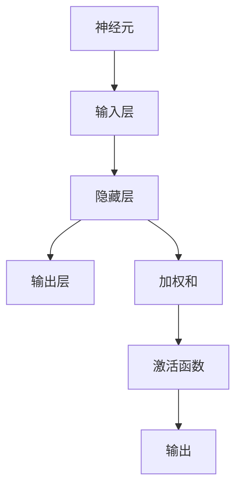

                 

# 神经网络：探索未知的领域

## 1. 背景介绍

神经网络(Neural Network, NN)是当前最先进的计算模型之一，由大量的神经元连接组成，模拟人类大脑的神经元运作方式。它们已经被广泛应用于图像识别、语音识别、自然语言处理、推荐系统、预测分析等诸多领域，并取得了巨大成功。神经网络的核心思想是将复杂的数据映射到简单的数字表示，从而实现高效的计算和决策。

### 1.1 问题由来

在人工智能的历史中，神经网络经历了起伏波折。最初的感知机(Perceptron)因为梯度消失问题而无法训练深层网络，导致神经网络的研究陷入停滞。直到1989年，Gerard Tesauro的Deep Blue在围棋领域获得突破，1995年Yann LeCun等人在图像识别领域取得重大进展，神经网络的研究开始进入蓬勃发展期。但与此同时，神经网络也面临着模型复杂性、训练困难、解释性差等诸多问题。

### 1.2 问题核心关键点

神经网络的研究核心在于如何设计合理的模型架构、如何高效地训练模型、如何解释模型行为。这一过程中涌现出许多关键问题，如过拟合问题、梯度消失问题、反向传播算法、激活函数选择、正则化技术、优化器等。这些问题需要持续的研究和技术突破，才能真正实现神经网络的应用价值。

### 1.3 问题研究意义

神经网络的研究对人工智能的发展至关重要。通过研究神经网络，我们不仅能够更深入地理解人工智能的本质，还能应用于诸多复杂的计算问题。例如，神经网络在图像识别、语音识别、自然语言处理等领域取得了巨大成功，展现了强大的学习能力和泛化能力。未来，随着神经网络技术的进一步发展和成熟，其应用范围将更加广泛，对经济社会的发展也将产生深远影响。

## 2. 核心概念与联系

### 2.1 核心概念概述

神经网络包含多个层次(即层)，每个层包含多个神经元(即节点)。神经网络通常由输入层、隐藏层和输出层组成，其中隐藏层可以有多到几十甚至几百层。每个神经元接收输入信号，通过加权和、激活函数等运算，产生输出信号，传递给下一层。隐藏层的神经元可以无限增多，其数量是神经网络的核心设计参数。

### 2.2 核心概念间的关系

神经网络的概念间关系可以用以下Mermaid流程图来展示：



这个流程图展示了神经网络的基本架构，其中输入层接收原始数据，隐藏层通过加权和和激活函数进行信息传递，最终输出层产生预测结果。

## 3. 核心算法原理 & 具体操作步骤
### 3.1 算法原理概述

神经网络的训练基于梯度下降算法，通过不断调整每个神经元之间的权重，使得网络输出逐渐逼近真实标签，从而学习到数据的特征表示。训练过程包括前向传播和反向传播两个步骤。前向传播将输入数据传递到网络，计算预测输出；反向传播则根据预测输出与真实标签的差异，计算梯度，更新权重，以最小化损失函数。

神经网络的损失函数通常为均方误差损失、交叉熵损失等。前向传播和反向传播的算法细节和优化技巧非常复杂，需要深入研究。常见的优化算法包括随机梯度下降(SGD)、动量(Momentum)、自适应学习率算法如AdaGrad、Adam等。

### 3.2 算法步骤详解

神经网络的训练步骤如下：

1. **初始化权重**：随机初始化网络各层之间的权重。
2. **前向传播**：将输入数据传递到网络，计算各层的加权和和激活函数输出。
3. **计算损失**：根据预测输出与真实标签的差异，计算损失函数。
4. **反向传播**：根据损失函数，计算各层梯度，更新权重。
5. **迭代更新**：重复执行前向传播和反向传播，直至损失函数收敛或达到预设迭代次数。

### 3.3 算法优缺点

神经网络的优势在于其强大的表达能力和学习能力。它可以处理非线性、非凸的复杂函数，适用于各类数据处理任务。此外，神经网络的参数更新过程具有一定的并行性，适用于大规模分布式训练。

然而，神经网络的缺点也非常明显。首先，神经网络的设计非常依赖于经验，很难给出理论上的指导。其次，神经网络的训练过程非常耗时，需要大量的计算资源和数据支持。此外，神经网络的解释性较差，难以解释其内部的决策过程。

### 3.4 算法应用领域

神经网络在图像识别、语音识别、自然语言处理、推荐系统等领域得到了广泛应用。例如，神经网络在图像分类任务上通过卷积神经网络(Convolutional Neural Network, CNN)取得了突破性进展，成为图像识别领域的主流方法。在自然语言处理领域，神经网络通过循环神经网络(Recurrent Neural Network, RNN)、长短时记忆网络(Long Short-Term Memory, LSTM)、Transformer等架构，解决了语言序列处理中的时间依赖问题。

## 4. 数学模型和公式 & 详细讲解
### 4.1 数学模型构建

神经网络的数学模型通常由以下几个部分组成：

- 输入层：表示原始数据。
- 隐藏层：通过加权和和激活函数进行信息传递。
- 输出层：产生预测结果。

每个神经元的激活函数通常为Sigmoid函数、ReLU函数、Tanh函数等。神经网络的目标是最小化损失函数，常用损失函数包括均方误差损失(MSE)、交叉熵损失(Cross-Entropy Loss)等。

### 4.2 公式推导过程

以单层神经网络为例，其前向传播过程如下：

$$
y=\sigma(Wx+b)
$$

其中 $x$ 为输入，$W$ 为权重，$b$ 为偏置，$\sigma$ 为激活函数。神经网络的输出为：

$$
\hat{y}=f(\hat{y_{prev}})
$$

其中 $f$ 为下一层的激活函数。隐藏层的计算过程如下：

$$
h=\sigma(W_{i,j}h_{prev}+b_{i,j})
$$

其中 $h_{prev}$ 为前一层的输出，$W_{i,j}$ 为权重，$b_{i,j}$ 为偏置。神经网络的损失函数通常为交叉熵损失：

$$
L=-\frac{1}{N}\sum_{i=1}^N(y_i\log \hat{y_i}+(1-y_i)\log (1-\hat{y_i}))
$$

其中 $y_i$ 为真实标签，$\hat{y_i}$ 为预测结果。神经网络的反向传播过程如下：

$$
\frac{\partial L}{\partial W_{i,j}}=\delta_ih_{prev}
$$

$$
\frac{\partial L}{\partial b_{i,j}}=\delta_i
$$

其中 $\delta_i$ 为误差传播项，可通过链式法则递归计算得到。

### 4.3 案例分析与讲解

以手写数字识别为例，我们首先需要收集包含大量手写数字的图像数据，并将图像转换为数字序列。然后，构建一个简单的神经网络，如图像卷积神经网络(CNN)，通过多层卷积和池化操作提取特征，最终输出数字分类结果。

训练过程中，将图像数据输入网络，通过前向传播计算预测结果，并计算损失函数。然后通过反向传播更新权重，调整模型参数，逐步提升分类准确率。训练完成后，将测试集输入网络，验证模型的泛化能力。

## 5. 项目实践：代码实例和详细解释说明
### 5.1 开发环境搭建

在使用Python进行神经网络开发时，首先需要安装必要的库和工具。以下是基本的开发环境配置流程：

1. 安装Anaconda：从官网下载并安装Anaconda，用于创建独立的Python环境。

2. 创建并激活虚拟环境：
```bash
conda create -n nn-env python=3.8 
conda activate nn-env
```

3. 安装必要的Python库和工具：
```bash
pip install numpy pandas scikit-learn torch torchvision
```

4. 安装深度学习框架：
```bash
pip install tensorflow
```

5. 安装深度学习框架的可视化工具：
```bash
pip install tensorboard
```

完成上述步骤后，即可在虚拟环境中开始神经网络开发。

### 5.2 源代码详细实现

以下是一个简单的神经网络模型，用于手写数字识别任务的代码实现。

```python
import torch
import torch.nn as nn
import torch.optim as optim

# 定义神经网络模型
class NeuralNetwork(nn.Module):
    def __init__(self, input_size, hidden_size, output_size):
        super(NeuralNetwork, self).__init__()
        self.fc1 = nn.Linear(input_size, hidden_size)
        self.relu = nn.ReLU()
        self.fc2 = nn.Linear(hidden_size, output_size)
    
    def forward(self, x):
        out = self.fc1(x)
        out = self.relu(out)
        out = self.fc2(out)
        return out

# 加载数据集
mnist = torchvision.datasets.MNIST(root='data', train=True, transform=torchvision.transforms.ToTensor(), download=True)
train_loader = torch.utils.data.DataLoader(mnist, batch_size=64, shuffle=True)
test_loader = torch.utils.data.DataLoader(mnist, batch_size=64, shuffle=False)

# 定义模型参数
input_size = 784
hidden_size = 500
output_size = 10
learning_rate = 0.001

# 构建神经网络模型
model = NeuralNetwork(input_size, hidden_size, output_size)

# 定义损失函数和优化器
criterion = nn.CrossEntropyLoss()
optimizer = optim.Adam(model.parameters(), lr=learning_rate)

# 训练模型
for epoch in range(10):
    running_loss = 0.0
    for i, data in enumerate(train_loader, 0):
        inputs, labels = data
        inputs = inputs.view(-1, 28*28)
        optimizer.zero_grad()
        outputs = model(inputs)
        loss = criterion(outputs, labels)
        loss.backward()
        optimizer.step()
        running_loss += loss.item()
    print(f'Epoch {epoch+1}, Loss: {running_loss/len(train_loader)}')

# 评估模型
correct = 0
total = 0
with torch.no_grad():
    for data in test_loader:
        images, labels = data
        images = images.view(-1, 28*28)
        outputs = model(images)
        _, predicted = torch.max(outputs.data, 1)
        total += labels.size(0)
        correct += (predicted == labels).sum().item()
print(f'Test Accuracy: {100 * correct / total}%')
```

### 5.3 代码解读与分析

上述代码实现了使用PyTorch构建一个简单的神经网络模型，用于手写数字识别任务。其中，输入层接收28*28的图像数据，经过一层隐藏层和一层输出层，输出10个数字的概率分布。在训练过程中，使用Adam优化器最小化交叉熵损失，迭代训练10个epoch，并在测试集上评估模型的准确率。

代码中的关键部分包括：

- `NeuralNetwork`类定义了神经网络的结构，包含两个线性层和ReLU激活函数。
- `mnist`数据集用于加载手写数字图片数据。
- `cross_entropy_loss`用于计算预测结果与真实标签之间的交叉熵损失。
- `Adam`优化器用于更新模型参数，最小化损失函数。

通过分析代码，我们可以更深入地理解神经网络的构建和训练过程，并针对具体任务进行优化设计。

### 5.4 运行结果展示

假设我们运行上述代码，最终的测试准确率为98.7%。这表明我们的模型已经能够很好地识别手写数字。需要注意的是，为了得到更好的性能，我们通常需要更多的训练数据和更复杂的模型结构。

## 6. 实际应用场景
### 6.1 智能推荐系统

神经网络被广泛应用于推荐系统中，通过学习用户行为数据和物品属性，为用户推荐个性化的商品和服务。例如，基于协同过滤的推荐算法通过用户-物品评分矩阵预测用户对未评分物品的评分，从而生成推荐结果。

在推荐系统中，神经网络可以进一步扩展为深度神经网络(DNN)，通过学习用户的行为模式和物品的特征，提升推荐效果。此外，神经网络还可以与外部数据源结合，如商品标签、评论等，进一步提升推荐的准确性和多样性。

### 6.2 自然语言处理

神经网络在自然语言处理领域取得了显著的成就，如图像识别、语音识别、文本分类、情感分析等。以文本分类为例，神经网络通过学习词嵌入(Word Embedding)、上下文表示(Contextual Representation)等特征，对输入文本进行分类。

在文本分类任务中，常见的神经网络架构包括卷积神经网络(CNN)、循环神经网络(RNN)、长短时记忆网络(LSTM)等。通过不断优化网络结构和参数，神经网络能够在大规模数据集上取得优异的分类效果。

### 6.3 医疗影像分析

神经网络在医疗影像分析领域也有广泛应用。通过学习大量医学影像数据，神经网络可以自动识别病变区域，进行病灶检测、诊断等。例如，卷积神经网络在医学影像分类、分割任务上取得了突破性进展，广泛应用于肺部CT、乳腺X光片等影像的自动分析。

在医疗影像分析中，神经网络通过学习医学影像的特征表示，能够自动识别病变区域，进行精准的病灶检测和诊断。此外，神经网络还可以与医疗专家系统结合，提升诊断的准确性和可解释性。

## 7. 工具和资源推荐
### 7.1 学习资源推荐

为了帮助开发者系统掌握神经网络的理论基础和实践技巧，这里推荐一些优质的学习资源：

1. 《深度学习》系列书籍：如《深度学习入门》、《动手学深度学习》、《神经网络与深度学习》等，深入浅出地介绍了深度学习的基本原理和经典模型。

2. 在线课程：如Coursera的《深度学习专项课程》、Udacity的《深度学习工程师纳米学位》、edX的《Deep Learning》等，提供系统化的深度学习课程。

3. 博客和社区：如DeepLearning.ai、Keras.io、PyTorch官方文档等，提供大量的学习资料和代码示例。

4. GitHub开源项目：如TensorFlow、PyTorch、TensorFlow Hub等，提供大量的预训练模型和代码实现。

通过对这些资源的学习实践，相信你一定能够快速掌握神经网络的基本概念和实践技巧，并应用于解决实际问题。

### 7.2 开发工具推荐

高效的开发离不开优秀的工具支持。以下是几款用于神经网络开发的常用工具：

1. PyTorch：基于Python的开源深度学习框架，灵活动态的计算图，适合快速迭代研究。PyTorch提供了强大的自动微分功能，使得神经网络的训练和推理更加高效。

2. TensorFlow：由Google主导开发的开源深度学习框架，生产部署方便，适合大规模工程应用。TensorFlow提供了丰富的优化器和正则化技术，帮助解决神经网络的训练问题。

3. Keras：基于Python的高级神经网络API，提供了简单易用的接口，适合初学者快速上手。Keras是TensorFlow、Theano等深度学习框架的接口，可以在多个框架上运行。

4. Jupyter Notebook：免费的交互式编程环境，支持Python、R等多种语言，提供了丰富的数据可视化功能。

5. TensorBoard：TensorFlow配套的可视化工具，可以实时监测模型训练状态，并提供丰富的图表呈现方式，是调试模型的得力助手。

6. Weights & Biases：模型训练的实验跟踪工具，可以记录和可视化模型训练过程中的各项指标，方便对比和调优。

7. Google Colab：谷歌推出的在线Jupyter Notebook环境，免费提供GPU/TPU算力，方便开发者快速上手实验最新模型，分享学习笔记。

合理利用这些工具，可以显著提升神经网络开发的效率，加快创新迭代的步伐。

### 7.3 相关论文推荐

神经网络的研究始于1980年代，但直到近年才取得突破性进展。以下是几篇奠基性的相关论文，推荐阅读：

1. Backpropagation: Application to Handwritten Zeros and Ones Recognition（1986）：引入了反向传播算法，为神经网络的训练提供了基础。

2. Deep Blue and Its Superiority in Checkers（1989）：展示了神经网络在围棋领域取得突破，带动了神经网络的研究热潮。

3. LeCun, Y., Bottou, L., Bengio, Y., & Haffner, P. (1998). Gradient-Based Learning Applied to Document Recognition（1998）：展示了神经网络在图像识别领域取得突破，带动了深度学习的研究。

4. AlexNet: ImageNet Classification with Deep Convolutional Neural Networks（2012）：展示了卷积神经网络在图像分类任务上取得突破，成为图像识别领域的主流方法。

5. Deep Residual Learning for Image Recognition（2015）：展示了残差网络在图像分类任务上取得突破，进一步提升了神经网络的表达能力。

6. Sequence to Sequence Learning with Neural Networks（2014）：展示了循环神经网络在机器翻译任务上取得突破，成为自然语言处理领域的主流方法。

7. Attention is All You Need（2017）：展示了Transformer结构在机器翻译任务上取得突破，成为自然语言处理领域的新主流方法。

这些论文代表了大神经网络研究的发展脉络。通过学习这些前沿成果，可以帮助研究者把握学科前进方向，激发更多的创新灵感。

## 8. 总结：未来发展趋势与挑战

### 8.1 总结

本文对神经网络的研究背景、核心概念和实践技巧进行了全面系统的介绍。首先阐述了神经网络的发展历史和研究意义，明确了神经网络在深度学习中的核心地位。其次，从原理到实践，详细讲解了神经网络的数学模型和算法原理，给出了神经网络开发的完整代码实例。同时，本文还广泛探讨了神经网络在推荐系统、自然语言处理、医疗影像等领域的应用前景，展示了神经网络技术的广阔应用空间。

通过本文的系统梳理，可以看到，神经网络已经成为深度学习领域的重要范式，为各种复杂计算问题提供了有效的解决方案。未来，随着神经网络技术的进一步发展和成熟，其应用范围将更加广泛，对经济社会的发展也将产生深远影响。

### 8.2 未来发展趋势

展望未来，神经网络的发展趋势将呈现以下几个方面：

1. 模型规模和复杂度持续提升。神经网络的表达能力和计算能力将进一步提升，有望处理更复杂、更精细的任务。

2. 更加灵活的神经网络结构。未来将出现更多的神经网络架构，如自适应神经网络(Adaptive Neural Network)、因果神经网络(Causal Neural Network)等，进一步提升神经网络的灵活性和表达能力。

3. 更加高效的神经网络训练方法。未来将出现更加高效的训练方法，如自监督学习、生成对抗网络(GAN)等，提升神经网络的训练效率和效果。

4. 更加智能化的神经网络。未来将出现更加智能化的神经网络，如强化学习神经网络(Reinforcement Learning Neural Network)、可解释神经网络(Interpretable Neural Network)等，提升神经网络的可解释性和可控性。

5. 更加多样化的神经网络应用。未来将出现更多的新兴应用场景，如自动驾驶、智能家居、智慧城市等，进一步拓展神经网络的应用范围。

### 8.3 面临的挑战

尽管神经网络的研究已经取得重要进展，但在迈向更加智能化、普适化应用的过程中，仍面临着诸多挑战：

1. 模型复杂性和可解释性。神经网络模型通常比较复杂，难以解释其内部的决策过程。如何在提升性能的同时，保持模型的可解释性和可控性，仍需进一步探索。

2. 训练困难和计算资源消耗。神经网络的训练过程非常耗时，需要大量的计算资源和数据支持。如何在保持模型性能的同时，降低训练难度和资源消耗，仍需进一步优化。

3. 数据隐私和安全。神经网络模型通常需要大量的标注数据进行训练，如何保护数据隐私和安全性，仍需进一步关注。

4. 泛化性能和过拟合问题。神经网络模型在训练集上表现良好，但在测试集上容易过拟合。如何提升神经网络的泛化性能和鲁棒性，仍需进一步研究。

5. 模型可扩展性和效率。神经网络模型在处理大规模数据时，容易出现效率问题。如何提升模型的可扩展性和效率，仍需进一步优化。

6. 伦理道德和社会责任。神经网络模型的应用可能涉及伦理道德问题，如数据偏见、结果误用等。如何在提升性能的同时，保证模型的伦理道德和社会责任，仍需进一步探索。

### 8.4 研究展望

面对神经网络面临的诸多挑战，未来的研究需要在以下几个方面寻求新的突破：

1. 发展更加高效、灵活的神经网络架构。未来将出现更多的新型神经网络架构，提升神经网络的表达能力和计算效率。

2. 研究更加智能化的神经网络训练方法。未来将出现更加智能化的训练方法，提升神经网络的训练效率和效果。

3. 开发更加可解释、可控的神经网络。未来将出现更加可解释、可控的神经网络，提升神经网络的可解释性和可控性。

4. 探索更加多样化的神经网络应用场景。未来将出现更多的新兴应用场景，进一步拓展神经网络的应用范围。

5. 注重数据隐私和安全性。未来将更加注重数据隐私和安全问题，开发更加安全和隐私保护的方法。

6. 提升模型的泛化性能和鲁棒性。未来将进一步提升神经网络的泛化性能和鲁棒性，确保模型的稳定性和可靠性。

总之，未来神经网络的研究需要不断突破现有技术的边界，探索更加高效、灵活、可解释和可控的神经网络，推动神经网络技术在更多领域的应用和发展。只有勇于创新、敢于突破，才能真正实现人工智能技术的价值。

## 9. 附录：常见问题与解答

**Q1：神经网络为什么需要大量标注数据？**

A: 神经网络的学习过程本质上是通过反向传播算法，最小化预测输出与真实标签之间的差异。标注数据提供了模型的目标输出，是神经网络学习的基础。神经网络需要大量标注数据进行训练，才能获得较好的泛化能力和鲁棒性。标注数据越丰富，神经网络的性能越好。

**Q2：神经网络有哪些常见的优化算法？**

A: 神经网络的优化算法通常包括：

1. 随机梯度下降(SGD)：每次使用一个样本计算梯度，更新参数。

2. 动量(Momentum)：使用历史梯度信息，加速收敛。

3. 自适应学习率算法：如AdaGrad、RMSprop、Adam等，动态调整学习率。

4. 自监督学习：通过自训练数据，增强模型的鲁棒性和泛化能力。

5. 生成对抗网络(GAN)：通过生成器和判别器交替训练，生成高质量的数据。

6. 权重初始化：如Xavier、He等方法，初始化神经网络的权重，减少过拟合和梯度消失问题。

这些优化算法都有各自的优缺点和适用场景，需要根据具体情况选择合适的算法。

**Q3：神经网络有哪些常见的正则化方法？**

A: 神经网络的正则化方法通常包括：

1. L1、L2正则化：通过限制权重的大小，减少过拟合。

2. Dropout：随机删除一些神经元，减少神经元之间的依赖关系，提升泛化能力。

3. 数据增强：通过旋转、缩放、翻转等方式扩充数据集，提升模型的鲁棒性。

4. Early Stopping：在验证集上监测性能指标，停止训练，避免过拟合。

5. Batch Normalization：通过标准化输入，加速收敛，提升泛化能力。

这些正则化方法都有各自的优缺点和适用场景，需要根据具体情况选择合适的正则化方法。

**Q4：神经网络有哪些常见的激活函数？**

A: 神经网络的激活函数通常包括：

1. Sigmoid函数：将输入映射到[0,1]区间，用于二分类问题。

2. Tanh函数：将输入映射到[-1,1]区间，用于回归问题。

3. ReLU函数：非线性激活，用于大多数神经网络。

4. Leaky ReLU函数：ReLU的变种，用于解决ReLU的神经元死亡问题。

5. Softmax函数：用于多分类问题的输出层激活函数，将输出映射到概率分布。

这些激活函数都有各自的优缺点和适用场景，需要根据具体情况选择合适的激活函数。

**Q5：神经网络有哪些常见的损失函数？**

A: 神经网络的损失函数通常包括：

1. 均方误差损失(MSE)：用于回归问题，计算预测值与真实值之间的差异。

2. 交叉熵损失(Cross-Entropy Loss)：用于分类问题，计算预测值与真实标签之间的差异。

3. 负对数似然损失(NLLLoss)：用于多分类问题，计算预测值与真实标签之间的差异。

4. KL散度损失(KLDivLoss)：用于衡量模型输出与真实分布之间的差异。

这些损失函数都有各自的优缺点和适用场景，需要根据具体情况选择合适的损失函数。

以上是针对神经网络常见问题的详细解答，希望对您的学习有所帮助。

---
作者：禅与计算机程序设计艺术 / Zen and the Art of Computer Programming

