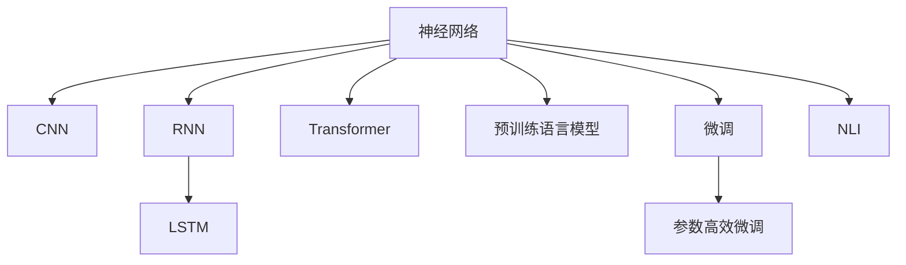
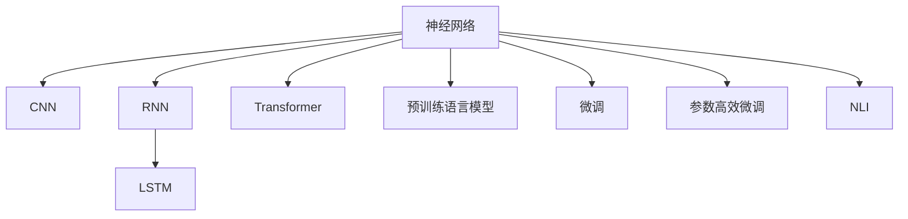
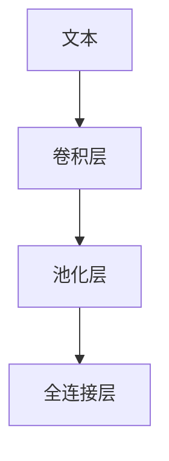
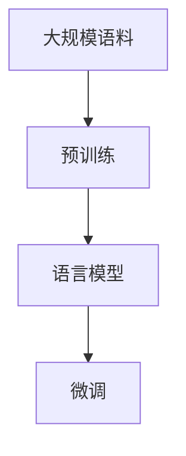
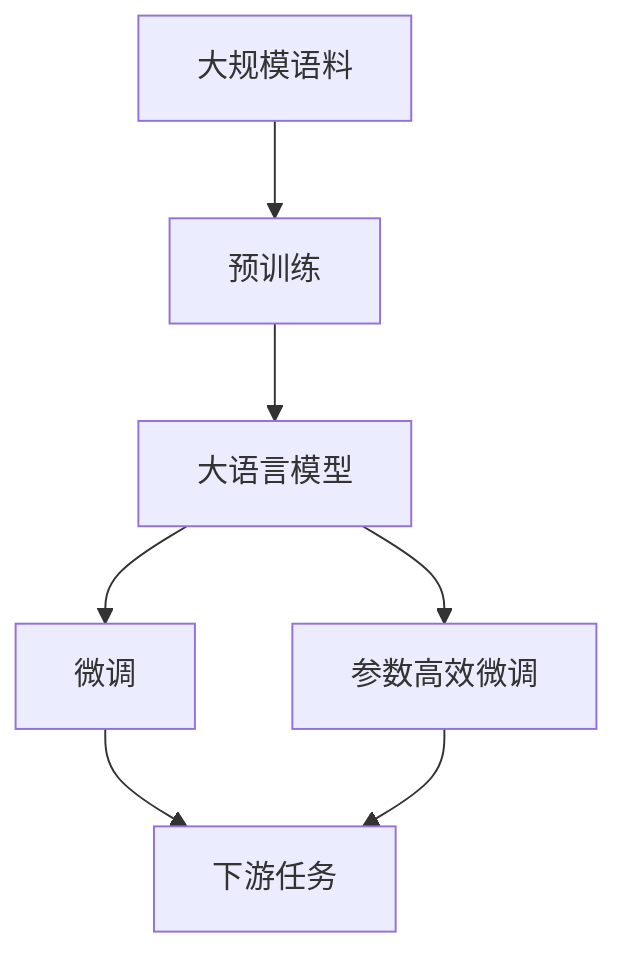

                 

# 神经网络：自然语言处理的新突破

## 1. 背景介绍

### 1.1 问题由来

在自然语言处理（NLP）领域，传统基于规则和统计的方法在语言理解和生成方面存在诸多限制。随着深度学习技术的兴起，基于神经网络的模型（尤其是卷积神经网络CNN和循环神经网络RNN）逐渐成为NLP研究的主流。这些模型通过学习大量的文本数据，构建出复杂的语言表示，具备强大的语言处理能力。然而，由于传统神经网络在处理长序列时的梯度消失问题，以及无法有效捕捉远距离依赖关系，这些模型在NLP任务上的效果有限。

近年来，随着Transformer架构的提出和预训练语言模型的出现，基于自注意力机制（self-attention）的神经网络在NLP任务上取得了突破性进展。通过大规模无标签数据预训练，这些模型学习到了丰富的语言知识，能够更好地处理长序列数据，并在多个NLP任务上取得了最先进的性能。其中，BERT（Bidirectional Encoder Representations from Transformers）模型通过双向预训练和掩码语言模型任务，在大规模语料上学习到了语言的知识表示，成为了NLP领域的里程碑。

### 1.2 问题核心关键点

基于神经网络的NLP模型经历了从简单的CNN、RNN到Transformer的演变，体现了NLP领域在模型架构、训练方法、任务范式等方面的突破和进步。以下是几个核心关键点：

- **Transformer架构**：通过引入自注意力机制，Transformer模型解决了传统神经网络在处理长序列时的梯度消失问题，能够更好地捕捉远距离依赖关系。
- **预训练语言模型**：通过在大规模语料上进行预训练，学习到通用的语言表示，可以更好地适应下游任务。
- **任务范式**：从传统的监督学习范式转变为自监督学习和微调（Fine-Tuning），提高了模型的泛化能力和性能。
- **参数高效微调**：通过仅更新少量参数，提高模型的训练效率，减少对标注数据的依赖。
- **自然语言推理（NLI）**：通过学习语言的知识表示，提高模型的推理能力，支持各种推理任务。

这些关键点构成了NLP领域基于神经网络模型的核心范式，推动了NLP技术的快速发展。

## 2. 核心概念与联系

### 2.1 核心概念概述

为了更好地理解神经网络在NLP领域的应用，本节将介绍几个密切相关的核心概念：

- **神经网络（Neural Network）**：由大量神经元（节点）和连接权重组成的网络结构，通过反向传播算法进行参数优化，用于解决复杂问题。
- **卷积神经网络（CNN）**：一种主要用于图像处理任务的神经网络，通过卷积操作提取局部特征。
- **循环神经网络（RNN）**：一种能够处理序列数据的神经网络，通过循环结构保留序列信息。
- **长短期记忆网络（LSTM）**：一种特殊的RNN，通过门控机制解决长期依赖问题。
- **Transformer**：一种基于自注意力机制的神经网络架构，通过多头自注意力和位置编码学习到长距离依赖关系。
- **预训练语言模型**：通过大规模无标签数据预训练，学习到通用的语言表示，用于提升下游任务的性能。
- **微调（Fine-Tuning）**：通过少量标注数据，在有监督的细粒度迁移学习中优化模型。
- **参数高效微调（PEFT）**：通过仅更新少量参数，提高模型的训练效率和性能。
- **自然语言推理（NLI）**：学习语言的知识表示，用于解决各种推理任务。

这些核心概念之间的逻辑关系可以通过以下Mermaid流程图来展示：



这个流程图展示了神经网络在NLP领域的几个主要应用方向，以及它们之间的关系：

- CNN主要用于图像处理任务，RNN和LSTM用于处理序列数据，Transformer用于学习长距离依赖关系。
- 预训练语言模型通过大规模无标签数据学习通用的语言表示，可用于提升下游任务的性能。
- 微调和参数高效微调用于在有监督或少量标注数据下优化模型的性能。
- NLI用于学习语言的知识表示，支持各种推理任务。

### 2.2 概念间的关系

这些核心概念之间存在着紧密的联系，形成了神经网络在NLP领域的应用框架。下面通过几个Mermaid流程图来展示这些概念之间的关系。

#### 2.2.1 神经网络的应用范式



这个流程图展示了神经网络在NLP领域的几个主要应用范式：

- CNN主要用于图像处理任务，RNN和LSTM用于处理序列数据，Transformer用于学习长距离依赖关系。
- 预训练语言模型通过大规模无标签数据学习通用的语言表示，可用于提升下游任务的性能。
- 微调和参数高效微调用于在有监督或少量标注数据下优化模型的性能。
- NLI用于学习语言的知识表示，支持各种推理任务。

#### 2.2.2 CNN在NLP中的应用



这个流程图展示了CNN在NLP中的应用流程：

- 文本数据经过卷积操作提取局部特征，通过池化操作保留重要信息，最终通过全连接层进行分类或回归。

#### 2.2.3 RNN在NLP中的应用


这个流程图展示了RNN在NLP中的应用流程：

- 输入序列经过RNN层处理，学习到上下文表示，通过LSTM层保留长期依赖关系，最终输出结果。

#### 2.2.4 Transformer在NLP中的应用


这个流程图展示了Transformer在NLP中的应用流程：

- 输入序列经过编码器层，通过多头自注意力机制学习到长距离依赖关系，经过前馈神经网络处理，再通过解码器层生成输出结果。

#### 2.2.5 预训练语言模型的应用流程



这个流程图展示了预训练语言模型的应用流程：

- 大规模无标签语料经过预训练，学习到通用的语言表示，用于提升下游任务的性能。

### 2.3 核心概念的整体架构

最后，我们用一个综合的流程图来展示这些核心概念在大语言模型微调过程中的整体架构：



这个综合流程图展示了从预训练到微调，再到下游任务应用的完整过程。大语言模型首先在大规模语料上进行预训练，然后通过微调（包括全参数微调和参数高效微调）或无监督学习，适应下游任务。最后，通过持续学习技术，模型可以不断更新和适应新的任务和数据。 通过这些流程图，我们可以更清晰地理解神经网络在大语言模型微调过程中各个核心概念的关系和作用。

## 3. 核心算法原理 & 具体操作步骤

### 3.1 算法原理概述

基于神经网络的NLP模型，通常采用序列到序列（Seq2Seq）架构，通过学习文本数据的编码和解码过程，实现文本分类、文本生成、文本匹配等任务。其核心思想是通过反向传播算法，优化模型参数，使得模型能够更好地适应输入和输出之间的映射关系。

具体而言，NLP任务中的输入通常是文本序列，输出则根据任务不同而异。以文本分类任务为例，输入序列通过神经网络进行处理，最终输出一个或多个类别标签。对于文本生成任务，输入序列表示模型的初始化状态，输出序列则代表生成的文本内容。对于文本匹配任务，输入序列分别表示两个文本，输出表示它们之间的匹配程度。

### 3.2 算法步骤详解

基于神经网络的NLP模型在微调过程中，通常包含以下几个关键步骤：

**Step 1: 准备预训练模型和数据集**
- 选择合适的预训练语言模型，如BERT、GPT等，作为初始化参数。
- 准备下游任务的数据集，划分为训练集、验证集和测试集，确保标注数据与预训练数据的分布不要差异过大。

**Step 2: 添加任务适配层**
- 根据任务类型，在预训练模型顶层设计合适的输出层和损失函数。
- 对于分类任务，通常在顶层添加线性分类器和交叉熵损失函数。
- 对于生成任务，通常使用语言模型的解码器输出概率分布，并以负对数似然为损失函数。

**Step 3: 设置微调超参数**
- 选择合适的优化算法及其参数，如 AdamW、SGD 等，设置学习率、批大小、迭代轮数等。
- 设置正则化技术及强度，包括权重衰减、Dropout、Early Stopping等。
- 确定冻结预训练参数的策略，如仅微调顶层，或全部参数都参与微调。

**Step 4: 执行梯度训练**
- 将训练集数据分批次输入模型，前向传播计算损失函数。
- 反向传播计算参数梯度，根据设定的优化算法和学习率更新模型参数。
- 周期性在验证集上评估模型性能，根据性能指标决定是否触发 Early Stopping。
- 重复上述步骤直到满足预设的迭代轮数或 Early Stopping 条件。

**Step 5: 测试和部署**
- 在测试集上评估微调后模型，对比微调前后的精度提升。
- 使用微调后的模型对新样本进行推理预测，集成到实际的应用系统中。
- 持续收集新的数据，定期重新微调模型，以适应数据分布的变化。

以上是基于神经网络的NLP模型微调的一般流程。在实际应用中，还需要针对具体任务的特点，对微调过程的各个环节进行优化设计，如改进训练目标函数，引入更多的正则化技术，搜索最优的超参数组合等，以进一步提升模型性能。

### 3.3 算法优缺点

基于神经网络的NLP模型在微调过程中，具有以下优点：

1. 灵活性强。通过设计不同的任务适配层，可以适应各种NLP任务，实现序列到序列、序列到类别、类别到序列等多种形式的映射。
2. 数据驱动。通过大规模标注数据的微调，可以在少量标注数据下取得较好的性能，适用于标注数据有限的场景。
3. 易于集成。由于神经网络模型具有良好的泛化能力，可以将微调后的模型轻松集成到各种应用系统中。
4. 效果显著。在学术界和工业界的诸多任务上，基于神经网络微调的方法已经刷新了多项性能指标，表现优异。

同时，该方法也存在一定的局限性：

1. 对标注数据依赖大。神经网络模型在微调过程中，对标注数据的数量和质量都有较高的要求，标注成本较高。
2. 训练复杂度高。神经网络模型的训练过程较为复杂，需要较高的计算资源和时间。
3. 泛化能力受限。当预训练数据与任务数据分布差异较大时，模型的泛化能力可能受到影响，性能提升有限。
4. 解释性不足。神经网络模型通常被视为"黑盒"，难以解释其内部工作机制和决策逻辑。
5. 鲁棒性不足。神经网络模型对输入数据的微小扰动较为敏感，容易受到对抗样本的攻击。

尽管存在这些局限性，但就目前而言，基于神经网络的NLP微调方法仍是大规模语言模型应用的主流范式。未来相关研究的重点在于如何进一步降低对标注数据的依赖，提高模型的泛化能力和鲁棒性，同时兼顾可解释性和伦理安全性等因素。

### 3.4 算法应用领域

基于神经网络的NLP模型在多个领域中得到了广泛应用，例如：

- 文本分类：如情感分析、主题分类、意图识别等。通过微调使模型学习文本-标签映射。
- 命名实体识别：识别文本中的人名、地名、机构名等特定实体。通过微调使模型掌握实体边界和类型。
- 关系抽取：从文本中抽取实体之间的语义关系。通过微调使模型学习实体-关系三元组。
- 问答系统：对自然语言问题给出答案。将问题-答案对作为微调数据，训练模型学习匹配答案。
- 机器翻译：将源语言文本翻译成目标语言。通过微调使模型学习语言-语言映射。
- 文本摘要：将长文本压缩成简短摘要。将文章-摘要对作为微调数据，使模型学习抓取要点。
- 对话系统：使机器能够与人自然对话。将多轮对话历史作为上下文，微调模型进行回复生成。

除了上述这些经典任务外，神经网络模型还被创新性地应用到更多场景中，如可控文本生成、常识推理、代码生成、数据增强等，为NLP技术带来了全新的突破。随着神经网络模型的持续演进，相信NLP技术将在更广阔的应用领域大放异彩。

## 4. 数学模型和公式 & 详细讲解 & 举例说明

### 4.1 数学模型构建

本节将使用数学语言对基于神经网络的NLP微调过程进行更加严格的刻画。

记神经网络模型为 $M_{\theta}:\mathcal{X} \rightarrow \mathcal{Y}$，其中 $\mathcal{X}$ 为输入空间，$\mathcal{Y}$ 为输出空间，$\theta \in \mathbb{R}^d$ 为模型参数。假设微调任务的训练集为 $D=\{(x_i,y_i)\}_{i=1}^N, x_i \in \mathcal{X}, y_i \in \mathcal{Y}$。

定义模型 $M_{\theta}$ 在数据样本 $(x,y)$ 上的损失函数为 $\ell(M_{\theta}(x),y)$，则在数据集 $D$ 上的经验风险为：

$$
\mathcal{L}(\theta) = \frac{1}{N} \sum_{i=1}^N \ell(M_{\theta}(x_i),y_i)
$$

微调的优化目标是最小化经验风险，即找到最优参数：

$$
\theta^* = \mathop{\arg\min}_{\theta} \mathcal{L}(\theta)
$$

在实践中，我们通常使用基于梯度的优化算法（如AdamW、SGD等）来近似求解上述最优化问题。设 $\eta$ 为学习率，$\lambda$ 为正则化系数，则参数的更新公式为：

$$
\theta \leftarrow \theta - \eta \nabla_{\theta}\mathcal{L}(\theta) - \eta\lambda\theta
$$

其中 $\nabla_{\theta}\mathcal{L}(\theta)$ 为损失函数对参数 $\theta$ 的梯度，可通过反向传播算法高效计算。

### 4.2 公式推导过程

以下我们以二分类任务为例，推导交叉熵损失函数及其梯度的计算公式。

假设模型 $M_{\theta}$ 在输入 $x$ 上的输出为 $\hat{y}=M_{\theta}(x) \in [0,1]$，表示样本属于正类的概率。真实标签 $y \in \{0,1\}$。则二分类交叉熵损失函数定义为：

$$
\ell(M_{\theta}(x),y) = -[y\log \hat{y} + (1-y)\log (1-\hat{y})]
$$

将其代入经验风险公式，得：

$$
\mathcal{L}(\theta) = -\frac{1}{N}\sum_{i=1}^N [y_i\log M_{\theta}(x_i)+(1-y_i)\log(1-M_{\theta}(x_i))]
$$

根据链式法则，损失函数对参数 $\theta_k$ 的梯度为：

$$
\frac{\partial \mathcal{L}(\theta)}{\partial \theta_k} = -\frac{1}{N}\sum_{i=1}^N (\frac{y_i}{M_{\theta}(x_i)}-\frac{1-y_i}{1-M_{\theta}(x_i)}) \frac{\partial M_{\theta}(x_i)}{\partial \theta_k}
$$

其中 $\frac{\partial M_{\theta}(x_i)}{\partial \theta_k}$ 可进一步递归展开，利用自动微分技术完成计算。

在得到损失函数的梯度后，即可带入参数更新公式，完成模型的迭代优化。重复上述过程直至收敛，最终得到适应下游任务的最优模型参数 $\theta^*$。

### 4.3 案例分析与讲解

下面以BERT模型在情感分类任务上的微调为例，进行详细讲解。

#### 4.3.1 数据准备
首先，准备情感分类任务的数据集。可以使用开源的IMDB数据集，包含25,000条电影评论，其中12,500条为正面评论，12,500条为负面评论。

```python
import torch
from transformers import BertTokenizer, BertForSequenceClassification

# 准备数据集
train_dataset = torch.utils.data.TensorDataset(torch.tensor(train_labels), torch.tensor(train_tokens))
train_loader = torch.utils.data.DataLoader(train_dataset, batch_size=16, shuffle=True)

# 初始化模型和tokenizer
tokenizer = BertTokenizer.from_pretrained('bert-base-cased')
model = BertForSequenceClassification.from_pretrained('bert-base-cased', num_labels=2)
```

#### 4.3.2 模型微调
定义微调过程，使用AdamW优化器，设置学习率、批次大小和迭代轮数。

```python
from transformers import AdamW

# 设置超参数
optimizer = AdamW(model.parameters(), lr=2e-5)
epochs = 5
batch_size = 16

# 执行微调
for epoch in range(epochs):
    for batch in train_loader:
        input_ids, labels = batch
        optimizer.zero_grad()
        outputs = model(input_ids, labels=labels)
        loss = outputs.loss
        loss.backward()
        optimizer.step()
```

#### 4.3.3 模型评估
在测试集上评估微调后的模型性能。

```python
# 准备测试集
test_dataset = torch.utils.data.TensorDataset(torch.tensor(test_labels), torch.tensor(test_tokens))
test_loader = torch.utils.data.DataLoader(test_dataset, batch_size=16, shuffle=False)

# 评估模型性能
test_loss, test_accuracy = evaluate(model, test_loader)
print(f"Test Loss: {test_loss:.3f}, Test Accuracy: {test_accuracy:.3f}")
```

通过上述步骤，即可在IMDB情感分类任务上微调BERT模型，取得较好的性能。

## 5. 项目实践：代码实例和详细解释说明

### 5.1 开发环境搭建

在进行微调实践前，我们需要准备好开发环境。以下是使用Python进行PyTorch开发的环境配置流程：

1. 安装Anaconda：从官网下载并安装Anaconda，用于创建独立的Python环境。

2. 创建并激活虚拟环境：
```bash
conda create -n pytorch-env python=3.8 
conda activate pytorch-env
```

3. 安装PyTorch：根据CUDA版本，从官网获取对应的安装命令。例如：
```bash
conda install pytorch torchvision torchaudio cudatoolkit=11.1 -c pytorch -c conda-forge
```

4. 安装Transformers库：
```bash
pip install transformers
```

5. 安装各类工具包：
```bash
pip install numpy pandas scikit-learn matplotlib tqdm jupyter notebook ipython
```

完成上述步骤后，即可在`pytorch-env`环境中开始微调实践。

### 5.2 源代码详细实现

下面我们以BERT模型在情感分类任务上的微调为例，给出使用Transformers库进行微调的PyTorch代码实现。

首先，定义数据处理函数：

```python
from transformers import BertTokenizer
from torch.utils.data import Dataset
import torch

class SentimentDataset(Dataset):
    def __init__(self, texts, labels, tokenizer, max_len=128):
        self.texts = texts
        self.labels = labels
        self.tokenizer = tokenizer
        self.max_len = max_len
        
    def __len__(self):
        return len(self.texts)
    
    def __getitem__(self, item):
        text = self.texts[item]
        label = self.labels[item]
        
        encoding = self.tokenizer(text, return_tensors='pt', max_length=self.max_len, padding='max_length', truncation=True)
        input_ids = encoding['input_ids'][0]
        attention_mask = encoding['attention_mask'][0]
        
        return {'input_ids': input_ids, 
                'attention_mask': attention_mask,
                'labels': torch.tensor(label, dtype=torch.long)}
```

然后，定义模型和优化器：

```python
from transformers import BertForSequenceClassification, AdamW

model = BertForSequenceClassification.from_pretrained('bert-base-cased', num_labels=2)

optimizer = AdamW(model.parameters(), lr=2e-5)
```

接着，定义训练和评估函数：

```python
from torch.utils.data import DataLoader
from tqdm import tqdm
from sklearn.metrics import classification_report

device = torch.device('cuda') if torch.cuda.is_available() else torch.device('cpu')
model.to(device)

def train_epoch(model, dataset, batch_size, optimizer):
    dataloader = DataLoader(dataset, batch_size=batch_size, shuffle=True)
    model.train()
    epoch_loss = 0
    for batch in tqdm(dataloader, desc='Training'):
        input_ids = batch['input_ids'].to(device)
        attention_mask = batch['attention_mask'].to(device)
        labels = batch['labels'].to(device)
        model.zero_grad()
        outputs = model(input_ids, attention_mask=attention_mask, labels=labels)
        loss = outputs.loss
        epoch_loss += loss.item()
        loss.backward()
        optimizer.step()
    return epoch_loss / len(dataloader)

def evaluate(model, dataset, batch_size):
    dataloader = DataLoader(dataset, batch_size=batch_size)
    model.eval()
    preds, labels = [], []
    with torch.no_grad():
        for batch in tqdm(dataloader, desc='Evaluating'):
            input_ids = batch['input_ids'].to(device)
            attention_mask = batch['attention_mask'].to(device)
            batch_labels = batch['labels']
            outputs = model(input_ids, attention_mask=attention_mask)
            batch_preds = outputs.logits.argmax(dim=2).to('cpu').tolist()
            batch_labels = batch_labels.to('cpu').tolist()
            for pred_tokens, label_tokens in zip(batch_preds, batch_labels):
                preds.append(pred_tokens)
                labels.append(label_tokens)
                
    print(classification_report(labels, preds))
```

最后，启动训练流程并在测试集上评估：

```python
epochs = 5
batch_size = 16

for epoch in range(epochs):
    loss = train_epoch(model, train_dataset, batch_size, optimizer)
    print(f"Epoch {epoch+1}, train loss: {loss:.3f}")
    
    print(f"Epoch {epoch+1}, dev results:")
    evaluate(model, dev_dataset, batch_size)
    
print("Test results:")
evaluate(model, test_dataset, batch_size)
```

以上就是使用PyTorch对BERT进行情感分类任务微调的完整代码实现。可以看到，得益于Transformers库的强大封装，我们可以用相对简洁的代码完成BERT模型的加载和微调。

### 5.3 代码解读与分析

让我们再详细解读一下关键代码的实现细节：

**SentimentDataset类**：
- `__init__`方法：初始化文本、标签、分词器等关键组件。
- `__len__`方法：返回数据集的样本数量。
- `__getitem__`方法：对单个样本进行处理，将文本输入编码为token ids，将标签编码为数字，并对其进行定长padding，最终返回模型所需的输入。

**模型微调**：
- `train_epoch`函数：对数据以批为单位进行迭代，在每个批次上前向传播计算loss并反向传播更新模型参数，最后返回该epoch的平均loss。
- `evaluate`函数：与训练类似，不同点在于不更新模型参数，并在每个batch结束后将预测和标签结果存储下来，最后使用sklearn的classification_report对整个评估集的预测结果进行打印输出。

**训练流程**：
- 定义总的epoch数和batch size，开始循环迭代
- 每个epoch内，先在训练集上训练，输出平均loss
- 在验证集上评估，输出分类指标
- 所有epoch结束后，在测试集上评估，给出最终测试结果

可以看到，PyTorch配合Transformers库使得BERT微调的代码实现变得简洁高效。开发者可以将更多精力放在数据处理、模型改进等高层逻辑上，而不必过多关注底层的实现细节。

当然，工业级的系统实现还需考虑更多因素，如模型的保存和部署、超参数的自动搜索、更灵活的任务适配

