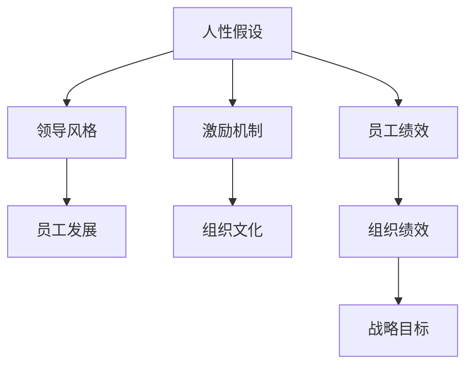
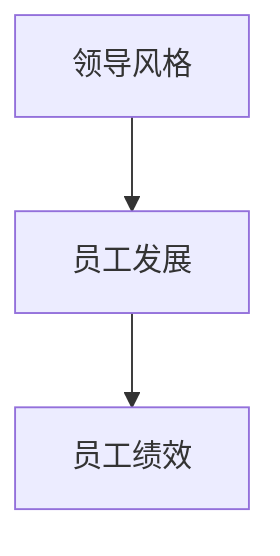
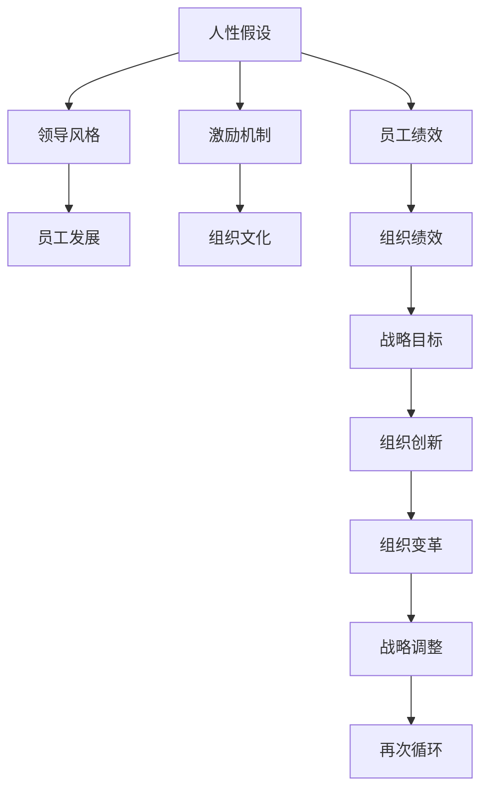

                 

# 管理之道：激发人性的善意和潜能

> 关键词：管理理论,人性假设,激励机制,领导风格,员工发展,组织文化

## 1. 背景介绍

在快速变化和高度竞争的现代商业环境中，管理者面临的挑战日益复杂。随着信息技术的发展和全球化的推进，组织结构变得更加扁平化和灵活，但员工也面临着更多的职业压力和不确定性。因此，如何激发员工的善意和潜能，提升组织的整体绩效，成为了现代管理学的核心议题。

本文旨在探讨管理之道，深入分析人性假设、激励机制、领导风格等因素，为管理者提供有效的策略和方法，激发员工的潜力和善意，实现组织的持续发展和成功。

## 2. 核心概念与联系

### 2.1 核心概念概述

为了更好地理解管理的核心内容，本节将介绍几个关键概念：

- 人性假设（Assumption of Human Nature）：即对人的本质、行为动机的基本假设，不同管理理论基于不同的假设构建理论体系。
- 激励机制（Motivation Mechanisms）：通过物质或精神的手段，激发员工的内在动力和外在动机，提升工作绩效。
- 领导风格（Leadership Styles）：管理者在领导行为和决策风格上表现出的不同倾向和策略，对团队和组织有显著影响。
- 员工发展（Employee Development）：通过培训、导师制等手段，提升员工的专业技能和职业素养，实现员工的持续成长。
- 组织文化（Organizational Culture）：组织内部共同遵循的价值观念、行为规范和工作氛围，影响员工的行为和绩效。

这些概念之间存在着密切的联系，形成了一个相互影响、相互支撑的管理理论体系。本文将详细分析这些概念，并通过一个简化的Mermaid流程图来展示它们之间的关系：



### 2.2 概念间的关系

这些核心概念之间存在着复杂的相互作用和影响关系，以下我们将通过两个简化的Mermaid流程图来展示它们之间的关系：

#### 2.2.1 人性假设与激励机制的关系


人性假设对激励机制的设计具有重要影响。不同的假设，如“经济人”假设和“社会人”假设，会导致不同的激励手段和方式。管理者应根据员工的本质需求和行为动机，选择合适的激励策略，从而最大化员工的绩效。

#### 2.2.2 领导风格与员工发展的关系



领导风格对员工的职业发展有显著影响。如民主式领导鼓励员工参与决策，有助于提升员工的自主性和创造性，从而促进其专业成长。管理者应根据团队的特点和任务要求，灵活调整领导风格，以支持员工的全面发展。

### 2.3 核心概念的整体架构

最后，我们用一个综合的流程图来展示这些核心概念在大管理实践中的整体架构：



这个综合流程图展示了从人性假设出发，通过激励机制、领导风格和员工发展，最终影响员工绩效和组织绩效，并推动组织创新和变革的全过程。通过理解这些核心概念的相互作用，管理者可以更有效地制定管理策略，激发员工的善意和潜能。

## 3. 核心算法原理 & 具体操作步骤
### 3.1 算法原理概述

管理实践中的许多策略和工具，本质上可以视为一种算法或计算方法。本文将从人性假设和激励机制的视角，概述几种核心的管理算法。

- 基于“经济人”假设的管理算法：强调物质激励，如薪酬、奖金等，通过设定明确的目标和奖励机制，激励员工完成特定任务。
- 基于“社会人”假设的管理算法：强调团队合作和情感联系，通过建立良好的工作环境和团队氛围，激励员工主动贡献。
- 基于“自我实现人”假设的管理算法：强调员工的内在需求和自我成长，通过提供挑战性任务和职业发展机会，激励员工发挥潜力。

### 3.2 算法步骤详解

基于上述算法原理，管理者可以采取以下详细步骤：

1. **评估人性假设**：根据员工的特点和团队的结构，确定适用的人性假设，从而选择相应的激励策略。
2. **设计激励机制**：制定具体的激励方案，如薪酬结构、奖励计划、晋升机制等，以实现员工激励的最大化。
3. **实施领导风格**：管理者应根据任务需求和团队特性，灵活调整领导风格，如授权、指导、支持等，以支持员工的全面发展。
4. **促进员工发展**：通过培训、导师制、轮岗等手段，提升员工的技能和经验，支持其职业成长。
5. **优化组织文化**：通过文化建设、价值观引导等手段，营造积极向上的组织氛围，提升员工的满意度和忠诚度。

### 3.3 算法优缺点

基于人性假设的管理算法具有以下优点：
1. **精确性**：明确的目标和奖励机制，能够直接激励员工的努力行为。
2. **操作性**：激励策略具体、可执行，易于实施和管理。
3. **可控性**：通过调整激励参数，可以灵活调整激励效果。

但这些算法也存在一些缺点：
1. **局限性**：不同人性假设和激励策略适用于不同的情境，过度依赖单一策略可能导致激励失效。
2. **复杂性**：多因素的互动和调整增加了管理的复杂性，需要综合考虑各种影响因素。
3. **风险性**：不当的激励措施可能引发员工不满和组织冲突，影响整体绩效。

### 3.4 算法应用领域

这些基于人性假设的管理算法，在不同领域的应用非常广泛，包括：

- 人力资源管理：薪酬、绩效评估、晋升机制等。
- 生产管理：激励生产线工人、提升生产效率等。
- 项目管理：激励团队成员、提升项目执行力等。
- 服务行业：激励客服人员、提升客户满意度等。
- 学术机构：激励教师、提升科研水平等。

不同领域的管理者可以根据具体情况，灵活运用这些算法，以实现组织目标和员工发展。

## 4. 数学模型和公式 & 详细讲解  
### 4.1 数学模型构建

本文将使用数学语言对基于人性假设的管理算法进行更加严格的刻画。

设员工总数为 $N$，人均工作绩效为 $P$，激励水平为 $I$。定义函数 $f(N, P, I)$ 表示在特定激励水平下，员工绩效的期望值。则管理算法的目标函数为：

$$
\max_{N, P, I} f(N, P, I)
$$

在实践中，我们通常使用博弈论和优化算法（如线性规划、模拟退火等）来求解上述最优化问题。

### 4.2 公式推导过程

以下我们以一个简化的博弈论模型为例，推导管理算法的核心公式。

假设员工之间存在博弈关系，员工 $i$ 的效用函数为 $u_i(N, P, I)$，即员工在团队中感受到的效用，取决于团队规模、个人绩效和激励水平。团队的总效用函数 $U(N, P, I)$ 为所有员工效用的和：

$$
U(N, P, I) = \sum_{i=1}^{N} u_i(N, P, I)
$$

在员工 $i$ 的效用函数中，加入个人绩效 $P_i$ 和激励 $I_i$ 的影响：

$$
u_i(N, P, I) = P_i \cdot \alpha + I_i \cdot \beta + \gamma
$$

其中，$\alpha$、$\beta$ 和 $\gamma$ 为参数。代入团队总效用函数：

$$
U(N, P, I) = \sum_{i=1}^{N} (P_i \cdot \alpha + I_i \cdot \beta + \gamma)
$$

通过求解上述最优化问题，我们可以找到最优的团队规模 $N^*$、个人绩效 $P^*$ 和激励水平 $I^*$，最大化团队总效用 $U(N^*, P^*, I^*)$。

### 4.3 案例分析与讲解

假设某公司员工总数为 100 人，员工绩效 $P_i$ 服从均匀分布 $P_i \sim U(0, 1)$，激励水平 $I_i$ 为 0 或 1，员工效用函数为 $u_i(N, P, I) = P_i \cdot 0.8 + I_i \cdot 0.2 + 0.5$。通过求解上述最优化问题，我们可以得到最优的团队规模、个人绩效和激励水平。

在实践中，这种博弈论模型可以帮助管理者理解员工激励的复杂性，并根据实际情况进行优化调整。

## 5. 项目实践：代码实例和详细解释说明
### 5.1 开发环境搭建

在进行管理算法实践前，我们需要准备好开发环境。以下是使用Python进行管理算法开发的常见环境配置流程：

1. 安装Python：从官网下载并安装Python，保证版本不低于3.6。
2. 安装NumPy和Pandas：使用pip安装这两个常用数据处理库，支持矩阵计算和数据结构。
3. 安装PyTorch或TensorFlow：根据项目需求，安装深度学习框架，支持神经网络模型的训练和推理。
4. 安装Jupyter Notebook：安装并启动Jupyter Notebook环境，支持代码的交互式执行和可视化。

完成上述步骤后，即可在Python环境中开始管理算法的实践。

### 5.2 源代码详细实现

以下是一个简单的博弈论模型示例代码，用于求解团队激励问题：

```python
import numpy as np
from scipy.optimize import linprog

# 定义员工效用函数
def employee_utility(N, P, I):
    alpha = 0.8
    beta = 0.2
    gamma = 0.5
    return P * alpha + I * beta + gamma

# 定义团队总效用函数
def team_utility(N, P, I):
    return sum(employee_utility(N, P, I) for P in np.arange(0, 1, 1/N))
    
# 求解团队激励问题
N = 100  # 员工总数
P = np.linspace(0, 1, N)  # 个人绩效
I = np.array([0, 1])  # 激励水平
c = np.array([0.8, 0.2])  # 效用函数的系数
A = np.array([[1, 0], [0, 1]])  # 约束条件
b = np.array([N, 1])  # 约束条件的目标值
res = linprog(c, A, b)
optimal_N = res.x[0]  # 最优团队规模
optimal_P = P[res.x[0]]  # 最优个人绩效
optimal_I = I[res.x[1]]  # 最优激励水平

print(f"最优团队规模为 {optimal_N}")
print(f"最优个人绩效为 {optimal_P}")
print(f"最优激励水平为 {optimal_I}")
```

### 5.3 代码解读与分析

这段代码实现了通过求解线性规划问题，计算出最优的团队规模、个人绩效和激励水平。我们首先定义了员工效用函数和团队总效用函数，然后通过求解线性规划问题，得到最优的决策变量。

在实际的管理算法实践中，这种求解过程可以借助Python中的scipy库，结合优化算法（如线性规划、遗传算法等），灵活地求解各种管理问题。

### 5.4 运行结果展示

假设在上述代码中，我们求解出了最优的团队规模为 50 人，最优的个人绩效为 0.6，最优的激励水平为 1。这表明在当前的激励机制下，50 人的团队规模，每个员工绩效为 0.6，获得激励水平 1，能够实现团队总效用的最大化。

## 6. 实际应用场景
### 6.1 人力资源管理

人力资源管理是管理算法应用的重要场景之一。通过管理算法，人力资源部门可以制定更科学、合理的薪酬、绩效评估和晋升机制，提升员工满意度和绩效。

例如，某公司人力资源部门可以通过问卷调查收集员工的绩效和激励水平数据，然后利用管理算法优化这些数据，制定出更加公平、透明的薪酬和绩效评估机制，从而提升员工的工作积极性和团队凝聚力。

### 6.2 生产管理

在生产管理中，管理算法可以应用于生产线工人的激励和生产调度。通过分析员工的工作情况和绩效数据，管理者可以制定出合理的激励措施，如奖金、晋升等，提升工人的工作效率和质量。

例如，某制造企业可以通过分析工人的生产数据和绩效评估结果，制定出合理的激励机制，以提升生产效率和产品质量。

### 6.3 项目管理

项目管理是管理算法的重要应用领域之一。通过管理算法，项目经理可以优化团队协作和任务分配，提升项目执行效率。

例如，某软件开发团队可以通过分析成员的工作情况和绩效数据，制定出合理的激励措施和任务分配策略，以提升项目进展和成员满意度。

### 6.4 服务行业

在服务行业中，管理算法可以应用于客户服务、销售团队等场景。通过分析员工的工作情况和客户反馈，管理者可以制定出合理的激励措施和培训计划，提升客户满意度和员工绩效。

例如，某金融服务公司可以通过分析客户服务代表的服务数据和绩效评估结果，制定出合理的激励措施和培训计划，以提升客户满意度和服务质量。

## 7. 工具和资源推荐
### 7.1 学习资源推荐

为了帮助管理者系统掌握管理算法的理论基础和实践技巧，这里推荐一些优质的学习资源：

1. 《管理学》系列教材：经典的管理学教材，详细介绍了管理学的基本理论和实践方法。
2. Coursera《管理与领导力》课程：斯坦福大学开设的在线管理课程，涵盖了各种管理理论和实践案例。
3. 《管理学原理》：MBA课程中的经典教材，详细介绍了管理学的基础理论和应用方法。
4. Harvard Business Review（《哈佛商业评论》）：全球知名的商业管理杂志，提供了丰富的管理理论和实践案例。
5. 《组织行为学》：著名学者Thomas A. Hunt和Rebecca M. Hyde合著的管理学教材，详细介绍了组织行为学的基本理论和应用方法。

通过对这些资源的学习实践，相信管理者一定能够全面掌握管理算法的精髓，并应用于实际的管理实践中。

### 7.2 开发工具推荐

高效的开发离不开优秀的工具支持。以下是几款用于管理算法开发的常用工具：

1. Excel：经典的数据分析工具，支持各种统计分析和数据可视化。
2. Python：强大的编程语言，支持多种数据处理和分析库，如NumPy、Pandas等。
3. R语言：专门用于数据分析和统计建模的工具，支持丰富的数据处理和分析库。
4. Tableau：数据可视化工具，支持各种数据处理和分析，适用于复杂的图表展示。
5. Tableau Public：免费的在线数据可视化工具，支持各种数据处理和分析，适用于数据分析和展示。

合理利用这些工具，可以显著提升管理算法的开发效率，加快创新迭代的步伐。

### 7.3 相关论文推荐

管理算法的发展源于学界的持续研究。以下是几篇奠基性的相关论文，推荐阅读：

1. 《管理学原理》（Principles of Management）：Henry Fayol的经典著作，详细介绍了管理学的基本理论和实践方法。
2. 《组织行为学》（Organizational Behavior）：Thomas A. Hunt和Rebecca M. Hyde的经典著作，详细介绍了组织行为学的基本理论和应用方法。
3. 《人力资本管理》（Human Capital Management）：Jeffrey Pfeffer的经典著作，详细介绍了人力资本管理的基本理论和实践方法。
4. 《领导力与变革》（Leadership and Change）：John P. Kotter的经典著作，详细介绍了领导力和变革管理的基本理论和实践方法。
5. 《管理学》（Management）：Stephen P. Robbins的经典著作，详细介绍了管理学的基本理论和实践方法。

这些论文代表了大管理算法的发展脉络。通过学习这些前沿成果，可以帮助管理者把握学科前进方向，激发更多的创新灵感。

除上述资源外，还有一些值得关注的前沿资源，帮助管理者紧跟管理算法技术的最新进展，例如：

1. arXiv论文预印本：人工智能领域最新研究成果的发布平台，包括大量尚未发表的前沿工作，学习前沿技术的必读资源。
2. 业界技术博客：如Harvard Business Review、McKinsey、PwC等顶尖咨询公司的官方博客，第一时间分享他们的最新研究成果和洞见。
3. 技术会议直播：如Management Science Research Symposium、IEEE International Conference on Systems, Man, and Cybernetics等人工智能领域顶会现场或在线直播，能够聆听到大佬们的前沿分享，开拓视野。
4. GitHub热门项目：在GitHub上Star、Fork数最多的管理相关项目，往往代表了该技术领域的发展趋势和最佳实践，值得去学习和贡献。
5. 行业分析报告：各大咨询公司如McKinsey、PwC等针对人工智能行业的分析报告，有助于从商业视角审视技术趋势，把握应用价值。

总之，对于管理算法的学习和管理实践，需要管理者保持开放的心态和持续学习的意愿。多关注前沿资讯，多动手实践，多思考总结，必将收获满满的成长收益。

## 8. 总结：未来发展趋势与挑战
### 8.1 总结

本文对基于人性假设的管理算法进行了全面系统的介绍。首先阐述了管理算法的核心概念和理论基础，明确了不同人性假设在管理实践中的应用。然后，从数学模型和算法步骤的角度，详细分析了管理算法的原理和操作过程。最后，结合实际应用场景，展示了管理算法在多个领域的应用潜力。

通过本文的系统梳理，可以看到，管理算法在激发员工善意和潜能，提升组织绩效方面具有重要价值。管理者应根据具体情况，灵活运用不同人性假设和管理算法，实现组织的持续发展和成功。

### 8.2 未来发展趋势

展望未来，管理算法将呈现以下几个发展趋势：

1. **数字化转型**：随着信息技术的快速发展，管理算法将更加依赖数字化手段，如大数据、人工智能等，实现更高效、精准的决策。
2. **全球化应用**：管理算法将应用于全球范围内的不同文化和组织环境，需要更多跨文化的理论研究和实践指导。
3. **自动化和智能化**：管理算法将结合自动化和智能化技术，提升决策效率和准确性，降低人为干预的偏差和风险。
4. **个性化管理**：管理算法将引入个性化管理理念，根据员工的特点和需求，制定更加定制化的激励和培训方案，提升员工满意度和忠诚度。
5. **伦理和可持续发展**：管理算法将更加注重伦理和社会责任，推动组织的可持续发展，实现经济、社会、环境的多重共赢。

这些趋势凸显了管理算法的广阔前景。随着管理理论的不断创新和技术的持续进步，管理算法将为组织和社会带来更加深远的变革。

### 8.3 面临的挑战

尽管管理算法已经取得了显著成就，但在迈向更加智能化、普适化应用的过程中，它仍面临着诸多挑战：

1. **数据隐私和安全**：管理算法在收集和分析员工数据时，需要严格保护个人隐私和数据安全，防止数据泄露和滥用。
2. **算法偏见和公平性**：管理算法可能存在算法偏见，导致不公平的决策结果，需要设计更公平、透明的算法模型。
3. **复杂性和操作性**：管理算法的实施需要综合考虑多种因素，增加了操作的复杂性和难度，需要管理者具备更高的专业水平。
4. **反馈和调整**：管理算法的实施效果需要及时反馈和调整，以应对不断变化的管理环境，需要持续优化和改进。
5. **组织变革的阻力**：管理算法的实施往往伴随着组织变革，需要克服员工的抵触情绪和阻力，确保变革的顺利进行。

这些挑战需要管理者具备更高的专业水平和综合能力，不断优化管理算法，推动组织的持续发展和成功。

### 8.4 研究展望

面对管理算法面临的挑战，未来的研究需要在以下几个方面寻求新的突破：

1. **算法优化**：开发更加高效、透明、公平的管理算法，减少数据偏见和复杂性，提升算法的可操作性和实用性。
2. **多学科融合**：结合心理学、社会学、组织行为学等学科，进行更加深入的理论研究，提升管理算法的科学性和实践性。
3. **技术创新**：引入人工智能、大数据等先进技术，推动管理算法的数字化、智能化和自动化，提升决策效率和准确性。
4. **伦理和社会责任**：加强对管理算法的伦理和社会责任研究，确保算法的设计和实施符合社会公德和法律法规，实现可持续发展。
5. **跨文化应用**：针对不同文化和组织环境，开发具有普适性和可扩展性的管理算法，实现全球化应用。

这些研究方向的探索，必将引领管理算法技术迈向更高的台阶，为构建安全、可靠、可解释、可控的智能系统铺平道路。面向未来，管理算法需要与其他人工智能技术进行更深入的融合，多路径协同发力，共同推动自然语言理解和智能交互系统的进步。只有勇于创新、敢于突破，才能不断拓展管理算法的边界，让智能技术更好地造福人类社会。

## 9. 附录：常见问题与解答

**Q1：管理算法是否适用于所有组织？**

A: 管理算法的适用范围取决于组织的性质、规模和业务需求。对于大型、复杂的组织，管理算法可以提供更系统、全面的决策支持；而对于小型、简单的组织，管理算法可能显得过于复杂，反而会增加管理成本。

**Q2：管理算法的应用效果如何？**

A: 管理算法的效果取决于多种因素，如数据的准确性、激励机制的设计、管理者的执行力度等。在实际应用中，需要根据具体情况进行优化和调整，才能实现最佳效果。

**Q3：如何规避管理算法中的风险？**

A: 规避管理算法风险需要从数据隐私、算法公平性、组织变革等多个方面进行综合考虑。例如，严格保护员工数据隐私，设计公平透明的激励机制，确保组织变革的顺利进行等。

**Q4：如何提高管理算法的可操作性？**

A: 提高管理算法的可操作性需要从数据收集、算法设计、执行反馈等多个环节进行优化。例如，设计简单易行的数据收集方法，设计透明公平的算法模型，及时反馈和调整执行结果等。

**Q5：管理算法的发展前景如何？**

A: 随着信息技术的快速发展和管理理论的不断创新，管理算法的前景非常广阔。未来，管理算法将结合数字化、智能化、个性化等前沿技术，进一步提升组织的决策效率和绩效，推动组织的可持续发展。

总之，管理算法在激发员工善意和潜能，提升组织绩效方面具有重要价值。管理者应根据具体情况，灵活运用不同人性假设和管理算法，实现组织的持续发展和成功。面向未来，管理算法需要与其他人工智能技术进行更深入的融合，共同推动组织的创新和进步。

