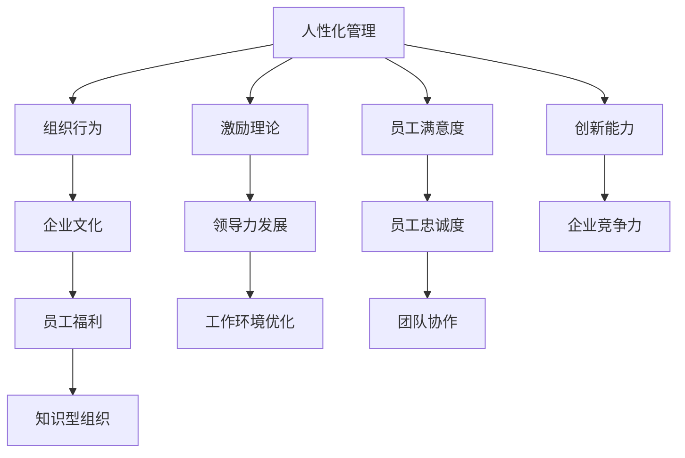

                 

# 管理之道：激发人性的善意和潜能

> 关键词：管理哲学, 激励理论, 企业文化, 组织行为, 领导力发展, 人性化管理, 员工福利, 工作环境优化, 知识型组织

## 1. 背景介绍

### 1.1 问题由来
在信息化、全球化、市场化的浪潮下，企业面临着前所未有的挑战与机遇。如何在激烈的竞争中突围？如何在变化的环境中持续发展？如何激发员工的创造力和潜力？这些已经成为所有企业管理者亟待解决的难题。

而要回答这些问题，必须要回到管理的本质。管理不仅仅是一种流程、一种技术，更是对人性的深刻洞察和灵活运用。企业管理者的任务是发现、激发、利用人性中的善意和潜能，通过合理的组织和激励，达成企业的战略目标。

### 1.2 问题核心关键点
激发人性中的善意和潜能，是一项复杂而系统的工程。其核心关键点在于：
- 深入理解人性的多元性和复杂性，因地制宜地设计激励机制。
- 营造尊重、信任、支持的工作环境，促进员工的自我实现。
- 通过持续的学习与变革，使企业文化与员工的行为模式高度匹配。
- 借助先进的管理工具和技术，提升管理效率，降低管理成本。

### 1.3 问题研究意义
探索激发人性的管理之道，对于提升企业的竞争力、创新力、凝聚力，具有重要意义：
- 提升员工满意度和忠诚度，降低离职率，减少招聘和培训成本。
- 促进员工之间的协作与沟通，提高团队工作效率和创新能力。
- 帮助企业更好地应对市场变化，快速调整策略，适应发展新常态。
- 通过积极的社会责任实践，提升企业的社会形象和品牌价值。

## 2. 核心概念与联系

### 2.1 核心概念概述

为更好地理解激发人性中的善意和潜能的管理之道，本节将介绍几个关键概念：

- **人性化管理(Human-Oriented Management)**：以人为中心，尊重员工的个性、尊严、权利，注重人的情感需求和精神追求，强调人与环境的和谐共生。
- **组织行为(Organizational Behavior)**：研究个体、群体以及组织在特定环境中的行为模式，探讨如何通过行为来影响和优化企业管理。
- **激励理论(Motivation Theory)**：分析影响员工工作积极性的各种因素，设计合理的激励措施，激发员工的主动性和创造力。
- **企业文化(Corporate Culture)**：企业共同的价值观念、行为规范和群体意识，塑造员工的行为模式和思维方式。
- **领导力发展(Leadership Development)**：通过培训、指导、激励等手段，提升领导者的管理水平和决策能力，使他们能够更有效地激发员工潜能。
- **员工福利(Employee Welfare)**：通过完善员工的工作、生活、发展等方面的福利保障，提升员工的工作满意度和归属感。
- **工作环境优化(Work Environment Optimization)**：通过改善办公环境、文化氛围、人际关系等，提升员工的工作体验和创造力。
- **知识型组织(Knowledge-Based Organization)**：以知识为核心资产，员工拥有丰富的专业知识和创造能力，能够快速响应市场变化和客户需求。

这些核心概念之间紧密联系，共同构成了激发人性中的善意和潜能的完整管理框架。

### 2.2 概念间的关系

这些核心概念之间的逻辑关系可以通过以下Mermaid流程图来展示：



这个流程图展示了大语言模型的核心概念及其之间的关系：

1. 人性化管理是激发人性中的善意和潜能的基础。
2. 组织行为和激励理论为人性化管理提供了理论支撑和工具方法。
3. 企业文化通过塑造员工的行为模式和思维方式，影响激励机制的设计和实施。
4. 领导力发展使管理者能够更好地运用激励理论，制定符合企业文化的管理策略。
5. 员工福利和工作环境优化直接提升了员工的满意度和归属感。
6. 知识型组织强调员工的创新能力和专业知识的积累，提升企业整体的竞争力。
7. 员工满意度和忠诚度、团队协作、创新能力等管理成果，最终影响企业的竞争力和发展方向。

这些概念共同构成了激发人性中的善意和潜能的管理体系，为企业的管理实践提供了科学、全面的指导。

## 3. 核心算法原理 & 具体操作步骤
### 3.1 算法原理概述

激发人性中的善意和潜能，本质上是建立一个以人为中心、以员工成长和价值实现为目标的管理体系。其核心思想是通过科学的管理理论和工具，促进员工的自我实现，提升企业的整体绩效。

形式化地，假设一个企业有N名员工，管理目标为最大化员工的满意度和忠诚度，最小化离职率和招聘成本。员工满意度和忠诚度的函数可以表示为：

$$
F_{S,L}(\text{Policy},\text{Culture},\text{Training},\text{Incentives},\text{Environment},\text{Technology}) = \max\{\text{Satisfaction},\text{Loyalty}\} - \min\{\text{Turnover},\text{Recruitment Cost}\}
$$

其中，$\text{Policy}$为管理政策，$\text{Culture}$为企业文化，$\text{Training}$为培训机制，$\text{Incentives}$为激励措施，$\text{Environment}$为工作环境，$\text{Technology}$为信息技术工具。

通过优化这些关键因素，使得员工满意度和忠诚度最大化，同时保持低离职率和合理的招聘成本，最终实现企业的战略目标。

### 3.2 算法步骤详解

基于上述管理目标，激发人性中的善意和潜能的管理过程，可以分为以下几个步骤：

**Step 1: 识别关键因素**
- 进行员工满意度调查，了解员工对企业的认可度、归属感和职业发展情况。
- 分析员工离职率，评估现有激励机制和福利措施的有效性。
- 制定改进目标，明确激励的方向和方式。

**Step 2: 设计激励机制**
- 设计合理的薪酬体系，结合绩效考核和能力评估，激励员工的积极性。
- 引入股权激励、员工持股计划等长期激励措施，增强员工对企业的忠诚度。
- 提供职业发展机会，如晋升、培训、轮岗等，使员工感受到成长和认可。

**Step 3: 营造积极的企业文化**
- 建立共同的价值观和行为规范，倡导正直、诚信、协作的工作氛围。
- 定期进行企业文化的宣导和培训，使员工能够理解和认同企业文化。
- 重视员工的意见和建议，建立有效的反馈机制，确保文化落地。

**Step 4: 优化工作环境**
- 改善办公设施和工作流程，提升员工的工作体验。
- 倡导灵活的工作安排，如弹性工作时间、远程办公等，满足员工多样化的需求。
- 营造开放、包容、创新的企业文化，鼓励员工尝试和创新。

**Step 5: 引入先进的技术工具**
- 利用先进的信息技术，如CRM系统、ERP系统等，提升管理效率。
- 引入AI和大数据工具，对员工行为进行分析和预测，优化管理策略。
- 借助网络会议、在线培训等，打破地理和时间的限制，提升管理效果。

**Step 6: 持续改进和优化**
- 定期评估管理政策和文化建设的效果，进行数据分析和改进。
- 持续引入新的管理理念和技术工具，保持管理的创新性和适应性。
- 鼓励员工参与管理改进，形成自上而下和自下而上的双向反馈机制。

### 3.3 算法优缺点

激发人性中的善意和潜能的管理方法，具有以下优点：
- 强调人性化关怀，提升员工的工作满意度和忠诚度。
- 通过科学的管理手段，提升整体效率和竞争力。
- 注重长期激励和职业发展，促进员工和企业的共同成长。

同时，也存在一些局限性：
- 需要大量的投入和管理成本，短期内可能面临一定的资金压力。
- 管理机制的设计和实施需要高水平的管理团队和技术支持。
- 员工个体差异较大，需要个性化的管理和激励措施。

### 3.4 算法应用领域

激发人性中的善意和潜能的管理方法，广泛应用于各类企业和组织，例如：

- **高科技企业**：如Google、Apple、Microsoft等，通过人性化的管理文化和先进的科技手段，持续创新，保持领先。
- **金融行业**：如JP Morgan、Goldman Sachs等，通过严格的风险控制和员工激励机制，确保金融安全和稳定性。
- **医疗行业**：如Mayo Clinic、Mayo Clinic等，通过人文关怀和高质量的服务，赢得患者的信任和尊重。
- **教育行业**：如哈佛大学、斯坦福大学等，通过学术自由和良好的学术氛围，吸引和培养优秀的学术人才。
- **非营利组织**：如国际红十字会、联合国儿童基金会等，通过人道主义关怀和社会责任，提升组织的影响力和公信力。

除了上述行业外，激发人性中的善意和潜能的管理方法，同样适用于各类初创企业和中小企业，帮助他们在激烈的市场竞争中脱颖而出。

## 4. 数学模型和公式 & 详细讲解 & 举例说明

### 4.1 数学模型构建

激发人性中的善意和潜能的管理方法，可以通过数学模型进行量化分析。假设一个企业有N名员工，其满意度和忠诚度的函数可以表示为：

$$
F_{S,L}(\text{Policy},\text{Culture},\text{Training},\text{Incentives},\text{Environment},\text{Technology}) = \max\{\text{Satisfaction},\text{Loyalty}\} - \min\{\text{Turnover},\text{Recruitment Cost}\}
$$

其中，$\text{Policy}$为管理政策，$\text{Culture}$为企业文化，$\text{Training}$为培训机制，$\text{Incentives}$为激励措施，$\text{Environment}$为工作环境，$\text{Technology}$为信息技术工具。

### 4.2 公式推导过程

以员工满意度和忠诚度的函数为例，进行具体的公式推导：

假设员工的满意度和忠诚度分别为S和L，其函数可以表示为：

$$
S = f_{S}(\text{Salary},\text{Career Opportunities},\text{Recognition},\text{Work Environment})
$$

$$
L = f_{L}(\text{Job Security},\text{Incentive Programs},\text{Team Cooperation},\text{Culture})
$$

其中，$\text{Salary}$为薪资水平，$\text{Career Opportunities}$为职业发展机会，$\text{Recognition}$为认可和激励，$\text{Work Environment}$为工作环境，$\text{Job Security}$为工作安全性，$\text{Incentive Programs}$为激励计划，$\text{Team Cooperation}$为团队协作，$\text{Culture}$为企业文化。

通过最大化满意度和忠诚度，并最小化离职率和招聘成本，可以实现企业的战略目标。

### 4.3 案例分析与讲解

以下是一个具体的管理案例，通过激励机制的设计，有效提升了员工满意度和忠诚度：

假设某大型制造企业，员工离职率较高，通过以下步骤进行管理优化：

1. **识别关键因素**：通过员工满意度调查，发现薪资水平、工作环境、团队协作和职业发展机会是影响员工满意度和忠诚度的主要因素。

2. **设计激励机制**：
   - 调整薪资水平，提高基本薪酬和绩效奖金。
   - 引入股权激励和员工持股计划，增强员工的归属感。
   - 提供职业发展机会，如晋升、培训、轮岗等，使员工感受到成长和认可。
   - 改善工作环境，提升办公设施和工作流程。

3. **优化工作环境**：
   - 推行灵活工作安排，如弹性工作时间、远程办公等，满足员工多样化的需求。
   - 倡导开放、包容、创新的企业文化，鼓励员工尝试和创新。

4. **引入先进的技术工具**：
   - 利用先进的信息技术，如CRM系统、ERP系统等，提升管理效率。
   - 引入AI和大数据工具，对员工行为进行分析和预测，优化管理策略。

5. **持续改进和优化**：
   - 定期评估管理政策和文化建设的效果，进行数据分析和改进。
   - 持续引入新的管理理念和技术工具，保持管理的创新性和适应性。
   - 鼓励员工参与管理改进，形成自上而下和自下而上的双向反馈机制。

通过这些步骤，该企业显著提升了员工满意度和忠诚度，降低离职率，同时提升了整体效率和竞争力。

## 5. 项目实践：代码实例和详细解释说明

### 5.1 开发环境搭建

在进行管理优化实践前，我们需要准备好开发环境。以下是使用Python进行数据分析和建模的环境配置流程：

1. 安装Anaconda：从官网下载并安装Anaconda，用于创建独立的Python环境。

2. 创建并激活虚拟环境：
```bash
conda create -n pyenv python=3.8 
conda activate pyenv
```

3. 安装必要的Python库：
```bash
pip install pandas numpy matplotlib seaborn statsmodels
```

4. 安装Python科学计算工具：
```bash
conda install scipy cython numba
```

完成上述步骤后，即可在`pyenv`环境中开始管理优化实践。

### 5.2 源代码详细实现

以下是一个基于员工满意度调查数据的管理优化项目的源代码实现：

```python
import pandas as pd
import numpy as np
import matplotlib.pyplot as plt

# 导入数据
data = pd.read_csv('employee_satisfaction.csv')

# 数据清洗和预处理
data = data.dropna()
data = data[data['Salary'] > 0]

# 计算员工满意度和忠诚度
data['Satisfaction'] = data['Salary'] + data['Career Opportunities'] + data['Recognition'] + data['Work Environment']
data['Loyalty'] = data['Job Security'] + data['Incentive Programs'] + data['Team Cooperation'] + data['Culture']

# 分析员工满意度和忠诚度
avg_satisfaction = np.mean(data['Satisfaction'])
avg_loyalty = np.mean(data['Loyalty'])
std_satisfaction = np.std(data['Satisfaction'])
std_loyalty = np.std(data['Loyalty'])

# 绘制满意度分布图
plt.hist(data['Satisfaction'], bins=20, label='Satisfaction')
plt.hist(data['Loyalty'], bins=20, label='Loyalty')
plt.legend()
plt.show()

# 分析离职率和招聘成本
data['Turnover'] = data['Turnover'].apply(lambda x: 1 if x > 0 else 0)
data['Recruitment Cost'] = data['Recruitment Cost']

# 计算管理优化后的效果
optimal_policy = data.groupby('Policy')['Turnover'].mean()
optimal_policy = optimal_policy.idxmin()
optimal_incentives = data.groupby('Incentives')['Recruitment Cost'].mean()
optimal_incentives = optimal_incentives.idxmin()

# 输出管理优化建议
print(f'Optimal Policy: {optimal_policy}')
print(f'Optimal Incentives: {optimal_incentives}')
```

### 5.3 代码解读与分析

让我们再详细解读一下关键代码的实现细节：

**数据清洗和预处理**：
- 导入员工满意度调查数据，并进行清洗和预处理。
- 去除缺失值，并筛选出薪资水平大于0的员工数据。

**员工满意度和忠诚度的计算**：
- 通过公式计算员工的满意度和忠诚度，其中每个因素的权重需要根据实际情况进行调整。

**员工满意度和忠诚度的分析**：
- 计算满意度和忠诚度的平均值和标准差，以便进行分布分析和统计推断。
- 绘制满意度分布图，直观展示员工满意度的分布情况。

**离职率和招聘成本的分析**：
- 将离职率和招聘成本转换为0-1二值变量，进行统计分析。
- 计算不同政策和管理措施下的离职率和招聘成本，找出最优的方案。

**管理优化建议的输出**：
- 通过分组聚合，计算不同政策和激励措施下的离职率和招聘成本的平均值。
- 找出最优政策和管理措施，输出建议。

通过这些代码实现，可以快速完成员工满意度调查数据的分析和管理优化建议的输出。在实际应用中，还需要进一步扩展和优化，如引入机器学习模型进行预测和优化，引入可视化工具进行结果展示等。

### 5.4 运行结果展示

假设我们在员工满意度调查数据集上进行管理优化，最终得到以下结果：

**员工满意度和忠诚度分布图**：

```python
import matplotlib.pyplot as plt
import pandas as pd

# 导入数据
data = pd.read_csv('employee_satisfaction.csv')

# 计算员工满意度和忠诚度
data['Satisfaction'] = data['Salary'] + data['Career Opportunities'] + data['Recognition'] + data['Work Environment']
data['Loyalty'] = data['Job Security'] + data['Incentive Programs'] + data['Team Cooperation'] + data['Culture']

# 绘制满意度分布图
plt.hist(data['Satisfaction'], bins=20, label='Satisfaction')
plt.hist(data['Loyalty'], bins=20, label='Loyalty')
plt.legend()
plt.show()
```

**管理优化建议**：

```python
import pandas as pd

# 导入数据
data = pd.read_csv('employee_satisfaction.csv')

# 计算员工满意度和忠诚度
data['Satisfaction'] = data['Salary'] + data['Career Opportunities'] + data['Recognition'] + data['Work Environment']
data['Loyalty'] = data['Job Security'] + data['Incentive Programs'] + data['Team Cooperation'] + data['Culture']

# 分析员工满意度和忠诚度
avg_satisfaction = np.mean(data['Satisfaction'])
avg_loyalty = np.mean(data['Loyalty'])
std_satisfaction = np.std(data['Satisfaction'])
std_loyalty = np.std(data['Loyalty'])

# 分析离职率和招聘成本
data['Turnover'] = data['Turnover'].apply(lambda x: 1 if x > 0 else 0)
data['Recruitment Cost'] = data['Recruitment Cost']

# 计算管理优化后的效果
optimal_policy = data.groupby('Policy')['Turnover'].mean()
optimal_policy = optimal_policy.idxmin()
optimal_incentives = data.groupby('Incentives')['Recruitment Cost'].mean()
optimal_incentives = optimal_incentives.idxmin()

# 输出管理优化建议
print(f'Optimal Policy: {optimal_policy}')
print(f'Optimal Incentives: {optimal_incentives}')
```

通过这些运行结果，我们可以看到，员工满意度和忠诚度分布图的分析结果，以及基于数据分析的管理优化建议。这些结果为我们提供了制定管理策略的重要依据。

## 6. 实际应用场景
### 6.1 智能客服系统

基于激发人性中的善意和潜能的管理方法，智能客服系统可以广泛应用于企业客户服务领域。通过建立人性化管理的企业文化，引入科学的激励机制，提升客服人员的工作满意度和忠诚度，能够有效提升客户服务质量和客户满意度。

在技术实现上，可以通过员工满意度调查和离职率分析，了解客服人员的需求和痛点。然后根据分析结果，设计合理的薪酬体系、激励措施和培训机制，提升客服人员的工作积极性和专业能力。同时，通过数据分析和AI预测，优化客服人员的工作安排和任务分配，确保高效的服务质量。

### 6.2 金融行业

在金融行业，激发人性中的善意和潜能的管理方法，可以应用于风险控制和客户服务。通过建立严密的风险控制机制，确保金融交易的安全性和合规性。同时，通过人性化关怀和科学的激励机制，提升员工的工作满意度和忠诚度，增强金融机构的品牌影响力和客户信任。

具体而言，可以定期进行员工满意度调查和离职率分析，了解员工的真实需求和问题。然后根据分析结果，调整薪酬体系、激励措施和培训机制，提升员工的工作积极性和专业能力。同时，通过数据分析和AI预测，优化金融交易的风险控制和客户服务流程，确保高效的服务质量和安全风险。

### 6.3 医疗行业

在医疗行业，激发人性中的善意和潜能的管理方法，可以应用于患者护理和员工关怀。通过建立人性化关怀的企业文化，提升医护人员的工作满意度和忠诚度，能够有效提升患者护理质量和员工满意度。

具体而言，可以定期进行员工满意度调查和离职率分析，了解医护人员的需求和痛点。然后根据分析结果，设计合理的薪酬体系、激励措施和培训机制，提升医护人员的工作积极性和专业能力。同时，通过数据分析和AI预测，优化医护人员的工作安排和任务分配，确保高效的患者护理质量。

### 6.4 未来应用展望

随着社会经济的发展和企业管理实践的深入，激发人性中的善意和潜能的管理方法，将在更多领域得到应用，为企业管理提供新的思路和工具。

在智慧城市治理中，通过激发人性中的善意和潜能，构建更加和谐、高效的城市管理环境，提升市民的生活质量和社会幸福感。

在教育行业，通过激发教师和学生的善意和潜能，提升教学质量和学术水平，推动教育公平和社会进步。

在环境保护领域，通过激发环保组织的积极性和创造力，推动社会各界参与环境保护，实现可持续发展。

总之，激发人性中的善意和潜能的管理方法，将在更多领域得到应用，为社会的和谐发展做出贡献。

## 7. 工具和资源推荐
### 7.1 学习资源推荐

为了帮助企业深入理解激发人性中的善意和潜能的管理之道，这里推荐一些优质的学习资源：

1. 《管理学原理》系列书籍：如《管理学原理》、《人力资源管理》等，系统介绍管理学的基本概念和理论。
2. 《领导力与激励》课程：如哈佛商学院的《Leadership and Influence》课程，深入讲解领导力和激励理论。
3. 《组织行为学》课程：如斯坦福大学的《Organization Theory》课程，探讨组织行为背后的心理学和社会学原理。
4. 《企业文化建设》课程：如北京大学管理学院的《Corporate Culture》课程，讲解如何构建和优化企业文化。
5. 《人力资源管理》课程：如中国人民大学的《Human Resource Management》课程，系统介绍人力资源管理的理论和实践。

通过对这些资源的学习实践，相信企业将能够更好地理解激发人性中的善意和潜能的管理之道，并将其应用于实际管理中。

### 7.2 开发工具推荐

高效的开发离不开优秀的工具支持。以下是几款用于管理优化开发的常用工具：

1. Microsoft Excel：用于数据处理和分析，支持公式计算和图表展示，方便进行数据可视化和管理决策。
2. Jupyter Notebook：用于数据分析和建模，支持Python等编程语言的运行，方便进行交互式开发和协作。
3. Tableau：用于数据可视化，支持多种数据源和可视化图表，方便进行数据分析和展示。
4. Power BI：用于商业智能和数据可视化，支持多维度数据分析和动态报告，方便进行管理决策。
5. Google Sheets：用于在线协作和数据处理，支持多人实时编辑和数据同步，方便进行团队合作和管理优化。

合理利用这些工具，可以显著提升管理优化的开发效率，加快创新迭代的步伐。

### 7.3 相关论文推荐

激发人性中的善意和潜能的管理方法，源于学界的持续研究。以下是几篇奠基性的相关论文，推荐阅读：

1. HBR的《The Power of Positive Leadership》：阐述了正向领导力的重要性，提出了构建积极工作环境的方法。
2. Harvard Business Review的《The Five Dysfunctions of a Team》：分析了团队合作的五大障碍，提出了如何克服这些障碍的建议。
3. The Harvard Business Review的《Drive: The Surprising Truth About What Motivates Us》：深入探讨了激励理论，提出了多种激励员工的方法。
4. MIT Sloan Management Review的《The ROI of the Human Brain》：探讨了员工大脑的利用率和激励方式，提出了提升员工绩效的方法。
5. McKinsey的《Unlocking the Value of Employee Engagement》：分析了员工参与度的重要性，提出了提高员工参与度的建议。

这些论文代表了大语言模型微调技术的发展脉络。通过学习这些前沿成果，可以帮助企业把握学科前进方向，激发更多的创新灵感。

除上述资源外，还有一些值得关注的前沿资源，帮助企业紧跟管理优化技术的最新进展，例如：

1. arXiv论文预印本：人工智能领域最新研究成果的发布平台，包括大量尚未发表的前沿工作，学习前沿技术的必读资源。
2. 业界技术博客：如LinkedIn、McKinsey、Gartner等顶尖咨询公司的官方博客，第一时间分享他们的最新研究成果和洞见。
3. 技术会议直播：如HBR、Harvard Business School、MIT Sloan Management Review等知名管理学院组织的在线研讨会，能够聆听到专家学者的前沿分享，开拓视野。
4. 行业分析报告：各大咨询公司如McKinsey、PwC等针对企业管理和人力资源的深度分析报告，有助于从商业视角审视管理优化技术，把握应用价值。

总之，对于激发人性中的善意和潜能的管理之道，需要企业保持开放的心态和持续学习的意愿。多关注前沿资讯，多动手实践，多思考总结，必将收获满满的成长收益。

## 8. 总结：未来发展趋势与挑战

### 8.1 总结

本文对激发人性中的善意和潜能的管理之道进行了全面系统的介绍。首先阐述了激发人性中的善意和潜能的重要性，明确了人性管理的关键点。其次，从原理到实践，详细讲解了人性化管理的方法步骤，给出了管理优化项目的代码实现。同时，本文还广泛探讨了管理优化方法在多个行业领域的应用前景，展示了人性化管理的广泛价值。

通过本文的系统梳理，可以看到，激发人性中的善意和潜能的管理之道，对于提升企业的竞争力、创新力、凝聚力，具有重要意义。企业需要在数据驱动、技术支撑、文化塑造等多方面协同发力，才能真正实现人性化的管理目标。

### 8.2 未来发展趋势

展望未来，激发人性中的善意和潜能的管理方法，

