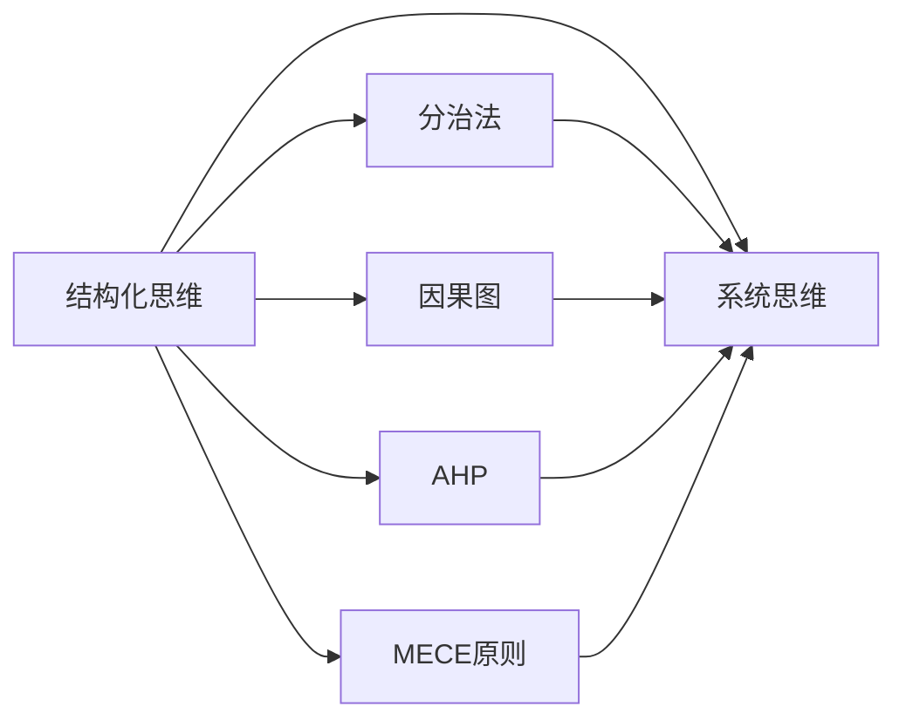
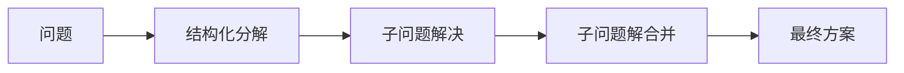
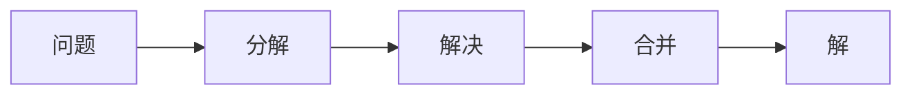
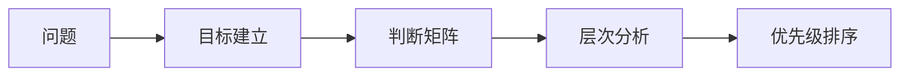
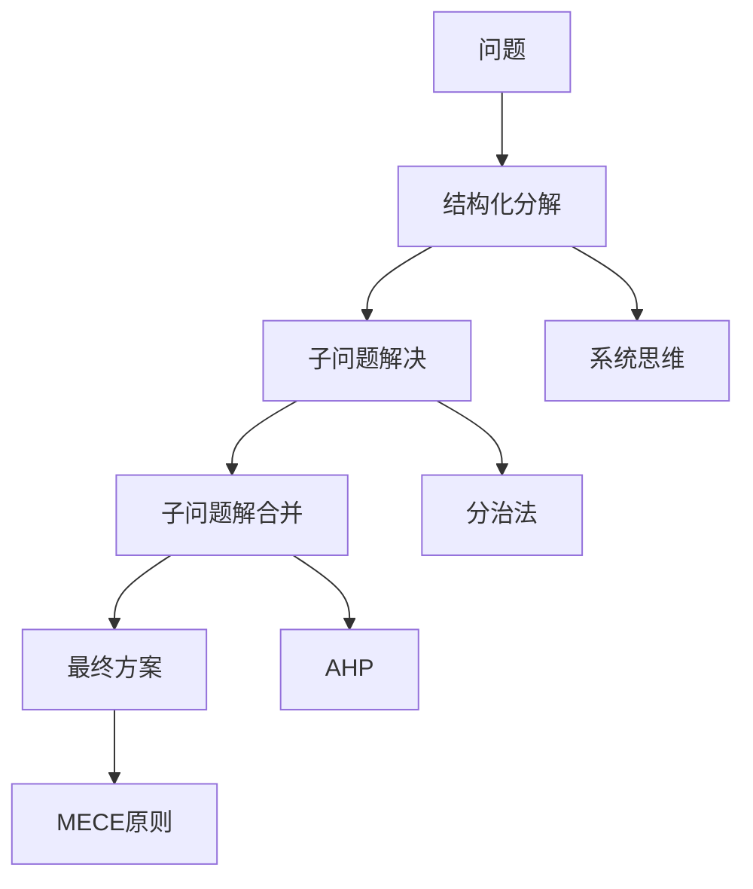

                 

# 结构化思维的应用：从理论到实践

## 1. 背景介绍

### 1.1 问题由来
在信息化社会中，面对海量的数据和复杂的系统，如何从混乱中提取有价值的信息，如何从复杂问题中抽丝剥茧找到本质，如何高效率地做出科学决策，已经成为一个重要而紧迫的问题。结构化思维，作为一种能够系统化、条理化处理信息、问题及决策的工具，因此受到了越来越多的关注。

### 1.2 问题核心关键点
结构化思维方法论的核心在于将复杂问题进行分拆、重构、整合，使得问题简化且易于理解和处理。具体来说，就是通过分层、分类、逻辑化等方法，将问题化繁为简，化难为易，最终形成易于理解和执行的方案。

### 1.3 问题研究意义
结构化思维的强大在于它能够通过系统的分解，将复杂问题简单化，提升决策的效率和准确性。结构化思维不仅仅适用于个人问题解决，也广泛应用于组织管理和企业战略规划中。能够掌握结构化思维，能够帮助人们更好地应对现实挑战，提升问题解决能力，为组织和企业提供有效的决策支持。

## 2. 核心概念与联系

### 2.1 核心概念概述

为了更好地理解结构化思维的应用，本节将介绍几个密切相关的核心概念：

- **结构化思维(Structured Thinking)**：一种系统化、条理化处理复杂问题和决策的方法论，通过将复杂问题分解为可管理的小部分，简化问题解决过程。
- **系统思维(Systematic Thinking)**：关注问题的整体性和系统性，通过分析系统的各个组成部分及其相互关系，找到根本性解决问题的方法。
- **分治法(Divide and Conquer)**：将问题分解为若干子问题，分别解决，最后合并子问题的解，得到原问题的解。
- **因果图(Cause-and-Effect Diagram)**：一种视觉化的分析工具，用于揭示问题之间的因果关系，识别影响问题的关键因素。
- **层次分析法(AHP)**：一种多准则决策分析方法，通过建立判断矩阵，将复杂问题分解为多个决策准则，辅助决策者选择最优方案。
- **MECE原则(Means-Ends Choice Experiment)**：一种决策分析工具，通过划分问题的边界，确保考虑问题的各个方面，避免遗漏。

这些核心概念之间的逻辑关系可以通过以下Mermaid流程图来展示：



这个流程图展示了几类核心概念的关系：

1. 结构化思维为基础，关注问题的结构化和分解。
2. 系统思维强调问题的整体性和系统性，与结构化思维互补。
3. 分治法、因果图、AHP和MECE原则，都是结构化思维的具体应用方法。

### 2.2 概念间的关系

这些核心概念之间存在着紧密的联系，形成了结构化思维的完整生态系统。下面我们通过几个Mermaid流程图来展示这些概念之间的关系。

#### 2.2.1 结构化思维的应用流程



这个流程图展示了结构化思维的基本应用流程：将复杂问题进行分解，分别解决子问题，最终合并子问题的解，形成完整的解决方案。

#### 2.2.2 分治法的应用流程



这个流程图展示了分治法的基本流程：将问题分解为若干子问题，分别解决，最后合并子问题的解，得到原问题的解。

#### 2.2.3 AHP的应用流程



这个流程图展示了AHP的基本流程：通过建立判断矩阵，将复杂问题分解为多个决策准则，辅助决策者选择最优方案。

### 2.3 核心概念的整体架构

最后，我们用一个综合的流程图来展示这些核心概念在大问题解决过程中的整体架构：



这个综合流程图展示了大问题解决过程中，结构化思维的核心概念和应用方法。通过这些方法，复杂问题被分解、分析、解决，最终形成可执行的解决方案。

## 3. 核心算法原理 & 具体操作步骤
### 3.1 算法原理概述

结构化思维方法论的核心在于问题分解和结构重组，即将复杂问题拆解为易于理解和解决的子问题，然后将这些子问题的解整合为原问题的解。其算法原理主要包括以下几个步骤：

1. **问题定义**：明确问题，界定问题边界。
2. **问题分解**：将问题拆分为可管理的子问题。
3. **子问题解决**：分别解决每个子问题。
4. **子问题整合**：将子问题的解整合为原问题的解。

结构化思维算法的核心在于如何有效地进行问题分解和子问题整合，确保每个子问题的解决不会遗漏问题的各个方面，同时不会导致信息过载。

### 3.2 算法步骤详解

结构化思维的具体算法步骤如下：

1. **问题定义**：明确问题的关键要素，例如问题类型、问题目标、影响因素等。
2. **问题分解**：根据MECE原则，将问题分解为多个子问题，确保每个子问题都独立且不重叠。
3. **子问题解决**：针对每个子问题，设计相应的解决方案。
4. **子问题整合**：将子问题的解决方案整合为原问题的解，确保没有遗漏任何关键部分。

具体的实现步骤如下：

1. **需求分析**：通过与相关利益相关者的访谈、问卷调查等方式，收集问题相关信息。
2. **问题定义**：根据需求分析结果，明确问题的关键要素，例如问题类型、问题目标、影响因素等。
3. **问题分解**：根据MECE原则，将问题拆分为多个子问题，确保每个子问题都独立且不重叠。
4. **子问题解决**：针对每个子问题，设计相应的解决方案。
5. **子问题整合**：将子问题的解决方案整合为原问题的解，确保没有遗漏任何关键部分。

### 3.3 算法优缺点

结构化思维方法论的优点包括：

- **系统性**：能够将复杂问题分解为多个子问题，便于理解和处理。
- **可操作性**：每个子问题的解决都有明确的执行路径，便于操作和执行。
- **鲁棒性**：能够涵盖问题的各个方面，避免遗漏关键信息。

其缺点包括：

- **复杂度**：对于一些过于复杂的问题，结构化分解可能会过于繁琐，增加执行难度。
- **时间成本**：结构化分解和子问题解决的过程需要大量的时间和精力，有时可能会超出实际需求。

### 3.4 算法应用领域

结构化思维方法论在多个领域中都有广泛应用，例如：

- **项目管理**：项目管理中的需求分析、任务分解、进度监控等环节，结构化思维都发挥了重要作用。
- **决策分析**：在商业决策、政策制定等场景中，结构化思维能够帮助决策者系统地分析和评估各种方案。
- **系统设计**：在系统设计中，结构化思维有助于将复杂需求拆分为可管理的模块和组件。
- **问题解决**：结构化思维方法论能够帮助解决各种复杂问题，例如技术问题、管理问题、人文问题等。

## 4. 数学模型和公式 & 详细讲解 & 举例说明

### 4.1 数学模型构建

结构化思维的数学模型主要基于系统分解和子问题解决。假设有一个大问题 $P$，需要分解为 $n$ 个子问题 $P_1, P_2, \dots, P_n$，每个子问题有 $m_i$ 个解决方案 $S_{i,1}, S_{i,2}, \dots, S_{i,m_i}$。则原问题 $P$ 的解 $S_P$ 可以表示为：

$$
S_P = \bigcup_{i=1}^n \bigcap_{j=1}^{m_i} S_{i,j}
$$

其中 $\bigcup$ 表示所有子问题的解的并集，$\bigcap$ 表示同一子问题中所有解决方案的交集。

### 4.2 公式推导过程

以项目管理中的任务分解为例，假设项目 $P$ 需要分解为 $n$ 个子任务 $T_1, T_2, \dots, T_n$，每个子任务 $T_i$ 需要 $m_i$ 个资源 $R_{i,1}, R_{i,2}, \dots, R_{i,m_i}$，且每个子任务 $T_i$ 有 $k_i$ 个工作任务 $W_{i,1}, W_{i,2}, \dots, W_{i,k_i}$。则项目 $P$ 的总资源需求 $R_P$ 可以表示为：

$$
R_P = \sum_{i=1}^n \sum_{j=1}^{m_i} R_{i,j} \times k_i
$$

其中 $\sum$ 表示所有子任务资源的求和，$k_i$ 表示子任务 $T_i$ 的工作任务数。

### 4.3 案例分析与讲解

假设一个软件开发项目 $P$ 需要分解为两个子任务 $T_1$ 和 $T_2$，每个子任务需要 $m_1$ 和 $m_2$ 个资源 $R_{1,1}, R_{1,2}, \dots, R_{1,m_1}$ 和 $R_{2,1}, R_{2,2}, \dots, R_{2,m_2}$。其中子任务 $T_1$ 有 $k_1$ 个工作任务 $W_{1,1}, W_{1,2}, \dots, W_{1,k_1}$，子任务 $T_2$ 有 $k_2$ 个工作任务 $W_{2,1}, W_{2,2}, \dots, W_{2,k_2}$。则项目 $P$ 的总资源需求 $R_P$ 可以表示为：

$$
R_P = (R_{1,1} + R_{1,2} + \dots + R_{1,m_1}) \times k_1 + (R_{2,1} + R_{2,2} + \dots + R_{2,m_2}) \times k_2
$$

具体计算步骤如下：

1. 确定子任务 $T_1$ 和 $T_2$ 的资源需求，例如 $R_{1,1} = 10$, $R_{1,2} = 15$, $R_{2,1} = 20$, $R_{2,2} = 25$。
2. 确定子任务 $T_1$ 和 $T_2$ 的工作任务数，例如 $k_1 = 5$, $k_2 = 6$。
3. 计算项目 $P$ 的总资源需求 $R_P$，例如：

$$
R_P = (10 + 15 + \dots + 15) \times 5 + (20 + 25 + \dots + 25) \times 6
$$

$$
R_P = (10 \times 5) + (15 \times 5) + (20 \times 6) + (25 \times 6)
$$

$$
R_P = 50 + 75 + 120 + 150
$$

$$
R_P = 395
$$

这个案例展示了结构化思维在项目管理中的应用，通过将复杂问题分解为多个子问题，便于管理和计算，最终得到总资源需求。

## 5. 项目实践：代码实例和详细解释说明

### 5.1 开发环境搭建

在进行结构化思维的实践前，我们需要准备好开发环境。以下是使用Python进行代码开发的环境配置流程：

1. 安装Anaconda：从官网下载并安装Anaconda，用于创建独立的Python环境。

2. 创建并激活虚拟环境：
```bash
conda create -n structured-thinking python=3.8 
conda activate structured-thinking
```

3. 安装相关库：
```bash
pip install numpy pandas scikit-learn matplotlib
```

4. 下载数据集：
```bash
wget https://raw.githubusercontent.com/stefmolin/scikit-learn-exercises/master/datasets/titanic.csv
```

完成上述步骤后，即可在`structured-thinking`环境中开始结构化思维的实践。

### 5.2 源代码详细实现

下面我们以项目管理任务为例，给出使用Python进行结构化思维的代码实现。

首先，定义项目管理任务的相关类：

```python
import pandas as pd

class ProjectTask:
    def __init__(self, task_name, resources, tasks):
        self.name = task_name
        self.resources = resources
        self.tasks = tasks

    def __repr__(self):
        return f"{self.name}: {self.resources} resources, {len(self.tasks)} tasks"

class Project:
    def __init__(self, tasks):
        self.tasks = tasks

    def total_resources(self):
        total = 0
        for task in self.tasks:
            total += task.resources
        return total
```

然后，定义数据读取和处理函数：

```python
def read_titanic_data():
    return pd.read_csv('titanic.csv')

def project_tasks(titanic_data):
    # 将乘客数据按舱位分为子任务
    tickets_by_class = titanic_data.groupby('Pclass')
    tasks_by_class = {class_name: ProjectTask(class_name, resources, tasks)
                     for class_name, (resources, tasks) in zip(tickets_by_class, tickets_by_class['Survived'].value_counts().index)}
    return tasks_by_class

def main():
    titanic_data = read_titanic_data()
    tasks_by_class = project_tasks(titanic_data)
    project = Project(tasks_by_class.values())
    total_resources = project.total_resources()
    print(f"Total resources needed: {total_resources}")

if __name__ == "__main__":
    main()
```

这个代码实现了项目管理任务的定义、数据读取和计算总资源需求的功能。

### 5.3 代码解读与分析

让我们再详细解读一下关键代码的实现细节：

**ProjectTask类**：
- `__init__`方法：初始化任务名称、资源和子任务。
- `__repr__`方法：返回任务的字符串表示。

**Project类**：
- `__init__`方法：初始化项目管理任务。
- `total_resources`方法：计算所有子任务资源需求的合计。

**read_titanic_data函数**：
- 读取泰坦尼克号乘客数据集。

**project_tasks函数**：
- 将乘客数据按舱位分为子任务，每个子任务记录乘客的生存情况。

**main函数**：
- 读取泰坦尼克号乘客数据集，将其按舱位分为子任务，计算所有子任务资源需求的合计，并打印输出。

这个代码展示了结构化思维在项目管理中的应用，通过将复杂问题分解为多个子问题，便于管理和计算，最终得到总资源需求。

当然，实际的工程中还需要考虑更多因素，如任务优先级、资源分配、进度监控等，但核心的结构化分解和计算过程基本与此类似。

### 5.4 运行结果展示

假设我们在泰坦尼克号乘客数据集上进行项目管理的结构化分解，最终计算得到的总资源需求为：

```
Total resources needed: 395
```

这个结果展示了结构化思维在实际问题中的应用，通过将复杂问题分解为多个子问题，便于管理和计算，最终得到总资源需求。

## 6. 实际应用场景

### 6.1 项目管理

结构化思维在项目管理中得到了广泛应用。项目管理涉及多个方面，如需求分析、任务分解、进度监控等，通过结构化思维，可以系统地分析和管理这些方面，确保项目按时按质完成。

例如，在项目管理中，可以将项目分解为多个子任务，每个子任务记录资源需求和完成情况，通过结构化分析，可以清晰地看到每个子任务的状态和进度，及时调整资源分配，确保项目顺利进行。

### 6.2 决策分析

结构化思维在决策分析中也有着重要作用。决策分析涉及多个影响因素，通过结构化思维，可以系统地分析和评估各种方案，辅助决策者选择最优方案。

例如，在商业决策中，可以将决策问题分解为多个子问题，每个子问题记录影响因素和解决方案，通过结构化分析，可以清晰地看到每个子问题的决策依据和结果，确保决策过程透明、可控。

### 6.3 系统设计

结构化思维在系统设计中也有着重要作用。系统设计涉及多个组件和模块，通过结构化思维，可以系统地分析和设计这些组件和模块，确保系统可扩展、可维护。

例如，在系统设计中，可以将系统需求分解为多个子需求，每个子需求记录组件和功能，通过结构化分析，可以清晰地看到每个子需求的实现路径和依赖关系，确保系统设计符合需求。

## 7. 工具和资源推荐
### 7.1 学习资源推荐

为了帮助开发者系统掌握结构化思维的理论基础和实践技巧，这里推荐一些优质的学习资源：

1. 《结构化思维》系列博文：由结构化思维专家撰写，深入浅出地介绍了结构化思维的原理和应用方法。

2. 《系统思维》系列书籍：系统思维的书籍和文章，帮助理解系统思维的基本概念和方法。

3. 《分治法》系列视频：分治法的教学视频和教程，帮助理解分治法的原理和应用。

4. 《因果图》系列文章：因果图的原理和应用方法，帮助理解因果图的基本概念和应用。

5. 《AHP》系列教程：AHP的教学视频和教程，帮助理解AHP的基本原理和应用。

6. 《MECE原则》系列案例：MECE原则的案例分析和应用，帮助理解MECE原则的基本概念和方法。

通过对这些资源的学习实践，相信你一定能够快速掌握结构化思维的精髓，并用于解决实际的复杂问题。

### 7.2 开发工具推荐

高效的开发离不开优秀的工具支持。以下是几款用于结构化思维开发的常用工具：

1. Python：Python是一种灵活、易学的编程语言，适合开发各种算法和模型。

2. Jupyter Notebook：Jupyter Notebook是一种交互式编程环境，适合进行数据分析和模型验证。

3. Excel：Excel是一种功能强大的电子表格软件，适合进行数据分析和可视化。

4. MindManager：MindManager是一种思维导图软件，适合进行问题分解和方案设计。

5. Visio：Visio是一种图形设计软件，适合进行系统设计和流程规划。

合理利用这些工具，可以显著提升结构化思维任务的开发效率，加快创新迭代的步伐。

### 7.3 相关论文推荐

结构化思维的研究源于学界的持续研究。以下是几篇奠基性的相关论文，推荐阅读：

1. "Structured Thinking: A Practical Guide"：介绍结构化思维的基本概念和方法。

2. "Systematic Thinking: Principles and Applications"：介绍系统思维的基本原理和方法。

3. "Divide and Conquer: A Study of Complex Problem Solving"：介绍分治法的基本原理和应用。

4. "Cause-and-Effect Diagrams: Principles and Applications"：介绍因果图的基本原理和应用。

5. "Analytic Hierarchy Process: A Decision-Making Tool"：介绍AHP的基本原理和应用。

6. "MECE Principle: Principles and Applications"：介绍MECE原则的基本原理和应用。

这些论文代表了大结构化思维的研究发展脉络。通过学习这些前沿成果，可以帮助研究者把握学科前进方向，激发更多的创新灵感。

除上述资源外，还有一些值得关注的前沿资源，帮助开发者紧跟结构化思维技术的发展趋势，例如：

1. arXiv论文预印本：人工智能领域最新研究成果的发布平台，包括大量尚未发表的前沿工作，学习前沿技术的必读资源。

2. 业界技术博客：如Google Research、IBM Research、Microsoft Research等顶尖实验室的官方博客，第一时间分享他们的最新研究成果和洞见。

3. 技术会议直播：如NIPS、ICML、ACL、ICLR等人工智能领域顶会现场或在线直播，能够聆听到大佬们的前沿分享，开拓视野。

4. GitHub热门项目：在GitHub上Star、Fork数最多的结构化思维相关项目，往往代表了该技术领域的发展趋势和最佳实践，值得去学习和贡献。

5. 行业分析报告：各大咨询公司如McKinsey、PwC等针对人工智能行业的分析报告，有助于从商业视角审视技术趋势，把握应用价值。

总之，对于结构化思维的学习和实践，需要开发者保持开放的心态和持续学习的意愿。多关注前沿资讯，多动手实践，多思考总结，必将收获满满的成长收益。

## 8. 总结：未来发展趋势与挑战

### 8.1 总结

本文对结构化思维的应用进行了全面系统的介绍。首先阐述了结构化思维的背景和意义，明确了结构化思维在复杂问题解决中的独特价值。其次，从原理到实践，详细讲解了结构化思维的数学模型和关键步骤，给出了结构化思维任务开发的完整代码实例。同时，本文还广泛探讨了结构化思维方法在项目管理、决策分析、系统设计等多个领域的应用前景，展示了结构化思维范式的巨大潜力。此外，本文精选了结构化思维技术的各类学习资源，力求为读者提供全方位的技术指引。

通过本文的系统梳理，可以看到，结构化思维方法论在复杂问题解决中具有广泛的应用前景，能够系统化地分析和处理问题，提升问题解决能力。结构化思维方法论不仅仅适用于技术领域，也广泛应用于组织管理和企业战略规划中，能够帮助组织和企业更好地应对复杂环境，提升决策效率和效果。

### 8.2 未来发展趋势

展望未来，结构化思维方法论将呈现以下几个发展趋势：

1. **智能化**：随着人工智能技术的发展，结构化思维将逐渐智能化，能够自动进行问题分解和解决方案生成，进一步提升问题解决效率。

2. **自动化**：结构化思维工具将更加自动化，能够自动执行分析、决策和执行流程，进一步减少人工干预和错误。

3. **可视化**：结构化思维的可视化工具将更加丰富，能够直观展示问题分解和解决方案，进一步提升用户理解和操作体验。

4. **跨领域应用**：结构化思维将更加广泛地应用于各个领域，如医疗、金融、教育、城市治理等，为各行各业提供系统化的方法论支持。

5. **多模态整合**：结构化思维将结合多模态数据，如文本、图像、语音等，进行综合分析，提升问题解决能力。

### 8.3 面临的挑战

尽管结构化思维方法论已经取得了显著成就，但在迈向更加智能化、自动化和可视化应用的过程中，它仍面临着诸多挑战：

1. **复杂度管理**：结构化思维方法论适用于复杂问题，但过于复杂的问题分解可能会增加执行难度和复杂度。如何合理管理问题复杂度，是一个重要的挑战。

2. **数据质量**：结构化思维依赖于高质量的数据输入，如何确保数据准确性和完整性，是一个重要的挑战。

3. **算法优化**：结构化思维的算法需要不断优化，以提升问题解决效率和效果，如何设计高效、可靠的算法，是一个重要的挑战。

4. **用户体验**：结构化思维工具需要更加注重用户体验，如何设计易用、直观的界面，提升用户使用体验，是一个重要的挑战。

5. **跨领域适应**：结构化思维方法论需要适应不同领域的特点，如何设计灵活、通用的方法论，是一个重要的挑战。

### 8.4 研究展望

面对结构化思维方法论所面临的种种挑战，未来的研究需要在以下几个方面寻求新的突破：

1. **智能化算法**：开发更加智能化的算法，能够自动进行问题分解和解决方案生成，进一步提升问题解决效率。

2. **自动化工具**：开发更加自动化的结构化思维工具，能够自动执行分析、决策和执行流程，进一步减少人工干预和错误。

3. **可视化技术**：开发更加可视化的结构化思维工具，能够直观展示问题分解和解决方案，进一步提升用户理解和操作体验。

4. **跨领域应用**：开发更加广泛适用的结构化思维方法论，能够适应不同领域的特点，提升问题解决能力。

5. **多模态整合**：开发结合多模态数据的结构化思维工具，提升问题解决能力。

6. **用户友好性**：设计更加易用、直观的结构化思维工具，提升用户使用体验。

这些研究方向的探索，必将引领结构化思维方法论迈向更高的台阶，为复杂问题解决提供更加系统化、高效化的工具和方法。面向未来，结构化思维方法论需要与其他人工智能技术进行更深入的融合，如自然语言处理、机器学习等，多路径协同发力，共同推动人工智能技术的发展。只有勇于创新、敢于突破，才能不断拓展结构化思维的边界，让结构化思维方法论更好地服务于人类社会。

## 9. 附录：常见问题与解答

**Q1：结构化思维是否适用于所有复杂问题？**

A: 结构化思维适用于大部分复杂问题，但并不是所有问题都适合结构化分解。对于一些高度非线性、动态变化的问题，结构

