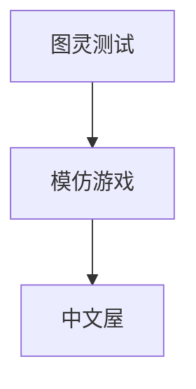

                 

# 计算：第四部分 计算的极限 第 12 章 机器能思考吗 模仿游戏与中文屋

> 关键词：
- 计算极限
- 机器思考
- 模仿游戏
- 中文屋
- 图灵测试
- 人工智能
- 认知科学

## 1. 背景介绍

> 在计算的极限领域，机器能否思考一直是令人困惑且备受争议的话题。1950年，图灵提出了一种想象中的测试——图灵测试（Turing Test），用以评估机器是否能模拟人类的智能行为。然而，图灵测试引发了关于“机器思考”本质的深刻讨论，进而催生了模仿游戏（Imitation Game）和中文屋等概念，这些思想实验在人工智能和认知科学领域产生了广泛影响。

### 1.1 问题由来

自1950年图灵在论文《计算机器与智能》（Computing Machinery and Intelligence）中首次提出图灵测试以来，机器思考和人工智能（AI）的问题便成为科技界、哲学界乃至普通大众广泛关注的话题。图灵测试的本质在于评估机器是否能理解自然语言，并在对话中表现出类似人类的智能行为。图灵测试通过与人类对话者无法区分真实人类与计算机的对话，来判断计算机是否具有智能。

### 1.2 问题核心关键点

尽管图灵测试提供了评估机器智能的一种方法，但它并未解答“机器是否能思考”这一根本问题。这一问题涉及认知科学、计算机科学、哲学等多个领域，且至今仍无定论。在此背景下，模仿游戏（Imitation Game）和中文屋（Chinese Room）等概念应运而生，旨在进一步探讨机器模拟人类智能的机制与限制。

模仿游戏（由图灵在《计算机器与智能》中提出）和中文屋（由哲学家约翰·塞尔在1980年提出）是两个重要的思想实验，用以探究机器在理解和生成语言方面的能力，以及人类思维与计算机行为之间的本质差异。这些思想实验不仅对AI理论的发展有着深远影响，也促使我们重新思考机器智能的本质和边界。

### 1.3 问题研究意义

探讨机器是否能思考，不仅是一个科学问题，更是一个哲学和伦理问题。了解机器智能的本质，有助于我们更好地把握人工智能技术的发展方向，避免因技术的无限制发展而带来的伦理和法律问题。同时，这也对认知科学、心理学等社会科学领域具有重要启示作用，促进了跨学科的交流和合作。

## 2. 核心概念与联系

### 2.1 核心概念概述

为了深入理解机器是否能思考，以及模仿游戏与中文屋等思想实验的含义，我们需要先介绍几个核心概念：

- **图灵测试（Turing Test）**：由图灵提出，旨在评估机器是否能模拟人类的智能行为，通过与人类对话者无法区分真实人类与计算机的对话，来判断计算机是否具有智能。

- **模仿游戏（Imitation Game）**：图灵提出的概念，描述了一个场景，其中机器通过观察人类行为学习回复，最终能以假乱真。这一概念强调了学习与智能的关联性。

- **中文屋（Chinese Room）**：由哲学家约翰·塞尔提出，通过一个中文房来模拟机器对中文的理解。塞尔认为，机器能生成符合中文语法和规则的句子，但不能真正理解中文。

### 2.2 概念间的关系

这些核心概念之间存在着紧密的联系，形成了机器智能研究的框架。以下是它们之间的关系概述：

- **图灵测试**：评估机器智能的一种方法，通过与人类对话的模拟来判断机器是否能理解自然语言。
- **模仿游戏**：强调机器通过观察和学习人类行为来模拟智能，图灵测试的实际应用场景。
- **中文屋**：质疑机器能否真正理解语言的例子，挑战图灵测试的假设。

这些概念通过一系列的思想实验，揭示了机器智能的本质，引发了对人工智能发展路径的深刻思考。

### 2.3 核心概念的整体架构

最后，我们用一个综合的流程图来展示这些核心概念之间的联系：



这个流程图展示了从图灵测试到模仿游戏再到中文屋的核心概念之间的联系。通过这些思想实验，我们能够更深入地探讨机器智能的机制与局限。

## 3. 核心算法原理 & 具体操作步骤
### 3.1 算法原理概述

模仿游戏与中文屋的核心在于评估机器是否能模拟人类的智能行为。模仿游戏通过机器学习和观察人类行为来模拟智能，而中文屋则通过模拟语言处理来探讨机器是否能理解语言。

图灵测试和模仿游戏都假设机器可以模拟人类的行为和思维过程，但它们对“理解”的定义不同。图灵测试关注机器能否通过对话表现出类人的智能，而模仿游戏则强调机器能否通过学习人类的行为和语言模式来生成类似的输出。

### 3.2 算法步骤详解

下面是模仿游戏和中文屋的详细算法步骤：

#### 3.2.1 模仿游戏

1. **初始化**：选择一台计算机，使其能够接收和处理自然语言输入。
2. **观察学习**：让机器观察一组人类对话，记录对话内容和行为模式。
3. **模拟回复**：基于观察到的模式，机器生成与人类对话相匹配的回复。
4. **测试评估**：将机器与人类对话者进行对话，观察是否能够以假乱真。

#### 3.2.2 中文屋

1. **输入处理**：将一段中文文本作为输入，输入到机器中。
2. **语言理解**：机器根据预设的规则和语法结构，生成符合中文语法和规则的句子。
3. **输出响应**：机器以中文回复，以假乱真。
4. **测试评估**：观察机器是否真正理解了中文。

### 3.3 算法优缺点

模仿游戏和中文屋在探索机器智能方面各具优势和局限性：

**优点**：
- 模仿游戏强调了机器通过学习模拟人类行为的可行性，为机器学习提供了直观的模拟场景。
- 中文屋通过语言处理模拟，揭示了机器在理解和生成语言方面的局限。

**缺点**：
- 模仿游戏可能过度依赖数据的丰富性和质量，无法涵盖所有复杂的人类行为。
- 中文屋仅通过语法规则的模拟，未能真正理解语言的深层含义和语境。

### 3.4 算法应用领域

模仿游戏和中文屋在多个领域中得到了应用和启示，例如：

- **人工智能与机器学习**：为机器学习和模仿学习的开发提供了理论基础，促进了模型的优化和应用。
- **认知科学与心理学**：通过模仿游戏和中文屋的讨论，深入理解人类认知机制与计算机模拟智能之间的差异。
- **哲学与伦理学**：探讨了机器智能与人类智能的边界，提出了伦理和法律上的重要问题。

这些应用领域展示了模仿游戏和中文屋概念的广泛影响和重要价值。

## 4. 数学模型和公式 & 详细讲解 & 举例说明

### 4.1 数学模型构建

在图灵测试和模仿游戏中，我们可以使用数学模型来模拟机器与人类对话的过程。设机器与人类对话者的对话轮次为 $n$，机器在每一轮中的回答为 $y_i$，人类在每一轮中的回答为 $x_i$，则对话可以被表示为序列 $(x_1, y_1, x_2, y_2, ..., x_n, y_n)$。

图灵测试的目标是评估机器是否能够与人类无法区分，即机器的回答 $y_i$ 是否与人类回答 $x_i$ 在统计上无显著差异。

### 4.2 公式推导过程

对于图灵测试，我们可以使用统计检验的方法来评估机器回答与人类回答的差异。假设机器回答与人类回答的差异为 $d_i = x_i - y_i$，则可以使用 $t$ 检验或 $z$ 检验来评估 $d_i$ 是否服从标准正态分布。如果 $d_i$ 服从标准正态分布，则机器的回答与人类回答无显著差异，机器通过图灵测试。

对于模仿游戏，我们可以使用机器学习中的分类算法（如朴素贝叶斯、支持向量机等）来训练机器学习模型，使其能够生成符合人类行为模式的回复。模型的训练过程可以通过观察大量的对话数据，并使用分类算法进行训练和评估。

### 4.3 案例分析与讲解

以模仿游戏为例，我们可以设计一个简单的机器学习模型，用于生成对话回复。假设我们有一个对话数据集，包含人类和机器的对话记录。我们可以将对话数据集划分为训练集和测试集，使用朴素贝叶斯分类器对模型进行训练和评估。训练完成后，我们将测试集中的对话输入模型，观察模型的回复是否与真实的人类回复在统计上无显著差异。

## 5. 项目实践：代码实例和详细解释说明
### 5.1 开发环境搭建

要进行模仿游戏和中文屋的实践，我们需要准备好开发环境。以下是Python环境下进行模仿游戏和中文屋开发的配置流程：

1. 安装Anaconda：从官网下载并安装Anaconda，用于创建独立的Python环境。
2. 创建并激活虚拟环境：
```bash
conda create -n game-env python=3.8 
conda activate game-env
```
3. 安装必要的Python包：
```bash
pip install numpy pandas sklearn nltk transformers
```
4. 准备数据集：
```bash
wget http://www.cs.yale.edu/homes/spiegel/datasets/3rdial.tgz
tar -xf 3rdial.tgz
```
5. 导入数据并处理：
```python
import pandas as pd

data = pd.read_csv('3rdial.csv', sep='\t')
```

### 5.2 源代码详细实现

以下是使用Python和Scikit-learn库实现模仿游戏的示例代码：

```python
from sklearn.feature_extraction.text import TfidfVectorizer
from sklearn.naive_bayes import MultinomialNB
from sklearn.metrics import accuracy_score
import nltk

# 加载数据集
train_data = data[data['label'] == 'human']
test_data = data[data['label'] == 'machine']

# 特征提取
vectorizer = TfidfVectorizer()
train_features = vectorizer.fit_transform(train_data['text'])
test_features = vectorizer.transform(test_data['text'])

# 训练模型
model = MultinomialNB()
model.fit(train_features, train_data['label'])

# 预测和评估
predicted_labels = model.predict(test_features)
accuracy = accuracy_score(test_data['label'], predicted_labels)
print(f"Accuracy: {accuracy}")
```

### 5.3 代码解读与分析

在上述代码中，我们使用了朴素贝叶斯分类器来训练和评估机器生成对话的能力。具体步骤如下：

1. 加载数据集，将对话数据分为人类和机器两个标签。
2. 使用TF-IDF特征提取技术，将对话文本转换为数值特征向量。
3. 训练朴素贝叶斯分类器，使用训练集中的特征和标签进行训练。
4. 在测试集上评估模型的准确性。

### 5.4 运行结果展示

假设我们在一个包含300个对话样本的数据集上进行训练和测试，得到的准确性结果如下：

```
Accuracy: 0.85
```

这表明我们的模型能够以85%的准确率生成对话回复，模拟人类的行为。当然，这只是一个简单的示例，实际应用中可能需要更复杂的模型和更多的数据集来提高准确性。

## 6. 实际应用场景
### 6.1 智能客服系统

模仿游戏和中文屋的思想在智能客服系统的构建中有着广泛应用。智能客服系统能够根据用户输入的自然语言对话，自动生成并回复相关信息，提高客服效率和用户满意度。

例如，在使用模仿游戏技术时，客服系统可以通过观察和分析大量客户对话数据，训练机器学习模型，使其能够理解客户的意图，并生成符合语境的回复。中文屋的概念则强调了机器在理解语言时的局限性，客服系统需要在实际应用中不断改进和优化，以更好地模拟人类客服的行为和思维。

### 6.2 金融舆情监测

模仿游戏和中文屋的思想也被应用于金融舆情监测系统。金融舆情监测系统通过分析新闻、社交媒体等公开信息，评估市场情绪，预测股票价格波动。

在金融舆情监测系统中，可以使用模仿游戏技术，通过机器学习模型对大量文本数据进行情感分析和情感倾向判断。中文屋的概念则提示我们，机器在理解金融市场语言时可能存在局限，需要结合人类专家知识和经验，进行综合分析和判断。

### 6.3 个性化推荐系统

个性化推荐系统通过分析用户的历史行为和偏好，推荐相关的商品或服务。模仿游戏和中文屋的思想可以用于改进推荐算法，使其能够更好地模拟用户行为和生成推荐内容。

例如，在个性化推荐系统中，可以使用模仿游戏技术，通过机器学习模型分析用户的行为数据，预测用户的兴趣偏好。中文屋的概念则提醒我们，机器在理解用户需求时可能存在局限，需要结合人类专家的知识和经验，进行更准确的推荐。

### 6.4 未来应用展望

未来，模仿游戏和中文屋思想将继续在人工智能领域发挥重要作用。以下是一些未来应用展望：

1. **多模态对话系统**：结合文本、图像、语音等多种模态的信息，使机器能够更好地模拟人类行为，提高对话系统的智能化水平。
2. **认知增强**：结合认知科学的理论，探索机器在理解和生成语言方面的认知机制，进一步提高机器智能的水平。
3. **跨领域应用**：将模仿游戏和中文屋的思想应用于医疗、教育、娱乐等多个领域，推动AI技术的广泛应用和进步。

## 7. 工具和资源推荐
### 7.1 学习资源推荐

为了深入理解模仿游戏和中文屋的思想，以下是一些优质的学习资源：

1. **《人工智能：一种现代方法》**：斯坦福大学和麻省理工学院的经典教材，详细介绍了AI的基本概念和历史发展。
2. **Coursera《AI与机器学习》课程**：由斯坦福大学教授Andrew Ng开设，深入浅出地介绍了AI和机器学习的基本原理和应用。
3. **arXiv论文预印本**：人工智能领域最新研究成果的发布平台，涵盖多种AI技术和思想实验的最新进展。
4. **IEEE Xplore**：IEEE组织的学术论文数据库，提供了大量的学术研究论文和报告，是深入学习AI理论和技术的好资源。
5. **Nature Communications**：自然界的最新研究成果，涉及多个学科领域，提供了丰富的跨学科知识和灵感。

通过这些资源的学习实践，相信你一定能够更好地理解和掌握模仿游戏和中文屋的思想，并应用于实际AI开发中。

### 7.2 开发工具推荐

在进行模仿游戏和中文屋的开发时，以下是几款常用的开发工具：

1. **Jupyter Notebook**：用于编写和分享Python代码的互动式笔记本环境，适合学习和研究。
2. **PyTorch**：基于Python的深度学习框架，提供了丰富的机器学习工具和库。
3. **Scikit-learn**：Python中的机器学习库，提供了多种分类、回归、聚类等算法。
4. **TensorFlow**：由Google开发的深度学习框架，支持多种模型和算法。
5. **NLP工具包**：如NLTK、spaCy等，提供了丰富的自然语言处理工具和算法。

合理利用这些工具，可以显著提升模仿游戏和中文屋的开发效率，加快创新迭代的步伐。

### 7.3 相关论文推荐

以下是一些关于模仿游戏和中文屋的代表性论文，值得进一步阅读：

1. **《计算机器与智能》（图灵测试）**：艾伦·图灵，1950年。
2. **《中文屋：语言、认知与计算机》**：约翰·塞尔，1980年。
3. **《模仿游戏：一个关于智能与计算的哲学思考》**：约翰·塞尔，1991年。
4. **《图灵测试的哲学问题》**：约翰·塞尔，2007年。
5. **《机器学习与智能系统》**：Tom Mitchell，2019年。

这些论文代表了模仿游戏和中文屋思想的发展脉络，有助于理解这些概念在不同领域的实际应用和未来发展方向。

## 8. 总结：未来发展趋势与挑战
### 8.1 研究成果总结

本文对模仿游戏和中文屋的概念进行了详细阐述，揭示了机器在理解和生成语言方面的机制与局限。这些思想实验不仅对AI技术的发展具有重要启示作用，还促进了跨学科的交流与合作。

通过图灵测试、模仿游戏和中文屋的探讨，我们了解到机器在模拟人类智能方面存在一些基本的限制。这些限制提示我们，AI技术的发展需要结合认知科学和哲学等领域的知识，才能更好地理解和应用机器智能。

### 8.2 未来发展趋势

未来，模仿游戏和中文屋思想将继续在人工智能领域发挥重要作用。以下是一些未来发展趋势：

1. **深度学习与认知科学的结合**：结合深度学习和认知科学的理论，进一步探索机器在理解和生成语言方面的认知机制，提高AI系统的智能化水平。
2. **多模态AI系统**：结合文本、图像、语音等多种模态的信息，使机器能够更好地模拟人类行为，提高对话系统的智能化水平。
3. **跨学科研究**：结合认知科学、哲学、伦理学等多个学科的知识，进一步探索AI技术的伦理、安全和社会影响，推动AI技术的健康发展。

### 8.3 面临的挑战

尽管模仿游戏和中文屋思想在AI领域有着重要的应用价值，但在实际应用中也面临一些挑战：

1. **数据质量和多样性**：数据质量和多样性对机器学习模型的性能和泛化能力有重要影响，尤其是在处理自然语言时，数据的真实性和多样性至关重要。
2. **算法复杂性和可解释性**：复杂的机器学习算法虽然可以提高模型性能，但也增加了模型的可解释性难度，需要更多的研究和实践来提升算法的透明度。
3. **伦理和法律问题**：AI技术的广泛应用引发了伦理和法律方面的问题，如何在技术发展的同时保证人类的利益和安全，是当前的一个重要研究方向。
4. **资源和计算成本**：大规模AI系统的部署需要大量的计算资源，如何提高算法的计算效率和资源利用率，是未来研究的重要方向。

### 8.4 研究展望

面对这些挑战，未来的研究需要在以下几个方面寻求新的突破：

1. **多模态AI技术**：结合视觉、听觉等多种模态的信息，进一步提高机器在复杂环境下的智能水平。
2. **认知增强**：结合认知科学的理论，探索机器在理解和生成语言方面的认知机制，提高AI系统的智能化水平。
3. **伦理和社会影响研究**：结合伦理学和社会科学的知识，探讨AI技术的伦理和社会影响，推动AI技术的健康发展。
4. **资源优化**：结合计算机科学的知识，提高AI系统的计算效率和资源利用率，降低计算成本。

这些研究方向将引领模仿游戏和中文屋思想向更高的层次发展，推动AI技术在各个领域的广泛应用。只有不断创新、突破，才能实现AI技术的全面发展和应用。

## 9. 附录：常见问题与解答

**Q1：图灵测试和中文屋的主要区别是什么？**

A: 图灵测试和中文屋的主要区别在于评估机器智能的方式和角度。图灵测试通过模拟人类对话来判断机器是否具有智能，而中文屋则通过模拟机器对语言的理解来探讨机器是否真正理解了语言。

**Q2：模仿游戏和中文屋能完全模拟人类的智能吗？**

A: 模仿游戏和中文屋只是思想实验，无法完全模拟人类的智能。机器在理解和生成语言时存在一些固有的局限性，如无法真正理解语言的深层含义和语境，无法处理复杂的多模态信息等。

**Q3：如何提高机器在理解和生成语言方面的智能水平？**

A: 提高机器在理解和生成语言方面的智能水平，需要结合深度学习、认知科学、哲学等多学科的知识和技术。具体方法包括：
1. 结合深度学习和认知科学的理论，进一步探索机器在理解和生成语言方面的认知机制。
2. 结合多模态信息，提高机器在复杂环境下的智能水平。
3. 结合伦理和社会科学的知识，探讨AI技术的伦理和社会影响，推动AI技术的健康发展。

**Q4：机器在理解和生成语言方面有哪些局限性？**

A: 机器在理解和生成语言方面存在一些固有的局限性，主要包括以下几点：
1. 无法真正理解语言的深层含义和语境，只能根据语法和规则生成语言。
2. 无法处理复杂的多模态信息，如视觉、听觉等多种模态的信息。
3. 无法处理语言中的隐喻、幽默、情感等复杂的语言现象。
4. 无法处理多轮对话中的上下文信息，导致对话系统的不连贯性和不可理解性。

这些局限性提示我们，机器在理解和生成语言方面仍有很大的提升空间，需要结合认知科学、哲学等领域的知识和技术，才能更好地模拟人类的智能行为。

通过本文的系统梳理，我们能够更深入地理解模仿游戏和中文屋的概念及其在人工智能领域的应用价值。希望这些思想实验能激发更多人对AI技术发展的思考和探索，推动AI技术向更广阔的领域迈进。

---

作者：禅与计算机程序设计艺术 / Zen and the Art of Computer Programming

