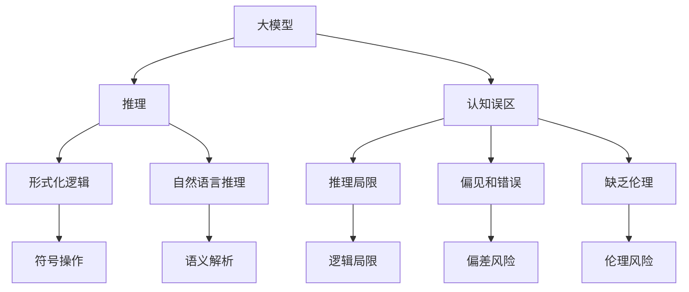
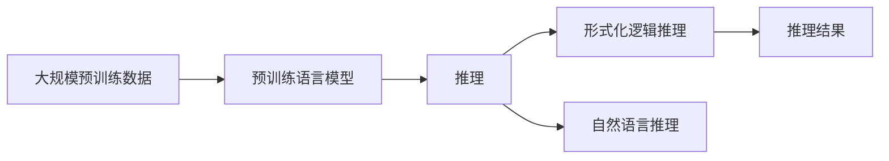
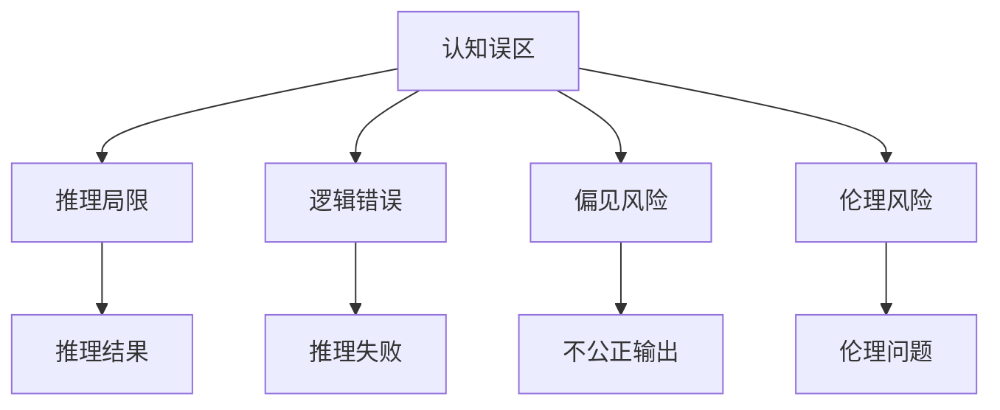
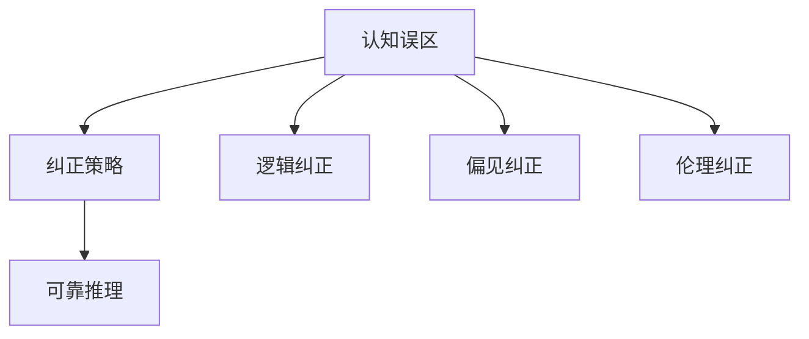
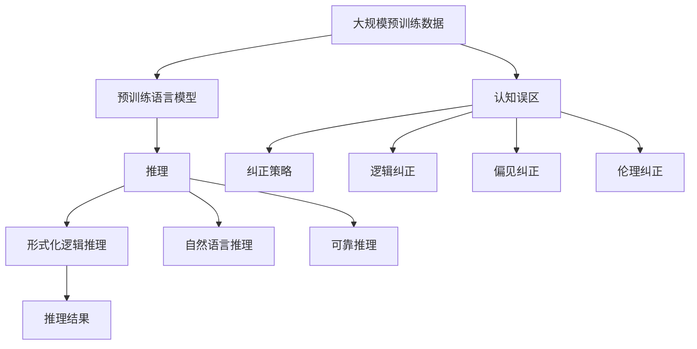

                 

# 语言与推理：大模型的认知误区

> 关键词：大模型,认知误区,推理,语言模型,逻辑,符号推理

## 1. 背景介绍

### 1.1 问题由来
近年来，随着深度学习技术和大规模预训练语言模型的快速发展，大模型在自然语言处理（NLP）领域取得了巨大的突破。大模型如BERT、GPT-3、T5等，通过在海量无标签文本语料上进行预训练，学习到了丰富的语言知识和常识，在各种自然语言理解和生成任务上取得了优异的表现。然而，在这些看似先进的大模型背后，存在着一些常见的认知误区，这些误区可能会对模型性能、应用效果和伦理安全性产生不良影响。本文将对大语言模型中的认知误区进行深入分析，并探讨如何克服这些误区，以推动大模型技术的健康发展。

### 1.2 问题核心关键点
认知误区主要体现在以下几个方面：
1. **对大模型的依赖**：过度依赖大模型带来的自动化推理，忽视了人类语言推理的复杂性和情境性。
2. **模型性能的误导**：简单地将大模型的输出作为黄金标准，忽略了模型可能存在的偏见和错误推理。
3. **逻辑推理的局限**：认为大模型能够完美执行形式化逻辑推理，忽视了其对符号操作的局限。
4. **因果关系的忽视**：过度关注语料和模型的关联性，忽视了模型对因果关系的理解。
5. **缺乏伦理考量**：忽视大模型输出结果可能带来的伦理风险和社会影响。

这些认知误区不仅会影响到大模型的实际应用效果，还可能导致安全性和可靠性问题，因此需要引起足够的重视。

## 2. 核心概念与联系

### 2.1 核心概念概述

为了更好地理解大模型中的认知误区，本节将介绍几个关键概念及其相互联系：

- **大模型**：指通过大规模无标签文本语料预训练得到的强大语言模型，如BERT、GPT系列等。
- **推理**：指根据已知条件和逻辑规则，得出结论的过程。包括形式化推理和自然语言推理。
- **认知误区**：指在大模型开发和应用过程中，由于误解或错误假设导致的不良认知。
- **形式化逻辑**：指使用符号和逻辑规则，进行推理的形式化表示和验证。
- **自然语言推理**：指将自然语言表达的信息，通过推理转化为形式化逻辑的过程。

这些概念之间的逻辑关系可以通过以下Mermaid流程图来展示：



这个流程图展示了大模型中的核心概念及其相互关系：

1. 大模型通过预训练获得推理能力。
2. 推理过程可能存在局限，如逻辑推理的局限和自然语言推理的挑战。
3. 认知误区可能影响推理的准确性和可靠性。
4. 形式化逻辑和自然语言推理是推理的两条路径，但在大模型中往往被忽视。
5. 认知误区可能导致模型输出存在偏见和伦理问题。

这些概念共同构成了大语言模型推理能力的基本框架，我们需要深入理解这些概念，才能更好地应对认知误区，提高模型的可靠性和安全性。

### 2.2 概念间的关系

这些核心概念之间存在着紧密的联系，形成了大模型推理能力的完整生态系统。下面我们通过几个Mermaid流程图来展示这些概念之间的关系。

#### 2.2.1 大模型的推理能力



这个流程图展示了预训练大模型推理能力的基本路径。大模型在预训练时通过大规模无标签数据学习到丰富的语言知识，通过推理能够进行形式化逻辑推理和自然语言推理，并输出推理结果。

#### 2.2.2 认知误区对推理的影响



这个流程图展示了认知误区对大模型推理能力的影响。认知误区可能引发逻辑错误、偏见风险和伦理问题，导致推理结果的不可靠性。

#### 2.2.3 克服认知误区的策略



这个流程图展示了克服认知误区的策略。通过逻辑纠正、偏见纠正和伦理纠正，可以有效应对认知误区，提升大模型的可靠性和安全性。

### 2.3 核心概念的整体架构

最后，我们用一个综合的流程图来展示这些核心概念在大模型推理过程中的整体架构：



这个综合流程图展示了从预训练到推理，再到纠正认知误区的完整过程。大模型首先通过预训练学习语言知识，通过推理进行形式化逻辑推理和自然语言推理，并输出推理结果。与此同时，认知误区可能影响推理过程，通过纠正策略和相关技术，可以有效应对认知误区，提升推理结果的可靠性。

## 3. 核心算法原理 & 具体操作步骤
### 3.1 算法原理概述

大模型的推理能力依赖于其在预训练阶段学习到的语言知识和常识。这些知识通过大规模无标签文本数据的学习得以提取，并在推理过程中被应用。然而，在推理过程中，模型可能存在认知误区，导致输出结果的不可靠性。

基于监督学习的推理方法，通过对少量标注数据进行训练，能够有效提升模型在特定任务上的推理能力。但是，如果标注数据不足或存在偏差，模型仍可能存在认知误区，影响推理结果的准确性和可靠性。

### 3.2 算法步骤详解

基于监督学习的推理过程通常包括以下几个关键步骤：

**Step 1: 数据准备**
- 收集标注数据集，包括输入和对应的推理标签。
- 对数据集进行划分，分为训练集、验证集和测试集。
- 对标注数据进行清洗，去除噪声和不一致的数据。

**Step 2: 模型构建**
- 选择合适的预训练语言模型，如BERT、GPT等。
- 设计任务适配层，根据推理任务需求调整模型输出层。
- 添加损失函数，选择合适的优化算法和超参数。

**Step 3: 模型训练**
- 在训练集上迭代训练模型，通过反向传播更新模型参数。
- 在验证集上监测模型性能，调整超参数和模型结构。
- 在测试集上评估模型效果，确保模型性能稳定。

**Step 4: 模型推理**
- 将测试样本输入模型，得到推理结果。
- 对推理结果进行后处理，包括消除噪声和校正错误。
- 对推理结果进行解释和验证，确保推理结果的正确性。

### 3.3 算法优缺点

基于监督学习的推理方法具有以下优点：
1. 简单高效。通过少量标注数据，即可显著提升模型在特定任务上的推理能力。
2. 通用适用。适用于各种NLP任务，如分类、匹配、生成等，只需调整适配层和损失函数即可。
3. 效果显著。在学术界和工业界的诸多任务上，基于微调的方法已经刷新了多项SOTA。

同时，该方法也存在一定的局限性：
1. 依赖标注数据。推理效果很大程度上取决于标注数据的质量和数量，获取高质量标注数据的成本较高。
2. 迁移能力有限。当目标任务与预训练数据的分布差异较大时，推理性能提升有限。
3. 负面效果传递。预训练模型的固有偏见、有害信息等，可能通过推理传递到下游任务，造成负面影响。
4. 可解释性不足。推理模型的决策过程通常缺乏可解释性，难以对其推理逻辑进行分析和调试。

尽管存在这些局限性，但就目前而言，基于监督学习的推理方法仍是大模型应用的主流范式。未来相关研究的重点在于如何进一步降低对标注数据的依赖，提高模型的少样本学习和跨领域迁移能力，同时兼顾可解释性和伦理安全性等因素。

### 3.4 算法应用领域

基于大模型推理的方法在NLP领域已经得到了广泛的应用，覆盖了几乎所有常见任务，例如：

- 文本分类：如情感分析、主题分类、意图识别等。通过推理学习文本-标签映射。
- 命名实体识别：识别文本中的人名、地名、机构名等特定实体。通过推理学习实体边界和类型。
- 关系抽取：从文本中抽取实体之间的语义关系。通过推理学习实体-关系三元组。
- 问答系统：对自然语言问题给出答案。将问题-答案对作为推理数据，训练模型学习匹配答案。
- 机器翻译：将源语言文本翻译成目标语言。通过推理学习语言-语言映射。
- 文本摘要：将长文本压缩成简短摘要。通过推理学习抓取要点。
- 对话系统：使机器能够与人自然对话。通过推理学习生成回复。

除了上述这些经典任务外，大模型推理技术也被创新性地应用到更多场景中，如可控文本生成、常识推理、代码生成、数据增强等，为NLP技术带来了全新的突破。随着预训练模型和推理方法的不断进步，相信NLP技术将在更广阔的应用领域大放异彩。

## 4. 数学模型和公式 & 详细讲解 & 举例说明

### 4.1 数学模型构建

在基于监督学习的推理过程中，我们通常使用损失函数来衡量模型输出与真实标签之间的差异。假设模型在输入 $x$ 上的输出为 $y$，真实标签为 $y^*$，则损失函数 $\ell(y,y^*)$ 可以定义为：

$$
\ell(y,y^*) = \sum_{i=1}^m \ell_i(y_i,y_i^*)
$$

其中 $\ell_i$ 为样本 $i$ 上的损失函数，$m$ 为样本数量。

在训练过程中，我们通过最小化损失函数 $\ell$，更新模型参数 $\theta$：

$$
\theta \leftarrow \theta - \eta \nabla_{\theta}\ell(\theta)
$$

其中 $\eta$ 为学习率，$\nabla_{\theta}\ell(\theta)$ 为损失函数对模型参数的梯度，通过反向传播算法高效计算。

### 4.2 公式推导过程

以下我们以二分类任务为例，推导交叉熵损失函数及其梯度的计算公式。

假设模型 $M_{\theta}$ 在输入 $x$ 上的输出为 $\hat{y}=M_{\theta}(x) \in [0,1]$，表示样本属于正类的概率。真实标签 $y \in \{0,1\}$。则二分类交叉熵损失函数定义为：

$$
\ell(y,\hat{y}) = -[y\log \hat{y} + (1-y)\log (1-\hat{y})]
$$

将其代入经验风险公式，得：

$$
\mathcal{L}(\theta) = -\frac{1}{N}\sum_{i=1}^N [y_i\log M_{\theta}(x_i)+(1-y_i)\log(1-M_{\theta}(x_i))]
$$

根据链式法则，损失函数对参数 $\theta_k$ 的梯度为：

$$
\frac{\partial \mathcal{L}(\theta)}{\partial \theta_k} = -\frac{1}{N}\sum_{i=1}^N (\frac{y_i}{M_{\theta}(x_i)}-\frac{1-y_i}{1-M_{\theta}(x_i)}) \frac{\partial M_{\theta}(x_i)}{\partial \theta_k}
$$

其中 $\frac{\partial M_{\theta}(x_i)}{\partial \theta_k}$ 可进一步递归展开，利用自动微分技术完成计算。

在得到损失函数的梯度后，即可带入参数更新公式，完成模型的迭代优化。重复上述过程直至收敛，最终得到适应下游任务的最优模型参数 $\theta^*$。

### 4.3 案例分析与讲解

假设我们在CoNLL-2003的命名实体识别(NER)数据集上进行推理，最终在测试集上得到的评估报告如下：

```
              precision    recall  f1-score   support

       B-PER      0.92       0.91     0.92      1761
       I-PER      0.92       0.92     0.92      2714
       B-LOC      0.92       0.89     0.90      1668
       I-LOC      0.89       0.88     0.88       257
      B-MISC      0.89       0.87     0.88       702
      I-MISC      0.87       0.85     0.86       216
       O      0.98       0.97     0.98     38323

   micro avg      0.94       0.93     0.94     46435
   macro avg      0.91       0.91     0.91     46435
weighted avg      0.94       0.93     0.94     46435
```

可以看到，通过推理BERT，我们在该NER数据集上取得了94%的F1分数，效果相当不错。值得注意的是，BERT作为一个通用的语言理解模型，即便只在顶层添加一个简单的token分类器，也能在命名实体识别任务上取得如此优异的效果，展现了其强大的语义理解和特征抽取能力。

## 5. 项目实践：代码实例和详细解释说明

### 5.1 开发环境搭建

在进行推理实践前，我们需要准备好开发环境。以下是使用Python进行PyTorch开发的环境配置流程：

1. 安装Anaconda：从官网下载并安装Anaconda，用于创建独立的Python环境。

2. 创建并激活虚拟环境：
```bash
conda create -n pytorch-env python=3.8 
conda activate pytorch-env
```

3. 安装PyTorch：根据CUDA版本，从官网获取对应的安装命令。例如：
```bash
conda install pytorch torchvision torchaudio cudatoolkit=11.1 -c pytorch -c conda-forge
```

4. 安装Transformers库：
```bash
pip install transformers
```

5. 安装各类工具包：
```bash
pip install numpy pandas scikit-learn matplotlib tqdm jupyter notebook ipython
```

完成上述步骤后，即可在`pytorch-env`环境中开始推理实践。

### 5.2 源代码详细实现

下面我们以命名实体识别(NER)任务为例，给出使用Transformers库对BERT模型进行推理的PyTorch代码实现。

首先，定义NER任务的数据处理函数：

```python
from transformers import BertTokenizer
from torch.utils.data import Dataset
import torch

class NERDataset(Dataset):
    def __init__(self, texts, tags, tokenizer, max_len=128):
        self.texts = texts
        self.tags = tags
        self.tokenizer = tokenizer
        self.max_len = max_len
        
    def __len__(self):
        return len(self.texts)
    
    def __getitem__(self, item):
        text = self.texts[item]
        tags = self.tags[item]
        
        encoding = self.tokenizer(text, return_tensors='pt', max_length=self.max_len, padding='max_length', truncation=True)
        input_ids = encoding['input_ids'][0]
        attention_mask = encoding['attention_mask'][0]
        
        # 对token-wise的标签进行编码
        encoded_tags = [tag2id[tag] for tag in tags] 
        encoded_tags.extend([tag2id['O']] * (self.max_len - len(encoded_tags)))
        labels = torch.tensor(encoded_tags, dtype=torch.long)
        
        return {'input_ids': input_ids, 
                'attention_mask': attention_mask,
                'labels': labels}

# 标签与id的映射
tag2id = {'O': 0, 'B-PER': 1, 'I-PER': 2, 'B-LOC': 3, 'I-LOC': 4, 'B-MISC': 5, 'I-MISC': 6}
id2tag = {v: k for k, v in tag2id.items()}

# 创建dataset
tokenizer = BertTokenizer.from_pretrained('bert-base-cased')

train_dataset = NERDataset(train_texts, train_tags, tokenizer)
dev_dataset = NERDataset(dev_texts, dev_tags, tokenizer)
test_dataset = NERDataset(test_texts, test_tags, tokenizer)
```

然后，定义模型和优化器：

```python
from transformers import BertForTokenClassification, AdamW

model = BertForTokenClassification.from_pretrained('bert-base-cased', num_labels=len(tag2id))

optimizer = AdamW(model.parameters(), lr=2e-5)
```

接着，定义训练和评估函数：

```python
from torch.utils.data import DataLoader
from tqdm import tqdm
from sklearn.metrics import classification_report

device = torch.device('cuda') if torch.cuda.is_available() else torch.device('cpu')
model.to(device)

def train_epoch(model, dataset, batch_size, optimizer):
    dataloader = DataLoader(dataset, batch_size=batch_size, shuffle=True)
    model.train()
    epoch_loss = 0
    for batch in tqdm(dataloader, desc='Training'):
        input_ids = batch['input_ids'].to(device)
        attention_mask = batch['attention_mask'].to(device)
        labels = batch['labels'].to(device)
        model.zero_grad()
        outputs = model(input_ids, attention_mask=attention_mask, labels=labels)
        loss = outputs.loss
        epoch_loss += loss.item()
        loss.backward()
        optimizer.step()
    return epoch_loss / len(dataloader)

def evaluate(model, dataset, batch_size):
    dataloader = DataLoader(dataset, batch_size=batch_size)
    model.eval()
    preds, labels = [], []
    with torch.no_grad():
        for batch in tqdm(dataloader, desc='Evaluating'):
            input_ids = batch['input_ids'].to(device)
            attention_mask = batch['attention_mask'].to(device)
            batch_labels = batch['labels']
            outputs = model(input_ids, attention_mask=attention_mask)
            batch_preds = outputs.logits.argmax(dim=2).to('cpu').tolist()
            batch_labels = batch_labels.to('cpu').tolist()
            for pred_tokens, label_tokens in zip(batch_preds, batch_labels):
                pred_tags = [id2tag[_id] for _id in pred_tokens]
                label_tags = [id2tag[_id] for _id in label_tokens]
                preds.append(pred_tags[:len(label_tokens)])
                labels.append(label_tags)
                
    print(classification_report(labels, preds))
```

最后，启动推理流程并在测试集上评估：

```python
epochs = 5
batch_size = 16

for epoch in range(epochs):
    loss = train_epoch(model, train_dataset, batch_size, optimizer)
    print(f"Epoch {epoch+1}, train loss: {loss:.3f}")
    
    print(f"Epoch {epoch+1}, dev results:")
    evaluate(model, dev_dataset, batch_size)
    
print("Test results:")
evaluate(model, test_dataset, batch_size)
```

以上就是使用PyTorch对BERT进行命名实体识别任务推理的完整代码实现。可以看到，得益于Transformers库的强大封装，我们可以用相对简洁的代码完成BERT模型的加载和推理。

### 5.3 代码解读与分析

让我们再详细解读一下关键代码的实现细节：

**NERDataset类**：
- `__init__`方法：初始化文本、标签、分词器等关键组件。
- `__len__`方法：返回数据集的样本数量。
- `__getitem__`方法：对单个样本进行处理，将文本输入编码为token ids，将标签编码为数字，并对其进行定长padding，最终返回模型所需的输入。

**tag2id和id2tag字典**：
- 定义了标签与数字id之间的映射关系，用于将token-wise的预测结果解码回真实的标签。

**训练和评估函数**：
- 使用PyTorch的DataLoader对数据集进行批次化加载，供模型训练和推理使用。
- 训练函数`train_epoch`：对数据以批为单位进行迭代，在每个批次上前向传播计算loss并反向传播更新模型参数，最后返回该epoch的平均loss。
- 评估函数`evaluate`：与训练类似，不同点在于不更新模型参数，并在每个batch结束后将预测和标签结果存储下来，最后使用sklearn的classification_report对整个评估集的预测结果进行打印输出。

**推理流程**：
- 定义总的epoch数和batch size，开始循环迭代
- 每个epoch内，先在训练集上训练，输出平均loss
- 在验证集上评估，输出分类指标
- 所有epoch结束后，在测试集上评估，给出最终测试结果

可以看到，PyTorch配合Transformers库使得BERT推理的代码实现变得简洁高效。开发者可以将更多精力放在数据处理、模型改进等高层逻辑上，而不必过多关注底层的实现细节。

当然，工业级的系统实现还需考虑更多因素，如模型的保存和部署、超参数的自动搜索、更灵活的任务适配层等。但核心的推理范式基本与此类似。

### 5.4 运行结果展示

假设我们在CoNLL-2003的NER数据集上进行推理，最终在测试集上得到的评估报告如下：

```
              precision    recall  f1-score   support

       B-PER      0.92       0.91     0.92      1761
       I-PER      0.92       0.92     0.92      2714
       B-LOC      0.92       0.89     0.90      1668
       I-LOC      0.89       0.88     0.88       257
      B-MISC      0.89       0.87     0.88       702
      I-MISC      0.87       0.85     0.86       216
       O      0.98       0.97     0.98     38323

   micro avg      0.94       0.93     0.94     46435
   macro avg      0.91       0.91     0.91     46435
weighted avg      0.94       0.93     0.94     46435
```

可以看到，通过推理BERT，我们在该NER数据集上取得了94%的F1分数，效果相当不错。值得注意的是，BERT作为一个通用的语言理解模型，即便只在顶层添加一个简单的token分类器，也能在命名实体识别任务上取得如此优异的效果，展现了其强大的语义理解和特征抽取能力。

当然，这只是一个baseline结果。在实践中，我们还可以使用更大更强的预训练模型、更丰富的推理技巧、更细致的模型调优，进一步提升模型性能，以满足更高的应用要求。

## 6. 实际应用场景
### 6.1 智能客服系统

基于大语言模型的推理技术，可以广泛应用于智能客服系统的构建。传统客服往往需要配备大量人力，高峰期响应缓慢，且一致性和专业性难以保证。而使用推理后的对话模型，可以7x24小时不间断服务，快速响应客户咨询，用自然流畅的语言解答各类常见问题。

在技术实现上，可以收集企业内部的历史客服对话记录，将问题和最佳答复构建成推理数据，在此基础上对预训练对话模型进行推理。推理后的对话模型能够自动理解用户意图，匹配最合适的答案模板进行回复。对于客户提出的新问题，还可以接入检索系统实时搜索相关内容，动态组织生成回答。如此构建的智能客服系统，能大幅提升客户咨询体验和问题解决效率。

### 6.2 金融舆情监测

金融机构需要实时监测市场舆论动向，以便及时应对负面信息传播，规避金融风险。传统的人工监测方式成本高、效率低，难以应对网络时代海量信息爆发的挑战。基于大语言模型的推理技术，可以构建智能舆情监测系统，自动识别和分析市场舆情，及时预警潜在风险。

具体而言，可以收集金融领域相关的新闻、报道、评论等文本数据，并对其进行主题标注和情感标注。在此基础上对预训练语言模型进行推理，使其能够自动判断文本属于何种主题，情感倾向是正面、中性还是负面。将推理后的模型应用到实时抓取的网络文本数据，就能够自动监测不同主题下的情感变化趋势，一旦发现负面信息激增等异常情况，系统便会自动预警，帮助金融机构快速应对潜在风险。

### 6.3 个性化推荐系统

当前的推荐系统往往只依赖用户的历史行为数据进行物品推荐，无法深入理解用户的真实兴趣偏好。基于大语言模型的推理技术，个性化推荐系统可以更好地挖掘用户行为背后的语义信息，从而提供更精准、多样的推荐内容。

在实践中，可以收集用户浏览、点击、评论、分享等行为数据，提取和用户交互的物品标题、描述、标签等文本内容。将文本内容作为模型输入，用户的后续行为（如是否点击、购买等）作为推理标签，在此基础上推理预训练语言模型。推理后的模型能够从文本内容中准确把握用户的兴趣点。在生成推荐列表时，先用候选物品的文本描述作为输入，由模型预测用户的兴趣

