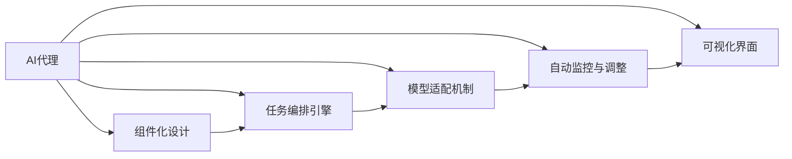
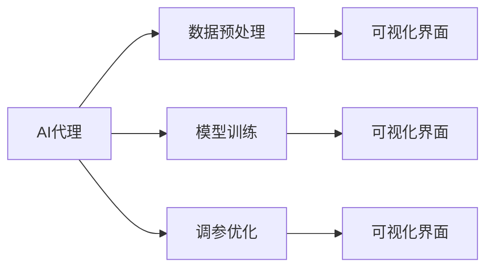
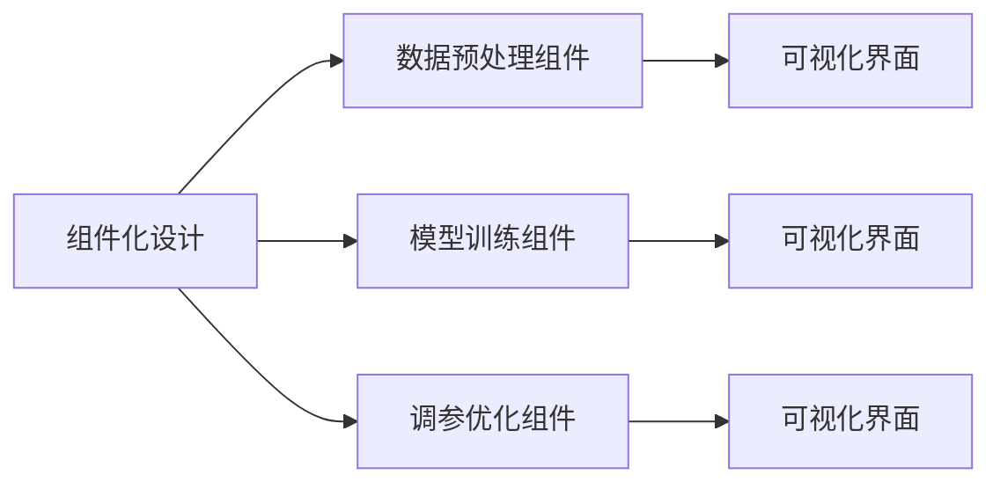
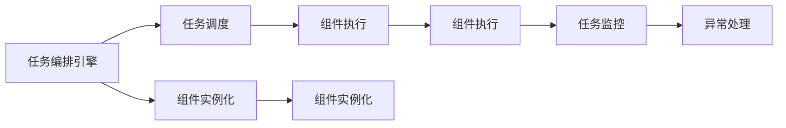
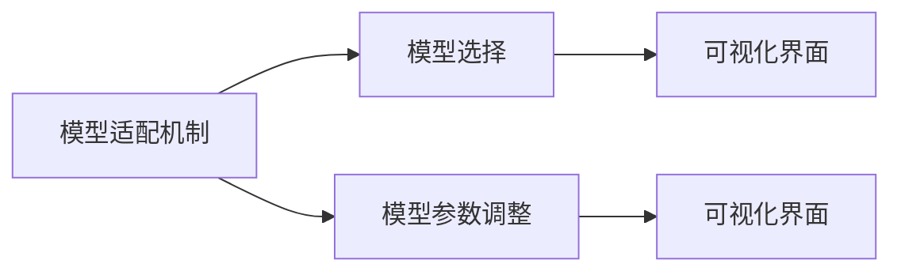
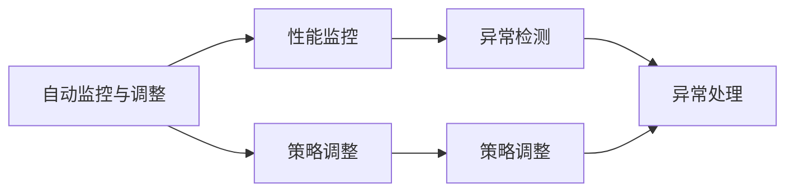
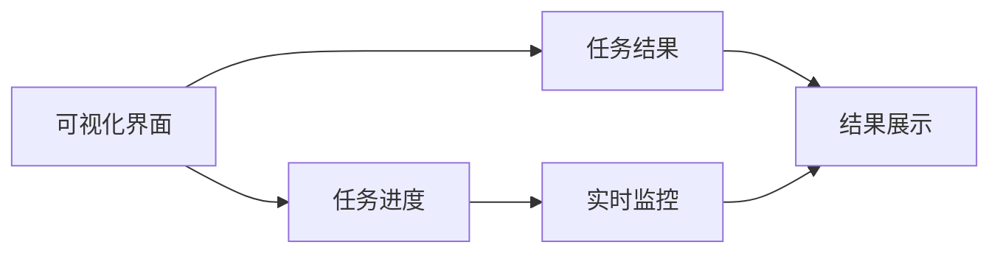
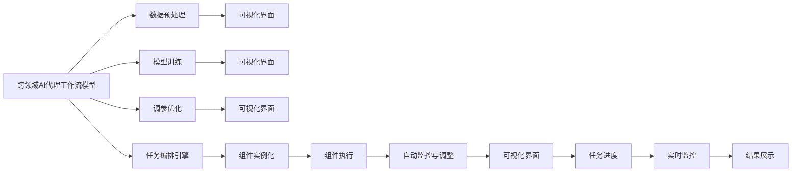

                 

# 跨领域AI代理工作流模型：灵活应用于不同场景

## 1. 背景介绍

### 1.1 问题由来

随着人工智能技术的快速发展和应用场景的不断扩展，越来越多的行业和企业都在尝试通过AI技术提升业务效率和竞争力。然而，传统的AI开发流程往往复杂且不灵活，每个任务都需要重新设计算法、构建模型，难以适应多变的业务需求。这不仅导致重复劳动的增加，也大大延长了项目交付时间。

为了解决这一问题，跨领域AI代理工作流模型应运而生。它通过设计一个通用的AI代理，将复杂的多任务AI开发过程自动化，显著提高开发效率，并降低技术门槛。

### 1.2 问题核心关键点

跨领域AI代理工作流模型的核心思想是将AI开发的各个环节封装成一系列标准化的组件和任务，由代理自动编排和执行。具体包括以下关键点：

1. **组件化设计**：将AI开发过程拆分成多个独立的组件，每个组件负责完成一个特定任务。如数据预处理、模型训练、调参优化等。
2. **任务编排引擎**：设计一个灵活的任务编排引擎，能够根据任务需求动态组合和调度各个组件。
3. **模型适配机制**：实现模型组件的灵活适配，支持多种模型类型和算法，方便开发者选择最适合的模型。
4. **自动监控与调整**：在任务执行过程中，实时监控系统性能，并根据反馈自动调整策略，确保任务顺利完成。
5. **可视化界面**：提供直观的可视化界面，方便用户理解任务执行状态和结果。

这些核心点共同构成了跨领域AI代理工作流模型的完整框架，使其能够在不同的业务场景中灵活应用。

### 1.3 问题研究意义

跨领域AI代理工作流模型的研究和应用具有重要意义：

1. **降低开发门槛**：将复杂的AI开发过程封装成易于理解、操作的组件和任务，降低了开发人员的准入门槛，使更多人员能够参与到AI项目中。
2. **提升开发效率**：通过自动编排和调度组件，自动化执行AI任务，大幅缩短项目开发周期，提升团队工作效率。
3. **提高模型性能**：灵活适配各种模型和算法，使得开发者能够在特定场景中选取最优的解决方案，提高模型性能。
4. **增强模型泛化能力**：支持多领域、多任务的适配，使得模型能够泛化到更多场景，适应业务需求的变化。
5. **简化维护与迭代**：组件化和任务编排机制使得模型维护和迭代更加灵活，便于快速响应业务变化和技术更新。

## 2. 核心概念与联系

### 2.1 核心概念概述

为更好地理解跨领域AI代理工作流模型，本节将介绍几个密切相关的核心概念：

1. **AI代理**：负责自动化执行AI任务的智能组件，能够根据任务需求，灵活组合和调度多个AI组件，完成特定任务。
2. **组件化设计**：将AI开发过程拆分成多个独立的功能组件，每个组件负责完成一个特定任务。
3. **任务编排引擎**：设计一个灵活的任务编排引擎，能够根据任务需求动态组合和调度各个组件。
4. **模型适配机制**：实现模型组件的灵活适配，支持多种模型类型和算法，方便开发者选择最适合的模型。
5. **自动监控与调整**：在任务执行过程中，实时监控系统性能，并根据反馈自动调整策略，确保任务顺利完成。
6. **可视化界面**：提供直观的可视化界面，方便用户理解任务执行状态和结果。

这些核心概念之间的逻辑关系可以通过以下Mermaid流程图来展示：



这个流程图展示了一系列的AI代理核心组件及其相互关系：

1. AI代理负责整个任务的执行，依赖于组件化设计和任务编排引擎。
2. 组件化设计将任务拆分成多个独立组件。
3. 任务编排引擎动态调度这些组件。
4. 模型适配机制支持多种模型和算法的灵活选择。
5. 自动监控与调整实时监控系统性能，根据反馈调整策略。
6. 可视化界面展示任务执行状态和结果。

这些核心概念共同构成了跨领域AI代理工作流模型的整体框架，使其能够在各种业务场景中灵活应用。

### 2.2 概念间的关系

这些核心概念之间存在着紧密的联系，形成了跨领域AI代理工作流模型的完整生态系统。下面我通过几个Mermaid流程图来展示这些概念之间的关系。

#### 2.2.1 AI代理的核心功能



这个流程图展示了AI代理的核心功能，即数据预处理、模型训练和调参优化，每个步骤都提供可视化界面供用户查看。

#### 2.2.2 组件化设计的层次结构



这个流程图展示了组件化设计的层次结构，将AI开发过程拆分为多个组件，每个组件负责特定任务，并配备可视化界面。

#### 2.2.3 任务编排引擎的调度流程



这个流程图展示了任务编排引擎的调度流程，从任务调度到组件实例化和执行，再到任务监控和异常处理。

#### 2.2.4 模型适配机制的工作原理



这个流程图展示了模型适配机制的工作原理，即根据任务需求选择合适的模型，并进行参数调整，提供可视化界面供用户查看。

#### 2.2.5 自动监控与调整的监控策略



这个流程图展示了自动监控与调整的监控策略，从性能监控到异常检测和策略调整，确保任务顺利完成。

#### 2.2.6 可视化界面的展示形式



这个流程图展示了可视化界面的展示形式，包括任务进度、实时监控和结果展示，帮助用户直观理解任务执行状态和结果。

### 2.3 核心概念的整体架构

最后，我们用一个综合的流程图来展示这些核心概念在大模型微调过程中的整体架构：



这个综合流程图展示了从数据预处理到任务执行，再到自动监控与调整和结果展示的完整过程。跨领域AI代理工作流模型通过组件化设计和任务编排引擎，灵活调度各种组件和任务，最终实现高效、灵活的AI开发。

## 3. 核心算法原理 & 具体操作步骤
### 3.1 算法原理概述

跨领域AI代理工作流模型的核心思想是通过组件化设计和任务编排引擎，将AI开发过程拆分成多个独立组件，由AI代理自动编排和执行。具体包括以下几个步骤：

1. **组件化设计**：将AI开发过程拆分成多个独立的功能组件，每个组件负责完成一个特定任务。
2. **任务编排引擎**：设计一个灵活的任务编排引擎，能够根据任务需求动态组合和调度各个组件。
3. **模型适配机制**：实现模型组件的灵活适配，支持多种模型类型和算法，方便开发者选择最适合的模型。
4. **自动监控与调整**：在任务执行过程中，实时监控系统性能，并根据反馈自动调整策略，确保任务顺利完成。
5. **可视化界面**：提供直观的可视化界面，方便用户理解任务执行状态和结果。

### 3.2 算法步骤详解

跨领域AI代理工作流模型的具体操作步骤如下：

#### 3.2.1 组件化设计

1. **任务拆分**：将AI开发任务拆分为数据预处理、模型训练、调参优化等多个独立组件。每个组件负责特定任务，如数据清洗、特征提取、模型训练、调参优化等。
2. **组件封装**：将每个组件封装为独立的API接口，方便任务编排引擎进行调用。每个组件都配备必要的输入输出参数，以便进行数据的传递和状态的跟踪。
3. **组件文档**：为每个组件编写详细的文档，包括输入输出参数说明、任务执行流程、异常处理策略等，帮助用户快速上手。

#### 3.2.2 任务编排引擎

1. **任务描述**：用户通过API接口定义任务，描述任务的需求和参数，如数据预处理的方式、模型类型和参数、调参策略等。
2. **任务编排**：任务编排引擎根据任务描述，动态组合和调度各个组件。具体步骤包括：
   - 解析任务描述，确定需要执行的组件列表。
   - 根据组件依赖关系，确定组件执行顺序。
   - 实例化组件，并设置初始参数。
   - 执行组件任务，收集结果。
   - 根据组件执行结果，调整后续组件的参数和执行顺序。
3. **任务监控**：在任务执行过程中，实时监控系统性能，记录关键指标，如组件执行时间、内存占用、模型精度等，供用户查看。

#### 3.2.3 模型适配机制

1. **模型选择**：根据任务需求，从预定义的模型库中选择适合的模型类型和算法，如卷积神经网络、循环神经网络、Transformer等。
2. **模型参数调整**：根据任务参数，调整模型的初始参数，如学习率、批大小、正则化系数等，以适应特定的任务需求。
3. **模型训练**：使用任务编排引擎调度和执行模型训练组件，完成模型的训练过程。
4. **模型优化**：在模型训练过程中，实时监控模型性能，根据反馈自动调整训练策略，如学习率调整、早停机制等，确保模型收敛。

#### 3.2.4 自动监控与调整

1. **性能监控**：实时监控任务执行过程中的系统性能，如CPU使用率、内存占用、网络带宽等，确保任务顺利执行。
2. **策略调整**：根据性能监控结果，动态调整任务执行策略，如增加计算资源、调整任务优先级等。
3. **异常检测**：检测任务执行过程中的异常情况，如资源不足、网络故障等，及时发出告警，并进行异常处理。
4. **异常处理**：根据异常情况，采取相应的措施，如重新分配资源、自动重启任务等，确保任务顺利完成。

#### 3.2.5 可视化界面

1. **任务进度展示**：通过可视化界面展示任务的执行状态和进度，包括各组件的执行情况、任务执行时间、模型训练进度等。
2. **实时监控展示**：展示任务执行过程中的实时监控数据，如CPU使用率、内存占用、模型精度等，供用户随时查看。
3. **结果展示**：展示任务执行结果，如模型训练精度、调参优化结果等，供用户查看和评估。

### 3.3 算法优缺点

跨领域AI代理工作流模型具有以下优点：

1. **降低开发门槛**：组件化设计和任务编排引擎大大降低了AI开发的门槛，使得非专业开发人员也能轻松上手。
2. **提高开发效率**：通过自动编排和调度组件，自动化执行AI任务，显著提升开发效率，缩短项目交付时间。
3. **灵活适配模型**：模型适配机制支持多种模型和算法的灵活选择，方便开发者根据任务需求选择合适的模型。
4. **增强模型性能**：自动监控与调整机制实时优化任务执行策略，确保模型在最佳状态下进行训练，提升模型性能。
5. **简化维护与迭代**：组件化和任务编排机制使得模型维护和迭代更加灵活，便于快速响应业务变化和技术更新。

同时，该模型也存在以下局限性：

1. **依赖预定义模型库**：模型适配机制依赖预定义的模型库，一旦缺少某个模型，就无法进行任务执行。
2. **性能监控复杂**：实时性能监控涉及大量的系统参数，实现复杂且容易出错。
3. **异常处理困难**：异常处理需要根据具体情况采取不同的措施，需要大量的开发和测试工作。
4. **灵活性有限**：任务编排引擎的设计需要考虑各种组件的依赖关系，灵活性受限。

尽管存在这些局限性，但就目前而言，跨领域AI代理工作流模型仍是一个极具潜力的AI开发框架，有望在未来的AI开发中发挥重要作用。

### 3.4 算法应用领域

跨领域AI代理工作流模型已经在多个领域得到了广泛应用，具体包括以下几个方面：

1. **自然语言处理**：用于文本分类、情感分析、命名实体识别等自然语言处理任务。通过组件化设计和任务编排引擎，可以灵活选择和组合各种NLP组件，提升任务处理效率和准确率。
2. **计算机视觉**：用于图像分类、目标检测、图像生成等计算机视觉任务。通过组件化设计和模型适配机制，可以灵活选择和组合各种CV组件，提升任务处理效率和模型性能。
3. **推荐系统**：用于个性化推荐、商品推荐等推荐任务。通过组件化设计和任务编排引擎，可以灵活选择和组合各种推荐组件，提升推荐算法的效果。
4. **金融分析**：用于股票分析、市场预测、风险评估等金融任务。通过组件化设计和任务编排引擎，可以灵活选择和组合各种金融组件，提升分析算法的准确性和鲁棒性。
5. **医疗诊断**：用于医学影像分析、病理诊断、药物研发等医疗任务。通过组件化设计和模型适配机制，可以灵活选择和组合各种医疗组件，提升诊断算法的准确性和可靠性。

除了上述这些领域，跨领域AI代理工作流模型还将在更多场景中得到应用，为各行各业提供智能化的解决方案。

## 4. 数学模型和公式 & 详细讲解 & 举例说明

### 4.1 数学模型构建

本节将使用数学语言对跨领域AI代理工作流模型进行更加严格的刻画。

记任务描述为 $D$，任务组件为 $C$，任务执行流程为 $P$。假设任务执行过程中涉及 $k$ 个组件，每个组件 $c_i$ 的输入为 $x_i$，输出为 $y_i$。

任务描述 $D$ 包括：

- **任务类型**：$T$，如文本分类、图像分类等。
- **输入数据**：$X$，如文本数据、图像数据等。
- **模型参数**：$M$，如模型类型、算法、超参数等。
- **任务目标**：$O$，如精度、召回率、F1分数等。

任务组件 $C$ 包括：

- **数据预处理**：$d_{pre}$，如数据清洗、特征提取等。
- **模型训练**：$d_{train}$，如模型初始化、训练迭代等。
- **调参优化**：$d_{opt}$，如学习率调整、早停机制等。

任务执行流程 $P$ 包括：

- **任务编排**：$E$，如组件调度、参数调整等。
- **性能监控**：$M$，如系统性能监控、异常检测等。
- **结果展示**：$R$，如任务进度展示、结果展示等。

任务执行过程中，任务组件 $c_i$ 的执行结果为 $y_i$，依赖于前一个组件的输出 $x_i$。任务执行流程 $P$ 的执行过程可以表示为：

$$
y_i = f_i(x_i, \theta)
$$

其中 $f_i$ 表示组件 $c_i$ 的执行函数，$\theta$ 表示任务执行流程 $P$ 的参数。

### 4.2 公式推导过程

以文本分类任务为例，推导跨领域AI代理工作流模型的执行过程。

假设任务描述为 $D = (T = "文本分类", X = "文本数据", M = {"模型类型": "CNN", "超参数": {"学习率": 0.01, "批大小": 64}}, O = "精度")$。

任务执行流程 $P$ 包括：

- **任务编排**：根据任务描述，选择数据预处理组件 $d_{pre}$、模型训练组件 $d_{train}$ 和调参优化组件 $d_{opt}$。
- **性能监控**：实时监控系统性能，如CPU使用率、内存占用、网络带宽等，确保任务顺利执行。
- **结果展示**：展示任务进度、实时监控数据和最终结果。

任务组件 $c_i$ 的执行过程可以表示为：

$$
y_i = f_i(x_i, \theta)
$$

其中 $f_i$ 表示组件 $c_i$ 的执行函数，$\theta$ 表示任务执行流程 $P$ 的参数。

对于数据预处理组件 $d_{pre}$，其输入为原始文本数据 $x$，输出为预处理后的文本数据 $y$：

$$
y = d_{pre}(x)
$$

对于模型训练组件 $d_{train}$，其输入为预处理后的文本数据 $y$，输出为训练好的模型参数 $\theta$：

$$
\theta = d_{train}(y)
$$

对于调参优化组件 $d_{opt}$，其输入为训练好的模型参数 $\theta$，输出为优化后的模型参数 $\hat{\theta}$：

$$
\hat{\theta} = d_{opt}(\theta)
$$

任务执行流程 $P$ 的执行过程可以表示为：

$$
\hat{\theta} = P(d_{pre}(x), d_{train}(d_{pre}(x)), d_{opt}(d_{train}(d_{pre}(x))))
$$

在任务执行过程中，自动监控与调整机制实时监控系统性能，根据反馈自动调整任务执行策略，确保任务顺利完成。具体步骤如下：

1. **性能监控**：实时监控CPU使用率、内存占用、网络带宽等系统参数，确保任务顺利执行。
2. **策略调整**：根据性能监控结果，动态调整任务执行策略，如增加计算资源、调整任务优先级等。
3. **异常检测**：检测任务执行过程中的异常情况，如资源不足、网络故障等，及时发出告警，并进行异常处理。
4. **异常处理**：根据异常情况，采取相应的措施，如重新分配资源、自动重启任务等，确保任务顺利完成。

### 4.3 案例分析与讲解

以下以推荐系统为例，展示跨领域AI代理工作流模型的应用。

假设推荐系统任务描述为 $D = (T = "个性化推荐", X = "用户行为数据", M = {"模型类型": "协同过滤", "超参数": {"学习率": 0.1, "迭代次数": 50}}, O = "点击率")$。

任务执行流程 $P$ 包括：

- **任务编排**：根据任务描述，选择数据预处理组件 $d_{pre}$、模型训练组件 $d_{train}$ 和调参优化组件 $d_{opt}$。
- **性能监控**：实时监控系统性能，如CPU使用率、内存占用、网络带宽等，确保任务顺利执行。
- **结果展示**：展示任务进度、实时监控数据和最终结果。

任务组件 $c_i$ 的执行过程可以表示为：

$$
y_i = f_i(x_i, \theta)
$$

其中 $f_i$ 表示组件 $c_i$ 的执行函数，$\theta$ 表示任务执行流程 $P$ 的参数。

对于数据预处理组件 $d_{pre}$，其输入为用户行为数据 $x$，输出为预处理后的数据 $y$：

$$
y = d_{pre}(x)
$$

对于模型训练组件 $d_{train}$，其输入为预处理后的数据 $y$，输出为训练好的模型参数 $\theta$：

$$
\theta = d_{train}(y)
$$

对于调参优化组件 $d_{opt}$，其输入为训练好的模型参数 $\theta$，输出为优化后的模型参数 $\hat{\theta}$：

$$
\hat{\theta} = d_{opt}(\theta)
$$

任务执行流程 $P$ 的执行过程可以表示为：

$$
\hat{\theta} = P(d_{pre}(x), d_{train}(d_{pre}(x)), d_{opt}(d_{train}(d_{pre}(x))))
$$

在任务执行过程中，自动监控与调整机制实时监控系统性能，根据反馈自动调整任务执行策略，确保任务顺利完成。具体步骤如下：

1. **性能监控**：实时监控CPU使用率、内存占用、网络带宽等系统参数，确保任务顺利执行。
2. **策略调整**：根据性能监控结果，动态调整任务执行策略，如增加计算资源、调整任务优先级等。
3. **异常检测**：检测任务执行过程中的异常情况，如资源不足、网络故障等，及时发出告警，并进行异常处理。
4. **异常处理**：根据异常情况，采取相应的措施，如重新分配资源、自动重启任务等，确保任务顺利完成。

## 5. 项目实践：代码实例和详细解释说明

### 5.1 开发环境搭建

在进行跨领域AI代理工作流模型实践前，我们需要准备好开发环境。以下是使用Python进行Flask框架开发的环境配置流程：

1. 安装Anaconda：从官网下载并安装Anaconda，用于创建独立的Python环境。

2. 创建并激活虚拟环境：
```bash
conda create -n flask-env python=3.8 
conda activate flask-env
```

3. 安装Flask：从官网获取Flask的安装命令，安装Flask及其相关依赖。

```bash
pip install flask
```

4. 安装Flask-RESTful：安装Flask-RESTful扩展，用于处理RESTful API请求。

```bash
pip install flask-restful
```

5. 安装Flask-SQLAlchemy：安装Flask-SQLAlchemy扩展，用于处理数据库操作。

```bash
pip install flask-sqlalchemy
```

6. 安装Flask-WTF：安装Flask-WTF扩展，用于处理表单验证。

```bash
pip install flask-wtf
```

完成上述步骤后，即可在`flask-env`环境中开始跨领域AI代理工作流模型的开发。

### 5.2 源代码详细实现

下面以推荐系统任务为例，给出使用Flask框架实现跨领域AI代理工作流模型的PyTorch代码实现。

首先，定义任务描述类 `TaskDesc`：

```python
class TaskDesc:
    def __init__(self, task_type, input_data, model_params, task_objective):
        self.task_type = task_type
        self.input_data = input_data
        self.model_params = model_params
        self.task_objective = task_objective

# 定义推荐系统任务描述
task_desc = TaskDesc(task_type="个性化推荐", input_data="用户行为数据", model_params={"模型类型": "协同过滤", "超参数": {"学习率": 0.1, "迭代次数": 50}}, task_objective="点击率")
```

然后，定义任务组件类 `TaskComponent`：

```python
class TaskComponent:
    def __init__(self, component_name, input_data, output_data):
        self.component_name = component_name
        self.input_data = input_data
        self.output_data = output_data

# 定义数据预处理组件
data_preproc_component = TaskComponent(component_name="数据预处理", input_data="原始数据", output_data="预处理数据")

# 定义模型训练组件
model_train_component = TaskComponent(component_name="模型训练", input_data="预处理数据", output_data="训练好的模型参数")

# 定义调参优化组件
model_opt_component = TaskComponent(component_name="调参优化", input_data="训练好的模型参数", output_data="优化后的模型参数")
```

接着，定义任务执行流程类 `TaskPipeline`：

```python
class TaskPipeline:
    def __init__(self, task_desc):
        self.task_desc = task_desc
        self.task_components = []
        self.task_exec_order = []

    def add_component(self, component):
        self.task_components.append(component)
        self.task_exec_order.append(component.component_name)

    def execute_pipeline(self):
        # 任务执行流程，按顺序执行各组件
        for component in self.task_exec_order:
            print(f"正在执行组件 {component}...")
            output_data = None


