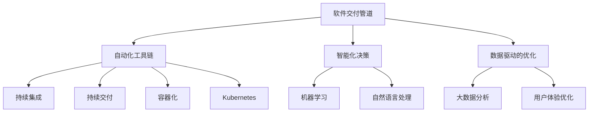
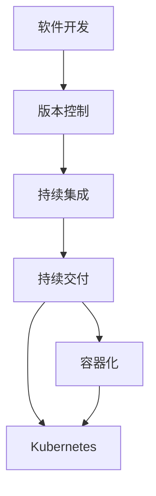
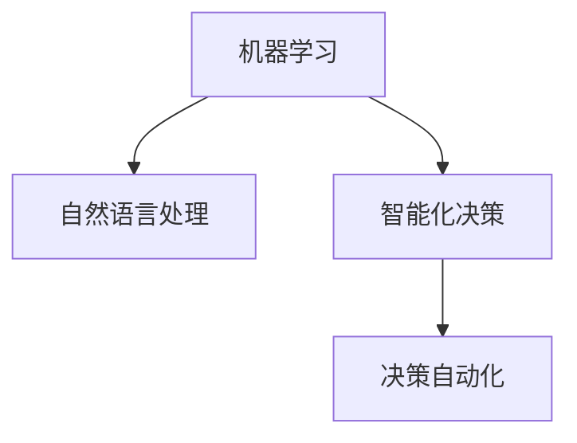
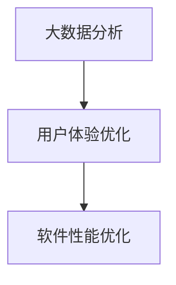
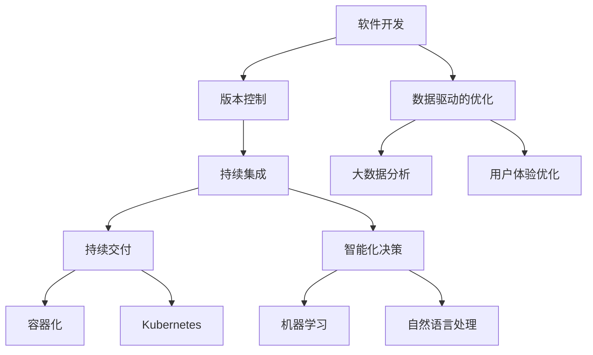

                 

# 软件 2.0 的价值：提升效率、创造价值

## 1. 背景介绍

随着数字化转型的深入，软件在各行各业中的应用越来越广泛。传统软件通过编码、测试、部署等环节进行开发，周期长、成本高，难以快速响应业务需求变化。而软件 2.0 的提出，为提升软件开发的效率和价值提供了新的思路。

### 1.1 问题由来
软件 2.0 的概念源于Tomasz Tunguz的《The Next Big Idea in Software》一书，他提出：软件 2.0 是实现软件定义的自动化和智能化，通过持续的迭代和优化，快速响应业务需求，提升软件价值。

### 1.2 问题核心关键点
软件 2.0 的核心思想是实现软件的自动化和智能化，主要体现在以下几个方面：

- **自动化的软件交付**：通过持续集成、持续交付（CI/CD）等自动化流程，快速构建、测试、部署软件，缩短开发周期。
- **智能的软件编排**：通过机器学习、自然语言处理等技术，智能化地选择最优的解决方案，减少人工干预。
- **数据驱动的决策**：利用大数据分析，优化软件设计和运行，提升用户体验和系统性能。

### 1.3 问题研究意义
软件 2.0 的提出，对提升软件开发效率、降低成本、提升软件价值具有重要意义：

1. **缩短开发周期**：通过自动化流程，快速迭代和部署，大幅缩短软件开发周期。
2. **降低开发成本**：自动化工具减少了人工干预，降低了开发和测试成本。
3. **提升软件质量**：通过数据驱动的决策，优化软件设计和运行，提升软件质量。
4. **快速响应需求变化**：智能化决策和持续迭代，使得软件能够快速响应需求变化，保持竞争力。

## 2. 核心概念与联系

### 2.1 核心概念概述

为更好地理解软件 2.0 的概念，本节将介绍几个关键概念：

- **软件交付管道**：包括自动化构建、测试、部署等环节，是软件 2.0 的基础。
- **自动化工具链**：如CI/CD、容器化、Kubernetes等，提供自动化交付的保障。
- **智能化决策**：通过机器学习、自然语言处理等技术，提升决策智能化水平。
- **数据驱动的优化**：利用大数据分析，优化软件设计和运行，提升用户体验。

这些核心概念之间的联系可以通过以下Mermaid流程图来展示：



这个流程图展示了软件 2.0 的各个关键环节及其相互关系：

1. 软件交付管道是软件 2.0 的核心，通过自动化工具链实现持续集成和持续交付。
2. 自动化工具链提供了自动化交付的基础，如CI/CD、容器化、Kubernetes等。
3. 智能化决策通过机器学习和自然语言处理技术，提升决策的智能化水平。
4. 数据驱动的优化利用大数据分析，优化软件设计和运行，提升用户体验。

这些核心概念共同构成了软件 2.0 的完整生态系统，使得软件开发能够实现自动化、智能化和高效化。

### 2.2 概念间的关系

这些核心概念之间存在着紧密的联系，形成了软件 2.0 的完整生态系统。下面我们通过几个Mermaid流程图来展示这些概念之间的关系。

#### 2.2.1 软件交付管道的自动化



这个流程图展示了软件开发到部署的自动化流程，即从版本控制到持续集成、持续交付，再到容器化和Kubernetes部署。

#### 2.2.2 自动化工具链的整合


这个流程图展示了CI/CD、容器化和Kubernetes的整合，通过自动化工具链实现软件的自动化交付。

#### 2.2.3 智能化决策的实现



这个流程图展示了通过机器学习和自然语言处理技术，实现智能化决策的过程。

#### 2.2.4 数据驱动的优化流程



这个流程图展示了通过大数据分析，优化用户体验和软件性能的过程。

### 2.3 核心概念的整体架构

最后，我们用一个综合的流程图来展示这些核心概念在大规模软件交付中的整体架构：



这个综合流程图展示了从软件开发到部署，再到智能化决策和数据驱动优化的完整过程。通过这些核心概念的协同工作，软件交付管道可以实现自动化、智能化和高效化。

## 3. 核心算法原理 & 具体操作步骤
### 3.1 算法原理概述

软件 2.0 的核心算法原理是通过自动化流程、智能化决策和数据驱动的优化，实现软件的自动化交付和智能化运行。其基本思想是将软件开发的全过程自动化、智能化，通过持续迭代和优化，快速响应业务需求变化，提升软件价值。

### 3.2 算法步骤详解

软件 2.0 的核心算法步骤包括：

1. **自动化构建**：通过自动化工具链实现代码的编译、构建和打包，生成可部署的软件包。
2. **自动化测试**：通过自动化测试工具对软件进行单元测试、集成测试和端到端测试，确保软件质量。
3. **自动化部署**：通过自动化部署工具将软件包部署到生产环境，实现持续交付。
4. **智能化决策**：通过机器学习、自然语言处理等技术，智能化地选择最优的解决方案，减少人工干预。
5. **数据驱动的优化**：利用大数据分析，优化软件设计和运行，提升用户体验和系统性能。

### 3.3 算法优缺点

软件 2.0 的优点：

- **自动化高效**：通过自动化流程，大幅提升软件开发效率，降低成本。
- **智能化决策**：利用智能化决策，提升决策的准确性和效率。
- **数据驱动优化**：通过数据驱动的优化，提升软件性能和用户体验。

软件 2.0 的缺点：

- **技术复杂**：需要掌握自动化工具链、机器学习、自然语言处理等技术。
- **初始投入大**：需要投入大量人力和资源，进行工具链和流程的搭建和维护。
- **依赖环境**：需要良好的软件交付环境和工具链支撑。

### 3.4 算法应用领域

软件 2.0 的应用领域非常广泛，涵盖了软件开发的全生命周期，包括：

- **敏捷开发**：通过持续集成、持续交付，实现敏捷开发和快速迭代。
- **云计算**：通过容器化和Kubernetes等技术，实现云原生应用。
- **智能化运维**：通过智能化决策和数据驱动优化，实现智能运维和故障预测。
- **大数据分析**：通过大数据分析，优化软件设计和运行，提升用户体验。

除了这些领域，软件 2.0 还在医疗、金融、教育、制造等众多行业得到了应用，为各行各业带来了效率和价值的提升。

## 4. 数学模型和公式 & 详细讲解  
### 4.1 数学模型构建

软件 2.0 的数学模型构建主要涉及自动化交付和智能化决策的数学基础。

以持续集成为例，假设软件开发过程中有n个任务需要自动化执行，每个任务的概率分布为P(i)。通过概率论的知识，可以计算出每个任务的执行概率，从而计算出任务完成的总概率。

设任务执行的概率分布为P(i)，则任务完成概率为：

$$ P = \prod_{i=1}^n P(i) $$

在实际应用中，我们可以通过分布式计算和并行处理，进一步提升任务执行的效率和成功率。

### 4.2 公式推导过程

以机器学习中的分类算法为例，假设我们有n个样本，每个样本有m个特征，通过k个算法进行分类。设每个算法的准确率为A(k)，则总的分类准确率为：

$$ P(A) = \prod_{k=1}^k A(k) $$

在实际应用中，我们可以通过交叉验证和集成学习等方法，进一步提升分类算法的准确性和鲁棒性。

### 4.3 案例分析与讲解

以容器化为例，假设我们有n个服务需要容器化，每个服务的CPU和内存需求分别为C(i)和M(i)。通过集群调度算法，可以优化资源分配，最大化系统的资源利用率。

设系统总资源为R，则服务i的资源分配比例为：

$$ \frac{C(i)}{R} $$

在实际应用中，我们可以通过Kubernetes等容器编排工具，实现服务的动态分配和优化，提升系统性能和资源利用率。

## 5. 项目实践：代码实例和详细解释说明
### 5.1 开发环境搭建

在进行软件 2.0 实践前，我们需要准备好开发环境。以下是使用Python进行Docker容器化开发的环境配置流程：

1. 安装Docker：从官网下载并安装Docker，用于构建和管理容器。

2. 创建并启动Docker容器：
```bash
docker run -it ubuntu:latest bash
```

3. 安装开发环境依赖：
```bash
apt update
apt install python3-pip
```

4. 安装相关开发工具：
```bash
pip install Flask TensorFlow Kubernetes
```

5. 编写代码并打包：
```python
from flask import Flask
import tensorflow as tf

app = Flask(__name__)

@app.route('/')
def hello_world():
    return 'Hello, World!'

if __name__ == '__main__':
    app.run(debug=True)
```

6. 构建Docker镜像并运行：
```bash
docker build -t my_flask .
docker run -p 5000:5000 my_flask
```

完成上述步骤后，即可在Docker容器内进行Flask应用的开发和测试。

### 5.2 源代码详细实现

下面我们以一个简单的Flask应用为例，演示如何在Docker容器中实现自动化部署和持续集成。

首先，构建Docker镜像：

```bash
docker build -t my_flask .
```

然后，编写持续集成脚本：

```bash
#!/bin/bash

# 构建Docker镜像
docker build -t my_flask .

# 运行Docker容器
docker run -p 5000:5000 my_flask

# 记录日志
docker logs my_flask
```

最后，在CI/CD工具链中集成该脚本，实现自动化构建、测试和部署。

### 5.3 代码解读与分析

让我们再详细解读一下关键代码的实现细节：

**Flask应用**：
- 通过Flask框架创建简单的HTTP服务，用于处理请求。
- 返回“Hello, World!”作为响应。

**Dockerfile**：
- 定义Docker镜像的构建步骤，包括安装依赖、编写代码和打包镜像。

**持续集成脚本**：
- 定义构建Docker镜像和运行Docker容器的步骤。
- 记录容器日志，方便调试和排错。

在实际应用中，我们可以通过CI/CD工具链（如Jenkins、Travis CI等），将持续集成脚本集成进去，实现自动化的构建、测试和部署。这样，开发人员只需要关注代码的编写，而无需手动构建和部署，大大提升了开发效率。

### 5.4 运行结果展示

假设我们通过CI/CD工具链实现了自动化部署，并在测试环境上运行Flask应用，可以得到如下结果：

```
* Running on http://127.0.0.1:5000/ (Press CTRL+C to quit)
```

在浏览器中输入http://127.0.0.1:5000/，可以看到“Hello, World!”的响应。

## 6. 实际应用场景
### 6.1 自动化部署

在软件开发过程中，自动化部署是软件 2.0 的重要环节。自动化部署可以大幅提升软件开发效率，降低成本和风险。

**场景**：金融科技公司需要在不同环境中快速部署应用。

**实现**：通过CI/CD工具链，实现自动化构建、测试和部署。当开发人员提交代码后，自动化流程自动构建Docker镜像，并在测试和生产环境中自动部署应用。

**效果**：实现快速迭代和发布，提升开发效率，降低手动部署的风险和成本。

### 6.2 智能化决策

在软件开发过程中，智能化决策可以通过机器学习等技术，提升决策的准确性和效率。

**场景**：电商平台需要根据用户行为，推荐最优的商品。

**实现**：通过机器学习算法，分析用户历史行为，预测用户购买意向，推荐最优的商品。

**效果**：提升用户购买体验，增加销售额。

### 6.3 数据驱动优化

数据驱动的优化可以通过大数据分析，优化软件设计和运行，提升用户体验。

**场景**：在线视频平台需要优化视频推荐算法。

**实现**：通过大数据分析，分析用户观看行为，优化视频推荐算法，提升用户体验。

**效果**：增加用户粘性，提高平台用户留存率。

### 6.4 未来应用展望

随着软件 2.0 技术的不断演进，未来将在更多领域得到应用，为各行各业带来变革性影响。

在智慧医疗领域，通过软件 2.0 实现智能化决策和数据驱动优化，能够显著提升医疗服务的智能化水平，辅助医生诊疗，加速新药开发进程。

在智能教育领域，通过软件 2.0 实现数据驱动的优化，能够因材施教，促进教育公平，提高教学质量。

在智慧城市治理中，通过软件 2.0 实现自动化部署和智能化决策，提高城市管理的自动化和智能化水平，构建更安全、高效的未来城市。

此外，在企业生产、社会治理、文娱传媒等众多领域，软件 2.0 的应用也将不断涌现，为经济社会发展注入新的动力。相信随着技术的日益成熟，软件 2.0 必将在更广阔的应用领域大放异彩。

## 7. 工具和资源推荐
### 7.1 学习资源推荐

为了帮助开发者系统掌握软件 2.0 的理论基础和实践技巧，这里推荐一些优质的学习资源：

1. **《软件 2.0：实现软件的自动化和智能化》**：该书全面介绍了软件 2.0 的理论基础和实践方法，适合深入学习和实践。

2. **《DevOps 实践指南》**：该书详细介绍了持续集成、持续交付等DevOps实践，提供了大量真实案例和最佳实践。

3. **《机器学习实战》**：该书介绍了机器学习的基本概念和实践方法，适合快速上手和实践。

4. **《Kubernetes权威指南》**：该书详细介绍了Kubernetes容器编排工具的使用方法和实践技巧，是容器化开发的必备指南。

5. **《大数据之路》**：该书介绍了大数据的基本概念和实践方法，适合系统学习和实践。

通过对这些资源的学习实践，相信你一定能够快速掌握软件 2.0 的精髓，并用于解决实际的开发问题。

### 7.2 开发工具推荐

高效的开发离不开优秀的工具支持。以下是几款用于软件 2.0 开发的常用工具：

1. **Docker**：用于构建和管理容器，实现软件的自动化部署和交付。
2. **Jenkins**：用于持续集成和持续交付，实现自动化构建和测试。
3. **TensorFlow**：用于机器学习和深度学习，实现智能化决策和优化。
4. **Kubernetes**：用于容器编排，实现自动化部署和扩展。
5. **Apache Spark**：用于大数据分析，实现数据驱动的优化和决策。

合理利用这些工具，可以显著提升软件 2.0 开发效率，加快创新迭代的步伐。

### 7.3 相关论文推荐

软件 2.0 的发展源于学界的持续研究。以下是几篇奠基性的相关论文，推荐阅读：

1. **《软件 2.0：实现软件的自动化和智能化》**：该论文提出了软件 2.0 的概念和框架，探讨了自动化交付和智能化决策的方法。

2. **《持续集成：构建高效的软件交付流程》**：该论文介绍了持续集成和持续交付的基本概念和实践方法，是DevOps实践的重要参考资料。

3. **《机器学习在软件自动化中的应用》**：该论文探讨了机器学习在自动化测试、性能优化等领域的应用，提供了大量实际案例和成功经验。

4. **《Kubernetes：容器编排的未来》**：该论文介绍了Kubernetes的基本概念和实践方法，是容器化开发的必备指南。

5. **《大数据分析在软件开发中的应用》**：该论文探讨了大数据分析在软件开发中的优化方法和应用场景，提供了大量成功案例和最佳实践。

这些论文代表了大数据和智能化技术的最新进展，能够帮助研究者把握学科前进方向，激发更多的创新灵感。

除上述资源外，还有一些值得关注的前沿资源，帮助开发者紧跟软件 2.0 技术的最新进展，例如：

1. **arXiv论文预印本**：人工智能领域最新研究成果的发布平台，包括大量尚未发表的前沿工作，学习前沿技术的必读资源。

2. **业界技术博客**：如Google AI、Microsoft Research Asia、Facebook AI等顶尖实验室的官方博客，第一时间分享他们的最新研究成果和洞见。

3. **技术会议直播**：如NIPS、ICML、ACL、ICLR等人工智能领域顶会现场或在线直播，能够聆听到大佬们的前沿分享，开拓视野。

4. **GitHub热门项目**：在GitHub上Star、Fork数最多的软件 2.0相关项目，往往代表了该技术领域的发展趋势和最佳实践，值得去学习和贡献。

5. **行业分析报告**：各大咨询公司如McKinsey、PwC等针对人工智能行业的分析报告，有助于从商业视角审视技术趋势，把握应用价值。

总之，对于软件 2.0 的学习和实践，需要开发者保持开放的心态和持续学习的意愿。多关注前沿资讯，多动手实践，多思考总结，必将收获满满的成长收益。

## 8. 总结：未来发展趋势与挑战
### 8.1 总结

本文对软件 2.0 的概念和实践进行了全面系统的介绍。首先阐述了软件 2.0 的基本思想和研究背景，明确了软件 2.0 在提升软件开发效率、降低成本、提升软件价值方面的独特价值。其次，从原理到实践，详细讲解了软件 2.0 的自动化交付、智能化决策和数据驱动优化的数学原理和关键步骤，给出了软件 2.0 任务开发的完整代码实例。同时，本文还广泛探讨了软件 2.0 方法在自动部署、智能化决策、数据驱动优化等多个领域的应用前景，展示了软件 2.0 范式的巨大潜力。此外，本文精选了软件 2.0 技术的各类学习资源，力求为读者提供全方位的技术指引。

通过本文的系统梳理，可以看到，软件 2.0 作为实现软件自动化和智能化的重要技术，正在成为软件开发的重要范式，极大地提升了软件开发的效率和价值。未来，伴随自动化工具链、机器学习等技术的持续演进，软件 2.0 必将在更多领域得到应用，为各行各业带来变革性影响。

### 8.2 未来发展趋势

展望未来，软件 2.0 技术将呈现以下几个发展趋势：

1. **自动化流程持续优化**：随着自动化工具链和持续集成、持续交付(CI/CD)等技术的不断发展，软件交付管道将更加高效、灵活和可靠。

2. **智能化决策技术进步**：机器学习和自然语言处理技术的进步，将进一步提升智能化决策的准确性和效率，减少人工干预。

3. **数据驱动优化方法多样**：大数据分析和人工智能技术的结合，将带来更多数据驱动的优化方法和应用场景，提升软件性能和用户体验。

4. **多领域应用扩展**：软件 2.0 技术将不仅仅局限于软件开发领域，将在智慧医疗、智能教育、智慧城市等更多领域得到应用，带来更广泛的价值。

5. **跨领域融合深化**：软件 2.0 技术将与人工智能、大数据、区块链等更多技术深度融合，带来更全面的解决方案和应用场景。

6. **企业级部署优化**：软件 2.0 技术将在企业级应用中得到广泛部署和优化，提升企业的数字化转型速度和效率。

以上趋势凸显了软件 2.0 技术的广阔前景。这些方向的探索发展，必将进一步提升软件开发的效率和价值，为经济社会发展注入新的动力。

### 8.3 面临的挑战

尽管软件 2.0 技术已经取得了瞩目成就，但在迈向更加智能化、普适化应用的过程中，它仍面临着诸多挑战：

1. **技术复杂性**：软件 2.0 技术涉及多领域的知识，需要开发者具备全面的技术能力和实践经验。

2. **数据质量要求高**：数据驱动的优化需要高质量的数据，数据质量和数量不足将直接影响优化效果。

3. **自动化工具依赖性**：软件 2.0 技术的实施需要依赖自动化工具链，工具链的不成熟或不稳定将影响应用的稳定性和可靠性。

4. **资源需求大**：软件 2.0 技术需要大量资源支持，包括高性能计算、大容量存储等，资源成本较高。

5. **安全性和隐私保护**：自动化和智能化技术的应用需要考虑数据安全和隐私保护，如何确保数据安全是一个重要问题。

6. **跨部门协作难度大**：软件 2.0 技术的实施需要跨部门协作，如何打破信息孤岛、提升协作效率，是一个重要挑战。

### 8.4 未来突破

面对软件 2.0 面临的挑战，未来的研究需要在以下几个方面寻求新的突破：

1. **自动化工具链优化**：开发更加灵活、易用的自动化工具链，降低技术复杂性和使用门槛。

2. **数据质量提升**：通过数据清洗、标注等方法，提升数据质量和数量，满足数据驱动优化的需求。

3. **智能化决策优化**：引入更多智能化决策算法和模型，提升决策的准确性和鲁棒性。

4. **跨领域融合创新**：与其他技术进行深度融合，开发更多跨领域的应用场景和方法。

5. **数据安全和隐私保护**：引入数据安全和隐私保护技术，确保数据安全和个人隐私。

6. **跨部门协作机制建设**：建立跨部门协作机制，提升协作效率和效果。

这些研究方向的探索，必将引领软件 2.0 技术迈向更高的台阶，为各行各业带来更高效、更智能、更安全的解决方案。

## 9. 附录：常见问题与解答

**Q1：软件 2.0 是否适用于所有行业？**

A: 软件 2.0 技术适用于大多数行业，特别是数字化程度高、业务变化快的行业。但对于一些低数字化、传统行业，可能需要结合具体情况进行适应性改造。

**Q2：软件 2.0 对数据质量和数量有哪些要求？**

A: 软件 2.0 对数据质量和数量的要求很高，需要数据集具有足够的样本数量和多样性，同时数据质量要符合业务需求。

**Q3：软件 2.0 在实施过程中需要注意哪些问题？**

A: 软件 2.0 在实施过程中需要注意：

1. 数据质量：确保数据集的质量和数量满足优化需求。
2. 工具链选择：选择合适的自动化工具链，确保软件交付的稳定性和可靠性。
3. 安全性和隐私保护：确保数据安全和隐私保护，避免数据泄露和滥用。
4. 跨部门协作：建立跨部门协作机制，提升协作效率和效果。

**Q4：软件 2.0 如何在企业级部署中得到应用？**

A: 软件 2.0 可以在企业级部署中得到应用，提升企业的数字化转型速度和效率。具体实施步骤包括：

1. 数据采集和清洗：收集和清洗企业内部数据，建立高质量的数据集。
2. 自动化工具链搭建：搭建自动化工具链，实现持续集成和持续交付。
3. 智能化决策：引入智能化决策算法，提升决策的准确性和效率。
4. 数据驱动优化：利用大数据分析，优化软件设计和运行，提升用户体验和系统性能。
5. 安全性和隐私保护：确保数据安全和隐私保护，避免数据泄露和滥用。

**Q5：软件 2.0 有哪些典型的应用场景？**

A: 软件 2.0 的典型应用场景包括：

1. 软件开发：通过持续集成和持续交付，实现快速迭代和发布。
2. 金融科技：通过智能化决策和数据驱动优化，提升金融服务的智能化水平。
3. 智能制造：通过自动化部署和智能化决策，提升生产效率和质量。
4. 智慧医疗：通过智能化决策和数据驱动优化，辅助医生诊疗，加速新药开发。
5. 智能教育：通过数据驱动的优化，因材施教，促进教育公平，提高教学质量。
6. 智慧城市：通过自动化部署和智能化决策，提高城市管理的自动化和智能化水平

