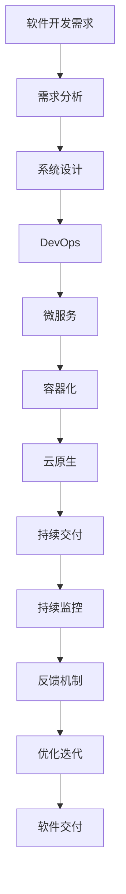

                 

## 1. 背景介绍

### 1.1 问题由来

在信息化浪潮的推动下，企业对软件系统的依赖日益加深，软件已成为企业信息化核心基础设施的重要组成部分。然而，软件开发和管理在实际应用中仍面临诸多问题，如需求管理混乱、开发效率低下、成本超支、交付周期过长等。这些问题严重影响了企业数字化转型的进程和效果，迫切需要寻找新的解决方案。

软件2.0（Software 2.0）概念的提出，正是为了应对这些挑战。它借鉴了传统软件工程的概念和方法，但更注重软件生产的工程化和自动化，通过引入DevOps、微服务、容器化、云原生等新技术，大幅度提升了软件的生产效率和交付质量。

### 1.2 问题核心关键点

软件2.0的核心理念在于提升软件的生产效率和交付质量，其关键在于以下几个方面：

- **自动化**：通过自动化工具和脚本，实现持续集成（CI）、持续交付（CD）、持续监控（CM）等，提升软件交付的速度和稳定性。
- **容器化**：将应用封装到容器中，实现快速部署、弹性伸缩和应用隔离，降低开发、测试和运维成本。
- **微服务架构**：将应用拆分为多个微服务，实现独立开发、部署和扩展，提升系统的灵活性和可靠性。
- **DevOps文化**：通过持续交付和反馈机制，推动开发团队和运维团队紧密合作，提升团队协作效率和工作质量。
- **云原生**：利用云平台提供的资源和工具，实现应用的自动化部署、扩展和监控，优化资源利用率和系统性能。

这些关键技术和服务，共同构成了软件2.0的生态系统，使得软件开发和管理更加高效、灵活和可扩展。

### 1.3 问题研究意义

研究软件2.0的价值和应用，对于提升企业的数字化转型速度和效果，具有重要意义：

- **提升效率**：通过自动化、容器化、微服务等技术，大幅度提升软件开发和交付的速度，缩短项目的交付周期，加速企业数字化进程。
- **降低成本**：通过优化资源利用率和减少手动操作，降低开发、测试和运维成本，提升企业经济效益。
- **提高质量**：通过持续交付和反馈机制，及时发现和修复软件缺陷，提升软件质量和用户体验。
- **增强灵活性**：通过微服务架构，实现应用的快速扩展和升级，增强系统的适应性和灵活性。
- **优化资源利用**：通过云原生技术，实现资源的动态管理和优化，提升系统性能和资源利用效率。

总之，软件2.0不仅是技术上的创新，更是软件开发和管理理念的变革，为企业的数字化转型提供了强有力的支持。

## 2. 核心概念与联系

### 2.1 核心概念概述

软件2.0的核心概念包括DevOps、微服务、容器化、云原生等。这些概念通过互相配合，构建了软件2.0的生态系统，提升了软件的生产效率和交付质量。

- **DevOps**：一种软件开发与运维协作的文化和实践，通过持续集成（CI）、持续交付（CD）、持续监控（CM）等手段，实现软件交付的高效性和稳定性。
- **微服务**：一种架构模式，将应用拆分为多个独立服务，每个服务运行在自己的进程中，通过轻量级通信机制实现服务间通信，提升系统的灵活性和可扩展性。
- **容器化**：一种软件打包技术，将应用和其依赖打包到一个容器（如Docker）中，通过容器编排工具（如Kubernetes）实现应用的自动化部署、扩展和管理，降低开发、测试和运维成本。
- **云原生**：一种基于云平台的软件架构和开发模式，利用云平台提供的资源和工具，实现应用的自动化部署、扩展和监控，优化资源利用率和系统性能。

这些概念之间的联系紧密，共同构成了一个高效、灵活、可扩展的软件生产生态系统。

### 2.2 概念间的关系

这些核心概念之间的关系可以通过以下Mermaid流程图来展示：


这个流程图展示了大语言模型微调过程中各个核心概念之间的关系：

1. DevOps文化为持续交付和持续监控提供基础，推动开发和运维团队的紧密协作。
2. 微服务架构将应用拆分为多个独立服务，实现独立开发、部署和扩展。
3. 容器化将应用封装到容器中，实现快速部署、弹性伸缩和应用隔离。
4. 云原生利用云平台提供的资源和工具，实现应用的自动化部署、扩展和监控，优化资源利用率和系统性能。
5. 持续交付和持续监控确保软件的稳定性和高质量交付。
6. 高可用、快速扩展、灵活部署等特性提升系统的性能和可靠性。

这些概念共同构成了软件2.0的生产生态系统，使得软件开发和管理更加高效、灵活和可扩展。

### 2.3 核心概念的整体架构

最后，我们用一个综合的流程图来展示这些核心概念在大语言模型微调过程中的整体架构：



这个综合流程图展示了从软件开发需求到软件交付的整体流程，每个环节通过自动化和工程化手段，提高了软件的生产效率和交付质量。

## 3. 核心算法原理 & 具体操作步骤
### 3.1 算法原理概述

软件2.0的实现原理主要依赖于自动化、容器化、微服务和云原生等技术。其核心思想是通过自动化和工程化手段，将软件开发和管理过程标准化、自动化，提升软件生产的效率和质量。

### 3.2 算法步骤详解

以下是软件2.0的实现步骤：

1. **需求分析和系统设计**：明确软件需求，进行系统设计和架构规划，确定微服务架构、容器化策略等。
2. **DevOps实践**：引入DevOps文化，实现持续集成（CI）、持续交付（CD）和持续监控（CM），确保代码质量和交付稳定性。
3. **微服务架构**：将应用拆分为多个独立服务，每个服务独立开发、部署和扩展，提升系统的灵活性和可扩展性。
4. **容器化部署**：将应用和依赖打包到容器中，通过容器编排工具（如Kubernetes）实现应用的自动化部署、扩展和管理，降低开发、测试和运维成本。
5. **云原生架构**：利用云平台提供的资源和工具，实现应用的自动化部署、扩展和监控，优化资源利用率和系统性能。
6. **持续交付和反馈机制**：通过持续交付和反馈机制，推动开发团队和运维团队的紧密协作，提升软件交付的速度和稳定性。
7. **持续监控和优化迭代**：实时监控系统性能和资源利用率，根据反馈优化系统，实现持续迭代和优化。

### 3.3 算法优缺点

软件2.0的优点包括：

- **提升效率**：通过自动化和容器化，大幅度提升软件开发和交付的速度，缩短项目的交付周期。
- **降低成本**：通过优化资源利用率和减少手动操作，降低开发、测试和运维成本，提升企业经济效益。
- **提高质量**：通过持续交付和反馈机制，及时发现和修复软件缺陷，提升软件质量和用户体验。
- **增强灵活性**：通过微服务架构，实现应用的快速扩展和升级，增强系统的适应性和灵活性。
- **优化资源利用**：通过云原生技术，实现资源的动态管理和优化，提升系统性能和资源利用效率。

然而，软件2.0也存在一些缺点：

- **技术复杂度高**：引入DevOps、微服务、容器化、云原生等新技术，需要一定的技术积累和经验。
- **初期成本高**：在初期引入这些新技术，需要一定的硬件和软件投资。
- **持续维护成本**：持续交付和持续监控需要持续投入，保持系统的高可用和稳定性。

### 3.4 算法应用领域

软件2.0的应用领域非常广泛，涵盖软件开发、运维管理、企业级应用、云计算、物联网等多个方面。

- **软件开发**：在软件开发过程中，利用DevOps、微服务、容器化等技术，提升软件开发效率和质量。
- **运维管理**：通过持续交付和持续监控，实现应用的自动化部署、扩展和监控，提升运维效率和系统稳定性。
- **企业级应用**：将软件2.0技术应用到企业内部业务系统，提升企业的数字化转型速度和效果。
- **云计算**：利用云平台提供的资源和工具，实现应用的自动化部署、扩展和监控，优化资源利用率和系统性能。
- **物联网**：将软件2.0技术应用到物联网设备管理和数据处理，提升物联网系统的效率和稳定性。

## 4. 数学模型和公式 & 详细讲解 & 举例说明
### 4.1 数学模型构建

软件2.0的实现依赖于自动化、容器化、微服务和云原生等技术，其数学模型和公式推导较为复杂。下面以微服务架构为例，介绍其数学模型构建和公式推导。

### 4.2 公式推导过程

假设一个应用由N个微服务组成，每个微服务包含M个任务。每个任务的执行时间为t，任务之间的通信时间忽略不计。

定义任务的并行度为K，即每个微服务同时执行K个任务。则系统的总执行时间为：

$$
T = N \times \frac{M}{K} \times t
$$

其中，$N$为微服务数量，$M$为每个微服务的任务数，$K$为并行度，$t$为每个任务的执行时间。

通过优化并行度$K$，可以大幅度提升系统的执行效率，减少任务等待时间，提高系统的整体性能。

### 4.3 案例分析与讲解

以一个典型的电商平台为例，利用软件2.0技术进行应用设计和优化。

1. **需求分析**：明确电商平台的需求，包括订单管理、商品管理、用户管理、推荐系统等。
2. **系统设计**：进行系统设计和架构规划，采用微服务架构，将订单管理、商品管理、用户管理、推荐系统等拆分到独立的微服务中。
3. **DevOps实践**：引入DevOps文化，实现持续集成（CI）、持续交付（CD）和持续监控（CM），确保代码质量和交付稳定性。
4. **微服务架构**：将订单管理、商品管理、用户管理、推荐系统等拆分到独立的微服务中，每个微服务独立开发、部署和扩展。
5. **容器化部署**：将订单管理、商品管理、用户管理、推荐系统等应用和依赖打包到容器中，通过容器编排工具（如Kubernetes）实现应用的自动化部署、扩展和管理。
6. **云原生架构**：利用云平台提供的资源和工具，实现应用的自动化部署、扩展和监控，优化资源利用率和系统性能。
7. **持续交付和反馈机制**：通过持续交付和反馈机制，推动开发团队和运维团队的紧密协作，提升软件交付的速度和稳定性。
8. **持续监控和优化迭代**：实时监控系统性能和资源利用率，根据反馈优化系统，实现持续迭代和优化。

通过以上步骤，该电商平台能够在短时间内实现快速开发、部署和扩展，提升用户体验和系统稳定性。

## 5. 项目实践：代码实例和详细解释说明
### 5.1 开发环境搭建

在进行软件2.0实践前，我们需要准备好开发环境。以下是使用Python进行Docker开发的环境配置流程：

1. 安装Anaconda：从官网下载并安装Anaconda，用于创建独立的Python环境。

2. 创建并激活虚拟环境：
```bash
conda create -n pytorch-env python=3.8 
conda activate pytorch-env
```

3. 安装PyTorch：根据CUDA版本，从官网获取对应的安装命令。例如：
```bash
conda install pytorch torchvision torchaudio cudatoolkit=11.1 -c pytorch -c conda-forge
```

4. 安装Docker：
```bash
sudo apt-get install docker.io
```

5. 创建Docker镜像和容器：
```bash
docker build -t my_image .
docker run -d --name my_container my_image
```

完成上述步骤后，即可在`pytorch-env`环境中开始Docker实践。

### 5.2 源代码详细实现

这里我们以一个简单的微服务示例，展示如何使用Docker构建和部署微服务。

首先，定义微服务的功能：

```python
from flask import Flask, request
import time

app = Flask(__name__)

@app.route('/')
def hello_world():
    return 'Hello, World!'

@app.route('/get')
def get_data():
    data = request.args.get('data')
    time.sleep(1)
    return data
```

然后，定义Dockerfile文件：

```dockerfile
# Use an official Python runtime as a parent image
FROM python:3.8-slim

# Set the working directory in the container to /app
WORKDIR /app

# Add the current directory contents into the container at /app
ADD . /app

# Install any needed packages specified in requirements.txt
RUN pip install --no-cache-dir -r requirements.txt

# Make port 5000 available to the world outside this container
EXPOSE 5000

# Run app.py when the container launches
CMD ["python", "app.py"]
```

接下来，在当前目录下运行：

```bash
docker build -t my_service .
docker run -d --name my_service_container my_service
```

最后，通过访问容器内部的Flask应用，验证微服务的部署效果。

### 5.3 代码解读与分析

这里我们详细解读一下关键代码的实现细节：

**微服务功能**：
- 定义了两个路由，一个返回固定的字符串"Hello, World!"，另一个接受参数并模拟处理1秒的延迟，返回参数值。

**Dockerfile文件**：
- 使用Python 3.8作为基础镜像。
- 设置工作目录为`/app`，并将当前目录中的文件复制到`/app`目录。
- 安装`requirements.txt`中指定的依赖库。
- 将容器的80端口映射到主机的5000端口。
- 运行`app.py`脚本，启动Flask应用。

**构建和部署**：
- 通过`docker build`命令，构建名为`my_service`的Docker镜像。
- 通过`docker run`命令，启动名为`my_service_container`的Docker容器。

通过以上步骤，我们成功构建并部署了一个简单的微服务应用，展示了软件2.0在微服务实践中的应用。

### 5.4 运行结果展示

假设我们在Docker环境中部署了一个微服务，可以通过访问容器的80端口，验证微服务的部署效果。例如：

```
docker run -d --name my_service_container my_service
curl http://localhost:5000/hello
```

如果微服务运行正常，应该能返回"Hello, World!"字符串。

## 6. 实际应用场景
### 6.1 智能客服系统

软件2.0技术可以广泛应用于智能客服系统的构建。传统客服往往需要配备大量人力，高峰期响应缓慢，且一致性和专业性难以保证。而利用软件2.0技术，可以实现7x24小时不间断服务，快速响应客户咨询，用自然流畅的语言解答各类常见问题。

在技术实现上，可以收集企业内部的历史客服对话记录，将问题和最佳答复构建成监督数据，在此基础上对预训练微服务模型进行微调。微调后的微服务模型能够自动理解用户意图，匹配最合适的答复模板进行回复。对于客户提出的新问题，还可以接入检索系统实时搜索相关内容，动态组织生成回答。如此构建的智能客服系统，能大幅提升客户咨询体验和问题解决效率。

### 6.2 金融舆情监测

金融机构需要实时监测市场舆论动向，以便及时应对负面信息传播，规避金融风险。传统的人工监测方式成本高、效率低，难以应对网络时代海量信息爆发的挑战。利用软件2.0技术，可以实现金融舆情监测的自动化和智能化。

具体而言，可以收集金融领域相关的新闻、报道、评论等文本数据，并对其进行主题标注和情感标注。在此基础上对预训练语言模型进行微调，使其能够自动判断文本属于何种主题，情感倾向是正面、中性还是负面。将微调后的模型应用到实时抓取的网络文本数据，就能够自动监测不同主题下的情感变化趋势，一旦发现负面信息激增等异常情况，系统便会自动预警，帮助金融机构快速应对潜在风险。

### 6.3 个性化推荐系统

当前的推荐系统往往只依赖用户的历史行为数据进行物品推荐，无法深入理解用户的真实兴趣偏好。利用软件2.0技术，可以更好地挖掘用户行为背后的语义信息，从而提供更精准、多样的推荐内容。

在实践中，可以收集用户浏览、点击、评论、分享等行为数据，提取和用户交互的物品标题、描述、标签等文本内容。将文本内容作为模型输入，用户的后续行为（如是否点击、购买等）作为监督信号，在此基础上微调预训练语言模型。微调后的模型能够从文本内容中准确把握用户的兴趣点。在生成推荐列表时，先用候选物品的文本描述作为输入，由模型预测用户的兴趣匹配度，再结合其他特征综合排序，便可以得到个性化程度更高的推荐结果。

### 6.4 未来应用展望

随着软件2.0技术的不断发展，未来在更多领域都将得到应用，为各行各业带来变革性影响。

在智慧医疗领域，利用软件2.0技术构建的智能诊断系统，能够快速处理和分析海量医学数据，辅助医生诊断和治疗，提升医疗服务的智能化水平。

在智能教育领域，利用软件2.0技术构建的个性化学习系统，能够根据学生的学习情况，动态调整学习内容和难度，提高学习效率和效果。

在智慧城市治理中，利用软件2.0技术构建的智能监控系统，能够实时分析城市运行数据，提供决策支持和预警服务，提高城市管理的自动化和智能化水平。

此外，在企业生产、社会治理、文娱传媒等众多领域，利用软件2.0技术构建的智能系统，将大幅提升各行业的运营效率和服务质量，带来新的发展机遇。

## 7. 工具和资源推荐
### 7.1 学习资源推荐

为了帮助开发者系统掌握软件2.0的理论基础和实践技巧，这里推荐一些优质的学习资源：

1. 《DevOps实践指南》系列博文：由大模型技术专家撰写，深入浅出地介绍了DevOps的核心理念、实践方法和工具，帮助开发者快速上手。

2. 《微服务架构实战》课程：由知名软件架构师授课，涵盖微服务架构的基础、设计原则和实战经验，适合有基础开发者的学习。

3. 《Docker实战》书籍：Docker官方出品，详细介绍Docker的安装、使用和实战案例，帮助开发者熟练使用Docker技术。

4. 《云原生微服务架构》课程：由Google资深工程师授课，涵盖云原生技术的基础、微服务架构和容器化部署，适合有志于云原生开发的开发者。

5. Kubernetes官方文档：Kubernetes官方文档，详细介绍Kubernetes的安装、使用和管理，适合容器编排和微服务架构的开发者。

通过对这些资源的学习实践，相信你一定能够快速掌握软件2.0的精髓，并用于解决实际的开发问题。

### 7.2 开发工具推荐

高效的开发离不开优秀的工具支持。以下是几款用于软件2.0开发的常用工具：

1. Jenkins：持续集成和持续交付工具，支持自动构建、测试和部署，提升软件交付的速度和稳定性。

2. GitLab CI/CD：开源的持续集成和持续交付工具，支持自定义流水线和自动化测试，适用于中小型团队的开发环境。

3. Docker：容器化技术，将应用和依赖打包到容器中，实现快速部署、弹性伸缩和应用隔离，降低开发、测试和运维成本。

4. Kubernetes：容器编排工具，支持应用的自动化部署、扩展和管理，优化资源利用率和系统性能。

5. Ansible：自动化运维工具，支持脚本化的运维操作，提高运维效率和稳定性。

6. Prometheus：开源的监控系统，支持实时监控和告警，帮助开发者及时发现系统问题，提升系统稳定性。

合理利用这些工具，可以显著提升软件2.0开发的效率和质量，加速软件开发和管理。

### 7.3 相关论文推荐

软件2.0的发展源于学界的持续研究。以下是几篇奠基性的相关论文，推荐阅读：

1. 《DevOps: The Tribe of the Future》：探讨DevOps文化的核心理念和最佳实践，是DevOps领域的经典之作。

2. 《Microservices: A Microservices is not just a Technical Concept》：阐述微服务架构的基本概念和设计原则，强调微服务架构不仅仅是技术上的变革。

3. 《Docker: The Docker Manifesto》：Docker官方发布的宣言，详细介绍Docker技术的设计理念和优势，是Docker技术的权威解释。

4. 《Kubernetes: A Platform for Modern Servers》：Kubernetes官方文档，详细介绍Kubernetes的安装、使用和管理，是Kubernetes技术的权威指南。

5. 《Cloud-Native Computing Foundation》：云原生计算基金会（CNCF）的介绍，涵盖云原生技术的基础、实践和最佳实践，是云原生技术的权威机构。

这些论文代表了大模型微调技术的发展脉络。通过学习这些前沿成果，可以帮助研究者把握学科前进方向，激发更多的创新灵感。

除上述资源外，还有一些值得关注的前沿资源，帮助开发者紧跟软件2.0技术的最新进展，例如：

1. arXiv论文预印本：人工智能领域最新研究成果的发布平台，包括大量尚未发表的前沿工作，学习前沿技术的必读资源。

2. GitHub热门项目：在GitHub上Star、Fork数最多的软件2.0相关项目，往往代表了该技术领域的发展趋势和最佳实践，值得去学习和贡献。

3. 技术会议直播：如KubeCon、JenkinsConf等软件2.0领域的顶级会议直播，能够聆听到大佬们的前沿分享，开拓视野。

4. 技术博客和社区：如DevOps、微服务、Docker、Kubernetes等领域的知名技术博客和社区，分享最新的技术动态和实战经验，是技术学习的宝贵资源。

## 8. 总结：未来发展趋势与挑战

### 8.1 总结

本文对软件2.0的价值和应用进行了全面系统的介绍。首先阐述了软件2.0的背景和研究意义，明确了其提升软件生产效率和交付质量的核心思想。其次，从原理到实践，详细讲解了DevOps、微服务、容器化、云原生等关键技术，给出了完整的代码实现和运行结果展示。同时，本文还探讨了软件2.0技术在多个领域的应用前景，展示了其在提升企业数字化转型速度和效果方面的巨大潜力。

通过本文的系统梳理，可以看到，软件2.0不仅是技术上的创新，更是软件开发和管理理念的变革，为企业的数字化转型提供了强有力的支持。

### 8.2 未来发展趋势

展望未来，软件2.0的发展趋势将主要集中在以下几个方面：

1. **自动化和工程化**：软件2.0的核心在于通过自动化和工程化手段，提升软件生产的效率和质量。未来，随着AI技术的发展，自动化测试、自动化部署等技术将进一步提升软件交付的效率和稳定性。

2. **微服务架构的普及**：微服务架构将成为软件开发的主流范式，通过微服务架构实现应用的快速扩展和升级，增强系统的灵活性和可扩展性。

3. **云原生技术的成熟**：云原生技术将继续发展，利用云平台提供的资源和工具，实现应用的自动化部署、扩展和监控，优化资源利用率和系统性能。

4. **DevOps文化的普及**：DevOps文化将成为软件开发和运维的主流文化，通过持续交付和持续监控，推动开发团队和运维团队的紧密协作，提升软件交付的速度和稳定性。

5. **开源社区的繁荣**：开源社区将发挥重要作用，通过开源项目和工具，推动软件2.0技术的普及和应用。

6. **人工智能技术的融合**：未来，软件2.0技术将与其他人工智能技术进行更深入的融合，如知识表示、因果推理、强化学习等，多路径协同发力，共同推动自然语言理解和智能交互系统的进步。

这些趋势将进一步提升软件生产的效率和质量，推动企业数字化转型的加速和深入。

### 8.3 面临的挑战

尽管软件2.0技术已经取得了瞩目成就，但在迈向更加智能化、普适化应用的过程中，仍面临诸多挑战：

1. **技术复杂度高**：引入DevOps、微服务、容器化、云原生等新技术，需要一定的技术积累和经验。

2. **初期成本高**：在初期引入这些新技术，需要一定的硬件和软件投资。

3. **持续维护成本**：持续交付和持续监控需要持续投入，保持系统的高可用和稳定性。

4. **数据隐私和安全**：在云原生环境中，数据的安全和隐私保护尤为重要，需要开发合适的安全策略和监控机制。

5. **自动化测试和调试**：自动化测试和调试技术仍有待提升，需要开发更智能、更高效的测试和调试工具。

6. **跨领域协作**：软件2.0技术需要开发团队和运维团队的紧密协作，跨领域的协作机制和技术工具仍需进一步完善。

这些挑战需要在技术、管理、文化等多个层面进行全面应对，才能更好地发挥软件2.0技术的潜力。

### 8.4 研究展望

未来，软件2.0的研究将在以下几个方面进行深入探索：

1. **自动化测试和调试**：开发更智能、更高效的自动化测试和调试工具，提升软件交付的

