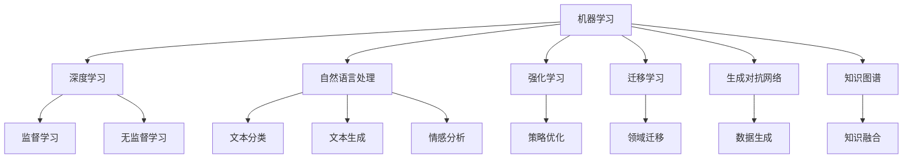

                 

## 1. 背景介绍

### 1.1 问题由来

随着计算机科学和人工智能的快速发展，我们正处在从软件 1.0 向软件 2.0 转型的关键时期。软件 1.0 是基于规则和硬编码的逻辑，程序员通过明确地编写代码来完成任务。而软件 2.0 则以机器学习和人工智能为核心，构建了一种更加动态、灵活、可扩展的系统。人工智能本质上是模拟人类智能的一种技术，它通过机器学习、深度学习等方法，实现自主学习、决策和优化。

### 1.2 问题核心关键点

理解人工智能的本质，有助于我们深入探索其潜力和局限性，从而更好地应用这一技术。人工智能的核心在于其学习能力和泛化能力。它可以从大量数据中学习规律，并能够处理复杂、非线性的问题。同时，它也能够进行自主决策和优化，解决许多传统规则系统无法处理的问题。然而，人工智能也面临着数据依赖、模型复杂、伦理问题等挑战。

### 1.3 问题研究意义

研究人工智能的本质，对于推动技术的进步、解决复杂的实际问题、提升社会生产力具有重要意义。人工智能可以帮助我们处理大量数据，优化决策过程，实现自动驾驶、智能推荐、医疗诊断等功能，极大地提升人类生活的便利性和效率。同时，人工智能的研究也将促进更广泛的社会变革，推动技术民主化和普惠化。

## 2. 核心概念与联系

### 2.1 核心概念概述

人工智能的核心概念包括：

- 机器学习：一种使计算机能够通过数据学习规律，自主改进算法的过程。
- 深度学习：一种基于神经网络的机器学习方法，模拟人脑神经元的工作机制。
- 自然语言处理：使计算机能够理解和处理人类语言的技术。
- 强化学习：通过试错反馈，使机器在特定环境中不断优化其行为策略。
- 迁移学习：将一个领域学到的知识迁移到另一个领域中，提高学习效率和效果。
- 生成对抗网络（GAN）：通过生成模型和判别模型的对抗训练，生成高质量的数据或图像。
- 知识图谱：一种将知识结构化的表示方式，用于辅助机器推理和决策。

这些概念之间有着密切的联系，构成了人工智能技术的核心框架。通过理解这些概念，可以更好地掌握人工智能的技术方法和应用场景。

### 2.2 概念间的关系

这些核心概念之间的关系可以通过以下Mermaid流程图来展示：



这个流程图展示了各个核心概念之间的联系和应用场景：

1. 机器学习是深度学习的基础，也是自然语言处理、强化学习等技术的基础。
2. 深度学习是机器学习的一种高级形式，能够处理更为复杂的数据和问题。
3. 自然语言处理利用深度学习技术，实现文本分类、情感分析、机器翻译等功能。
4. 强化学习用于策略优化，是自动驾驶、机器人控制等领域的关键技术。
5. 迁移学习通过领域迁移，提高学习效率和效果，适用于数据量较小或难以标注的问题。
6. 生成对抗网络用于生成高质量数据或图像，是计算机视觉、自然语言处理等领域的重要工具。
7. 知识图谱用于知识表示和推理，辅助机器决策和优化。

这些概念共同构成了人工智能技术的完整生态系统，它们之间的相互协作和融合，推动了人工智能技术的不断进步和应用。

## 3. 核心算法原理 & 具体操作步骤

### 3.1 算法原理概述

人工智能的核心算法原理包括以下几个方面：

- 监督学习：通过标注数据训练模型，使其能够预测新数据的标签。
- 无监督学习：利用数据的内在结构和规律，发现数据的隐藏特征。
- 半监督学习：结合少量标注数据和大量未标注数据，提高学习效果。
- 强化学习：通过试错反馈，不断优化决策策略，实现自主决策。
- 迁移学习：将一个领域学到的知识迁移到另一个领域，提高学习效率。
- 生成对抗网络：通过生成模型和判别模型的对抗训练，生成高质量数据或图像。

这些算法原理共同构成了人工智能技术的核心框架，通过理解这些原理，可以更好地掌握人工智能的技术方法和应用场景。

### 3.2 算法步骤详解

以深度学习为例，其基本步骤如下：

1. **数据准备**：收集和处理数据，确保数据质量和多样性。
2. **模型选择**：选择合适的深度学习模型，如卷积神经网络、循环神经网络、变分自编码器等。
3. **模型训练**：使用标注数据训练模型，调整模型参数，使其能够很好地拟合数据。
4. **模型评估**：使用验证集评估模型性能，选择合适的模型和超参数。
5. **模型应用**：将模型应用到实际问题中，进行预测、分类、生成等任务。

深度学习的这些步骤具有高度的可扩展性和灵活性，可以应用于各种复杂的实际问题中。

### 3.3 算法优缺点

深度学习具有以下优点：

- 能够处理大规模、高维度的数据，具有很强的泛化能力。
- 能够自动发现数据中的隐含特征，无需人工设计特征。
- 在图像、语音、自然语言处理等领域取得了显著的成果。

同时，深度学习也存在一些缺点：

- 模型复杂，需要大量计算资源和标注数据。
- 容易过拟合，需要仔细设计损失函数和正则化策略。
- 可解释性较差，难以理解其内部的决策过程。
- 对于非线性关系的问题，可能存在局限性。

### 3.4 算法应用领域

深度学习在多个领域中得到了广泛应用，包括：

- 计算机视觉：如图像分类、目标检测、图像生成等。
- 自然语言处理：如机器翻译、情感分析、文本生成等。
- 语音识别：如语音合成、语音识别等。
- 医疗健康：如疾病诊断、图像分析等。
- 金融科技：如信用评分、风险预测等。

## 4. 数学模型和公式 & 详细讲解 & 举例说明

### 4.1 数学模型构建

人工智能中的数学模型主要包括以下几个方面：

- 线性回归模型：用于预测连续变量，表达式为 $y = \theta_0 + \theta_1x_1 + \theta_2x_2 + \cdots + \theta_nx_n$。
- 逻辑回归模型：用于二分类任务，表达式为 $P(y|x) = \frac{1}{1+e^{-z}}$，其中 $z = \theta_0 + \theta_1x_1 + \theta_2x_2 + \cdots + \theta_nx_n$。
- 卷积神经网络：用于图像处理，表达式为 $h(x) = \max\{f(x)*w\}$，其中 $w$ 为卷积核。
- 循环神经网络：用于时间序列数据，表达式为 $h_t = \tanh(W_hh_{t-1} + Whx_t + b_h)$。
- 生成对抗网络：包括生成器和判别器两个部分，生成器的目标是最小化判别器的误差，判别器的目标是最大化生成器的误差。

### 4.2 公式推导过程

以卷积神经网络为例，其基本公式推导如下：

1. 卷积运算：$g(x, \omega) = \sum_{k=1}^n \omega_k g_k(x)$，其中 $g(x)$ 为输入数据，$\omega$ 为卷积核。
2. 激活函数：$h(x) = \max\{g(x)*w\}$，其中 $w$ 为卷积核。
3. 池化运算：$h(x) = \max\{h(x)*\omega\}$，其中 $\omega$ 为池化核。
4. 全连接层：$y = \theta^Th$，其中 $\theta$ 为权重矩阵，$h$ 为全连接层的输入。

### 4.3 案例分析与讲解

以图像分类为例，其基本流程如下：

1. **数据准备**：收集图像数据，进行数据增强和预处理。
2. **模型选择**：选择合适的卷积神经网络模型，如LeNet、AlexNet、VGG等。
3. **模型训练**：使用标注数据训练模型，调整模型参数，使其能够很好地拟合数据。
4. **模型评估**：使用验证集评估模型性能，选择合适的模型和超参数。
5. **模型应用**：将模型应用到实际问题中，进行图像分类。

## 5. 项目实践：代码实例和详细解释说明

### 5.1 开发环境搭建

在进行人工智能项目开发前，我们需要准备好开发环境。以下是使用Python进行PyTorch开发的环境配置流程：

1. 安装Anaconda：从官网下载并安装Anaconda，用于创建独立的Python环境。

2. 创建并激活虚拟环境：
```bash
conda create -n pytorch-env python=3.8 
conda activate pytorch-env
```

3. 安装PyTorch：根据CUDA版本，从官网获取对应的安装命令。例如：
```bash
conda install pytorch torchvision torchaudio cudatoolkit=11.1 -c pytorch -c conda-forge
```

4. 安装TensorFlow：
```bash
conda install tensorflow=2.5
```

5. 安装各类工具包：
```bash
pip install numpy pandas scikit-learn matplotlib tqdm jupyter notebook ipython
```

完成上述步骤后，即可在`pytorch-env`环境中开始人工智能项目开发。

### 5.2 源代码详细实现

这里我们以图像分类任务为例，给出使用PyTorch进行卷积神经网络训练的代码实现。

首先，定义数据处理函数：

```python
import torch
from torchvision import datasets, transforms

transform = transforms.Compose([
    transforms.Resize((224, 224)),
    transforms.ToTensor(),
    transforms.Normalize(mean=[0.485, 0.456, 0.406], std=[0.229, 0.224, 0.225])
])

train_dataset = datasets.CIFAR10(root='./data', train=True, download=True, transform=transform)
test_dataset = datasets.CIFAR10(root='./data', train=False, download=True, transform=transform)
```

然后，定义模型和优化器：

```python
import torch.nn as nn
import torch.optim as optim

class Net(nn.Module):
    def __init__(self):
        super(Net, self).__init__()
        self.conv1 = nn.Conv2d(3, 6, 5)
        self.pool = nn.MaxPool2d(2, 2)
        self.conv2 = nn.Conv2d(6, 16, 5)
        self.fc1 = nn.Linear(16 * 5 * 5, 120)
        self.fc2 = nn.Linear(120, 84)
        self.fc3 = nn.Linear(84, 10)

    def forward(self, x):
        x = self.pool(torch.relu(self.conv1(x)))
        x = self.pool(torch.relu(self.conv2(x)))
        x = x.view(-1, 16 * 5 * 5)
        x = torch.relu(self.fc1(x))
        x = torch.relu(self.fc2(x))
        x = self.fc3(x)
        return x

model = Net()
optimizer = optim.SGD(model.parameters(), lr=0.001, momentum=0.9)
```

接着，定义训练和评估函数：

```python
import torch.nn.functional as F

device = torch.device('cuda' if torch.cuda.is_available() else 'cpu')
model.to(device)

def train(epoch):
    model.train()
    for batch_idx, (data, target) in enumerate(train_loader):
        data, target = data.to(device), target.to(device)
        optimizer.zero_grad()
        output = model(data)
        loss = F.cross_entropy(output, target)
        loss.backward()
        optimizer.step()
        if batch_idx % 100 == 0:
            print('Train Epoch: {} [{}/{} ({:.0f}%)]\tLoss: {:.6f}'.format(
                epoch, batch_idx * len(data), len(train_loader.dataset),
                100. * batch_idx / len(train_loader), loss.item()))

def test():
    model.eval()
    test_loss = 0
    correct = 0
    with torch.no_grad():
        for data, target in test_loader:
            data, target = data.to(device), target.to(device)
            output = model(data)
            test_loss += F.cross_entropy(output, target, reduction='sum').item()
            pred = output.argmax(1, keepdim=True)
            correct += pred.eq(target.view_as(pred)).sum().item()

    test_loss /= len(test_loader.dataset)
    print('\nTest set: Average loss: {:.4f}, Accuracy: {}/{} ({:.0f}%)\n'.format(
        test_loss, correct, len(test_loader.dataset),
        100. * correct / len(test_loader.dataset)))
```

最后，启动训练流程并在测试集上评估：

```python
epochs = 10
train_loader = torch.utils.data.DataLoader(train_dataset, batch_size=64, shuffle=True)
test_loader = torch.utils.data.DataLoader(test_dataset, batch_size=100)

for epoch in range(epochs):
    train(epoch)
    test()
```

以上就是使用PyTorch进行卷积神经网络训练的完整代码实现。可以看到，使用PyTorch和TensorFlow等深度学习框架，可以方便地实现深度学习模型的开发和训练。

### 5.3 代码解读与分析

让我们再详细解读一下关键代码的实现细节：

**定义数据处理函数**：
- 使用`transforms.Compose`组合多个数据预处理步骤，如调整大小、转换为Tensor、标准化等。

**定义模型和优化器**：
- 定义了一个简单的卷积神经网络，包含卷积层、池化层、全连接层等组件。
- 使用`optim.SGD`定义优化器，采用随机梯度下降算法，学习率为0.001，动量为0.9。

**定义训练和评估函数**：
- 在训练函数中，通过`torch.no_grad()`禁用模型梯度计算，加速推理速度。
- 在测试函数中，使用`torch.no_grad()`禁用模型梯度计算，计算模型在测试集上的平均损失和准确率。

**启动训练流程**：
- 在训练函数中，使用`torch.utils.data.DataLoader`将数据集划分为批次，方便模型训练。
- 在测试函数中，使用`torch.utils.data.DataLoader`将数据集划分为批次，方便模型评估。

可以看到，PyTorch和TensorFlow等深度学习框架极大地简化了深度学习模型的开发和训练，使得开发者可以专注于模型设计和算法优化，而不必过多关注底层实现细节。

## 6. 实际应用场景

### 6.1 智能推荐系统

人工智能在智能推荐系统中的应用非常广泛。传统的推荐系统依赖于用户的显式反馈数据，难以处理用户的隐式偏好和多样性。人工智能通过分析用户的历史行为、兴趣和社交网络等数据，可以实现更加个性化和多样化的推荐。

以电商平台为例，通过用户的行为数据和商品的属性信息，构建用户-商品关联矩阵，使用协同过滤算法进行推荐。同时，利用深度学习技术，提取用户和商品的隐含特征，进一步提高推荐效果。

### 6.2 智能客服系统

人工智能在智能客服系统中的应用也非常广泛。传统的客服系统依赖于人工客服，无法24小时不间断服务，且响应速度慢，准确率低。人工智能通过自然语言处理技术，实现自动问答和语音识别，提供全天候、高效、准确的客服服务。

在实践中，可以收集企业内部的历史客服对话记录，将问题和最佳答复构建成监督数据，在此基础上对预训练模型进行微调。微调后的模型能够自动理解用户意图，匹配最合适的答案模板进行回复。对于客户提出的新问题，还可以接入检索系统实时搜索相关内容，动态组织生成回答。

### 6.3 自动驾驶系统

人工智能在自动驾驶系统中的应用前景广阔。传统的自动驾驶系统依赖于规则和传感器数据，难以处理复杂多变的交通场景和突发事件。人工智能通过深度学习和强化学习技术，实现自主决策和优化，提高自动驾驶的安全性和可靠性。

在实践中，可以收集大量的交通数据，使用深度学习技术进行图像处理和物体检测，使用强化学习技术进行决策和路径规划。通过不断优化模型，提升自动驾驶的智能化水平。

### 6.4 未来应用展望

随着人工智能技术的不断发展，未来将在更多领域得到应用，为社会带来深远影响。

在智慧医疗领域，基于人工智能的诊断、治疗和药物研发将大大提升医疗服务的智能化水平，辅助医生诊疗，加速新药开发进程。在智慧教育领域，基于人工智能的作业批改、学情分析、知识推荐等功能，因材施教，促进教育公平，提高教学质量。在智慧城市治理中，基于人工智能的舆情监测、智能交通、应急指挥等环节，提高城市管理的自动化和智能化水平，构建更安全、高效的未来城市。

此外，在企业生产、社会治理、文娱传媒等众多领域，人工智能的应用也将不断涌现，为经济社会发展注入新的动力。相信随着技术的不断进步，人工智能必将在更广阔的应用领域大放异彩，深刻影响人类的生产生活方式。

## 7. 工具和资源推荐

### 7.1 学习资源推荐

为了帮助开发者系统掌握人工智能技术的基础和应用，这里推荐一些优质的学习资源：

1. 《深度学习》书籍：Ian Goodfellow等著作，全面介绍了深度学习的原理和应用。
2. 《自然语言处理综论》书籍：Daniel Jurafsky和James H. Martin著作，深入浅出地介绍了自然语言处理的基本概念和技术。
3. 深度学习框架官方文档：如PyTorch、TensorFlow、MXNet等深度学习框架的官方文档，提供了丰富的学习资源和示例代码。
4. 在线课程：如Coursera、edX、Udacity等平台的深度学习和人工智能课程，提供了系统的学习和实践机会。
5. 开源项目：如GitHub上的TensorFlow、PyTorch等项目，提供了丰富的学习资源和实践机会。

通过对这些资源的学习实践，相信你一定能够快速掌握人工智能技术的精髓，并用于解决实际的业务问题。

### 7.2 开发工具推荐

高效的开发离不开优秀的工具支持。以下是几款用于人工智能开发常用的工具：

1. PyTorch：基于Python的开源深度学习框架，灵活动态的计算图，适合快速迭代研究。
2. TensorFlow：由Google主导开发的开源深度学习框架，生产部署方便，适合大规模工程应用。
3. Keras：基于Python的深度学习框架，提供了简单易用的API，适合快速原型开发。
4. Jupyter Notebook：基于Python的交互式笔记本，支持代码编写、运行和可视化，是数据科学和机器学习的常用工具。
5. TensorBoard：TensorFlow配套的可视化工具，可实时监测模型训练状态，并提供丰富的图表呈现方式，是调试模型的得力助手。

合理利用这些工具，可以显著提升人工智能开发和研究的效率，加快创新迭代的步伐。

### 7.3 相关论文推荐

人工智能的研究源于学界的持续研究。以下是几篇奠基性的相关论文，推荐阅读：

1. 深度学习：Hinton等提出，推动了深度学习技术的发展。
2. 自然语言处理：Collobert等提出，推动了自然语言处理技术的发展。
3. 强化学习：Sutton和Barto著作《强化学习》，全面介绍了强化学习的原理和应用。
4. 生成对抗网络：Goodfellow等提出，推动了生成对抗网络技术的发展。
5. 迁移学习：Pan和Yang提出，推动了迁移学习技术的发展。

这些论文代表了大数据和人工智能技术的发展脉络。通过学习这些前沿成果，可以帮助研究者把握学科前进方向，激发更多的创新灵感。

除上述资源外，还有一些值得关注的前沿资源，帮助开发者紧跟人工智能技术的最新进展，例如：

1. arXiv论文预印本：人工智能领域最新研究成果的发布平台，包括大量尚未发表的前沿工作，学习前沿技术的必读资源。
2. 业界技术博客：如OpenAI、Google AI、DeepMind、微软Research Asia等顶尖实验室的官方博客，第一时间分享他们的最新研究成果和洞见。
3. 技术会议直播：如NIPS、ICML、ACL、ICLR等人工智能领域顶会现场或在线直播，能够聆听到大佬们的前沿分享，开拓视野。
4. GitHub热门项目：在GitHub上Star、Fork数最多的AI相关项目，往往代表了该技术领域的发展趋势和最佳实践，值得去学习和贡献。
5. 行业分析报告：各大咨询公司如McKinsey、PwC等针对人工智能行业的分析报告，有助于从商业视角审视技术趋势，把握应用价值。

总之，对于人工智能的学习和实践，需要开发者保持开放的心态和持续学习的意愿。多关注前沿资讯，多动手实践，多思考总结，必将收获满满的成长收益。

## 8. 总结：未来发展趋势与挑战

### 8.1 研究成果总结

本文对人工智能的本质和技术方法进行了全面系统的介绍。人工智能的核心在于其学习能力和泛化能力，能够从大量数据中学习规律，自主进行决策和优化。同时，人工智能也面临着数据依赖、模型复杂、伦理问题等挑战，需要更多的理论和实践探索。

### 8.2 未来发展趋势

未来人工智能技术将呈现以下几个发展趋势：

1. 模型规模持续增大：随着算力成本的下降和数据规模的扩张，深度学习模型的参数量还将持续增长。超大规模模型蕴含的丰富语言知识，有望支撑更加复杂多变的应用。
2. 微调技术不断发展：未来将涌现更多参数高效的微调方法，如LoRA、Prompt Tuning等，在固定大部分预训练参数的情况下，仍能取得不错的微调效果。
3. 多模态学习兴起：未来将更加关注多模态数据的整合，融合视觉、语音、文本等多种信息源，提升模型的鲁棒性和泛化能力。
4. 跨领域迁移学习：未来将更加注重跨领域知识的迁移，将一个领域学到的知识迁移到另一个领域中，提高学习效率和效果。
5. 因果学习广泛应用：通过引入因果推断方法，增强模型的因果关系分析能力，提升决策的可靠性和准确性。
6. 可解释性增强：未来将更加注重模型的可解释性，通过可视化、符号化表示等方法，提升模型的可理解性和可解释性。
7. 伦理和安全保障：未来将更加注重人工智能的伦理和安全问题，确保算法的透明、公平、可信，避免有害的偏见和歧视。

以上趋势凸显了人工智能技术的广阔前景，这些方向的探索发展，必将进一步提升人工智能系统的性能和应用范围，为人类认知智能的进化带来深远影响。

### 8.3 面临的挑战

尽管人工智能技术已经取得了瞩目成就，但在迈向更加智能化、普适化应用的过程中，它仍面临着诸多挑战：

1. 数据依赖：深度学习模型需要大量标注数据，难以应用于某些小数据量或难以标注的任务。
2. 模型鲁棒性：模型在特定领域或特定条件下可能表现不佳，存在一定的泛化能力不足的问题。
3. 可解释性：深度学习模型往往是“黑盒”系统，难以理解其内部的决策过程，缺乏可解释性。
4. 伦理安全：深度学习模型可能学习到有害的偏见和歧视，对社会带来负面影响。
5. 计算资源：超大规模深度学习模型需要大量的计算资源和存储空间，难以在低端设备上运行。

这些挑战需要从技术、伦理、社会等多个方面进行综合考虑，推动人工智能技术的可持续发展。

### 8.4 研究展望

面对人工智能技术所面临的挑战，未来的研究需要在以下几个方面寻求新的突破：

1. 无监督和半监督学习：摆脱对大量标注数据的依赖，利用自监督学习、主动学习等方法，最大限度地利用非结构化数据。
2. 参数高效和计算高效的微调方法：开发更加参数高效的微调方法，减少计算资源消耗，实现轻量级、实时性的部署。
3. 跨模态学习和融合：融合视觉、语音、文本等多种信息源，提升模型的鲁棒性和泛化能力。
4. 因果学习和推理：引入因果推断方法，增强模型的因果关系分析能力，提升决策的可靠性和准确性。
5. 可解释性和符号化表示：通过可视化、符号化表示等方法，提升模型的可理解性和可解释性。
6. 伦理和公平性：在算法目标中引入伦理导向的评估指标，过滤和惩罚有害的偏见和歧视，确保算法的透明、公平、可信。

这些研究方向将引领人工智能技术迈向更高的台阶，为构建安全、可靠、可解释、可控的智能系统铺平道路。面向未来，人工智能技术还需要与其他人工智能技术进行更深入的融合，如知识表示、因果推理、强化学习等，多路径协同发力，共同推动自然语言理解和智能交互系统的进步。

## 9. 附录：常见问题与解答

**Q1：深度学习为什么需要大量的标注数据？**

A: 深度学习模型是通过大量标注数据进行训练的，标注数据的质量和数量直接影响模型的泛化能力。标注数据的质量越高，模型的泛化能力越强。同时，标注数据的量越大，模型的泛化能力也越好。在实际应用中，可以通过数据增强、迁移学习等方法，降低对标注数据的依赖。

**Q2：深度学习模型为什么容易过拟合？**

A: 深度学习模型具有强大的拟合能力，但同时也容易过拟合。过拟合的原因主要有以下几点：
1. 模型复杂：深度学习模型具有多个隐藏

