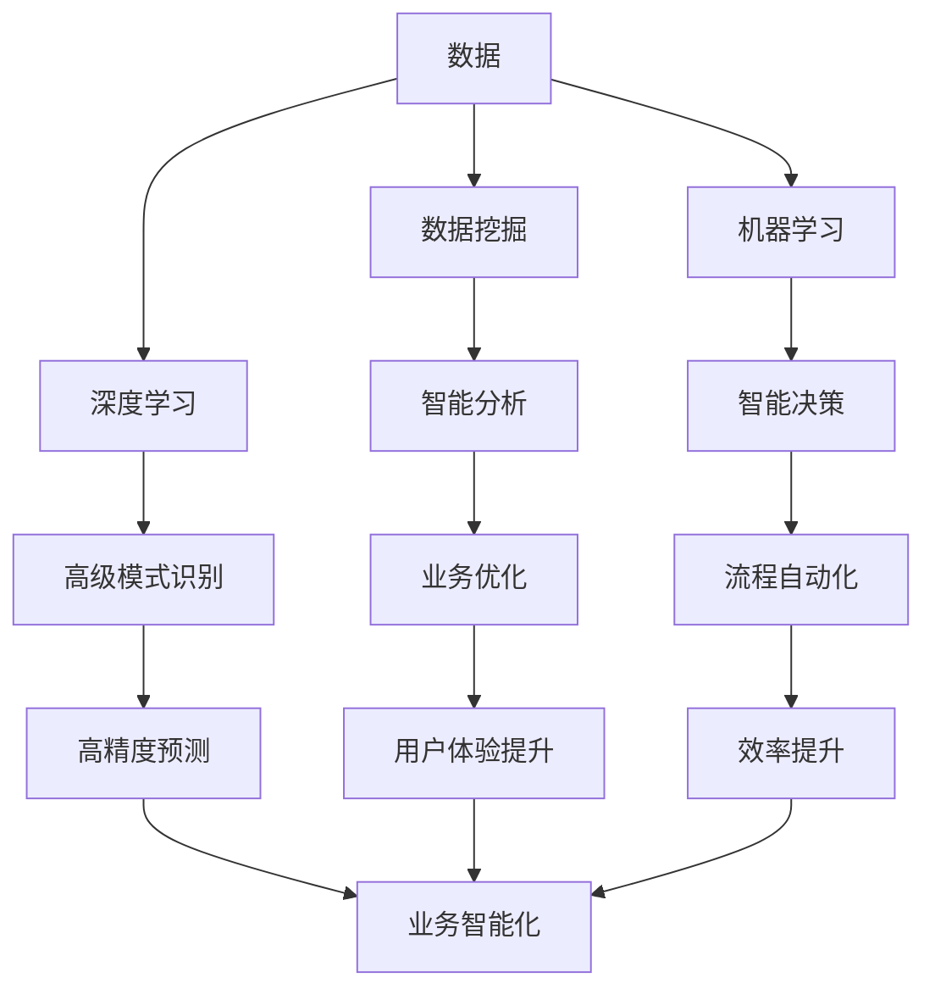
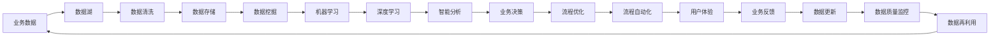

                 

## 1. 背景介绍

### 1.1 问题由来

随着信息技术的发展，软件的角色从传统的工具转变为决策驱动的核心引擎。数据在各行各业中的应用日益广泛，推动着传统软件开发范式向数据驱动的"软件 2.0"时代演进。在这个时代，软件不仅仅是执行任务的命令，更是通过对大量数据进行分析、处理和推理，辅助决策和优化流程的工具。

### 1.2 问题核心关键点

软件 2.0 时代的关键点在于：

- **数据中心化**：数据成为软件的核心，数据的获取、存储、处理、分析等环节在软件系统中占据重要地位。
- **算法智能化**：传统的软件开发侧重于流程逻辑设计，而在软件 2.0 时代，算法智能化成为软件创新的关键，尤其是机器学习、深度学习等人工智能技术的应用。
- **人机协同**：软件 2.0 时代强调人机协同，软件系统不仅要智能化，还要具备与人类交互的能力，提供更好的用户体验。

### 1.3 问题研究意义

研究软件 2.0 时代的关键技术和应用，对于推动人工智能技术在各个行业的应用，提升业务效率和决策水平，具有重要意义：

- **降低开发成本**：通过数据驱动的开发方法，可以大幅减少传统软件开发中的重复工作，提升开发效率。
- **优化业务流程**：数据分析和智能算法可以优化业务流程，提高运营效率和决策质量。
- **增强用户体验**：人机协同的智能系统可以提供个性化的服务和支持，提升用户满意度。
- **推动行业升级**：软件 2.0 时代的技术和应用，可以为各行各业带来新的发展机遇，推动行业数字化转型升级。

## 2. 核心概念与联系

### 2.1 核心概念概述

为了更好地理解软件 2.0 时代的关键技术，本节将介绍几个核心概念：

- **软件 2.0**：一种基于数据驱动的软件开发模式，强调利用算法和数据模型来处理和优化业务问题。
- **机器学习**：一种人工智能技术，通过训练数据模型，使其具备自主学习和决策的能力。
- **深度学习**：一种特殊的机器学习技术，通过多层神经网络结构，进行复杂的模式识别和分类。
- **数据挖掘**：通过挖掘数据中的隐含知识，发现数据模式和关联性，用于数据驱动的决策支持。
- **人机交互**：通过自然语言处理、计算机视觉等技术，实现人机之间的交互和理解，提升用户体验。

这些核心概念构成了软件 2.0 时代的技术基础，相辅相成，共同驱动着软件系统的发展。

### 2.2 概念间的关系

这些核心概念之间存在紧密的联系，通过数据驱动和算法优化，可以实现从数据收集、处理到分析和应用的全链路智能软件系统。以下Mermaid流程图展示了这些概念之间的关系：



该流程图展示了数据、挖掘、学习和决策等关键环节的相互关系：

1. **数据收集**：通过各种渠道获取业务数据。
2. **数据挖掘**：从数据中提取有价值的信息和模式。
3. **机器学习**：基于数据训练模型，使其具备学习能力和决策功能。
4. **深度学习**：通过复杂神经网络结构，提高模型的复杂度，增强学习能力。
5. **智能分析**：利用模型进行预测、分类等高级分析。
6. **智能决策**：结合业务逻辑，指导业务决策。
7. **业务优化**：根据决策结果优化业务流程。
8. **流程自动化**：将智能决策自动化到流程中。
9. **高级预测**：通过深度学习模型进行精准预测。
10. **用户体验提升**：通过人机交互技术，提升用户交互体验。
11. **效率提升**：优化业务流程，提升整体效率。
12. **业务智能化**：将智能分析结果应用到业务中，推动业务智能化发展。

### 2.3 核心概念的整体架构

最后，我们用一个综合的流程图来展示这些核心概念在大数据驱动的软件系统中的整体架构：



这个流程图展示了从业务数据到智能分析，再到业务决策和优化的完整流程：

1. **数据湖**：集中存储业务数据。
2. **数据清洗**：对数据进行预处理，去除噪声和异常值。
3. **数据存储**：将清洗后的数据存储在数据库中。
4. **数据挖掘**：从数据中提取模式和关联。
5. **机器学习**：训练模型，使其具备学习能力和预测功能。
6. **深度学习**：通过复杂网络结构，提高模型的复杂度和准确度。
7. **智能分析**：利用模型进行高级预测和分类。
8. **业务决策**：根据分析结果进行决策。
9. **流程优化**：根据决策优化业务流程。
10. **流程自动化**：将决策自动化到业务流程中。
11. **用户体验**：通过人机交互提升用户体验。
12. **业务反馈**：收集业务反馈，进行数据更新。
13. **数据质量监控**：监控数据质量，确保数据准确性和完整性。
14. **数据再利用**：将已使用的数据进行再分析和再应用。

## 3. 核心算法原理 & 具体操作步骤
### 3.1 算法原理概述

软件 2.0 时代的关键算法包括数据挖掘、机器学习和深度学习等。下面简要介绍这些算法的核心原理：

- **数据挖掘**：通过统计分析、模式识别等技术，从数据中发现隐含的关联和规律。
- **机器学习**：通过训练数据集，使模型学习数据的特征和关系，从而进行预测和分类。
- **深度学习**：通过多层神经网络结构，处理高维数据，捕捉数据中的复杂关系。

这些算法在软件 2.0 时代的应用，通过数据驱动的方式，优化业务决策和流程，提升业务效率和用户体验。

### 3.2 算法步骤详解

以下以深度学习算法为例，详细介绍其操作步骤：

1. **数据准备**：收集和预处理业务数据，生成训练集和测试集。
2. **模型选择**：选择合适的深度学习模型，如卷积神经网络(CNN)、循环神经网络(RNN)、长短期记忆网络(LSTM)等。
3. **模型训练**：使用训练集对模型进行训练，优化模型参数，使其在测试集上表现最佳。
4. **模型评估**：在测试集上评估模型性能，确定模型泛化能力。
5. **模型部署**：将训练好的模型部署到实际应用中，进行业务优化和流程自动化。

### 3.3 算法优缺点

数据驱动的深度学习算法具有以下优点：

- **自动化程度高**：能够自动提取数据特征，进行模型训练和优化，减少人工干预。
- **准确度高**：深度学习模型在处理复杂数据时，具备较高的准确度和鲁棒性。
- **可扩展性强**：深度学习模型可以通过增加网络层和参数，提升模型复杂度和预测能力。

但同时，深度学习算法也存在一些缺点：

- **数据需求大**：深度学习模型需要大量标注数据进行训练，数据获取成本较高。
- **计算资源需求高**：深度学习模型训练和推理需要强大的计算资源和硬件支持。
- **模型可解释性差**：深度学习模型通常是一个"黑盒"，难以解释其内部决策逻辑。

### 3.4 算法应用领域

深度学习算法在软件 2.0 时代的应用领域广泛，包括但不限于以下几个方面：

- **自然语言处理(NLP)**：如文本分类、情感分析、机器翻译等。
- **计算机视觉(CV)**：如图像分类、目标检测、人脸识别等。
- **智能推荐系统**：如个性化推荐、广告投放优化等。
- **金融风险管理**：如信用评分、欺诈检测等。
- **医疗健康**：如疾病诊断、药物研发等。

这些应用展示了深度学习算法在数据驱动的软件系统中的强大潜力。

## 4. 数学模型和公式 & 详细讲解 & 举例说明

### 4.1 数学模型构建

深度学习算法通常使用多层神经网络结构，通过反向传播算法进行模型训练。以一个简单的二分类任务为例，构建深度学习模型的数学模型如下：

1. **输入层**：将输入数据 $x$ 映射到高维空间中的向量 $X$。
2. **隐藏层**：通过多层神经网络处理数据，提取特征 $Z$。
3. **输出层**：将隐藏层特征 $Z$ 映射到二分类结果 $y$。

形式化地，深度学习模型的输入输出关系可以表示为：

$$
y = \sigma(W^TX + b)
$$

其中，$\sigma$ 为激活函数，$W$ 为权重矩阵，$b$ 为偏置项。

### 4.2 公式推导过程

以一个简单的二分类任务为例，推导深度学习模型的损失函数和梯度更新公式：

假设模型在训练集上的损失函数为交叉熵损失，形式化表示为：

$$
\mathcal{L}(y, \hat{y}) = -\frac{1}{N}\sum_{i=1}^N[y_i\log \hat{y_i} + (1-y_i)\log(1-\hat{y_i})]
$$

其中，$y_i$ 为真实标签，$\hat{y_i}$ 为模型预测结果。

利用链式法则，计算损失函数对权重矩阵 $W$ 的梯度：

$$
\frac{\partial \mathcal{L}}{\partial W} = \frac{\partial \mathcal{L}}{\partial Z} \frac{\partial Z}{\partial W}
$$

其中，$\frac{\partial \mathcal{L}}{\partial Z}$ 表示隐藏层特征对损失函数的梯度，$\frac{\partial Z}{\partial W}$ 表示权重矩阵对隐藏层特征的导数。

根据上述公式，可以使用反向传播算法更新权重矩阵 $W$ 和偏置项 $b$，从而优化模型性能。

### 4.3 案例分析与讲解

以图像分类任务为例，展示深度学习模型的训练和推理过程：

1. **数据准备**：收集训练集和测试集，预处理图像数据，生成输入和标签。
2. **模型选择**：选择卷积神经网络(CNN)模型，如LeNet、AlexNet、VGG等。
3. **模型训练**：使用训练集对CNN模型进行训练，优化权重矩阵和偏置项，使得模型在测试集上表现最佳。
4. **模型评估**：在测试集上评估模型性能，确定模型泛化能力。
5. **模型部署**：将训练好的CNN模型部署到实际应用中，进行图像分类和识别。

## 5. 项目实践：代码实例和详细解释说明

### 5.1 开发环境搭建

进行深度学习项目开发前，需要准备好开发环境。以下是使用Python进行TensorFlow和Keras开发的开发环境配置流程：

1. 安装Anaconda：从官网下载并安装Anaconda，用于创建独立的Python环境。
2. 创建并激活虚拟环境：
```bash
conda create -n tf-env python=3.8 
conda activate tf-env
```

3. 安装TensorFlow和Keras：
```bash
conda install tensorflow tensorflow-gpu==2.4.1 
conda install keras==2.4.3
```

4. 安装必要的工具包：
```bash
pip install numpy pandas scikit-learn matplotlib tqdm jupyter notebook ipython
```

完成上述步骤后，即可在`tf-env`环境中开始深度学习项目开发。

### 5.2 源代码详细实现

下面我们以图像分类任务为例，给出使用TensorFlow和Keras对卷积神经网络(CNN)模型进行训练和评估的Python代码实现。

```python
from tensorflow.keras.models import Sequential
from tensorflow.keras.layers import Conv2D, MaxPooling2D, Flatten, Dense
from tensorflow.keras.datasets import mnist
from tensorflow.keras.utils import to_categorical

# 加载MNIST数据集
(x_train, y_train), (x_test, y_test) = mnist.load_data()

# 数据预处理
x_train = x_train.reshape(-1, 28, 28, 1) / 255.0
x_test = x_test.reshape(-1, 28, 28, 1) / 255.0
y_train = to_categorical(y_train)
y_test = to_categorical(y_test)

# 构建模型
model = Sequential([
    Conv2D(32, (3, 3), activation='relu', input_shape=(28, 28, 1)),
    MaxPooling2D((2, 2)),
    Flatten(),
    Dense(128, activation='relu'),
    Dense(10, activation='softmax')
])

# 编译模型
model.compile(optimizer='adam', loss='categorical_crossentropy', metrics=['accuracy'])

# 训练模型
model.fit(x_train, y_train, epochs=10, batch_size=64, validation_data=(x_test, y_test))

# 评估模型
model.evaluate(x_test, y_test)
```

这段代码展示了从数据预处理到模型训练和评估的全过程。

### 5.3 代码解读与分析

让我们再详细解读一下关键代码的实现细节：

- **数据预处理**：将MNIST数据集中的图像数据reshape为三维张量，并进行归一化处理。同时，将标签数据转换为one-hot编码。
- **模型构建**：使用Keras Sequential模型定义卷积神经网络，包括卷积层、池化层、全连接层等。
- **模型编译**：选择合适的优化器、损失函数和评价指标，进行模型编译。
- **模型训练**：使用训练数据集进行模型训练，设置迭代次数和批量大小。
- **模型评估**：使用测试数据集评估模型性能，输出模型在测试集上的准确率。

## 6. 实际应用场景

### 6.1 智能推荐系统

在智能推荐系统中，深度学习算法可以分析用户行为数据，推荐个性化的商品和服务。具体应用场景包括：

- **电商推荐**：分析用户浏览历史、购买记录等数据，推荐相关商品。
- **视频推荐**：分析用户观看历史、评分记录等数据，推荐相关视频内容。
- **新闻推荐**：分析用户阅读历史、点赞记录等数据，推荐相关新闻文章。

### 6.2 金融风险管理

在金融风险管理中，深度学习算法可以分析交易数据，识别异常行为和潜在风险。具体应用场景包括：

- **信用评分**：分析用户历史交易数据，预测其信用风险。
- **欺诈检测**：分析交易记录，识别可疑行为，预防欺诈行为。
- **投资策略**：分析市场数据，预测股票和期货价格，辅助投资决策。

### 6.3 医疗健康

在医疗健康领域，深度学习算法可以分析患者数据，辅助疾病诊断和治疗。具体应用场景包括：

- **疾病预测**：分析患者病历数据，预测患病风险。
- **药物研发**：分析化合物和基因数据，预测药物效果和副作用。
- **影像诊断**：分析医学影像数据，辅助医生进行疾病诊断。

### 6.4 未来应用展望

随着深度学习算法的不断发展，其在软件 2.0 时代的应用将更加广泛，未来应用前景如下：

1. **自动驾驶**：通过分析传感器数据，深度学习算法可以辅助自动驾驶车辆进行路径规划和避障。
2. **智能家居**：通过分析用户行为数据，深度学习算法可以优化家庭智能设备的使用，提升居住舒适度。
3. **工业制造**：通过分析设备数据，深度学习算法可以预测设备故障，优化生产流程。
4. **智慧城市**：通过分析城市运行数据，深度学习算法可以优化交通流量、提升公共服务。

## 7. 工具和资源推荐

### 7.1 学习资源推荐

为了帮助开发者系统掌握深度学习算法的理论基础和实践技巧，这里推荐一些优质的学习资源：

1. **《深度学习》（Ian Goodfellow等著）**：深入浅出地介绍了深度学习的基本概念和核心算法。
2. **Coursera《深度学习专项课程》**：斯坦福大学Andrew Ng教授主讲，涵盖深度学习的各个方面。
3. **Kaggle竞赛平台**：通过参与数据竞赛，学习和实践深度学习算法。
4. **Google AI博客**：深度学习领域的顶尖实验室分享最新研究成果和洞见。
5. **arXiv论文预印本**：人工智能领域最新研究成果的发布平台，提供丰富的学习资源。

通过对这些资源的学习实践，相信你一定能够快速掌握深度学习算法的精髓，并用于解决实际的业务问题。

### 7.2 开发工具推荐

高效的开发离不开优秀的工具支持。以下是几款用于深度学习开发的常用工具：

1. **TensorFlow**：由Google主导开发的开源深度学习框架，支持分布式计算，适用于大规模工程应用。
2. **PyTorch**：由Facebook开发的深度学习框架，具有动态计算图和灵活的编程接口，适合研究和快速迭代。
3. **Keras**：基于TensorFlow的高级API，提供简洁的编程接口，适合快速开发和实验。
4. **Jupyter Notebook**：支持Python、R等语言，可以交互式地编写和执行代码。
5. **PyCharm**：商业化的Python开发环境，提供丰富的开发工具和调试功能。

合理利用这些工具，可以显著提升深度学习项目的开发效率，加快创新迭代的步伐。

### 7.3 相关论文推荐

深度学习算法的发展源于学界的持续研究。以下是几篇奠基性的相关论文，推荐阅读：

1. **《深度神经网络的结构、算法和应用》（Gulcehre等著）**：全面介绍了深度学习的基本结构和核心算法。
2. **《ImageNet大规模视觉识别挑战赛2020》（He等著）**：展示了深度学习在计算机视觉领域的应用。
3. **《AlphaGo Zero》（Silver等著）**：展示了深度学习在强化学习中的应用。
4. **《BERT: Pre-training of Deep Bidirectional Transformers for Language Understanding》（Devlin等著）**：展示了深度学习在自然语言处理中的应用。
5. **《A Survey on Deep Learning for Healthcare》（Karpathy等著）**：展示了深度学习在医疗健康领域的应用。

这些论文代表了大深度学习算法的发展脉络。通过学习这些前沿成果，可以帮助研究者把握学科前进方向，激发更多的创新灵感。

除上述资源外，还有一些值得关注的前沿资源，帮助开发者紧跟深度学习算法的最新进展，例如：

1. **arXiv论文预印本**：人工智能领域最新研究成果的发布平台，包括大量尚未发表的前沿工作，学习前沿技术的必读资源。
2. **Google AI博客**：深度学习领域的顶尖实验室分享最新研究成果和洞见。
3. **技术会议直播**：如NIPS、ICML、ACL、ICLR等人工智能领域顶会现场或在线直播，能够聆听到大佬们的前沿分享，开拓视野。
4. **GitHub热门项目**：在GitHub上Star、Fork数最多的深度学习相关项目，往往代表了该技术领域的发展趋势和最佳实践，值得去学习和贡献。
5. **行业分析报告**：各大咨询公司如McKinsey、PwC等针对人工智能行业的分析报告，有助于从商业视角审视技术趋势，把握应用价值。

总之，对于深度学习算法的学习与实践，需要开发者保持开放的心态和持续学习的意愿。多关注前沿资讯，多动手实践，多思考总结，必将收获满满的成长收益。

## 8. 总结：未来发展趋势与挑战

### 8.1 总结

本文对软件 2.0 时代的关键算法和应用进行了全面系统的介绍。首先阐述了深度学习算法在数据驱动的软件系统中的核心地位，明确了数据驱动的深度学习算法对业务流程优化和决策智能化的重要作用。其次，从原理到实践，详细讲解了深度学习算法的数学模型、优化算法和应用范式，给出了深度学习任务开发的完整代码实例。同时，本文还广泛探讨了深度学习算法在推荐系统、金融风险管理、医疗健康等多个行业领域的应用前景，展示了数据驱动的深度学习算法在各个领域中的巨大潜力。此外，本文精选了深度学习算法的各类学习资源，力求为读者提供全方位的技术指引。

通过本文的系统梳理，可以看到，深度学习算法在数据驱动的软件系统中的广泛应用，极大地推动了人工智能技术在各行各业的应用。未来，伴随深度学习算法的不断演进，其在软件 2.0 时代的应用将更加广泛，为人类生产生活带来更深刻的变革。

### 8.2 未来发展趋势

展望未来，深度学习算法的发展趋势如下：

1. **模型规模增大**：随着硬件性能的提升和算法优化，深度学习模型的规模将进一步增大，具备更强的表征能力和泛化能力。
2. **算法优化提升**：通过优化算法和结构，深度学习模型将具备更高的效率和准确度。
3. **跨模态融合**：深度学习算法将更加注重跨模态数据的融合，提升对多模态信息的处理能力。
4. **数据驱动决策**：深度学习算法将在更多业务场景中发挥决策支持作用，推动决策智能化发展。
5. **人机协同增强**：深度学习算法将更加注重人机交互，提升用户体验和系统智能度。

这些趋势展示了深度学习算法在软件 2.0 时代的发展方向，推动着数据驱动的智能软件系统不断演进。

### 8.3 面临的挑战

尽管深度学习算法在各个领域中取得了显著成效，但在其广泛应用的过程中，仍面临诸多挑战：

1. **数据质量和标注成本**：高质量数据的获取和标注成本较高，成为制约深度学习算法应用的主要瓶颈。
2. **模型可解释性不足**：深度学习模型通常是一个"黑盒"，难以解释其内部决策逻辑，对高风险应用尤为不利。
3. **鲁棒性和泛化能力**：深度学习模型在面对新数据时，泛化能力可能不足，需要进行持续训练和优化。
4. **计算资源需求高**：深度学习模型训练和推理需要大量计算资源和硬件支持，增加了应用门槛。
5. **隐私和安全问题**：深度学习模型在处理敏感数据时，需要严格保护用户隐私和数据安全。

这些挑战需要我们在算法设计、数据处理、系统架构等方面进行全面优化，才能更好地发挥深度学习算法在软件 2.0 时代的应用价值。

### 8.4 研究展望

面对深度学习算法所面临的挑战，未来的研究需要在以下几个方面寻求新的突破：

1. **无监督学习**：探索无监督学习和半监督学习，降低深度学习模型对大量标注数据的需求。
2. **模型压缩和优化**：通过模型压缩和优化技术，降低深度学习模型的计算资源需求。
3. **知识图谱融合**：将深度学习模型与知识图谱、逻辑规则等知识库结合，提升模型的解释性和可控性。
4. **隐私保护技术**：研究隐私保护技术，确保深度学习模型在处理敏感数据时的安全性。
5. **人机协同交互**：研究人机协同交互技术，提升深度学习系统与用户的交互体验。

这些研究方向将引领深度学习算法在软件 2.0 时代的发展，推动人工智能技术在各个领域中的应用和创新。

## 9. 附录：常见问题与解答

**Q1：数据驱动的软件系统有哪些优点？**

A: 数据驱动的软件系统有以下优点：

- **决策智能化**：通过数据驱动，软件系统具备更高的决策能力和智能化水平，能够自动优化业务流程。
- **业务优化**：数据驱动的软件系统能够实时获取业务数据，优化业务决策和流程，提升运营效率。
- **用户体验提升**：通过数据分析，软件系统能够更好地理解用户需求，提升用户体验和满意度。

**Q2：如何进行深度学习模型的训练和优化？**

A: 深度学习模型的训练和优化通常包括以下步骤：

1. **数据准备**：收集和预处理数据，生成训练集和测试集。
2. **模型选择**：选择合适的深度学习模型，如卷积神经网络(CNN)、循环神经网络(RNN)等。
3. **模型训练**：使用训练集对模型进行训练，优化模型参数。
4. **模型评估**：在测试集上评估模型性能，确定模型泛化能力。
5. **模型优化**：根据评估结果，调整模型结构和参数，进行模型优化。

**Q3：深度学习算法在智能推荐系统中的应用有哪些？**

A: 深度学习算法在智能推荐系统中的应用如下：

1. **电商推荐**：分析用户浏览历史、购买记录等数据，推荐相关商品。
2. **视频推荐**：分析用户观看历史、评分记录等数据，推荐相关视频内容。
3. **新闻推荐**：分析用户阅读历史

