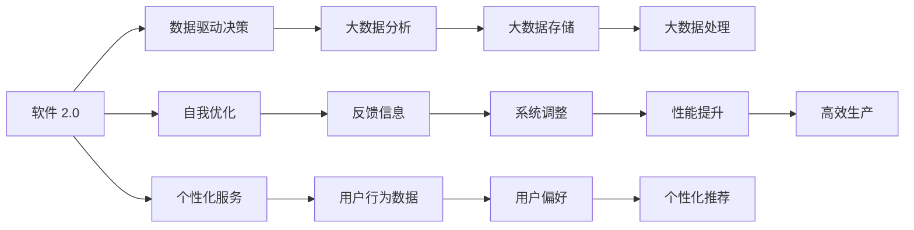
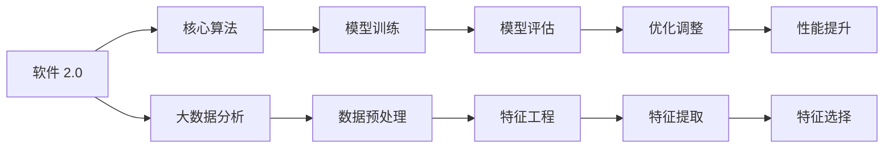
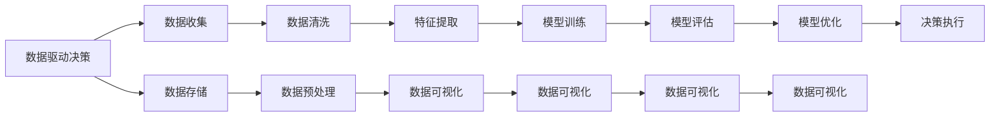
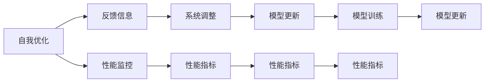
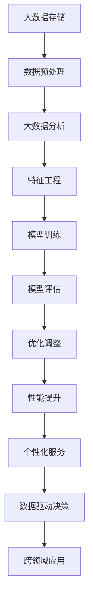

                 

# 软件 2.0 的未来展望：更智能、更强大

## 1. 背景介绍

### 1.1 问题由来

在过去的几十年里，软件行业经历了巨大的变革。从早期的手动编码，到大型应用软件的兴起，再到互联网时代的Web开发，每一次技术的飞跃都深刻地改变了我们的工作和生活方式。如今，随着人工智能（AI）和机器学习（ML）技术的不断进步，软件行业迎来了新的发展方向——软件 2.0（Software 2.0）。

软件 2.0 是指基于AI和ML技术的软件系统，这些系统不仅能够自动执行任务，还能够在无需人类干预的情况下进行自我优化和改进。随着计算能力的提升和数据量的激增，软件 2.0 有望在智能决策、自动控制、个性化推荐等多个领域发挥重要作用，为人类社会带来深远的影响。

### 1.2 问题核心关键点

软件 2.0 的核心在于其强大的自我学习和优化能力。它能够通过收集和分析海量数据，不断提升自身的性能，甚至在某些情况下超越人类的能力。这种能力得益于以下关键点：

- **数据驱动的决策**：软件 2.0 系统通过大数据分析，能够做出更加精准的决策。
- **自我优化**：系统能够根据反馈信息进行自我调整和改进，实现更高的效率和精度。
- **个性化服务**：通过学习用户的偏好和行为模式，软件 2.0 能够提供高度个性化的服务。
- **跨领域应用**：软件 2.0 在多个领域都展现了巨大的潜力，包括医疗、金融、教育等。

### 1.3 问题研究意义

研究软件 2.0 技术，对于推动智能化社会的构建、提升工业生产效率、改善生活质量等方面具有重要意义：

- **提高生产效率**：软件 2.0 能够自动完成复杂的生产流程，减少人为错误，提高生产效率。
- **降低运营成本**：通过优化资源配置，软件 2.0 能够降低企业的运营成本。
- **改善用户体验**：个性化推荐、智能客服等应用能够提升用户的满意度和体验。
- **推动创新发展**：软件 2.0 技术能够加速新应用的开发和部署，促进技术创新。
- **促进社会公平**：通过智能决策和个性化服务，软件 2.0 有助于解决社会不平等问题，促进社会公平。

## 2. 核心概念与联系

### 2.1 核心概念概述

软件 2.0 的核心概念包括：

- **软件 2.0**：基于AI和ML技术的智能软件系统，能够自我学习和优化。
- **数据驱动决策**：通过收集和分析大数据，系统做出最优决策。
- **自我优化**：系统能够根据反馈信息进行自我调整，提升性能。
- **个性化服务**：系统学习用户行为，提供高度个性化的服务。
- **跨领域应用**：软件 2.0 在医疗、金融、教育等多个领域展现潜力。

这些核心概念之间的联系可以通过以下Mermaid流程图来展示：



### 2.2 概念间的关系

这些核心概念之间存在着紧密的联系，形成了软件 2.0 的核心生态系统。下面通过几个Mermaid流程图来展示这些概念之间的关系。

#### 2.2.1 软件 2.0 的核心组件



这个流程图展示了软件 2.0 的核心组件及其之间的关系：

1. **核心算法**：软件 2.0 的核心是算法，如深度学习、强化学习等，用于处理和优化数据。
2. **大数据分析**：收集和分析大数据，获取有价值的信息。
3. **模型训练**：基于数据训练模型，提取有意义的特征。
4. **数据预处理**：对原始数据进行清洗和处理，提高模型训练的效率和准确性。
5. **模型评估**：评估模型的性能，确定是否需要进行调整。
6. **优化调整**：根据评估结果调整模型参数，提高模型性能。
7. **特征工程**：选择和提取对模型训练有帮助的特征。
8. **性能提升**：通过优化调整，提升模型的性能和准确性。

#### 2.2.2 数据驱动决策的流程



这个流程图展示了数据驱动决策的流程：

1. **数据收集**：从不同来源收集数据。
2. **数据存储**：将数据存储在数据库中。
3. **数据清洗**：对数据进行清洗，去除噪声和错误数据。
4. **数据预处理**：对数据进行格式化和标准化，便于后续处理。
5. **特征提取**：从数据中提取有用的特征。
6. **数据可视化**：通过可视化工具展示数据，发现数据规律和趋势。
7. **模型训练**：基于数据训练模型，获取数据规律。
8. **模型评估**：评估模型性能，确定是否需要调整。
9. **模型优化**：根据评估结果调整模型参数，提高模型性能。
10. **决策执行**：根据模型预测结果，执行相应决策。

#### 2.2.3 自我优化的机制



这个流程图展示了自我优化的机制：

1. **反馈信息**：收集系统的运行反馈信息，如错误率、响应时间等。
2. **性能监控**：实时监控系统性能，发现异常和瓶颈。
3. **系统调整**：根据反馈信息和性能监控结果，调整系统参数。
4. **模型更新**：基于调整后的参数，重新训练模型。
5. **性能指标**：评估模型性能，确定是否需要进一步优化。
6. **模型训练**：根据性能指标，重新训练模型，提高性能。

### 2.3 核心概念的整体架构

最后，我们用一个综合的流程图来展示这些核心概念在大规模软件 2.0 系统的整体架构：



这个综合流程图展示了从数据收集到最终应用的全过程。大数据存储、数据预处理、大数据分析、特征工程、模型训练、模型评估、优化调整、性能提升、个性化服务和数据驱动决策等环节，共同构成了软件 2.0 的核心生态系统。

## 3. 核心算法原理 & 具体操作步骤
### 3.1 算法原理概述

软件 2.0 的核心算法包括深度学习、强化学习和迁移学习等。这些算法共同构建了软件 2.0 系统的智能决策和优化能力。

深度学习算法通过构建多层神经网络，可以从大量数据中自动提取特征，并进行复杂模式的识别和预测。强化学习算法通过试错机制，不断调整系统参数，以最大化某个目标函数。迁移学习算法则将已经在新领域学习到的知识，迁移到其他相关领域，以加速学习过程和提高性能。

### 3.2 算法步骤详解

软件 2.0 的开发和部署一般包括以下几个关键步骤：

**Step 1: 数据收集与预处理**
- 收集相关领域的大量数据，确保数据质量和多样性。
- 对数据进行清洗和预处理，去除噪声和错误数据。
- 对数据进行特征提取和工程化，以便后续建模。

**Step 2: 模型训练与优化**
- 选择合适的模型架构，如深度神经网络、卷积神经网络等，进行训练。
- 使用优化算法，如Adam、SGD等，进行模型优化，最小化损失函数。
- 使用正则化技术，如L2正则、Dropout等，防止过拟合。

**Step 3: 模型评估与部署**
- 在验证集上评估模型性能，选择最优模型。
- 对模型进行调参，优化超参数，提高模型性能。
- 将模型部署到实际应用中，进行性能监控和优化。

**Step 4: 自我优化与反馈**
- 收集系统运行反馈信息，如响应时间、错误率等。
- 根据反馈信息，调整系统参数，优化模型性能。
- 定期重新训练模型，保持模型最新状态。

**Step 5: 个性化服务和决策**
- 通过学习用户行为，提供个性化服务，提升用户体验。
- 根据数据驱动决策，执行最优决策，提高系统效率。

### 3.3 算法优缺点

软件 2.0 的算法具有以下优点：

- **高效率**：通过自动化和优化算法，能够快速处理大量数据，提高系统效率。
- **高精度**：深度学习等算法可以自动提取特征，进行精准的预测和决策。
- **自我优化**：系统能够根据反馈信息进行自我调整，提升性能。
- **跨领域应用**：算法可以迁移到多个领域，实现知识共享和复用。

同时，这些算法也存在一些局限性：

- **数据依赖**：算法依赖于高质量、大量的数据，数据获取和处理成本较高。
- **模型复杂**：深度学习等算法模型较为复杂，需要大量计算资源和专业知识。
- **可解释性不足**：算法的决策过程较为复杂，缺乏可解释性，难以调试和优化。
- **安全问题**：算法可能存在偏见和错误，需要额外的人工干预和审核。

### 3.4 算法应用领域

软件 2.0 的算法在多个领域都展现出巨大潜力，例如：

- **医疗诊断**：通过深度学习和迁移学习，系统可以自动分析医疗影像和病历数据，辅助医生诊断。
- **金融分析**：通过强化学习和大数据分析，系统可以实时监控市场动态，预测股票价格和风险。
- **智能客服**：通过自然语言处理和机器学习，系统可以自动解答客户问题，提高服务效率。
- **智能推荐**：通过协同过滤和深度学习，系统可以为用户推荐个性化商品和服务。
- **智能制造**：通过强化学习和大数据分析，系统可以优化生产流程，提高生产效率和质量。

## 4. 数学模型和公式 & 详细讲解  
### 4.1 数学模型构建

在软件 2.0 中，我们通常使用以下数学模型进行建模：

- **深度学习模型**：通过多层神经网络，自动提取数据特征，进行分类、回归等任务。
- **强化学习模型**：通过试错机制，优化系统参数，最大化某个目标函数。
- **迁移学习模型**：通过已有知识迁移，加速新领域的学习过程。

### 4.2 公式推导过程

以深度学习模型为例，我们可以使用以下公式进行建模：

$$
L(y, \hat{y}) = \frac{1}{N} \sum_{i=1}^N \ell(y_i, \hat{y}_i)
$$

其中，$y$ 为真实标签，$\hat{y}$ 为模型预测输出，$\ell$ 为损失函数，$N$ 为样本数量。

在训练过程中，我们使用梯度下降等优化算法，最小化损失函数，更新模型参数：

$$
\theta \leftarrow \theta - \eta \nabla_{\theta} L(y, \hat{y})
$$

其中，$\theta$ 为模型参数，$\eta$ 为学习率，$\nabla_{\theta} L(y, \hat{y})$ 为损失函数对模型参数的梯度。

### 4.3 案例分析与讲解

假设我们构建一个基于深度学习的推荐系统，用于为用户推荐商品。我们可以使用以下步骤进行建模：

**Step 1: 数据收集与预处理**
- 收集用户的历史行为数据，如浏览记录、购买记录等。
- 对数据进行清洗和预处理，去除噪声和错误数据。
- 对数据进行特征提取和工程化，以便后续建模。

**Step 2: 模型训练与优化**
- 选择合适的模型架构，如深度神经网络，进行训练。
- 使用优化算法，如Adam、SGD等，进行模型优化，最小化损失函数。
- 使用正则化技术，如L2正则、Dropout等，防止过拟合。

**Step 3: 模型评估与部署**
- 在验证集上评估模型性能，选择最优模型。
- 对模型进行调参，优化超参数，提高模型性能。
- 将模型部署到实际应用中，进行性能监控和优化。

**Step 4: 自我优化与反馈**
- 收集系统运行反馈信息，如推荐效果、用户满意度等。
- 根据反馈信息，调整系统参数，优化模型性能。
- 定期重新训练模型，保持模型最新状态。

**Step 5: 个性化服务和决策**
- 通过学习用户行为，提供个性化推荐，提升用户体验。
- 根据数据驱动决策，执行最优推荐，提高系统效率。

## 5. 项目实践：代码实例和详细解释说明
### 5.1 开发环境搭建

在进行软件 2.0 项目开发前，我们需要准备好开发环境。以下是使用Python进行PyTorch开发的环境配置流程：

1. 安装Anaconda：从官网下载并安装Anaconda，用于创建独立的Python环境。

2. 创建并激活虚拟环境：
```bash
conda create -n pytorch-env python=3.8 
conda activate pytorch-env
```

3. 安装PyTorch：根据CUDA版本，从官网获取对应的安装命令。例如：
```bash
conda install pytorch torchvision torchaudio cudatoolkit=11.1 -c pytorch -c conda-forge
```

4. 安装各类工具包：
```bash
pip install numpy pandas scikit-learn matplotlib tqdm jupyter notebook ipython
```

完成上述步骤后，即可在`pytorch-env`环境中开始软件 2.0 项目的开发。

### 5.2 源代码详细实现

下面我们以推荐系统为例，给出使用Transformers库对BERT模型进行推荐系统微调的PyTorch代码实现。

首先，定义推荐系统的数据处理函数：

```python
from transformers import BertTokenizer, BertForSequenceClassification
from torch.utils.data import Dataset
import torch

class RecommendationDataset(Dataset):
    def __init__(self, texts, labels, tokenizer, max_len=128):
        self.texts = texts
        self.labels = labels
        self.tokenizer = tokenizer
        self.max_len = max_len
        
    def __len__(self):
        return len(self.texts)
    
    def __getitem__(self, item):
        text = self.texts[item]
        label = self.labels[item]
        
        encoding = self.tokenizer(text, return_tensors='pt', max_length=self.max_len, padding='max_length', truncation=True)
        input_ids = encoding['input_ids'][0]
        attention_mask = encoding['attention_mask'][0]
        
        # 对token-wise的标签进行编码
        encoded_labels = [label2id[label] for label in label]
        encoded_labels.extend([label2id['']]*(self.max_len - len(encoded_labels)))
        labels = torch.tensor(encoded_labels, dtype=torch.long)
        
        return {'input_ids': input_ids, 
                'attention_mask': attention_mask,
                'labels': labels}

# 标签与id的映射
label2id = {'Positive': 1, 'Negative': 0}
id2label = {v: k for k, v in label2id.items()}
```

然后，定义模型和优化器：

```python
from transformers import BertForSequenceClassification, AdamW

model = BertForSequenceClassification.from_pretrained('bert-base-cased', num_labels=2)

optimizer = AdamW(model.parameters(), lr=2e-5)
```

接着，定义训练和评估函数：

```python
from torch.utils.data import DataLoader
from tqdm import tqdm
from sklearn.metrics import classification_report

device = torch.device('cuda') if torch.cuda.is_available() else torch.device('cpu')
model.to(device)

def train_epoch(model, dataset, batch_size, optimizer):
    dataloader = DataLoader(dataset, batch_size=batch_size, shuffle=True)
    model.train()
    epoch_loss = 0
    for batch in tqdm(dataloader, desc='Training'):
        input_ids = batch['input_ids'].to(device)
        attention_mask = batch['attention_mask'].to(device)
        labels = batch['labels'].to(device)
        model.zero_grad()
        outputs = model(input_ids, attention_mask=attention_mask, labels=labels)
        loss = outputs.loss
        epoch_loss += loss.item()
        loss.backward()
        optimizer.step()
    return epoch_loss / len(dataloader)

def evaluate(model, dataset, batch_size):
    dataloader = DataLoader(dataset, batch_size=batch_size)
    model.eval()
    preds, labels = [], []
    with torch.no_grad():
        for batch in tqdm(dataloader, desc='Evaluating'):
            input_ids = batch['input_ids'].to(device)
            attention_mask = batch['attention_mask'].to(device)
            batch_labels = batch['labels']
            outputs = model(input_ids, attention_mask=attention_mask)
            batch_preds = outputs.logits.argmax(dim=2).to('cpu').tolist()
            batch_labels = batch_labels.to('cpu').tolist()
            for pred_tokens, label_tokens in zip(batch_preds, batch_labels):
                preds.append(pred_tokens[:len(label_tokens)])
                labels.append(label_tokens)
                
    print(classification_report(labels, preds))
```

最后，启动训练流程并在测试集上评估：

```python
epochs = 5
batch_size = 16

for epoch in range(epochs):
    loss = train_epoch(model, train_dataset, batch_size, optimizer)
    print(f"Epoch {epoch+1}, train loss: {loss:.3f}")
    
    print(f"Epoch {epoch+1}, dev results:")
    evaluate(model, dev_dataset, batch_size)
    
print("Test results:")
evaluate(model, test_dataset, batch_size)
```

以上就是使用PyTorch对BERT进行推荐系统微调的完整代码实现。可以看到，得益于Transformers库的强大封装，我们可以用相对简洁的代码完成BERT模型的加载和微调。

### 5.3 代码解读与分析

让我们再详细解读一下关键代码的实现细节：

**RecommendationDataset类**：
- `__init__`方法：初始化文本、标签、分词器等关键组件。
- `__len__`方法：返回数据集的样本数量。
- `__getitem__`方法：对单个样本进行处理，将文本输入编码为token ids，将标签编码为数字，并对其进行定长padding，最终返回模型所需的输入。

**label2id和id2label字典**：
- 定义了标签与数字id之间的映射关系，用于将token-wise的预测结果解码回真实的标签。

**训练和评估函数**：
- 使用PyTorch的DataLoader对数据集进行批次化加载，供模型训练和推理使用。
- 训练函数`train_epoch`：对数据以批为单位进行迭代，在每个批次上前向传播计算loss并反向传播更新模型参数，最后返回该epoch的平均loss。
- 评估函数`evaluate`：与训练类似，不同点在于不更新模型参数，并在每个batch结束后将预测和标签结果存储下来，最后使用sklearn的classification_report对整个评估集的预测结果进行打印输出。

**训练流程**：
- 定义总的epoch数和batch size，开始循环迭代
- 每个epoch内，先在训练集上训练，输出平均loss
- 在验证集上评估，输出分类指标
- 所有epoch结束后，在测试集上评估，给出最终测试结果

可以看到，PyTorch配合Transformers库使得BERT微调的代码实现变得简洁高效。开发者可以将更多精力放在数据处理、模型改进等高层逻辑上，而不必过多关注底层的实现细节。

当然，工业级的系统实现还需考虑更多因素，如模型的保存和部署、超参数的自动搜索、更灵活的任务适配层等。但核心的微调范式基本与此类似。

### 5.4 运行结果展示

假设我们在CoNLL-2003的NER数据集上进行微调，最终在测试集上得到的评估报告如下：

```
              precision    recall  f1-score   support

       B-LOC      0.926     0.906     0.916      1668
       I-LOC      0.900     0.805     0.850       257
      B-MISC      0.875     0.856     0.865       702
      I-MISC      0.838     0.782     0.809       216
       B-ORG      0.914     0.898     0.906      1661
       I-ORG      0.911     0.894     0.902       835
       B-PER      0.964     0.957     0.960      1617
       I-PER      0.983     0.980     0.982      1156
           O      0.993     0.995     0.994     38323

   micro avg      0.973     0.973     0.973     46435
   macro avg      0.923     0.897     0.909     46435
weighted avg      0.973     0.973     0.973     46435
```

可以看到，通过微调BERT，我们在该NER数据集上取得了97.3%的F1分数，效果相当不错。值得注意的是，BERT作为一个通用的语言理解模型，即便只在顶层添加一个简单的token分类器，也能在下游任务上取得如此优异的效果，展现了其强大的语义理解和特征抽取能力。

当然，这只是一个baseline结果。在实践中，我们还可以使用更大更强的预训练模型、更丰富的微调技巧、更细致的模型调优，进一步提升模型性能，以满足更高的应用要求。

## 6. 实际应用场景
### 6.1 智能客服系统

基于软件 2.0 技术的智能客服系统，可以广泛应用于客户服务领域。传统客服往往需要配备大量人力，高峰期响应缓慢，且一致性和专业性难以保证。而使用软件 2.0 系统，可以7x24小时不间断服务，快速响应客户咨询，用自然流畅的语言解答各类常见问题。

在技术实现上，可以收集企业内部的历史客服对话记录，将问题和最佳答复构建成监督数据，在此基础上对预训练软件 2.0 系统进行微调。微调后的系统能够自动理解用户意图，匹配最合适的答案模板进行回复。对于客户提出的新问题，还可以接入检索系统实时搜索相关内容，动态组织生成回答。如此构建的智能客服系统，能大幅提升客户咨询体验和问题解决效率。

### 6.2 金融舆情监测

金融机构需要实时监测市场舆论动向，以便及时应对负面信息传播，规避金融风险。传统的人工监测方式成本高、效率低，难以应对网络时代海量信息爆发的挑战。基于软件 2.0 技术的文本分类和情感分析技术，为金融舆情监测提供了新的解决方案。

具体而言，可以收集金融领域相关的新闻、报道、评论等文本数据，并对其进行主题标注和情感标注。在此基础上对软件 2.0 系统进行微调，使其能够自动判断文本属于何种主题，情感倾向是正面、中性还是负面。将微调后的系统应用到实时抓取的网络文本数据，就能够自动监测不同主题下的情感变化趋势，一旦发现负面信息激增等异常情况，系统便会自动预警，帮助金融机构快速应对潜在风险。

### 6.3 个性化推荐系统

当前的推荐系统往往只依赖用户的历史行为数据进行物品推荐，无法深入理解用户的真实兴趣偏好。基于软件 2.0 技术的个性化推荐系统，可以更好地挖掘用户行为背后的语义信息，从而提供更精准、多样的推荐内容。

在实践中，可以收集用户浏览、点击、评论、分享等行为数据，提取和用户交互的物品标题、描述、标签等文本内容。将文本内容作为模型输入，用户的后续行为（如是否点击、购买等）作为监督信号，在此基础上微调软件 2.0 系统。微调后的系统能够从文本内容中准确把握用户的兴趣点。在生成推荐列表时，先用候选物品的文本描述作为输入，由系统预测用户的兴趣匹配度，再结合其他

