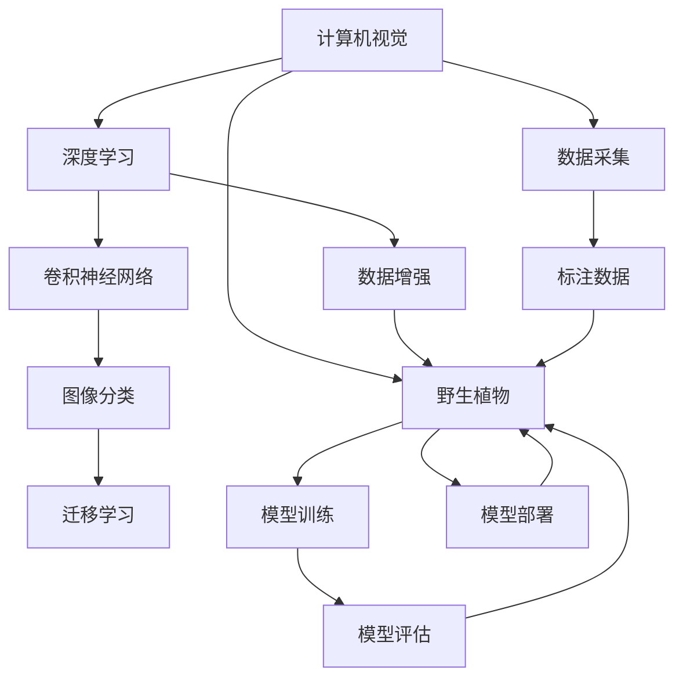

                 

# 野生植物识别应用模型的研究

## 1. 背景介绍

随着人工智能技术的发展，计算机视觉在各个领域的应用逐渐增多。其中，野生植物识别成为了一个重要的研究方向，通过机器视觉技术实现对野生植物种类的自动识别，可以有效地解决人工识别效率低、成本高的问题，同时也能为生态研究提供数据支持。

### 1.1 问题由来
在自然保护和生态研究中，对野生植物的识别和分类是一项重要工作，需要耗费大量人力物力，且由于专家知识和经验的局限性，往往难以保证识别的准确性。计算机视觉技术的应用，特别是深度学习模型，为野生植物识别提供了一种高效、准确的方法。

### 1.2 问题核心关键点
野生植物识别模型需要具备以下几个核心能力：
- 高精度的图像分类能力，能够识别出野生植物并分类到相应的种类。
- 较强的鲁棒性，能够应对多种光照、角度、背景等变化。
- 可扩展性，能够适应不同的植物种类和环境条件。

解决野生植物识别问题的主要挑战在于：
- 野生植物种类繁多，分类体系复杂。
- 图像特征提取难度大，需要考虑到不同物种间细微的形态差异。
- 数据获取难度大，需要花费大量时间和资源进行数据采集。
- 模型需要具备良好的泛化能力，以适应复杂的自然环境。

## 2. 核心概念与联系

### 2.1 核心概念概述
野生植物识别模型的核心概念主要包括：

- **计算机视觉**：计算机视觉是计算机模拟人类视觉系统的过程，通过对图像进行分析和理解，实现对物体的识别和分类。
- **深度学习**：深度学习是一种通过多层神经网络进行学习和预测的技术，特别适用于处理高维、非线性的复杂问题。
- **卷积神经网络（CNN）**：卷积神经网络是深度学习中的一种常用模型，特别擅长处理图像数据，通过卷积层和池化层提取图像特征，最后通过全连接层进行分类。
- **迁移学习**：迁移学习是指将在一个任务上训练好的模型参数迁移到另一个任务上，以减少训练时间和提高模型性能。
- **数据增强**：数据增强是通过对原始数据进行一系列变换，生成新的数据样本，以增加数据多样性，提高模型泛化能力。

这些概念之间存在紧密的联系，共同构成了野生植物识别模型的基础框架。

### 2.2 概念间的关系

为了更清晰地展示这些核心概念之间的关系，以下是几个Mermaid流程图：



这个流程图展示了计算机视觉、深度学习、卷积神经网络、迁移学习、数据增强等概念之间的关系，以及它们在野生植物识别模型中的应用。

## 3. 核心算法原理 & 具体操作步骤

### 3.1 算法原理概述
野生植物识别模型基于深度学习和计算机视觉技术，通过训练大规模卷积神经网络（CNN）模型，实现对野生植物的分类和识别。模型分为两个部分：特征提取和分类预测。

- **特征提取**：通过卷积层和池化层对输入图像进行特征提取，将图像中的细节信息转化为高层次的特征表示。
- **分类预测**：通过全连接层将提取出的特征进行分类预测，输出分类结果。

### 3.2 算法步骤详解

#### 3.2.1 数据准备
- **数据采集**：从野外或自然保护区采集野生植物图像数据，确保数据的多样性和代表性。
- **数据标注**：对采集到的图像进行标注，将每张图像与相应的植物种类进行对应。标注数据需包含详细的种类信息，以便训练模型的分类任务。

#### 3.2.2 模型构建
- **卷积神经网络**：使用预训练的卷积神经网络（如ResNet、VGG等）作为特征提取器，通过迁移学习的方式，将其应用到野生植物识别模型中。
- **分类器**：在卷积神经网络的基础上添加分类器，如全连接层，进行最终分类预测。分类器可以选择不同的神经网络结构，如DNN、CNN、RNN等。

#### 3.2.3 模型训练
- **损失函数**：选择合适的损失函数，如交叉熵损失、均方误差损失等。
- **优化器**：选择合适的优化器，如Adam、SGD等。
- **训练流程**：将标注数据分成训练集和验证集，进行模型训练。在每个epoch中，对训练集进行前向传播和反向传播，更新模型参数，并在验证集上进行模型评估。

#### 3.2.4 模型评估与优化
- **评估指标**：使用准确率、精确率、召回率等指标评估模型的性能。
- **模型优化**：根据评估结果，调整模型结构、学习率、批大小等参数，进行模型优化。

### 3.3 算法优缺点
#### 3.3.1 优点
- **高精度**：深度学习模型能够通过多层次的特征提取，提高图像分类的准确性。
- **鲁棒性强**：卷积神经网络对图像变换具有较好的鲁棒性，能够应对多种光照、角度、背景等变化。
- **可扩展性**：通过迁移学习，可以在已有的基础上快速适应新的植物种类和环境条件。

#### 3.3.2 缺点
- **数据依赖性大**：模型需要大量的标注数据进行训练，数据获取成本高。
- **计算资源需求高**：深度学习模型的训练和推理需要大量的计算资源，特别是在大规模图像数据集上。
- **模型复杂度高**：卷积神经网络结构复杂，难以解释模型决策过程。

### 3.4 算法应用领域
野生植物识别模型可以应用于以下几个领域：

- **自然保护**：通过野生植物识别模型，可以监测生态系统中野生植物种类的变化，评估生物多样性，为自然保护提供数据支持。
- **农业研究**：对野生植物的识别和分类，可以帮助农业科学家更好地了解不同植物的生长特性，为农作物育种提供参考。
- **环境监测**：通过识别野生植物，可以监测环境污染和生态变化，为环境保护提供数据支持。
- **旅游开发**：对野生植物的识别，可以开发具有特色和生态价值的旅游资源，提升旅游业的可持续发展。

## 4. 数学模型和公式 & 详细讲解 & 举例说明

### 4.1 数学模型构建

设输入图像为 $x$，输出标签为 $y$，卷积神经网络模型为 $f$，则模型的目标函数为：

$$
\min_{\theta} \mathcal{L}(f(x; \theta), y)
$$

其中，$\theta$ 为模型参数，$\mathcal{L}$ 为损失函数，可以是交叉熵损失、均方误差损失等。

### 4.2 公式推导过程

以交叉熵损失为例，假设输出层有 $C$ 个类别，第 $i$ 个类别的概率为 $p_i$，真实标签为 $y_i$，则交叉熵损失函数为：

$$
\mathcal{L}(y; p) = -\frac{1}{N}\sum_{i=1}^N \sum_{j=1}^C y_{ij} \log p_{ij}
$$

其中，$N$ 为样本数，$y_{ij}$ 为第 $i$ 个样本属于第 $j$ 个类别的标签，$p_{ij}$ 为模型预测的第 $i$ 个样本属于第 $j$ 个类别的概率。

### 4.3 案例分析与讲解

假设有一张包含多种野生植物的图像，使用卷积神经网络进行特征提取，输出一个 $1024$ 维的特征向量。在全连接层中使用一个包含 $100$ 个节点的线性分类器，进行分类预测。假设输出层使用了 $softmax$ 函数，可以得到每个类别的概率。

## 5. 项目实践：代码实例和详细解释说明

### 5.1 开发环境搭建

在进行模型开发前，需要准备以下环境：

- **硬件设备**：使用高性能的计算机或GPU服务器，以便进行大规模数据训练和模型推理。
- **软件工具**：安装Python、PyTorch、TensorFlow等深度学习框架，以及相关的计算机视觉库，如OpenCV、Pillow等。
- **数据集准备**：收集和标注野生植物图像数据，划分为训练集、验证集和测试集。

### 5.2 源代码详细实现

以使用PyTorch框架为例，以下是野生植物识别模型的代码实现：

```python
import torch
import torch.nn as nn
import torch.optim as optim
from torch.utils.data import DataLoader

class CNNClassifier(nn.Module):
    def __init__(self):
        super(CNNClassifier, self).__init__()
        self.conv = nn.Sequential(
            nn.Conv2d(3, 64, kernel_size=3, stride=1, padding=1),
            nn.ReLU(inplace=True),
            nn.MaxPool2d(kernel_size=2, stride=2),
            nn.Conv2d(64, 128, kernel_size=3, stride=1, padding=1),
            nn.ReLU(inplace=True),
            nn.MaxPool2d(kernel_size=2, stride=2),
            nn.Conv2d(128, 256, kernel_size=3, stride=1, padding=1),
            nn.ReLU(inplace=True),
            nn.MaxPool2d(kernel_size=2, stride=2),
            nn.Flatten(),
            nn.Linear(256 * 4 * 4, 1024),
            nn.ReLU(inplace=True),
            nn.Linear(1024, 100),
            nn.Softmax(dim=1)
        )
        self.criterion = nn.CrossEntropyLoss()
        self.optimizer = optim.Adam(self.parameters(), lr=0.001)

    def forward(self, x):
        return self.conv(x)

def train_model(model, train_loader, validation_loader, num_epochs=10):
    best_acc = 0.0
    for epoch in range(num_epochs):
        model.train()
        train_loss = 0.0
        train_correct = 0
        for inputs, labels in train_loader:
            optimizer.zero_grad()
            outputs = model(inputs)
            loss = criterion(outputs, labels)
            loss.backward()
            optimizer.step()
            train_loss += loss.item() * inputs.size(0)
            train_correct += torch.sum(torch.argmax(outputs, dim=1) == labels.data)
        train_acc = train_correct.double() / len(train_loader.dataset)
        model.eval()
        val_loss = 0.0
        val_correct = 0
        with torch.no_grad():
            for inputs, labels in validation_loader:
                outputs = model(inputs)
                loss = criterion(outputs, labels)
                val_loss += loss.item() * inputs.size(0)
                val_correct += torch.sum(torch.argmax(outputs, dim=1) == labels.data)
        val_acc = val_correct.double() / len(validation_loader.dataset)
        if val_acc > best_acc:
            best_acc = val_acc
            torch.save(model.state_dict(), 'model.pth')
    return model

# 数据准备和模型训练
train_dataset = ...
train_loader = ...
validation_dataset = ...
validation_loader = ...
model = CNNClassifier()
train_model(model, train_loader, validation_loader, num_epochs=10)

# 模型评估和推理
test_dataset = ...
test_loader = ...
with torch.no_grad():
    model.load_state_dict(torch.load('model.pth'))
    model.eval()
    test_loss = 0.0
    test_correct = 0
    for inputs, labels in test_loader:
        outputs = model(inputs)
        loss = criterion(outputs, labels)
        test_loss += loss.item() * inputs.size(0)
        test_correct += torch.sum(torch.argmax(outputs, dim=1) == labels.data)
    test_acc = test_correct.double() / len(test_loader.dataset)
    print('Test Acc:', test_acc)
```

### 5.3 代码解读与分析

以上代码展示了如何使用PyTorch框架构建和训练野生植物识别模型。主要步骤包括：

- **模型定义**：定义卷积神经网络模型，包括卷积层、池化层、全连接层等。
- **损失函数和优化器**：选择合适的损失函数和优化器，进行模型训练。
- **数据加载器**：使用DataLoader加载训练集和验证集，进行模型训练。
- **模型保存和加载**：使用torch.save和torch.load方法保存和加载模型状态。

## 6. 实际应用场景

### 6.1 自然保护

野生植物识别模型可以应用于自然保护领域，监测生态系统中野生植物种类的变化，评估生物多样性。通过定期对自然保护区内的植物进行识别和分类，可以了解植物分布和变化趋势，为生态保护提供数据支持。

### 6.2 农业研究

在农业研究中，野生植物识别模型可以用于植物育种和病虫害监测。通过对不同种类的野生植物进行分类和识别，可以更好地了解其生长特性，为农作物育种提供参考。同时，模型还可以监测病虫害的发展趋势，帮助农业科学家及时采取措施。

### 6.3 环境监测

通过野生植物识别模型，可以监测环境污染和生态变化。例如，对于被污染地区的植物种类进行分析，可以评估污染程度和生态影响。对于森林火灾等灾害，模型可以识别火灾前后的植被变化，评估灾害程度。

### 6.4 旅游开发

野生植物识别模型可以用于开发具有特色和生态价值的旅游资源。例如，通过识别和分类植物，可以开发自然保护区、植物园等旅游项目，提升旅游业的可持续发展。

## 7. 工具和资源推荐

### 7.1 学习资源推荐

- **《深度学习》课程**：斯坦福大学李飞飞教授的深度学习课程，讲解深度学习的基本概念和经典模型。
- **《计算机视觉》书籍**：Simon Haykin的《计算机视觉：算法与应用》，全面介绍了计算机视觉的基本原理和应用。
- **Kaggle平台**：Kaggle上有许多野生植物识别相关的数据集和竞赛，可以学习和交流。

### 7.2 开发工具推荐

- **PyTorch**：开源深度学习框架，支持动态计算图，易于调试和优化。
- **TensorFlow**：由Google开发的深度学习框架，支持静态计算图和分布式训练。
- **OpenCV**：计算机视觉库，提供了丰富的图像处理和特征提取工具。

### 7.3 相关论文推荐

- **《Wild Plant Recognition with Deep Learning》**：A. Gupta等，介绍使用深度学习模型进行野生植物识别的研究成果。
- **《Data Augmentation Techniques for Computer Vision》**：K. Simonyan等，介绍数据增强技术在计算机视觉中的应用。
- **《Knowledge Distillation》**：J. Hinton等，介绍知识蒸馏技术在深度学习中的作用。

## 8. 总结：未来发展趋势与挑战

### 8.1 研究成果总结

野生植物识别模型已经在多个领域展示了其强大的应用潜力，取得了显著的成果。通过深度学习技术，模型能够实现高精度的图像分类和识别，具有较强的鲁棒性和可扩展性。

### 8.2 未来发展趋势

未来，野生植物识别模型将呈现以下几个发展趋势：

- **模型复杂度降低**：随着硬件计算能力的提升，模型复杂度将逐渐降低，模型推理速度和效率将得到提升。
- **数据需求减少**：随着数据增强技术的不断发展，模型可以更高效地利用数据，减少对标注数据的依赖。
- **多模态融合**：结合视觉、声音、气味等多模态信息，提高模型的综合识别能力。
- **实时性增强**：通过优化模型结构和计算图，提高模型的实时性，支持实时图像识别和分类。
- **跨领域应用**：模型将更多地应用于农业、环境保护、旅游等领域，为不同行业提供智能化解决方案。

### 8.3 面临的挑战

尽管野生植物识别模型已经取得了一定的进展，但在实际应用中仍面临以下挑战：

- **数据获取难度大**：野生植物数据采集和标注成本高，数据获取难度大。
- **模型泛化能力有限**：模型在不同环境和光照条件下的泛化能力仍需进一步提升。
- **计算资源需求高**：深度学习模型的训练和推理需要大量的计算资源，特别是大规模数据集上。
- **模型复杂度高**：模型结构复杂，难以解释模型决策过程。

### 8.4 研究展望

未来，我们需要在以下几个方面进行深入研究：

- **自动化数据采集**：开发自动化数据采集和标注工具，降低数据获取成本。
- **多模态融合**：结合多种传感器数据，提高模型的综合识别能力。
- **模型压缩和优化**：优化模型结构和计算图，提高模型推理速度和效率。
- **跨领域应用**：拓展模型的应用领域，为不同行业提供智能化解决方案。
- **模型解释和可控性**：开发模型解释工具，增强模型的可控性和可解释性。

通过这些研究方向和技术突破，野生植物识别模型将更广泛地应用于实际应用中，为生态保护、农业研究、环境监测等领域提供智能化解决方案，推动人工智能技术的发展。

## 9. 附录：常见问题与解答

**Q1：野生植物识别模型如何提高鲁棒性？**

A: 可以通过数据增强技术，生成更多的数据样本，提高模型的泛化能力。同时，可以使用迁移学习，在大规模数据集上预训练模型，提高模型的鲁棒性。

**Q2：模型在实际应用中如何优化？**

A: 可以通过超参数调优、正则化、批量归一化等技术，优化模型的性能。同时，可以使用模型压缩和优化技术，提高模型的实时性和效率。

**Q3：模型在多模态融合中的应用如何实现？**

A: 可以通过将视觉、声音、气味等多种传感器数据进行融合，提高模型的综合识别能力。例如，在卷积神经网络中添加音频处理模块，结合视觉和声音信息进行分类。

**Q4：模型在实际应用中面临哪些问题？**

A: 数据获取难度大，模型泛化能力有限，计算资源需求高，模型复杂度高，是模型在实际应用中面临的主要问题。

通过这些问题的回答，可以更好地了解野生植物识别模型的应用前景和挑战，为未来的研究提供指导。

