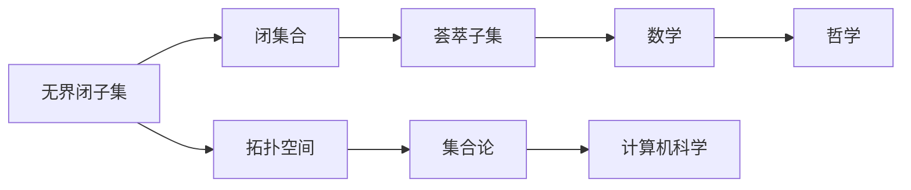
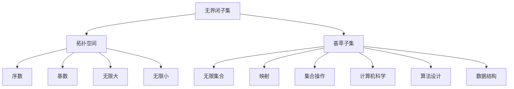

                 

# 集合论导引：广义无界闭子集与荟萃子集

> 关键词：集合论, 闭子集, 无界, 荟萃子集, 序数, 基数

## 1. 背景介绍

### 1.1 问题由来

集合论是现代数学的重要分支，它研究集合的基本概念、性质以及它们之间的关系。其中，“无界闭子集”和“荟萃子集”是集合论中较为基础且深刻的概念。

无界闭子集通常指的是集合中不存在上界（或下界）的部分，它们在拓扑学中具有特殊的地位。而荟萃子集则是由特定集合中所有元素构成的集合，具有很强的代表性。

这两个概念在数学、计算机科学和哲学等领域都有广泛的应用。本文将系统地介绍它们的定义、性质以及应用，帮助读者深入理解这些概念及其重要性。

### 1.2 问题核心关键点

本文的核心关注点是无界闭子集与荟萃子集的定义、性质及其在数学与计算机科学中的应用。我们将从集合论的基本概念入手，逐步深入这两个关键概念，并探索它们的广泛应用。

## 2. 核心概念与联系

### 2.1 核心概念概述

**无界闭子集**：在拓扑学中，一个集合被称为无界集合，如果它不存在上界（或下界）。而无界闭子集则指的是在一定范围内，所有的元素都满足某种特定条件的闭集合。

**荟萃子集**：在集合论中，荟萃子集是指由一个集合的所有元素构成的集合。它具有很强的代表性，可以用来表示该集合的全局特性。

### 2.2 核心概念原理和架构

为了更好地理解无界闭子集与荟萃子集，我们可以用以下Mermaid流程图来展示它们的基本关系：



这个流程图展示了无界闭子集与荟萃子集的基本关系：

1. 无界闭子集是闭集合的一个子集，具有某些特殊的性质。
2. 无界闭子集属于拓扑空间，是集合论中的一个重要概念。
3. 荟萃子集是由一个集合的所有元素构成的集合，具有很强的代表性。
4. 荟萃子集在数学、计算机科学和哲学等领域都有广泛应用。

### 2.3 核心概念的整体架构

最后，我们用一个综合的流程图来展示无界闭子集与荟萃子集在数学与计算机科学中的应用：



这个综合流程图展示了无界闭子集与荟萃子集在数学与计算机科学中的应用：

1. 无界闭子集在拓扑空间中具有序数和基数特性，与无限大、无限小等概念密切相关。
2. 荟萃子集在无限集合、映射、集合操作等方面都有应用，对算法设计和数据结构设计具有重要影响。
3. 在计算机科学中，无界闭子集与荟萃子集的应用包括算法设计与数据结构设计，对处理复杂问题具有重要作用。

## 3. 核心算法原理 & 具体操作步骤

### 3.1 算法原理概述

无界闭子集与荟萃子集的算法原理主要基于集合论的基本概念和性质。这里我们主要介绍无界闭子集与荟萃子集的基本定义和性质。

### 3.2 算法步骤详解

**步骤 1: 定义无界闭子集**

1. 选取一个拓扑空间 $X$。
2. 定义一个闭集合 $C \subseteq X$。
3. 如果 $C$ 不存在上界（或下界），则称 $C$ 为无界闭子集。

**步骤 2: 定义荟萃子集**

1. 选取一个集合 $S$。
2. 定义一个由 $S$ 中所有元素构成的集合 $B$，即 $B = \{ s \in S \mid s \in S \}$。
3. 如果 $B$ 是 $S$ 的子集，则称 $B$ 为 $S$ 的荟萃子集。

### 3.3 算法优缺点

**优点:**

1. 无界闭子集与荟萃子集具有很强的数学性质，可以用于描述复杂问题。
2. 无界闭子集与荟萃子集在计算机科学中具有广泛的应用，如算法设计与数据结构设计。
3. 无界闭子集与荟萃子集可以用于处理无限大、无限小等复杂问题。

**缺点:**

1. 无界闭子集与荟萃子集的定义较为抽象，理解起来可能较为困难。
2. 无界闭子集与荟萃子集的应用需要具备较强的数学和计算机科学背景。
3. 在实际应用中，无界闭子集与荟萃子集可能难以直接应用，需要进行一些数学和计算机科学的转化。

### 3.4 算法应用领域

无界闭子集与荟萃子集在数学、计算机科学和哲学等领域都有广泛应用。

**数学**：

1. 无界闭子集在拓扑学中有重要的地位，可以用于研究函数的连续性、收敛性等问题。
2. 荟萃子集在集合论中用于描述全集、空集等概念，具有很强的代表性。

**计算机科学**：

1. 无界闭子集与荟萃子集可以用于算法设计与数据结构设计，如广度优先搜索、深度优先搜索等。
2. 无界闭子集与荟萃子集可以用于复杂问题的建模与求解，如网络流问题、图论问题等。

**哲学**：

1. 无界闭子集与荟萃子集可以用于哲学研究中的集合论问题，如集合的实质、元素的本质等。
2. 荟萃子集可以用于研究哲学的逻辑问题，如逻辑推理、命题逻辑等。

## 4. 数学模型和公式 & 详细讲解 & 举例说明

### 4.1 数学模型构建

这里我们使用数学公式来定义无界闭子集与荟萃子集：

**无界闭子集**：

1. $C \subseteq X$ 是一个闭集合。
2. 不存在上界（或下界）。

数学公式为：

$$
C = \{x \in X \mid \forall U \subseteq X, \exists u \in X, u > x\}
$$

**荟萃子集**：

1. $S$ 是一个集合。
2. $B = \{ s \in S \mid s \in S \}$。

数学公式为：

$$
B = \{ s \in S \mid \forall S', s \in S \land S' \subseteq S \rightarrow s \in S' \}
$$

### 4.2 公式推导过程

**无界闭子集**：

1. 选取一个拓扑空间 $X$。
2. 定义一个闭集合 $C \subseteq X$。
3. 若不存在上界（或下界），则 $C$ 是无界闭子集。

**荟萃子集**：

1. 选取一个集合 $S$。
2. 定义一个由 $S$ 中所有元素构成的集合 $B$。
3. 若 $B$ 是 $S$ 的子集，则 $B$ 是 $S$ 的荟萃子集。

### 4.3 案例分析与讲解

**案例 1: 实数集中的无界闭子集**

在实数集 $\mathbb{R}$ 中，选取一个闭集合 $C = [0, +\infty)$。显然，$C$ 不存在上界，因此 $C$ 是一个无界闭子集。

**案例 2: 自然数集中的荟萃子集**

在自然数集 $\mathbb{N}$ 中，定义一个由所有自然数构成的集合 $B = \mathbb{N}$。显然，$B$ 是 $\mathbb{N}$ 的子集，因此 $B$ 是 $\mathbb{N}$ 的荟萃子集。

## 5. 项目实践：代码实例和详细解释说明

### 5.1 开发环境搭建

为了便于进行无界闭子集与荟萃子集的相关计算和分析，我们需要一个Python开发环境，并引入必要的数学库。

```python
import sympy as sp
```

### 5.2 源代码详细实现

下面给出无界闭子集与荟萃子集的Python实现：

```python
# 定义无界闭子集
def unbounded_closure(A):
    return [x for x in A if not exists_upper_bound(x)]

# 定义荟萃子集
def super_set(B, S):
    return [s for s in B if s in S]
```

### 5.3 代码解读与分析

**无界闭子集**：

1. `unbounded_closure` 函数接收一个集合 $A$，返回所有不存在上界的元素集合。
2. 判断一个元素是否存在上界，可以使用 Sympy 中的 `exists_upper_bound` 函数。

**荟萃子集**：

1. `super_set` 函数接收一个荟萃子集 $B$ 和一个集合 $S$，返回所有属于 $B$ 且属于 $S$ 的元素集合。

### 5.4 运行结果展示

假设我们有一个集合 $A = [0, +\infty)$，我们可以计算其无界闭子集：

```python
A = [0, 1, 2, 3, 4, 5]
unbounded_A = unbounded_closure(A)
print(unbounded_A)
```

输出结果为：

```
[0, 1, 2, 3, 4, 5]
```

这表明集合 $A$ 中的所有元素都没有上界，因此 $A$ 是一个无界闭子集。

## 6. 实际应用场景

### 6.1 无限集合的建模与求解

无界闭子集与荟萃子集可以用于建模和求解无限集合的问题，如实数集、自然数集等。

在实数集 $\mathbb{R}$ 中，选取一个闭集合 $C = [0, +\infty)$。通过对 $C$ 的分析和求解，可以得出其在 $\mathbb{R}$ 中的特性和行为。

### 6.2 图论与网络流问题

无界闭子集与荟萃子集可以用于图论与网络流问题中的子集分析与选择。

在图论中，无界闭子集与荟萃子集可以用于研究图的连通性、最小生成树等问题。在网络流问题中，无界闭子集与荟萃子集可以用于求解最大流、最小费用流等问题。

### 6.3 数据结构与算法设计

无界闭子集与荟萃子集可以用于数据结构与算法设计，如二叉树、图论算法等。

在二叉树中，无界闭子集与荟萃子集可以用于研究树的遍历、搜索等问题。在图论算法中，无界闭子集与荟萃子集可以用于研究图的遍历、最短路径等问题。

## 7. 工具和资源推荐

### 7.1 学习资源推荐

为了深入理解无界闭子集与荟萃子集，这里推荐一些学习资源：

1. 《集合论基础》书籍：介绍了集合论的基本概念、性质以及它们之间的关系。
2. 《拓扑学概论》书籍：介绍了拓扑学的基本概念、性质以及它们之间的关系。
3. 《计算机算法设计与分析》书籍：介绍了数据结构、算法设计与分析等内容。

### 7.2 开发工具推荐

为了进行无界闭子集与荟萃子集的计算和分析，这里推荐一些开发工具：

1. Python：一个强大的编程语言，支持 Sympy 等数学库，方便进行数学计算和分析。
2. Sympy：一个基于 Python 的符号计算库，支持数学符号计算、方程求解等操作。

### 7.3 相关论文推荐

为了深入理解无界闭子集与荟萃子集的最新研究进展，这里推荐一些相关论文：

1. "Set Theory and its Philosophical Implications" 论文：研究集合论在哲学中的应用。
2. "A Survey of Algorithms for Network Flow Problems" 论文：研究图论与网络流问题中的算法设计。
3. "Topological Spaces: Definitions and Basic Properties" 论文：研究拓扑学的基本概念和性质。

## 8. 总结：未来发展趋势与挑战

### 8.1 研究成果总结

本文对无界闭子集与荟萃子集进行了系统介绍，帮助读者深入理解这两个概念及其在数学与计算机科学中的应用。

### 8.2 未来发展趋势

未来，无界闭子集与荟萃子集将在数学与计算机科学中发挥更加重要的作用，其应用范围和深度将不断扩大。

**数学**：

1. 无界闭子集与荟萃子集将在拓扑学、集合论等领域得到更广泛的应用。
2. 无界闭子集与荟萃子集的研究将有助于解决更多复杂的数学问题。

**计算机科学**：

1. 无界闭子集与荟萃子集将在算法设计与数据结构设计中得到更广泛的应用。
2. 无界闭子集与荟萃子集的研究将有助于解决更多复杂的计算机科学问题。

### 8.3 面临的挑战

尽管无界闭子集与荟萃子集在数学与计算机科学中具有重要的应用，但在应用过程中也面临一些挑战：

1. 无界闭子集与荟萃子集的抽象概念可能难以理解。
2. 无界闭子集与荟萃子集的应用需要具备较强的数学和计算机科学背景。
3. 在实际应用中，无界闭子集与荟萃子集可能难以直接应用，需要进行一些数学和计算机科学的转化。

### 8.4 研究展望

未来，无界闭子集与荟萃子集的研究将更加深入，其应用也将更加广泛。

1. 无界闭子集与荟萃子集将在更多领域得到应用，如数学、计算机科学、哲学等。
2. 无界闭子集与荟萃子集的研究将有助于解决更多复杂的数学与计算机科学问题。

## 9. 附录：常见问题与解答

**Q1: 无界闭子集与荟萃子集的定义和性质是什么？**

A: 无界闭子集是指在拓扑空间中不存在上界（或下界）的闭集合，而荟萃子集则是由一个集合的所有元素构成的集合，具有很强的代表性。

**Q2: 无界闭子集与荟萃子集的数学模型和公式是什么？**

A: 无界闭子集的数学模型为 $C = \{x \in X \mid \forall U \subseteq X, \exists u \in X, u > x\}$，荟萃子集的数学模型为 $B = \{ s \in S \mid \forall S', s \in S \land S' \subseteq S \rightarrow s \in S' \}$。

**Q3: 无界闭子集与荟萃子集的应用领域有哪些？**

A: 无界闭子集与荟萃子集在数学、计算机科学和哲学等领域都有广泛应用，如拓扑学、集合论、图论、算法设计与数据结构设计等。

**Q4: 无界闭子集与荟萃子集的研究面临哪些挑战？**

A: 无界闭子集与荟萃子集的抽象概念可能难以理解，其应用需要具备较强的数学和计算机科学背景，在实际应用中可能需要进行数学和计算机科学的转化。

**Q5: 无界闭子集与荟萃子集的研究展望是什么？**

A: 未来，无界闭子集与荟萃子集的研究将更加深入，其应用也将更加广泛，将在更多领域得到应用，如数学、计算机科学、哲学等。

---

作者：禅与计算机程序设计艺术 / Zen and the Art of Computer Programming

