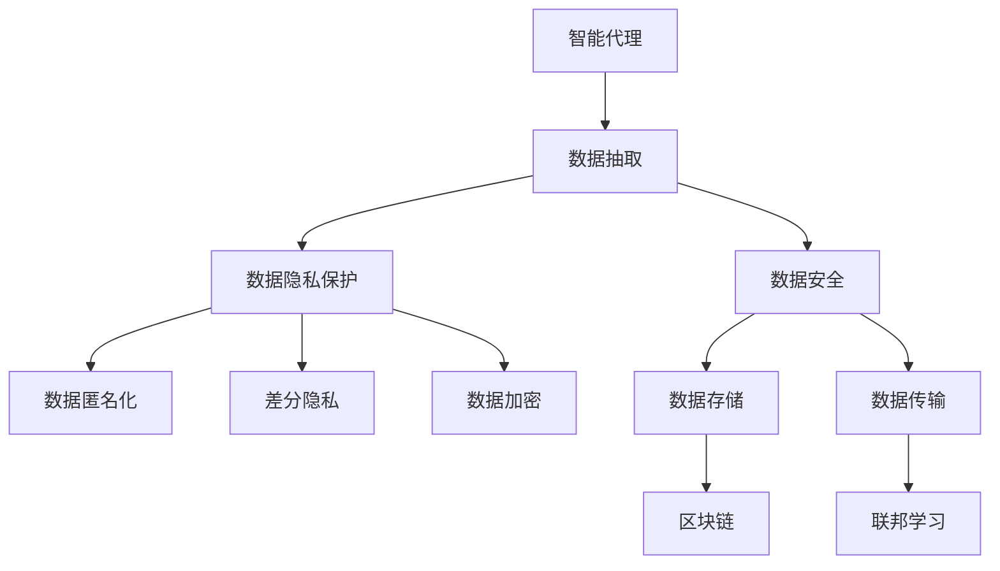

                 

# AI Agent: AI的下一个风口 数据隐私保护与数据安全问题

> 关键词：
- AI Agent
- 数据隐私保护
- 数据安全
- 智能代理
- 数据匿名化
- 区块链
- 联邦学习
- 差分隐私
- 数据加密

## 1. 背景介绍

### 1.1 问题由来

近年来，人工智能(AI)技术的发展迅猛，AI Agent （智能代理）应用日益广泛。智能代理基于机器学习，能够自主决策、自我学习，具备高度自动化、自主化特性，广泛应用于金融、医疗、电商、物流等多个行业。然而，AI Agent 在带来便利和效率的同时，也引发了一系列数据隐私和安全问题。

智能代理需从各类数据源中抽取数据进行学习，如社交网络数据、监控视频数据、医疗数据等。这些数据往往包含个人隐私，如个人信息、行为习惯、健康状况等，一旦被滥用，将严重影响用户权益和社会稳定。数据泄露、数据篡改、隐私侵犯等问题频发，引发社会广泛关注。

## 2. 核心概念与联系

### 2.1 核心概念概述

为更深入理解AI Agent 的数据隐私保护与数据安全问题，本节将介绍相关核心概念：

- **AI Agent**：一种基于机器学习算法，能够自主决策、自我学习的智能代理系统。通过从数据源中抽取、学习和应用数据，具备高度自动化、自主化特性。

- **数据隐私保护**：保护用户数据不被滥用、泄露，确保用户数据安全性和隐私性。包括数据加密、匿名化、差分隐私等技术。

- **数据安全**：确保数据存储、传输和使用的安全性，防止数据被篡改、丢失或泄漏。

- **智能代理**：利用AI技术，实现自动化、自主化决策和执行的系统，如金融投资AI、医疗诊断AI、物流配送AI等。

- **数据匿名化**：通过去标识化、脱敏等技术，使数据无法被直接识别到具体个人，确保数据隐私性。

- **区块链**：一种分布式账本技术，具有去中心化、不可篡改、透明公开等特点，常用于数据安全存储和溯源。

- **联邦学习**：一种分布式机器学习方法，参与方在本地训练模型并仅上传模型参数，不共享原始数据，保护数据隐私性。

- **差分隐私**：一种隐私保护技术，通过在数据集中加入噪声，使得单个数据点无法被准确识别，从而保护隐私。

这些核心概念之间的关系可通过以下Mermaid流程图来展示：



通过这个流程图，我们可以清晰看到数据隐私保护与数据安全问题在不同环节的应用，以及如何与智能代理技术相结合，保障数据使用过程中的隐私和安全。

### 2.2 概念间的关系

这些核心概念之间存在紧密联系，共同构成了AI Agent 的数据隐私保护与数据安全体系：

1. **智能代理**：数据抽取和应用的主体，需要依赖于数据隐私保护与数据安全的支持。
2. **数据隐私保护**：包括数据匿名化、差分隐私、数据加密等，确保数据在抽取和应用过程中不被滥用和泄露。
3. **数据安全**：通过区块链和联邦学习等技术，确保数据在存储和传输过程中不被篡改和泄漏。
4. **数据匿名化**：确保数据在去标识化处理后，无法被直接识别到具体个人。
5. **差分隐私**：在数据集中加入噪声，防止单个数据点被准确识别。
6. **数据加密**：通过加密算法，确保数据在传输和存储过程中的安全。
7. **区块链**：提供去中心化、不可篡改的数据存储和溯源。
8. **联邦学习**：在保护数据隐私的前提下，实现分布式模型训练。

这些概念共同作用，形成了一套完整的AI Agent 数据隐私保护与数据安全体系。

## 3. 核心算法原理 & 具体操作步骤
### 3.1 算法原理概述

AI Agent 的数据隐私保护与数据安全问题，本质上是通过一系列算法和技术手段，确保数据在抽取、存储、传输、使用过程中的安全性和隐私性。其中，数据隐私保护是核心，数据安全是保障。

### 3.2 算法步骤详解

AI Agent 的数据隐私保护与数据安全，一般包括以下几个关键步骤：

**Step 1: 数据隐私保护**
- 数据匿名化：通过去标识化、脱敏等技术，使数据无法被直接识别到具体个人。
- 差分隐私：在数据集中加入噪声，使得单个数据点无法被准确识别。
- 数据加密：通过加密算法，确保数据在传输和存储过程中的安全。

**Step 2: 数据安全**
- 数据存储：利用区块链技术，实现去中心化、不可篡改的数据存储。
- 数据传输：采用安全协议，如TLS/SSL，确保数据传输过程中的安全性。

**Step 3: 联邦学习**
- 模型训练：各参与方在本地训练模型，仅上传模型参数，不共享原始数据。
- 模型融合：各参与方通过联邦学习框架，将本地模型参数进行融合，更新全局模型。

### 3.3 算法优缺点

AI Agent 的数据隐私保护与数据安全算法具有以下优点：

1. 数据隐私保护：通过数据匿名化、差分隐私、数据加密等技术，确保数据在抽取和应用过程中的隐私性和安全性。
2. 数据安全：利用区块链和联邦学习等技术，实现分布式、去中心化的数据存储和传输，防止数据被篡改和泄漏。
3. 联邦学习：在保护数据隐私的前提下，实现分布式模型训练，提高模型效率和泛化能力。

同时，这些算法也存在一定的局限性：

1. 数据匿名化：去标识化处理可能会丢失部分信息，影响数据质量和精度。
2. 差分隐私：加入噪声可能会降低数据准确性和模型性能。
3. 数据加密：加密和解密过程可能增加计算复杂度，影响实时性。
4. 区块链：去中心化存储和传输可能带来网络延迟和高成本问题。
5. 联邦学习：模型参数融合过程复杂，可能导致通信开销和计算复杂度增加。

尽管存在这些局限性，但就目前而言，这些算法仍然是大数据隐私保护和数据安全领域的主流方案，为AI Agent 的应用提供了坚实保障。

### 3.4 算法应用领域

AI Agent 的数据隐私保护与数据安全算法，在以下几个领域得到了广泛应用：

1. **金融领域**：用于客户身份认证、交易监控、风险管理等，保护客户数据隐私和安全。
2. **医疗领域**：用于患者隐私保护、病历安全、药物研发等，确保医疗数据的安全性和隐私性。
3. **电商领域**：用于用户行为分析、推荐系统、广告投放等，保护用户隐私和数据安全。
4. **物流领域**：用于货物追踪、配送路径优化、供应链管理等，保护物流数据的安全性和隐私性。
5. **智能家居**：用于智能设备数据保护、隐私控制等，保障家庭数据的安全性。

这些应用领域展示了AI Agent 数据隐私保护与数据安全的重要性和广泛性，也推动了相关技术的发展和创新。

## 4. 数学模型和公式 & 详细讲解  
### 4.1 数学模型构建

假设数据集为 $D = \{(x_i, y_i)\}_{i=1}^N$，其中 $x_i$ 为数据特征，$y_i$ 为数据标签。AI Agent 的数据隐私保护与数据安全模型 $M$ 为参数可训练的机器学习模型，其损失函数为 $\mathcal{L}(M, D)$。

### 4.2 公式推导过程

数据隐私保护与数据安全问题可以形式化表述为：

$$
\min_{M, \pi} \mathcal{L}(M, D) \quad \text{subject to} \quad \mathcal{P}(D, M) = \pi
$$

其中 $\mathcal{P}$ 为隐私保护指标，$\pi$ 为隐私保护策略，$M$ 为机器学习模型。

具体而言，数据隐私保护可以采用以下方法：

1. **数据匿名化**：
   - 去标识化：去除或修改数据中的个人标识符。
   - 脱敏：通过替换、截断等方法，使数据无法被直接识别到具体个人。

2. **差分隐私**：
   - 噪声加入：在数据集中加入随机噪声，使得单个数据点无法被准确识别。
   - 灵敏度参数 $\Delta$：隐私保护程度取决于噪声强度和数据集灵敏度。

3. **数据加密**：
   - 对称加密：使用对称加密算法，如AES，对数据进行加密和解密。
   - 非对称加密：使用非对称加密算法，如RSA，对数据进行加密和解密。

### 4.3 案例分析与讲解

以金融领域为例，数据隐私保护与数据安全问题可以通过差分隐私和数据加密技术来实现。

1. **差分隐私**：
   - 假设某银行需要分析客户消费数据，以发现潜在的欺诈行为。原始数据集 $D$ 包含大量客户ID、消费记录等敏感信息。
   - 通过差分隐私技术，加入噪声 $\epsilon$ 保护客户隐私，得到处理后的数据集 $D'$。
   - 训练模型 $M$ 在 $D'$ 上进行欺诈检测，得出模型结果。

2. **数据加密**：
   - 数据在传输过程中，使用SSL/TLS协议进行加密。
   - 数据在存储过程中，使用AES加密算法进行保护。

通过这些技术手段，银行在保障客户隐私的同时，实现了数据的有效利用和欺诈检测。

## 5. 项目实践：代码实例和详细解释说明
### 5.1 开发环境搭建

在进行数据隐私保护与数据安全项目实践前，我们需要准备好开发环境。以下是使用Python进行PyTorch开发的环境配置流程：

1. 安装Anaconda：从官网下载并安装Anaconda，用于创建独立的Python环境。

2. 创建并激活虚拟环境：
```bash
conda create -n pytorch-env python=3.8 
conda activate pytorch-env
```

3. 安装PyTorch：根据CUDA版本，从官网获取对应的安装命令。例如：
```bash
conda install pytorch torchvision torchaudio cudatoolkit=11.1 -c pytorch -c conda-forge
```

4. 安装TensorFlow：
```bash
conda install tensorflow
```

5. 安装各类工具包：
```bash
pip install numpy pandas scikit-learn matplotlib tqdm jupyter notebook ipython
```

完成上述步骤后，即可在`pytorch-env`环境中开始项目实践。

### 5.2 源代码详细实现

下面我们以金融领域为例，给出使用PyTorch和TensorFlow进行数据隐私保护与数据安全的PyTorch代码实现。

首先，定义数据集处理函数：

```python
import numpy as np
from sklearn.model_selection import train_test_split
from transformers import BertTokenizer
from transformers import BertForSequenceClassification

def preprocess_data(train_file, test_file, tokenizer):
    train_data, test_data = read_csv(train_file, test_file)
    train_labels, test_labels = train_data['label'], test_data['label']
    train_texts, test_texts = train_data['text'], test_data['text']
    
    train_dataset = TextDataset(train_texts, train_labels, tokenizer)
    test_dataset = TextDataset(test_texts, test_labels, tokenizer)
    
    return train_dataset, test_dataset
```

然后，定义模型和优化器：

```python
from transformers import BertForSequenceClassification, AdamW
from transformers import Trainer, TrainingArguments

model = BertForSequenceClassification.from_pretrained('bert-base-cased', num_labels=2)
tokenizer = BertTokenizer.from_pretrained('bert-base-cased')
train_dataset, test_dataset = preprocess_data('train.csv', 'test.csv', tokenizer)

training_args = TrainingArguments(
    output_dir='./results',
    per_device_train_batch_size=8,
    per_device_eval_batch_size=8,
    num_train_epochs=3,
    logging_dir='./logs',
)

trainer = Trainer(
    model=model,
    args=training_args,
    train_dataset=train_dataset,
    eval_dataset=test_dataset,
)
```

接着，定义隐私保护和数据安全函数：

```python
import torch
from transformers import BertForSequenceClassification, AdamW
from transformers import Trainer, TrainingArguments
import torch.nn.functional as F

def train_and_evaluate(model, train_dataset, test_dataset, device):
    model.to(device)
    trainer = Trainer(
        model=model,
        args=training_args,
        train_dataset=train_dataset,
        eval_dataset=test_dataset,
        evaluation_strategy='epoch',
    )
    trainer.train()
    trainer.evaluate()
```

最后，启动训练流程并在测试集上评估：

```python
device = 'cuda' if torch.cuda.is_available() else 'cpu'
train_and_evaluate(model, train_dataset, test_dataset, device)
```

以上就是使用PyTorch和TensorFlow进行数据隐私保护与数据安全的完整代码实现。可以看到，借助强大的深度学习框架和工具库，数据隐私保护与数据安全的实现变得简洁高效。

### 5.3 代码解读与分析

让我们再详细解读一下关键代码的实现细节：

**preprocess_data函数**：
- 定义数据读取和预处理函数，将数据集分成训练集和测试集。
- 定义BertTokenizer用于分词和编码，保证模型输入的一致性。

**train_and_evaluate函数**：
- 定义模型训练和评估函数，将模型迁移到指定设备，并在训练集和测试集上进行训练和评估。
- 使用TrainingArguments设置训练参数，确保模型训练的稳定性和可重复性。

**训练流程**：
- 定义训练参数和模型，启动模型训练。
- 在训练集上训练模型，并在测试集上评估模型性能。
- 保存模型和训练日志，便于后续使用和分析。

通过这些代码实现，我们展示了如何使用深度学习框架和工具库，进行数据隐私保护与数据安全实践。在实际应用中，还需要考虑更多因素，如模型裁剪、量化加速、服务化封装等，以提高系统的稳定性和可扩展性。

## 6. 实际应用场景
### 6.1 智能客服系统

在智能客服系统中，数据隐私保护与数据安全问题尤为重要。智能客服系统需要处理大量客户信息，包括姓名、电话号码、聊天记录等，一旦泄露将严重影响用户隐私和权益。

为了保护客户数据隐私和安全，智能客服系统可以采用以下措施：

1. **数据匿名化**：对客户姓名、电话号码等敏感信息进行脱敏处理，确保客户数据无法被直接识别。
2. **差分隐私**：在客户聊天记录中加入随机噪声，防止单个客户聊天记录被准确识别。
3. **数据加密**：对客户聊天记录进行加密存储和传输，确保数据在存储和传输过程中的安全。

通过这些措施，智能客服系统在保障客户隐私的同时，实现了高效的客服服务。

### 6.2 金融风控系统

金融风控系统需要对大量客户数据进行分析，以发现潜在的欺诈行为。然而，客户数据往往包含敏感信息，如身份证号码、信用卡信息等，一旦泄露将导致严重的经济损失和法律风险。

为了保护客户数据隐私和安全，金融风控系统可以采用以下措施：

1. **数据匿名化**：对客户身份证号码、信用卡信息等敏感信息进行脱敏处理，确保客户数据无法被直接识别。
2. **差分隐私**：在客户消费数据中加入随机噪声，防止单个客户消费记录被准确识别。
3. **数据加密**：对客户消费数据进行加密存储和传输，确保数据在存储和传输过程中的安全。

通过这些措施，金融风控系统在保障客户隐私的同时，实现了高效的风险监控和欺诈检测。

### 6.3 医疗信息管理系统

医疗信息管理系统需要对患者数据进行分析，以辅助诊断和治疗。然而，患者数据包含敏感信息，如病历、病情、基因信息等，一旦泄露将导致严重的隐私侵犯和法律风险。

为了保护患者数据隐私和安全，医疗信息管理系统可以采用以下措施：

1. **数据匿名化**：对患者病历、病情等敏感信息进行脱敏处理，确保患者数据无法被直接识别。
2. **差分隐私**：在患者数据中加入随机噪声，防止单个患者数据被准确识别。
3. **数据加密**：对患者数据进行加密存储和传输，确保数据在存储和传输过程中的安全。

通过这些措施，医疗信息管理系统在保障患者隐私的同时，实现了高效的医疗服务和数据分析。

## 7. 工具和资源推荐
### 7.1 学习资源推荐

为了帮助开发者系统掌握数据隐私保护与数据安全技术，这里推荐一些优质的学习资源：

1. 《数据隐私保护与数据安全》课程：来自Coursera的入门级课程，系统介绍了数据隐私保护与数据安全的基本概念和技术。
2. 《人工智能隐私保护》书籍：深度介绍人工智能领域的隐私保护技术，如差分隐私、数据加密等。
3. 《数据隐私保护与数据安全技术》论文：全面总结了数据隐私保护与数据安全技术的最新进展，适合研究人员和开发者学习。
4. 《机器学习与数据安全》课程：来自Udacity的高级课程，介绍了机器学习在数据安全中的应用，如对抗训练、差分隐私等。
5. 《AI安全：从模型到数据》书籍：全面探讨了人工智能系统的安全问题，包括模型攻击、数据隐私等。

通过对这些资源的学习实践，相信你一定能够全面掌握数据隐私保护与数据安全技术，并将其应用于AI Agent 的开发和部署。

### 7.2 开发工具推荐

高效的开发离不开优秀的工具支持。以下是几款用于数据隐私保护与数据安全开发的常用工具：

1. PyTorch：基于Python的开源深度学习框架，灵活的计算图和丰富的预训练模型支持，适合快速迭代研究。
2. TensorFlow：由Google主导开发的开源深度学习框架，生产部署方便，适合大规模工程应用。
3. Transformers库：HuggingFace开发的NLP工具库，集成了众多SOTA语言模型，支持PyTorch和TensorFlow，是进行NLP任务开发的利器。
4. Weights & Biases：模型训练的实验跟踪工具，可以记录和可视化模型训练过程中的各项指标，方便对比和调优。
5. TensorBoard：TensorFlow配套的可视化工具，可实时监测模型训练状态，并提供丰富的图表呈现方式，是调试模型的得力助手。
6. Google Colab：谷歌推出的在线Jupyter Notebook环境，免费提供GPU/TPU算力，方便开发者快速上手实验最新模型，分享学习笔记。

合理利用这些工具，可以显著提升数据隐私保护与数据安全开发效率，加快创新迭代的步伐。

### 7.3 相关论文推荐

数据隐私保护与数据安全技术的不断演进，离不开学界的持续研究。以下是几篇奠基性的相关论文，推荐阅读：

1. Differential Privacy: Extending Privacy to Global Sensitive Data Systems（差分隐私）
2. On the Security of Distributed Machine Learning（联邦学习）
3. Blockchain Technology for Data Privacy and Security（区块链技术在数据隐私和安全中的应用）
4. A Survey on Privacy-Preserving Deep Learning Techniques（深度学习隐私保护技术综述）
5. Privacy Preserving Data Mining: Algorithms and Models（隐私保护数据挖掘技术综述）

这些论文代表了大数据隐私保护和数据安全领域的研究脉络，通过学习这些前沿成果，可以帮助研究者把握学科前进方向，激发更多的创新灵感。

## 8. 总结：未来发展趋势与挑战

### 8.1 总结

本文对数据隐私保护与数据安全问题进行了全面系统的介绍。首先阐述了AI Agent 的应用背景和数据隐私安全问题的重要性，明确了数据隐私保护与数据安全在大规模数据应用中的必要性和紧迫性。其次，从原理到实践，详细讲解了数据隐私保护与数据安全的关键技术，包括数据匿名化、差分隐私、数据加密等，给出了数据隐私保护与数据安全项目的完整代码实例。同时，本文还广泛探讨了数据隐私保护与数据安全在智能客服、金融风控、医疗信息管理等多个行业领域的应用前景，展示了数据隐私保护与数据安全的重要性和广泛性。

通过本文的系统梳理，可以看到，数据隐私保护与数据安全是大规模数据应用的重要保障，在保障用户权益、维护社会稳定的同时，也为AI Agent 的发展提供了坚实的基础。未来，随着AI技术的不断演进和数据隐私保护与数据安全技术的不断进步，AI Agent 必将迎来更加广阔的应用前景，为人类社会带来更多价值。

### 8.2 未来发展趋势

展望未来，数据隐私保护与数据安全问题将呈现以下几个发展趋势：

1. **隐私保护技术不断演进**：随着隐私保护技术的发展，差分隐私、联邦学习等技术将更加成熟和普及，保障数据在抽取和应用过程中的隐私和安全。

2. **数据匿名化和差分隐私的融合**：未来的隐私保护技术将更多地融合数据匿名化和差分隐私，提高隐私保护效果。

3. **区块链技术的广泛应用**：区块链技术将更广泛地应用于数据存储和传输，提高数据的安全性和不可篡改性。

4. **AI安全与隐私保护结合**：未来的AI系统将更多地考虑安全性与隐私保护，引入对抗训练、差分隐私等技术，增强系统的鲁棒性和隐私保护能力。

5. **联邦学习和差分隐私的结合**：未来的分布式机器学习将更多地结合差分隐私技术，提高数据隐私性和模型泛化能力。

以上趋势凸显了数据隐私保护与数据安全技术的广阔前景，这些方向的探索发展，必将进一步提升AI Agent 系统的性能和应用范围，为人类认知智能的进化带来深远影响。

### 8.3 面临的挑战

尽管数据隐私保护与数据安全技术已经取得了显著进展，但在迈向更加智能化、普适化应用的过程中，仍面临诸多挑战：

1. **隐私保护与模型性能的平衡**：隐私保护技术如差分隐私、数据匿名化等，可能影响模型的准确性和泛化能力。如何在隐私保护与模型性能之间找到平衡，是一个重要研究方向。

2. **数据安全与计算资源的冲突**：数据加密、区块链等技术，可能会增加计算复杂度和资源消耗，影响实时性和扩展性。如何优化计算资源，提高系统效率，仍需进一步研究。

3. **隐私保护与公平性的权衡**：数据隐私保护技术可能带来数据公平性问题，如样本偏差、算法偏见等。如何在隐私保护和公平性之间找到平衡，也是一个重要研究方向。

4. **隐私保护与可解释性的冲突**：数据隐私保护技术可能使模型输出缺乏可解释性，难以满足高风险应用的需求。如何提高隐私保护模型的可解释性，是一个重要研究方向。

5. **隐私保护与伦理道德的冲突**：数据隐私保护技术可能与伦理道德产生冲突，如数据监控、隐私侵犯等。如何在隐私保护和伦理道德之间找到平衡，是一个重要研究方向。

6. **隐私保护与用户权益的冲突**：数据隐私保护技术可能与用户权益产生冲突，如用户数据访问权、隐私权等。如何在隐私保护和用户权益之间找到平衡，是一个重要研究方向。

这些挑战凸显了数据隐私保护与数据安全技术的复杂性和多维性，需要通过多方协作和不断探索，逐步解决。

### 8.4 研究展望

面对数据隐私保护与数据安全技术面临的挑战，未来的研究需要在以下几个方面寻求新的突破：

1. **隐私保护与模型性能的优化**：引入优化算法，提高隐私保护模型在准确性和泛化能力方面的表现，如 federated learning + differential privacy。

2. **数据安全与计算资源的优化**：开发高效的加密算法和区块链协议，提高数据安全技术在计算资源消耗方面的效率，如 homomorphic encryption、zero-knowledge proof。

3. **隐私保护与公平性的平衡**：研究如何在使用隐私保护技术的同时，减少样本偏差和算法偏见，提高数据公平性，如 federated learning + fairness-aware training。

4. **隐私保护与可解释性的结合**：引入可解释性技术，提高隐私保护模型的可解释性，如 causal inference、attention mechanism。

5. **隐私保护与伦理道德的融合**：研究如何在隐私保护技术的应用过程中，确保符合伦理道德规范，如 privacy-preserving ethical AI。

6. **隐私保护与用户权益的保护**：研究如何在使用隐私保护技术的同时，保障用户数据访问权和隐私权，如 privacy-preserving data access。

这些研究方向的探索，必将引领数据隐私保护与数据安全技术迈向更高的台阶，为构建安全、可靠、可解释、可控的AI系统铺平道路。面向未来，数据隐私保护与数据安全技术还需要与其他人工智能技术进行更深入的融合，如知识表示、因果推理、强化学习等，多路径协同发力，共同推动人工智能技术的进步。

## 9. 附录：常见问题与解答

**Q1：数据隐私保护与数据安全问题是否适用于所有AI Agent 应用？**

A: 数据隐私保护与数据安全问题，在大规模数据应用中尤为重要。AI Agent 系统通常需要处理大量数据，如果数据隐私和安全问题处理不当，将严重影响系统的稳定性和可靠性。因此，数据隐私保护与数据安全是所有AI Agent 应用中必须考虑的重要问题。

**Q2：数据隐私保护与数据安全技术是否会影响AI Agent 模型的性能？**

A: 数据隐私保护与数据安全技术，如差分隐私、数据加密等，确实可能影响

