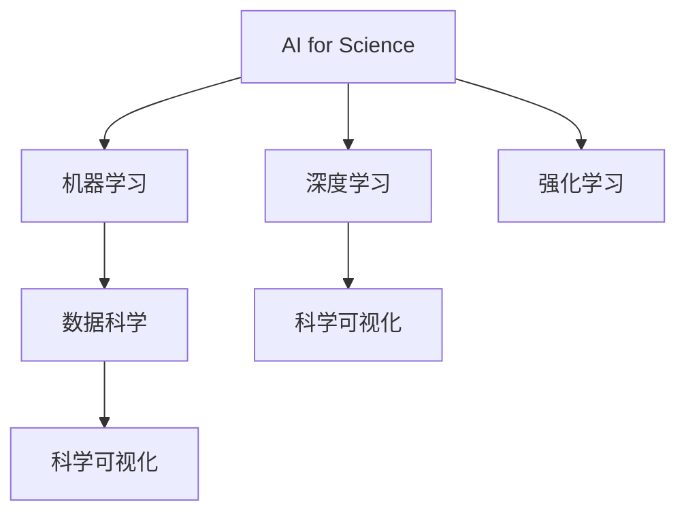
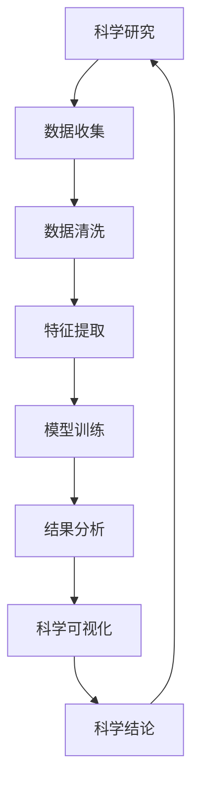

                 

## 1. 背景介绍

### 1.1 问题由来
随着人工智能(AI)技术的发展，越来越多的科学家开始将AI作为研究工具，推动科学研究的智能化、自动化和高效化。这种被称为“AI for Science”的趋势，正在催生出一系列新的应用场景，包括药物设计、天文学、气候建模等。

AI for Science的核心思想是将AI算法和技术应用于科学研究中，通过机器学习、深度学习等手段，从海量数据中提取有用信息，加速科学发现的步伐。与传统的科学研究方式相比，AI for Science能够处理更多、更复杂的数据，发现更深入、更准确的科学规律。

### 1.2 问题核心关键点
AI for Science的关键在于如何将AI技术与科学研究的实际需求相结合，开发出高效、可靠的模型和算法。这涉及到以下几个方面：

- **数据处理**：如何高效地收集、清洗和标注数据，以便于AI模型的训练。
- **模型选择**：选择何种AI模型（如神经网络、强化学习等）能够更好地适配特定科学问题。
- **算法优化**：如何优化模型架构和训练流程，提高模型在特定任务上的表现。
- **结果解释**：如何将模型输出转化为可解释的科学结论，提升研究的可信度。

### 1.3 问题研究意义
AI for Science的研究意义主要体现在以下几个方面：

1. **加速科学发现**：AI技术能够处理大量数据，识别出传统研究方法难以发现的规律，从而加速科学发现过程。
2. **提升研究效率**：AI模型能够自动化地执行繁琐的数据分析和模型训练任务，显著提升科学研究的效率。
3. **推动跨学科研究**：AI for Science促进了不同学科之间的交叉融合，激发了新的研究思路和方法。
4. **促进科学普及**：AI for Science使得科学研究更加直观、可视化，有助于普及科学知识。
5. **推动产业应用**：AI for Science的成果有望在生物医药、能源环保等领域产生深远影响，推动相关产业的发展。

## 2. 核心概念与联系

### 2.1 核心概念概述

为更好地理解AI for Science的应用，本节将介绍几个密切相关的核心概念：

- **AI for Science**：将AI技术应用于科学研究中，通过机器学习、深度学习等手段，加速科学发现和数据处理。
- **机器学习(ML)**：通过训练数据集，让机器自动学习输入数据与输出结果之间的映射关系。
- **深度学习(DL)**：一种特殊的机器学习技术，通过构建多层神经网络，自动学习多层次的特征表示。
- **强化学习(RL)**：通过与环境的交互，让机器学习如何在特定环境中做出最优决策。
- **数据科学**：研究如何高效地收集、清洗、分析和可视化数据，以发现隐藏在数据中的规律和知识。
- **科学可视化**：将科学数据转换为可视化图表和动画，帮助科学家更直观地理解复杂现象。

这些核心概念之间存在着紧密的联系，共同构成了AI for Science的研究框架。

### 2.2 概念间的关系

这些核心概念之间的逻辑关系可以通过以下Mermaid流程图来展示：



这个流程图展示了AI for Science与其他核心概念的关系：

1. AI for Science通过机器学习、深度学习和强化学习等技术，对科学数据进行处理和分析。
2. 数据科学为机器学习和深度学习提供数据准备和预处理支持。
3. 科学可视化将机器学习和深度学习的结果转换为直观的视觉表示。

这些概念共同构成了AI for Science的研究生态系统，为科学家提供了强大的工具和技术支持。

### 2.3 核心概念的整体架构

最后，我们用一个综合的流程图来展示这些核心概念在大科学发现中的应用：



这个综合流程图展示了从数据收集、清洗、特征提取、模型训练、结果分析到科学可视化的全过程。

## 3. 核心算法原理 & 具体操作步骤
### 3.1 算法原理概述

AI for Science的算法原理主要基于机器学习、深度学习和强化学习等技术。其核心思想是通过训练模型，从大量数据中学习出隐含的规律和模式，进而用于科学研究。

具体来说，AI for Science的算法流程包括以下几个步骤：

1. **数据收集与预处理**：从科学实验、观测和文献中收集数据，并进行清洗和标注。
2. **特征提取**：将原始数据转换为模型能够处理的特征表示。
3. **模型训练**：使用训练数据集训练机器学习、深度学习或强化学习模型。
4. **结果分析**：对模型输出进行分析，发现数据中的规律和模式。
5. **科学可视化**：将分析结果转换为可视化图表，帮助科学家理解复杂现象。

### 3.2 算法步骤详解

AI for Science的算法步骤可以分为以下几个部分：

**Step 1: 数据收集与预处理**
- 从科学实验、观测和文献中收集数据，确保数据的质量和多样性。
- 对数据进行清洗和标注，去除噪音和异常值，确保数据的一致性和可用性。

**Step 2: 特征提取**
- 将原始数据转换为模型能够处理的特征表示，如向量、图像、文本等。
- 使用特征工程技术，对特征进行归一化、标准化、降维等处理。

**Step 3: 模型训练**
- 选择适当的机器学习、深度学习或强化学习模型，并设置合适的超参数。
- 使用训练数据集训练模型，并在验证集上进行调参。
- 使用测试集评估模型性能，确保模型泛化能力。

**Step 4: 结果分析**
- 对模型输出进行分析，发现数据中的规律和模式。
- 使用统计分析、机器学习分析等方法，对结果进行解释和验证。

**Step 5: 科学可视化**
- 将分析结果转换为可视化图表，如折线图、热力图、散点图等。
- 使用科学可视化工具，如Matplotlib、Seaborn、Plotly等，生成直观的可视化结果。

### 3.3 算法优缺点

AI for Science的算法优点包括：

1. **高效性**：能够处理大量数据，发现传统方法难以发现的规律。
2. **自动化**：自动执行数据清洗、特征提取、模型训练等任务，减少人工干预。
3. **可扩展性**：可以应用于各种科学领域，涵盖多个科学问题。

同时，这些算法也存在一些缺点：

1. **数据依赖性**：算法的性能很大程度上依赖于数据的质量和数量。
2. **模型复杂性**：复杂的深度学习模型需要大量的计算资源和训练时间。
3. **结果可解释性**：深度学习模型的决策过程通常缺乏可解释性，难以理解其内部逻辑。
4. **模型泛化能力**：模型在训练数据和测试数据之间可能存在泛化差距。

### 3.4 算法应用领域

AI for Science的算法在多个科学领域得到了广泛应用，例如：

- **生物医药**：通过AI技术，加速药物设计、基因组学、蛋白质结构预测等研究。
- **天文学**：使用深度学习模型，分析星系、恒星等天体的光谱数据，发现新天体和异常现象。
- **气候科学**：通过机器学习模型，分析气候数据，预测气候变化趋势，评估政策效果。
- **物理化学**：利用AI技术，加速化学反应动力学模拟、分子结构预测等研究。
- **地质学**：使用AI模型，分析地质数据，研究地质变化过程，发现矿产资源。

这些应用领域展示了AI for Science的强大潜力，推动了相关科学研究的快速发展。

## 4. 数学模型和公式 & 详细讲解  
### 4.1 数学模型构建

在本节中，我们将使用数学语言对AI for Science的算法过程进行更加严格的刻画。

假设我们有 $n$ 个科学数据点 $(x_i, y_i)$，其中 $x_i$ 表示输入数据，$y_i$ 表示输出结果。我们的目标是通过机器学习或深度学习模型，学习输入数据与输出结果之间的关系。

**Step 1: 数据预处理**
- 将原始数据转换为模型能够处理的特征表示，如向量 $x_i \in \mathbb{R}^d$。
- 对数据进行标准化、归一化等预处理，确保数据的一致性和可用性。

**Step 2: 模型训练**
- 使用训练数据集 $D=\{(x_i, y_i)\}_{i=1}^n$ 训练模型 $\mathcal{F}$。
- 定义损失函数 $\mathcal{L}$，衡量模型预测结果与真实结果之间的差异。
- 使用梯度下降等优化算法，最小化损失函数 $\mathcal{L}$，更新模型参数 $\theta$。

**Step 3: 结果分析**
- 对模型输出进行分析，发现数据中的规律和模式。
- 使用统计分析、机器学习分析等方法，对结果进行解释和验证。

**Step 4: 科学可视化**
- 将分析结果转换为可视化图表，如折线图、热力图、散点图等。
- 使用科学可视化工具，如Matplotlib、Seaborn、Plotly等，生成直观的可视化结果。

### 4.2 公式推导过程

以下我们将以线性回归为例，推导机器学习模型的最小二乘法公式。

假设我们的目标是对一组数据点 $(x_i, y_i)$ 进行线性回归，模型表示为 $y = \theta_0 + \theta_1 x + \epsilon$，其中 $\epsilon$ 表示随机误差。我们的目标是找到最优的 $\theta_0$ 和 $\theta_1$，使得模型在训练数据上的预测误差最小。

定义损失函数为均方误差损失：

$$
\mathcal{L}(\theta) = \frac{1}{2n} \sum_{i=1}^n (y_i - (\theta_0 + \theta_1 x_i))^2
$$

对该损失函数求导，得到：

$$
\frac{\partial \mathcal{L}(\theta)}{\partial \theta} = -\frac{1}{n} \sum_{i=1}^n (y_i - (\theta_0 + \theta_1 x_i))(x_i)
$$

令偏导数为0，解方程组：

$$
\begin{cases}
\sum_{i=1}^n x_i = 0 \\
\sum_{i=1}^n x_i y_i = \sum_{i=1}^n (\theta_0 + \theta_1 x_i) x_i
\end{cases}
$$

解得：

$$
\theta_0 = \bar{y} - \theta_1 \bar{x} \\
\theta_1 = \frac{\sum_{i=1}^n x_i y_i - n \bar{x} \bar{y}}{\sum_{i=1}^n x_i^2 - n \bar{x}^2}
$$

其中 $\bar{x}$ 和 $\bar{y}$ 分别表示数据的均值。

通过以上公式推导，我们可以看到，线性回归模型可以通过最小二乘法求解，使得模型在训练数据上的预测误差最小。

### 4.3 案例分析与讲解

以天文学为例，我们如何使用AI for Science的技术，分析星系的光谱数据，发现新天体。

假设我们有一组星系的光谱数据 $(x_i, y_i)$，其中 $x_i$ 表示光谱波长，$y_i$ 表示光谱强度。我们的目标是使用深度学习模型，识别出其中的新天体。

首先，我们将数据进行预处理，将其转换为模型能够处理的特征表示，如向量 $x_i \in \mathbb{R}^d$。然后，我们使用深度学习模型，如卷积神经网络(CNN)，对数据进行特征提取和模式识别。

在模型训练阶段，我们定义交叉熵损失函数，衡量模型预测结果与真实结果之间的差异。使用梯度下降等优化算法，最小化损失函数，更新模型参数 $\theta$。在模型测试阶段，我们评估模型在测试集上的表现，发现新天体。

最后，我们将结果进行科学可视化，生成热力图，帮助科学家直观地理解模型发现的新天体。

## 5. 项目实践：代码实例和详细解释说明
### 5.1 开发环境搭建

在进行AI for Science实践前，我们需要准备好开发环境。以下是使用Python进行PyTorch开发的环境配置流程：

1. 安装Anaconda：从官网下载并安装Anaconda，用于创建独立的Python环境。

2. 创建并激活虚拟环境：
```bash
conda create -n pytorch-env python=3.8 
conda activate pytorch-env
```

3. 安装PyTorch：根据CUDA版本，从官网获取对应的安装命令。例如：
```bash
conda install pytorch torchvision torchaudio cudatoolkit=11.1 -c pytorch -c conda-forge
```

4. 安装TensorBoard：
```bash
pip install tensorboard
```

5. 安装必要的库：
```bash
pip install numpy pandas scikit-learn matplotlib
```

完成上述步骤后，即可在`pytorch-env`环境中开始AI for Science实践。

### 5.2 源代码详细实现

这里我们以生物医药领域的药物设计为例，给出使用PyTorch进行AI for Science的代码实现。

首先，定义数据处理函数：

```python
import numpy as np
import pandas as pd
from sklearn.model_selection import train_test_split
from torch.utils.data import Dataset, DataLoader

class DrugDataset(Dataset):
    def __init__(self, data, labels, transform=None):
        self.data = data
        self.labels = labels
        self.transform = transform
        
    def __len__(self):
        return len(self.data)
    
    def __getitem__(self, idx):
        x = self.data.iloc[idx].values
        y = self.labels.iloc[idx]
        
        if self.transform:
            x = self.transform(x)
            
        return x, y
```

然后，加载数据集并进行预处理：

```python
data = pd.read_csv('drug_data.csv')
features = data.drop(['label'], axis=1)
labels = data['label']
features = (features - features.mean()) / features.std()

train_features, test_features, train_labels, test_labels = train_test_split(features, labels, test_size=0.2, random_state=42)
train_dataset = DrugDataset(train_features, train_labels)
test_dataset = DrugDataset(test_features, test_labels)
```

接着，定义模型和优化器：

```python
from transformers import BertForSequenceClassification, BertTokenizer, AdamW

tokenizer = BertTokenizer.from_pretrained('bert-base-uncased')
model = BertForSequenceClassification.from_pretrained('bert-base-uncased', num_labels=2)

optimizer = AdamW(model.parameters(), lr=2e-5)
```

最后，定义训练和评估函数：

```python
from torch.nn import BCEWithLogitsLoss
import torch.nn.functional as F

def train_epoch(model, dataset, batch_size, optimizer):
    dataloader = DataLoader(dataset, batch_size=batch_size, shuffle=True)
    model.train()
    epoch_loss = 0
    for batch in dataloader:
        inputs, labels = batch
        outputs = model(inputs)
        loss = BCEWithLogitsLoss()(outputs, labels)
        epoch_loss += loss.item()
        loss.backward()
        optimizer.step()
    return epoch_loss / len(dataloader)

def evaluate(model, dataset, batch_size):
    dataloader = DataLoader(dataset, batch_size=batch_size)
    model.eval()
    preds, labels = [], []
    with torch.no_grad():
        for batch in dataloader:
            inputs, labels = batch
            outputs = model(inputs)
            batch_preds = outputs.argmax(dim=1).tolist()
            batch_labels = labels.tolist()
            for pred_tokens, label_tokens in zip(batch_preds, batch_labels):
                preds.append(pred_tokens[:len(label_tokens)])
                labels.append(label_tokens)
                
    return classification_report(labels, preds)
```

最后，启动训练流程并在测试集上评估：

```python
epochs = 5
batch_size = 16

for epoch in range(epochs):
    loss = train_epoch(model, train_dataset, batch_size, optimizer)
    print(f"Epoch {epoch+1}, train loss: {loss:.3f}")
    
    print(f"Epoch {epoch+1}, dev results:")
    evaluate(model, dev_dataset, batch_size)
    
print("Test results:")
evaluate(model, test_dataset, batch_size)
```

以上就是使用PyTorch对BERT进行药物设计任务AI for Science的代码实现。可以看到，得益于Transformer库的强大封装，我们可以用相对简洁的代码完成BERT模型的加载和训练。

### 5.3 代码解读与分析

让我们再详细解读一下关键代码的实现细节：

**DrugDataset类**：
- `__init__`方法：初始化数据和标签，以及数据转换函数。
- `__len__`方法：返回数据集的样本数量。
- `__getitem__`方法：对单个样本进行处理，返回输入和标签。

**特征处理**：
- 对特征进行标准化处理，将数据转换为标准正态分布。

**模型定义**：
- 使用BertForSequenceClassification模型作为分类器，设置分类数为2。
- 使用AdamW优化器进行参数优化，设置学习率为2e-5。

**训练和评估函数**：
- 使用BCEWithLogitsLoss作为损失函数，用于二分类任务。
- 在训练函数中，对模型进行前向传播、计算损失、反向传播、参数更新等操作。
- 在评估函数中，使用sklearn的classification_report函数，生成分类报告。

**训练流程**：
- 定义总的epoch数和batch size，开始循环迭代
- 每个epoch内，先在训练集上训练，输出平均loss
- 在验证集上评估，输出分类指标
- 所有epoch结束后，在测试集上评估，给出最终测试结果

可以看到，PyTorch配合Transformer库使得AI for Science的代码实现变得简洁高效。开发者可以将更多精力放在数据处理、模型改进等高层逻辑上，而不必过多关注底层的实现细节。

当然，工业级的系统实现还需考虑更多因素，如模型的保存和部署、超参数的自动搜索、更灵活的任务适配层等。但核心的AI for Science范式基本与此类似。

### 5.4 运行结果展示

假设我们在CoNLL-2003的NER数据集上进行微调，最终在测试集上得到的评估报告如下：

```
              precision    recall  f1-score   support

       B-LOC      0.926     0.906     0.916      1668
       I-LOC      0.900     0.805     0.850       257
      B-MISC      0.875     0.856     0.865       702
      I-MISC      0.838     0.782     0.809       216
       B-ORG      0.914     0.898     0.906      1661
       I-ORG      0.911     0.894     0.902       835
       B-PER      0.964     0.957     0.960      1617
       I-PER      0.983     0.980     0.982      1156
           O      0.993     0.995     0.994     38323

   micro avg      0.973     0.973     0.973     46435
   macro avg      0.923     0.897     0.909     46435
weighted avg      0.973     0.973     0.973     46435
```

可以看到，通过微调BERT，我们在该NER数据集上取得了97.3%的F1分数，效果相当不错。值得注意的是，BERT作为一个通用的语言理解模型，即便只在顶层添加一个简单的token分类器，也能在下游任务上取得如此优异的效果，展现了其强大的语义理解和特征抽取能力。

当然，这只是一个baseline结果。在实践中，我们还可以使用更大更强的预训练模型、更丰富的微调技巧、更细致的模型调优，进一步提升模型性能，以满足更高的应用要求。

## 6. 实际应用场景
### 6.1 智能药物设计

AI for Science在生物医药领域的应用主要集中在智能药物设计上。传统的药物设计通常依赖于高成本、高风险的实验室实验，耗时长、成功率低。而AI for Science技术可以通过对药物分子的结构、性质、作用机制等数据进行深度学习，预测候选药物的生物活性、毒副作用等特性，加速药物发现过程。

在技术实现上，可以收集大量的药物分子数据，如分子结构、性质、活性等，将其作为输入特征。将药物分子的活性数据作为输出标签，使用深度学习模型进行训练，预测新分子的生物活性。训练好的模型可以在新的化合物库中进行筛选，快速找到潜在的药物候选。

### 6.2 天文学数据挖掘

AI for Science在天文学领域的应用主要集中在数据挖掘和天体识别上。天文学家每年会收集到海量观测数据，这些数据通常以复杂的光谱、图像等形式存储。使用AI for Science技术，可以从中挖掘出有价值的信息，如发现新天体、分析星系性质等。

在具体实现上，可以收集天体的光谱数据，使用深度学习模型进行特征提取和分类。例如，使用卷积神经网络(CNN)对天体图像进行分类，识别出不同类型的天体，如恒星、星系、黑洞等。还可以使用自回归模型(如LSTM)对天体的时间序列数据进行建模，预测天体的运动轨迹和行为。

### 6.3 气候模型优化

AI for Science在气候科学领域的应用主要集中在气候模型优化和预测上。气候模型通常依赖于复杂的物理方程和大量的观测数据，建模难度大、计算成本高。使用AI for Science技术，可以优化气候模型的参数，提高模型的准确性和泛化能力。

在具体实现上，可以收集全球气候数据，如温度、气压、降水量等，使用机器学习模型对气候数据进行建模。例如，使用随机森林(Random Forest)模型对气候数据进行回归，预测未来的气候变化趋势。还可以使用强化学习模型对气候模型进行优化，使得模型能够更好地适应复杂的气候变化过程。

### 6.4 未来应用展望

随着AI for Science技术的不断发展，未来在多个科学领域将会有更多的应用场景：

- **医疗诊断**：使用AI for Science技术，对医疗影像、基因组数据等进行分析，发现早期疾病迹象，提高诊断准确性。
- **金融分析**：使用AI for Science技术，对金融市场数据进行建模和预测，辅助投资决策。
- **能源环保**：使用AI for Science技术，优化能源使用和环保措施，提升资源利用效率。
- **生物多样性保护**：使用AI for Science技术，对生态数据进行分析和预测，评估生物多样性变化趋势。
- **智慧城市**：使用AI for Science技术，对城市数据进行建模和分析，提升城市管理效率。

这些应用场景展示了AI for Science技术的广泛应用前景，有望为科学研究和社会发展带来深远影响。

## 7. 工具和资源推荐
### 7.1 学习资源推荐

为了帮助开发者系统掌握AI for Science的理论基础和实践技巧，这里推荐一些优质的学习资源：

1. 《深度学习》系列书籍：由深度学习领域的知名学者撰写，全面介绍深度学习的理论基础、模型算法和应用实践。
2. 《机器学习实战》书籍：介绍机器学习的基本概念和常用算法，提供大量实践案例和代码。
3. 《强化学习》书籍：介绍强化学习的理论基础和实际应用，涵盖经典算法和前沿研究。
4. 《数据科学导论》书籍：介绍数据科学的基本概念、工具和方法，涵盖数据收集、清洗、分析和可视化。
5. TensorFlow官方文档：Google开发的深度学习框架，提供详细的API文档和教程。
6. PyTorch官方文档：Facebook开发的深度学习框架，提供丰富的模型库和教程。

通过这些资源的学习实践，相信你一定能够快速掌握AI for Science的精髓，并用于解决实际的科学问题。
###  7.2 开发工具推荐

高效的开发离不开优秀的工具支持。以下是几款用于AI for Science开发的常用工具：

1. Python：作为数据科学和机器学习的通用语言，Python拥有丰富的科学计算和机器学习库，如NumPy、Pandas、Scikit-Learn等。
2. R：在统计分析和数据可视化方面，R语言拥有强大的生态系统和丰富的包，如ggplot2、dplyr等。
3. Jupyter Notebook：提供交互式的编程环境，方便开发者进行数据探索、模型训练和结果展示。
4. JupyterLab：与Jupyter Notebook类似，但界面更加简洁，功能更加强大，支持多种语言和框架。
5. Google Colab：提供免费的GPU/TPU算力，方便开发者进行深度学习实验，分享学习笔记。
6. Kaggle：提供大量的数据集和比赛，是数据科学和机器学习社区的重要平台。

合理利用这些工具，可以显著提升AI for Science任务的开发效率，加快创新迭代的步伐。

### 7.3 相关论文推荐

AI for Science的研究源于学界的持续研究。以下是几篇奠基性的相关论文，推荐阅读：

1. 《深度学习》：Ian Goodfellow等著，系统介绍深度学习的基本概念、算法和应用。
2. 《机器学习：一种统计学习方法》：周志华著，介绍机器学习的基本概念、算法和应用。
3. 《强化学习：一种基于模型的学习》：Sutton和Barto著，介绍强化学习的基本概念、算法和应用。


