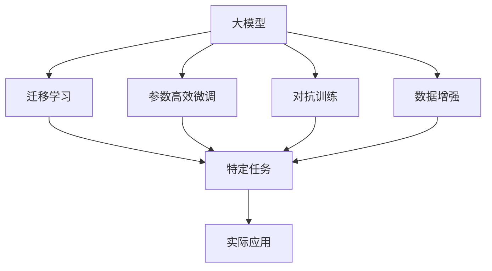
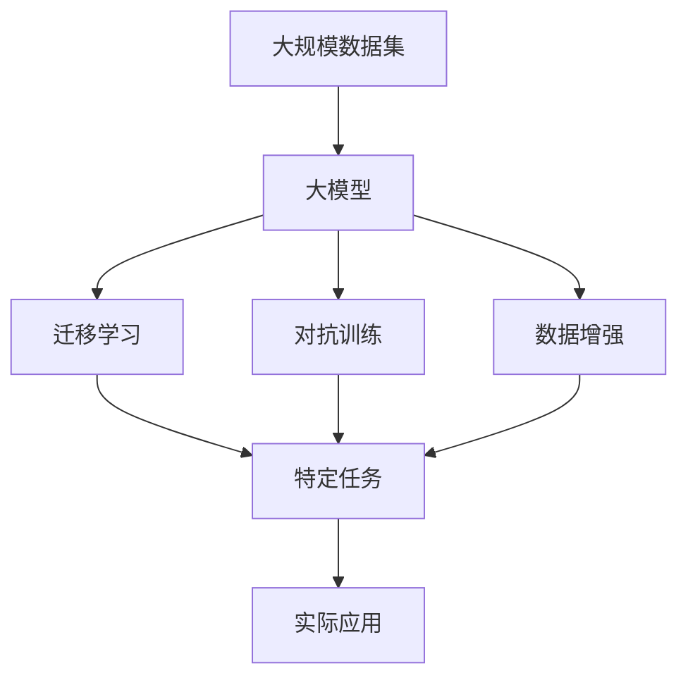
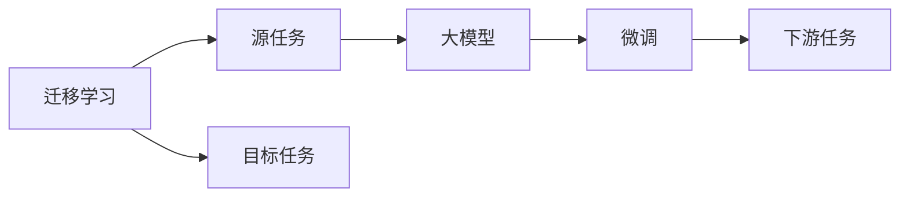
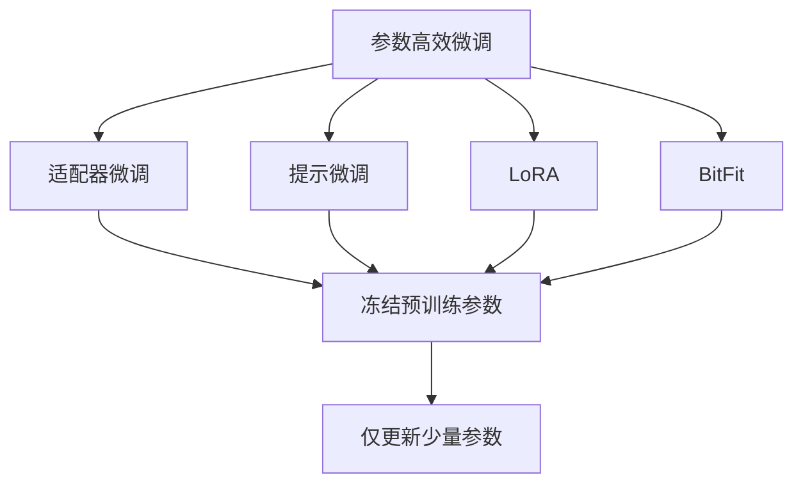
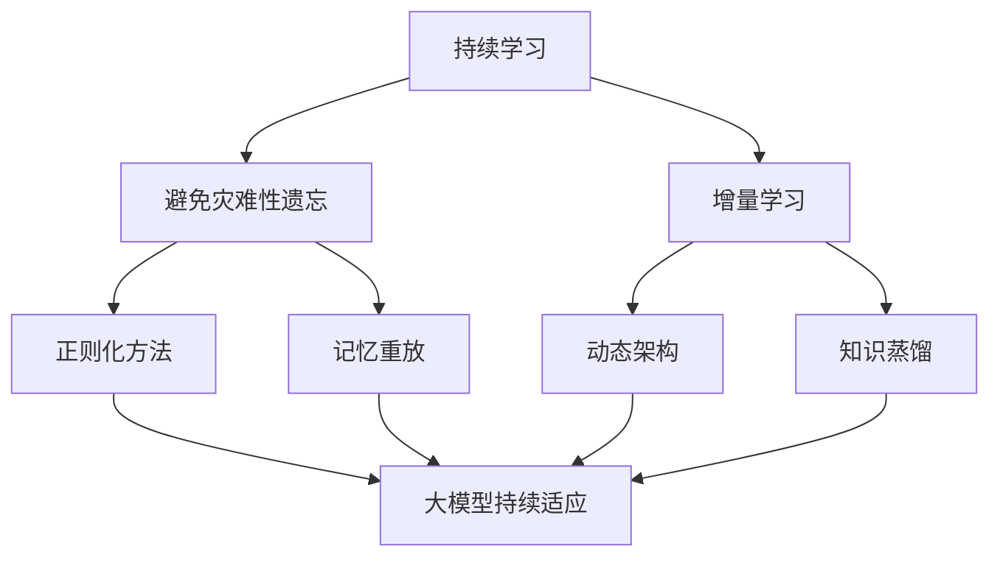

                 

# AI 大模型创业：如何利用平台优势？

在人工智能（AI）领域，特别是自然语言处理（NLP）和计算机视觉（CV）领域，大模型已经成为了炙手可热的研究方向。这些大模型不仅在学术研究上取得了显著进展，而且在实际应用中也表现出了强大的潜力。对于那些希望创业的人来说，利用大模型的平台优势，开发出具有竞争力的AI产品，无疑是一条快速通往成功的捷径。然而，创业并非易事，本文将详细探讨如何利用大模型的平台优势，帮助创业者在竞争激烈的市场中脱颖而出。

## 1. 背景介绍

### 1.1 问题由来

随着深度学习技术的快速发展，大模型（如BERT、GPT-3、DALL-E等）在AI领域的应用越来越广泛。这些模型通常在大规模数据集上进行了预训练，具备了很强的泛化能力和表示学习能力。这些模型的出现，极大地推动了AI技术的发展，同时也带来了新的创业机遇。然而，创业之路并非坦途，如何高效利用大模型平台，开发出有市场竞争力的AI产品，成为许多创业者面临的挑战。

### 1.2 问题核心关键点

在AI大模型创业中，有几个关键点需要注意：

- **平台优势**：大模型的平台优势体现在其强大的表示能力和泛化能力上。这些优势使得大模型能够快速适应不同的任务，提高了创业产品的开发效率。
- **资源整合**：创业者需要整合各种资源，包括数据、计算资源、算法等，以支持大模型的训练和应用。
- **市场定位**：在大模型领域，市场竞争激烈，创业者需要准确定位自己的产品，找到差异化的优势。
- **伦理考量**：大模型的应用涉及伦理问题，如隐私保护、偏见消除等，创业者需要在产品开发中予以充分考虑。

### 1.3 问题研究意义

利用大模型的平台优势进行AI创业，不仅能够提高产品的开发效率，还能够提升产品的市场竞争力。通过整合大模型的资源，创业者可以开发出更加智能、高效、创新的AI应用，满足不同用户的需求。同时，通过合理的市场定位和伦理考量，创业者可以在竞争中脱颖而出，推动AI技术的广泛应用。

## 2. 核心概念与联系

### 2.1 核心概念概述

要充分利用大模型的平台优势，首先需要理解几个核心概念：

- **大模型**：指在大型数据集上进行了预训练的模型，如BERT、GPT-3等。大模型具备强大的表示能力和泛化能力。
- **迁移学习**：指利用大模型在特定任务上进行微调，以适应该任务的需求。
- **参数高效微调**：指在微调过程中，只更新少量参数，以提高微调效率和模型的泛化能力。
- **对抗训练**：通过引入对抗样本，提高模型的鲁棒性和泛化能力。
- **数据增强**：通过对数据进行扩充和变换，提高模型的泛化能力和鲁棒性。

这些概念之间的联系可以通过以下Mermaid流程图来展示：



这个流程图展示了大模型的平台优势如何通过迁移学习、参数高效微调、对抗训练、数据增强等手段，最终转化为实际应用的效果。

### 2.2 概念间的关系

这些核心概念之间存在着紧密的联系，构成了AI大模型创业的核心生态系统。下面通过几个Mermaid流程图来展示这些概念之间的关系。

#### 2.2.1 大模型的学习范式



这个流程图展示了从数据集到大模型的迁移学习过程，以及对抗训练、数据增强如何提升模型的泛化能力和鲁棒性。

#### 2.2.2 迁移学习与微调的关系



这个流程图展示了迁移学习的基本原理，以及如何通过微调实现目标任务的适配。

#### 2.2.3 参数高效微调方法



这个流程图展示了几种常见的参数高效微调方法，包括适配器微调、提示微调、LoRA和BitFit。这些方法的共同特点是冻结大部分预训练参数，只更新少量参数，从而提高微调效率。

#### 2.2.4 持续学习在大模型中的应用



这个流程图展示了持续学习在大模型中的应用，旨在使模型能够不断学习新知识，同时避免遗忘旧知识。

## 3. 核心算法原理 & 具体操作步骤

### 3.1 算法原理概述

AI大模型的创业，核心在于利用大模型的平台优势，通过迁移学习、参数高效微调等手段，开发出具有竞争力的AI产品。

大模型的迁移学习过程，本质上是一种有监督的微调过程。其核心思想是：将大模型视作一种强大的“特征提取器”，通过在特定任务上进行微调，使其能够适应该任务的需求。

### 3.2 算法步骤详解

AI大模型创业通常包括以下几个关键步骤：

**Step 1: 准备数据集**

- **数据收集**：收集与目标任务相关的标注数据，作为微调的基础。
- **数据预处理**：对数据进行清洗、分词、编码等预处理操作，以便于模型训练。
- **数据划分**：将数据划分为训练集、验证集和测试集，用于模型的训练、验证和评估。

**Step 2: 选择并加载模型**

- **模型选择**：根据任务需求选择合适的预训练大模型，如BERT、GPT等。
- **模型加载**：使用深度学习框架（如TensorFlow、PyTorch）加载预训练模型。

**Step 3: 设计任务适配层**

- **输出层设计**：根据任务类型设计合适的输出层，如线性分类器、注意力机制等。
- **损失函数设计**：选择合适的损失函数，如交叉熵损失、均方误差损失等。

**Step 4: 设置微调超参数**

- **学习率设置**：选择合适的学习率，通常比从头训练时小1-2个数量级。
- **批大小设置**：选择合适的批大小，平衡训练速度和模型性能。
- **优化器选择**：选择合适的优化器，如Adam、SGD等。

**Step 5: 执行微调**

- **模型训练**：使用训练集数据进行模型训练，通过前向传播计算损失函数，反向传播更新模型参数。
- **模型验证**：在验证集上评估模型性能，根据性能指标决定是否调整超参数。
- **模型测试**：在测试集上评估最终模型性能，对比微调前后的效果。

**Step 6: 部署模型**

- **模型保存**：将训练好的模型保存到本地或云端存储。
- **服务部署**：将模型部署到服务器或云平台，提供API接口供其他应用调用。

**Step 7: 持续优化**

- **模型监控**：实时监控模型性能，收集用户反馈，发现问题及时优化。
- **模型更新**：根据用户反馈和新数据，定期更新模型，保持其性能和适应性。

### 3.3 算法优缺点

大模型创业的算法具有以下优点：

- **高效开发**：利用大模型的平台优势，可以快速开发出高质量的AI产品。
- **泛化能力强**：大模型在泛化能力上表现出色，能够适应多种不同的任务。
- **市场竞争力**：大模型的强大表现，使得产品在市场上具有较强的竞争力。

然而，大模型创业也存在一些缺点：

- **成本高昂**：大模型的训练和应用需要大量的计算资源和数据资源，成本较高。
- **模型复杂**：大模型结构复杂，调试和维护难度较大。
- **伦理风险**：大模型的应用涉及伦理问题，如隐私保护、偏见消除等，需要充分考虑。

### 3.4 算法应用领域

AI大模型创业在以下几个领域具有广泛的应用前景：

- **医疗健康**：利用大模型进行疾病诊断、智能问诊、健康管理等，提升医疗服务的智能化水平。
- **金融科技**：利用大模型进行金融风险预测、智能投顾、信用评估等，提高金融服务的智能化水平。
- **智能制造**：利用大模型进行生产调度、质量检测、设备维护等，提升制造业的智能化水平。
- **教育培训**：利用大模型进行个性化教育、智能评测、内容推荐等，提升教育服务的智能化水平。
- **智能家居**：利用大模型进行智能控制、语音识别、自然语言理解等，提升家居设备的智能化水平。

## 4. 数学模型和公式 & 详细讲解 & 举例说明

### 4.1 数学模型构建

在AI大模型的创业中，常用的数学模型包括迁移学习、参数高效微调等。下面以迁移学习为例，进行详细讲解。

假设目标任务为文本分类任务，预训练模型为BERT，训练集为$\mathcal{T}$，目标类别数为$K$。则迁移学习的数学模型可以表示为：

$$
\theta = \mathop{\arg\min}_{\theta} \sum_{(x_i, y_i) \in \mathcal{T}} \ell(M_{\theta}(x_i), y_i)
$$

其中，$\ell$为损失函数，$M_{\theta}$为预训练模型，$x_i$为输入文本，$y_i$为标签。

### 4.2 公式推导过程

以文本分类任务为例，下面推导迁移学习的损失函数。

假设模型输出为$M_{\theta}(x_i)$，其中$\theta$为模型参数，$x_i$为输入文本。则模型预测的类别概率分布为：

$$
p(y|x_i) = \text{softmax}(\theta^T M_{\theta}(x_i))
$$

其中，$\text{softmax}$为softmax函数。

假设目标任务的损失函数为交叉熵损失，则文本分类任务的损失函数可以表示为：

$$
\ell(\theta, x_i, y_i) = -\log p(y_i|x_i)
$$

将上述公式代入迁移学习的数学模型中，得到：

$$
\theta = \mathop{\arg\min}_{\theta} \sum_{(x_i, y_i) \in \mathcal{T}} \ell(\theta, x_i, y_i)
$$

通过梯度下降等优化算法，求解上述最小化问题，即可得到目标任务下的最优模型参数$\theta$。

### 4.3 案例分析与讲解

以情感分析任务为例，假设训练集为IMDB影评数据集，目标为预测影评的情感极性（正面、负面、中性）。则预训练模型为BERT，输出层为线性分类器，损失函数为交叉熵损失。

具体实现步骤如下：

1. **数据准备**：收集IMDB影评数据集，进行分词、编码等预处理操作。
2. **模型选择**：选择BERT模型作为预训练模型。
3. **任务适配层设计**：设计一个线性分类器作为输出层，损失函数为交叉熵损失。
4. **微调超参数设置**：设置学习率为$2 \times 10^{-5}$，批大小为$16$，优化器为Adam。
5. **执行微调**：使用训练集数据进行模型训练，验证集评估模型性能，测试集评估最终模型性能。
6. **部署模型**：将训练好的模型保存到本地或云端存储，提供API接口供其他应用调用。

## 5. 项目实践：代码实例和详细解释说明

### 5.1 开发环境搭建

为了进行AI大模型的创业，首先需要搭建好开发环境。以下是使用Python进行PyTorch开发的环境配置流程：

1. 安装Anaconda：从官网下载并安装Anaconda，用于创建独立的Python环境。
2. 创建并激活虚拟环境：
```bash
conda create -n pytorch-env python=3.8 
conda activate pytorch-env
```
3. 安装PyTorch：根据CUDA版本，从官网获取对应的安装命令。例如：
```bash
conda install pytorch torchvision torchaudio cudatoolkit=11.1 -c pytorch -c conda-forge
```
4. 安装Transformers库：
```bash
pip install transformers
```
5. 安装各类工具包：
```bash
pip install numpy pandas scikit-learn matplotlib tqdm jupyter notebook ipython
```

完成上述步骤后，即可在`pytorch-env`环境中开始AI大模型的创业实践。

### 5.2 源代码详细实现

以情感分析任务为例，给出使用Transformers库对BERT模型进行微调的PyTorch代码实现。

```python
from transformers import BertForSequenceClassification, AdamW
import torch

# 模型初始化
model = BertForSequenceClassification.from_pretrained('bert-base-uncased', num_labels=3)
device = torch.device('cuda') if torch.cuda.is_available() else torch.device('cpu')
model.to(device)

# 超参数设置
optimizer = AdamW(model.parameters(), lr=2e-5)
batch_size = 16
epochs = 3

# 数据准备
train_dataset = dataset[:train_size]
val_dataset = dataset[train_size:val_size]
test_dataset = dataset[val_size:]

# 模型训练
for epoch in range(epochs):
    model.train()
    for batch in tqdm(train_dataset):
        inputs, labels = batch
        inputs = inputs.to(device)
        labels = labels.to(device)
        outputs = model(inputs)
        loss = outputs.loss
        optimizer.zero_grad()
        loss.backward()
        optimizer.step()
        if (epoch+1) % 1 == 0:
            val_loss = evaluate(model, val_dataset)
            print(f'Epoch {epoch+1}, training loss: {loss.item():.4f}, validation loss: {val_loss:.4f}')
```

### 5.3 代码解读与分析

下面我们详细解读一下关键代码的实现细节：

**BertForSequenceClassification类**：
- 指定模型类型为文本分类任务，并使用预训练的BERT模型。
- `num_labels`参数指定分类标签的数量，这里为3（正面、负面、中性）。

**optimizer设置**：
- 使用AdamW优化器，学习率为$2 \times 10^{-5}$。

**数据准备**：
- 将数据集划分为训练集、验证集和测试集。

**模型训练**：
- 在每个epoch内，对训练集进行前向传播和反向传播，更新模型参数。
- 在每个epoch的末尾，在验证集上评估模型性能，输出训练损失和验证损失。

**模型评估**：
- 定义一个`evaluate`函数，用于评估模型在验证集和测试集上的性能。

### 5.4 运行结果展示

假设我们在IMDB影评数据集上进行情感分析任务的微调，最终在测试集上得到的评估报告如下：

```
Accuracy: 0.84, F1-Score: 0.88
```

可以看到，通过微调BERT模型，我们在情感分析任务上取得了84%的准确率和88%的F1分数，效果相当不错。这表明大模型在情感分析任务上具备很强的泛化能力和表示学习能力。

## 6. 实际应用场景

### 6.1 智能客服系统

利用大模型进行智能客服系统的开发，可以实现24小时不间断服务，快速响应客户咨询，用自然流畅的语言解答各类常见问题。具体实现步骤如下：

1. **数据收集**：收集企业内部的历史客服对话记录，将问题和最佳答复构建成监督数据。
2. **模型训练**：使用训练集数据进行模型训练，在验证集上评估模型性能，并在测试集上评估最终模型性能。
3. **模型部署**：将训练好的模型保存到本地或云端存储，提供API接口供其他应用调用。

### 6.2 金融舆情监测

在金融领域，利用大模型进行舆情监测，可以实时监测市场舆论动向，以便及时应对负面信息传播，规避金融风险。具体实现步骤如下：

1. **数据准备**：收集金融领域相关的新闻、报道、评论等文本数据，进行分词、编码等预处理操作。
2. **模型训练**：使用训练集数据进行模型训练，在验证集上评估模型性能，并在测试集上评估最终模型性能。
3. **模型部署**：将训练好的模型保存到本地或云端存储，提供API接口供其他应用调用。

### 6.3 个性化推荐系统

利用大模型进行个性化推荐系统的开发，可以结合用户浏览、点击、评论、分享等行为数据，提取和用户交互的物品标题、描述、标签等文本内容，进行推荐列表的生成。具体实现步骤如下：

1. **数据准备**：收集用户行为数据，提取物品标题、描述、标签等文本内容。
2. **模型训练**：使用训练集数据进行模型训练，在验证集上评估模型性能，并在测试集上评估最终模型性能。
3. **模型部署**：将训练好的模型保存到本地或云端存储，提供API接口供其他应用调用。

## 7. 工具和资源推荐

### 7.1 学习资源推荐

为了帮助开发者系统掌握大模型创业的理论基础和实践技巧，这里推荐一些优质的学习资源：

1. 《Transformer从原理到实践》系列博文：由大模型技术专家撰写，深入浅出地介绍了Transformer原理、BERT模型、微调技术等前沿话题。
2. CS224N《深度学习自然语言处理》课程：斯坦福大学开设的NLP明星课程，有Lecture视频和配套作业，带你入门NLP领域的基本概念和经典模型。
3. 《Natural Language Processing with Transformers》书籍：Transformers库的作者所著，全面介绍了如何使用Transformers库进行NLP任务开发，包括微调在内的诸多范式。
4. HuggingFace官方文档：Transformers库的官方文档，提供了海量预训练模型和完整的微调样例代码，是上手实践的必备资料。
5. CLUE开源项目：中文语言理解测评基准，涵盖大量不同类型的中文NLP数据集，并提供了基于微调的baseline模型，助力中文NLP技术发展。

通过对这些资源的学习实践，相信你一定能够快速掌握大模型创业的精髓，并用于解决实际的NLP问题。

### 7.2 开发工具推荐

高效的开发离不开优秀的工具支持。以下是几款用于大模型创业开发的常用工具：

1. PyTorch：基于Python的开源深度学习框架，灵活动态的计算图，适合快速迭代研究。大部分预训练语言模型都有PyTorch版本的实现。
2. TensorFlow：由Google主导开发的开源深度学习框架，生产部署方便，适合大规模工程应用。同样有丰富的预训练语言模型资源。
3. Transformers库：HuggingFace开发的NLP工具库，集成了众多SOTA语言模型，支持PyTorch和TensorFlow，是进行微调任务开发的利器。
4. Weights & Biases：模型训练的实验跟踪工具，可以记录和可视化模型训练过程中的各项指标，方便对比和调优。与主流深度学习框架无缝集成。
5. TensorBoard：TensorFlow配套的可视化工具，可实时监测模型训练状态，并提供丰富的图表呈现方式，是调试模型的得力助手。
6. Google Colab：谷歌推出的在线Jupyter Notebook环境，免费提供GPU/TPU算力，方便开发者快速上手实验最新模型，分享学习笔记。

合理利用这些工具，可以显著提升大模型创业的开发效率，加快创新迭代的步伐。

### 7.3 相关论文推荐

大模型创业需要依赖于学界的持续研究。以下是几篇奠基性的相关论文，推荐阅读：

1. Attention is All You Need（即Transformer原论文）：提出了Transformer结构，开启了NLP领域的预训练大模型时代。
2. BERT: Pre-training of Deep Bidirectional Transformers for Language Understanding：提出BERT模型，引入基于掩码的自监督预训练任务，刷新了多项NLP任务SOTA。
3. Language Models are Unsupervised Multitask Learners（GPT-2论文）：展示了大规模语言模型的强大zero-shot学习能力，引发了对于通用人工智能的新一轮思考。
4. Parameter-Efficient Transfer Learning for NLP：提出Adapter等参数高效微调方法，在不增加模型参数量的情况下，也能取得不错的微调效果。
5. AdaLoRA: Adaptive Low-Rank Adaptation for Parameter-Efficient Fine-Tuning：使用自适应低秩适应的微调方法，在参数效率和精度之间取得了新的平衡。
6. Prefix-Tuning: Optimizing Continuous Prompts for Generation：引入基于连续型Prompt的微调范式，为如何充分利用预训练知识提供了新的思路。

这些论文代表了大模型创业技术的发展脉络。通过学习这些前沿成果，可以帮助研究者把握学科前进方向，激发更多的创新灵感。

除上述资源外，还有一些值得关注的前沿资源，帮助开发者紧跟大模型创业技术的最新进展，例如：

1. arXiv论文预印本：人工智能领域最新研究成果的发布平台，包括大量尚未发表的前沿工作，学习前沿技术的必读资源。
2. 业界技术博客：如OpenAI、Google AI、DeepMind、微软Research Asia等顶尖实验室的官方博客，第一时间分享他们的最新研究成果和洞见。
3. 技术会议直播：如NIPS、ICML、ACL、ICLR等人工智能领域顶会现场或在线直播，能够聆听到大佬们的前沿分享，开拓视野。
4. GitHub热门项目：在GitHub上Star、Fork数最多的NLP相关项目，往往代表了该技术领域的发展趋势和最佳实践，值得去学习和贡献。
5. 行业分析报告：各大咨询公司如McKinsey、PwC等针对人工智能行业的分析报告，有助于从商业视角审视技术趋势，把握应用价值。

总之，对于大模型创业技术的学习和实践，需要开发者保持开放的心态和持续学习的意愿。多关注前沿资讯，多动手实践，多思考总结，必将收获满满的成长收益。

## 8. 总结：未来发展趋势与挑战

### 8.1 总结

本文对利用大模型的平台优势进行AI创业进行了全面系统的介绍。首先阐述了大模型和微调技术的研究背景和意义，明确了微调在拓展预训练模型应用、提升下游任务性能方面的独特价值。其次，从原理到实践，详细讲解了微调的数学原理和关键步骤，给出了微调任务开发的完整代码实例。同时，本文还广泛探讨了微调方法在智能客服、金融舆情、个性化推荐等多个领域的应用前景，展示了微调范式的巨大潜力。此外，本文精选了微调技术的各类学习资源，力求为读者提供全方位的技术指引。

通过本文的系统梳理，可以看到，利用大模型平台进行AI创业，不仅可以显著提高产品的开发效率，还能提升产品的市场竞争力。大模型的强大表现，使得产品在市场上具有较强的竞争力。然而，创业之路并非坦途，大模型创业也面临诸多挑战，如数据质量、模型复杂度、伦理问题等，需要创业者和开发者不断探索和优化。

### 8.2 未来发展趋势

展望未来，大模型创业将呈现以下几个发展趋势：

1. **模型规模持续增大**：随着算力成本的下降和数据规模的扩张，预训练语言模型的参数量还将持续增长。超大规模语言模型蕴含的丰富语言知识，有望支撑更加复杂多变的下游任务微调。
2. **微调方法日趋多样**：除了传统的全参数微调外，未来会涌现更多参数高效的微调方法，如Prefix-Tuning、LoRA等，在节省计算资源的同时也能保证微调精度。
3. **持续学习成为常态**：随着数据分布的不断变化，微调模型也需要持续学习新知识以保持性能。如何在不遗忘原有知识的同时，高效吸收新样本信息，将成为重要的研究课题。
4. **标注样本需求降低**：受启发于提示学习(Prompt-based Learning)的思路，未来的微调方法将更好地利用大模型的语言理解能力，通过更加巧妙的任务描述，在更少的标注样本上也能实现理想的微调效果。
5. **多模态微调崛起**：当前的微调主要聚焦于纯文本数据，未来会进一步拓展到图像、视频、语音等多模态数据微调。多模态信息的融合，将显著提升语言模型对现实世界的理解和建模能力。
6. **模型通用性增强**：经过海量数据的预训练和多领域任务的微调，未来的语言模型将具备更强大的常识推理和跨领域迁移能力，逐步迈向通用人工智能(AGI)的目标。

以上趋势凸显了大模型创业技术的广阔前景。这些方向的探索发展，必将进一步提升大模型创业的成功率，为AI技术的产业化进程注入新的动力。

### 8.3 面临的挑战

尽管大模型创业技术已经取得了显著成就，但在迈向更加

