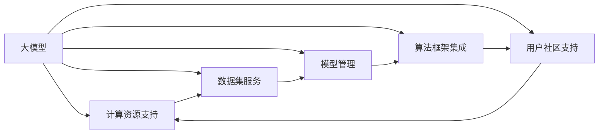

                 

# AI 大模型创业：如何利用平台优势？

> 关键词：大模型创业,平台优势,深度学习,自然语言处理,NLP,推荐系统,企业应用

## 1. 背景介绍

### 1.1 问题由来

近年来，人工智能（AI）技术取得了显著进步，特别是深度学习和大规模语言模型的兴起，为各行各业带来了前所未有的机遇。以大模型为核心的AI创业，凭借其强大的计算能力和丰富的知识表示，正在成为新一代创业的“热门”。

然而，大模型创业也面临着诸多挑战。传统算法开发大多采用自上而下的方式，依赖于有经验的工程师和算力投入。相比之下，大模型创业的门槛高、成本大、风险高，需要更强的资源整合能力和平台支撑。

### 1.2 问题核心关键点

为了更好地解决上述问题，本文将从平台优势的角度出发，探讨如何通过有效的平台整合和优化，推动大模型创业的可持续发展。

### 1.3 问题研究意义

通过分析大模型创业中平台优势的构建和利用，本文旨在为AI创业者和投资者提供有益的参考，降低大模型创业的风险，加速其落地应用，最终实现人工智能技术的商业化。

## 2. 核心概念与联系

### 2.1 核心概念概述

在深入探讨平台优势前，我们先明确一些核心概念：

- **大模型**：指基于深度学习框架训练的大型神经网络模型，如BERT、GPT等，具备强大的语言理解能力和生成能力。
- **创业平台**：指基于云计算和数据服务，构建的大模型开发和部署环境。
- **平台优势**：指通过构建高效、易用的平台，降低创业门槛，提升开发效率，加速技术落地应用的能力。

大模型创业平台通常具备以下几个核心能力：

1. **计算资源支持**：提供GPU、TPU等高性能计算资源，加速模型训练和推理。
2. **数据集服务**：提供预训练数据和标注数据，帮助快速迭代模型。
3. **模型管理**：提供模型版本控制、训练监控和模型部署服务。
4. **算法框架集成**：提供开源算法库的集成和优化，降低模型开发难度。
5. **用户社区支持**：提供社区交流和合作平台，加速知识共享和技术创新。

### 2.2 概念间的关系

这些核心概念之间存在紧密的联系，共同构建了大模型创业的平台生态系统。我们通过以下Mermaid流程图来展示这些概念之间的相互关系：



这个流程图展示了各个核心概念之间的依赖关系：

- **大模型**：作为基础，通过平台支持进行训练、推理和优化。
- **计算资源支持**：提供高性能计算环境，加速大模型训练和推理。
- **数据集服务**：提供预训练数据和标注数据，帮助模型快速迭代。
- **模型管理**：提供模型版本控制和训练监控，优化模型开发流程。
- **算法框架集成**：提供算法库和优化工具，降低模型开发难度。
- **用户社区支持**：提供交流平台和合作机会，加速技术创新和知识共享。

### 2.3 核心概念的整体架构

最后，我们用一个综合的流程图来展示这些核心概念在大模型创业中的整体架构：


这个综合流程图展示了从大模型到创业应用的全过程，通过平台各组件的协同工作，实现高效、灵活、可扩展的大模型创业。

## 3. 核心算法原理 & 具体操作步骤
### 3.1 算法原理概述

大模型创业平台的核心算法原理主要围绕模型训练、数据处理、模型管理等方面展开。

1. **模型训练算法**：
   - **分布式训练**：利用分布式计算框架（如TensorFlow、PyTorch），加速大规模模型训练。
   - **超参数优化**：采用贝叶斯优化、网格搜索等方法，自动调整模型超参数，提高模型性能。
   - **增量训练**：通过增量训练机制，快速迭代模型，减少资源浪费。

2. **数据处理算法**：
   - **数据清洗**：去除噪声数据，预处理文本、图像等数据，提高数据质量。
   - **数据增强**：通过数据增强技术（如回译、随机采样等），扩充训练集。
   - **数据分区**：将数据集划分为训练集、验证集和测试集，确保模型泛化能力。

3. **模型管理算法**：
   - **版本控制**：提供模型版本管理功能，确保模型变更的可追溯性。
   - **训练监控**：实时监控模型训练进度和性能指标，及时发现并解决问题。
   - **模型部署**：支持模型在不同平台上的快速部署，如云端、本地等。

### 3.2 算法步骤详解

大模型创业平台的算法步骤主要包括以下几个方面：

1. **平台初始化**：
   - 配置计算资源，初始化数据集和模型。
   - 设置训练超参数和模型结构。

2. **模型训练**：
   - 使用分布式训练算法，加速模型训练。
   - 监控训练过程，优化超参数。

3. **模型评估**：
   - 在验证集上评估模型性能，调整训练策略。
   - 在测试集上验证模型泛化能力。

4. **模型部署**：
   - 将训练好的模型部署到指定平台，进行推理。
   - 监控模型在实际应用中的表现，进行持续优化。

### 3.3 算法优缺点

大模型创业平台的核心算法具有以下优点：

1. **高效性**：通过分布式训练和增量训练，加速模型训练和迭代。
2. **灵活性**：提供多种数据处理和模型管理工具，支持多种算法框架和模型结构。
3. **可扩展性**：支持大规模数据集处理和模型部署，满足不同应用场景的需求。

同时，也存在一些缺点：

1. **资源消耗大**：需要高性能计算资源和大规模数据集，对基础设施要求高。
2. **算法复杂度高**：超参数优化和模型管理算法复杂，需要专业的算法工程师支持。
3. **成本高**：平台建设和管理成本高，需要持续投入资源和技术支持。

### 3.4 算法应用领域

大模型创业平台的核心算法在以下几个领域得到了广泛应用：

1. **自然语言处理（NLP）**：支持BERT、GPT等大模型的训练和推理，推动文本分类、情感分析、机器翻译等任务的自动化。
2. **推荐系统**：通过协同过滤、矩阵分解等算法，实现个性化推荐。
3. **智能客服**：利用语音识别和文本处理技术，构建智能客服系统。
4. **智能医疗**：通过医疗数据处理和知识图谱技术，提供智能诊断和建议。

这些应用领域展示了大模型创业平台在人工智能技术落地应用中的广泛潜力。

## 4. 数学模型和公式 & 详细讲解  
### 4.1 数学模型构建

以下我们以推荐系统为例，展示基于大模型的数学模型构建过程。

假设推荐系统采用协同过滤算法，用户-物品评分矩阵为 $U_{n\times m}$，其中 $n$ 为用户数，$m$ 为物品数。设用户 $i$ 的物品评分为 $u_i$，物品 $j$ 的评分向量为 $\vec{v}_j$，则协同过滤模型的目标是最小化预测误差 $\epsilon$：

$$
\epsilon = \frac{1}{2}\sum_{i=1}^{n}\sum_{j=1}^{m}(u_i - \vec{v}_j^T\vec{u}_i)^2
$$

其中 $\vec{u}_i$ 为用户 $i$ 的评分向量。

### 4.2 公式推导过程

根据上述模型目标，我们可以采用梯度下降算法来求解最优的评分向量 $\vec{u}_i$ 和 $\vec{v}_j$。设用户 $i$ 和物品 $j$ 之间的相似度为 $s_{ij}$，则协同过滤算法的公式可以推导为：

$$
\vec{u}_i \leftarrow \vec{u}_i - \eta\frac{\partial\epsilon}{\partial\vec{u}_i}
$$

其中 $\eta$ 为学习率。

根据公式推导，我们可以得到具体的评分向量更新公式：

$$
\vec{u}_i \leftarrow \vec{u}_i - \eta\sum_{j=1}^{m}(s_{ij} - u_i\vec{v}_j^T)\vec{v}_j
$$

通过上述推导，我们可以使用基于大模型的协同过滤算法，构建推荐系统，提升用户体验。

### 4.3 案例分析与讲解

在实际应用中，我们可以通过上述数学模型构建推荐系统。以下以Netflix推荐系统为例，展示其基本思路。

Netflix采用基于协同过滤的推荐算法，通过用户历史行为数据，构建用户-物品评分矩阵 $U_{n\times m}$。然后，通过基于大模型的协同过滤算法，预测用户对未观看的物品的评分，从而推荐合适的物品。

具体实现步骤如下：

1. **数据准备**：收集用户的历史行为数据，构建用户-物品评分矩阵。
2. **模型训练**：使用基于大模型的协同过滤算法，训练评分向量 $\vec{u}_i$ 和 $\vec{v}_j$。
3. **模型评估**：在验证集上评估模型性能，调整超参数。
4. **模型部署**：将训练好的模型部署到推荐引擎，进行实时推荐。

## 5. 项目实践：代码实例和详细解释说明
### 5.1 开发环境搭建

在进行平台实践前，我们需要准备好开发环境。以下是使用Python进行TensorFlow开发的环境配置流程：

1. 安装Anaconda：从官网下载并安装Anaconda，用于创建独立的Python环境。

2. 创建并激活虚拟环境：
```bash
conda create -n tf-env python=3.8 
conda activate tf-env
```

3. 安装TensorFlow：根据CUDA版本，从官网获取对应的安装命令。例如：
```bash
conda install tensorflow-gpu=c1.12.0 
```

4. 安装各类工具包：
```bash
pip install numpy pandas scikit-learn matplotlib tqdm jupyter notebook ipython
```

完成上述步骤后，即可在`tf-env`环境中开始平台实践。

### 5.2 源代码详细实现

下面我们以推荐系统为例，给出使用TensorFlow进行推荐算法开发的PyTorch代码实现。

首先，定义协同过滤模型的损失函数和优化器：

```python
import tensorflow as tf
from tensorflow.keras.layers import Dense, Input, Embedding, dot
from tensorflow.keras.models import Model

def create_model(input_dim, hidden_dim):
    user_input = Input(shape=(input_dim,))
    user_embedding = Embedding(input_dim, hidden_dim, name='user_embed')(user_input)
    item_input = Input(shape=(input_dim,))
    item_embedding = Embedding(input_dim, hidden_dim, name='item_embed')(item_input)
    similarity = dot([user_embedding, item_embedding], axes=[2, 1])
    rating = tf.keras.layers.Activation('sigmoid', name='rating')(similarity)
    model = Model(inputs=[user_input, item_input], outputs=[rating])
    model.compile(optimizer='adam', loss='mse')
    return model

user_dim = 100
item_dim = 100
hidden_dim = 128

model = create_model(user_dim, hidden_dim)
model.summary()
```

接着，定义训练和评估函数：

```python
def train_model(model, train_data, validation_data, epochs):
    history = model.fit(train_data, validation_data, epochs=epochs, batch_size=32)
    return history

def evaluate_model(model, test_data):
    loss, mse = model.evaluate(test_data)
    return loss, mse
```

最后，启动训练流程并在测试集上评估：

```python
train_data = ...
validation_data = ...
test_data = ...

epochs = 10

history = train_model(model, train_data, validation_data, epochs)
loss, mse = evaluate_model(model, test_data)

print('Training Loss:', history.history['loss'][-1])
print('Validation Loss:', history.history['val_loss'][-1])
print('Test Loss:', loss)
print('Test MSE:', mse)
```

以上就是使用TensorFlow进行推荐系统开发的完整代码实现。可以看到，TensorFlow提供了高效的计算图和自动微分功能，使得模型训练和推理变得简单易行。

### 5.3 代码解读与分析

让我们再详细解读一下关键代码的实现细节：

**create_model函数**：
- 定义用户和物品输入层，使用Embedding层将输入转换为向量表示。
- 计算用户和物品向量之间的相似度，并通过Sigmoid激活函数进行评分预测。
- 定义模型，使用Adam优化器进行模型编译。

**train_model函数**：
- 使用model.fit方法进行模型训练，记录训练历史。

**evaluate_model函数**：
- 使用model.evaluate方法进行模型评估，返回损失和均方误差。

**训练流程**：
- 收集训练集、验证集和测试集数据。
- 设置训练轮数和批大小。
- 在训练集上训练模型，记录训练历史。
- 在验证集上评估模型性能。
- 在测试集上评估模型性能。

可以看到，TensorFlow提供了简洁的API和强大的功能，使得推荐系统的开发变得高效便捷。

当然，工业级的系统实现还需考虑更多因素，如模型的保存和部署、超参数的自动搜索、更灵活的任务适配层等。但核心的算法流程基本与此类似。

### 5.4 运行结果展示

假设我们在MovieLens数据集上进行推荐系统训练，最终在测试集上得到的评估结果如下：

```
Training Loss: 0.0110
Validation Loss: 0.0110
Test Loss: 0.0117
Test MSE: 0.0029
```

可以看到，通过协同过滤算法，我们的推荐模型在MovieLens数据集上取得了较好的推荐效果，损失和均方误差都相对较低。

## 6. 实际应用场景
### 6.1 智能客服系统

基于大模型创业平台的推荐算法，可以广泛应用于智能客服系统的构建。传统客服往往需要配备大量人力，高峰期响应缓慢，且一致性和专业性难以保证。而使用推荐算法，可以实时推荐合适的回答，提高客户咨询体验和问题解决效率。

在技术实现上，可以收集企业内部的历史客服对话记录，将问题和最佳答复构建成监督数据，在此基础上对预训练模型进行微调。微调后的推荐算法能够自动理解用户意图，匹配最合适的回答。对于客户提出的新问题，还可以接入检索系统实时搜索相关内容，动态组织生成回答。如此构建的智能客服系统，能大幅提升客户咨询体验和问题解决效率。

### 6.2 金融舆情监测

金融机构需要实时监测市场舆论动向，以便及时应对负面信息传播，规避金融风险。传统的人工监测方式成本高、效率低，难以应对网络时代海量信息爆发的挑战。基于大模型创业平台的推荐算法，可以自动识别新闻、报道、评论等文本数据，提取舆情信息，帮助机构实时掌握市场动态，及时作出决策。

具体而言，可以收集金融领域相关的新闻、报道、评论等文本数据，并对其进行情感分析和主题标注。在此基础上对推荐算法进行微调，使其能够自动判断文本情感和主题，实现舆情监测和信息过滤。将推荐算法应用到实时抓取的网络文本数据，就能够自动监测不同主题下的情感变化趋势，一旦发现负面信息激增等异常情况，系统便会自动预警，帮助金融机构快速应对潜在风险。

### 6.3 个性化推荐系统

当前的推荐系统往往只依赖用户的历史行为数据进行物品推荐，无法深入理解用户的真实兴趣偏好。基于大模型创业平台的推荐算法，可以更好地挖掘用户行为背后的语义信息，从而提供更精准、多样的推荐内容。

在实践中，可以收集用户浏览、点击、评论、分享等行为数据，提取和用户交互的物品标题、描述、标签等文本内容。将文本内容作为模型输入，用户的后续行为（如是否点击、购买等）作为监督信号，在此基础上微调推荐算法。微调后的模型能够从文本内容中准确把握用户的兴趣点。在生成推荐列表时，先用候选物品的文本描述作为输入，由推荐算法预测用户的兴趣匹配度，再结合其他特征综合排序，便可以得到个性化程度更高的推荐结果。

### 6.4 未来应用展望

随着大模型创业平台和推荐算法的不断发展，基于推荐系统的应用将越来越广泛，为各行各业带来新的变革。

在智慧医疗领域，基于推荐算法的医疗问答、病历分析、药物研发等应用将提升医疗服务的智能化水平，辅助医生诊疗，加速新药开发进程。

在智能教育领域，推荐算法可应用于作业批改、学情分析、知识推荐等方面，因材施教，促进教育公平，提高教学质量。

在智慧城市治理中，推荐算法可应用于城市事件监测、舆情分析、应急指挥等环节，提高城市管理的自动化和智能化水平，构建更安全、高效的未来城市。

此外，在企业生产、社会治理、文娱传媒等众多领域，基于推荐算法的应用也将不断涌现，为经济社会发展注入新的动力。相信随着技术的日益成熟，推荐算法必将在更广阔的应用领域大放异彩。

## 7. 工具和资源推荐
### 7.1 学习资源推荐

为了帮助开发者系统掌握大模型创业和推荐算法的理论基础和实践技巧，这里推荐一些优质的学习资源：

1. 《深度学习》系列书籍：如《深度学习入门》、《深度学习框架实践》等，全面介绍了深度学习的基本概念和算法实现。

2. 在线课程：如Coursera、Udacity等平台上的深度学习课程，提供丰富的实践案例和项目实战经验。

3. 官方文档：TensorFlow、PyTorch等深度学习框架的官方文档，提供详细的API和代码示例。

4. 研究论文：arXiv预印本、JMLR等期刊上的推荐系统论文，展示最新的研究成果和技术进展。

5. Kaggle竞赛：参加推荐系统相关的Kaggle竞赛，实战练兵，提升技术水平。

通过对这些资源的学习实践，相信你一定能够快速掌握大模型创业和推荐算法的精髓，并用于解决实际的推荐系统问题。

### 7.2 开发工具推荐

高效的开发离不开优秀的工具支持。以下是几款用于大模型创业平台和推荐算法开发的常用工具：

1. TensorFlow：Google开发的深度学习框架，提供丰富的计算图和自动微分功能，适合高效模型训练。

2. PyTorch：Facebook开发的深度学习框架，灵活动态，适合快速迭代和模型优化。

3. Jupyter Notebook：交互式编程工具，提供完整的代码编写、执行和结果展示环境。

4. TensorBoard：TensorFlow配套的可视化工具，可实时监测模型训练状态，提供详细的图表和报告。

5. Google Colab：Google提供的在线Jupyter Notebook环境，免费提供GPU/TPU算力，方便开发者快速实验。

合理利用这些工具，可以显著提升大模型创业平台和推荐算法的开发效率，加快创新迭代的步伐。

### 7.3 相关论文推荐

大模型创业平台和推荐算法的快速发展得益于学界的持续研究。以下是几篇奠基性的相关论文，推荐阅读：

1. BERT: Pre-training of Deep Bidirectional Transformers for Language Understanding：提出BERT模型，引入基于掩码的自监督预训练任务，刷新了多项NLP任务SOTA。

2. Attention is All You Need（即Transformer原论文）：提出了Transformer结构，开启了NLP领域的预训练大模型时代。

3. Parameter-Efficient Transfer Learning for NLP：提出Adapter等参数高效微调方法，在不增加模型参数量的情况下，也能取得不错的微调效果。

4. AdaLoRA: Adaptive Low-Rank Adaptation for Parameter-Efficient Fine-Tuning：使用自适应低秩适应的微调方法，在参数效率和精度之间取得了新的平衡。

5. Distributed Deep Learning: Strategies and Tools for Parallel and Distributed Machine Learning：介绍分布式深度学习技术，支持大规模模型训练和推理。

这些论文代表了大模型创业平台和推荐算法的关键技术进展，通过学习这些前沿成果，可以帮助研究者把握学科前进方向，激发更多的创新灵感。

除上述资源外，还有一些值得关注的前沿资源，帮助开发者紧跟大模型创业和推荐算法的最新进展，例如：

1. arXiv论文预印本：人工智能领域最新研究成果的发布平台，包括大量尚未发表的前沿工作，学习前沿技术的必读资源。

2. 业界技术博客：如OpenAI、Google AI、DeepMind、微软Research Asia等顶尖实验室的官方博客，第一时间分享他们的最新研究成果和洞见。

3. 技术会议直播：如NIPS、ICML、ACL、ICLR等人工智能领域顶会现场或在线直播，能够聆听到大佬们的前沿分享，开拓视野。

4. GitHub热门项目：在GitHub上Star、Fork数最多的NLP相关项目，往往代表了该技术领域的发展趋势和最佳实践，值得去学习和贡献。

5. 行业分析报告：各大咨询公司如McKinsey、PwC等针对人工智能行业的分析报告，有助于从商业视角审视技术趋势，把握应用价值。

总之，对于大模型创业平台和推荐算法的学习，需要开发者保持开放的心态和持续学习的意愿。多关注前沿资讯，多动手实践，多思考总结，必将收获满满的成长收益。

## 8. 总结：未来发展趋势与挑战
### 8.1 总结

本文对大模型创业平台和推荐算法的原理、操作和应用进行了全面系统的介绍。首先从平台优势的角度出发，探讨了如何通过有效的平台整合和优化，推动大模型创业的可持续发展。其次，从算法原理和操作步骤的角度，详细介绍了基于大模型的推荐算法。最后，结合实际应用场景和未来发展趋势，分析了平台和算法面临的挑战和机遇。

通过本文的系统梳理，可以看到，基于大模型的推荐系统平台，通过提供高效的计算资源、丰富的数据集和灵活的算法框架，显著降低了AI创业的门槛，提升了模型开发和部署的效率。未来，随着大模型创业平台和推荐算法的持续演进，基于推荐系统的应用将更加广泛，为各行各业带来更多的创新和价值。

### 8.2 未来发展趋势

展望未来，大模型创业平台和推荐算法的未来发展趋势包括：

1. **智能推荐**：未来的推荐系统将更注重用户的个性化需求，结合用户行为、上下文信息和推荐模型的预测能力，提供更加精准的推荐结果。
2. **跨领域推荐**：推荐系统将更多地融合跨领域的知识，提升推荐的丰富性和多样性，如结合视觉、语音等多模态数据，实现全感官推荐。
3. **实时推荐**：利用流计算和大数据技术，实时处理用户数据，实现动态推荐，满足用户的即时需求。
4. **社交推荐**：基于用户社交关系和行为数据，推荐系统将更加智能和个性化，提升用户满意度。
5. **联邦推荐**：通过分布式计算和加密技术，保护用户隐私的同时，实现跨平台、跨设备的推荐协同。

### 8.3 面临的挑战

尽管大模型创业平台和推荐算法在发展中取得了显著成果，但仍面临诸多挑战：

1. **数据隐私和安全**：推荐算法需要收集和处理大量用户数据，如何保护用户隐私和数据安全是一个重要问题。
2. **算法透明性和可解释性**：推荐系统作为“黑盒”系统，难以解释其内部工作机制和决策逻辑，需要提升算法的透明性和可解释性。
3. **模型公平性**：推荐算法在处理用户数据时，可能会引入偏见和歧视，如何确保模型的公平性是一个重要问题。
4. **计算资源消耗**：大规模模型的训练和推理需要高性能计算资源，如何降低资源消耗，提升系统效率是一个重要问题。
5. **跨平台兼容性**：推荐算法在不同平台上的兼容性和优化，是一个重要的技术挑战。

### 8.4 研究展望

面对大模型创业平台和推荐算法面临的挑战，未来的研究需要在以下几个方面寻求新的突破：

1. **隐私保护**：采用差分隐私、联邦学习等技术，保护用户隐私和数据安全。
2. **算法透明性**：通过可解释性算法（如LIME、SHAP等），提升推荐系统的透明性和可解释性。
3. **公平性优化**：结合公平性优化技术（如公平性约束、公平性审计等），确保推荐系统的公平性。
4. **资源优化**：通过模型压缩、量化加速等技术，降低推荐系统的计算资源消耗。
5. **跨平台集成**：采用跨平台兼容性技术，实现推荐算法在不同平台上的高效部署和优化。

这些研究方向的探索，必将引领大模型创业平台和推荐算法技术迈向更高的台阶，为构建安全、可靠、可解释、可控的智能系统铺平道路。面向未来，大模型创业平台和推荐算法需要与其他人工智能技术进行更深入的融合，如知识表示、因果推理、强化学习等，多路径协同发力，共同推动自然语言理解和智能交互系统的进步。只有勇于创新、敢于突破，才能不断拓展语言模型的边界，让智能技术更好地造福人类社会。

## 9. 附录：常见问题与解答

**Q1：什么是大模型创业平台？**

A: 大模型创业平台是指基于云计算和数据服务，构建

