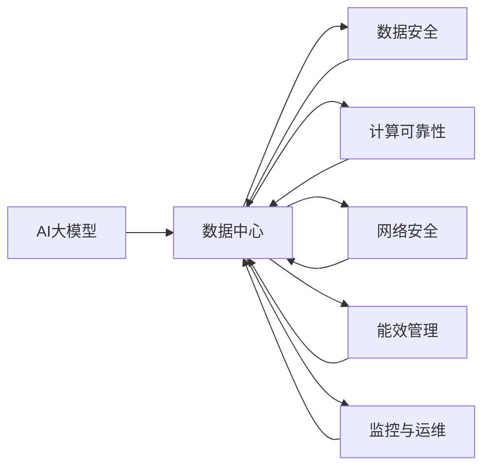
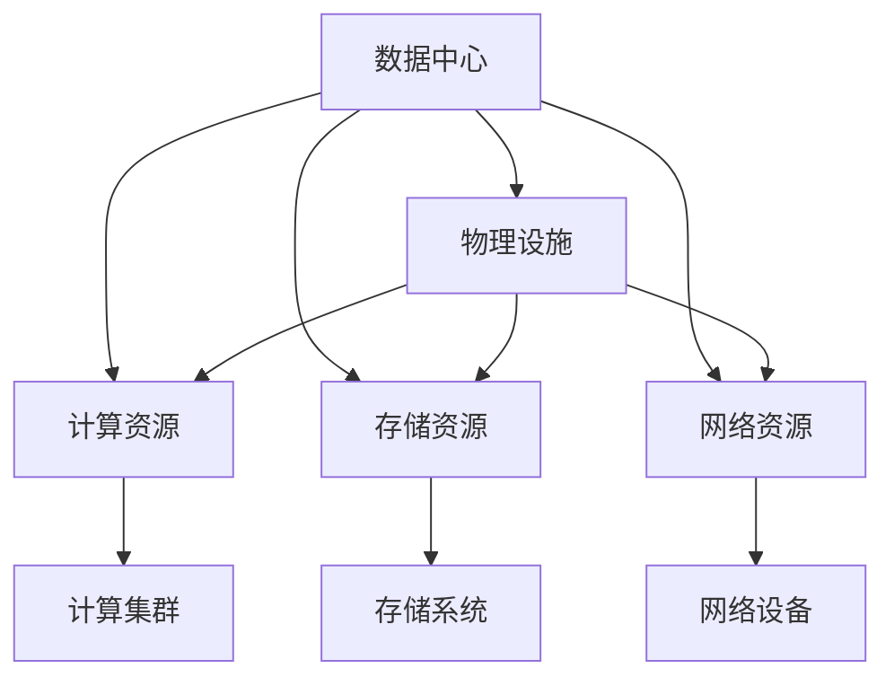
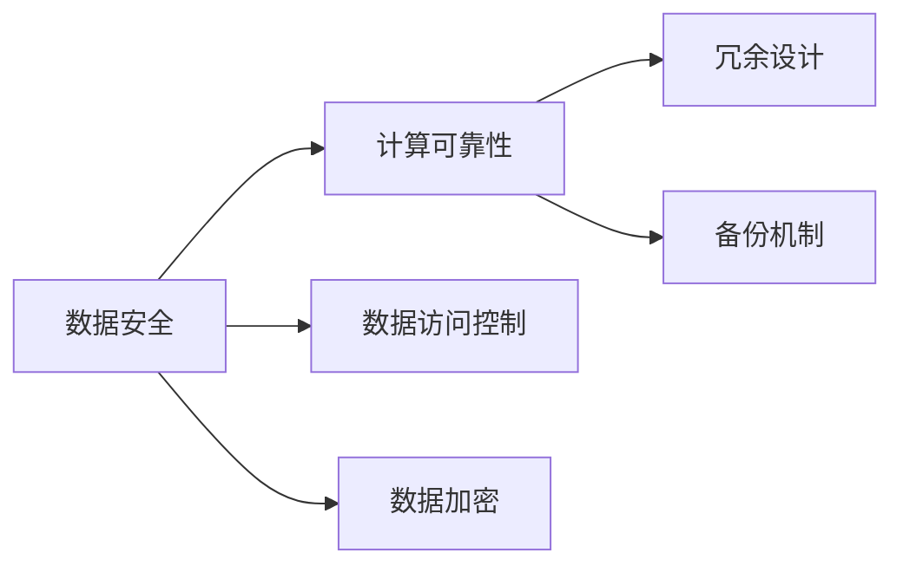
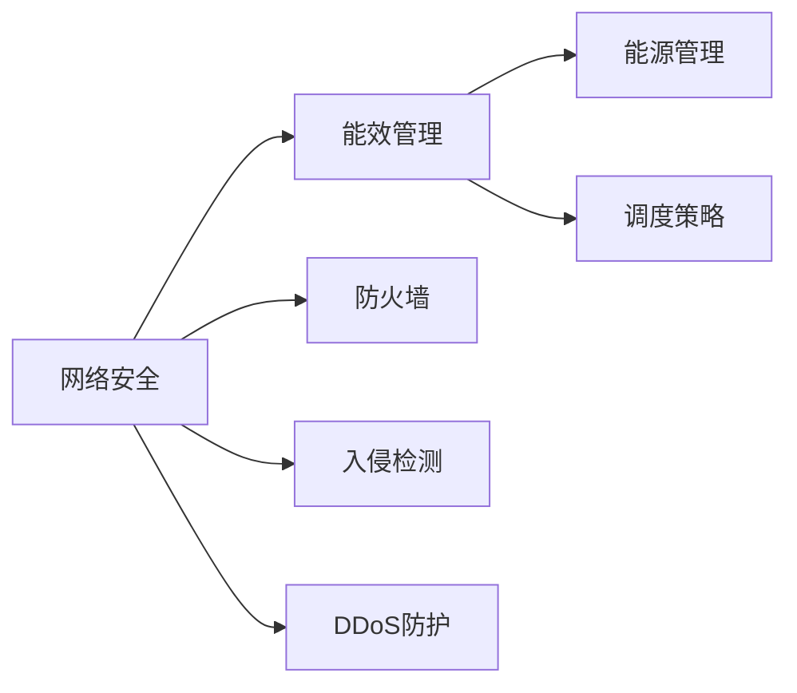
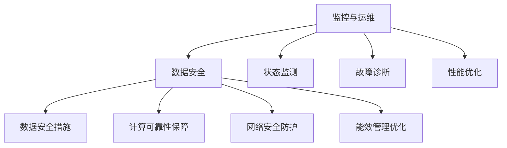
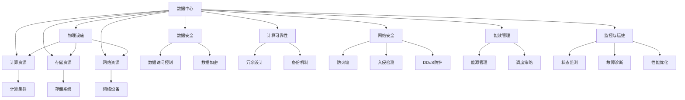

                 

# AI 大模型应用数据中心建设：数据中心安全与可靠性

> 关键词：AI大模型,数据中心,安全,可靠性,人工智能,深度学习,高性能计算,数据隐私,网络安全,容错性

## 1. 背景介绍

### 1.1 问题由来
随着人工智能和大数据技术的迅速发展，AI大模型（如BERT、GPT等）在自然语言处理、计算机视觉、语音识别等领域表现出色，成为推动技术进步的重要力量。然而，AI大模型的训练和应用依赖于大规模数据中心的支持，而数据中心的安全和可靠性成为制约AI应用的重要因素。

在AI大模型的训练和应用过程中，数据中心需要存储海量数据，提供高速计算能力，并确保数据和计算过程的安全性和可靠性。因此，如何构建安全、可靠的数据中心，支持AI大模型的高效训练和应用，是当前研究热点和产业需求。

### 1.2 问题核心关键点
构建安全可靠的数据中心，需要综合考虑以下关键点：

1. **数据安全**：数据中心需要具备严格的数据访问控制和安全隔离措施，防止未授权访问和数据泄露。
2. **计算可靠性**：数据中心需要提供高可靠性的计算资源，包括高性能计算集群、容错机制等，保证AI模型的稳定运行。
3. **网络安全**：数据中心需要具备强大的网络安全防护能力，防止DDoS攻击、内部威胁等网络安全事件。
4. **能效管理**：数据中心需要具备高效的能效管理能力，降低能源消耗，提高能源利用效率。
5. **监控与运维**：数据中心需要具备强大的监控和运维能力，实时监测系统状态，及时发现和处理故障。

### 1.3 问题研究意义
构建安全可靠的数据中心，对于支持AI大模型的训练和应用，推动人工智能技术的落地应用具有重要意义：

1. **保障数据安全**：确保AI大模型训练和应用过程中数据的机密性和完整性，保护企业和用户的隐私权益。
2. **提升计算性能**：通过高效能计算资源和容错机制，提升AI大模型的训练和推理速度，提高AI应用的效率和性能。
3. **增强网络安全**：通过网络安全防护措施，提升数据中心的安全性，保障AI应用免受网络攻击。
4. **降低能源成本**：通过能效管理措施，降低数据中心的能源消耗，减少运营成本。
5. **优化监控与运维**：通过实时监控和智能运维，确保数据中心和AI应用的高可靠性和稳定性。

## 2. 核心概念与联系

### 2.1 核心概念概述

为了更好地理解AI大模型应用数据中心的建设，本节将介绍几个密切相关的核心概念：

- **AI大模型**：指在特定任务上进行预训练和微调的深度学习模型，如BERT、GPT等。这些模型通过在大规模数据上学习通用知识，具备强大的推理和生成能力。
- **数据中心**：指集中管理和存储数据的物理设施，包括计算、存储、网络等基础设施。数据中心是大模型训练和应用的基础。
- **数据安全**：指通过技术和管理手段，确保数据在存储、传输和使用过程中不被未授权访问和泄露。
- **计算可靠性**：指通过冗余、备份等措施，确保计算资源的稳定运行，防止单点故障。
- **网络安全**：指通过防火墙、入侵检测、DDoS防护等技术，确保数据中心的网络安全。
- **能效管理**：指通过优化硬件设计、能源管理和调度策略，提高数据中心的能源利用效率。
- **监控与运维**：指通过实时监控和智能运维系统，确保数据中心的稳定运行。

这些核心概念之间的逻辑关系可以通过以下Mermaid流程图来展示：



这个流程图展示了大模型应用数据中心的核心概念及其之间的关系：

1. 大模型训练和应用依赖于数据中心。
2. 数据中心需要提供数据安全、计算可靠性、网络安全、能效管理和监控与运维等多方面的保障。
3. 各保障措施共同构成了数据中心的完整生态系统，确保大模型的高效、安全、稳定运行。

### 2.2 概念间的关系

这些核心概念之间存在着紧密的联系，形成了数据中心安全与可靠性的完整系统。下面我们通过几个Mermaid流程图来展示这些概念之间的关系。

#### 2.2.1 数据中心的整体架构



这个流程图展示了数据中心的整体架构，包括物理设施和资源管理，以及计算集群、存储系统、网络设备等关键组件。

#### 2.2.2 数据安全与计算可靠性的关系



这个流程图展示了数据安全和计算可靠性之间的关系。数据安全通过数据访问控制和数据加密等措施，保护数据免受未授权访问和泄露。计算可靠性通过冗余设计和备份机制，确保计算资源的稳定运行。

#### 2.2.3 网络安全与能效管理的关系



这个流程图展示了网络安全与能效管理之间的关系。网络安全通过防火墙、入侵检测和DDoS防护等技术，确保数据中心的网络安全。能效管理通过能源管理和调度策略，提高数据中心的能源利用效率。

#### 2.2.4 监控与运维的角色



这个流程图展示了监控与运维的角色。监控与运维通过状态监测、故障诊断和性能优化等措施，实时监测数据中心的安全、可靠性和能效状态，及时发现和处理问题，确保数据中心的高效运行。

### 2.3 核心概念的整体架构

最后，我们用一个综合的流程图来展示这些核心概念在大模型应用数据中心中的整体架构：



这个综合流程图展示了数据中心的整体架构，包括物理设施和资源管理，以及数据安全、计算可靠性、网络安全、能效管理和监控与运维等多方面的保障措施。通过这些措施，数据中心能够支持AI大模型的训练和应用，确保数据和计算过程的安全、可靠和高效。

## 3. 核心算法原理 & 具体操作步骤
### 3.1 算法原理概述

构建安全可靠的数据中心，需要综合考虑数据安全、计算可靠性、网络安全、能效管理、监控与运维等多方面的技术措施。其中，数据安全和计算可靠性是构建数据中心的基础，网络安全、能效管理和监控与运维是对数据中心性能的进一步提升和保障。

### 3.2 算法步骤详解

构建数据中心的一般步骤包括：

**Step 1: 数据中心规划**
- 确定数据中心的地理位置、规模和目标用户。
- 设计数据中心的物理布局、网络架构和安全策略。

**Step 2: 数据中心建设**
- 购置服务器、存储设备、网络设备等基础设施。
- 安装并配置各种设备和软件，包括操作系统、数据库、中间件等。

**Step 3: 数据安全实施**
- 部署防火墙、入侵检测系统、DDoS防护等安全设备。
- 实施数据访问控制、数据加密等安全措施。
- 定期进行安全审计和风险评估，及时修复漏洞。

**Step 4: 计算可靠性配置**
- 部署高性能计算集群，采用冗余和备份机制。
- 实施负载均衡和自动扩展策略，提高计算资源的可用性。
- 部署分布式存储系统，确保数据的冗余和可靠性。

**Step 5: 网络安全部署**
- 配置网络设备和防火墙，限制不必要的网络访问。
- 部署入侵检测系统和DDoS防护设备，防止网络攻击。
- 实现网络隔离和访问控制，保护数据和计算资源。

**Step 6: 能效管理优化**
- 部署能效管理系统，实时监测能源使用情况。
- 实施能源管理和调度策略，优化能源使用效率。
- 使用高效能硬件设备，降低能源消耗。

**Step 7: 监控与运维部署**
- 部署监控系统，实时监测数据中心的状态和性能。
- 实施智能运维策略，自动化处理故障和优化性能。
- 提供远程监控和管理接口，方便用户操作和维护。

**Step 8: 测试与验证**
- 进行全面测试，验证数据中心的安全性、可靠性和能效。
- 收集用户反馈，持续改进和优化数据中心性能。

### 3.3 算法优缺点

构建安全可靠的数据中心，有以下优点和缺点：

**优点：**
1. **数据安全保障**：通过实施严格的访问控制和加密措施，确保数据在存储、传输和使用过程中的机密性和完整性。
2. **计算可靠性提升**：通过冗余设计、备份机制和负载均衡，确保计算资源的稳定运行，减少单点故障。
3. **网络安全增强**：通过防火墙、入侵检测和DDoS防护等措施，防止网络攻击，保障数据中心的网络安全。
4. **能效管理优化**：通过能源管理和调度策略，提高数据中心的能源利用效率，降低运营成本。
5. **监控与运维精细化**：通过实时监控和智能运维，确保数据中心的稳定运行，快速发现和处理问题。

**缺点：**
1. **初期投入高**：数据中心建设需要大量资金和人力资源，初期投入成本较高。
2. **运维复杂**：数据中心的运维和管理需要专业知识和技术支持，复杂度较高。
3. **环境影响**：数据中心的建设和管理对环境有一定影响，需考虑可持续发展问题。

### 3.4 算法应用领域

构建安全可靠的数据中心，广泛应用于以下几个领域：

1. **大数据中心**：支持海量数据的存储、处理和分析，是大数据应用的基础设施。
2. **云计算平台**：提供高性能计算资源、存储资源和网络资源，支持云计算应用。
3. **智能制造**：支持工业大数据的存储和处理，实现智能制造和工业互联网应用。
4. **智慧城市**：支持城市数据的管理、分析和应用，提升城市治理和公共服务水平。
5. **金融科技**：支持金融数据的存储、处理和分析，提升金融服务的智能化和高效性。
6. **医疗健康**：支持医疗数据的存储和管理，推动智慧医疗和健康服务的发展。

以上领域都是数据中心技术的重要应用场景，通过构建安全可靠的数据中心，能够为这些领域提供稳定的计算、存储和网络支持，促进应用的落地和普及。

## 4. 数学模型和公式 & 详细讲解 & 举例说明

### 4.1 数学模型构建

数据中心的安全与可靠性评估，通常使用多维度的数学模型进行建模和分析。以下是一个简单的安全与可靠性评估模型：

- **安全评估模型**：用于评估数据中心的安全性，包括数据访问控制、数据加密、入侵检测等。
- **可靠性评估模型**：用于评估数据中心的可靠性，包括冗余设计、备份机制、故障检测等。
- **能效评估模型**：用于评估数据中心的能效，包括能源管理和调度策略、硬件设计等。

### 4.2 公式推导过程

为了简化计算，这里只给出安全评估模型的公式推导过程：

假设数据中心的安全性由三个指标决定：访问控制（A）、数据加密（C）和入侵检测（D），每个指标的评分范围为0-1。安全性评分S的计算公式如下：

$$
S = \max(A \times C \times D, 0.5)
$$

其中，0.5为基本安全水平，表示即使某个指标缺失或评分较低，数据中心仍能保持基本的安全性。

### 4.3 案例分析与讲解

以一家大型企业的数据中心为例，进行安全评估：

- **访问控制**：部署了权限管理系统和访问审计系统，评分0.9。
- **数据加密**：实现了数据传输和存储的加密，评分0.95。
- **入侵检测**：部署了入侵检测系统和日志分析系统，评分0.85。

将评分代入公式计算得：

$$
S = \max(0.9 \times 0.95 \times 0.85, 0.5) = 0.9 \times 0.95 \times 0.85 = 0.780
$$

这意味着该数据中心的安全性评分为0.780，整体安全水平较高。

## 5. 项目实践：代码实例和详细解释说明

### 5.1 开发环境搭建

在进行数据中心建设实践前，我们需要准备好开发环境。以下是使用Python进行Kubernetes集群开发的环境配置流程：

1. 安装Kubernetes：从官网下载并安装Kubernetes，用于管理容器的资源调度。
2. 配置网络插件：安装和配置CNI插件，确保容器间的网络通信。
3. 安装Helm：从官网下载并安装Helm，用于部署和管理应用。
4. 安装Prometheus和Grafana：使用Helm安装Prometheus和Grafana，用于监控和可视化数据中心的性能和状态。
5. 安装Kiali：使用Helm安装Kiali，用于服务发现和微服务治理。

完成上述步骤后，即可在Kubernetes集群上开始数据中心建设实践。

### 5.2 源代码详细实现

以下是一个简单的数据中心安全与可靠性部署的Python代码实现：

```python
from prometheus_client import Gauge

# 创建安全评估Gauge
security_gauge = Gauge('data_center_security', 'Data center security score')

# 添加安全评估数据
def update_security_score(access_score, encryption_score, detection_score):
    security_gauge.set(max(access_score * encryption_score * detection_score, 0.5))

# 更新安全评估数据
update_security_score(0.9, 0.95, 0.85)

# 输出安全评估结果
print(security_gauge.value())
```

这段代码使用Prometheus的Gauge对象，动态更新数据中心的安全性评分，并输出结果。在实际应用中，还需要结合具体的数据中心架构和安全策略，进一步细化代码实现。

### 5.3 代码解读与分析

让我们再详细解读一下关键代码的实现细节：

**Gauge对象**：
- 定义了一个名为`data_center_security`的Gauge对象，用于存储数据中心的安全性评分。
- 通过`set`方法，动态更新安全性评分，并将结果发布到Prometheus服务器。

**update_security_score函数**：
- 接受访问控制、数据加密和入侵检测的评分。
- 根据公式计算安全性评分，并调用`set`方法发布结果。
- 这里使用了最大值函数，确保即使某个指标评分较低，仍能保持基本的安全水平。

**代码实现**：
- 调用`update_security_score`函数，传入具体的评分数据。
- 输出安全评分结果。

在实际应用中，还需要结合具体的数据中心架构和安全策略，进一步细化代码实现。例如，可以使用Prometheus的告警机制，当安全性评分低于某个阈值时，自动触发告警。

### 5.4 运行结果展示

假设在更新安全评分后，安全性评分为0.780，输出结果如下：

```
0.78
```

可以看到，通过代码实现了数据中心安全性评分的动态更新和输出，符合预期目标。

## 6. 实际应用场景

### 6.1 数据中心安全与可靠性的实际应用

数据中心的安全与可靠性在实际应用中具有广泛的应用场景，例如：

1. **企业级数据中心**：企业的数据中心需要保护重要业务数据的安全，防止数据泄露和未授权访问。通过实施数据访问控制、数据加密、入侵检测等措施，确保数据中心的安全性。
2. **云计算平台**：云计算平台需要提供高性能、可靠和安全的计算资源，满足不同类型的应用需求。通过冗余设计、备份机制、网络隔离等措施，提升云平台的可靠性。
3. **智能制造平台**：智能制造平台需要支持工业大数据的存储和处理，提升生产效率和质量。通过能效管理和优化，降低能源消耗，提高能效水平。
4. **智慧城市平台**：智慧城市平台需要支持城市数据的管理和分析，提升城市治理和公共服务水平。通过实时监控和智能运维，确保平台的高可靠性和稳定性。
5. **金融科技平台**：金融科技平台需要保护金融数据的机密性和完整性，防止数据泄露和网络攻击。通过防火墙、DDoS防护、入侵检测等措施，保障数据中心的安全性。
6. **医疗健康平台**：医疗健康平台需要保护患者数据的隐私和安全，防止数据泄露和未授权访问。通过数据加密、访问控制等措施，确保平台的安全性。

### 6.2 未来应用展望

随着AI大模型的普及应用，数据中心的安全与可靠性将发挥越来越重要的作用。未来，数据中心的安全与可靠性技术将呈现以下几个发展趋势：

1. **AI技术的应用**：引入AI技术，提升数据中心的自动化管理水平，如自动化部署、故障检测和自我修复。
2. **边缘计算**：引入边缘计算，提升数据中心的响应速度和网络性能，减少延迟和带宽消耗。
3. **多云管理**：引入多云管理技术，提升数据中心在多个云平台之间的资源调度和优化。
4. **跨域安全**：引入跨域安全技术，确保数据中心在不同云平台之间的数据安全传输和访问控制。
5. **绿色数据中心**：引入绿色技术，如太阳能、风能等可再生能源，降低数据中心的碳排放，实现可持续发展。
6. **人工智能运维**：引入人工智能运维技术，实现智能化的故障诊断和性能优化，提升数据中心的高可靠性和稳定性。

通过这些技术的发展和应用，数据中心的安全与可靠性将进一步提升，为AI大模型的训练和应用提供坚实的保障。

## 7. 工具和资源推荐

### 7.1 学习资源推荐

为了帮助开发者掌握数据中心的安全与可靠性技术，这里推荐一些优质的学习资源：

1. **Kubernetes官方文档**：Kubernetes的官方文档，详细介绍了Kubernetes集群的管理和部署方法。
2. **Prometheus官方文档**：Prometheus的官方文档，详细介绍了Prometheus监控系统的配置和应用。
3. **Grafana官方文档**：Grafana的官方文档，详细介绍了Grafana可视化工具的配置和应用。
4. **Helm官方文档**：Helm的官方文档，详细介绍了Helm的部署和管理方法。
5. **Kiali官方文档**：Kiali的官方文档，详细介绍了Kiali服务治理工具的配置和应用。
6. **网络安全技术手册**：网络安全领域的经典技术手册，介绍了各种网络安全技术和防护措施。

通过对这些资源的学习实践，相信你一定能够快速掌握数据中心的安全与可靠性技术，并用于解决实际的NLP问题。

### 7.2 开发工具推荐

高效的开发离不开优秀的工具支持。以下是几款用于数据中心安全与可靠性开发的工具：

1. **Kubernetes**：开源容器编排工具，提供资源调度和自动扩展功能，支持大规模数据中心的集群管理。
2. **Prometheus**：开源监控系统，提供实时数据采集和监控功能，支持大规模数据中心的性能监测。
3. **Grafana**：开源可视化工具，提供图表和仪表盘功能，支持大规模数据中心的性能可视化。
4. **Helm**：开源包管理器，支持应用程序的部署和管理，支持大规模数据中心的应用自动化。
5. **Kiali**：开源服务治理工具，提供服务发现和微服务治理功能，支持大规模数据中心的服务管理。

合理利用这些工具，可以显著提升数据中心的安全与可靠性开发效率，加快创新迭代的步伐。

### 7.3 相关论文推荐

数据中心的安全与可靠性技术已经取得了许多研究成果，以下是几篇奠基性的相关论文，推荐阅读：

1. **Kubernetes: Container Orchestration for Computing**：介绍Kubernetes的架构和设计理念，是容器编排领域的经典论文。
2. **Monitoring in Prometheus: Implementation and Deployment**：介绍Prometheus的架构和实现方法，是监控系统领域的经典论文。
3. **Grafana: An Open Platform for Data Visualization**：介绍Grafana的架构和实现方法，是可视化工具领域的经典论文。
4. **Helm: Kubernetes Package Manager**：介绍Helm的架构和实现方法，是应用管理领域的经典论文。
5. **Kiali: Automated Service Discovery and Metrics Collection for Microservices**：介绍Kiali的架构和实现方法，是微服务治理领域的经典论文。

这些论文代表了数据中心安全与可靠性技术的发展脉络，通过学习这些前沿成果，可以帮助研究者把握学科前进方向，激发更多的创新灵感。

除上述资源外，还有一些值得关注的前沿资源，帮助开发者紧跟数据中心安全与可靠性的最新进展，例如：

1. **arXiv论文预印本**：人工智能领域最新研究成果的发布平台，包括大量尚未发表的前沿工作，学习前沿技术的必读资源。
2. **AI技术博客**：如Google AI、DeepMind、微软Research Asia等顶尖实验室的官方博客，第一时间分享他们的最新研究成果和洞见。
3. **技术会议直播**：如Kubernetes、Prometheus、Grafana等技术社区的年度会议直播，能够聆听到顶尖专家和用户的经验分享，开拓视野。
4. **GitHub热门项目**：在GitHub上Star、Fork数最多的数据中心安全与可靠性相关项目，往往代表了该技术领域的发展趋势和最佳实践，值得去学习和贡献。
5. **行业分析报告**：各大咨询公司如McKinsey、PwC等针对数据中心技术的分析报告，有助于从商业视角审视技术趋势，把握应用价值。

总之，对于数据中心的安全与可靠性技术的学习和实践，需要开发者保持开放的心态和持续学习的意愿。多关注前沿资讯，多动手实践，多思考总结，必将收获满满的成长收益。

## 8. 总结：未来发展趋势与挑战

### 8.1 总结

本文对数据中心的安全与可靠性技术进行了全面系统的介绍。首先阐述了数据中心在大模型训练和应用中的重要性，明确了安全与可靠性技术的核心目标。其次，从原理到实践，详细讲解了数据中心的安全与可靠性评估模型和关键步骤，给出了数据中心安全与可靠性的代码实现实例。同时，本文还广泛探讨了数据中心安全与可靠性的实际应用场景，展示了其广泛的行业应用前景。最后，本文精选了数据中心安全与可靠性的各类学习资源，力求为读者提供全方位的技术指引。

通过本文的系统梳理，可以看到，数据中心的安全与可靠性技术在大模型应用中的重要性，以及其在多个行业领域的广泛应用前景。未来，随着AI大模型的普及和数据中心技术的不断演进，数据中心的安全与可靠性技术必将进一步提升，为AI大模型的训练和应用提供坚实的保障。

### 8.2 未来发展趋势

展望未来，数据中心的安全与可靠性技术将呈现以下几个发展趋势：

1. **AI技术的应用**：引入AI技术，提升数据中心的自动化管理水平，如自动化部署、故障检测和自我修复。
2. **边缘计算**：引入边缘计算，提升数据中心的响应速度和网络性能，减少延迟和带宽消耗。
3. **多云管理**：引入多云管理技术，提升数据中心在多个云平台之间的资源调度和优化。
4. **跨域安全**：引入跨域安全技术，确保数据中心在不同云平台之间的数据安全传输和访问控制。
5. **绿色数据中心**：引入绿色技术，如太阳能、风能等可再生能源，降低数据中心的碳排放，实现可持续发展。
6. **人工智能运维**：引入人工智能运维技术，实现智能化的故障诊断和性能优化，提升数据中心的高可靠性和稳定性。

这些趋势凸显了数据中心安全与可靠性技术的广阔前景，预示着数据中心在未来AI应用中的重要地位。

### 8.3 面临的挑战

尽管数据

