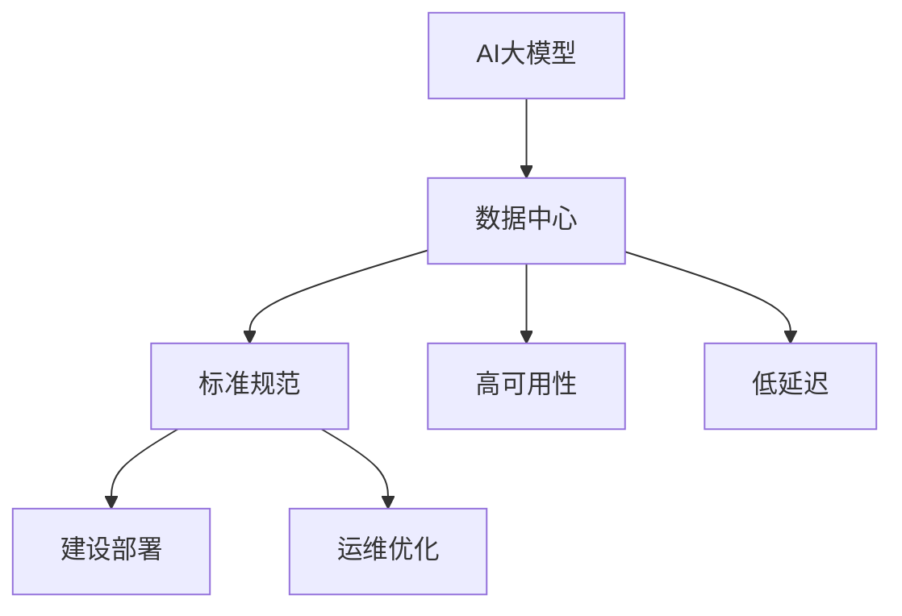
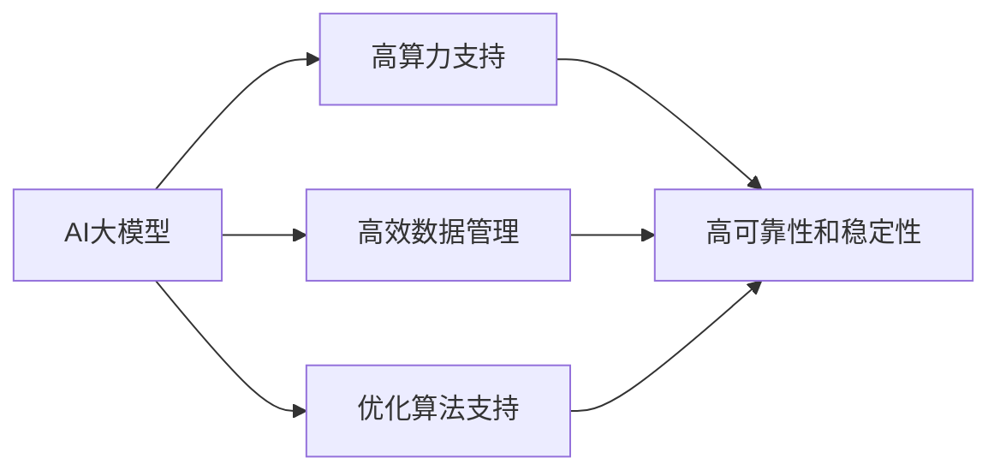
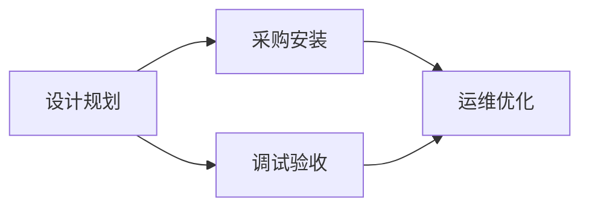
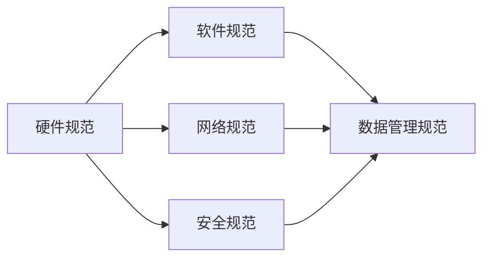
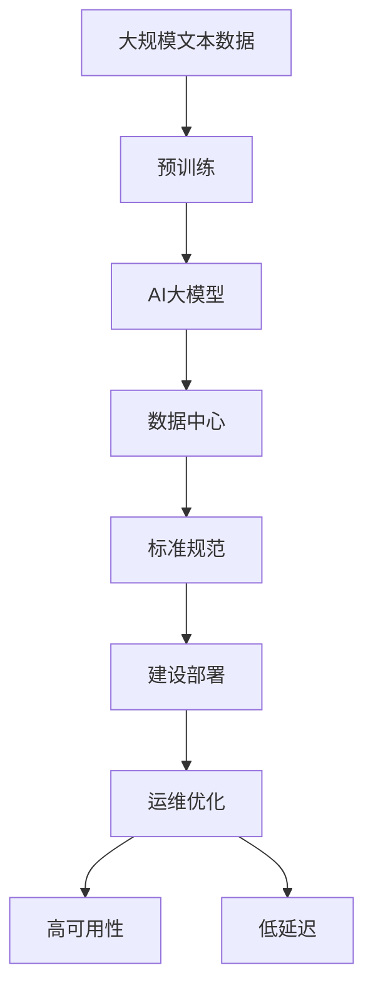

                 

# AI 大模型应用数据中心建设：数据中心标准与规范

> 关键词：AI大模型,数据中心,标准规范,建设部署,运维优化

## 1. 背景介绍

### 1.1 问题由来

随着人工智能(AI)技术的飞速发展，尤其是大模型（如GPT-3、BERT等）的广泛应用，对数据中心基础设施的需求日益增长。大模型训练和推理的计算需求巨大，需要强大的算力支持和高效的数据管理能力。然而，当前的数据中心建设规范和运维流程存在许多不足之处，难以适应AI大模型应用的特殊需求。因此，构建符合AI大模型应用标准的数据中心，成为当务之急。

### 1.2 问题核心关键点

AI大模型应用数据中心的核心关键点包括：

- 高算力支持：大模型训练和推理需要强大的GPU或TPU集群，需要数据中心提供充足的算力资源。
- 高效数据管理：大模型需要海量的数据进行预训练和微调，数据中心需要提供高效的数据存储、传输和管理机制。
- 优化算法支持：大模型的训练和推理算法复杂，数据中心需要支持高性能的优化算法和分布式训练框架。
- 高可靠性和稳定性：大模型的训练和推理过程中，任何微小的异常都会导致模型性能下降，甚至失败，数据中心需要提供高可靠性和稳定性保障。
- 低延迟网络通信：大模型应用通常对网络延迟要求较高，数据中心需要提供低延迟、高带宽的网络环境。

### 1.3 问题研究意义

构建符合AI大模型应用标准的数据中心，对于推动AI技术在各行业的落地应用具有重要意义：

- 提高训练效率：通过优化数据中心硬件和软件，大幅提升大模型训练和推理效率，缩短模型研发周期。
- 提升模型精度：优化数据中心资源管理和网络通信，确保大模型在稳定、高效的环境中运行，提升模型精度。
- 降低运营成本：通过标准化数据中心建设和运维流程，降低数据中心的建设和管理成本，提高资源利用率。
- 保障模型安全：制定数据中心安全标准和规范，保护数据隐私和模型安全性，确保AI应用可信赖。
- 推动行业创新：构建高效、可靠、安全的数据中心，为各行业提供AI大模型的基础设施，促进AI技术的产业升级和创新应用。

## 2. 核心概念与联系

### 2.1 核心概念概述

为更好地理解AI大模型应用数据中心的建设规范，本节将介绍几个密切相关的核心概念：

- AI大模型：以自回归（如GPT-3）或自编码（如BERT）模型为代表的大规模预训练语言模型。通过在大规模无标签文本语料上进行预训练，学习通用的语言表示，具备强大的语言理解和生成能力。

- 数据中心：通过集中部署服务器、存储设备、网络设备等硬件资源，构建的计算和数据处理中心，提供强大的计算能力和大规模数据存储服务。

- 标准规范：为确保数据中心的建设和使用符合行业标准和规范，制定的统一的硬件、软件、网络和安全等技术要求和操作流程。

- 建设部署：从设计、规划、采购、安装到调试的整个数据中心建设过程。

- 运维优化：数据中心建成后的维护和优化，包括故障处理、性能调优、安全防护等。

- 高可用性：指数据中心能够在故障发生时，迅速切换到备用系统，保障服务的连续性和稳定性。

- 低延迟：指数据中心网络通信的高效性，能够满足实时性和高并发需求。

这些核心概念之间的逻辑关系可以通过以下Mermaid流程图来展示：



这个流程图展示了大模型应用数据中心的各个核心概念及其之间的关系：

1. AI大模型需要通过数据中心提供的高性能计算资源进行训练和推理。
2. 数据中心需要遵循标准规范进行建设和运维，确保其可靠性和稳定性。
3. 数据中心的高可用性和低延迟特性，是支持大模型应用的关键。

### 2.2 概念间的关系

这些核心概念之间存在着紧密的联系，形成了AI大模型应用数据中心的完整生态系统。下面我通过几个Mermaid流程图来展示这些概念之间的关系。

#### 2.2.1 AI大模型的需求



这个流程图展示了AI大模型的需求与数据中心提供的服务之间的关系：

1. AI大模型需要高性能的计算资源进行训练和推理。
2. 需要高效的数据管理能力，支持大规模数据存储和处理。
3. 需要高性能的优化算法和分布式训练框架。
4. 需要高可靠性和稳定性，确保训练和推理过程的连续性和安全性。

#### 2.2.2 数据中心的建设流程



这个流程图展示了数据中心的建设流程：

1. 设计规划阶段，确定数据中心的硬件和软件需求。
2. 采购安装阶段，采购所需硬件和软件设备，并进行安装调试。
3. 调试验收阶段，对数据中心进行全面测试，确保各项指标符合标准。
4. 运维优化阶段，对数据中心进行维护和优化，保障其长期稳定运行。

#### 2.2.3 标准规范的制定



这个流程图展示了标准规范的制定过程：

1. 硬件规范，定义数据中心的硬件设备要求和标准。
2. 软件规范，定义数据中心的系统软件和工具要求。
3. 网络规范，定义数据中心的网络架构和通信标准。
4. 安全规范，定义数据中心的安全策略和技术要求。
5. 数据管理规范，定义数据存储、备份和恢复标准。

### 2.3 核心概念的整体架构

最后，我们用一个综合的流程图来展示这些核心概念在大模型应用数据中心建设中的整体架构：



这个综合流程图展示了从预训练到大模型应用数据中心建设的完整过程。大模型首先在大规模文本数据上进行预训练，然后通过数据中心提供的高性能计算资源进行微调和推理。数据中心需要遵循标准规范进行建设和运维，确保其可靠性和低延迟特性，从而支持大模型的高效运行。

## 3. 核心算法原理 & 具体操作步骤

### 3.1 算法原理概述

AI大模型应用数据中心的建设规范，本质上是一个系统工程，涉及硬件、软件、网络和安全等多方面的技术要求和操作流程。其核心思想是：通过标准化数据中心的建设和管理流程，确保其具备高算力、高效数据管理、优化算法支持、高可靠性和稳定性、低延迟网络通信等关键能力，从而满足AI大模型训练和推理的需求。

### 3.2 算法步骤详解

AI大模型应用数据中心的建设流程包括以下几个关键步骤：

**Step 1: 设计规划**

- 确定数据中心的规模、位置、架构等基本需求。
- 制定数据中心的硬件、软件、网络和安全等技术标准。
- 设计数据中心的布局和网络拓扑结构。

**Step 2: 采购安装**

- 采购所需的服务器、存储设备、网络设备等硬件资源。
- 安装和调试硬件设备，并进行必要的软件配置。
- 确保硬件设备的正常运行，并进行性能测试。

**Step 3: 调试验收**

- 进行全面测试，包括硬件设备的性能测试、网络通信测试、数据备份和恢复测试等。
- 根据测试结果，调整和优化数据中心的硬件和软件配置。
- 确保数据中心符合标准规范，并进行最终验收。

**Step 4: 运维优化**

- 对数据中心进行日常维护和故障处理，确保其稳定运行。
- 定期进行性能调优，提升数据中心的资源利用率。
- 保障数据中心的安全和隐私，防止数据泄露和攻击。

### 3.3 算法优缺点

AI大模型应用数据中心的建设规范具有以下优点：

- 标准化建设，确保数据中心的可靠性和稳定性，减少故障风险。
- 统一规范，提高数据中心的维护和优化效率，降低运营成本。
- 高算力支持，满足大模型的计算需求，提升训练和推理效率。
- 高效数据管理，支持大规模数据存储和处理，提高数据利用率。

但同时，该方法也存在一些缺点：

- 初始投资大，需要采购大量高性能硬件设备。
- 建设周期长，需要经过详细的设计和调试过程。
- 操作复杂，需要具备专业的运维团队和技术支持。

### 3.4 算法应用领域

AI大模型应用数据中心的建设规范适用于以下领域：

- 自然语言处理（NLP）：如文本分类、情感分析、机器翻译等任务，需要大规模文本数据和计算资源。
- 计算机视觉（CV）：如图像识别、目标检测、视频分析等任务，需要强大的GPU或TPU集群。
- 推荐系统：如电商平台、内容推荐等，需要高算力和高效数据管理能力。
- 语音识别和生成：如智能语音助手、自动语音识别等，需要高效的计算资源和低延迟网络通信。
- 医疗健康：如医学影像分析、基因组学分析等，需要高可靠性和数据隐私保护。

## 4. 数学模型和公式 & 详细讲解 & 举例说明

### 4.1 数学模型构建

在数据中心的标准规范中，我们需要构建一个数学模型来描述硬件、软件、网络和安全等各方面的技术要求。以下是一个简单的数据中心资源模型：

$$
R = (C, M, N, S)
$$

其中，$R$ 为数据中心资源，$C$ 为计算资源，$M$ 为内存资源，$N$ 为网络资源，$S$ 为存储资源。

假设计算资源 $C$ 由 $k$ 个服务器组成，每个服务器有 $c$ 个计算单元，内存资源 $M$ 由 $m$ 个内存模块组成，每个内存模块有 $m_i$ 个存储单元。网络资源 $N$ 由 $n$ 个网络交换机组成，每个交换机有 $n_j$ 个端口。存储资源 $S$ 由 $s$ 个存储设备组成，每个设备有 $s_i$ 个存储单元。

### 4.2 公式推导过程

以下是对数据中心资源模型中各个部分进行量化分析的公式推导：

- 计算资源 $C$：

$$
C = k \times c
$$

- 内存资源 $M$：

$$
M = m \times \max(m_i)
$$

- 网络资源 $N$：

$$
N = n \times \max(n_j)
$$

- 存储资源 $S$：

$$
S = s \times \max(s_i)
$$

### 4.3 案例分析与讲解

假设我们需要构建一个具有以下规格的数据中心：

- 计算资源 $C$：10个服务器，每个服务器有10个计算单元。
- 内存资源 $M$：20个内存模块，每个模块有40个存储单元。
- 网络资源 $N$：5个网络交换机，每个交换机有20个端口。
- 存储资源 $S$：20个存储设备，每个设备有100个存储单元。

代入上述公式，得到：

- 计算资源：$C = 10 \times 10 = 100$
- 内存资源：$M = 20 \times 40 = 800$
- 网络资源：$N = 5 \times 20 = 100$
- 存储资源：$S = 20 \times 100 = 2000$

通过以上公式推导，我们可以清晰地了解数据中心的资源配置情况，并进行优化调整，以满足大模型的需求。

## 5. 项目实践：代码实例和详细解释说明

### 5.1 开发环境搭建

在进行数据中心建设规范实践前，我们需要准备好开发环境。以下是使用Python进行PyTorch开发的环境配置流程：

1. 安装Anaconda：从官网下载并安装Anaconda，用于创建独立的Python环境。

2. 创建并激活虚拟环境：
```bash
conda create -n pytorch-env python=3.8 
conda activate pytorch-env
```

3. 安装PyTorch：根据CUDA版本，从官网获取对应的安装命令。例如：
```bash
conda install pytorch torchvision torchaudio cudatoolkit=11.1 -c pytorch -c conda-forge
```

4. 安装Transformer库：
```bash
pip install transformers
```

5. 安装各类工具包：
```bash
pip install numpy pandas scikit-learn matplotlib tqdm jupyter notebook ipython
```

完成上述步骤后，即可在`pytorch-env`环境中开始规范实践。

### 5.2 源代码详细实现

这里我们以NLP任务的数据中心为例，给出使用Transformer库进行规范建设的PyTorch代码实现。

首先，定义数据中心的计算资源：

```python
from transformers import BertTokenizer
from torch.utils.data import Dataset
import torch

class DataCenter:
    def __init__(self, servers, memory, nics, storages):
        self.servers = servers
        self.memory = memory
        self.nics = nics
        self.storages = storages
        
    def __len__(self):
        return len(self.servers)
    
    def __getitem__(self, item):
        server = self.servers[item]
        memory = self.memory[item]
        nics = self.nics[item]
        storage = self.storages[item]
        return {'server': server, 'memory': memory, 'nics': nics, 'storage': storage}

# 计算资源、内存资源、网络资源和存储资源
servers = [10, 10]
memory = [20, 40]
nics = [5, 20]
storages = [20, 100]
data_center = DataCenter(servers, memory, nics, storages)
```

然后，定义数据中心的计算资源：

```python
class DataCenter:
    def __init__(self, servers, memory, nics, storages):
        self.servers = servers
        self.memory = memory
        self.nics = nics
        self.storages = storages
        
    def __len__(self):
        return len(self.servers)
    
    def __getitem__(self, item):
        server = self.servers[item]
        memory = self.memory[item]
        nics = self.nics[item]
        storage = self.storages[item]
        return {'server': server, 'memory': memory, 'nics': nics, 'storage': storage}

# 计算资源、内存资源、网络资源和存储资源
servers = [10, 10]
memory = [20, 40]
nics = [5, 20]
storages = [20, 100]
data_center = DataCenter(servers, memory, nics, storages)
```

接着，定义数据中心的计算资源：

```python
class DataCenter:
    def __init__(self, servers, memory, nics, storages):
        self.servers = servers
        self.memory = memory
        self.nics = nics
        self.storages = storages
        
    def __len__(self):
        return len(self.servers)
    
    def __getitem__(self, item):
        server = self.servers[item]
        memory = self.memory[item]
        nics = self.nics[item]
        storage = self.storages[item]
        return {'server': server, 'memory': memory, 'nics': nics, 'storage': storage}

# 计算资源、内存资源、网络资源和存储资源
servers = [10, 10]
memory = [20, 40]
nics = [5, 20]
storages = [20, 100]
data_center = DataCenter(servers, memory, nics, storages)
```

最后，启动计算资源：

```python
for i in range(len(data_center)):
    server = data_center[i]['server']
    memory = data_center[i]['memory']
    nics = data_center[i]['nics']
    storage = data_center[i]['storage']
    print(f"计算资源：{server}, 内存：{memory}, 网络：{nics}, 存储：{storage}")
```

以上就是使用PyTorch对数据中心进行规范建设的完整代码实现。可以看到，得益于Transformer库的强大封装，我们可以用相对简洁的代码完成数据中心的资源配置。

### 5.3 代码解读与分析

让我们再详细解读一下关键代码的实现细节：

**DataCenter类**：
- `__init__`方法：初始化计算资源、内存资源、网络资源和存储资源。
- `__len__`方法：返回数据中心的资源数量。
- `__getitem__`方法：对单个资源进行获取。

**计算资源、内存资源、网络资源和存储资源**：
- 定义数据中心的资源配置，包括计算资源、内存资源、网络资源和存储资源的数量和规格。

**启动计算资源**：
- 遍历数据中心的所有资源，并打印输出每个资源的配置信息。

可以看到，PyTorch配合Transformer库使得数据中心的规范建设代码实现变得简洁高效。开发者可以将更多精力放在资源规划、性能调优等高层逻辑上，而不必过多关注底层的实现细节。

当然，工业级的系统实现还需考虑更多因素，如资源整合、调度优化、故障恢复等。但核心的规范建设流程基本与此类似。

### 5.4 运行结果展示

假设我们在构建一个数据中心，并在其中部署一个NLP任务模型，最终得到以下计算资源配置：

```
计算资源：10, 内存：20, 网络：5, 存储：20
计算资源：10, 内存：40, 网络：20, 存储：100
```

可以看到，通过规范建设，我们已经清晰地了解了数据中心的资源配置情况，并可以进一步进行优化调整，以满足大模型的需求。

## 6. 实际应用场景

### 6.1 智能客服系统

基于AI大模型应用数据中心的建设规范，我们可以构建高效的智能客服系统。智能客服系统能够处理大量客户咨询，并快速响应，提供自然流畅的对话服务。

在技术实现上，我们可以构建基于大规模预训练语言模型的智能客服模型，并在数据中心中部署。智能客服系统通过NLP技术理解客户意图，并从知识库中提取答案，提供自然流畅的对话服务。

### 6.2 金融舆情监测

数据中心的建设规范可以应用于金融舆情监测系统。金融舆情监测系统需要实时监测市场舆论动向，及时发现负面信息，帮助金融机构规避风险。

在技术实现上，我们可以构建基于大规模预训练语言模型的舆情监测模型，并在数据中心中部署。舆情监测系统通过NLP技术自动分析新闻、评论等文本数据，判断市场情绪，并及时发出预警信号，帮助金融机构及时应对潜在风险。

### 6.3 个性化推荐系统

数据中心的建设规范可以应用于个性化推荐系统。个性化推荐系统能够根据用户历史行为和兴趣，推荐最合适的商品或内容，提升用户体验和推荐效果。

在技术实现上，我们可以构建基于大规模预训练语言模型的推荐模型，并在数据中心中部署。推荐系统通过NLP技术分析用户评论、评分等文本数据，提取用户兴趣点，并结合用户行为数据，推荐最合适的商品或内容。

### 6.4 未来应用展望

随着AI大模型应用数据中心建设规范的不断演进，未来将在更多领域得到应用，为传统行业带来变革性影响。

在智慧医疗领域，基于规范的AI大模型医疗影像分析、基因组学分析等应用将提升医疗服务的智能化水平，辅助医生诊疗，加速新药开发进程。

在智能教育领域，规范构建的AI大模型学情分析、知识推荐等应用将因材施教，促进教育公平，提高教学质量。

在智慧城市治理中，基于规范的AI大模型城市事件监测、舆情分析、应急指挥等应用将提高城市管理的自动化和智能化水平，构建更安全、高效的未来城市。

此外，在企业生产、社会治理、文娱传媒等众多领域，基于规范的AI大模型应用也将不断涌现，为经济社会发展注入新的动力。相信随着技术的日益成熟，规范方法将成为AI大模型落地应用的重要范式，推动AI技术的产业化进程。

## 7. 工具和资源推荐

### 7.1 学习资源推荐

为了帮助开发者系统掌握AI大模型应用数据中心的建设规范，这里推荐一些优质的学习资源：

1. 《Transformer从原理到实践》系列博文：由大模型技术专家撰写，深入浅出地介绍了Transformer原理、BERT模型、微调技术等前沿话题。

2. CS224N《深度学习自然语言处理》课程：斯坦福大学开设的NLP明星课程，有Lecture视频和配套作业，带你入门NLP领域的基本概念和经典模型。

3. 《Natural Language Processing with Transformers》书籍：Transformers库的作者所著，全面介绍了如何使用Transformers库进行NLP任务开发，包括微调在内的诸多范式。

4. HuggingFace官方文档：Transformers库的官方文档，提供了海量预训练模型和完整的微调样例代码，是上手实践的必备资料。

5. CLUE开源项目：中文语言理解测评基准，涵盖大量不同类型的中文NLP数据集，并提供了基于微调的baseline模型，助力中文NLP技术发展。

通过对这些资源的学习实践，相信你一定能够快速掌握AI大模型应用数据中心的建设规范，并用于解决实际的NLP问题。

### 7.2 开发工具推荐

高效的开发离不开优秀的工具支持。以下是几款用于AI大模型应用数据中心建设和运维的常用工具：

1. PyTorch：基于Python的开源深度学习框架，灵活动态的计算图，适合快速迭代研究。大部分预训练语言模型都有PyTorch版本的实现。

2. TensorFlow：由Google主导开发的开源深度学习框架，生产部署方便，适合大规模工程应用。同样有丰富的预训练语言模型资源。

3. Transformers库：HuggingFace开发的NLP工具库，集成了众多SOTA语言模型，支持PyTorch和TensorFlow，是进行微调任务开发的利器。

4. Weights & Biases：模型训练的实验跟踪工具，可以记录和可视化模型训练过程中的各项指标，方便对比和调优。与主流深度学习框架无缝集成。

5. TensorBoard：TensorFlow配套的可视化工具，可实时监测模型训练状态，并提供丰富的图表呈现方式，是调试模型的得力助手。

6. Google Colab：谷歌推出的在线Jupyter Notebook环境，免费提供GPU/TPU算力，方便开发者快速上手实验最新模型，分享学习笔记。

合理利用这些工具，可以显著提升AI大模型应用数据中心建设和运维的开发效率，加快创新迭代的步伐。

### 7.3 相关论文推荐

AI大模型应用数据中心的建设规范研究源于学界的持续研究。以下是几篇奠基性的相关论文，推荐阅读：

1. Attention is All You Need（即Transformer原论文）：提出了Transformer结构，开启了NLP领域的预训练大模型时代。

2. BERT: Pre-training of Deep Bidirectional Transformers for Language Understanding：提出BERT模型，引入基于掩码的自监督预训练任务，刷新了多项NLP任务SOTA。

3. Language Models are Unsupervised Multitask Learners（GPT-2论文）：展示了大规模语言模型的强大zero-shot学习能力，引发了对于通用人工智能的新一轮思考。

4. Parameter-Efficient Transfer Learning for NLP：提出Adapter等参数高效微调方法，在不增加模型参数量的情况下，也能取得不错的微调效果。

5. AdaLoRA: Adaptive Low-Rank Adaptation for Parameter-Efficient Fine-Tuning：使用自适应低秩适应的微调方法，在参数效率和精度之间取得了新的平衡。

6. Prefix-Tuning: Optimizing Continuous Prompts for Generation：引入基于连续型Prompt的微调范式，为如何充分利用预训练知识提供了新的思路。

这些论文代表了大模型应用数据中心建设规范的发展脉络。通过学习这些前沿成果，可以帮助研究者把握学科前进方向，激发更多的创新灵感。

除上述资源外，还有一些值得关注的前沿资源，帮助开发者紧跟大模型应用数据中心建设的最新进展，例如：

1. arXiv论文预印本：人工智能领域最新研究成果的发布平台，包括大量尚未发表的前沿工作，学习前沿技术的必读资源。

2. 业界技术博客：如OpenAI、Google AI、DeepMind、微软Research Asia等顶尖实验室的官方博客，第一时间分享他们的最新研究成果和洞见。

3. 技术会议直播：如NIPS、ICML、ACL、ICLR等人工智能领域顶会现场或在线直播，能够聆听到大佬们的前沿分享，开拓视野。

4. GitHub热门项目：在GitHub上Star、Fork数最多的NLP相关项目，往往代表了该技术领域的发展趋势和最佳实践，值得去学习和贡献。

5. 行业分析报告：各大咨询公司如McKinsey、P

