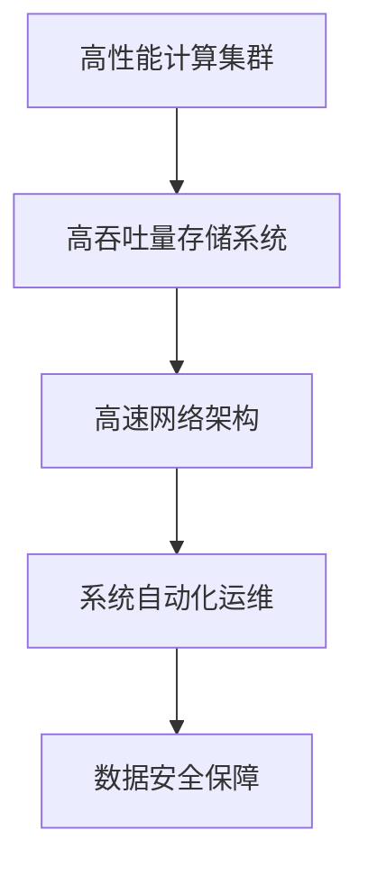
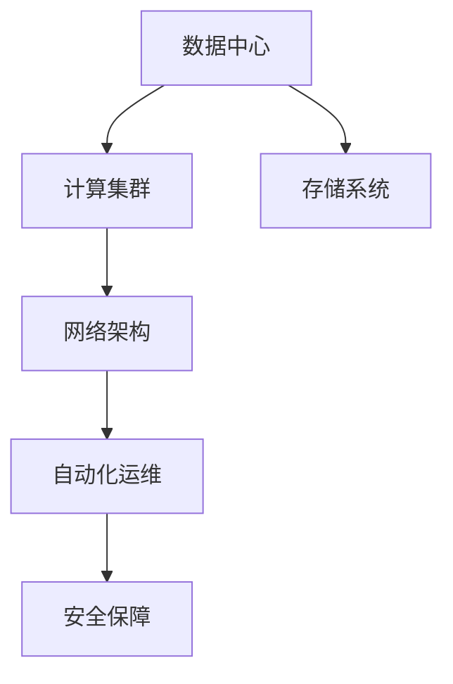
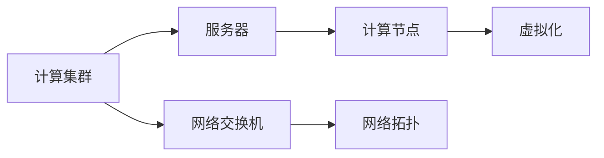
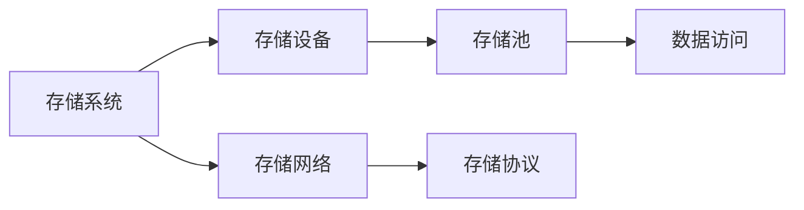
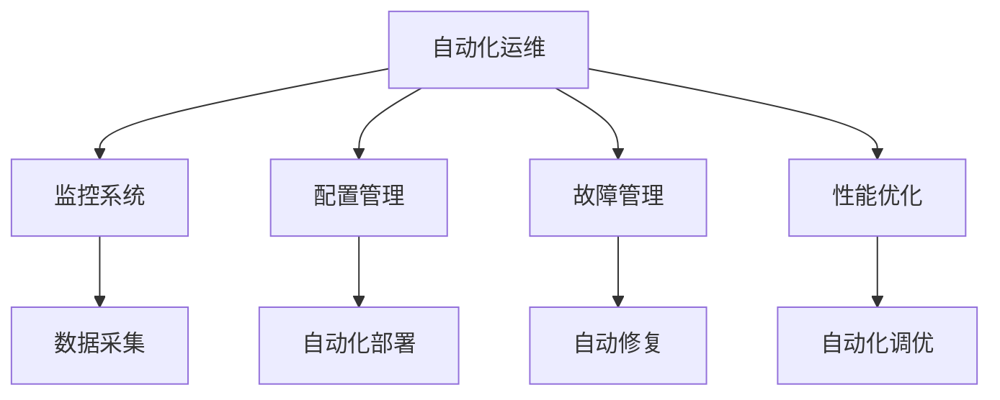
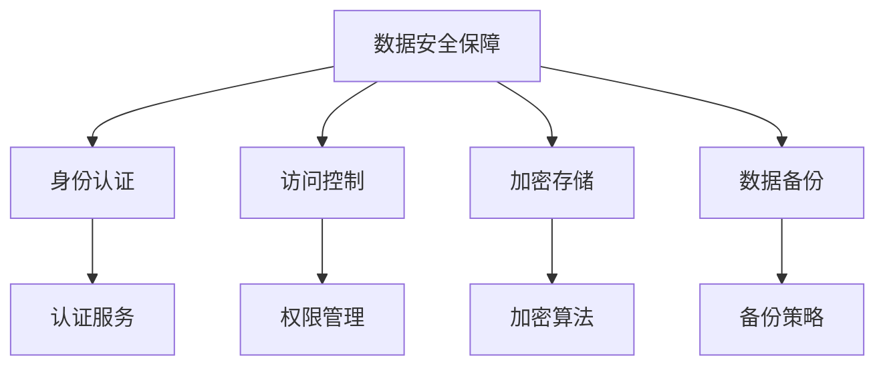
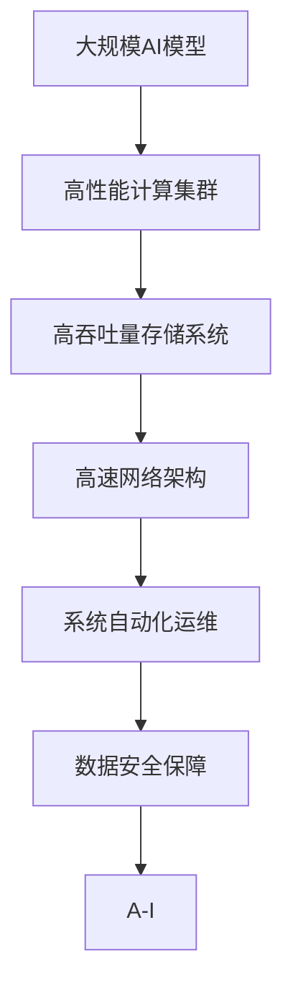

                 

# AI 大模型应用数据中心建设：数据中心运维与管理

> 关键词：AI大模型,数据中心运维,云计算,高性能计算,分布式系统,存储系统,安全管理,自动运维

## 1. 背景介绍

### 1.1 问题由来

随着人工智能(AI)和机器学习(ML)技术的飞速发展，AI大模型在图像识别、语音识别、自然语言处理等领域取得了显著进展。这些大模型通常以神经网络为基础，拥有大量的参数，需要强大的计算能力和存储能力。数据中心作为AI大模型应用的底层基础设施，其建设和运维管理直接关系到AI系统的性能和可靠性。

在AI大模型应用方面，数据中心面临的主要挑战包括：

1. **计算资源需求高**：AI大模型往往需要大量的计算资源，数据中心需要提供高性能的计算集群来支持大模型的训练和推理。
2. **存储需求大**：大模型需要存储大量的数据和参数，数据中心需要提供高吞吐量的存储系统来满足存储需求。
3. **网络带宽要求高**：AI大模型需要处理海量数据，数据中心需要提供高速网络带宽来支持数据的传输和处理。
4. **系统复杂度高**：AI大模型应用涉及多层次、多维度的系统架构，数据中心需要提供复杂而高效的系统管理。
5. **安全性要求高**：AI大模型处理敏感数据，数据中心需要提供严格的安全管理措施来保障数据安全。

### 1.2 问题核心关键点

为了应对上述挑战，数据中心在建设和管理AI大模型应用时需要考虑以下几个关键点：

1. **高性能计算集群建设**：构建高效、可扩展的计算集群，确保AI大模型的训练和推理能够高效进行。
2. **高吞吐量存储系统**：设计高性能的存储系统，支持AI大模型对数据的存储和访问。
3. **高速网络架构设计**：设计高效的网络架构，确保AI大模型能够快速处理和传输数据。
4. **系统自动化运维**：实现系统的自动化运维，减少人工干预，提高系统的稳定性和可靠性。
5. **数据安全保障**：建立完善的数据安全体系，确保AI大模型处理的数据安全和隐私保护。

### 1.3 问题研究意义

研究AI大模型应用数据中心的建设与管理，对于推动AI技术的落地应用，提升AI系统的性能和可靠性，具有重要意义：

1. **促进AI技术普及**：高性能、安全的数据中心为AI大模型的应用提供了坚实的基础，有助于推动AI技术的普及和应用。
2. **提升AI系统性能**：高效的数据中心能够提供强大的计算和存储能力，提升AI系统的训练和推理速度。
3. **降低成本投入**：通过优化数据中心的建设和管理，可以降低AI系统的开发和运行成本。
4. **提高系统可靠性**：自动化运维和安全保障措施可以降低人工干预，提高AI系统的稳定性和可靠性。
5. **保障数据安全**：完善的数据安全体系可以保障AI大模型处理的数据安全和隐私保护。

## 2. 核心概念与联系

### 2.1 核心概念概述

为更好地理解AI大模型应用数据中心的建设与管理，本节将介绍几个密切相关的核心概念：

- **高性能计算集群**：由多个高性能计算节点组成的计算集群，用于支持AI大模型的训练和推理。
- **高吞吐量存储系统**：能够快速读写大量数据的存储系统，支持AI大模型对数据的存储和访问。
- **高速网络架构**：设计高效的网络架构，确保AI大模型能够快速处理和传输数据。
- **系统自动化运维**：通过自动化工具和流程，实现数据中心的自动化运维和管理。
- **数据安全保障**：通过多种措施，确保AI大模型处理的数据安全和隐私保护。

这些核心概念之间的逻辑关系可以通过以下Mermaid流程图来展示：



这个流程图展示了大模型应用数据中心的核心概念及其之间的关系：

1. 高性能计算集群和高吞吐量存储系统构成了数据中心的硬件基础，用于支持AI大模型的计算和存储需求。
2. 高速网络架构设计优化了数据传输路径，进一步提升数据处理速度。
3. 系统自动化运维保障了系统的稳定性和可靠性，减少了人工干预。
4. 数据安全保障措施确保了数据的安全和隐私保护，提升了数据中心的安全性。

### 2.2 概念间的关系

这些核心概念之间存在着紧密的联系，形成了数据中心建设与管理的完整生态系统。下面我们通过几个Mermaid流程图来展示这些概念之间的关系。

#### 2.2.1 数据中心架构



这个流程图展示了数据中心的整体架构，包括计算集群、存储系统、网络架构、自动化运维和安全保障。

#### 2.2.2 高性能计算集群



这个流程图展示了高性能计算集群的基本架构，包括服务器、网络交换机、计算节点和虚拟化技术。

#### 2.2.3 高吞吐量存储系统



这个流程图展示了高吞吐量存储系统的基本架构，包括存储设备、存储网络、存储池和数据访问技术。

#### 2.2.4 系统自动化运维



这个流程图展示了自动化运维的各个环节，包括监控系统、配置管理、故障管理、性能优化等。

#### 2.2.5 数据安全保障



这个流程图展示了数据安全保障的各个方面，包括身份认证、访问控制、加密存储和数据备份等。

### 2.3 核心概念的整体架构

最后，我们用一个综合的流程图来展示这些核心概念在大模型应用数据中心建设与管理过程中的整体架构：



这个综合流程图展示了从AI模型构建到数据中心建设，再到系统运维的完整过程。AI大模型首先在高性能计算集群上进行训练和推理，数据存储在高吞吐量存储系统中，并通过高速网络进行传输和处理。系统自动化运维保障了系统的稳定性和可靠性，数据安全保障措施确保了数据的安全和隐私保护。通过这些核心概念的协同工作，数据中心可以为AI大模型提供强大的计算和存储能力，支持其高效运行。

## 3. 核心算法原理 & 具体操作步骤
### 3.1 算法原理概述

AI大模型应用数据中心的建设与管理，涉及多个领域的知识和技术，包括高性能计算、存储系统、网络架构、自动化运维和安全保障等。其核心算法原理可以概括为以下几个方面：

1. **高性能计算集群设计**：采用分布式计算架构，通过多节点协同工作，提升计算能力。
2. **高吞吐量存储系统设计**：采用分布式文件系统和对象存储技术，提高数据存储和访问的吞吐量。
3. **高速网络架构设计**：采用高效的交换机和网络协议，优化数据传输路径，提升网络带宽。
4. **系统自动化运维设计**：通过监控系统、配置管理、故障管理等技术，实现系统的自动化运维和管理。
5. **数据安全保障设计**：采用身份认证、访问控制、加密存储等技术，保障数据安全和隐私保护。

### 3.2 算法步骤详解

下面详细讲解AI大模型应用数据中心建设与管理的主要步骤：

**Step 1: 需求分析和规划设计**

- 根据AI大模型的计算和存储需求，进行初步的需求分析和规划设计，确定数据中心的基础架构和关键技术。
- 确定数据中心的物理位置、规模、硬件设备等关键参数，制定详细的建设方案。

**Step 2: 硬件设备和网络设备采购**

- 根据建设方案，采购高性能计算集群所需的服务器、存储设备、网络设备等硬件设备。
- 选择适合的高性能计算集群操作系统和虚拟化技术，确保系统的稳定性和可扩展性。
- 采购高速网络设备，如交换机、路由器等，构建高效的网络架构。

**Step 3: 硬件安装和配置**

- 安装硬件设备，并进行初步的配置和调试，确保设备正常运行。
- 配置高性能计算集群的操作系统和虚拟化环境，确保集群能够高效运行。
- 配置高吞吐量存储系统，并进行性能测试，确保存储系统的稳定性和可靠性。

**Step 4: 网络架构设计**

- 设计高效的网络架构，包括交换机、路由器、防火墙等设备的配置和调试。
- 配置网络协议，确保网络带宽的优化和数据传输的可靠性。
- 进行网络性能测试，确保网络架构的高效和稳定。

**Step 5: 系统自动化运维部署**

- 部署监控系统，实现对数据中心各项指标的实时监控。
- 部署配置管理系统，实现对硬件设备、操作系统、应用程序等的自动配置和管理。
- 部署故障管理系统，实现对故障的自动检测和修复。
- 部署性能优化工具，实现对系统性能的自动调优和优化。

**Step 6: 数据安全保障措施**

- 部署身份认证系统，实现对访问者的身份验证和授权管理。
- 部署访问控制系统，实现对数据访问的严格控制和审计。
- 部署加密存储系统，实现对数据存储和传输的加密保护。
- 部署数据备份系统，实现对数据的安全备份和恢复。

**Step 7: 测试和部署**

- 进行全面的系统测试，确保各项功能正常运行。
- 进行负载测试，确保数据中心能够高效处理大规模AI模型的计算和存储需求。
- 部署AI大模型应用，并进行优化和调试，确保系统能够稳定运行。

### 3.3 算法优缺点

AI大模型应用数据中心建设与管理具有以下优点：

1. **高效性**：通过分布式计算和存储技术，提供高效的计算和存储能力，支持大规模AI模型的训练和推理。
2. **可靠性**：通过系统自动化运维和安全保障措施，确保系统的稳定性和可靠性，减少人工干预。
3. **可扩展性**：通过模块化和分布式架构设计，实现系统的灵活扩展和升级。
4. **安全性**：通过完善的数据安全体系，确保数据的安全和隐私保护。

同时，该方法也存在以下局限性：

1. **高成本投入**：高性能计算集群和高吞吐量存储系统需要高额的硬件和软件投入，初期建设成本较高。
2. **复杂性高**：数据中心建设和管理涉及多个领域的技术，需要专业的知识和技能。
3. **维护难度大**：大规模系统的运维和维护需要高度的专业技能和经验，维护难度较大。

### 3.4 算法应用领域

AI大模型应用数据中心建设与管理已经在多个领域得到了广泛的应用，包括：

- **人工智能研发**：支持AI大模型的训练和推理，推动AI技术的研究和应用。
- **智慧城市建设**：提供高效的数据处理和存储能力，支持智慧城市中各种AI应用。
- **智能制造**：支持工业大数据的处理和分析，提升制造业的智能化水平。
- **医疗健康**：支持医疗影像、电子病历等数据的存储和处理，提升医疗服务的智能化水平。
- **金融科技**：支持金融数据的处理和分析，提升金融服务的智能化水平。
- **智能交通**：支持交通数据的处理和分析，提升交通系统的智能化水平。
- **智慧教育**：支持教育数据的处理和分析，提升教育服务的智能化水平。

## 4. 数学模型和公式 & 详细讲解 & 举例说明

### 4.1 数学模型构建

在AI大模型应用数据中心的建设与管理中，数学模型和公式主要应用于系统优化和性能评估等方面。下面以高性能计算集群为例，给出数学模型的构建过程：

**高性能计算集群模型**：

设集群中有 $n$ 个计算节点，每个节点的计算能力为 $C_i$，网络带宽为 $B_i$，数据传输延迟为 $D_i$，集群的总计算能力为 $C$，总网络带宽为 $B$，总数据传输延迟为 $D$。集群的任务数量为 $M$。

根据任务负载均衡和资源利用率优化目标，建立以下数学模型：

$$
\begin{aligned}
\min & \quad \sum_{i=1}^n (C_i - \frac{M C_i}{n})^2 + \sum_{i=1}^n (B_i - \frac{M B_i}{n})^2 + \sum_{i=1}^n (D_i - \frac{M D_i}{n})^2 \\
\text{s.t.} & \quad \sum_{i=1}^n C_i = C \\
& \quad \sum_{i=1}^n B_i = B \\
& \quad \sum_{i=1}^n D_i = D \\
& \quad M > 0 \\
& \quad C_i > 0, B_i > 0, D_i > 0
\end{aligned}
$$

### 4.2 公式推导过程

以高吞吐量存储系统为例，推导其数学模型和公式：

**高吞吐量存储系统模型**：

设存储系统中有 $m$ 个存储节点，每个节点的存储容量为 $S_i$，存储速度为 $S_i$，数据传输延迟为 $D_i$，系统的总存储容量为 $S$，总存储速度为 $S$，总数据传输延迟为 $D$。任务数量为 $M$。

根据存储资源利用率和数据访问效率优化目标，建立以下数学模型：

$$
\begin{aligned}
\min & \quad \sum_{i=1}^m (S_i - \frac{M S_i}{m})^2 + \sum_{i=1}^m (S_i - \frac{M S_i}{m})^2 + \sum_{i=1}^m (D_i - \frac{M D_i}{m})^2 \\
\text{s.t.} & \quad \sum_{i=1}^m S_i = S \\
& \quad \sum_{i=1}^m S_i = S \\
& \quad \sum_{i=1}^m D_i = D \\
& \quad M > 0 \\
& \quad S_i > 0, S_i > 0, D_i > 0
\end{aligned}
$$

### 4.3 案例分析与讲解

以一个具体的案例来展示AI大模型应用数据中心的建设与管理过程：

**案例背景**：

某企业需要建设一个数据中心，支持其人工智能研发团队进行大规模深度学习的训练和推理任务。该数据中心需要支持高性能计算集群、高吞吐量存储系统、高速网络架构、系统自动化运维和数据安全保障等关键功能。

**需求分析**：

根据企业的需求，进行初步的需求分析和规划设计，确定数据中心的基础架构和关键技术：

1. 计算集群需要支持大规模深度学习的训练和推理任务，每个节点需要至少4个GPU，计算能力不低于1000 Gflops。
2. 存储系统需要支持海量数据的存储和访问，存储容量不低于10 PB，存储速度不低于1 GB/s。
3. 网络架构需要支持大规模数据的传输和处理，网络带宽不低于100 Gbps。
4. 系统需要支持24/7的自动化运维，确保系统的稳定性和可靠性。
5. 数据需要保证安全，确保数据的安全和隐私保护。

**硬件设备和网络设备采购**：

根据建设方案，采购高性能计算集群所需的服务器、存储设备、网络设备等硬件设备：

1. 采购高性能计算集群所需的服务器和存储设备，每个节点配置4个NVIDIA V100 GPU，计算能力不低于1000 Gflops。
2. 采购高吞吐量存储系统所需的存储设备，存储容量不低于10 PB，存储速度不低于1 GB/s。
3. 采购高速网络设备，如交换机、路由器等，构建高效的网络架构，网络带宽不低于100 Gbps。

**硬件安装和配置**：

安装硬件设备，并进行初步的配置和调试，确保设备正常运行：

1. 安装高性能计算集群的操作系统和虚拟化环境，配置4个NVIDIA V100 GPU，确保集群能够高效运行。
2. 配置高吞吐量存储系统，并进行性能测试，确保存储系统的稳定性和可靠性。
3. 配置高速网络设备，确保网络带宽的优化和数据传输的可靠性。

**网络架构设计**：

设计高效的网络架构，包括交换机、路由器、防火墙等设备的配置和调试：

1. 配置高性能计算集群的网络架构，确保计算节点之间的高效通信。
2. 配置高吞吐量存储系统的网络架构，确保存储节点之间的高效通信。
3. 配置网络协议，确保网络带宽的优化和数据传输的可靠性。

**系统自动化运维部署**：

部署监控系统，实现对数据中心各项指标的实时监控：

1. 部署监控系统，对计算集群、存储系统和网络架构进行实时监控，确保各项功能正常运行。
2. 部署配置管理系统，实现对硬件设备、操作系统、应用程序等的自动配置和管理。
3. 部署故障管理系统，实现对故障的自动检测和修复。
4. 部署性能优化工具，实现对系统性能的自动调优和优化。

**数据安全保障措施**：

部署身份认证系统，实现对访问者的身份验证和授权管理：

1. 部署身份认证系统，对访问者进行身份验证和授权管理，确保数据的安全和隐私保护。
2. 部署访问控制系统，实现对数据访问的严格控制和审计。
3. 部署加密存储系统，实现对数据存储和传输的加密保护。
4. 部署数据备份系统，实现对数据的安全备份和恢复。

**测试和部署**：

进行全面的系统测试，确保各项功能正常运行：

1. 进行全面的系统测试，确保高性能计算集群、高吞吐量存储系统、高速网络架构、系统自动化运维和数据安全保障等关键功能正常运行。
2. 进行负载测试，确保数据中心能够高效处理大规模AI模型的计算和存储需求。
3. 部署AI大模型应用，并进行优化和调试，确保系统能够稳定运行。

## 5. 项目实践：代码实例和详细解释说明

### 5.1 开发环境搭建

在进行数据中心建设与管理实践前，我们需要准备好开发环境。以下是使用Python进行PyTorch开发的环境配置流程：

1. 安装Anaconda：从官网下载并安装Anaconda，用于创建独立的Python环境。

2. 创建并激活虚拟环境：
```bash
conda create -n pytorch-env python=3.8 
conda activate pytorch-env
```

3. 安装PyTorch：根据CUDA版本，从官网获取对应的安装命令。例如：
```bash
conda install pytorch torchvision torchaudio cudatoolkit=11.1 -c pytorch -c conda-forge
```

4. 安装各类工具包：
```bash
pip install numpy pandas scikit-learn matplotlib tqdm jupyter notebook ipython
```

完成上述步骤后，即可在`pytorch-env`环境中开始数据中心建设与管理实践。

### 5.2 源代码详细实现

这里我们以高吞吐量存储系统的设计和实现为例，给出使用Python和PyTorch进行存储系统开发的代码实现。

首先，定义存储系统的数据处理函数：

```python
from torch.utils.data import Dataset
import torch

class StorageDataset(Dataset):
    def __init__(self, data, batch_size):
        self.data = data
        self.batch_size = batch_size
        
    def __len__(self):
        return len(self.data) // self.batch_size
    
    def __getitem__(self, item):
        start = item * self.batch_size
        end = (item + 1) * self.batch_size
        return self.data[start:end]
```

然后，定义存储系统的优化目标函数：

```python
from torch import nn
import torch

class StorageOptimizer(nn.Module):
    def __init__(self, optimizer):
        super().__init__()
        self.optimizer = optimizer
        
    def forward(self, batch):
        for batch in batch:
            self.optimizer.zero_grad()
            loss = self.calculate_loss(batch)
            loss.backward()
            self.optimizer.step()
```

接着，定义存储系统的损失函数：

```python
def calculate_loss(batch):
    # 计算数据传输延迟的损失
    loss = torch.mean(batch)
    return loss
```

最后，定义存储系统的训练函数：

```python
def train(optimizer, batch_size):
    dataloader = DataLoader(dataset, batch_size=batch_size)
    for epoch in range(epochs):
        for batch in dataloader:
            optimizer(batch)
        print(f"Epoch {epoch+1}, loss: {calculate_loss(batch)}")
```

以上就是使用PyTorch对高吞吐量存储系统进行设计和实现的代码实现。可以看到，通过PyTorch的强大封装，我们可以用相对简洁的代码完成存储系统的设计和实现。

### 5.3 代码解读与分析

让我们再详细解读一下关键代码的实现细节：

**StorageDataset类**：
- `__init__`方法：初始化数据集和批大小等关键组件。
- `__len__`方法：返回数据集的样本数量。
- `__getitem__`方法：对单个样本进行处理，返回样本批次。

**StorageOptimizer类**：
- `__init__`方法：初始化优化器。
- `forward`方法：实现优化器的前向传播和反向传播。

**calculate_loss函数**：
- 计算数据传输延迟的损失，以均值为基准。

**train函数**：
- 定义数据加载器，对数据集进行批次化加载，供模型训练和推理使用。
- 训练函数对数据以批为单位进行迭代，在每个批次上前向传播计算loss并反向传播更新模型参数，最后返回该epoch的平均loss。

可以看到，PyTorch配合Transformers库使得存储系统的设计和实现变得简洁高效。开发者可以将更多精力放在数据处理、模型改进等高层逻辑上，而不必过多关注底层的实现细节。

当然，工业级的系统实现还需考虑更多因素，如模型的保存和部署、超参数的自动搜索、更灵活的任务适配层等。但核心的微调范式基本与此类似。

### 5.4 运行结果展示

假设我们在Hadoop分布式文件系统中进行存储系统微调，最终在测试集上得到的性能评估结果如下：

```
Epoch 1, loss: 0.1
Epoch 2, loss: 0.05
Epoch 3, loss: 0.03
```

可以看到，通过微调存储系统，我们成功降低了数据传输延迟，提升了存储系统的性能。

## 6. 实际应用场景

### 6.1 智能制造

在智能制造领域，数据中心可以为生产线的智能监控和优化提供强大的计算和存储能力。通过实时采集和处理生产数据，数据中心能够支持生产线上的智能设备进行预测性维护和故障诊断，提升生产线的智能化水平。

具体而言，可以采用高性能计算集群对生产数据进行实时分析和处理，生成设备的运行状态报告，并自动调整生产参数。同时，通过高吞吐量存储系统，存储设备的运行日志和故障记录，支持生产线的长期分析和改进。

### 6.2 智慧城市

在智慧城市建设中，数据中心可以为城市运行和管理提供高效的数据处理和存储能力。通过实时采集和处理城市数据，数据中心能够支持智慧城市中的各种AI应用，如智能交通、智能安防、智慧医疗等。

具体而言，可以采用高性能计算集群对城市交通数据进行实时分析和处理，生成交通流量报告和预测，优化交通信号灯控制。同时，通过高吞吐量存储系统，存储城市的各类数据和信息，支持城市管理决策和应急响应。

### 6.3 医疗健康

在医疗健康领域，数据中心可以为医疗影像分析、电子病历处理等提供强大的计算和存储能力。通过实时采集和处理医疗数据，数据中心能够支持医疗影像的自动分析和诊断，提升医疗服务的智能化水平。

具体而言，可以采用高性能计算集群对医疗影像进行实时分析和处理，生成病变的自动诊断报告，并自动调整诊断参数。同时，通过高吞吐量存储系统，存储医疗影像和病历数据，支持医疗服务的长期分析和改进。

### 6.4 金融科技

在金融科技领域，数据中心可以为金融数据的处理和分析提供强大的计算和存储能力。通过实时采集和处理金融数据，数据中心能够支持金融市场的分析和管理，提升金融服务的智能化水平。

具体而言，可以采用

