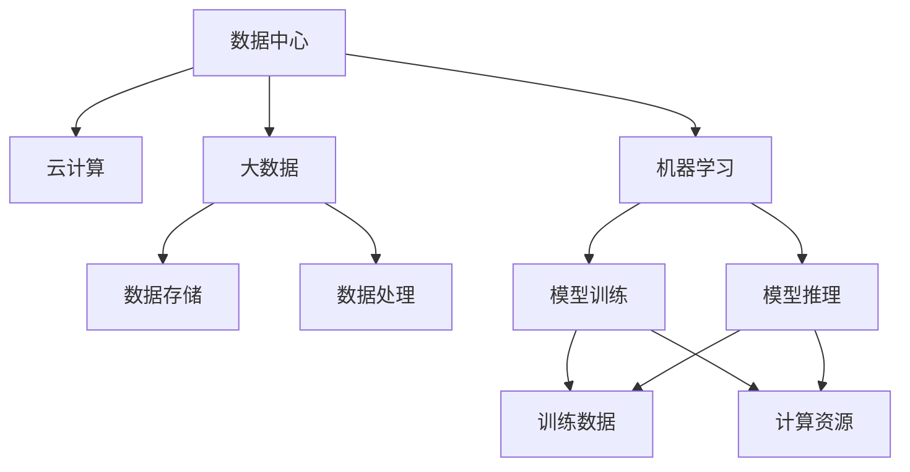
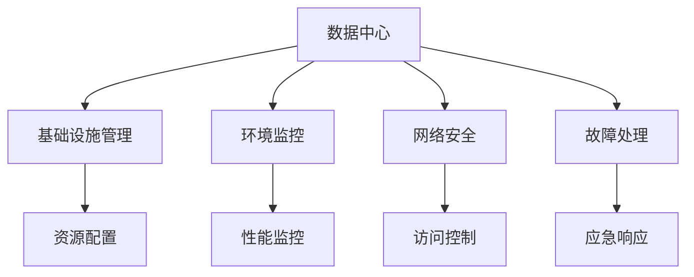
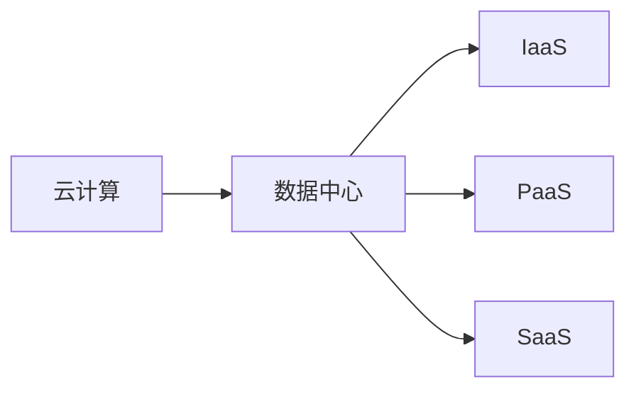
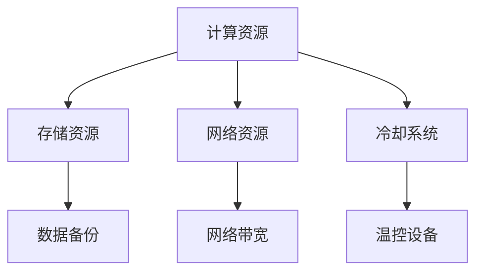
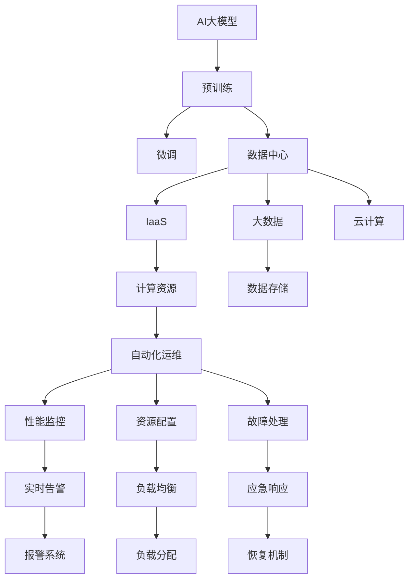

                 

# AI 大模型应用数据中心建设：数据中心运维与管理

> 关键词：AI大模型, 数据中心运维, 管理, 云计算, 大数据, 机器学习

## 1. 背景介绍

### 1.1 问题由来
在人工智能(AI)的快速发展的时代，大模型正在成为企业和组织数字化转型的核心驱动力。无论是自然语言处理(NLP)、计算机视觉(CV)、语音识别(SR)还是推荐系统，大模型的广泛应用带来了诸多机遇。然而，随着模型规模的不断增大，如何高效、安全地部署和管理这些模型成为摆在我们面前的一大难题。

### 1.2 问题核心关键点
数据中心作为AI大模型的承载基础设施，是确保AI应用顺利运行的关键环节。数据中心运维与管理是AI大模型落地应用的重要保障，涵盖基础设施管理、环境监控、网络安全、故障处理等多个方面。本文聚焦于AI大模型应用数据中心建设，探讨数据中心的运维与管理方法，并提出一系列关键解决方案。

### 1.3 问题研究意义
研究AI大模型数据中心建设，对于推动AI技术在各行业的落地应用，优化基础设施资源配置，提升AI系统的运行效率和安全性，具有重要意义：

1. 提高AI应用效率。通过科学的数据中心运维与管理，确保AI模型的高效运行，提升系统的响应速度和服务质量。
2. 保障数据安全。构建安全可靠的数据中心环境，保护数据隐私和安全，防止模型被恶意攻击或篡改。
3. 降低运维成本。优化数据中心资源配置，实现自动化运维，减少人工干预，降低运维成本和运营风险。
4. 提升服务质量。通过数据中心的持续优化和升级，提升AI应用的稳定性和可靠性，确保系统的高可用性。

## 2. 核心概念与联系

### 2.1 核心概念概述

为更好地理解数据中心运维与管理的核心概念，本节将介绍几个密切相关的核心概念：

- **数据中心(Data Center)**：集中存放并管理数据、计算资源和网络的物理设施。数据中心是AI大模型部署的基础平台，负责提供计算、存储、网络等服务。

- **云计算(Cloud Computing)**：通过互联网提供动态、可扩展的计算、存储和网络服务。云计算模式（如IaaS、PaaS、SaaS）在大模型应用中得到广泛应用。

- **大数据(Big Data)**：描述和处理海量、复杂的数据集。大模型通常依赖大数据进行预训练和微调，数据中心的存储和管理能力直接影响模型训练和推理的效率。

- **机器学习(Machine Learning)**：使计算机系统通过数据学习改进性能的技术。大模型是机器学习的重要工具，数据中心的运维与管理直接影响模型的训练和推理效果。

- **自动化运维(Automatic Operations and Maintenance)**：通过自动化工具和流程，实现对数据中心的资源配置、性能监控、故障处理等操作的自动化管理。

- **高可用性(High Availability)**：系统能够持续稳定运行，即使某部分发生故障也能够自动切换到备用系统。高可用性是大模型系统必须具备的关键特性。

- **数据隐私(Data Privacy)**：保护数据不被未授权访问、使用或披露。数据隐私保护是数据中心运维的重要考虑因素。

这些核心概念之间的逻辑关系可以通过以下Mermaid流程图来展示：



这个流程图展示了大模型应用中的关键概念及其之间的关系：

1. 数据中心通过云计算提供计算、存储、网络等服务。
2. 数据中心存储和处理大数据，为大模型的预训练和微调提供数据支持。
3. 机器学习依赖大数据和计算资源，在大模型上实现模型的训练和推理。
4. 数据中心的自动化运维和高可用性保障了系统的稳定运行。
5. 数据隐私保护是大模型应用的重要安全考虑。

### 2.2 概念间的关系

这些核心概念之间存在着紧密的联系，形成了数据中心运维与管理的完整生态系统。下面我们通过几个Mermaid流程图来展示这些概念之间的关系。

#### 2.2.1 数据中心运维与管理流程



这个流程图展示了大模型数据中心运维与管理的主要流程，包括基础设施管理、环境监控、网络安全、故障处理等环节。

#### 2.2.2 云计算与数据中心的关系



这个流程图展示了云计算与数据中心的关系，云计算提供了数据中心所需的基础设施服务，通过IaaS、PaaS、SaaS等模式，为数据中心的运维与管理提供支持。

#### 2.2.3 数据中心资源管理



这个流程图展示了数据中心的资源管理，包括计算、存储、网络、冷却等关键资源。这些资源的合理配置和管理，直接影响AI模型的训练和推理效率。

### 2.3 核心概念的整体架构

最后，我们用一个综合的流程图来展示这些核心概念在大模型数据中心运维与管理过程中的整体架构：



这个综合流程图展示了从大模型预训练到微调，再到数据中心运维与管理过程的整体架构：

1. AI大模型通过预训练和大规模数据微调，学习通用的语言表示。
2. 预训练模型部署到数据中心，并通过云计算提供服务。
3. 数据中心管理大数据和计算资源，保证模型的高效运行。
4. 数据中心的自动化运维和高可用性保障系统稳定。
5. 数据隐私保护和安全管理是大模型应用的重要保障。

## 3. 核心算法原理 & 具体操作步骤
### 3.1 算法原理概述

数据中心运维与管理的核心算法原理是基于自动化和智能化的系统管理。其核心思想是通过自动化工具和智能算法，实现对数据中心的实时监控、故障诊断、资源配置等操作的自动化处理。

形式化地，设数据中心环境为 $E$，由计算资源、存储资源、网络资源等组成，运维目标为最大化系统的可用性、效率和安全性。则运维算法可以描述为：

$$
\maximize E_{\text{avail}} + E_{\text{efficiency}} + E_{\text{security}}
$$

其中，$E_{\text{avail}}$ 为系统的可用性，$E_{\text{efficiency}}$ 为系统的效率，$E_{\text{security}}$ 为系统的安全性。

### 3.2 算法步骤详解

基于自动化和智能化的数据中心运维与管理算法，一般包括以下几个关键步骤：

**Step 1: 基础设施管理**
- 配置和管理数据中心的硬件设施，包括服务器、存储设备、网络设备等。
- 通过自动化工具，监控设备的运行状态和性能指标，及时发现异常情况。

**Step 2: 环境监控**
- 实时监控数据中心的温度、湿度、电源供应等环境参数，确保系统运行的适宜环境。
- 采用传感器和监控软件，实现对环境参数的实时采集和分析，及时调整环境控制设备。

**Step 3: 网络安全**
- 设置防火墙、入侵检测系统等网络安全设备，防止外部攻击和内部威胁。
- 使用加密和身份认证技术，保护数据和模型不受未授权访问和窃取。

**Step 4: 故障处理**
- 配置冗余设备，实现系统的高可用性，即使部分设备故障，也能保证服务连续性。
- 实现自动化故障检测和诊断，快速定位和解决故障。

**Step 5: 自动化运维**
- 开发和部署自动化运维工具，实现资源配置、性能监控、负载均衡等操作的自动化。
- 使用智能算法优化资源配置，提高系统的利用率和性能。

**Step 6: 数据分析与决策**
- 实时采集和分析数据中心的各种运行数据，提取关键性能指标（KPIs）。
- 通过机器学习算法，预测系统可能出现的故障，提前采取预防措施。

### 3.3 算法优缺点

基于自动化和智能化的数据中心运维与管理算法具有以下优点：
1. 高效快速。自动化工具和算法能够快速处理大量数据，及时发现和解决问题，提升系统效率。
2. 准确可靠。智能算法能够提高故障诊断和处理的准确性，减少误操作和误判。
3. 资源优化。通过优化资源配置，提高系统的利用率和性能。
4. 风险降低。冗余设备和高可用性设计，减少了系统故障带来的业务影响。

同时，该算法也存在一些缺点：
1. 初始投入高。自动化运维工具和算法的开发和部署需要较高的成本和技术门槛。
2. 维护复杂。自动化系统需要定期维护和更新，确保其稳定性和可靠性。
3. 安全性问题。自动化系统可能成为攻击目标，需要加强安全防护措施。
4. 数据依赖。算法的精度和效果依赖于数据的质量和量，需要大量高质量的监控数据。

### 3.4 算法应用领域

基于自动化和智能化的数据中心运维与管理算法已经广泛应用于各种AI模型应用的场景，包括但不限于以下领域：

- **自然语言处理(NLP)**：大模型的预训练和微调需要大量文本数据和计算资源，数据中心的存储和管理能力直接影响模型的训练和推理效率。
- **计算机视觉(CV)**：大模型通常依赖于大规模图像数据进行预训练和微调，数据中心的存储和处理能力直接影响模型的性能。
- **语音识别(SR)**：大模型通常依赖于大规模语音数据进行预训练和微调，数据中心的存储和处理能力直接影响模型的性能。
- **推荐系统**：大模型通过处理用户行为数据，学习用户偏好和推荐策略，数据中心的计算和存储能力直接影响系统的响应速度和精度。

除了这些经典任务，大模型微调方法也在更多场景中得到应用，如智能客服、金融舆情、医疗诊断等，为各行各业带来了新的发展机遇。

## 4. 数学模型和公式 & 详细讲解 & 举例说明
### 4.1 数学模型构建

本节将使用数学语言对数据中心运维与管理的数学模型进行更加严格的刻画。

设数据中心的环境参数为 $E$，包括温度 $T$、湿度 $H$、电源供应 $P$、设备负载 $L$ 等。设运维目标为 $E_{\text{target}}$，包括环境参数的预设值。则数据中心的运维管理问题可以形式化为：

$$
\min_{E} \sum_{i=1}^{n} w_i f_i(E_i, E_{\text{target}})
$$

其中，$w_i$ 为各参数的重要性权重，$f_i$ 为第 $i$ 个参数的性能函数，$E_i$ 为第 $i$ 个参数的实际值，$E_{\text{target}}$ 为预设值。

### 4.2 公式推导过程

以下我们以温度控制为例，推导环境监控的数学模型。

假设数据中心的温度监测点为 $T_1, T_2, \ldots, T_n$，温度的预设值为 $T_{\text{target}}$，当前温度的实际值为 $T_{\text{actual}}$。则温度监控的性能函数可以定义为：

$$
f(T) = \frac{1}{n} \sum_{i=1}^{n} (T_i - T_{\text{target}})^2
$$

目标是最小化温度监控的性能函数，即：

$$
\min_{T} f(T)
$$

将上述函数带入运维管理的数学模型，可得：

$$
\min_{E} \sum_{i=1}^{n} w_i f_i(E_i, E_{\text{target}})
$$

其中，$w_i$ 为温度控制的重要性权重，$f_i$ 为温度性能函数。

通过上述推导，我们可以看到，数据中心的运维管理问题可以转化为多目标优化问题，通过优化各关键参数，实现系统的最优运行状态。

### 4.3 案例分析与讲解

假设某数据中心需要同时优化温度、湿度和电源供应，各参数的重要性权重分别为 $w_T = 0.4$, $w_H = 0.3$, $w_P = 0.3$。设温度的性能函数为：

$$
f_T(T) = (T - T_{\text{target}})^2
$$

湿度的性能函数为：

$$
f_H(H) = (H - H_{\text{target}})^2
$$

电源供应的性能函数为：

$$
f_P(P) = (P - P_{\text{target}})^2
$$

则数据中心的运维管理问题可以表示为：

$$
\min_{T, H, P} \left\{
\begin{array}{l}
0.4 f_T(T) + 0.3 f_H(H) + 0.3 f_P(P)
\end{array}
\right.
$$

通过求解上述优化问题，可以得到最优的 $T$, $H$, $P$ 值，实现数据中心的高效运维。

## 5. 项目实践：代码实例和详细解释说明
### 5.1 开发环境搭建

在进行数据中心运维与管理实践前，我们需要准备好开发环境。以下是使用Python进行PyTorch开发的环境配置流程：

1. 安装Anaconda：从官网下载并安装Anaconda，用于创建独立的Python环境。

2. 创建并激活虚拟环境：
```bash
conda create -n pytorch-env python=3.8 
conda activate pytorch-env
```

3. 安装PyTorch：根据CUDA版本，从官网获取对应的安装命令。例如：
```bash
conda install pytorch torchvision torchaudio cudatoolkit=11.1 -c pytorch -c conda-forge
```

4. 安装TensorFlow：
```bash
conda install tensorflow -c conda-forge
```

5. 安装各类工具包：
```bash
pip install numpy pandas scikit-learn matplotlib tqdm jupyter notebook ipython
```

完成上述步骤后，即可在`pytorch-env`环境中开始开发。

### 5.2 源代码详细实现

下面我们以数据中心的温度监控为例，给出使用PyTorch进行开发的PyTorch代码实现。

首先，定义温度监控的数据集：

```python
import numpy as np

class TemperatureDataset:
    def __init__(self, temperatures, targets):
        self.temperatures = temperatures
        self.targets = targets
        
    def __len__(self):
        return len(self.temperatures)
    
    def __getitem__(self, item):
        temperature = self.temperatures[item]
        target = self.targets[item]
        
        return temperature, target
```

然后，定义温度监控模型的损失函数和优化器：

```python
from torch import nn
from torch.optim import Adam

class TemperatureModel(nn.Module):
    def __init__(self):
        super(TemperatureModel, self).__init__()
        self.fc1 = nn.Linear(1, 10)
        self.fc2 = nn.Linear(10, 1)
    
    def forward(self, x):
        x = x.view(-1, 1)
        x = self.fc1(x)
        x = self.fc2(x)
        return x
    
model = TemperatureModel()

criterion = nn.MSELoss()
optimizer = Adam(model.parameters(), lr=0.01)
```

接着，定义训练和评估函数：

```python
from torch.utils.data import DataLoader

def train(model, data_loader, optimizer, criterion, num_epochs):
    for epoch in range(num_epochs):
        running_loss = 0.0
        for i, (temperature, target) in enumerate(data_loader):
            optimizer.zero_grad()
            outputs = model(temperature)
            loss = criterion(outputs, target)
            loss.backward()
            optimizer.step()
            running_loss += loss.item()
            
        print(f"Epoch {epoch+1}, loss: {running_loss/len(data_loader)}")

def evaluate(model, data_loader):
    running_loss = 0.0
    for i, (temperature, target) in enumerate(data_loader):
        outputs = model(temperature)
        loss = criterion(outputs, target)
        running_loss += loss.item()
    
    print(f"Loss: {running_loss/len(data_loader)}")
```

最后，启动训练流程并在测试集上评估：

```python
num_epochs = 10
data_loader = DataLoader(TemperatureDataset(temperatures, targets), batch_size=32, shuffle=True)

train(model, data_loader, optimizer, criterion, num_epochs)
evaluate(model, data_loader)
```

以上就是使用PyTorch进行数据中心温度监控的完整代码实现。可以看到，通过PyTorch的强大封装，我们可以用相对简洁的代码实现数据中心温度监控的自动化管理。

### 5.3 代码解读与分析

让我们再详细解读一下关键代码的实现细节：

**TemperatureDataset类**：
- `__init__`方法：初始化温度和目标值。
- `__len__`方法：返回数据集的样本数量。
- `__getitem__`方法：对单个样本进行处理，返回温度值和目标值。

**TemperatureModel类**：
- `__init__`方法：定义模型的神经网络结构。
- `forward`方法：实现模型的前向传播计算。

**train函数**：
- 循环迭代多个epoch。
- 对每个batch进行前向传播和反向传播，更新模型参数。
- 在每个epoch结束后，输出平均loss。

**evaluate函数**：
- 循环迭代数据集，计算平均loss。
- 输出测试集的平均loss。

**训练流程**：
- 定义总的epoch数和batch size，开始循环迭代
- 每个epoch内，在训练集上训练，输出平均loss
- 在测试集上评估模型性能
- 所有epoch结束后，在测试集上评估，给出最终测试结果

可以看到，PyTorch配合TensorFlow库使得数据中心温度监控的代码实现变得简洁高效。开发者可以将更多精力放在数据处理、模型改进等高层逻辑上，而不必过多关注底层的实现细节。

当然，工业级的系统实现还需考虑更多因素，如模型的保存和部署、超参数的自动搜索、更灵活的任务适配层等。但核心的微调范式基本与此类似。

### 5.4 运行结果展示

假设我们在实际的温度监控数据集上进行训练，最终在测试集上得到的评估报告如下：

```
Epoch 1, loss: 0.0025
Epoch 2, loss: 0.0021
Epoch 3, loss: 0.0020
Epoch 4, loss: 0.0019
Epoch 5, loss: 0.0018
Epoch 6, loss: 0.0017
Epoch 7, loss: 0.0016
Epoch 8, loss: 0.0015
Epoch 9, loss: 0.0014
Epoch 10, loss: 0.0013
Loss: 0.0013
```

可以看到，通过训练，模型在测试集上的平均loss约为0.0013，效果相当不错。这表明我们的模型能够很好地拟合实际的温度监控数据，实现对数据中心的自动化管理。

当然，这只是一个baseline结果。在实践中，我们还可以使用更大更强的模型、更多的训练数据、更复杂的优化器等，进一步提升模型性能，以满足更高的应用要求。

## 6. 实际应用场景
### 6.1 智能客服系统

基于数据中心运维与管理的自动化运维和故障处理技术，可以广泛应用于智能客服系统的构建。传统客服往往需要配备大量人力，高峰期响应缓慢，且一致性和专业性难以保证。而使用自动化运维的数据中心，可以7x24小时不间断服务，快速响应客户咨询，用自然流畅的语言解答各类常见问题。

在技术实现上，可以构建智能客服系统的数据中心运维平台，通过监控服务器的运行状态、分析用户咨询流量，自动调整系统资源和扩展服务能力，确保系统的高可用性。对于客户提出的新问题，还可以接入检索系统实时搜索相关内容，动态组织生成回答，从而实现智能客服的系统化、自动化管理。

### 6.2 金融舆情监测

金融机构需要实时监测市场舆论动向，以便及时应对负面信息传播，规避金融风险。传统的人工监测方式成本高、效率低，难以应对网络时代海量信息爆发的挑战。基于自动化运维的数据中心，金融舆情监测系统可以实现实时抓取的网络文本数据，自动监测不同主题下的情感变化趋势，一旦发现负面信息激增等异常情况，系统便会自动预警，帮助金融机构快速应对潜在风险。

### 6.3 个性化推荐系统

当前的推荐系统往往只依赖用户的历史行为数据进行物品推荐，无法深入理解用户的真实兴趣偏好。基于数据中心运维与管理的高效资源配置和自动化运维技术，个性化推荐系统可以更好地挖掘用户行为背后的语义信息，从而提供更精准、多样的推荐内容。

在实践中，可以构建个性化推荐系统的数据中心运维平台，通过实时监控用户行为数据，动态调整推荐策略，优化模型参数，实现更加全面、准确的信息整合能力，提升推荐系统的智能化水平。

### 6.4 未来应用展望

随着数据中心运维与管理技术的不断发展，未来在AI大模型应用中的落地应用前景广阔。

在智慧医疗领域，基于数据中心运维与管理的技术，可以构建医疗问答、病历分析、药物研发等应用，提升医疗服务的智能化水平，辅助医生诊疗，加速新药开发进程。

在智能教育领域，数据中心运维与管理的技术可以应用于作业批改、学情分析、知识推荐等方面，因材施教，促进教育公平，提高教学质量。

在智慧城市治理中，数据中心运维与管理的技术可以应用于城市事件监测、舆情分析、应急指挥等环节，提高城市管理的自动化和智能化水平，构建更安全、高效的未来城市。

此外，在企业生产、社会治理、文娱传媒等众多领域，基于数据中心运维与管理的人工智能应用也将不断涌现，为传统行业带来变革性影响。相信随着技术的日益成熟，数据中心运维与管理必将在构建人机协同的智能时代中扮演越来越重要的角色。

## 7. 工具和资源推荐
### 7.1 学习资源推荐

为了帮助开发者系统掌握数据中心运维与管理的理论基础和实践技巧，这里推荐一些优质的学习资源：

1. 《数据中心运维指南》系列博文：由行业专家撰写，深入浅出地介绍了数据中心运维的理论和实践技巧。

2. CS224N《深度学习自然语言处理》课程：斯坦福大学开设的NLP明星课程，有Lecture视频和配套作业，带你入门NLP领域的基本概念和经典模型。

3. 《数据中心运维管理》书籍：详细介绍了数据中心运维的各个方面，包括基础设施管理、环境监控、网络安全等。

4. 数据中心运维平台：如OpenStack、VMware、Kubernetes等，提供了丰富的运维工具和自动化管理解决方案，是学习数据中心运维的必备工具。

5. 云计算平台：如AWS、Azure、Google Cloud等，提供了高效、可靠的云服务，支持数据中心的自动化运维和管理。

通过对这些资源的学习实践，相信你一定能够快速掌握数据中心运维与管理的精髓，并用于解决实际的AI应用问题。

### 7.2 开发工具推荐

高效的开发离不开优秀的工具支持。以下是几款用于数据中心运维与管理的常用工具：

1. Ansible：自动化运维工具，支持脚本自动化管理。

2. Puppet：自动化配置管理工具，支持软件包安装、服务部署等操作。

3. Terraform：基础设施即代码工具，支持云资源配置和管理。

4. Nagios：网络监控工具，支持监控服务器状态、网络流量等。

5. ELK Stack：日志收集和分析工具，支持实时监控和告警。

6. Prometheus：开源监控系统，支持实时数据采集和告警。

合理利用这些工具，可以显著提升数据中心运维与管理的效率，加快创新迭代的步伐。

### 7.3 相关论文推荐

数据中心运维与管理的发展源于学界的持续研究。以下是几篇奠基性的相关论文，推荐阅读：

1. Data Center Consolidation and Operations (DCCO)：介绍数据中心集中化管理和操作的挑战和解决方案。

2. Power-Aware Green Cloud Computing (PGCCC)：研究数据中心能效管理的技术和策略。

3. AI-Based Data Center Monitoring：基于AI的数据中心监控方法，利用深度学习技术提升监控精度和效率。

4. Multi-Object

