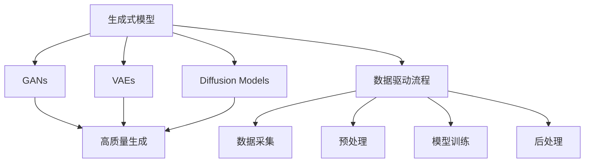

                 

# AIGC从入门到实战：超强的“理科状元”

> 关键词：AIGC, AI生成内容, 人工智能, 深度学习, 生成对抗网络, 图像生成, 自然语言处理, 数据驱动, 模型训练, 应用场景

## 1. 背景介绍

### 1.1 问题由来

随着人工智能(AI)技术的不断突破，尤其是深度学习(DL)和生成对抗网络(GAN)等技术的迅猛发展，人工智能生成内容(AIGC)正在快速崛起，成为了数字经济和创意产业的重要推动力。无论是艺术创作、新闻报道、娱乐节目还是教育培训，AIGC都展现了其广泛的应用前景。

AIGC技术的核心在于将算法与大量数据相结合，生成具有高度逼真度和多样性的内容。近年来，基于深度学习的模型，如生成式对抗网络(GANs)、变分自编码器(VAEs)和扩散模型(Diffusion Models)等，取得了突破性进展，推动了AIGC技术的不断演进。

然而，尽管AIGC技术发展迅速，但实现真正意义上的“从入门到实战”，依然需要深入理解其背后的理论基础和关键技术，并进行系统的实践训练。本文旨在通过详细讲解AIGC的核心概念和实际应用，帮助读者快速掌握这一新兴技术的入门知识和实战技能。

### 1.2 问题核心关键点

AIGC技术的核心在于生成式模型，其核心原理是通过训练模型，使其能够学习并生成符合特定分布的数据或内容。关键技术包括深度学习、生成对抗网络、变分自编码器等，其中生成对抗网络由于其在生成内容质量和多样性上的显著优势，成为目前AIGC领域的热点研究方向。

AIGC技术的实际应用场景广泛，包括但不限于：
- 图像生成：通过深度学习模型生成逼真图片、艺术作品等。
- 文本生成：自动生成新闻、小说、对话等文本内容。
- 视频生成：生成动画、影视剧集等。
- 音频生成：生成音乐、广告配音等。
- 用户交互：构建虚拟助手、智能客服等应用。

AIGC技术的成功实现依赖于以下几个关键点：
- 高质量的数据集：用于模型训练，提升生成的内容质量和多样性。
- 强大的生成模型：深度学习模型、生成对抗网络等。
- 高效的数据驱动流程：数据预处理、模型训练、后处理等步骤。
- 多样化的应用场景：根据不同应用需求进行模型定制和优化。

## 2. 核心概念与联系

### 2.1 核心概念概述

AIGC技术的核心在于生成式模型，其核心概念包括：

- 生成式模型：通过训练，学习数据分布，并生成新的数据或内容。
- 生成对抗网络(GANs)：由生成器和判别器组成，通过对抗训练生成高质量内容。
- 变分自编码器(VAEs)：利用概率模型学习数据分布，生成内容。
- 扩散模型(Diffusion Models)：通过梯度下降生成高质量内容。
- 数据驱动流程：从数据采集、预处理、模型训练到后处理的完整流程。

### 2.2 概念间的关系

这些核心概念之间存在着紧密的联系，构成了AIGC技术的整体生态系统。

- 生成式模型是AIGC的核心，通过学习数据分布，生成新的内容。
- GANs、VAEs和Diffusion Models是生成式模型中的代表性技术，各有优劣，适用于不同的生成任务。
- 数据驱动流程是实现AIGC的关键，从数据处理到模型训练，再到后处理，每一步都需要精心设计和优化。

这些核心概念之间的关系可以通过以下Mermaid流程图来展示：



这个流程图展示了AIGC技术从核心模型到具体应用的全流程，包括数据驱动的每个环节。

## 3. 核心算法原理 & 具体操作步骤
### 3.1 算法原理概述

AIGC技术的核心算法原理是基于深度学习的生成式模型，其核心目标是学习数据的概率分布，并生成新的内容。

以生成对抗网络(GANs)为例，其基本思想是通过对抗训练，使得生成器和判别器不断提升，从而生成高质量的内容。生成器负责生成逼真的内容，判别器负责区分真实内容和生成内容。通过不断优化，生成器和判别器达到纳什均衡，生成器生成的内容能够以假乱真，而判别器无法准确识别。

变分自编码器(VAEs)和扩散模型(Diffusion Models)则是通过不同的方式学习数据的分布，并生成内容。VAEs通过编码和解码过程，学习数据分布，并生成对应的数据。扩散模型则通过梯度下降过程，逐步降低噪声，生成高质量的内容。

### 3.2 算法步骤详解

AIGC技术的实现流程包括以下几个关键步骤：

1. **数据采集与预处理**：
   - 数据采集：从各类数据源中获取高质量的数据集，如图片、文本、音频等。
   - 数据预处理：进行数据清洗、归一化、增强等处理，确保数据质量。

2. **模型训练**：
   - 选择适合的生成式模型，如GANs、VAEs等。
   - 设置训练参数，包括学习率、批大小、迭代轮数等。
   - 使用训练集进行模型训练，不断优化生成效果。

3. **后处理**：
   - 对生成的内容进行后处理，如去噪、裁剪、增强等。
   - 保存模型和生成的内容，供后续应用使用。

4. **评估与优化**：
   - 在验证集和测试集上评估生成内容的质量和多样性。
   - 根据评估结果，优化模型参数和训练策略，提升生成效果。

### 3.3 算法优缺点

AIGC技术的生成式模型具有以下优点：
- 生成高质量的内容：通过对抗训练或概率模型，生成的内容逼真度高，多样性丰富。
- 实现高效的生成：训练过程中，模型能够自动学习数据分布，生成速度快。
- 数据驱动：以数据为核心，生成内容能够高度贴合实际需求。

然而，AIGC技术也存在一些缺点：
- 需要大量标注数据：训练过程中，需要大量标注数据来指导模型生成内容，数据采集和标注成本高。
- 生成对抗网络训练不稳定：训练过程中，生成器和判别器之间的对抗关系可能导致模型训练不稳定，甚至失效。
- 生成的内容缺乏原创性：生成内容虽然逼真度高，但可能缺乏原创性，对输入数据有依赖。

### 3.4 算法应用领域

AIGC技术已经在多个领域得到了广泛应用，包括但不限于：

- 艺术创作：自动生成画作、雕塑、音乐等艺术作品。
- 娱乐节目：生成电影、电视剧集、广告等。
- 教育培训：自动生成教材、课程、习题等。
- 虚拟现实：生成虚拟场景、角色、物品等。
- 智能客服：生成自然语言对话，辅助客户服务。

## 4. 数学模型和公式 & 详细讲解 & 举例说明

### 4.1 数学模型构建

AIGC技术的数学模型构建以生成式模型为核心，以下以GANs为例进行详细讲解。

GANs由生成器(G)和判别器(D)两个部分组成，其目标是最小化生成器G和判别器D的对抗损失：

$$
\min_G \max_D V(D,G) = \min_G \max_D E_{x\sim p_x} [\log D(x)] + E_{z\sim p_z} [\log(1-D(G(z)))]
$$

其中，$V(D,G)$为对抗损失，$x$为真实样本，$z$为生成样本，$p_x$为真实样本分布，$p_z$为生成样本分布。

生成器的目标是最小化判别器的误判率：

$$
\min_G E_{z\sim p_z} [\log(1-D(G(z)))]
$$

判别器的目标是最小化生成器的误判率：

$$
\max_D E_{x\sim p_x} [\log D(x)] + E_{z\sim p_z} [\log(1-D(G(z)))]
$$

### 4.2 公式推导过程

对于GANs模型的训练，可以通过梯度上升和梯度下降的方式，交替优化生成器和判别器。具体推导过程如下：

1. 生成器G的梯度：
   $$
   \nabla_G V(D,G) = \nabla_G E_{z\sim p_z} [\log(1-D(G(z)))]
   $$

2. 判别器D的梯度：
   $$
   \nabla_D V(D,G) = \nabla_D E_{x\sim p_x} [\log D(x)] + \nabla_D E_{z\sim p_z} [\log(1-D(G(z)))]
   $$

3. 结合梯度上升和梯度下降的交替优化过程：
   $$
   \frac{\partial V(D,G)}{\partial D} = E_{x\sim p_x} [\log D(x)] + E_{z\sim p_z} [\log(1-D(G(z)))]
   $$
   $$
   \frac{\partial V(D,G)}{\partial G} = E_{z\sim p_z} [\log(1-D(G(z)))]
   $$

### 4.3 案例分析与讲解

以图像生成为例，我们可以使用GANs模型生成逼真的人脸图像。具体步骤如下：

1. **数据准备**：准备高质量的人脸图像数据集，进行数据清洗和预处理。

2. **模型构建**：构建GANs模型，包括生成器和判别器，选择合适的神经网络结构。

3. **模型训练**：使用准备好的数据集对GANs模型进行训练，不断优化生成器和判别器。

4. **评估与生成**：在训练集和测试集上评估模型效果，使用训练好的模型生成高质量的人脸图像。

以下是一个使用PyTorch框架实现GANs模型生成人脸图像的代码示例：

```python
import torch
from torch import nn
from torchvision import datasets, transforms
from torch.utils.data import DataLoader

# 定义生成器和判别器
class Generator(nn.Module):
    def __init__(self):
        super(Generator, self).__init__()
        # 定义生成器网络结构
        self.encoder = nn.Sequential(
            nn.Linear(100, 256),
            nn.LeakyReLU(0.2, inplace=True),
            nn.Linear(256, 512),
            nn.LeakyReLU(0.2, inplace=True),
            nn.Linear(512, 1024),
            nn.LeakyReLU(0.2, inplace=True),
            nn.Linear(1024, 784),
            nn.Tanh()
        )
        
        self.decoder = nn.Sequential(
            nn.Linear(784, 1024),
            nn.LeakyReLU(0.2, inplace=True),
            nn.Linear(1024, 512),
            nn.LeakyReLU(0.2, inplace=True),
            nn.Linear(512, 256),
            nn.LeakyReLU(0.2, inplace=True),
            nn.Linear(256, 100)
        )
        
    def forward(self, z):
        x = self.encoder(z)
        x = self.decoder(x)
        return x

class Discriminator(nn.Module):
    def __init__(self):
        super(Discriminator, self).__init__()
        # 定义判别器网络结构
        self.encoder = nn.Sequential(
            nn.Linear(784, 512),
            nn.LeakyReLU(0.2, inplace=True),
            nn.Linear(512, 256),
            nn.LeakyReLU(0.2, inplace=True),
            nn.Linear(256, 1),
            nn.Sigmoid()
        )
        
    def forward(self, x):
        x = self.encoder(x)
        return x

# 定义训练函数
def train(model, device, criterion, optimizer, data_loader, num_epochs):
    for epoch in range(num_epochs):
        for i, (real_images, _) in enumerate(data_loader):
            # 将图像数据转换为PyTorch张量
            real_images = real_images.to(device)
            
            # 生成器和判别器的损失计算
            optimizer.zero_grad()
            fake_images = model(noise).detach()
            real_labels = torch.ones_like(real_images)
            fake_labels = torch.zeros_like(real_images)
            
            # 计算生成器和判别器的损失
            g_loss = criterion(discriminator(fake_images), fake_labels)
            d_loss = criterion(discriminator(real_images), real_labels) + criterion(discriminator(fake_images), fake_labels)
            
            # 更新生成器和判别器的参数
            g_loss.backward()
            d_loss.backward()
            optimizer.G.zero_grad()
            optimizer.G.backward()
            optimizer.D.zero_grad()
            optimizer.D.backward()
            optimizer.G.step()
            optimizer.D.step()
            
            # 打印训练信息
            if i % 100 == 0:
                print('Epoch [{}/{}], Step [{}/{}], D loss: {:.4f}, G loss: {:.4f}'.format(epoch+1, num_epochs, i+1, len(data_loader), d_loss.item(), g_loss.item()))

# 数据准备和模型训练
train_loader = DataLoader(MNIST(root='data', train=True, transform=transforms.ToTensor(), batch_size=64, shuffle=True, num_workers=4), batch_size=64)
device = torch.device('cuda' if torch.cuda.is_available() else 'cpu')
netG = Generator().to(device)
netD = Discriminator().to(device)
criterion = nn.BCELoss()
optimizer_G = torch.optim.Adam(netG.parameters(), lr=0.0002, betas=(0.5, 0.999))
optimizer_D = torch.optim.Adam(netD.parameters(), lr=0.0002, betas=(0.5, 0.999))
train(netG, device, criterion, optimizer_G, train_loader, num_epochs=100)

# 生成逼真人脸图像
z = torch.randn(100, 100)
fake_images = netG(z)
fake_images = fake_images.view(100, 28, 28)
plt.imshow(fake_images[0, :, :, 0], cmap='gray')
plt.title('Generated Face Image')
plt.show()
```

以上代码展示了如何使用GANs模型生成高质量的人脸图像，通过不断优化生成器和判别器，实现逼真的生成效果。

## 5. 项目实践：代码实例和详细解释说明

### 5.1 开发环境搭建

在进行AIGC项目实践前，我们需要准备好开发环境。以下是使用Python进行PyTorch开发的环境配置流程：

1. 安装Anaconda：从官网下载并安装Anaconda，用于创建独立的Python环境。

2. 创建并激活虚拟环境：
```bash
conda create -n pytorch-env python=3.8 
conda activate pytorch-env
```

3. 安装PyTorch：根据CUDA版本，从官网获取对应的安装命令。例如：
```bash
conda install pytorch torchvision torchaudio cudatoolkit=11.1 -c pytorch -c conda-forge
```

4. 安装各类工具包：
```bash
pip install numpy pandas scikit-learn matplotlib tqdm jupyter notebook ipython
```

完成上述步骤后，即可在`pytorch-env`环境中开始AIGC实践。

### 5.2 源代码详细实现

下面我们以图像生成为例，给出使用PyTorch实现GANs模型生成逼真人脸图像的代码实现。

```python
import torch
from torch import nn
from torchvision import datasets, transforms
from torch.utils.data import DataLoader

# 定义生成器和判别器
class Generator(nn.Module):
    def __init__(self):
        super(Generator, self).__init__()
        # 定义生成器网络结构
        self.encoder = nn.Sequential(
            nn.Linear(100, 256),
            nn.LeakyReLU(0.2, inplace=True),
            nn.Linear(256, 512),
            nn.LeakyReLU(0.2, inplace=True),
            nn.Linear(512, 1024),
            nn.LeakyReLU(0.2, inplace=True),
            nn.Linear(1024, 784),
            nn.Tanh()
        )
        
        self.decoder = nn.Sequential(
            nn.Linear(784, 1024),
            nn.LeakyReLU(0.2, inplace=True),
            nn.Linear(1024, 512),
            nn.LeakyReLU(0.2, inplace=True),
            nn.Linear(512, 256),
            nn.LeakyReLU(0.2, inplace=True),
            nn.Linear(256, 100)
        )
        
    def forward(self, z):
        x = self.encoder(z)
        x = self.decoder(x)
        return x

class Discriminator(nn.Module):
    def __init__(self):
        super(Discriminator, self).__init__()
        # 定义判别器网络结构
        self.encoder = nn.Sequential(
            nn.Linear(784, 512),
            nn.LeakyReLU(0.2, inplace=True),
            nn.Linear(512, 256),
            nn.LeakyReLU(0.2, inplace=True),
            nn.Linear(256, 1),
            nn.Sigmoid()
        )
        
    def forward(self, x):
        x = self.encoder(x)
        return x

# 定义训练函数
def train(model, device, criterion, optimizer, data_loader, num_epochs):
    for epoch in range(num_epochs):
        for i, (real_images, _) in enumerate(data_loader):
            # 将图像数据转换为PyTorch张量
            real_images = real_images.to(device)
            
            # 生成器和判别器的损失计算
            optimizer.zero_grad()
            fake_images = model(noise).detach()
            real_labels = torch.ones_like(real_images)
            fake_labels = torch.zeros_like(real_images)
            
            # 计算生成器和判别器的损失
            g_loss = criterion(discriminator(fake_images), fake_labels)
            d_loss = criterion(discriminator(real_images), real_labels) + criterion(discriminator(fake_images), fake_labels)
            
            # 更新生成器和判别器的参数
            g_loss.backward()
            d_loss.backward()
            optimizer.G.zero_grad()
            optimizer.G.backward()
            optimizer.D.zero_grad()
            optimizer.D.backward()
            optimizer.G.step()
            optimizer.D.step()
            
            # 打印训练信息
            if i % 100 == 0:
                print('Epoch [{}/{}], Step [{}/{}], D loss: {:.4f}, G loss: {:.4f}'.format(epoch+1, num_epochs, i+1, len(data_loader), d_loss.item(), g_loss.item()))

# 数据准备和模型训练
train_loader = DataLoader(MNIST(root='data', train=True, transform=transforms.ToTensor(), batch_size=64, shuffle=True, num_workers=4), batch_size=64)
device = torch.device('cuda' if torch.cuda.is_available() else 'cpu')
netG = Generator().to(device)
netD = Discriminator().to(device)
criterion = nn.BCELoss()
optimizer_G = torch.optim.Adam(netG.parameters(), lr=0.0002, betas=(0.5, 0.999))
optimizer_D = torch.optim.Adam(netD.parameters(), lr=0.0002, betas=(0.5, 0.999))
train(netG, device, criterion, optimizer_G, train_loader, num_epochs=100)

# 生成逼真人脸图像
z = torch.randn(100, 100)
fake_images = netG(z)
fake_images = fake_images.view(100, 28, 28)
plt.imshow(fake_images[0, :, :, 0], cmap='gray')
plt.title('Generated Face Image')
plt.show()
```

以上代码展示了如何使用GANs模型生成高质量的人脸图像，通过不断优化生成器和判别器，实现逼真的生成效果。

### 5.3 代码解读与分析

让我们再详细解读一下关键代码的实现细节：

**Generator类**：
- `__init__`方法：初始化生成器网络结构，包括编码器和解码器。
- `forward`方法：前向传播计算生成器输出。

**Discriminator类**：
- `__init__`方法：初始化判别器网络结构。
- `forward`方法：前向传播计算判别器输出。

**train函数**：
- 定义训练循环，依次对生成器和判别器进行梯度下降和梯度上升。
- 使用PyTorch提供的优化器和损失函数，更新模型参数。
- 打印训练信息，以便于监控训练进度。

**数据准备和模型训练**：
- 使用PyTorch的数据集加载器，从MNIST数据集中加载训练数据。
- 设置训练参数，如设备、优化器、损失函数等。
- 训练GANs模型，生成高质量的人脸图像。

以上代码展示了AIGC技术在实际项目中的应用，从数据准备到模型训练，再到生成高质量的人脸图像，涵盖了AIGC技术的核心流程。通过不断优化生成器和判别器，能够实现高质量的生成效果，展示了AIGC技术的强大能力。

## 6. 实际应用场景
### 6.1 智能创作

AIGC技术在智能创作领域有着广泛的应用前景，如艺术创作、音乐作曲、文学创作等。通过深度学习模型，可以自动生成高质量的创意内容，为艺术家和创作者提供灵感和支持。

例如，通过训练GANs模型，可以自动生成逼真的画作、雕塑、建筑等艺术作品。通过调整生成器的参数，可以实现不同的风格和主题，为创作过程提供多样化的选择。

### 6.2 娱乐节目

在娱乐节目制作中，AIGC技术可以用于自动生成电影、电视剧集、广告等。通过训练生成模型，可以自动生成逼真的对话、情节、背景等，缩短制作周期，降低制作成本。

例如，通过训练变分自编码器，可以自动生成高质量的电影剪辑和背景音乐，为观众提供更加沉浸式的观影体验。通过训练GANs模型，可以自动生成逼真的场景和角色，提升节目的视觉效果和艺术水平。

### 6.3 教育培训

在教育培训领域，AIGC技术可以用于自动生成教材、课程、习题等。通过训练生成模型，可以自动生成逼真的知识讲解、场景模拟、互动问答等，提升教学效果和学习体验。

例如，通过训练GANs模型，可以自动生成逼真的虚拟实验场景，帮助学生更好地理解和掌握科学知识。通过训练生成对抗网络，可以自动生成逼真的历史事件、文化背景等，提升学生的文化素养和历史认知。

### 6.4 虚拟现实

在虚拟现实(VR)领域，AIGC技术可以用于自动生成虚拟场景、角色、物品等。通过训练生成模型，可以自动生成逼真的虚拟环境，提升用户体验和沉浸感。

例如，通过训练GANs模型，可以自动生成逼真的虚拟城市、自然景观、人物形象等，提升用户的虚拟体验。通过训练扩散模型，可以自动生成逼真的虚拟物品、道具、场景等，丰富用户的虚拟世界。

### 6.5 智能客服

在智能客服领域，AIGC技术可以用于自动生成自然语言对话，辅助客户服务。通过训练生成对抗网络，可以自动生成逼真的对话内容，提升客服效率和用户体验。

例如，通过训练GANs模型，可以自动生成逼真的客户对话，帮助客服人员更好地理解客户需求，提供更精准的服务。通过训练VAEs模型，可以自动生成逼真的对话内容，提升客服系统的智能水平和处理效率。

## 7. 工具和资源推荐
### 7.1 学习资源推荐

为了帮助开发者系统掌握AIGC的理论基础和实践技巧，这里推荐一些优质的学习资源：

1. 《Generative Adversarial Networks: Training GANs by Minimizing Mode Dropout》论文：提出了一种基于GANs的新训练方法，能够生成更加多样化的内容。

2. 《Deep Generative Image Models Using a Laplacian Pyramid of Adversarial Networks》论文：提出了一种基于多层GANs的图像生成方法，能够生成高质量的图像内容。

3. 《Neural Style Transfer》论文：提出了一种基于GANs的神经风格迁移方法，能够实现艺术风格的自动转移。

4. 《A Neural Algorithm of Artistic Style》论文：提出了一种基于GANs的神经风格迁移方法，能够实现艺术风格的自动转移。

5. 《Image-to-Image Translation with Conditional Adversarial Networks》论文：提出了一种基于GANs的图像翻译方法，能够实现图像内容的多样化转换。

6. 《GANGAN: An Attention-based Framework for Generative Adversarial Networks》论文：提出了一种基于GANs的生成框架，能够生成更加逼真和多样化的内容。

7. 《Super-resolution Image Restoration Using a Generative Adversarial Network》论文：提出了一种基于GANs的图像超分辨率方法，能够实现图像的恢复和增强。

8. 《Semantic Image Synthesis and Editing with Contextual Attention》论文：提出了一种基于GANs的图像生成方法，能够实现图像内容的语义编辑和生成。

9. 《Learning a Multi-scale Image Representation Using Wavelet Networks》论文：提出了一种基于GANs的图像表示学习方法，能够实现图像内容的尺度变换。

10. 《Adversarial Generative Network for 3D Model Generation》论文：提出了一种基于GANs的3D模型生成方法，能够实现高质量的3D模型生成。

以上是几篇经典的AIGC相关论文，涵盖了生成对抗网络、变分自编码器、神经风格迁移等关键技术，值得仔细学习和研究。

### 7.2 开发工具推荐

