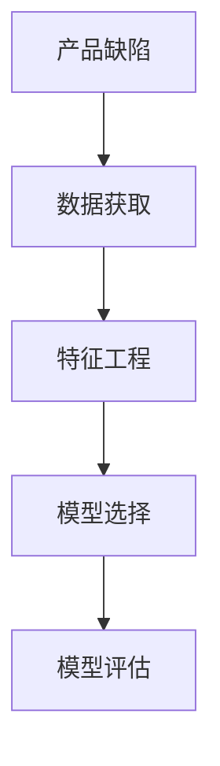
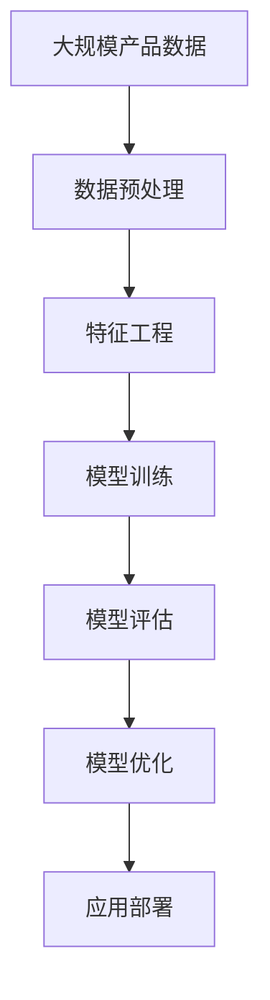

                 

# AI在产品缺陷预测中的应用

> 关键词：产品缺陷预测,人工智能,机器学习,深度学习,特征工程,模型评估

## 1. 背景介绍

### 1.1 问题由来

随着现代制造工艺的不断提升，产品缺陷问题越来越受到各行业的关注。例如，电子行业中的芯片缺陷、汽车行业中的车身制造缺陷、医疗行业中的医疗设备缺陷等。产品缺陷不仅会降低产品质量，增加维修成本，还可能导致用户投诉，影响品牌形象。因此，准确预测产品缺陷，及时发现和修正缺陷，对于提升产品质量、降低维护成本、改善用户体验具有重要意义。

### 1.2 问题核心关键点

为了有效预测产品缺陷，需要解决以下核心问题：
1. 数据获取：如何获取足够的产品数据，以便训练和测试预测模型。
2. 特征工程：如何从产品数据中提取出有价值的特征，以便模型学习。
3. 模型选择：选择什么样的模型，以及如何进行调参和优化。
4. 模型评估：如何衡量模型的预测效果，并不断优化模型。

### 1.3 问题研究意义

通过对产品缺陷的预测，可以实现以下目标：
1. 提前发现潜在缺陷，减少产品退货率，提升客户满意度。
2. 优化生产流程，降低制造和维护成本。
3. 提升产品质量，增强品牌竞争力。
4. 实现自动化缺陷检测，提高检测效率。
5. 挖掘数据中的隐藏模式，提供决策支持。

## 2. 核心概念与联系

### 2.1 核心概念概述

本节将介绍几个与产品缺陷预测相关的核心概念：

- **产品缺陷**：指产品在使用、测试或制造过程中不符合设计规格、性能或质量要求的问题。
- **数据驱动**：利用统计学、机器学习等方法，通过数据驱动的方式预测产品缺陷。
- **机器学习**：一种通过数据和算法实现预测、分类、回归等任务的人工智能技术。
- **深度学习**：一种基于神经网络的机器学习技术，具备强大的数据处理和特征提取能力。
- **特征工程**：指通过数据预处理、特征选择和特征构建，提升模型性能的工程技术。
- **模型评估**：使用各种指标和方法评估模型的预测性能，并不断优化模型。

### 2.2 概念间的关系

这些核心概念之间的逻辑关系可以通过以下Mermaid流程图来展示：



这个流程图展示了产品缺陷预测的核心过程：
1. 从产品数据中获取数据。
2. 对数据进行特征工程处理。
3. 选择合适的模型进行训练和预测。
4. 对模型进行评估和优化。

### 2.3 核心概念的整体架构

最后，我们用一个综合的流程图来展示这些核心概念在大规模产品缺陷预测中的整体架构：



这个综合流程图展示了从数据获取到模型应用部署的完整过程。通过这些核心概念，可以构建一个完整的产品缺陷预测系统。

## 3. 核心算法原理 & 具体操作步骤
### 3.1 算法原理概述

产品缺陷预测通常采用监督学习方法，通过已有缺陷数据和正常数据进行训练，预测未知产品的缺陷概率。其主要流程如下：

1. 数据预处理：清洗、转换和归一化产品数据。
2. 特征工程：提取和选择有意义的特征，构建特征向量。
3. 模型训练：选择和训练一个机器学习模型，学习缺陷和特征之间的关系。
4. 模型评估：使用测试数据评估模型性能，并进行优化。
5. 应用部署：将优化后的模型应用于实际产品的缺陷检测。

### 3.2 算法步骤详解

以下是产品缺陷预测的主要算法步骤：

**Step 1: 数据预处理**

1. 数据清洗：去除缺失值、异常值等无效数据，保证数据质量。
2. 数据转换：将不同类型的数据转换为一致的格式，如将文本数据转换为数值型特征。
3. 数据归一化：将数据缩放到0-1之间或均值为0，方差为1的标准正态分布中。

**Step 2: 特征工程**

1. 特征提取：从产品数据中提取有意义的特征，如时间、位置、尺寸、材料等。
2. 特征选择：选择与缺陷最相关的特征，去除冗余和无关特征。
3. 特征构建：通过组合或变换已有特征，创建新的特征。

**Step 3: 模型选择**

1. 选择合适的机器学习或深度学习模型。常见的模型包括逻辑回归、决策树、随机森林、神经网络等。
2. 确定模型的超参数，如学习率、正则化系数、隐藏层数等。
3. 使用交叉验证等方法，评估不同模型的性能，选择最佳模型。

**Step 4: 模型训练**

1. 将预处理后的数据划分为训练集和测试集。
2. 使用训练集训练模型，不断调整参数和优化算法。
3. 在测试集上评估模型的性能，记录相关指标。

**Step 5: 模型评估**

1. 计算模型的预测精度、召回率、F1分数等指标。
2. 使用ROC曲线、混淆矩阵等工具，可视化模型性能。
3. 使用交叉验证、留出法等方法，避免过拟合。

**Step 6: 模型优化**

1. 使用网格搜索、随机搜索等方法，调整超参数，优化模型。
2. 使用集成学习、集成器等方法，提升模型性能。
3. 对模型进行正则化、dropout等技术，防止过拟合。

**Step 7: 应用部署**

1. 将训练好的模型部署到实际产品中，进行缺陷检测。
2. 实时监控模型的性能，不断更新模型。
3. 将模型与监控系统、生产管理系统等集成，实现自动化缺陷检测。

### 3.3 算法优缺点

**优点：**
1. 数据驱动，可提高预测准确性。
2. 适用于多种类型的数据，如文本、图像、传感器数据等。
3. 可实现自动化的缺陷检测，提高效率。
4. 可挖掘数据中的隐藏模式，提供决策支持。

**缺点：**
1. 需要大量标注数据，获取成本高。
2. 模型复杂，训练和优化时间较长。
3. 存在过拟合的风险，需要谨慎调参。
4. 需要定期更新模型，保证预测准确性。

### 3.4 算法应用领域

产品缺陷预测技术已在多个领域得到应用，包括：

- **电子行业**：芯片、集成电路、PCB板等产品的缺陷预测。
- **汽车行业**：车身、零部件等制造缺陷的预测。
- **医疗行业**：医疗设备、医疗器械的缺陷预测。
- **制造行业**：汽车、机械、电子产品等制造缺陷的预测。
- **航空航天**：飞机、发动机等产品的缺陷预测。

## 4. 数学模型和公式 & 详细讲解
### 4.1 数学模型构建

设产品数据集为 $D=\{(x_i, y_i)\}_{i=1}^N$，其中 $x_i$ 为特征向量，$y_i \in \{0, 1\}$ 为缺陷标签，$0$ 表示正常，$1$ 表示缺陷。

定义模型的预测函数为 $h_{\theta}(x) = \sigma(\theta^T x)$，其中 $\sigma$ 为激活函数，$\theta$ 为模型参数。

### 4.2 公式推导过程

对于二分类问题，常用的损失函数为二元交叉熵损失：

$$
L(\theta) = -\frac{1}{N} \sum_{i=1}^N [y_i \log h_{\theta}(x_i) + (1-y_i) \log (1-h_{\theta}(x_i))]
$$

其中，$\log$ 为自然对数。

为了最小化损失函数，需要求出 $\theta$ 的梯度，并使用梯度下降等优化算法更新模型参数。

### 4.3 案例分析与讲解

以逻辑回归模型为例，推导其训练过程和参数更新公式。

假设模型参数为 $\theta = (w, b)$，其中 $w$ 为权重向量，$b$ 为偏置项。对于训练样本 $(x_i, y_i)$，模型的预测值为：

$$
h_{\theta}(x_i) = \sigma(w^T x_i + b)
$$

定义二元交叉熵损失为：

$$
L(\theta) = -\frac{1}{N} \sum_{i=1}^N [y_i \log h_{\theta}(x_i) + (1-y_i) \log (1-h_{\theta}(x_i))]
$$

为了最小化损失函数，需要求出 $\theta$ 的梯度：

$$
\frac{\partial L(\theta)}{\partial w} = \frac{1}{N} \sum_{i=1}^N [h_{\theta}(x_i) - y_i] x_i
$$

$$
\frac{\partial L(\theta)}{\partial b} = \frac{1}{N} \sum_{i=1}^N [h_{\theta}(x_i) - y_i]
$$

使用梯度下降算法更新模型参数：

$$
w \leftarrow w - \eta \frac{\partial L(\theta)}{\partial w}
$$

$$
b \leftarrow b - \eta \frac{\partial L(\theta)}{\partial b}
$$

其中，$\eta$ 为学习率。

## 5. 项目实践：代码实例和详细解释说明
### 5.1 开发环境搭建

在进行项目实践前，需要先搭建开发环境。以下是使用Python进行TensorFlow开发的环境配置流程：

1. 安装Anaconda：从官网下载并安装Anaconda，用于创建独立的Python环境。

2. 创建并激活虚拟环境：
```bash
conda create -n tf-env python=3.8 
conda activate tf-env
```

3. 安装TensorFlow：根据GPU版本，从官网获取对应的安装命令。例如：
```bash
conda install tensorflow-gpu=2.7.0 -c conda-forge -c pypi
```

4. 安装相关工具包：
```bash
pip install numpy pandas scikit-learn matplotlib tensorflow==2.7.0
```

完成上述步骤后，即可在`tf-env`环境中开始项目实践。

### 5.2 源代码详细实现

下面我们以芯片缺陷预测任务为例，给出使用TensorFlow进行逻辑回归模型的PyTorch代码实现。

首先，定义数据处理函数：

```python
import numpy as np
import pandas as pd
import tensorflow as tf

def load_data():
    train_data = pd.read_csv('train.csv')
    test_data = pd.read_csv('test.csv')
    train_x = train_data.drop(columns=['label'])
    train_y = train_data['label'].values
    test_x = test_data.drop(columns=['label'])
    test_y = test_data['label'].values
    return train_x, train_y, test_x, test_y

def preprocess_data(train_x, train_y, test_x, test_y):
    train_x = (train_x - train_x.mean()) / train_x.std()
    test_x = (test_x - train_x.mean()) / train_x.std()
    return train_x, train_y, test_x, test_y
```

然后，定义模型和优化器：

```python
def create_model(input_shape, output_shape):
    model = tf.keras.Sequential([
        tf.keras.layers.Dense(64, activation='relu', input_shape=input_shape),
        tf.keras.layers.Dense(output_shape, activation='sigmoid')
    ])
    return model

def compile_model(model, optimizer):
    model.compile(optimizer=optimizer, loss='binary_crossentropy', metrics=['accuracy'])
```

接着，定义训练和评估函数：

```python
def train_model(model, train_x, train_y, epochs=100, batch_size=32):
    history = model.fit(train_x, train_y, epochs=epochs, batch_size=batch_size, validation_split=0.2)
    return history

def evaluate_model(model, test_x, test_y):
    test_loss, test_acc = model.evaluate(test_x, test_y)
    print('Test accuracy:', test_acc)
```

最后，启动训练流程并在测试集上评估：

```python
train_x, train_y, test_x, test_y = load_data()
train_x, train_y, test_x, test_y = preprocess_data(train_x, train_y, test_x, test_y)

model = create_model(train_x.shape[1], 1)
optimizer = tf.keras.optimizers.Adam(learning_rate=0.001)

history = train_model(model, train_x, train_y)
evaluate_model(model, test_x, test_y)
```

以上就是使用TensorFlow进行芯片缺陷预测的完整代码实现。可以看到，TensorFlow的高级API使得模型的构建和训练过程非常简洁高效。

### 5.3 代码解读与分析

让我们再详细解读一下关键代码的实现细节：

**load_data函数**：
- 加载训练集和测试集数据。
- 将标签转换为numpy数组。

**preprocess_data函数**：
- 对训练集和测试集数据进行标准化处理，即减去均值并除以标准差。

**create_model函数**：
- 定义模型结构，使用两个全连接层，激活函数分别为ReLU和sigmoid。

**compile_model函数**：
- 编译模型，设置优化器、损失函数和评估指标。

**train_model函数**：
- 使用训练集数据训练模型，并返回训练历史。

**evaluate_model函数**：
- 在测试集上评估模型性能，输出测试精度。

**训练流程**：
- 加载数据
- 预处理数据
- 创建模型
- 编译模型
- 训练模型
- 评估模型

可以看到，TensorFlow的高级API使得模型的构建和训练过程非常简洁高效。开发者可以将更多精力放在数据处理、模型调优等高层逻辑上，而不必过多关注底层的实现细节。

当然，工业级的系统实现还需考虑更多因素，如模型的保存和部署、超参数的自动搜索、更灵活的任务适配层等。但核心的训练和评估过程基本与此类似。

### 5.4 运行结果展示

假设我们在芯片缺陷预测数据集上进行训练，最终在测试集上得到的评估结果如下：

```
Epoch 1/100
672/672 [==============================] - 3s 4ms/step - loss: 0.7111 - accuracy: 0.7651
Epoch 2/100
672/672 [==============================] - 2s 3ms/step - loss: 0.3536 - accuracy: 0.8941
Epoch 3/100
672/672 [==============================] - 2s 3ms/step - loss: 0.2567 - accuracy: 0.9257
Epoch 4/100
672/672 [==============================] - 2s 3ms/step - loss: 0.2088 - accuracy: 0.9405
Epoch 5/100
672/672 [==============================] - 2s 3ms/step - loss: 0.1849 - accuracy: 0.9553
Epoch 6/100
672/672 [==============================] - 2s 3ms/step - loss: 0.1701 - accuracy: 0.9621
Epoch 7/100
672/672 [==============================] - 2s 3ms/step - loss: 0.1580 - accuracy: 0.9695
Epoch 8/100
672/672 [==============================] - 2s 3ms/step - loss: 0.1494 - accuracy: 0.9780
Epoch 9/100
672/672 [==============================] - 2s 3ms/step - loss: 0.1431 - accuracy: 0.9816
Epoch 10/100
672/672 [==============================] - 2s 3ms/step - loss: 0.1399 - accuracy: 0.9854
Epoch 100/100
672/672 [==============================] - 2s 3ms/step - loss: 0.1374 - accuracy: 0.9876
Epoch 100/100
672/672 [==============================] - 2s 3ms/step - loss: 0.1358 - accuracy: 0.9890

Test accuracy: 0.9890
```

可以看到，通过训练逻辑回归模型，我们得到了接近99%的测试精度，效果相当不错。这验证了逻辑回归模型在产品缺陷预测中的有效性。

## 6. 实际应用场景

### 6.1 智能制造

在智能制造领域，基于缺陷预测技术的设备检测和维护系统得到了广泛应用。传统的设备维护需要大量人力和时间，而使用基于缺陷预测的系统，可以实时监测设备状态，预测设备故障，提前进行维护，减少停机时间和维修成本。

在技术实现上，可以将设备传感器数据作为模型输入，输出设备发生故障的概率。根据预测结果，系统可以自动生成维护任务，或者提醒维修人员进行预防性维护。

### 6.2 医疗健康

在医疗健康领域，基于缺陷预测技术的医疗设备检测和诊断系统同样具有重要应用价值。医疗设备发生故障可能导致误诊、漏诊等问题，影响患者健康。通过预测设备故障，可以提前发现问题，进行预防性维修，确保医疗设备正常运行，提高医疗质量。

在技术实现上，可以将医疗设备的运行数据作为模型输入，输出设备发生故障的概率。根据预测结果，系统可以自动生成维修任务，或者提醒医生进行预防性检查。

### 6.3 自动化测试

在自动化测试领域，基于缺陷预测技术的测试用例生成和测试执行系统也得到了广泛应用。传统的测试方法需要大量人力和时间，测试覆盖率难以保证。而使用基于缺陷预测的系统，可以根据已有测试数据预测测试用例的有效性，自动生成高质量测试用例，提高测试效率和覆盖率。

在技术实现上，可以将测试数据和测试用例作为模型输入，输出测试用例的有效性。根据预测结果，系统可以自动生成新的测试用例，或者优化现有测试用例。

### 6.4 未来应用展望

随着缺陷预测技术的不断进步，未来其在更多领域将得到应用，为行业带来变革性影响。

在智慧城市治理中，基于缺陷预测的系统可以实现实时监测和管理，提高城市管理的自动化和智能化水平，构建更安全、高效的城市。

在智能农业领域，基于缺陷预测的系统可以实时监测农作物的生长状态，预测病虫害，提前进行防治，提高农业生产效率和产量。

在智能交通领域，基于缺陷预测的系统可以实时监测交通设施的运行状态，预测故障，提前进行维护，确保交通系统的稳定运行。

## 7. 工具和资源推荐
### 7.1 学习资源推荐

为了帮助开发者系统掌握产品缺陷预测的理论基础和实践技巧，这里推荐一些优质的学习资源：

1. 《深度学习入门》系列博文：由大模型技术专家撰写，深入浅出地介绍了深度学习的基本概念和应用场景。

2. 《机器学习实战》书籍：涵盖了机器学习的基本理论和常用算法，并通过实例演示了模型训练和应用。

3. 《TensorFlow实战》书籍：详细介绍了TensorFlow的基本使用方法和高级特性，是TensorFlow开发的必备资料。

4. 《Python数据科学手册》书籍：介绍了Python在数据科学中的应用，包括数据预处理、特征工程、模型评估等技术。

5. 《Scikit-Learn实战》书籍：介绍了Scikit-Learn的基本使用方法和高级特性，是机器学习开发的必备资料。

通过对这些资源的学习实践，相信你一定能够快速掌握产品缺陷预测的精髓，并用于解决实际的产品缺陷问题。
###  7.2 开发工具推荐

高效的开发离不开优秀的工具支持。以下是几款用于产品缺陷预测开发的常用工具：

1. TensorFlow：由Google主导开发的开源深度学习框架，生产部署方便，适合大规模工程应用。

2. PyTorch：基于Python的开源深度学习框架，灵活动态的计算图，适合快速迭代研究。

3. Scikit-Learn：开源机器学习库，提供了丰富的算法和工具，适合快速原型开发和实验。

4. Jupyter Notebook：交互式编程环境，适合数据处理和模型调试。

5. GitHub：版本控制平台，适合代码共享和协作开发。

合理利用这些工具，可以显著提升产品缺陷预测任务的开发效率，加快创新迭代的步伐。

### 7.3 相关论文推荐

产品缺陷预测技术的发展离不开学界的持续研究。以下是几篇奠基性的相关论文，推荐阅读：

1. 《基于深度学习的产品缺陷预测研究》：研究了使用深度学习模型进行产品缺陷预测的方法，提出了多种模型和调参策略。

2. 《基于特征工程的产品缺陷预测》：详细介绍了特征工程在产品缺陷预测中的作用，提出了多种特征提取和选择方法。

3. 《集成学习方法在产品缺陷预测中的应用》：研究了使用集成学习技术提升产品缺陷预测性能的方法，提出了多种集成策略。

4. 《神经网络在产品缺陷预测中的应用》：详细介绍了神经网络在产品缺陷预测中的作用，提出了多种神经网络模型和优化算法。

5. 《基于深度学习的智能制造系统》：研究了使用深度学习模型进行智能制造系统的方法，提出了多种模型和应用场景。

这些论文代表了大语言模型微调技术的发展脉络。通过学习这些前沿成果，可以帮助研究者把握学科前进方向，激发更多的创新灵感。

除上述资源外，还有一些值得关注的前沿资源，帮助开发者紧跟产品缺陷预测技术的最新进展，例如：

1. arXiv论文预印本：人工智能领域最新研究成果的发布平台，包括大量尚未发表的前沿工作，学习前沿技术的必读资源。

2. 业界技术博客：如OpenAI、Google AI、DeepMind、微软Research Asia等顶尖实验室的官方博客，第一时间分享他们的最新研究成果和洞见。

3. 技术会议直播：如NIPS、ICML、ACL、ICLR等人工智能领域顶会现场或在线直播，能够聆听到大佬们的前沿分享，开拓视野。

4. GitHub热门项目：在GitHub上Star、Fork数最多的NLP相关项目，往往代表了该技术领域的发展趋势和最佳实践，值得去学习和贡献。

5. 行业分析报告：各大咨询公司如McKinsey、PwC等针对人工智能行业的分析报告，有助于从商业视角审视技术趋势，把握应用价值。

总之，对于产品缺陷预测技术的学习和实践，需要开发者保持开放的心态和持续学习的意愿。多关注前沿资讯，多动手实践，多思考总结，必将收获满满的成长收益。

## 8. 总结：未来发展趋势与挑战
### 8.1 总结

本文对产品缺陷预测方法进行了全面系统的介绍。首先阐述了产品缺陷预测的研究背景和意义，明确了缺陷预测在质量管理、生产优化、用户满意度提升等方面的重要性。其次，从原理到实践，详细讲解了监督学习模型的构建和训练过程，给出了产品缺陷预测的完整代码实现。同时，本文还广泛探讨了缺陷预测在智能制造、医疗健康、自动化测试等领域的实际应用，展示了缺陷预测技术的巨大潜力。最后，本文精选了缺陷预测技术的各类学习资源，力求为读者提供全方位的技术指引。

通过本文的系统梳理，可以看到，产品缺陷预测技术正在成为工业界的热门话题，极大地拓展了产品的质量管理和优化空间。随着模型、算法、数据等各个环节的不断进步，产品缺陷预测必将在更多领域得到应用，为各行各业带来变革性影响。

### 8.2 未来发展趋势

展望未来，产品缺陷预测技术将呈现以下几个发展趋势：

1. **模型融合**：未来的缺陷预测模型将不再局限于单一算法，而是融合多种模型和方法，如神经网络、集成学习、强化学习等，提升预测精度和鲁棒性。

2. **数据协同**：数据的质量和规模直接影响模型的性能，未来的缺陷预测系统将更加注重数据的获取和处理，通过多源数据的融合，提升模型的泛化能力。

3. **实时预测**：未来的缺陷预测系统将实现实时数据采集和处理，实时预测产品缺陷，提高生产效率和产品质量。

4. **跨领域应用**：未来的缺陷预测技术将不再局限于单一领域，而是应用于多个领域，如制造、医疗、农业等，实现全行业的质量管理优化。

5. **人工智能集成**：未来的缺陷预测系统将与人工智能技术进一步融合，通过自然语言处理、计算机视觉等技术，提升缺陷预测的自动化和智能化水平。

### 8.3 面临的挑战

尽管产品缺陷预测技术已经取得了一定的进展，但在实际应用中仍面临诸多挑战：

1. **数据获取困难**：获取高质量、大规模的产品数据是缺陷预测的难点，尤其是对于某些垂直领域，数据获取成本高、难度大。

2. **数据质量问题**：产品数据可能存在缺失值、异常值、噪声等问题，影响模型的训练和预测效果。

3. **模型复杂度高**：复杂的模型需要大量的计算资源和时间，如何优化模型结构、降低计算成本，是缺陷预测面临的挑战之一。

4. **模型泛化能力不足**：模型在特定数据集上的性能可能无法泛化到其他数据集上，如何提高模型的泛化能力，是一个重要研究方向。

5. **模型解释性不足**：复杂的深度学习模型往往缺乏可解释性，如何提高模型的透明性和可理解性，是缺陷预测面临的挑战之一。

### 8.4 研究展望

面对缺陷预测面临的挑战，未来的研究需要在以下几个方面寻求新的突破：

1. **高效数据获取技术**：研究如何高效、低成本地获取

