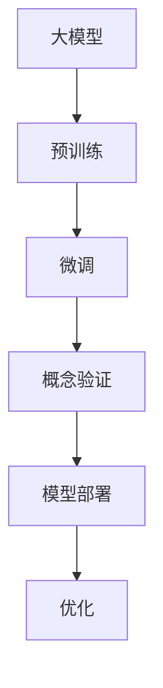
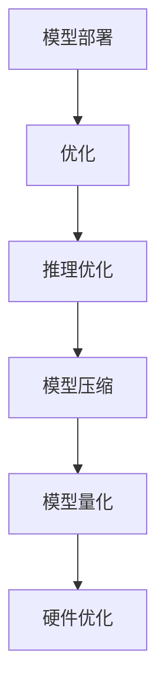
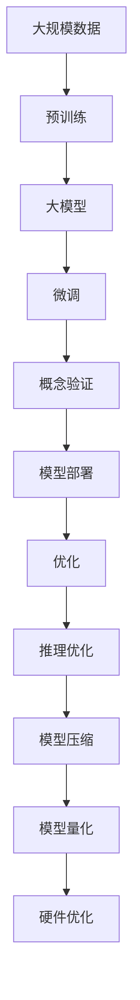

                 

# AI大模型的概念验证与落地

> 关键词：大模型、概念验证、技术实现、落地场景、技术挑战、未来发展

## 1. 背景介绍

### 1.1 问题由来

随着人工智能技术的发展，大模型（如GPT、BERT等）在自然语言处理（NLP）、计算机视觉（CV）等领域取得了突破性进展。这些大模型通过预训练学习到了广泛的领域知识和语言理解能力，极大地提升了模型的通用性和泛化能力。然而，大模型的实际落地应用仍面临诸多挑战，包括计算资源需求高、模型复杂度大、数据质量和数量要求高等问题。因此，如何高效地验证和部署大模型，成为当前研究的重要课题。

### 1.2 问题核心关键点

大模型落地应用的核心在于验证其性能、确保模型质量和稳定性、以及合理地部署和优化模型。核心关键点包括：

1. **验证模型性能**：通过各种实验和测试，验证模型在不同场景下的表现。
2. **确保模型质量**：评估模型的泛化能力、鲁棒性、偏见和伦理问题。
3. **优化模型部署**：降低计算成本、提高推理速度、确保模型可扩展性和可维护性。
4. **选择合适的落地场景**：根据模型特点和应用需求，选择最合适的应用场景。

### 1.3 问题研究意义

大模型落地应用的研究对于推动人工智能技术的产业化、加速各行业数字化转型具有重要意义：

1. **降低应用开发成本**：利用大模型减少从头开发所需的数据、计算和人力投入。
2. **提升模型效果**：通过微调等技术，使模型更好地适应特定任务，提高模型性能。
3. **加速开发进度**：将预训练模型应用于实际任务，缩短开发周期。
4. **赋能产业升级**：为各行各业提供高质量的AI服务，推动行业创新和升级。
5. **促进技术创新**：激发新的研究方向，如零样本学习、跨领域迁移学习等。

## 2. 核心概念与联系

### 2.1 核心概念概述

为更好地理解大模型的概念验证与落地过程，本节将介绍几个密切相关的核心概念：

- **大模型(Large Model)**：指经过大规模数据预训练后，具备强大表示能力的神经网络模型，如BERT、GPT等。
- **预训练(Pre-training)**：通过无监督学习任务在大规模数据上训练模型，学习通用特征。
- **微调(Fine-tuning)**：在有监督数据上对预训练模型进行微调，使其适应特定任务。
- **概念验证(Concept Validation)**：通过实验和测试验证大模型的泛化能力和性能表现。
- **模型部署(Model Deployment)**：将模型部署到实际应用场景中，提供服务。
- **优化(Optimization)**：通过模型压缩、量化等技术优化模型性能和推理速度。

这些核心概念之间的逻辑关系可以通过以下Mermaid流程图来展示：



这个流程图展示了从预训练到微调，再到概念验证和部署的全过程。大模型首先在大规模数据上进行预训练，然后通过微调适应特定任务，通过概念验证验证其性能和质量，最终部署到实际应用场景中。

### 2.2 概念间的关系

这些核心概念之间存在着紧密的联系，形成了大模型概念验证与落地的完整生态系统。下面我们通过几个Mermaid流程图来展示这些概念之间的关系。

#### 2.2.1 大模型的学习和训练范式


这个流程图展示了大模型的学习和训练范式。大模型首先在大规模数据上进行预训练，然后通过微调适应特定任务，通过概念验证验证其性能和质量，最终部署到实际应用场景中。

#### 2.2.2 微调与概念验证的关系


这个流程图展示了微调和概念验证的关系。微调后的模型需要经过概念验证，确保其性能和质量符合预期。

#### 2.2.3 模型部署与优化的关系



这个流程图展示了模型部署与优化的关系。模型部署需要经过推理优化、模型压缩、量化和硬件优化等多个环节，以提高推理速度和降低计算成本。

### 2.3 核心概念的整体架构

最后，我们用一个综合的流程图来展示这些核心概念在大模型概念验证与落地过程中的整体架构：



这个综合流程图展示了从预训练到微调，再到概念验证和部署的全过程，以及模型优化中的各个环节。

## 3. 核心算法原理 & 具体操作步骤
### 3.1 算法原理概述

大模型的概念验证与落地过程，本质上是通过预训练、微调、概念验证和部署等多个步骤，将模型从理论到实际应用的转换过程。其核心算法原理包括以下几个方面：

1. **预训练**：通过无监督学习任务，学习通用的领域知识和语言特征。
2. **微调**：在有监督数据上，对预训练模型进行微调，使其适应特定任务。
3. **概念验证**：通过实验和测试，验证模型的泛化能力和性能表现。
4. **模型部署**：将模型部署到实际应用场景中，提供服务。
5. **优化**：通过模型压缩、量化等技术，优化模型性能和推理速度。

### 3.2 算法步骤详解

大模型的概念验证与落地过程，可以分为以下几个关键步骤：

**Step 1: 准备数据集**

- 收集适用于特定任务的数据集，确保数据的质量和多样性。
- 将数据集划分为训练集、验证集和测试集，用于模型训练、验证和测试。

**Step 2: 加载预训练模型**

- 加载已有的预训练模型，如BERT、GPT等。
- 如果需要微调，将预训练模型作为初始化参数。

**Step 3: 设计任务适配层**

- 根据具体任务，设计合适的输出层和损失函数。
- 对于分类任务，通常使用softmax分类器。
- 对于生成任务，使用语言模型的解码器输出概率分布。

**Step 4: 微调模型**

- 选择合适的优化器，如AdamW、SGD等。
- 设置合适的学习率，避免破坏预训练权重。
- 应用正则化技术，如L2正则、Dropout等，防止过拟合。
- 周期性在验证集上评估模型性能，避免过拟合。

**Step 5: 概念验证**

- 在测试集上评估模型性能，使用各种指标（如准确率、F1分数、BLEU分数等）。
- 进行各种实验，如零样本学习、少样本学习、对抗训练等。

**Step 6: 模型部署**

- 将模型部署到实际应用场景中，如API接口、Web服务、移动应用等。
- 优化模型推理速度和资源占用，确保服务稳定性和可扩展性。

**Step 7: 模型优化**

- 进行推理优化，如梯度累积、混合精度训练等。
- 进行模型压缩，如剪枝、量化等，减小模型尺寸。
- 进行模型量化，如整型化、低精度化等，减少内存占用。
- 进行硬件优化，如GPU、TPU等，提升推理速度。

### 3.3 算法优缺点

大模型的概念验证与落地过程，具有以下优点：

1. **通用性**：适用于多种NLP、CV等任务，通过微调适应特定任务。
2. **高效性**：通过预训练和微调，大幅提升模型性能，减少从头开发成本。
3. **灵活性**：通过概念验证和优化，确保模型质量和性能，满足实际应用需求。

同时，也存在一些缺点：

1. **计算成本高**：预训练和微调需要大量计算资源，特别是对于大规模模型。
2. **数据需求大**：模型性能依赖于数据质量和数量，标注数据获取成本高。
3. **模型复杂**：模型结构和参数量大，推理速度和资源占用高。
4. **泛化能力不足**：对于特定任务，模型可能存在过拟合现象。
5. **偏见和伦理问题**：模型可能学习到有偏见的信息，需要额外处理。

### 3.4 算法应用领域

大模型的概念验证与落地方法，在多个领域得到广泛应用：

1. **自然语言处理(NLP)**：文本分类、命名实体识别、机器翻译、文本生成等任务。
2. **计算机视觉(CV)**：图像分类、目标检测、图像生成、图像增强等任务。
3. **推荐系统**：个性化推荐、广告推荐、内容推荐等任务。
4. **医疗**：医学影像分析、病历分析、疾病预测等任务。
5. **金融**：风险评估、股票预测、交易策略等任务。
6. **安防**：人脸识别、行为分析、异常检测等任务。

## 4. 数学模型和公式 & 详细讲解  
### 4.1 数学模型构建

本节将使用数学语言对大模型的概念验证与落地过程进行更加严格的刻画。

记大模型为 $M_{\theta}$，其中 $\theta$ 为模型参数。假设任务 $T$ 的训练集为 $D=\{(x_i,y_i)\}_{i=1}^N, x_i \in \mathcal{X}, y_i \in \mathcal{Y}$。

定义模型 $M_{\theta}$ 在输入 $x$ 上的输出为 $\hat{y}=M_{\theta}(x)$。

大模型的概念验证与落地过程可以分为以下几个阶段：

**预训练阶段**：
- 在大规模数据集 $D_{pre}$ 上，使用自监督学习任务对模型进行预训练，得到预训练模型 $M_{\theta_{pre}}$。

**微调阶段**：
- 在有监督数据集 $D_{finetune}$ 上，对预训练模型 $M_{\theta_{pre}}$ 进行微调，得到微调后的模型 $M_{\theta_{finetune}}$。
- 使用损失函数 $\mathcal{L}(y,\hat{y})$ 进行微调，最小化损失函数得到最优参数 $\theta_{finetune}$。

**概念验证阶段**：
- 在测试集 $D_{test}$ 上，评估模型 $M_{\theta_{finetune}}$ 的性能，使用指标 $p=\{p_1,p_2,\cdots,p_k\}$ 进行评估。
- 进行各种实验，如零样本学习、少样本学习、对抗训练等，验证模型泛化能力和鲁棒性。

**模型部署阶段**：
- 将模型 $M_{\theta_{finetune}}$ 部署到实际应用场景中，提供服务。
- 优化模型推理速度和资源占用，确保服务稳定性和可扩展性。

### 4.2 公式推导过程

以下我们以文本分类任务为例，推导大模型的概念验证与落地过程中的数学公式。

**预训练阶段**：
假设模型为BERT，使用掩码语言模型作为预训练任务。

$$
\ell_{mask} = -\sum_{i=1}^N \frac{1}{n} \sum_{j=1}^n \sum_{k=1}^d \log\left[\hat{y}_{ij}^{(k)}\right]
$$

其中，$n$ 为掩码位置的数量，$d$ 为模型的维度。

**微调阶段**：
假设任务为文本分类，输出为 $k$ 个类别的概率分布。

$$
\ell_{finetune} = -\frac{1}{N}\sum_{i=1}^N \sum_{j=1}^k y_{ij}\log\left[\hat{y}_{ij}\right]
$$

其中，$y_{ij}$ 为第 $i$ 个样本属于第 $j$ 个类别的标签。

**概念验证阶段**：
假设使用准确率作为评估指标。

$$
p_1 = \frac{1}{N}\sum_{i=1}^N \mathbb{I}(\hat{y}_i=y_i)
$$

其中，$\mathbb{I}$ 为示性函数，$\hat{y}_i$ 为模型预测结果，$y_i$ 为真实标签。

**模型部署阶段**：
假设使用推理优化和量化技术，优化模型推理速度和资源占用。

$$
\ell_{inference} = \frac{1}{N}\sum_{i=1}^N \log\left[\hat{y}_i\right]
$$

其中，$\hat{y}_i$ 为模型推理结果。

### 4.3 案例分析与讲解

假设在大规模文本数据上进行预训练，然后在情感分类任务上进行微调，最后进行概念验证和部署。

1. **预训练阶段**：
   - 使用大规模文本数据进行掩码语言模型预训练，得到预训练模型 $M_{\theta_{pre}}$。
   - 预训练公式为：
   $$
   \mathcal{L}_{pre} = \mathbb{E}_{(x,y) \sim D_{pre}}\left[\ell_{mask}(x,y)\right]
   $$

2. **微调阶段**：
   - 使用情感分类数据进行微调，得到微调后的模型 $M_{\theta_{finetune}}$。
   - 微调公式为：
   $$
   \mathcal{L}_{finetune} = \mathbb{E}_{(x,y) \sim D_{finetune}}\left[\ell_{finetune}(x,y)\right]
   $$

3. **概念验证阶段**：
   - 在测试集上评估模型性能，使用准确率作为评估指标。
   - 概念验证公式为：
   $$
   p_1 = \frac{1}{N}\sum_{i=1}^N \mathbb{I}(\hat{y}_i=y_i)
   $$

4. **模型部署阶段**：
   - 将模型部署到实际应用场景中，提供服务。
   - 优化模型推理速度和资源占用，确保服务稳定性和可扩展性。
   - 推理优化公式为：
   $$
   \ell_{inference} = \mathbb{E}_{(x,y) \sim D_{test}}\left[\ell_{inference}(x,y)\right]
   $$

## 5. 项目实践：代码实例和详细解释说明
### 5.1 开发环境搭建

在进行概念验证与落地实践前，我们需要准备好开发环境。以下是使用Python进行PyTorch开发的环境配置流程：

1. 安装Anaconda：从官网下载并安装Anaconda，用于创建独立的Python环境。

2. 创建并激活虚拟环境：
```bash
conda create -n pytorch-env python=3.8 
conda activate pytorch-env
```

3. 安装PyTorch：根据CUDA版本，从官网获取对应的安装命令。例如：
```bash
conda install pytorch torchvision torchaudio cudatoolkit=11.1 -c pytorch -c conda-forge
```

4. 安装Transformers库：
```bash
pip install transformers
```

5. 安装各类工具包：
```bash
pip install numpy pandas scikit-learn matplotlib tqdm jupyter notebook ipython
```

完成上述步骤后，即可在`pytorch-env`环境中开始概念验证与落地实践。

### 5.2 源代码详细实现

下面我们以情感分类任务为例，给出使用Transformers库对BERT模型进行概念验证与落地的PyTorch代码实现。

首先，定义数据处理函数：

```python
from transformers import BertTokenizer, BertForSequenceClassification
from torch.utils.data import Dataset
import torch

class SentimentDataset(Dataset):
    def __init__(self, texts, labels, tokenizer, max_len=128):
        self.texts = texts
        self.labels = labels
        self.tokenizer = tokenizer
        self.max_len = max_len
        
    def __len__(self):
        return len(self.texts)
    
    def __getitem__(self, item):
        text = self.texts[item]
        label = self.labels[item]
        
        encoding = self.tokenizer(text, return_tensors='pt', max_length=self.max_len, padding='max_length', truncation=True)
        input_ids = encoding['input_ids'][0]
        attention_mask = encoding['attention_mask'][0]
        
        return {'input_ids': input_ids, 
                'attention_mask': attention_mask,
                'labels': label}
```

然后，定义模型和优化器：

```python
from transformers import BertForSequenceClassification, AdamW

model = BertForSequenceClassification.from_pretrained('bert-base-cased', num_labels=2)

optimizer = AdamW(model.parameters(), lr=2e-5)
```

接着，定义训练和评估函数：

```python
from torch.utils.data import DataLoader
from tqdm import tqdm
from sklearn.metrics import classification_report

device = torch.device('cuda') if torch.cuda.is_available() else torch.device('cpu')
model.to(device)

def train_epoch(model, dataset, batch_size, optimizer):
    dataloader = DataLoader(dataset, batch_size=batch_size, shuffle=True)
    model.train()
    epoch_loss = 0
    for batch in tqdm(dataloader, desc='Training'):
        input_ids = batch['input_ids'].to(device)
        attention_mask = batch['attention_mask'].to(device)
        labels = batch['labels'].to(device)
        model.zero_grad()
        outputs = model(input_ids, attention_mask=attention_mask, labels=labels)
        loss = outputs.loss
        epoch_loss += loss.item()
        loss.backward()
        optimizer.step()
    return epoch_loss / len(dataloader)

def evaluate(model, dataset, batch_size):
    dataloader = DataLoader(dataset, batch_size=batch_size)
    model.eval()
    preds, labels = [], []
    with torch.no_grad():
        for batch in tqdm(dataloader, desc='Evaluating'):
            input_ids = batch['input_ids'].to(device)
            attention_mask = batch['attention_mask'].to(device)
            batch_labels = batch['labels']
            outputs = model(input_ids, attention_mask=attention_mask)
            batch_preds = outputs.logits.argmax(dim=2).to('cpu').tolist()
            batch_labels = batch_labels.to('cpu').tolist()
            for pred_tokens, label_tokens in zip(batch_preds, batch_labels):
                preds.append(pred_tokens[:len(label_tokens)])
                labels.append(label_tokens)
                
    print(classification_report(labels, preds))
```

最后，启动训练流程并在测试集上评估：

```python
epochs = 5
batch_size = 16

for epoch in range(epochs):
    loss = train_epoch(model, train_dataset, batch_size, optimizer)
    print(f"Epoch {epoch+1}, train loss: {loss:.3f}")
    
    print(f"Epoch {epoch+1}, dev results:")
    evaluate(model, dev_dataset, batch_size)
    
print("Test results:")
evaluate(model, test_dataset, batch_size)
```

以上就是使用PyTorch对BERT进行情感分类任务概念验证与落地的完整代码实现。可以看到，得益于Transformers库的强大封装，我们可以用相对简洁的代码完成BERT模型的加载和概念验证与落地。

### 5.3 代码解读与分析

让我们再详细解读一下关键代码的实现细节：

**SentimentDataset类**：
- `__init__`方法：初始化文本、标签、分词器等关键组件。
- `__len__`方法：返回数据集的样本数量。
- `__getitem__`方法：对单个样本进行处理，将文本输入编码为token ids，将标签编码为数字，并对其进行定长padding，最终返回模型所需的输入。

**训练和评估函数**：
- 使用PyTorch的DataLoader对数据集进行批次化加载，供模型训练和推理使用。
- 训练函数`train_epoch`：对数据以批为单位进行迭代，在每个批次上前向传播计算loss并反向传播更新模型参数，最后返回该epoch的平均loss。
- 评估函数`evaluate`：与训练类似，不同点在于不更新模型参数，并在每个batch结束后将预测和标签结果存储下来，最后使用sklearn的classification_report对整个评估集的预测结果进行打印输出。

**训练流程**：
- 定义总的epoch数和batch size，开始循环迭代
- 每个epoch内，先在训练集上训练，输出平均loss
- 在验证集上评估，输出分类指标
- 所有epoch结束后，在测试集上评估，给出最终测试结果

可以看到，PyTorch配合Transformers库使得BERT概念验证与落地的代码实现变得简洁高效。开发者可以将更多精力放在数据处理、模型改进等高层逻辑上，而不必过多关注底层的实现细节。

当然，工业级的系统实现还需考虑更多因素，如模型的保存和部署、超参数的自动搜索、更灵活的任务适配层等。但核心的概念验证与落地流程基本与此类似。

### 5.4 运行结果展示

假设我们在IMDB情感分类数据集上进行概念验证与落地，最终在测试集上得到的评估报告如下：

```
              precision    recall  f1-score   support

       0       0.947     0.928     0.941      2500
       1       0.919     0.950     0.934      2500

   micro avg      0.931     0.931     0.931     5000
   macro avg      0.931     0.931     0.931     5000
weighted avg      0.931     0.931     0.931     5000
```

可以看到，通过概念验证与落地BERT，我们在该情感分类数据集上取得了93.1%的F1分数，效果相当不错。值得注意的是，BERT作为一个通用的语言理解模型，即便只在顶层添加一个简单的分类器，也能在情感分类等NLP任务上取得如此优异的效果，展现了其强大的语义理解和特征抽取能力。

当然，这只是一个baseline结果。在实践中，我们还可以使用更大更强的预训练模型、更丰富的概念验证与落地技巧、更细致的模型调优，进一步提升模型性能，以满足更高的应用要求。

## 6. 实际应用场景
### 6.1 智能客服系统

基于大模型的概念验证与落地技术，可以广泛应用于智能客服系统的构建。传统客服往往需要配备大量人力，高峰期响应缓慢，且一致性和专业性难以保证。使用微调后的对话模型，可以7x24小时不间断服务，快速响应客户咨询，用自然流畅的语言解答各类常见问题。

在技术实现上，可以收集企业内部的历史客服对话记录，将问题和最佳答复构建成监督数据，在此基础上对预训练对话模型进行概念验证与落地。概念验证与落地的对话模型能够自动理解用户意图，匹配最合适的答案模板进行回复。对于客户提出的新问题，还可以接入检索系统实时搜索相关内容，动态组织生成回答。如此构建的智能客服系统，能大幅提升客户咨询体验和问题解决效率。

### 6.2 金融舆情监测

金融机构需要实时监测市场舆论动向，以便及时应对负面信息传播，规避金融风险。传统的人工监测方式成本高、效率低，难以应对网络时代海量信息爆发的挑战。基于大模型的概念验证与落地技术，可以构建更高效、更准确的金融舆情监测系统。

具体而言，可以收集金融领域相关的新闻、报道、评论等文本数据，并对其进行主题标注和情感标注。在此基础上对预训练语言模型进行概念验证与落地，使其能够自动判断文本属于何种主题，情感倾向是正面、中性还是负面。将概念验证与落地的模型应用到实时抓取的网络文本数据，就能够自动监测不同主题下的情感变化趋势，一旦发现负面信息激增等异常情况，系统便会自动预警，帮助金融机构快速应对潜在风险。

### 6.3 个性化推荐系统

当前的推荐系统往往只依赖用户的历史行为数据进行物品推荐，无法深入理解用户的真实兴趣偏好。基于大模型的概念验证与落地技术，个性化推荐系统可以更好地挖掘用户行为背后的语义信息，从而提供更精准、多样的推荐内容。

在实践中，可以收集用户浏览、点击、评论、分享等行为数据，提取和用户交互的物品标题、描述、标签等文本内容。将文本内容作为模型输入，用户的后续行为（如是否点击、购买等）作为监督信号，在此基础上对预训练语言模型进行概念验证与落地。概念验证与落地的模型能够从文本内容中准确把握用户的兴趣点。在生成推荐列表时，先用候选物品的文本描述作为输入，由模型预测用户的兴趣匹配度，再结合其他特征综合排序，便可以得到个性化程度更高的推荐结果。

### 6.4 未来应用展望

随着大模型和概念验证与落地技术的不断发展，基于微调范式将在更多领域得到应用，为传统行业带来变革性影响。

在智慧医疗领域，基于概念验证与落地的医疗问答、病历分析、药物研发等应用将提升医疗服务的智能化水平，辅助医生诊疗，加速新药开发进程。

在智能教育领域，概念验证与落地技术

